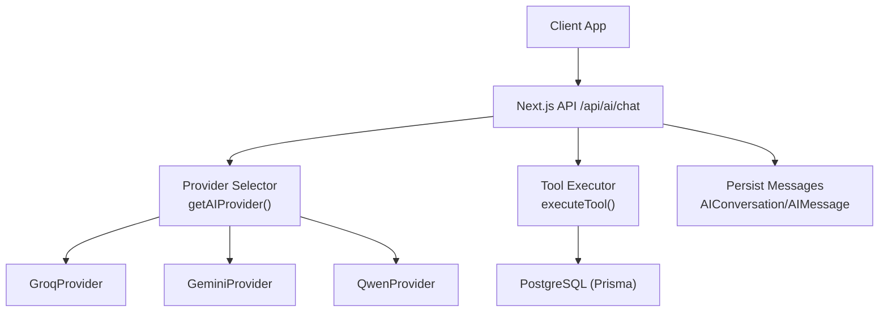
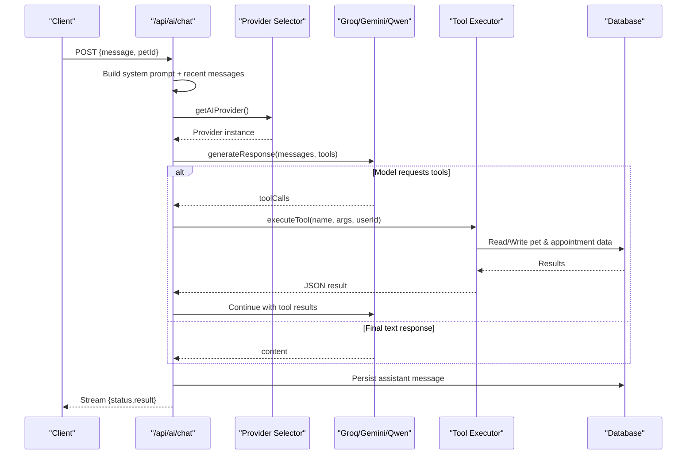
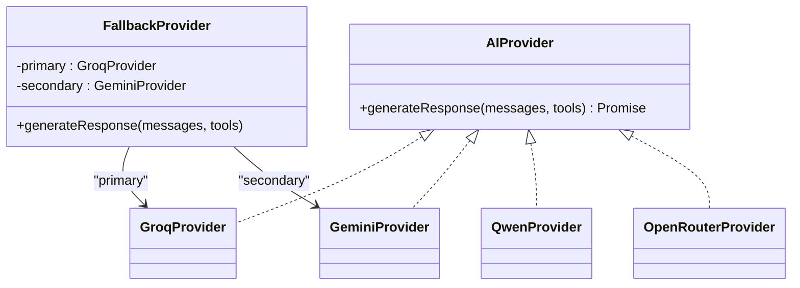
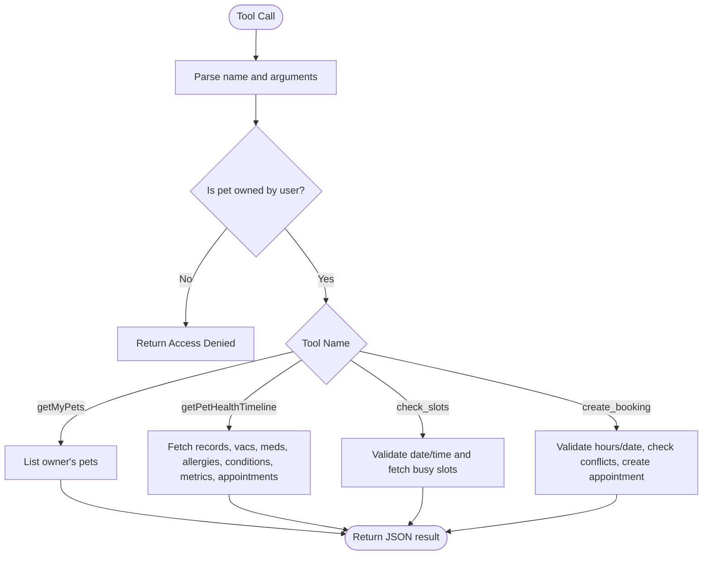
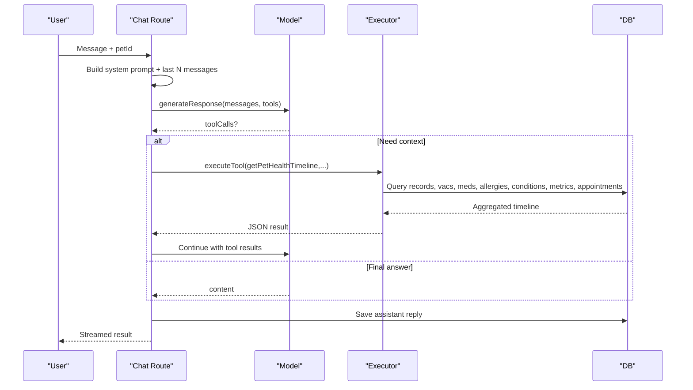
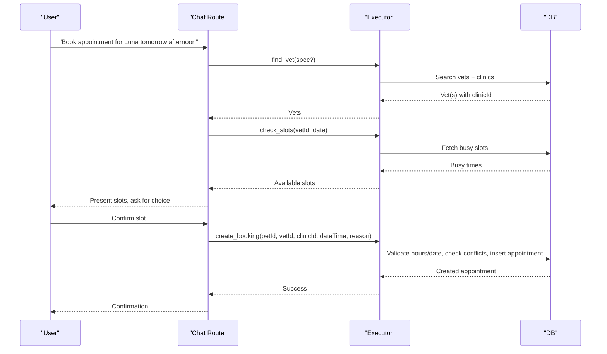
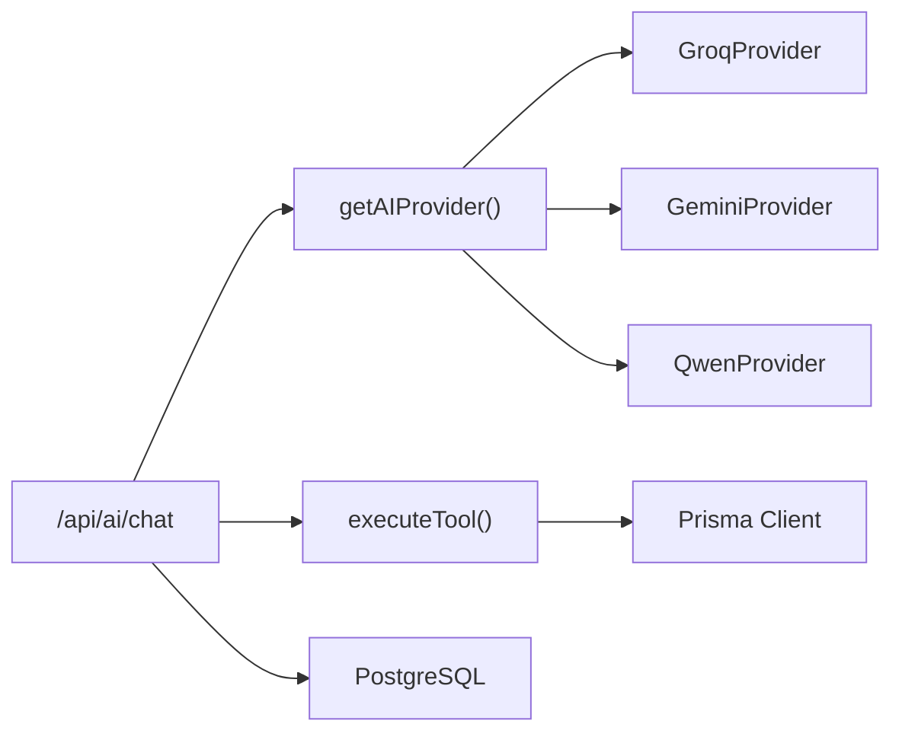

# AI Assistant Implementation

<cite>
**Referenced Files in This Document**
- [lib/ai.ts](file://lib/ai.ts)
- [app/api/ai/chat/route.ts](file://app/api/ai/chat/route.ts)
- [lib/ai/providers/groq.ts](file://lib/ai/providers/groq.ts)
- [lib/ai/providers/gemini.ts](file://lib/ai/providers/gemini.ts)
- [lib/ai/providers/qwen.ts](file://lib/ai/providers/qwen.ts)
- [prisma/schema.prisma](file://prisma/schema.prisma)
- [app/api/appointments/route.ts](file://app/api/appointments/route.ts)
- [app/api/appointments/[appointmentId]/route.ts](file://app/api/appointments/[appointmentId]/route.ts)
- [docs/03-architecture/04-ai-architecture.md](file://docs/03-architecture/04-ai-architecture.md)
</cite>

## Table of Contents
1. Introduction
2. Project Structure
3. Core Components
4. Architecture Overview
5. Detailed Component Analysis
6. Dependency Analysis
7. Performance Considerations
8. Troubleshooting Guide
9. Conclusion
10. Appendices

## Introduction
This document explains the PETIVA AI Assistant implementation, focusing on:
- Multi-provider AI architecture supporting Groq, Gemini, and Qwen via OpenRouter-style integration with automatic fallback for reliability.
- Tool execution framework enabling AI actions such as pet health consultations, medical record analysis, and automated appointment scheduling.
- Pet health context management that supplies relevant medical history, vaccination records, and medication information to AI queries.
- Configuration options, prompt engineering for veterinary contexts, performance optimization strategies, error handling, monitoring, and ethical considerations.

## Project Structure
The AI assistant is implemented as a Next.js API layer backed by Prisma and PostgreSQL. The core runtime includes:
- A provider abstraction and selection mechanism routing requests to Groq, Gemini, or Qwen.
- A tool registry and executor that safely call database operations for pet data and appointments.
- Streaming chat endpoints that persist conversation history and orchestrate multi-turn tool usage.
- Appointment APIs for listing, creating, and updating appointments with role-based authorization and conflict checks.

**Diagram sources**
- [app/api/ai/chat/route.ts:68-349](file://app/api/ai/chat/route.ts#L68-L349)
- [lib/ai.ts:112-139](file://lib/ai.ts#L112-L139)
- [lib/ai/providers/groq.ts:9-77](file://lib/ai/providers/groq.ts#L9-L77)
- [lib/ai/providers/gemini.ts:9-77](file://lib/ai/providers/gemini.ts#L9-L77)
- [lib/ai/providers/qwen.ts:9-76](file://lib/ai/providers/qwen.ts#L9-L76)
- [prisma/schema.prisma:280-296](file://prisma/schema.prisma#L280-L296)

**Section sources**
- [app/api/ai/chat/route.ts:68-349](file://app/api/ai/chat/route.ts#L68-L349)
- [lib/ai.ts:112-139](file://lib/ai.ts#L112-L139)
- [prisma/schema.prisma:280-296](file://prisma/schema.prisma#L280-L296)

## Core Components
- AI Providers: GroqProvider, GeminiProvider, QwenProvider implement a common interface for generating responses and tool calls.
- Provider Selection and Fallback: getAIProvider selects the active provider based on environment configuration; a FallbackProvider tries Groq then Gemini on failure.
- Tool Registry and Execution: AI_TOOLS defines function schemas; executeTool maps tool names to safe, authorized database operations.
- Chat Orchestration: /api/ai/chat builds system prompts, loads recent messages, streams results, and persists assistant replies.
- Appointment Management: REST endpoints list, create, and update appointments with robust authorization and conflict prevention.

**Section sources**
- [lib/ai.ts:21-103](file://lib/ai.ts#L21-L103)
- [lib/ai.ts:112-139](file://lib/ai.ts#L112-L139)
- [lib/ai.ts:142-281](file://lib/ai.ts#L142-L281)
- [lib/ai.ts:297-467](file://lib/ai.ts#L297-L467)
- [app/api/ai/chat/route.ts:68-349](file://app/api/ai/chat/route.ts#L68-L349)
- [app/api/appointments/route.ts:1-143](file://app/api/appointments/route.ts#L1-L143)
- [app/api/appointments/[appointmentId]/route.ts:1-119](file://app/api/appointments/[appointmentId]/route.ts#L1-L119)

## Architecture Overview
The AI subsystem uses an abstraction layer over multiple providers, ensuring resilience and flexibility. Requests flow through a streaming chat endpoint that:
- Authenticates users and resolves conversations per pet.
- Builds a vetting-focused system prompt with strict intent routing rules.
- Invokes tools when needed, executes them securely, and feeds results back into the model loop.
- Persists conversation turns and returns streamed status and result chunks.

**Diagram sources**
- [app/api/ai/chat/route.ts:68-349](file://app/api/ai/chat/route.ts#L68-L349)
- [lib/ai.ts:112-139](file://lib/ai.ts#L112-L139)
- [lib/ai.ts:297-467](file://lib/ai.ts#L297-L467)
- [prisma/schema.prisma:280-296](file://prisma/schema.prisma#L280-L296)

## Detailed Component Analysis

### Multi-Provider AI Architecture
- Provider Interface: All providers implement generateResponse(messages, tools) returning assistant content and optional tool calls.
- Active Provider: BOOKING_ASSISTANT_PROVIDER selects Qwen, Gemini, or Groq at runtime; defaults to a FallbackProvider if unspecified.
- Fallback Strategy: On primary provider failure, the FallbackProvider retries with the secondary provider to improve reliability.
- OpenRouter Integration: An OpenRouterProvider is available for routing to models like Gemini via OpenRouter’s endpoint.

**Diagram sources**
- [lib/ai.ts:21-103](file://lib/ai.ts#L21-L103)
- [lib/ai.ts:112-139](file://lib/ai.ts#L112-L139)
- [lib/ai/providers/groq.ts:9-77](file://lib/ai/providers/groq.ts#L9-L77)
- [lib/ai/providers/gemini.ts:9-77](file://lib/ai/providers/gemini.ts#L9-L77)
- [lib/ai/providers/qwen.ts:9-76](file://lib/ai/providers/qwen.ts#L9-L76)

**Section sources**
- [lib/ai.ts:21-103](file://lib/ai.ts#L21-L103)
- [lib/ai.ts:112-139](file://lib/ai.ts#L112-L139)
- [lib/ai/providers/groq.ts:9-77](file://lib/ai/providers/groq.ts#L9-L77)
- [lib/ai/providers/gemini.ts:9-77](file://lib/ai/providers/gemini.ts#L9-L77)
- [lib/ai/providers/qwen.ts:9-76](file://lib/ai/providers/qwen.ts#L9-L76)

### Tool Execution Framework
- Tool Definitions: AI_TOOLS declares functions for retrieving pet profiles, health timelines, vaccinations, medications, allergies, appointments, finding veterinarians, checking availability, and creating bookings.
- Authorization: verifyPetOwnership ensures callers only access their own pets before executing read/write tools.
- Scheduling Logic: check_slots validates dates and working hours; create_booking enforces ownership, working hours, past-date checks, and double-booking prevention.

**Diagram sources**
- [lib/ai.ts:142-281](file://lib/ai.ts#L142-L281)
- [lib/ai.ts:284-295](file://lib/ai.ts#L284-L295)
- [lib/ai.ts:297-467](file://lib/ai.ts#L297-L467)

**Section sources**
- [lib/ai.ts:142-281](file://lib/ai.ts#L142-L281)
- [lib/ai.ts:284-295](file://lib/ai.ts#L284-L295)
- [lib/ai.ts:297-467](file://lib/ai.ts#L297-L467)

### Pet Health Context Management
- System Prompt: The chat route injects a comprehensive system instruction set that defines intent routing, safety guardrails, and explicit rules for using tools during health and booking workflows.
- Context Assembly: Recent messages are limited to prevent context bloat; the active pet context is included when provided to tailor responses.
- Data Retrieval: Tools aggregate medical records, vaccinations, medications, allergies, conditions, metrics, and appointments to support accurate, evidence-based answers.

**Diagram sources**
- [app/api/ai/chat/route.ts:145-183](file://app/api/ai/chat/route.ts#L145-L183)
- [lib/ai.ts:297-467](file://lib/ai.ts#L297-L467)
- [prisma/schema.prisma:133-244](file://prisma/schema.prisma#L133-L244)

**Section sources**
- [app/api/ai/chat/route.ts:145-183](file://app/api/ai/chat/route.ts#L145-L183)
- [lib/ai.ts:297-467](file://lib/ai.ts#L297-L467)
- [prisma/schema.prisma:133-244](file://prisma/schema.prisma#L133-L244)

### Natural Language Processing for Pet Health Consultations
- Intent Routing: The system prompt instructs the model to classify intents (greetings, pet queries, health timeline retrieval, appointment lists, booking flows) and act accordingly without unnecessary tool invocations.
- Safety Guardrails: Emphasizes educational guidance, avoids autonomous diagnoses, and escalates emergencies appropriately.
- Evidence-Based Answers: Requires referencing stored records and avoiding fabrication; tool outputs are not persisted across turns, so IDs must be re-resolved before final booking confirmation.

**Section sources**
- [app/api/ai/chat/route.ts:145-183](file://app/api/ai/chat/route.ts#L145-L183)
- [docs/03-architecture/04-ai-architecture.md:69-88](file://docs/03-architecture/04-ai-architecture.md#L69-L88)

### Automated Appointment Scheduling Capabilities
- Availability Check: check_slots filters booked slots within working hours and rejects past dates.
- Booking Creation: create_booking enforces ownership, working hours, past-date validation, and double-booking prevention; creates an appointment with REQUESTED status.
- Direct Appointment APIs: /api/appointments supports listing, creation, and status updates with role-based authorization and audit logging.

**Diagram sources**
- [lib/ai.ts:297-467](file://lib/ai.ts#L297-L467)
- [app/api/appointments/route.ts:69-143](file://app/api/appointments/route.ts#L69-L143)
- [app/api/appointments/[appointmentId]/route.ts:1-119](file://app/api/appointments/[appointmentId]/route.ts#L1-L119)

**Section sources**
- [lib/ai.ts:297-467](file://lib/ai.ts#L297-L467)
- [app/api/appointments/route.ts:69-143](file://app/api/appointments/route.ts#L69-L143)
- [app/api/appointments/[appointmentId]/route.ts:1-119](file://app/api/appointments/[appointmentId]/route.ts#L1-L119)

### Integration with Medical Records System
- Data Models: The schema defines entities for pets, medical records, versions, vaccinations, medications, allergies, conditions, metrics, and appointments.
- Tool Queries: The health timeline tool aggregates multiple related tables to provide a comprehensive view for AI reasoning.
- Ownership Enforcement: All pet-scoped reads enforce ownership verification before returning data.

**Section sources**
- [prisma/schema.prisma:68-244](file://prisma/schema.prisma#L68-L244)
- [lib/ai.ts:316-335](file://lib/ai.ts#L316-L335)

## Dependency Analysis
- Provider Coupling: The chat route depends on getAIProvider, which dynamically instantiates one of several provider classes. Each provider encapsulates its own credentials and endpoint details.
- Tool Dependencies: executeTool depends on Prisma client and database schema; it performs authorization checks and business validations before mutating state.
- Conversation Persistence: The chat route persists AIMessage entries linked to AIConversation, enabling multi-turn interactions scoped to a pet.

**Diagram sources**
- [app/api/ai/chat/route.ts:68-349](file://app/api/ai/chat/route.ts#L68-L349)
- [lib/ai.ts:112-139](file://lib/ai.ts#L112-L139)
- [lib/ai.ts:297-467](file://lib/ai.ts#L297-L467)
- [prisma/schema.prisma:280-296](file://prisma/schema.prisma#L280-L296)

**Section sources**
- [app/api/ai/chat/route.ts:68-349](file://app/api/ai/chat/route.ts#L68-L349)
- [lib/ai.ts:112-139](file://lib/ai.ts#L112-L139)
- [lib/ai.ts:297-467](file://lib/ai.ts#L297-L467)
- [prisma/schema.prisma:280-296](file://prisma/schema.prisma#L280-L296)

## Performance Considerations
- Context Window Limits: Limit recent messages to reduce token usage and latency; the chat route retrieves up to 20 messages per conversation.
- Tool Efficiency: Batch-related queries where possible (e.g., health timeline aggregates multiple tables).
- Provider Latency: Use fallback provider to mitigate outages; consider caching frequent lookups (e.g., vet listings) if appropriate.
- Streaming Responses: The chat endpoint streams status and result chunks to improve perceived responsiveness.

[No sources needed since this section provides general guidance]

## Troubleshooting Guide
- Missing Credentials: Providers throw errors if required API keys are not configured; ensure environment variables are set for the selected provider.
- Invalid Responses: Providers validate response structure; unexpected formats trigger errors indicating invalid structures.
- Authorization Errors: Tools enforce pet ownership; attempts to access another user’s pet return access denied.
- Scheduling Conflicts: check_slots and create_booking reject past dates, outside working hours, and double-booked slots; consult error messages to adjust inputs.
- Stream Aborts: The chat stream handles client aborts gracefully; ensure clients handle partial responses and close connections properly.

**Section sources**
- [lib/ai/providers/groq.ts:20-22](file://lib/ai/providers/groq.ts#L20-L22)
- [lib/ai/providers/gemini.ts:20-22](file://lib/ai/providers/gemini.ts#L20-L22)
- [lib/ai/providers/qwen.ts:20-22](file://lib/ai/providers/qwen.ts#L20-L22)
- [lib/ai.ts:284-295](file://lib/ai.ts#L284-L295)
- [lib/ai.ts:375-467](file://lib/ai.ts#L375-L467)
- [app/api/ai/chat/route.ts:194-224](file://app/api/ai/chat/route.ts#L194-L224)

## Conclusion
The PETIVA AI Assistant integrates a robust, multi-provider AI backend with a secure tool execution framework to deliver pet health consultations and automated appointment scheduling. By enforcing strict authorization, providing clear system prompts, and implementing fallback mechanisms, the system balances reliability, safety, and usability. Continuous monitoring of provider performance and careful prompt engineering will further enhance accuracy and efficiency.

[No sources needed since this section summarizes without analyzing specific files]

## Appendices

### Configuration Options
- Provider Selection: Set BOOKING_ASSISTANT_PROVIDER to qwen, gemini, or groq; default falls back to a resilient provider chain.
- API Keys: Configure OPENROUTER_API_KEY, GROQ_API_KEY, GEMINI_API_KEY, DASHSCOPE_API_KEY as needed for chosen providers.
- Model Selection: Adjust model strings in provider implementations to switch between model variants.

**Section sources**
- [lib/ai.ts:110-139](file://lib/ai.ts#L110-L139)
- [lib/ai/providers/groq.ts:12-14](file://lib/ai/providers/groq.ts#L12-L14)
- [lib/ai/providers/gemini.ts:12-14](file://lib/ai/providers/gemini.ts#L12-L14)
- [lib/ai/providers/qwen.ts:12-14](file://lib/ai/providers/qwen.ts#L12-L14)

### Prompt Engineering for Veterinary Contexts
- Intent Routing: Define clear rules for greetings, pet queries, health timeline retrieval, appointment lists, and booking flows.
- Safety Guardrails: Instruct the model to avoid autonomous diagnoses, emphasize educational guidance, and escalate emergencies.
- Evidence-Based Responses: Require referencing stored records and prohibit fabricating outcomes; mandate re-resolving IDs before final booking confirmation.

**Section sources**
- [app/api/ai/chat/route.ts:145-183](file://app/api/ai/chat/route.ts#L145-L183)
- [docs/03-architecture/04-ai-architecture.md:69-88](file://docs/03-architecture/04-ai-architecture.md#L69-L88)

### Monitoring Approaches
- Diagnostic Logs: Provider selection and tool execution emit diagnostic logs to aid troubleshooting.
- Audit Logging: Appointment status changes are audited for security and compliance.
- Token Usage: Consider capturing token counts from provider responses to monitor costs and optimize context windows.

**Section sources**
- [lib/ai.ts:127-129](file://lib/ai.ts#L127-L129)
- [lib/ai.ts:300-301](file://lib/ai.ts#L300-L301)
- [app/api/appointments/[appointmentId]/route.ts:94-103](file://app/api/appointments/[appointmentId]/route.ts#L94-L103)

### Ethical Considerations and Limitations
- Not a Substitute for Professional Care: AI-generated advice should be educational and never replace licensed veterinary diagnosis or treatment.
- Emergency Escalation: For critical symptoms, recommend immediate professional care rather than relying on AI suggestions.
- Transparency: Clearly communicate limitations and disclaimers to users regarding AI-generated medical information.

**Section sources**
- [docs/03-architecture/04-ai-architecture.md:69-88](file://docs/03-architecture/04-ai-architecture.md#L69-L88)