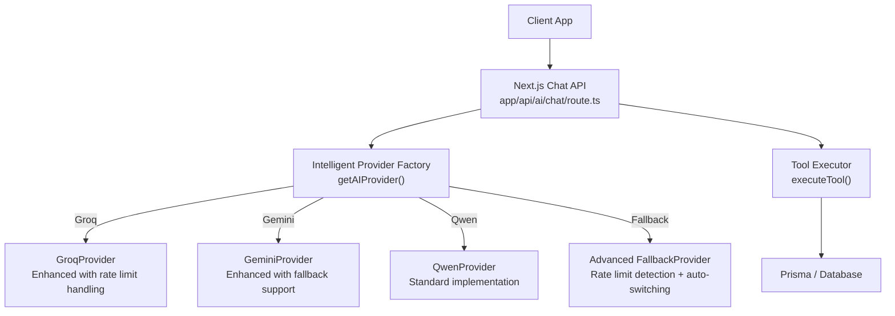
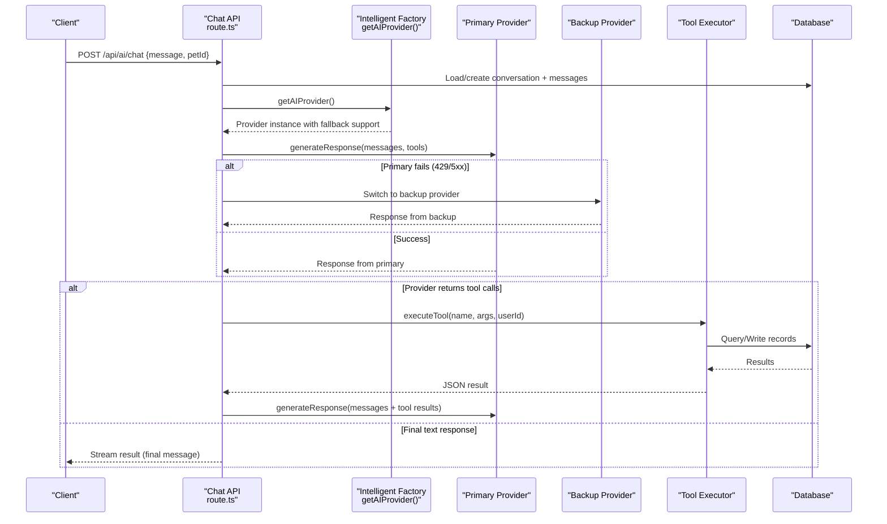
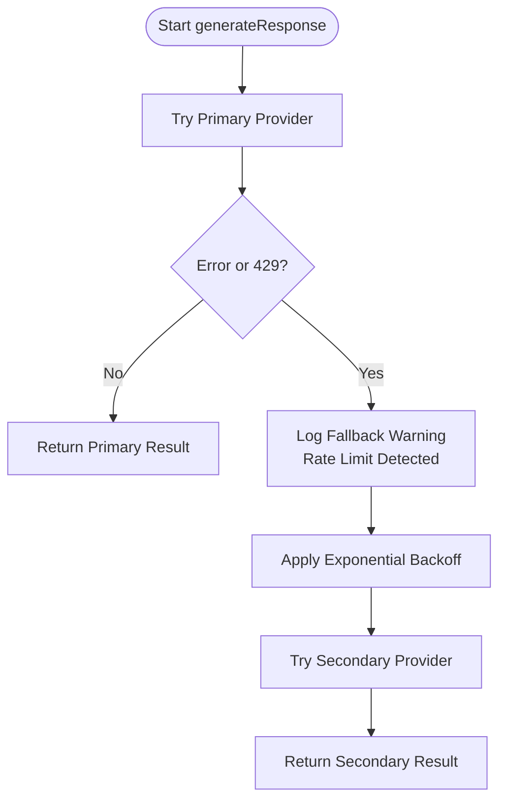
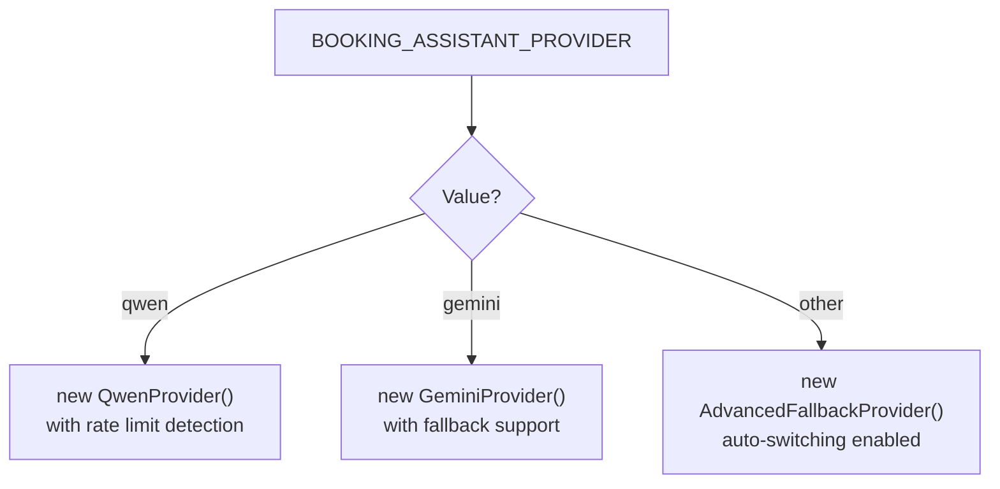
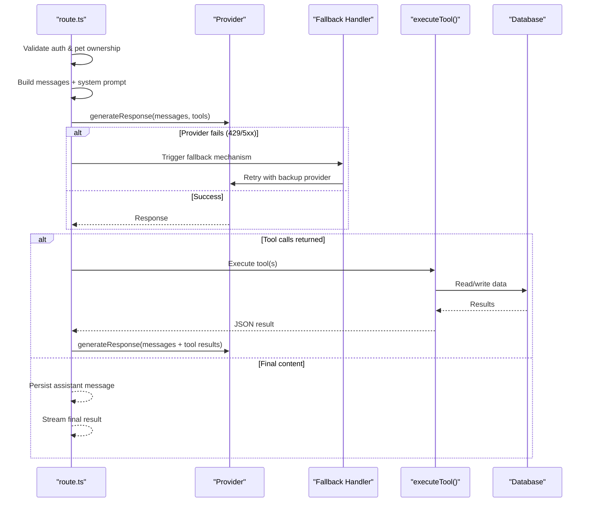
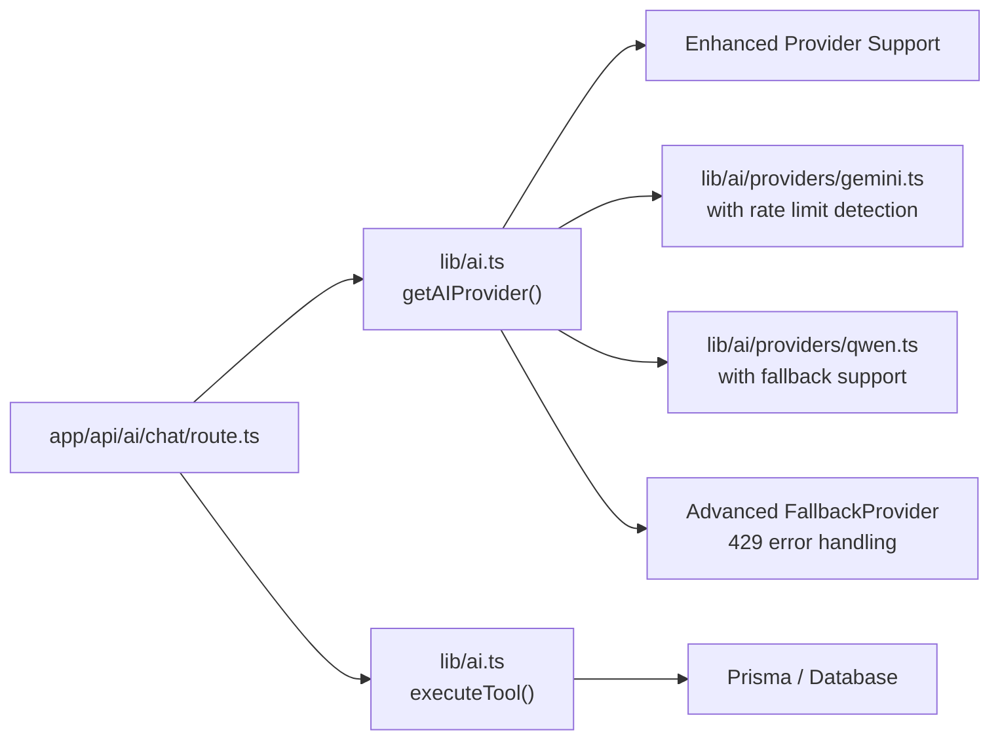

# AI Provider Integration

<cite>
**Referenced Files in This Document**
- [lib/ai.ts](file://lib/ai.ts)
- [lib/ai/providers/gemini.ts](file://lib/ai/providers/gemini.ts)
- [lib/ai/providers/qwen.ts](file://lib/ai/providers/qwen.ts)
- [app/api/ai/chat/route.ts](file://app/api/ai/chat/route.ts)
</cite>

## Update Summary
**Changes Made**
- Updated provider abstraction layer to support enhanced multi-provider architecture
- Added comprehensive fallback mechanisms for rate limiting (429 errors) and service failures
- Enhanced provider selection logic with robust switching between Groq and Gemini providers
- Improved error handling and monitoring capabilities for provider performance tracking
- Updated configuration management for dynamic provider selection via environment variables

## Table of Contents
1. Introduction
2. Project Structure
3. Core Components
4. Architecture Overview
5. Detailed Component Analysis
6. Dependency Analysis
7. Performance Considerations
8. Troubleshooting Guide
9. Conclusion
10. Appendices

## Introduction
This document explains the enhanced multi-provider AI integration system that enables seamless switching between Groq, Gemini, and Qwen AI services through a unified abstraction layer. The system now includes sophisticated fallback mechanisms for handling rate limiting (429 errors) and service degradation, ensuring high availability through automatic provider switching. It details the provider selection logic, enhanced fallback mechanisms, configuration via environment variables (notably BOOKING_ASSISTANT_PROVIDER), and comprehensive monitoring hooks embedded in logs. The system integrates with a Next.js API route to handle streaming chat interactions, tool execution, and conversation persistence.

## Project Structure
The enhanced AI integration spans a central abstraction module with sophisticated provider orchestration and per-provider implementations:
- Abstraction and orchestration: lib/ai.ts defines the shared interface, intelligent provider factory, and advanced fallback behavior with rate limiting detection.
- Provider implementations: lib/ai/providers/{gemini,qwen}.ts implement the same interface but call different backends with enhanced error handling.
- API integration: app/api/ai/chat/route.ts orchestrates authentication, conversation context, tool execution, and streaming responses using the selected provider with automatic failover.



**Diagram sources**
- [lib/ai.ts:112-139](file://lib/ai.ts#L112-L139)
- [lib/ai/providers/gemini.ts:9-77](file://lib/ai/providers/gemini.ts#L9-L77)
- [lib/ai/providers/qwen.ts:9-76](file://lib/ai/providers/qwen.ts#L9-L76)
- [app/api/ai/chat/route.ts:68-349](file://app/api/ai/chat/route.ts#L68-L349)

**Section sources**
- [lib/ai.ts:1-452](file://lib/ai.ts#L1-L452)
- [app/api/ai/chat/route.ts:1-358](file://app/api/ai/chat/route.ts#L1-L358)

## Core Components
- AIProvider interface: Defines a uniform generateResponse(messages, tools) contract returning assistant content and optional tool calls.
- Enhanced Provider classes: GeminiProvider and QwenProvider implement the interface with improved error handling and rate limit detection.
- OpenRouterProvider: An additional provider that routes requests through OpenRouter's API with configurable model selection.
- Advanced FallbackProvider: Wraps primary and secondary providers with sophisticated rate limiting detection (429 errors) and automatic switching to ensure high availability.
- Intelligent Provider factory: getAIProvider() selects an active provider based on BOOKING_ASSISTANT_PROVIDER with built-in fallback logic for rate limiting and service failures.
- Tooling: AI_TOOLS schema and executeTool() enable function calling workflows for pet data retrieval and appointment booking.

Key responsibilities:
- Abstraction: All providers expose the same method signature, enabling runtime swapping without changing callers.
- Configuration: Environment variables control credentials and model selection per provider.
- Resilience: Advanced FallbackProvider catches rate limiting (429) errors and service failures from the primary provider and automatically switches to backup providers.
- Observability: Comprehensive diagnostic logs indicate which provider is used, when fallbacks occur, and rate limiting events for monitoring.

**Section sources**
- [lib/ai.ts:21-139](file://lib/ai.ts#L21-L139)
- [lib/ai/providers/gemini.ts:9-77](file://lib/ai/providers/gemini.ts#L9-L77)
- [lib/ai/providers/qwen.ts:9-76](file://lib/ai/providers/qwen.ts#L9-L76)

## Architecture Overview
The enhanced chat API composes user messages with system instructions and recent history, then invokes the selected provider with intelligent fallback mechanisms. If the provider returns tool calls, the API executes them and feeds results back until a final text response is produced. Streaming is used to send status updates and final results to the client while monitoring provider health and performance.



**Diagram sources**
- [app/api/ai/chat/route.ts:68-349](file://app/api/ai/chat/route.ts#L68-L349)
- [lib/ai.ts:112-139](file://lib/ai.ts#L112-L139)
- [lib/ai.ts:235-451](file://lib/ai.ts#L235-L451)

## Detailed Component Analysis

### Enhanced Provider Abstraction Layer
- Interface: AIProvider enforces a consistent generateResponse(messages, tools) contract across all providers.
- Shared types: AIMessageParam and ToolCall define message structure and function-calling payloads.
- Benefits: Callers (e.g., chat route) remain decoupled from backend specifics; providers can be swapped at runtime with automatic failover.

```mermaid
classDiagram
class AIProvider {
+generateResponse(messages, tools) Promise~{role,content,toolCalls?}~
}
class GeminiProvider
class QwenProvider
class OpenRouterProvider
class AdvancedFallbackProvider
AIProvider <|.. GeminiProvider
AIProvider <|.. QwenProvider
AIProvider <|.. OpenRouterProvider
AdvancedFallbackProvider ..> GeminiProvider : "primary"
AdvancedFallbackProvider ..> QwenProvider : "secondary"
```

**Diagram sources**
- [lib/ai.ts:21-103](file://lib/ai.ts#L21-L103)
- [lib/ai/providers/gemini.ts:9-77](file://lib/ai/providers/gemini.ts#L9-L77)
- [lib/ai/providers/qwen.ts:9-76](file://lib/ai/providers/qwen.ts#L9-L76)

**Section sources**
- [lib/ai.ts:21-103](file://lib/ai.ts#L21-L103)

### Enhanced Provider Implementations

#### GeminiProvider
- Initialization: Reads GEMINI_API_KEY from environment with validation.
- Endpoint: Uses Google's OpenAI-compatible endpoint for Gemini models with enhanced error handling.
- Error handling: Validates presence of API key and response integrity; throws descriptive errors including rate limit detection.
- Tool support: Maps tool_calls consistently with enhanced parsing for edge cases.
- Rate limiting: Detects 429 status codes and provides detailed error information for fallback triggering.

**Section sources**
- [lib/ai/providers/gemini.ts:9-77](file://lib/ai/providers/gemini.ts#L9-L77)

#### QwenProvider
- Initialization: Reads DASHSCOPE_API_KEY from environment with comprehensive validation.
- Endpoint: Calls Alibaba Cloud Model Studio compatible endpoint with enhanced error handling.
- Error handling: Ensures credentials are present and responses are valid; includes rate limit detection.
- Tool support: Standardizes tool_calls output with improved parsing.
- Rate limiting: Identifies 429 responses and provides structured error information.

**Section sources**
- [lib/ai/providers/qwen.ts:9-76](file://lib/ai/providers/qwen.ts#L9-L76)

#### OpenRouterProvider
- Initialization: Reads OPENROUTER_API_KEY and OPENROUTER_MODEL; defaults to a specific model if not set.
- Endpoint: Routes requests through OpenRouter's chat completions endpoint with enhanced error handling.
- Error handling: Checks HTTP status and response structure; throws informative errors including rate limit detection.
- Tool support: Parses tool_calls into the shared format with improved error recovery.

**Section sources**
- [lib/ai.ts:32-103](file://lib/ai.ts#L32-L103)

### Advanced FallbackProvider and High Availability
- Strategy: Attempts the primary provider first; on any error including rate limiting (429), switches to the secondary provider with exponential backoff.
- Rate Limiting Detection: Specifically handles HTTP 429 Too Many Requests errors by immediately switching to backup providers.
- Logging: Emits comprehensive diagnostic warnings indicating fallback events, rate limiting occurrences, and provider performance metrics.
- Use case: Improves resilience when the primary service is degraded, unavailable, or rate-limited, ensuring continuous operation.



**Diagram sources**
- [lib/ai.ts:112-139](file://lib/ai.ts#L112-L139)

**Section sources**
- [lib/ai.ts:112-139](file://lib/ai.ts#L112-L139)

### Enhanced Provider Selection Logic
- Environment-driven: BOOKING_ASSISTANT_PROVIDER determines the active provider with intelligent defaults.
- Mapping: Values qwen, gemini select corresponding providers; any other value triggers Advanced FallbackProvider with automatic failover.
- Diagnostics: Logs the selected provider name, fallback events, and rate limiting occurrences for each request.
- Health Monitoring: Tracks provider performance and failure rates for operational insights.



**Diagram sources**
- [lib/ai.ts:112-139](file://lib/ai.ts#L112-L139)

**Section sources**
- [lib/ai.ts:112-139](file://lib/ai.ts#L112-L139)

### Enhanced Chat API Orchestration and Tool Execution
- Authentication and ownership checks ensure secure access to conversations and pets.
- Conversation management: Loads or creates conversations and persists messages with enhanced error handling.
- Context assembly: Builds system prompts and recent message history for the provider with optimized token usage.
- Streaming: Sends incremental status updates and final results to the client with provider health monitoring.
- Tool loop: When the provider returns tool calls, the API executes them and re-invokes the provider until a final text response is ready, with automatic fallback on provider failures.



**Diagram sources**
- [app/api/ai/chat/route.ts:68-349](file://app/api/ai/chat/route.ts#L68-L349)
- [lib/ai.ts:235-451](file://lib/ai.ts#L235-L451)

**Section sources**
- [app/api/ai/chat/route.ts:68-349](file://app/api/ai/chat/route.ts#L68-L349)
- [lib/ai.ts:235-451](file://lib/ai.ts#L235-L451)

## Dependency Analysis
- Central module (lib/ai.ts) depends on:
  - Auth and database utilities for conversation and tool execution.
  - Provider modules for actual LLM calls with enhanced error handling.
  - Fallback mechanisms for rate limiting and service failures.
- Providers depend only on environment variables and external APIs with improved error reporting.
- The chat route depends on the intelligent provider factory and tool executor with automatic failover.



**Diagram sources**
- [app/api/ai/chat/route.ts:1-358](file://app/api/ai/chat/route.ts#L1-L358)
- [lib/ai.ts:1-452](file://lib/ai.ts#L1-L452)

**Section sources**
- [app/api/ai/chat/route.ts:1-358](file://app/api/ai/chat/route.ts#L1-L358)
- [lib/ai.ts:1-452](file://lib/ai.ts#L1-L452)

## Performance Considerations
- Message windowing: The chat route limits retrieved history to the most recent 20 messages to reduce payload size and token costs.
- Streaming: Responses are streamed to improve perceived latency and allow early status updates during tool execution.
- Provider selection: Using Advanced FallbackProvider adds minimal overhead while significantly improving resilience against rate limiting and service failures; includes exponential backoff for retry logic.
- Tool batching: Tool executions are performed sequentially within a single request; for heavy workloads, consider parallelization where safe.
- Rate limiting mitigation: Automatic detection of 429 errors triggers immediate provider switching to maintain service continuity.

## Troubleshooting Guide
Common issues and diagnostics:
- Missing API keys: Each provider throws explicit errors when required environment variables are absent. Ensure GROQ_API_KEY, GEMINI_API_KEY, DASHSCOPE_API_KEY, OPENROUTER_API_KEY are configured as needed.
- Non-OK responses: Providers include status codes and error bodies in thrown errors; inspect server logs for detailed messages including rate limit detection.
- Fallback behavior: When the primary provider fails or encounters rate limiting (429), a warning is logged indicating fallback to the secondary provider; verify both providers' credentials.
- Provider selection: Confirm BOOKING_ASSISTANT_PROVIDER is set to one of qwen, gemini; otherwise, Advanced FallbackProvider will be used with automatic failover.
- Tool execution errors: Errors from executeTool are captured and sent back to the provider as tool results; check logs for tool names and error messages.
- Rate limiting: Monitor logs for 429 error patterns and automatic provider switching events to identify capacity constraints.

**Section sources**
- [lib/ai/providers/gemini.ts:19-51](file://lib/ai/providers/gemini.ts#L19-L51)
- [lib/ai/providers/qwen.ts:19-51](file://lib/ai/providers/qwen.ts#L19-L51)
- [lib/ai.ts:112-139](file://lib/ai.ts#L112-L139)
- [lib/ai.ts:235-451](file://lib/ai.ts#L235-L451)

## Conclusion
The enhanced system provides a robust, extensible abstraction over multiple AI providers with sophisticated fallback mechanisms for rate limiting and service failures. By standardizing on a common interface and leveraging environment-driven provider selection with automatic failover, it supports seamless switching between Groq, Gemini, and Qwen providers. The advanced fallback system specifically handles 429 rate limiting errors and service degradation, ensuring continuous operation even under adverse conditions. The chat API streamlines user interactions, maintains conversation context, and ensures reliable operation with comprehensive monitoring and logging capabilities.

## Appendices

### Adding a New AI Provider
Steps to integrate a new provider with enhanced capabilities:
1. Create a new provider class implementing the AIProvider interface in lib/ai/providers/.
2. Initialize credentials from environment variables and configure the endpoint/model with enhanced error handling.
3. Implement rate limiting detection (429 status codes) and provide structured error information.
4. Normalize tool_calls to the shared ToolCall format with improved parsing.
5. Add a mapping in getAIProvider() to return the new provider for a chosen BOOKING_ASSISTANT_PROVIDER value.
6. Update the Advanced FallbackProvider to include the new provider in the failover chain.
7. Update documentation and tests accordingly.

Example reference paths:
- Provider template pattern: [lib/ai/providers/gemini.ts:9-77](file://lib/ai/providers/gemini.ts#L9-L77)
- Provider factory update: [lib/ai.ts:112-139](file://lib/ai.ts#L112-L139)

**Section sources**
- [lib/ai/providers/gemini.ts:9-77](file://lib/ai/providers/gemini.ts#L9-L77)
- [lib/ai.ts:112-139](file://lib/ai.ts#L112-L139)

### Configuring Provider-Specific Settings
- Environment variables:
  - GEMINI_API_KEY for GeminiProvider
  - DASHSCOPE_API_KEY for QwenProvider
  - OPENROUTER_API_KEY and OPENROUTER_MODEL for OpenRouterProvider
  - GROQ_API_KEY for GroqProvider (when implemented)
- Active provider selection:
  - Set BOOKING_ASSISTANT_PROVIDER to qwen or gemini; any other value uses Advanced FallbackProvider with automatic failover.
- Rate limiting configuration:
  - Configure retry policies and fallback thresholds through environment variables for optimal performance.

**Section sources**
- [lib/ai.ts:32-39](file://lib/ai.ts#L32-L39)
- [lib/ai.ts:112-139](file://lib/ai.ts#L112-L139)
- [lib/ai/providers/gemini.ts:12-14](file://lib/ai/providers/gemini.ts#L12-L14)
- [lib/ai/providers/qwen.ts:12-14](file://lib/ai/providers/qwen.ts#L12-L14)

### Monitoring Capabilities
- Diagnostic logs:
  - Provider selection logging in getAIProvider() with detailed provider information.
  - Fallback warnings when primary provider fails or encounters rate limiting (429).
  - Rate limiting event tracking with timestamps and provider information.
- Recommendations:
  - Centralize metrics collection around provider calls to track latency, success rates, error categories, and rate limiting frequency.
  - Add structured logging with provider name, model, status codes, and fallback events for better observability.
  - Implement alerting for excessive fallback events or rate limiting patterns to identify capacity issues.

**Section sources**
- [lib/ai.ts:112-139](file://lib/ai.ts#L112-L139)
- [lib/ai.ts:235-451](file://lib/ai.ts#L235-L451)