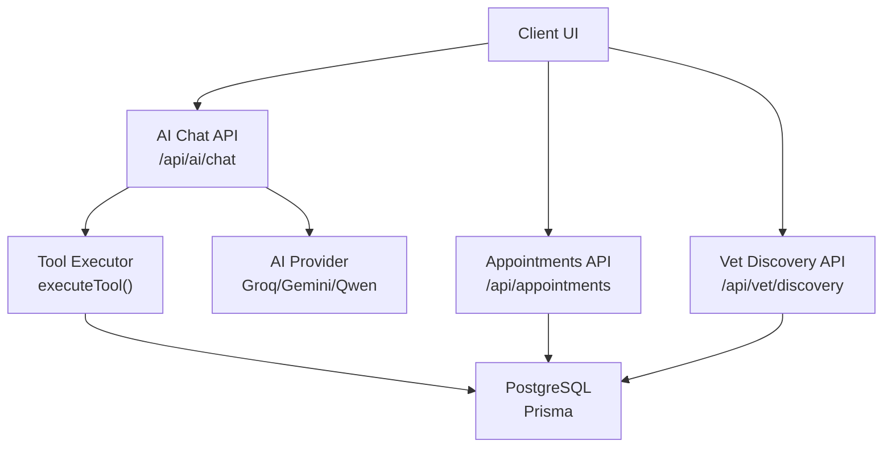
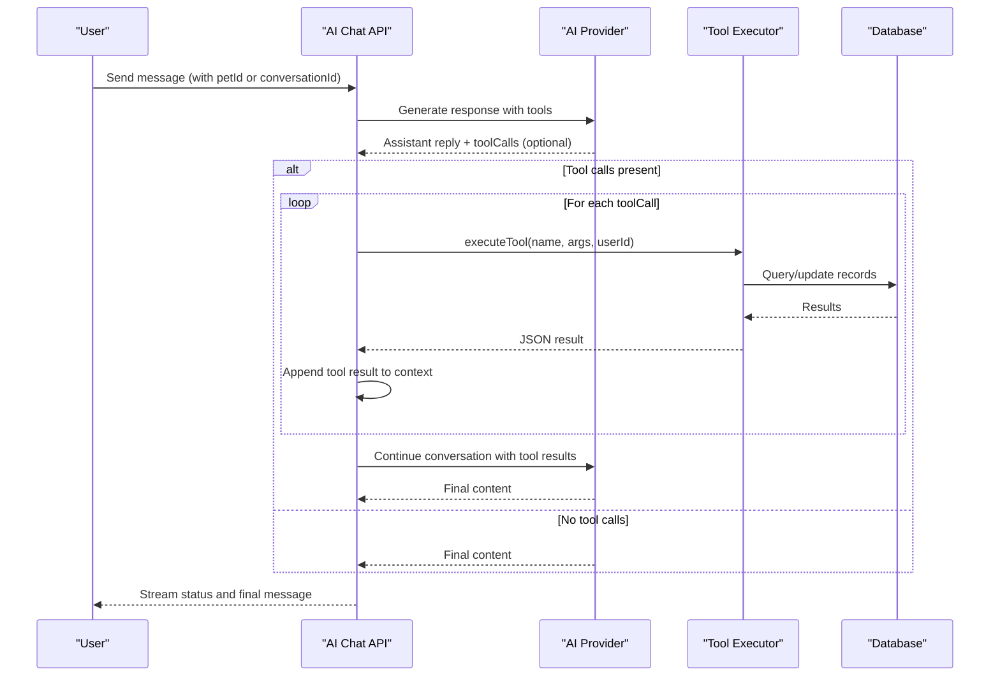
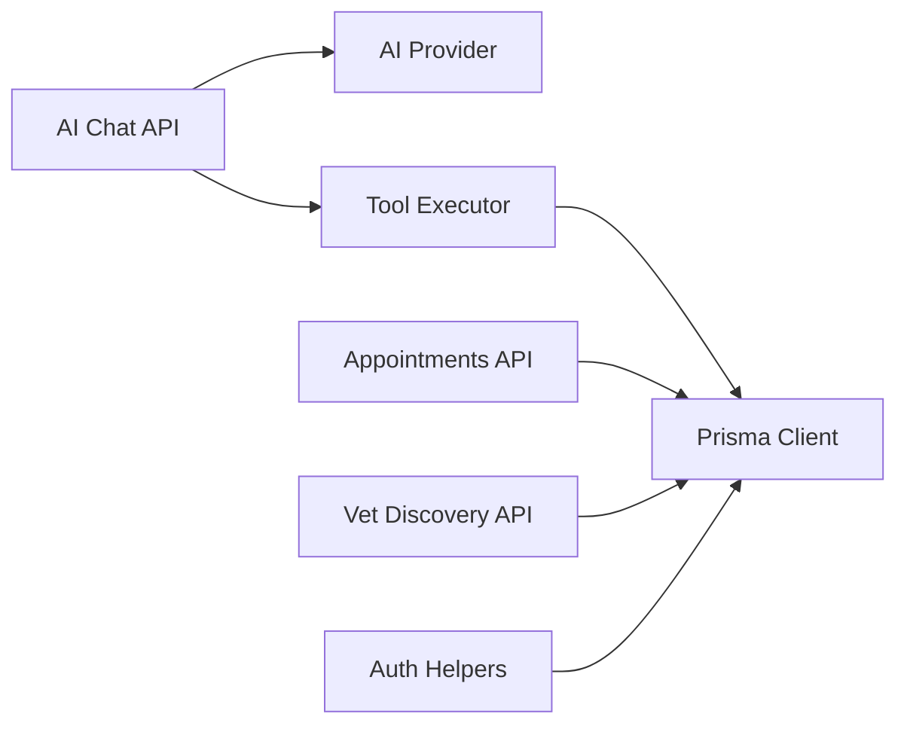
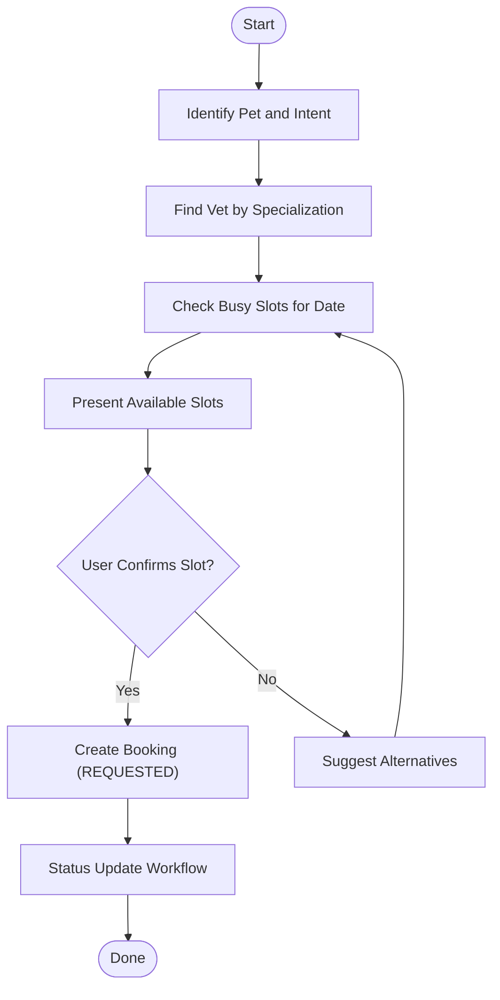

# Appointment Automation

<cite>
**Referenced Files in This Document**
- [route.ts](file://app/api/ai/chat/route.ts)
- [route.ts](file://app/api/appointments/route.ts)
- [route.ts](file://app/api/appointments/[appointmentId]/route.ts)
- [route.ts](file://app/api/vet/discovery/route.ts)
- [schema.prisma](file://prisma/schema.prisma)
- [ai.ts](file://lib/ai.ts)
- [auth.ts](file://lib/auth.ts)
- [04-ai-architecture.md](file://docs/03-architecture/04-ai-architecture.md)
- [01-system-architecture.md](file://docs/03-architecture/01-system-architecture.md)
</cite>

## Table of Contents
1. Introduction
2. Project Structure
3. Core Components
4. Architecture Overview
5. Detailed Component Analysis
6. Dependency Analysis
7. Performance Considerations
8. Troubleshooting Guide
9. Conclusion
10. Appendices

## Introduction
This document explains the automated appointment booking system that enables AI assistants to schedule veterinary appointments through natural conversation. It covers the end-to-end workflow from a pet consultation request to a confirmed appointment, vet discovery based on medical needs and clinic associations, availability checking against working hours and existing bookings, conflict resolution, and manual override procedures. It also documents timezone handling for international clinics and business rule enforcement across the system.

## Project Structure
The appointment automation is implemented as a set of Next.js API routes backed by Prisma with PostgreSQL. The AI assistant orchestrates multi-turn conversations, invokes tools (functions) to retrieve data and perform actions, and persists conversation history. Appointments are created, validated, and managed via dedicated endpoints. Vet discovery returns available veterinarians and their associated clinics.

**Diagram sources**
- [route.ts:1-347](file://app/api/ai/chat/route.ts#L1-L347)
- [route.ts:1-143](file://app/api/appointments/route.ts#L1-L143)
- [route.ts:1-119](file://app/api/appointments/[appointmentId]/route.ts#L1-L119)
- [route.ts:1-60](file://app/api/vet/discovery/route.ts#L1-L60)
- [schema.prisma:1-312](file://prisma/schema.prisma#L1-L312)
- [ai.ts:1-423](file://lib/ai.ts#L1-L423)

**Section sources**
- [route.ts:1-347](file://app/api/ai/chat/route.ts#L1-L347)
- [route.ts:1-143](file://app/api/appointments/route.ts#L1-L143)
- [route.ts:1-119](file://app/api/appointments/[appointmentId]/route.ts#L1-L119)
- [route.ts:1-60](file://app/api/vet/discovery/route.ts#L1-L60)
- [schema.prisma:1-312](file://prisma/schema.prisma#L1-L312)
- [ai.ts:1-423](file://lib/ai.ts#L1-L423)

## Core Components
- AI Chat Orchestrator: Manages conversation state, loads context, streams responses, and executes tool calls for data retrieval and booking actions.
- Tool Execution Layer: Implements functions for retrieving pets, health timelines, appointments, finding vets, checking availability, and creating bookings.
- Appointments API: Creates, lists, and updates appointments with authorization and conflict checks.
- Vet Discovery API: Returns verified veterinarians and their active clinic associations.
- Data Model: Defines users, pets, veterinarians, clinics, appointments, and related entities.
- Authentication: Session-based authentication with role checks and secure cookie handling.

**Section sources**
- [route.ts:1-347](file://app/api/ai/chat/route.ts#L1-L347)
- [ai.ts:141-423](file://lib/ai.ts#L141-L423)
- [route.ts:1-143](file://app/api/appointments/route.ts#L1-L143)
- [route.ts:1-119](file://app/api/appointments/[appointmentId]/route.ts#L1-L119)
- [route.ts:1-60](file://app/api/vet/discovery/route.ts#L1-L60)
- [schema.prisma:1-312](file://prisma/schema.prisma#L1-L312)
- [auth.ts:1-125](file://lib/auth.ts#L1-L125)

## Architecture Overview
The system uses an AI-driven conversational flow where the assistant decides which tools to call based on user intent. Tools interact with the database to enforce business rules such as ownership, working hours, past dates, and double-booking prevention. Appointments transition through statuses with role-based authorization and audit logging.

**Diagram sources**
- [route.ts:68-347](file://app/api/ai/chat/route.ts#L68-L347)
- [ai.ts:235-423](file://lib/ai.ts#L235-L423)

## Detailed Component Analysis

### AI Chat Orchestrator
Responsibilities:
- Authenticate and validate pet ownership for new conversations.
- Load recent conversation history (limited to prevent context bloat).
- Build system prompt with current date/time and explicit booking rules.
- Stream status messages during tool execution.
- Persist user and assistant messages.
- Handle errors and return consistent error shapes.

Key behaviors:
- Enforces explicit confirmation before calling create_booking.
- Re-resolves vet and clinic IDs between turns because tool context is not persisted.
- Uses streaming NDJSON for real-time UX.

**Section sources**
- [route.ts:7-66](file://app/api/ai/chat/route.ts#L7-L66)
- [route.ts:68-347](file://app/api/ai/chat/route.ts#L68-L347)

### Tool Execution Layer
Implemented functions:
- getMyPets: Lists the authenticated user’s pets.
- getPetHealthTimeline: Aggregates medical records, vaccinations, medications, allergies, conditions, metrics, and appointments for a pet.
- getPetAppointments: Retrieves scheduled appointments for a pet with vet and clinic names.
- find_vet: Searches veterinarians by specialization; includes clinic associations.
- check_slots: Returns busy slots for a vet on a given date; enforces past-date validation using timezone-aware formatting.
- create_booking: Validates working hours, past dates, double-booking, and creates an appointment in REQUESTED status.

Business rules enforced:
- Ownership verification for pet-related operations.
- Working hours validation using Asia/Karachi timezone.
- Past date prevention.
- Double-booking prevention at both tool and API levels.

Timezone handling:
- Timezone-aware formatting for current date and hour extraction to enforce working hours and date comparisons.

**Section sources**
- [ai.ts:235-423](file://lib/ai.ts#L235-L423)

### Appointments API
Endpoints:
- GET /api/appointments: Lists appointments filtered by role (pet owner, veterinarian, clinic admin).
- POST /api/appointments: Creates a new appointment after validation and double-booking checks within a transaction.
- PUT /api/appointments/[id]: Updates appointment status with role-based authorization and additional conflict checks when confirming.

Authorization:
- Role-based boundaries: PET_OWNER can cancel own upcoming appointments; VETERINARIAN manages their appointments; CLINIC_ADMIN manages clinic appointments; PLATFORM_ADMIN has broad access.

Conflict resolution:
- Prevents double-booking at creation and confirmation stages.
- Logs all status transitions to audit logs.

**Section sources**
- [route.ts:1-143](file://app/api/appointments/route.ts#L1-L143)
- [route.ts:1-119](file://app/api/appointments/[appointmentId]/route.ts#L1-L119)

### Vet Discovery API
Endpoint:
- GET /api/vet/discovery: Returns veterinarians with user details and active clinic associations.

Filtering:
- Only ACTIVE clinic associations are included in the response.

Use cases:
- Supports matching pets with specialists based on specialization and clinic presence.

**Section sources**
- [route.ts:1-60](file://app/api/vet/discovery/route.ts#L1-L60)

### Data Model
Core entities relevant to appointment automation:
- User: Roles include PET_OWNER, VETERINARIAN, CLINIC_ADMIN, PLATFORM_ADMIN.
- Pet: Owned by a user; linked to appointments.
- Veterinarian: Linked to user; may have specializations and multiple clinic associations.
- Clinic: Represents a physical location; many-to-many with veterinarians via association table.
- Appointment: Links pet, owner, vet, clinic, datetime, reason, and status.
- Notification and Reminder: Support in-app notifications and reminders.
- AIConversation and AIMessage: Store conversation context for AI interactions.

Indexes:
- Optimized queries on vetId+dateTime, ownerId, petId for performance.

**Section sources**
- [schema.prisma:1-312](file://prisma/schema.prisma#L1-L312)

### Authentication
Mechanism:
- Database-backed sessions with secure HttpOnly cookies.
- Sliding window expiration to extend sessions near expiry.
- requireAuth helper ensures all protected routes verify identity.

Role enforcement:
- Used throughout APIs to restrict actions based on user roles.

**Section sources**
- [auth.ts:1-125](file://lib/auth.ts#L1-L125)

## Dependency Analysis
High-level dependencies:
- AI Chat depends on AI provider abstraction and tool executor.
- Tool executor depends on Prisma client and timezone utilities.
- Appointments API depends on auth and Prisma client.
- Vet Discovery API depends on auth and Prisma client.
- All components rely on PostgreSQL schema defined in Prisma.

**Diagram sources**
- [route.ts:1-347](file://app/api/ai/chat/route.ts#L1-L347)
- [ai.ts:1-423](file://lib/ai.ts#L1-L423)
- [route.ts:1-143](file://app/api/appointments/route.ts#L1-L143)
- [route.ts:1-60](file://app/api/vet/discovery/route.ts#L1-L60)
- [auth.ts:1-125](file://lib/auth.ts#L1-L125)

**Section sources**
- [route.ts:1-347](file://app/api/ai/chat/route.ts#L1-L347)
- [ai.ts:1-423](file://lib/ai.ts#L1-L423)
- [route.ts:1-143](file://app/api/appointments/route.ts#L1-L143)
- [route.ts:1-60](file://app/api/vet/discovery/route.ts#L1-L60)
- [auth.ts:1-125](file://lib/auth.ts#L1-L125)

## Performance Considerations
- Conversation history truncation limits token usage and reduces latency.
- Transactional checks for double-booking ensure consistency without race conditions.
- Indexed fields on appointments improve query performance for scheduling lookups.
- Streaming responses provide better perceived performance for long-running AI tool chains.

[No sources needed since this section provides general guidance]

## Troubleshooting Guide
Common issues and resolutions:
- Unauthenticated requests: Ensure session cookie is present and valid; use requireAuth in protected routes.
- Forbidden access: Verify pet ownership and role-based permissions before attempting operations.
- Conflict errors: Check for existing REQUESTED or CONFIRMED appointments at the same time slot; suggest alternative times.
- Outside working hours: Adjust requested time to fall within 9 AM–5 PM in the clinic’s timezone.
- Past date errors: Ensure the requested date is in the future relative to the clinic’s timezone.
- Unknown tool errors: Confirm tool name and arguments match the expected schema.

Operational tips:
- Use test mode flags in development to inspect messages and tool flows without invoking external providers.
- Inspect audit logs for appointment status changes to trace manual overrides and administrative actions.

**Section sources**
- [route.ts:68-347](file://app/api/ai/chat/route.ts#L68-L347)
- [route.ts:1-143](file://app/api/appointments/route.ts#L1-L143)
- [route.ts:1-119](file://app/api/appointments/[appointmentId]/route.ts#L1-L119)
- [ai.ts:235-423](file://lib/ai.ts#L235-L423)

## Conclusion
The automated appointment booking system combines conversational AI with robust backend logic to deliver a seamless experience for scheduling veterinary care. It enforces critical business rules including ownership, working hours, timezone handling, and conflict prevention, while providing clear paths for manual intervention and auditing. The modular design allows flexible integration with different AI providers and supports scalable growth beyond MVP features like SMS/email notifications.

[No sources needed since this section summarizes without analyzing specific files]

## Appendices

### End-to-End Booking Flow

[No sources needed since this diagram shows conceptual workflow, not actual code structure]

### Manual Override Procedures
When automation fails or requires human intervention:
- Veterinarians can confirm, reject, or complete appointments via the update endpoint with appropriate role authorization.
- Clinic admins can manage appointments within their clinic scope.
- Platform admins have full authority to adjust statuses.
- All changes are logged in audit logs for traceability.

**Section sources**
- [route.ts:1-119](file://app/api/appointments/[appointmentId]/route.ts#L1-L119)

### Calendar Integration and Timezone Handling
Current implementation:
- Timezone-aware formatting for working hours and date comparisons using Asia/Karachi.
- Busy slot queries scoped to UTC day boundaries for consistent storage and retrieval.

Future considerations:
- Integrate calendar systems via webhooks or APIs to sync confirmed appointments.
- Extend timezone handling per clinic to support international operations.

**Section sources**
- [ai.ts:331-418](file://lib/ai.ts#L331-L418)
- [04-ai-architecture.md:1-105](file://docs/03-architecture/04-ai-architecture.md#L1-L105)
- [01-system-architecture.md:48-100](file://docs/03-architecture/01-system-architecture.md#L48-L100)

### Example Conversation Flows
- Initial consultation: User asks about pet symptoms; assistant retrieves health timeline and suggests specialist.
- Vet selection: Assistant finds veterinarians by specialization and presents options with clinic locations.
- Availability check: Assistant checks busy slots and proposes free times within working hours.
- Confirmation: Assistant summarizes pet, vet, clinic, date, and time; requests explicit confirmation before booking.
- Error handling: If slots are unavailable or outside working hours, assistant suggests alternatives.

[No sources needed since this section describes conceptual flows without quoting code]