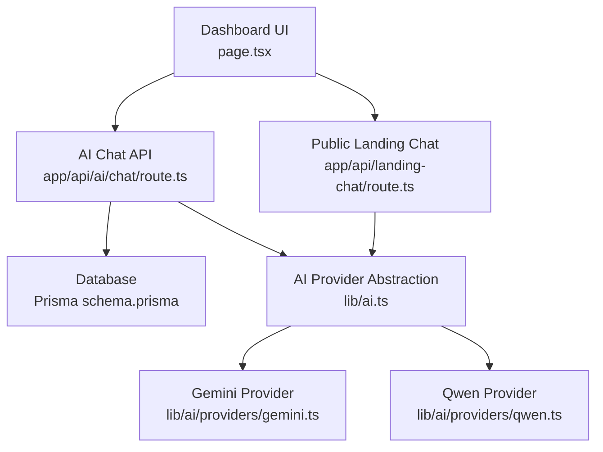
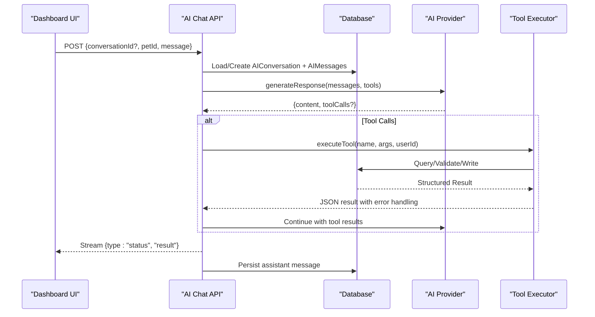
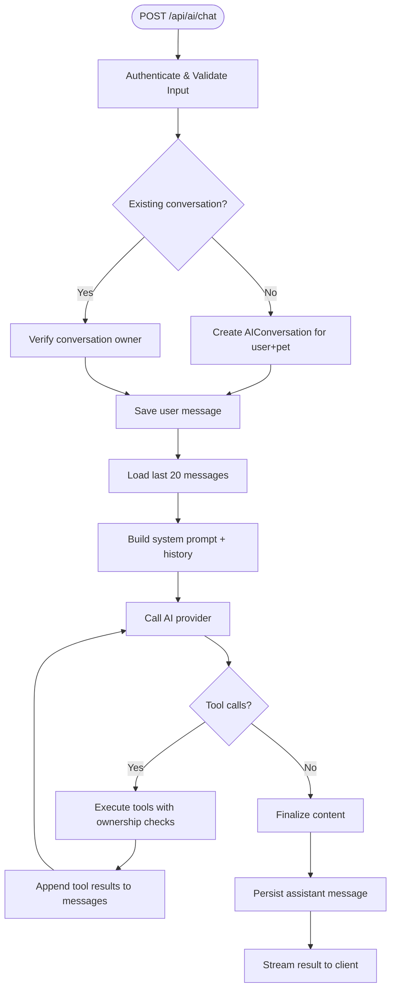
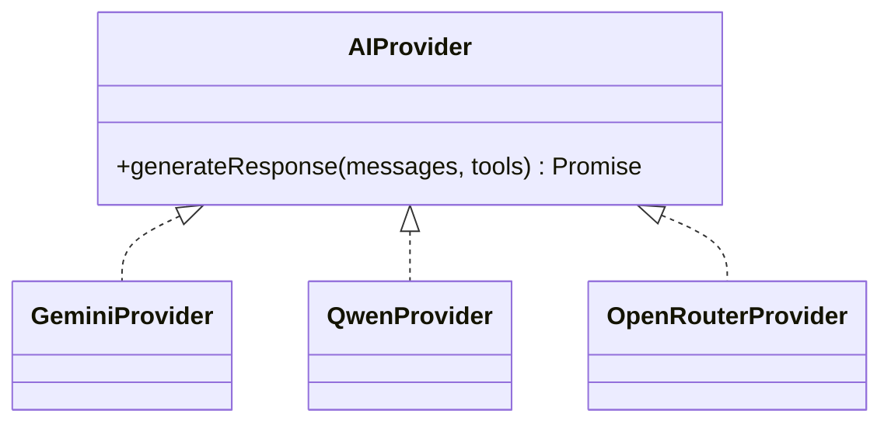
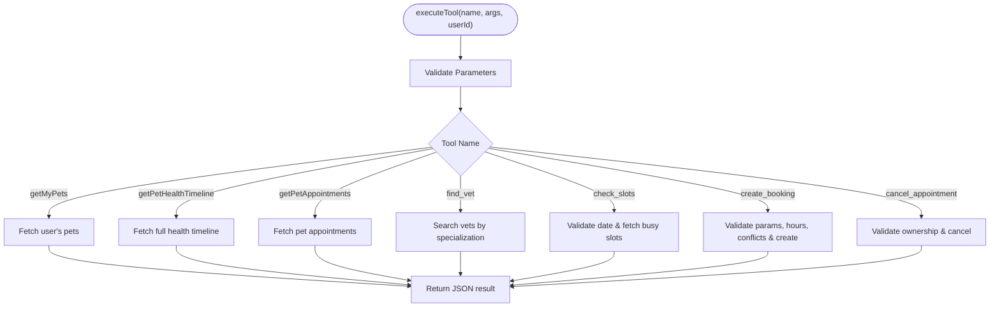
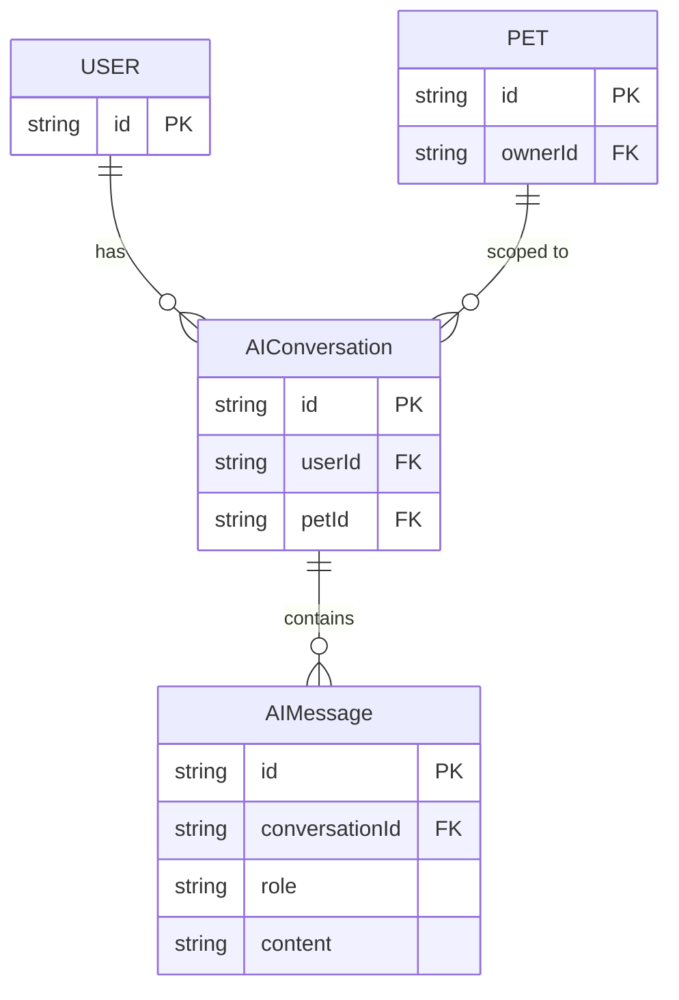
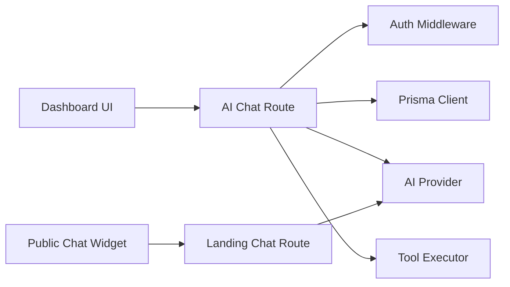

# Natural Language Processing

<cite>
**Referenced Files in This Document**
- [route.ts](file://app/api/ai/chat/route.ts)
- [ai.ts](file://lib/ai.ts)
- [gemini.ts](file://lib/ai/providers/gemini.ts)
- [qwen.ts](file://lib/ai/providers/qwen.ts)
- [04-ai-architecture.md](file://docs/03-architecture/04-ai-architecture.md)
- [page.tsx](file://app/dashboard/page.tsx)
- [ChatWidget.tsx](file://app/components/ChatWidget.tsx)
- [route.ts](file://app/api/landing-chat/route.ts)
- [schema.prisma](file://prisma/schema.prisma)
</cite>

## Update Summary
**Changes Made**
- Updated AI provider abstraction section to reflect current provider implementation (Gemini and Qwen providers)
- Enhanced tool execution error handling documentation with improved error propagation patterns
- Updated provider selection logic to reflect environment-based configuration
- Improved schema validation documentation for tool call parameters
- Added comprehensive error handling examples from tool execution logic

## Table of Contents
1. Introduction
2. Project Structure
3. Core Components
4. Architecture Overview
5. Detailed Component Analysis
6. Dependency Analysis
7. Performance Considerations
8. Troubleshooting Guide
9. Conclusion

## Introduction
This document explains the natural language processing capabilities that power conversational AI for pet health consultations. It covers how user queries about symptoms, medications, and appointment scheduling are processed; how prompts guide the AI toward safe, veterinary-appropriate advice; how conversation state and context are preserved across turns; and how intent recognition, symptom analysis patterns, and recommendation generation are implemented. Safety mechanisms that prevent definitive medical diagnoses and steer users to professional care are also detailed.

## Project Structure
The NLP system is centered around a Next.js API route that orchestrates authentication, conversation persistence, tool execution, and streaming responses. The AI provider abstraction supports multiple model backends with fallbacks through environment-based configuration. A dashboard UI consumes the chat stream and renders messages, while a public landing chat provides a simpler assistant without access to private data.

**Diagram sources**
- [route.ts:68-347](file://app/api/ai/chat/route.ts#L68-L347)
- [ai.ts:105-119](file://lib/ai.ts#L105-L119)
- [gemini.ts:1-78](file://lib/ai/providers/gemini.ts#L1-L78)
- [qwen.ts:1-76](file://lib/ai/providers/qwen.ts#L1-L76)
- [page.tsx:300-352](file://app/dashboard/page.tsx#L300-L352)
- [route.ts:54-113](file://app/api/landing-chat/route.ts#L54-L113)
- [schema.prisma:280-296](file://prisma/schema.prisma#L280-L296)

**Section sources**
- [route.ts:68-347](file://app/api/ai/chat/route.ts#L68-L347)
- [ai.ts:105-119](file://lib/ai.ts#L105-L119)
- [page.tsx:300-352](file://app/dashboard/page.tsx#L300-L352)
- [route.ts:54-113](file://app/api/landing-chat/route.ts#L54-L113)
- [schema.prisma:280-296](file://prisma/schema.prisma#L280-L296)

## Core Components
- AI Chat API (authenticated): Handles GET to load conversation history and POST to process new messages, persisting user and assistant messages and streaming results.
- AI Provider Abstraction: Encapsulates LLM calls and tool support, with configurable providers selected via environment variables and robust error handling.
- Tool Execution Engine: Validates inputs with strict schema validation, enforces ownership, queries the database, and returns structured results with comprehensive error propagation.
- Conversation State Management: Persists conversations per user and pet, limits message history to avoid context bloat, and preserves context across turns.
- Public Assistant: Lightweight endpoint for general platform questions without access to private data.

Key responsibilities:
- Intent routing via system prompt rules (greetings, pet queries, health timeline, appointments, booking).
- Symptom-aware retrieval using tools like getPetHealthTimeline and getPetAppointments.
- Safe guidance through system instructions and explicit safety boundaries.

**Section sources**
- [route.ts:68-347](file://app/api/ai/chat/route.ts#L68-L347)
- [ai.ts:141-219](file://lib/ai.ts#L141-L219)
- [ai.ts:235-452](file://lib/ai.ts#L235-L452)
- [04-ai-architecture.md:69-105](file://docs/03-architecture/04-ai-architecture.md#L69-L105)

## Architecture Overview
The system uses a multi-turn conversation loop with enhanced error handling:
1. Client sends a message to the authenticated AI chat endpoint.
2. Server authenticates, resolves or creates a conversation tied to a specific pet, and loads recent history.
3. A system prompt defines routing rules and safety constraints.
4. The AI provider generates a response, optionally calling tools with validated parameters.
5. Tools execute safely with ownership checks, schema validation, and structured error propagation.
6. The server streams status updates and final results back to the client.
7. Final assistant content is persisted to the conversation.

**Diagram sources**
- [route.ts:68-347](file://app/api/ai/chat/route.ts#L68-L347)
- [ai.ts:235-452](file://lib/ai.ts#L235-L452)
- [page.tsx:300-352](file://app/dashboard/page.tsx#L300-L352)

## Detailed Component Analysis

### AI Chat API: Message Flow and Context Handling
- Authentication and ownership: Ensures the user owns the pet and the conversation belongs to the user.
- Conversation lifecycle: Creates a new conversation if none exists; validates existing ones.
- History management: Loads up to 20 recent messages to keep context manageable.
- System prompt: Defines routing rules for greetings, pet queries, health timelines, appointments, and a strict multi-step booking flow requiring explicit confirmation before creating bookings.
- Streaming: Emits status updates during tool execution and a final result with the assistant's response.
- Persistence: Saves both user and assistant messages to maintain conversation continuity.

**Diagram sources**
- [route.ts:68-347](file://app/api/ai/chat/route.ts#L68-L347)

**Section sources**
- [route.ts:68-347](file://app/api/ai/chat/route.ts#L68-L347)

### AI Provider Abstraction and Fallbacks
- Provider selection: Configurable via `BOOKING_ASSISTANT_PROVIDER` environment variable to switch between Gemini and Qwen providers.
- Provider implementations: Both Gemini and Qwen providers implement consistent interfaces with proper error handling and tool support.
- Error handling: Each provider validates API keys and handles HTTP errors with descriptive messages.
- Tool definitions: Declares available functions with parameter schemas for the LLM, including validation requirements.

**Updated** Enhanced provider abstraction now supports environment-based provider selection with improved error handling and consistent tool call interfaces across different AI providers.

**Diagram sources**
- [ai.ts:21-119](file://lib/ai.ts#L21-L119)
- [gemini.ts:1-78](file://lib/ai/providers/gemini.ts#L1-L78)
- [qwen.ts:1-76](file://lib/ai/providers/qwen.ts#L1-L76)

**Section sources**
- [ai.ts:21-119](file://lib/ai.ts#L21-L119)
- [ai.ts:141-219](file://lib/ai.ts#L141-L219)
- [gemini.ts:1-78](file://lib/ai/providers/gemini.ts#L1-L78)
- [qwen.ts:1-76](file://lib/ai/providers/qwen.ts#L1-L76)

### Tool Execution Engine: Safety, Validation, and Data Access
- Ownership verification: Every pet-scoped tool verifies that the logged-in user owns the pet before returning or modifying data.
- Schema validation: Strict parameter validation with clear error messages for missing or invalid parameters.
- Health timeline aggregation: Retrieves records, vaccinations, medications, allergies, conditions, metrics, and appointments for comprehensive context.
- Appointment operations:
  - find_vet: Searches veterinarians by specialization and maps clinic associations.
  - check_slots: Validates requested date is not in the past and computes busy slots from existing appointments.
  - create_booking: Enforces working hours, prevents past dates, avoids double bookings, and persists a REQUESTED appointment.
  - cancel_appointment: Validates ownership, checks appointment status, and performs audit logging.
- Error handling: Returns structured error objects for invalid parameters, past dates, outside working hours, conflicts, and authorization failures.

**Updated** Enhanced error propagation with structured error responses including error codes, messages, and proper HTTP status mapping throughout the tool execution pipeline.

**Diagram sources**
- [ai.ts:235-452](file://lib/ai.ts#L235-L452)

**Section sources**
- [ai.ts:235-452](file://lib/ai.ts#L235-L452)

### Prompt Engineering Strategies and Safety Boundaries
- System prompt routing: Explicit rules direct the model to respond politely to greetings, call tools for pet queries, retrieve health timelines when needed, and use appointment tools for scheduling.
- Booking workflow enforcement: Requires multi-turn confirmation; re-resolves vet and clinic IDs on the confirmation turn due to lack of cross-turn tool context; prohibits booking until explicit user confirmation.
- Safety guardrails:
  - No definitive medical diagnoses; always emphasize educational nature and recommend professional care.
  - Emergency triage guidance encourages immediate veterinary attention for severe symptoms.
  - Clear distinction between stored facts and AI-generated observations.
- Context optimization: Limits message history to reduce token usage and latency while preserving relevance.

**Section sources**
- [route.ts:145-181](file://app/api/ai/chat/route.ts#L145-L181)
- [04-ai-architecture.md:69-105](file://docs/03-architecture/04-ai-architecture.md#L69-L105)

### Conversation State Management and Message History
- Per-user, per-pet conversations: Each conversation is scoped to a user and a specific pet, ensuring isolation and accurate context.
- Message persistence: Both user and assistant messages are stored with roles and timestamps to reconstruct conversation history.
- History loading: On GET, returns the latest conversation and its messages; on POST, loads up to 20 recent messages to balance context richness with performance.
- UI integration: Dashboard loads conversation history when a pet is selected and appends streamed assistant replies.

**Diagram sources**
- [schema.prisma:280-296](file://prisma/schema.prisma#L280-L296)

**Section sources**
- [route.ts:29-51](file://app/api/ai/chat/route.ts#L29-L51)
- [route.ts:128-143](file://app/api/ai/chat/route.ts#L128-L143)
- [page.tsx:103-122](file://app/dashboard/page.tsx#L103-L122)

### Intent Recognition Patterns and Recommendation Generation
- Intent categories:
  - Greeting: Polite acknowledgment without tool calls.
  - Pet query: Retrieve user's pets to identify the active subject.
  - Health timeline: Fetch comprehensive health data to inform symptom-based guidance.
  - Appointment inquiry: List upcoming or past appointments.
  - Booking request: Multi-step flow to select vet, date, time slot, and confirm before creation.
  - Cancellation request: Multi-step flow to identify and cancel appointments with confirmation.
- Recommendation generation:
  - Uses retrieved health data to suggest topics for discussion with a veterinarian.
  - Highlights preventive insights and recurring concerns without diagnosing.
  - Always frames suggestions as educational and non-definitive.

**Section sources**
- [route.ts:145-181](file://app/api/ai/chat/route.ts#L145-L181)
- [ai.ts:141-219](file://lib/ai.ts#L141-L219)
- [04-ai-architecture.md:69-105](file://docs/03-architecture/04-ai-architecture.md#L69-L105)

### Public Assistant vs. Authenticated Assistant
- Public assistant:
  - Answers general platform questions only.
  - No access to user-specific data; instructs unauthenticated users to sign in for personal features.
  - Uses OpenRouter with fallback models and a simple system prompt.
- Authenticated assistant:
  - Full access to user's pets and health data via tools.
  - Enforces safety boundaries and multi-step booking workflows.

**Section sources**
- [route.ts:54-113](file://app/api/landing-chat/route.ts#L54-L113)
- [ChatWidget.tsx:21-53](file://app/components/ChatWidget.tsx#L21-L53)

## Dependency Analysis
- API route depends on:
  - Authentication middleware for session validation.
  - Prisma client for conversation and message persistence.
  - AI provider abstraction for LLM calls and tool support.
  - Tool executor for safe data access and business logic.
- UI components depend on:
  - Dashboard page to manage conversation state and render streamed responses.
  - Chat widget for public assistance without authentication.

**Diagram sources**
- [route.ts:1-5](file://app/api/ai/chat/route.ts#L1-L5)
- [ai.ts:105-119](file://lib/ai.ts#L105-L119)
- [page.tsx:300-352](file://app/dashboard/page.tsx#L300-L352)
- [route.ts:54-113](file://app/api/landing-chat/route.ts#L54-L113)

**Section sources**
- [route.ts:1-5](file://app/api/ai/chat/route.ts#L1-L5)
- [ai.ts:105-119](file://lib/ai.ts#L105-L119)
- [page.tsx:300-352](file://app/dashboard/page.tsx#L300-L352)
- [route.ts:54-113](file://app/api/landing-chat/route.ts#L54-L113)

## Performance Considerations
- Context window control: Limits message history to the most recent 20 entries to reduce token usage and latency.
- Streaming responses: Emits status updates during tool execution and final results incrementally for better UX.
- Provider fallbacks: Environment-based provider selection allows for easy switching between different AI providers.
- Timezone-aware validations: Uses consistent timezone formatting for date comparisons and working hour checks.
- Error handling efficiency: Structured error responses minimize retry attempts and provide clear debugging information.

## Troubleshooting Guide
Common issues and resolutions:
- Missing petId or message: Ensure required fields are provided; the API returns clear error codes for bad requests.
- Unauthorized access: Verify session validity; the API rejects unauthenticated requests.
- Forbidden access: Confirm the user owns the pet or conversation; the API enforces ownership checks.
- Past date or outside working hours: Adjust booking requests to future dates within allowed hours; the tool executor returns structured errors.
- Double booking: Choose a different slot; the system prevents overlapping appointments.
- Provider failures: Check environment configuration for API keys and model settings; each provider validates credentials on initialization.
- Tool execution errors: Review structured error responses for specific error codes like PAST_DATE, OUTSIDE_WORKING_HOURS, VET_DOUBLE_BOOKED, NOT_FOUND, FORBIDDEN, and ALREADY_CANCELLED.

**Updated** Enhanced troubleshooting includes specific error codes and structured error responses from the improved tool execution engine.

**Section sources**
- [route.ts:73-126](file://app/api/ai/chat/route.ts#L73-L126)
- [ai.ts:331-452](file://lib/ai.ts#L331-L452)

## Conclusion
The NLP subsystem delivers a safe, context-aware conversational experience for pet health consultations. Through robust prompt engineering, strict safety boundaries, and a well-defined tooling layer with enhanced error handling, it guides users toward appropriate veterinary care while enabling practical tasks like retrieving health timelines and scheduling appointments. The architecture balances performance and reliability with environment-based provider selection, streaming responses, careful context management, and comprehensive error propagation. Future enhancements can expand intent coverage and deepen symptom analysis while maintaining strong safety and privacy guarantees.