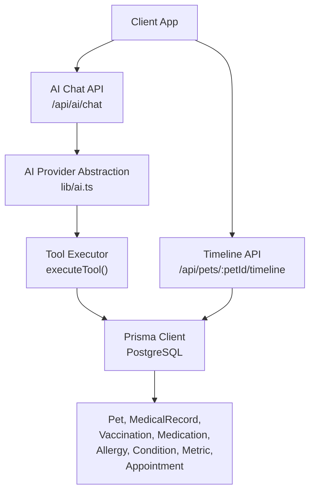
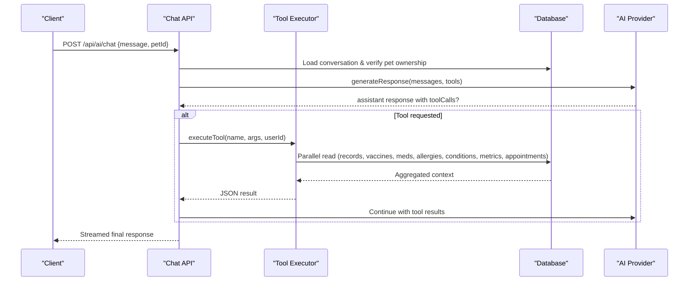
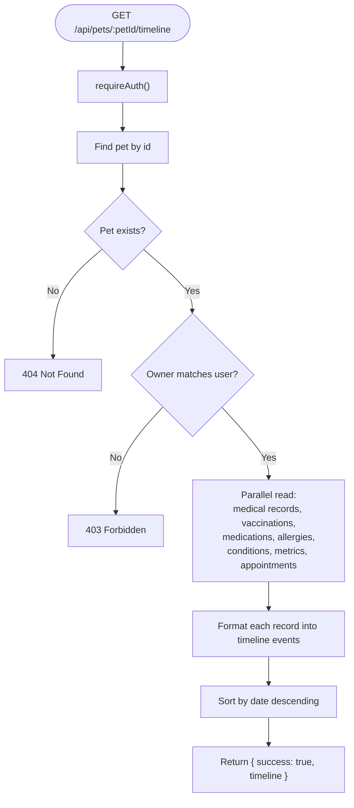
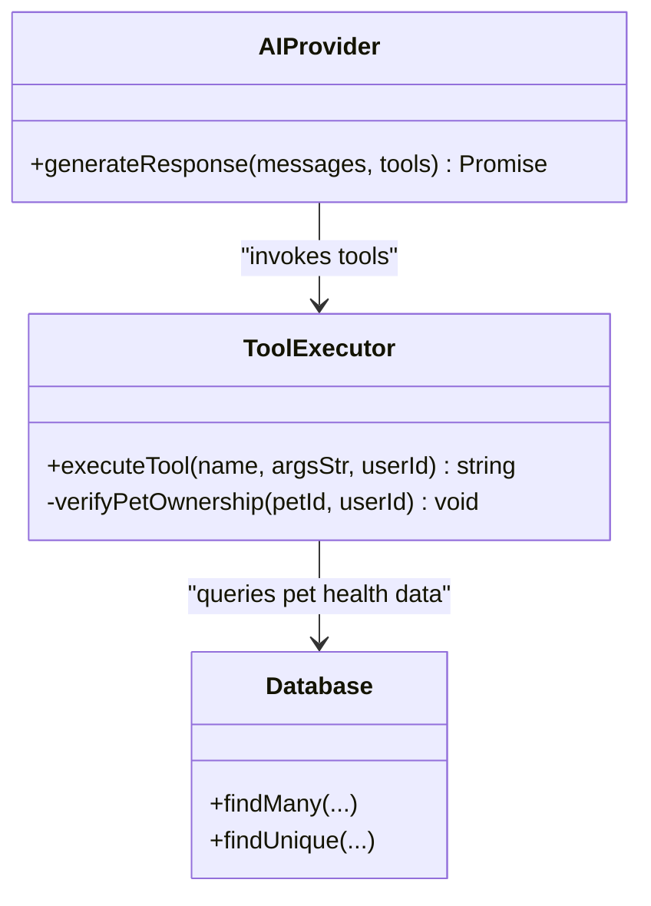
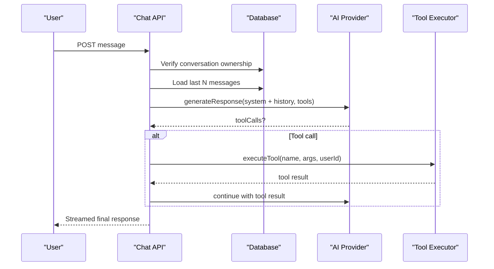
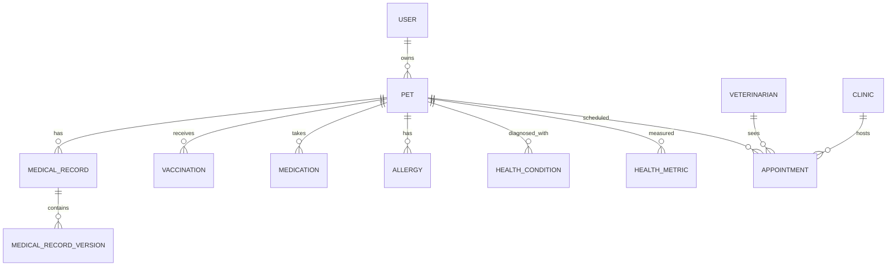
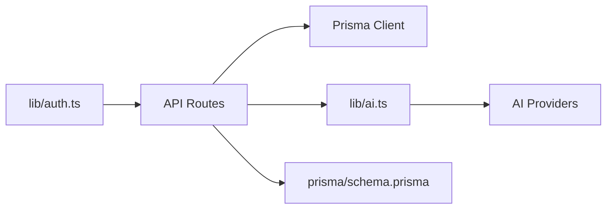

# Pet Health Context Management

<cite>
**Referenced Files in This Document**
- [route.ts](file://app/api/pets/[petId]/timeline/route.ts)
- [route.ts](file://app/api/pets/route.ts)
- [ai.ts](file://lib/ai.ts)
- [route.ts](file://app/api/ai/chat/route.ts)
- [auth.ts](file://lib/auth.ts)
- [schema.prisma](file://prisma/schema.prisma)
- [04-ai-architecture.md](file://docs/03-architecture/04-ai-architecture.md)
- [02-decisions.md](file://docs/02-requirements/02-decisions.md)
- [01-project-blueprint.md](file://docs/01-product/01-project-blueprint.md)
</cite>

## Table of Contents
1. [Introduction](#introduction)
2. [Project Structure](#project-structure)
3. [Core Components](#core-components)
4. [Architecture Overview](#architecture-overview)
5. [Detailed Component Analysis](#detailed-component-analysis)
6. [Dependency Analysis](#dependency-analysis)
7. [Performance Considerations](#performance-considerations)
8. [Troubleshooting Guide](#troubleshooting-guide)
9. [Conclusion](#conclusion)
10. [Appendices](#appendices)

## Introduction
This document explains the pet health context management system that powers AI-assisted veterinary consultations. It details how the system aggregates a pet’s profile, medical records (with versioning), vaccinations, medications, allergies, health conditions, metrics, and appointments into cohesive context objects for AI consumption. It also documents the getPetHealthTimeline tool, data aggregation pipelines, security controls ensuring users can only access their own pets’ data, error handling strategies, and best practices for accuracy and privacy.

## Project Structure
The system is implemented as a Next.js application with:
- API routes for pet data and AI chat orchestration
- A Prisma-based PostgreSQL schema modeling pets, owners, veterinarians, clinics, and health-related entities
- An AI abstraction layer that integrates multiple providers and exposes tools to fetch pet health context
- Documentation describing architectural decisions and AI context retrieval strategy

**Diagram sources**
- [route.ts:68-349](file://app/api/ai/chat/route.ts#L68-L349)
- [route.ts:6-149](file://app/api/pets/[petId]/timeline/route.ts#L6-L149)
- [ai.ts:141-467](file://lib/ai.ts#L141-L467)
- [schema.prisma:68-244](file://prisma/schema.prisma#L68-L244)

**Section sources**
- [route.ts:6-149](file://app/api/pets/[petId]/timeline/route.ts#L6-L149)
- [route.ts:68-349](file://app/api/ai/chat/route.ts#L68-L349)
- [ai.ts:141-467](file://lib/ai.ts#L141-L467)
- [schema.prisma:68-244](file://prisma/schema.prisma#L68-L244)

## Core Components
- Pet ownership and listing: authenticated endpoints to list and create pet profiles scoped to the logged-in user.
- Health timeline endpoint: aggregates all relevant health events into a chronological timeline for a specific pet.
- AI tooling: defines and executes tools including getPetHealthTimeline and related queries, enforcing ownership verification before returning any data.
- AI chat orchestration: builds conversation context, invokes tools, streams responses, and persists messages.
- Data model: Prisma schema defining relationships among pets, owners, veterinarians, clinics, and health records with versioned medical records and audit logs.

**Section sources**
- [route.ts:6-69](file://app/api/pets/route.ts#L6-L69)
- [route.ts:6-149](file://app/api/pets/[petId]/timeline/route.ts#L6-L149)
- [ai.ts:141-467](file://lib/ai.ts#L141-L467)
- [route.ts:68-349](file://app/api/ai/chat/route.ts#L68-L349)
- [schema.prisma:68-244](file://prisma/schema.prisma#L68-L244)

## Architecture Overview
The system uses a layered architecture:
- API Layer: Next.js route handlers enforce authentication and authorization, then delegate to domain logic or database operations.
- Tool Execution Layer: The AI tool executor validates inputs, verifies pet ownership, and performs parallel reads from the database to assemble context.
- Data Layer: Prisma models represent pets, owners, veterinarians, clinics, and health records; medical records are versioned to preserve history and support addenda.
- AI Integration: Providers are abstracted behind a common interface; the chat handler orchestrates tool calls and streams results back to clients.

**Diagram sources**
- [route.ts:68-349](file://app/api/ai/chat/route.ts#L68-L349)
- [ai.ts:297-467](file://lib/ai.ts#L297-L467)
- [route.ts:33-135](file://app/api/pets/[petId]/timeline/route.ts#L33-L135)

## Detailed Component Analysis

### getPetHealthTimeline Tool
Purpose:
- Retrieve a complete health history for a specific pet, including diagnoses, treatments, vaccinations, medications, allergies, conditions, metrics, and appointments.
- Enforce strict ownership verification so users can only access their own pets’ data.

Implementation highlights:
- Ownership verification: The tool resolves the pet and ensures the current user owns it before reading any data.
- Parallel data retrieval: Uses concurrent queries to minimize latency when fetching multiple related datasets.
- Consistent event formatting: Each dataset is transformed into a uniform timeline event structure with type, date, title, description, and metadata for downstream consumption by UIs or AI prompts.
- Chronological sorting: Events are sorted newest-first to present a clear timeline.

**Diagram sources**
- [route.ts:6-149](file://app/api/pets/[petId]/timeline/route.ts#L6-L149)

**Section sources**
- [route.ts:6-149](file://app/api/pets/[petId]/timeline/route.ts#L6-L149)

### AI Tool Execution and Context Assembly
Purpose:
- Provide a unified interface for the AI to request pet-specific data through well-defined tools.
- Ensure consistent ownership checks and safe execution of data retrieval functions.

Key behaviors:
- Tool definitions: Declares available tools such as getMyPets, getPetProfile, getPetHealthTimeline, getPetVaccinations, getPetMedications, getPetAllergies, getPetAppointments, find_vet, check_slots, create_booking.
- Ownership verification: Every tool requiring pet data calls a shared verification function to ensure the requesting user owns the specified pet.
- Parallel reads: For comprehensive context (e.g., getPetHealthTimeline), the executor performs parallel queries to reduce latency.
- Error handling: Missing parameters and unknown tools raise descriptive errors; tool failures are captured and returned to the AI loop for graceful handling.

**Diagram sources**
- [ai.ts:21-103](file://lib/ai.ts#L21-L103)
- [ai.ts:283-467](file://lib/ai.ts#L283-L467)

**Section sources**
- [ai.ts:141-467](file://lib/ai.ts#L141-L467)

### AI Chat Orchestration and Context Formatting
Purpose:
- Manage conversation state, inject system instructions, and coordinate tool usage to build rich, pet-aware AI responses.
- Persist conversation history and limit context size to control costs and latency.

Key behaviors:
- Conversation lifecycle: Creates or loads conversations per user and pet; enforces ownership on new conversations.
- System prompt: Injects role, current date/time, and intent routing rules to guide AI behavior and tool selection.
- Message limiting: Retrieves recent messages (bounded) to avoid context bloat while preserving conversational continuity.
- Streaming: Streams status updates and final results to the client using a readable stream.

**Diagram sources**
- [route.ts:68-349](file://app/api/ai/chat/route.ts#L68-L349)
- [ai.ts:297-467](file://lib/ai.ts#L297-L467)

**Section sources**
- [route.ts:68-349](file://app/api/ai/chat/route.ts#L68-L349)

### Data Model and Versioned Medical Records
Purpose:
- Represent pets, owners, veterinarians, clinics, and health-related entities with strong relationships.
- Preserve immutable history via versioned medical records and audit logging.

Highlights:
- Entities: User, Pet, Veterinarian, Clinic, Appointment, MedicalRecord, MedicalRecordVersion, Vaccination, Medication, Allergy, HealthCondition, HealthMetric, Document, Notification, Reminder, AIConversation, AIMessage, AuditLog.
- Relationships: Pets belong to owners; appointments link pets, owners, vets, and clinics; medical records link to versions and prescriptions.
- Versioning: MedicalRecordVersion supports addenda and corrections without altering historical entries; indexes optimize queries by record and current flag.

**Diagram sources**
- [schema.prisma:30-312](file://prisma/schema.prisma#L30-L312)

**Section sources**
- [schema.prisma:68-244](file://prisma/schema.prisma#L68-L244)

## Dependency Analysis
- Authentication dependency: requireAuth() ensures all sensitive endpoints validate session cookies and return standardized unauthorized responses.
- Database dependency: All tools and APIs rely on Prisma for type-safe queries against PostgreSQL.
- AI provider dependency: The chat handler delegates to an abstracted provider that can be swapped or configured via environment variables; fallback mechanisms improve resilience.
- Tool-to-data dependency: Tools depend on specific Prisma models; changes to schema require corresponding updates in tool implementations.

**Diagram sources**
- [auth.ts:109-125](file://lib/auth.ts#L109-L125)
- [route.ts:68-349](file://app/api/ai/chat/route.ts#L68-L349)
- [ai.ts:126-139](file://lib/ai.ts#L126-L139)
- [schema.prisma:68-244](file://prisma/schema.prisma#L68-L244)

**Section sources**
- [auth.ts:109-125](file://lib/auth.ts#L109-L125)
- [route.ts:68-349](file://app/api/ai/chat/route.ts#L68-L349)
- [ai.ts:126-139](file://lib/ai.ts#L126-L139)
- [schema.prisma:68-244](file://prisma/schema.prisma#L68-L244)

## Performance Considerations
- Parallel reads: The timeline endpoint and getPetHealthTimeline tool use Promise.all to fetch multiple datasets concurrently, reducing overall latency.
- Context limits: The chat handler retrieves a bounded number of recent messages to prevent context bloat and manage token costs.
- Indexes: Database indexes on frequently queried fields (e.g., petId, vetId, dateTime) improve query performance.
- Dynamic context retrieval: Architectural guidance recommends retrieving only relevant categories based on query keywords to minimize payload size and cost.

Recommendations for large datasets:
- Pagination: Introduce pagination for timelines and lists where appropriate to avoid loading entire histories at once.
- Query optimization: Use selective field projection and precomputed summaries for high-frequency reads.
- Caching: Consider server-side caching (e.g., in-memory cache or Redis) for read-heavy, stable datasets like vaccination schedules or active medications, with invalidation on writes.
- Asynchronous processing: Offload heavy transformations or aggregations to background jobs if needed.

[No sources needed since this section provides general guidance]

## Troubleshooting Guide
Common issues and resolutions:
- Unauthorized access: If requireAuth() throws UNAUTHENTICATED, ensure the session cookie is valid and not expired.
- Forbidden access: When ownership checks fail, verify that the pet belongs to the authenticated user.
- Missing parameters: Tools validate required arguments; ensure petId and other parameters are provided.
- Unknown tool: If an unknown tool name is invoked, update the tool registry or correct the caller.
- Database errors: Inspect Prisma errors and ensure schema migrations are applied correctly.

Error handling patterns:
- Standardized error responses with codes and messages for client handling.
- Graceful fallbacks in AI provider calls and streaming to maintain user experience during transient failures.

**Section sources**
- [route.ts:136-149](file://app/api/pets/[petId]/timeline/route.ts#L136-L149)
- [route.ts:319-349](file://app/api/ai/chat/route.ts#L319-L349)
- [ai.ts:463-467](file://lib/ai.ts#L463-L467)

## Conclusion
The pet health context management system provides a secure, efficient, and extensible foundation for AI-assisted veterinary consultations. By aggregating diverse health data into coherent timelines and exposing them through robust tools, the system enables informed, context-aware AI interactions while maintaining strict ownership controls and data integrity. Following the recommended performance optimizations and error handling practices will further enhance scalability and reliability.

[No sources needed since this section summarizes without analyzing specific files]

## Appendices

### Security Measures
- Session-based authentication with HttpOnly cookies and hashed tokens stored in the database.
- Ownership verification enforced at every API and tool boundary to ensure users can only access their own pets’ data.
- Consent-based vet access: Veterinarians receive limited, appointment-scoped access to relevant pet data.

**Section sources**
- [auth.ts:32-75](file://lib/auth.ts#L32-L75)
- [ai.ts:283-295](file://lib/ai.ts#L283-L295)
- [02-decisions.md:89-97](file://docs/02-requirements/02-decisions.md#L89-L97)

### Data Transformation Pipelines
- Timeline events are normalized into a consistent structure with type, date, title, description, and metadata for easy consumption by UIs and AI prompts.
- Medical record versions are resolved to the current version when assembling timelines to reflect the latest clinical information.

**Section sources**
- [route.ts:55-135](file://app/api/pets/[petId]/timeline/route.ts#L55-L135)

### Examples of Context Usage in AI Conversations
- Retrieving pet profiles and health timelines to answer questions about symptoms, treatments, and upcoming care.
- Checking vaccination status and medication adherence to provide personalized reminders and guidance.
- Scheduling appointments by discovering available veterinarians, checking slots, and confirming bookings after explicit user consent.

**Section sources**
- [route.ts:145-183](file://app/api/ai/chat/route.ts#L145-L183)
- [ai.ts:141-281](file://lib/ai.ts#L141-L281)

### Best Practices for Data Accuracy and Privacy
- Maintain versioned medical records to preserve history and enable accurate audits.
- Limit AI context to relevant data to reduce risk and cost.
- Keep credentials and prompts server-side; never expose sensitive configuration to clients.
- Use private object storage and short-lived presigned URLs for document access.

**Section sources**
- [04-ai-architecture.md:45-68](file://docs/03-architecture/04-ai-architecture.md#L45-L68)
- [01-project-blueprint.md:379-475](file://docs/01-product/01-project-blueprint.md#L379-L475)
- [02-decisions.md:7-29](file://docs/02-requirements/02-decisions.md#L7-L29)