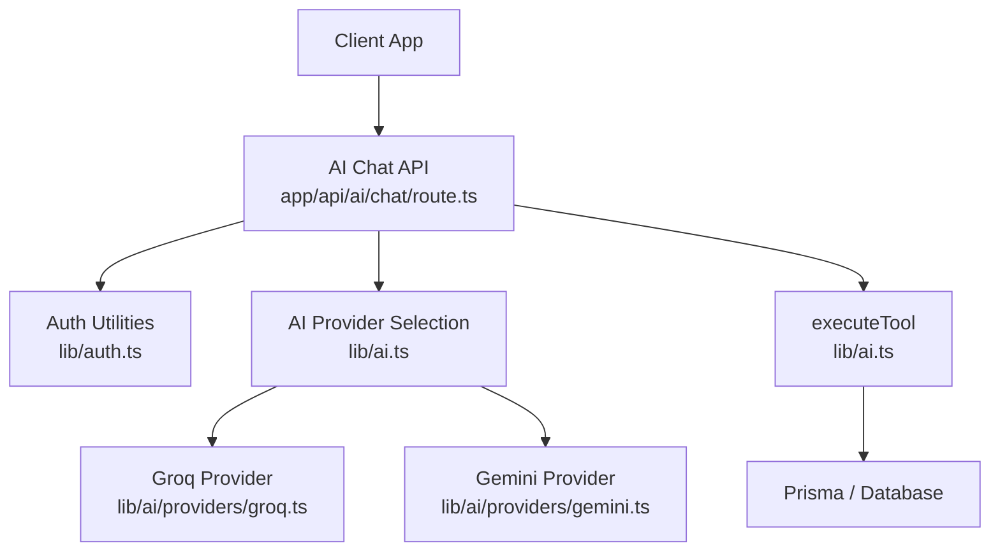
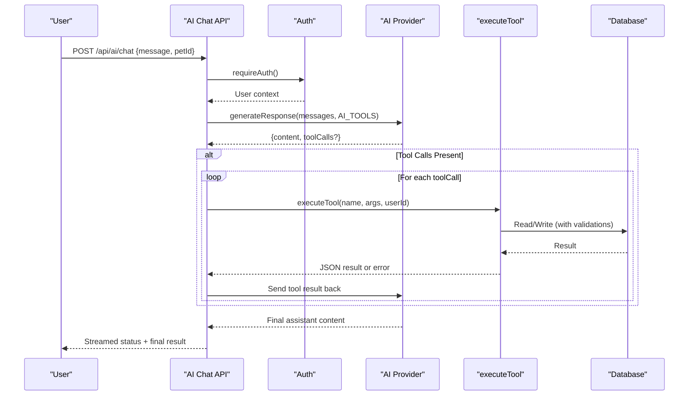
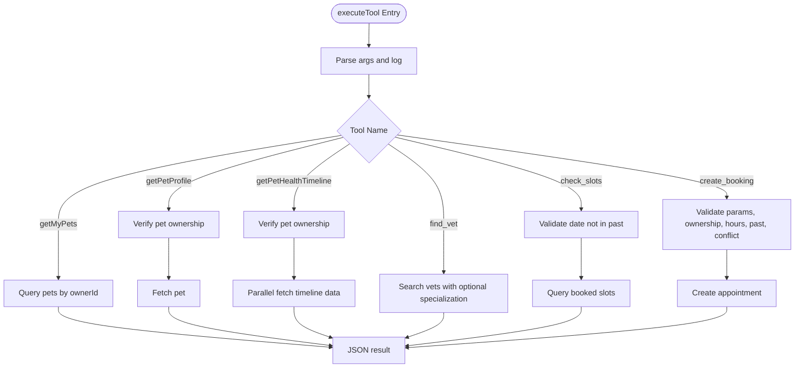
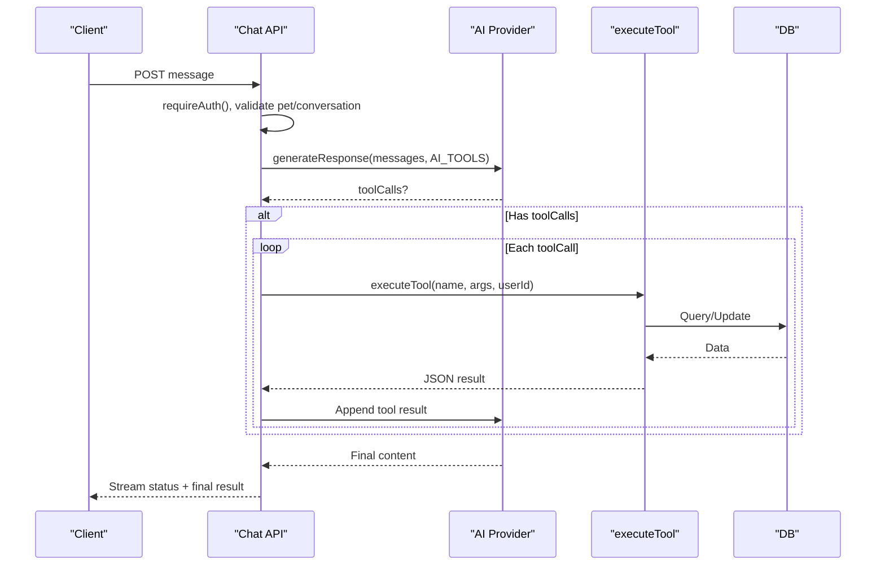
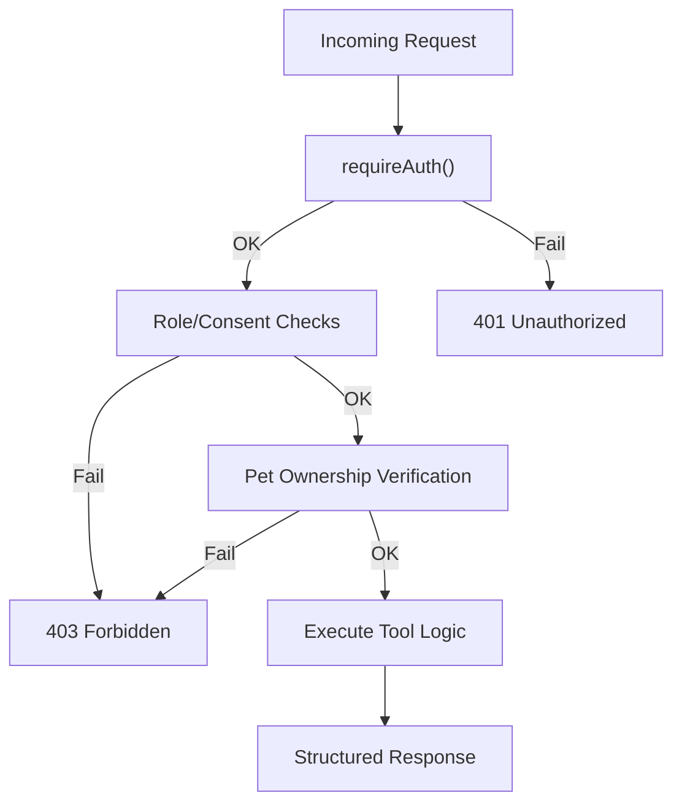
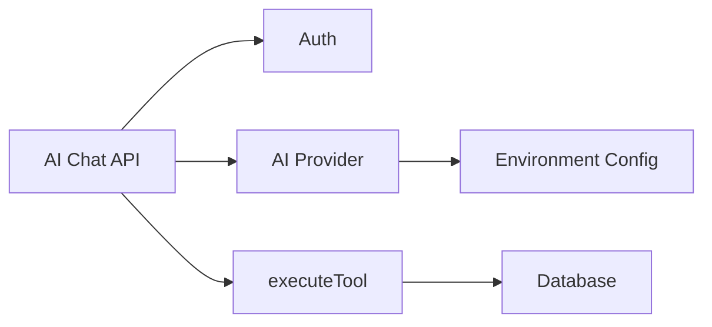
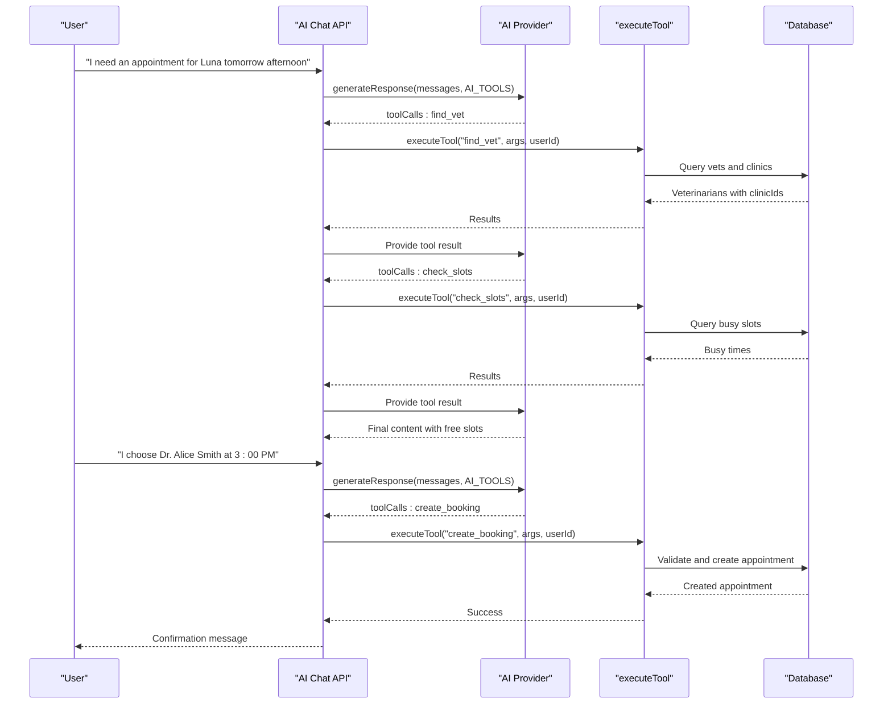

# Tool Execution Framework

<cite>
**Referenced Files in This Document**
- [lib/ai.ts](file://lib/ai.ts)
- [app/api/ai/chat/route.ts](file://app/api/ai/chat/route.ts)
- [lib/auth.ts](file://lib/auth.ts)
- [lib/ai/providers/groq.ts](file://lib/ai/providers/groq.ts)
- [lib/ai/providers/gemini.ts](file://lib/ai/providers/gemini.ts)
- [docs/03-architecture/06-security.md](file://docs/03-architecture/06-security.md)
- [docs/02-requirements/03-authentication-decision.md](file://docs/02-requirements/03-authentication-decision.md)
</cite>

## Table of Contents
1. [Introduction](#introduction)
2. [Project Structure](#project-structure)
3. [Core Components](#core-components)
4. [Architecture Overview](#architecture-overview)
5. [Detailed Component Analysis](#detailed-component-analysis)
6. [Dependency Analysis](#dependency-analysis)
7. [Performance Considerations](#performance-considerations)
8. [Troubleshooting Guide](#troubleshooting-guide)
9. [Conclusion](#conclusion)
10. [Appendices](#appendices)

## Introduction
This document explains the AI tool execution framework that enables AI assistants to perform real actions within the PETIVA system. It covers how tools are defined with function signatures and parameters, how requests are routed to handlers via executeTool, and how built-in tools support pet data retrieval, appointment scheduling, and medical record access. It also documents security measures such as pet ownership verification, role-based access control, input validation, and error handling patterns. Finally, it provides guidance for creating custom tools and integrating them into the AI assistant workflow.

## Project Structure
The AI tool execution framework spans a few key areas:
- Tool definitions and execution logic live in the AI library.
- The chat API orchestrates conversation flow, invokes the AI provider, and executes tools.
- Authentication and authorization utilities enforce identity and permissions.
- Provider implementations abstract different LLM backends while sharing a common interface.

**Diagram sources**
- [app/api/ai/chat/route.ts:1-349](file://app/api/ai/chat/route.ts#L1-L349)
- [lib/ai.ts:141-281](file://lib/ai.ts#L141-L281)
- [lib/ai.ts:297-466](file://lib/ai.ts#L297-L466)
- [lib/ai/providers/groq.ts:1-77](file://lib/ai/providers/groq.ts#L1-L77)
- [lib/ai/providers/gemini.ts:1-77](file://lib/ai/providers/gemini.ts#L1-L77)
- [lib/auth.ts:100-124](file://lib/auth.ts#L100-L124)

**Section sources**
- [app/api/ai/chat/route.ts:1-349](file://app/api/ai/chat/route.ts#L1-L349)
- [lib/ai.ts:141-281](file://lib/ai.ts#L141-L281)
- [lib/ai.ts:297-466](file://lib/ai.ts#L297-L466)
- [lib/auth.ts:100-124](file://lib/auth.ts#L100-L124)

## Core Components
- Tool registry (AI_TOOLS): Declares available functions with names, descriptions, and parameter schemas used by the LLM to decide when and how to call tools.
- executeTool: Central router that validates inputs, enforces ownership and business rules, performs database operations, and returns structured results.
- AI providers: Implementations that send messages and tools to external LLMs and parse tool calls from responses.
- Chat API: Orchestrates authentication, conversation persistence, streaming status updates, tool invocation, and final response assembly.

Key responsibilities:
- Define tool contracts so the LLM can request capabilities safely.
- Validate and sanitize inputs before executing side effects.
- Enforce pet ownership and RBAC at the boundary.
- Stream progress and errors to the client.

**Section sources**
- [lib/ai.ts:141-281](file://lib/ai.ts#L141-L281)
- [lib/ai.ts:297-466](file://lib/ai.ts#L297-L466)
- [app/api/ai/chat/route.ts:68-349](file://app/api/ai/chat/route.ts#L68-L349)
- [lib/auth.ts:100-124](file://lib/auth.ts#L100-L124)

## Architecture Overview
The AI assistant workflow integrates user messages with tool-driven actions:

**Diagram sources**
- [app/api/ai/chat/route.ts:191-323](file://app/api/ai/chat/route.ts#L191-L323)
- [lib/ai.ts:297-466](file://lib/ai.ts#L297-L466)
- [lib/ai/providers/groq.ts:16-75](file://lib/ai/providers/groq.ts#L16-L75)
- [lib/ai/providers/gemini.ts:16-75](file://lib/ai/providers/gemini.ts#L16-L75)

## Detailed Component Analysis

### Tool Definitions and Discovery
- Tools are declared centrally with type, name, description, and parameter schema.
- The chat API passes this registry to the AI provider so the model can choose appropriate tools based on user intent.
- Built-in tools include:
  - getMyPets: Lists pets owned by the current user.
  - getPetProfile: Retrieves profile details for a specific pet.
  - getPetHealthTimeline: Aggregates records, vaccinations, medications, allergies, conditions, metrics, and appointments for a pet.
  - getPetVaccinations, getPetMedications, getPetAllergies, getPetAppointments: Focused queries for a pet.
  - find_vet: Searches veterinarians, optionally filtered by specialization; includes clinic associations.
  - check_slots: Returns busy slots for a vet on a given date with past-date guardrails.
  - create_booking: Books an appointment after validating working hours, past dates, and conflicts.

Parameter validation is enforced both by:
- Required fields in tool schemas (e.g., petId, vetId, date).
- Server-side checks in executeTool that throw or return structured errors for missing or invalid inputs.

**Section sources**
- [lib/ai.ts:141-281](file://lib/ai.ts#L141-L281)
- [lib/ai.ts:297-466](file://lib/ai.ts#L297-L466)

### executeTool Router and Handlers
The executeTool function routes tool invocations to handlers:
- Input parsing and logging for diagnostics.
- Parameter presence checks per tool.
- Ownership verification for pet-scoped tools using verifyPetOwnership.
- Business rule enforcement:
  - Past date prevention for slot checks and bookings.
  - Working-hours constraints for booking creation.
  - Double-booking prevention for appointment creation.
- Data aggregation for health timeline using parallel queries.
- Consistent JSON envelope responses with success flags and payloads.

Error handling:
- Missing parameters raise errors caught upstream and returned as tool results.
- Validation failures return structured error objects (e.g., PAST_DATE, OUTSIDE_WORKING_HOURS, VET_DOUBLE_BOOKED).
- Unknown tool names raise explicit errors.

**Diagram sources**
- [lib/ai.ts:297-466](file://lib/ai.ts#L297-L466)

**Section sources**
- [lib/ai.ts:297-466](file://lib/ai.ts#L297-L466)

### Chat API Orchestration and Streaming
- Authentication: Requires authenticated user before processing.
- Conversation management: Creates or validates conversations scoped to user and pet; persists messages.
- System prompt: Provides strict routing instructions for intents (greetings, pet queries, health timelines, appointments, booking flows).
- Provider selection: Chooses an AI provider based on environment configuration; supports fallback behavior.
- Tool execution loop: Iterates up to a maximum number of turns, sending tool results back to the provider until a final text response is produced.
- Streaming: Emits status updates and final results via a server-sent stream.

**Diagram sources**
- [app/api/ai/chat/route.ts:68-349](file://app/api/ai/chat/route.ts#L68-L349)
- [lib/ai.ts:297-466](file://lib/ai.ts#L297-L466)

**Section sources**
- [app/api/ai/chat/route.ts:68-349](file://app/api/ai/chat/route.ts#L68-L349)

### Security Measures
- Authentication: Session-based auth with secure cookies and token hashing; requires authentication for all AI endpoints.
- Authorization: Role-based access control and consent-based access for veterinarians; pet ownership verification ensures users can only access their own pets.
- Input sanitization: Minimal but effective—whitespace normalization on message content; strict parameter checks in executeTool; date/time validations using timezone-aware formatting.
- Error boundaries: Centralized error handling in the chat route returns standardized error envelopes; tool-level errors are captured and surfaced as tool results to the provider.

**Diagram sources**
- [lib/auth.ts:100-124](file://lib/auth.ts#L100-L124)
- [lib/ai.ts:283-295](file://lib/ai.ts#L283-L295)
- [docs/03-architecture/06-security.md:16-41](file://docs/03-architecture/06-security.md#L16-L41)
- [docs/02-requirements/03-authentication-decision.md:94-118](file://docs/02-requirements/03-authentication-decision.md#L94-L118)

**Section sources**
- [lib/auth.ts:100-124](file://lib/auth.ts#L100-L124)
- [lib/ai.ts:283-295](file://lib/ai.ts#L283-L295)
- [docs/03-architecture/06-security.md:16-41](file://docs/03-architecture/06-security.md#L16-L41)
- [docs/02-requirements/03-authentication-decision.md:94-118](file://docs/02-requirements/03-authentication-decision.md#L94-L118)

### Built-in Tools Reference
- getMyPets
  - Purpose: Retrieve all pets belonging to the logged-in owner.
  - Parameters: None.
  - Security: Uses userId from authenticated session to scope results.
  - Output: Success flag and list of pets.

- getPetProfile
  - Purpose: Get detailed profile for a specific pet.
  - Parameters: petId (required).
  - Security: Verifies ownership before returning data.
  - Output: Success flag and pet object.

- getPetHealthTimeline
  - Purpose: Aggregate comprehensive health history for a pet.
  - Parameters: petId (required).
  - Security: Ownership verification.
  - Output: Timeline including records, vaccinations, medications, allergies, conditions, metrics, and appointments.

- getPetVaccinations, getPetMedications, getPetAllergies, getPetAppointments
  - Purpose: Focused retrieval for a specific pet.
  - Parameters: petId (required).
  - Security: Ownership verification.
  - Output: Success flag and respective lists.

- find_vet
  - Purpose: Search veterinarians, optionally by specialization; includes associated clinics.
  - Parameters: specialization (optional).
  - Security: No ownership required; read-only lookup.
  - Output: Success flag and veterinarian list with clinic info.

- check_slots
  - Purpose: Retrieve busy/booked slots for a vet on a given date.
  - Parameters: vetId (required), date (required, YYYY-MM-DD).
  - Security: Validates date is not in the past.
  - Output: Success flag and busy slots list.

- create_booking
  - Purpose: Book a new appointment for a pet with a vet at a clinic.
  - Parameters: petId, vetId, clinicId, dateTime, reason (all required).
  - Security: Ownership verification; working-hours and past-date validation; double-booking prevention.
  - Output: Success flag and created appointment or structured error.

**Section sources**
- [lib/ai.ts:141-281](file://lib/ai.ts#L141-L281)
- [lib/ai.ts:297-466](file://lib/ai.ts#L297-L466)

### Creating Custom Tools and Integration
To add a new tool:
1. Define the tool in the AI_TOOLS registry with a clear name, description, and parameter schema.
2. Add a case in executeTool to handle the tool:
   - Validate required parameters.
   - Apply any ownership or role checks.
   - Perform business logic and database operations.
   - Return a consistent JSON envelope with success and payload or error.
3. Update system prompts if needed to guide the AI’s intent routing for the new capability.
4. Ensure the chat API’s tool execution loop will automatically pick up the new tool since it iterates over toolCalls provided by the provider.

Integration tips:
- Keep tool names stable and descriptive.
- Use structured error codes for predictable client handling.
- Log diagnostic information for debugging without exposing sensitive data.
- Test multi-turn flows where tool outputs influence subsequent decisions.

**Section sources**
- [lib/ai.ts:141-281](file://lib/ai.ts#L141-L281)
- [lib/ai.ts:297-466](file://lib/ai.ts#L297-L466)
- [app/api/ai/chat/route.ts:145-183](file://app/api/ai/chat/route.ts#L145-L183)

## Dependency Analysis
- Chat API depends on:
  - Authentication utilities for identity and roles.
  - AI provider abstraction for LLM interactions.
  - executeTool for performing domain actions.
- executeTool depends on:
  - Prisma ORM for database access.
  - Ownership verification helper for pet-scoped operations.
- Providers depend on:
  - Environment variables for API keys and model selection.
  - Shared types for messages and tool calls.

**Diagram sources**
- [app/api/ai/chat/route.ts:1-349](file://app/api/ai/chat/route.ts#L1-L349)
- [lib/ai.ts:297-466](file://lib/ai.ts#L297-L466)
- [lib/ai/providers/groq.ts:1-77](file://lib/ai/providers/groq.ts#L1-L77)
- [lib/ai/providers/gemini.ts:1-77](file://lib/ai/providers/gemini.ts#L1-L77)
- [lib/auth.ts:100-124](file://lib/auth.ts#L100-L124)

**Section sources**
- [app/api/ai/chat/route.ts:1-349](file://app/api/ai/chat/route.ts#L1-L349)
- [lib/ai.ts:297-466](file://lib/ai.ts#L297-L466)
- [lib/auth.ts:100-124](file://lib/auth.ts#L100-L124)

## Performance Considerations
- Parallel data fetching: Health timeline aggregates multiple entities concurrently to reduce latency.
- Context window limits: Only recent messages are loaded to prevent excessive context size.
- Streaming responses: Status updates and final results are streamed to improve perceived responsiveness.
- Provider fallback: If primary provider fails, a secondary provider is used to maintain availability.

[No sources needed since this section provides general guidance]

## Troubleshooting Guide
Common issues and resolutions:
- Unauthenticated requests: Ensure a valid session cookie is present; the API enforces authentication.
- Access denied: Verify the user owns the requested pet or has appropriate roles; ownership checks are enforced in tool handlers.
- Past date errors: Slot checks and bookings reject past dates; ensure dates are future-oriented relative to the configured timezone.
- Outside working hours: Booking times must fall within allowed hours; adjust request time accordingly.
- Double booking: Conflicts are detected; select a different time slot.
- Unknown tool: Indicates a mismatch between tool definition and handler; ensure executeTool includes a case for the tool name.

Diagnostic aids:
- Tool start logs provide names and arguments for tracing.
- Stream status messages indicate which tool is being executed.
- Structured error codes help clients display meaningful feedback.

**Section sources**
- [lib/ai.ts:297-466](file://lib/ai.ts#L297-L466)
- [app/api/ai/chat/route.ts:191-323](file://app/api/ai/chat/route.ts#L191-L323)

## Conclusion
The AI tool execution framework provides a robust, secure, and extensible foundation for enabling AI assistants to perform real actions in the PETIVA system. By centralizing tool definitions, enforcing strict validation and ownership checks, and orchestrating multi-turn tool usage through a streaming chat API, the system delivers reliable and safe AI-driven workflows for pet healthcare operations. Extending the framework with custom tools follows a clear pattern: define the tool contract, implement validation and business logic in executeTool, and rely on the existing orchestration to integrate seamlessly.

[No sources needed since this section summarizes without analyzing specific files]

## Appendices

### Example: Multi-turn Booking Flow

**Diagram sources**
- [app/api/ai/chat/route.ts:145-183](file://app/api/ai/chat/route.ts#L145-L183)
- [app/api/ai/chat/route.ts:247-323](file://app/api/ai/chat/route.ts#L247-L323)
- [lib/ai.ts:297-466](file://lib/ai.ts#L297-L466)