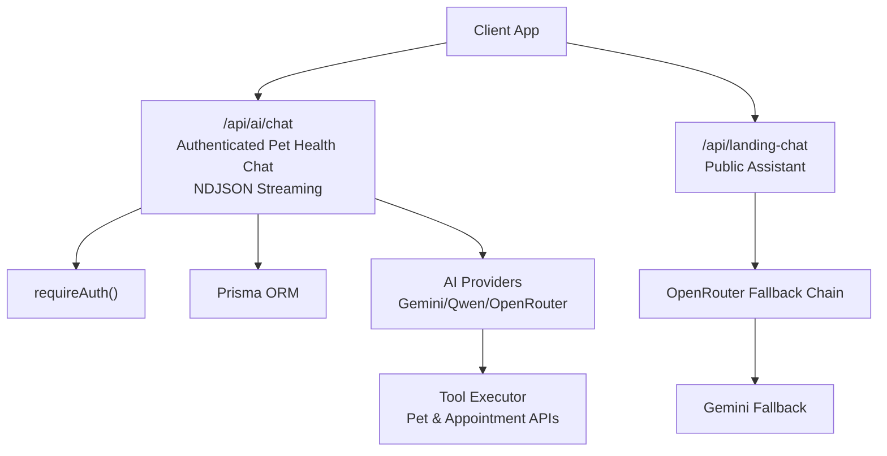
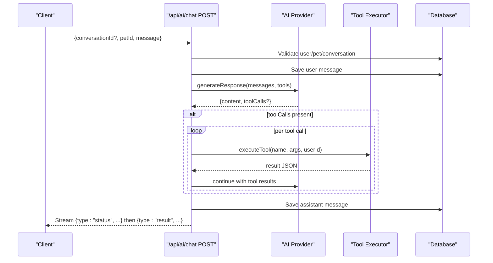
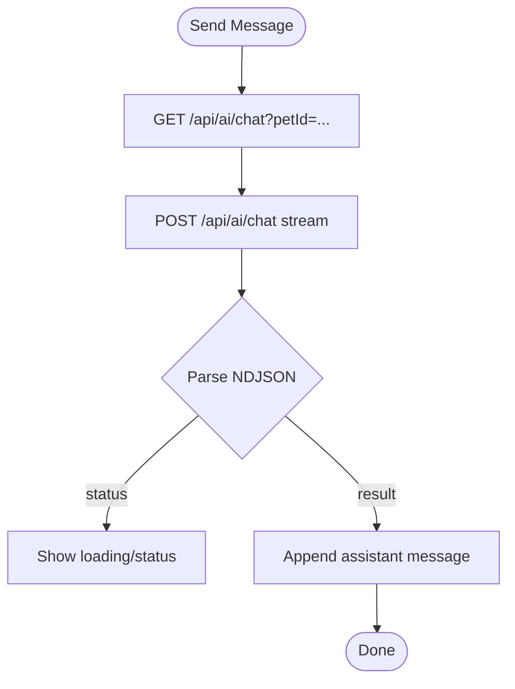
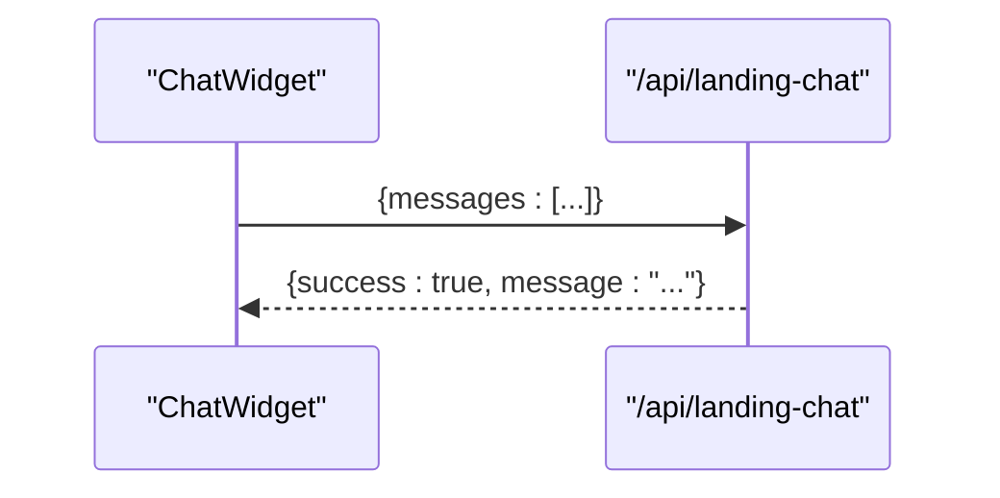
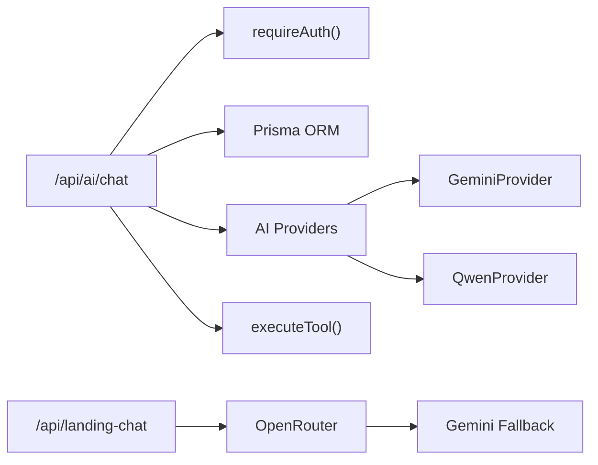

# AI Chat API

<cite>
**Referenced Files in This Document**
- [route.ts](file://app/api/ai/chat/route.ts)
- [route.ts](file://app/api/landing-chat/route.ts)
- [ai.ts](file://lib/ai.ts)
- [auth.ts](file://lib/auth.ts)
- [schema.prisma](file://prisma/schema.prisma)
- [gemini.ts](file://lib/ai/providers/gemini.ts)
- [qwen.ts](file://lib/ai/providers/qwen.ts)
- [page.tsx](file://app/dashboard/page.tsx)
- [ChatWidget.tsx](file://app/components/ChatWidget.tsx)
</cite>

## Update Summary
**Changes Made**
- Updated streaming response implementation from synchronous JSON to NDJSON streaming
- Enhanced error handling with improved user-friendly messages throughout the API
- Improved tool execution with better argument parsing and real-time status updates
- Added comprehensive streaming client integration examples
- Updated architecture diagrams to reflect the new streaming flow

## Table of Contents
1. [Introduction](#introduction)
2. [Project Structure](#project-structure)
3. [Core Components](#core-components)
4. [Architecture Overview](#architecture-overview)
5. [Detailed Component Analysis](#detailed-component-analysis)
6. [Dependency Analysis](#dependency-analysis)
7. [Performance Considerations](#performance-considerations)
8. [Troubleshooting Guide](#troubleshooting-guide)
9. [Conclusion](#conclusion)
10. [Appendices](#appendices)

## Introduction
This document provides comprehensive API documentation for the AI-powered chat endpoints in the PETIVA system. It covers:
- The authenticated pet health consultation endpoint at /api/ai/chat (GET and POST).
- The public landing page assistant endpoint at /api/landing-chat (POST).
- Request/response schemas, conversation state management, tool usage for pet health data and appointment booking, **streaming NDJSON responses**, provider integration patterns, fallback mechanisms, safety guardrails, and client integration examples.

## Project Structure
The AI chat functionality is implemented as Next.js Route Handlers with server-side orchestration, database persistence, and multiple AI providers.

**Diagram sources**
- [route.ts:68-346](file://app/api/ai/chat/route.ts#L68-L346)
- [route.ts:54-112](file://app/api/landing-chat/route.ts#L54-L112)
- [ai.ts:112-119](file://lib/ai.ts#L112-L119)
- [ai.ts:235-452](file://lib/ai.ts#L235-L452)

**Section sources**
- [route.ts:68-346](file://app/api/ai/chat/route.ts#L68-L346)
- [route.ts:54-112](file://app/api/landing-chat/route.ts#L54-L112)
- [ai.ts:112-119](file://lib/ai.ts#L112-L119)
- [ai.ts:235-452](file://lib/ai.ts#L235-L452)

## Core Components
- **Streaming authenticated chat route**: GET retrieves a user's latest conversation for a pet; POST streams AI responses using NDJSON format with real-time status updates and tool calls to access pet records and book appointments.
- Public landing chat route: POST returns general platform assistance via OpenRouter with fallbacks to Gemini.
- AI provider abstraction: Supports Gemini, Qwen, OpenRouter, and a fallback chain.
- **Enhanced tool executor**: Implements functions for retrieving pets, health timelines, vaccinations, medications, allergies, appointments, finding vets, checking slots, and creating bookings with improved argument parsing and error handling.
- Conversation persistence: Stores messages and associates conversations with users and pets.

**Section sources**
- [route.ts:68-346](file://app/api/ai/chat/route.ts#L68-L346)
- [route.ts:54-112](file://app/api/landing-chat/route.ts#L54-L112)
- [ai.ts:122-219](file://lib/ai.ts#L122-L219)
- [ai.ts:235-452](file://lib/ai.ts#L235-L452)
- [schema.prisma:280-296](file://prisma/schema.prisma#L280-L296)

## Architecture Overview
The authenticated chat flow uses **streaming NDJSON responses** for enhanced user experience. The server:
- Authenticates the user and validates ownership of the pet or conversation.
- Persists the user message and loads recent history.
- Sends system instructions and context to the selected AI provider.
- Executes tool calls requested by the model (e.g., getMyPets, check_slots, create_booking).
- **Streams status updates and final results back to the client in real-time**.

**Diagram sources**
- [route.ts:68-346](file://app/api/ai/chat/route.ts#L68-L346)
- [ai.ts:235-452](file://lib/ai.ts#L235-L452)

## Detailed Component Analysis

### Endpoint: GET /api/ai/chat
Retrieves the latest conversation for an authenticated user and a specific pet.

- Authentication: Required via session cookie.
- Query parameters:
  - petId: string (required). Must belong to the authenticated user.
- Success response:
  - success: boolean
  - conversationId: string (empty if none exists)
  - messages: array of { role: "user"|"assistant", content: string }
- Error responses:
  - 400 BAD_REQUEST: missing petId
  - 401 UNAUTHORIZED: not logged in
  - 403 FORBIDDEN: pet does not belong to user
  - 500 INTERNAL_SERVER_ERROR: server error

Example request:
- GET /api/ai/chat?petId=abc123

Example response:
- { success: true, conversationId: "conv_id", messages: [] }

**Section sources**
- [route.ts:7-66](file://app/api/ai/chat/route.ts#L7-L66)

### Endpoint: POST /api/ai/chat
**Updated** Streams AI-assisted pet health consultations using NDJSON format with real-time status updates and supports appointment booking.

- Authentication: Required via session cookie.
- Request body:
  - conversationId?: string (omit to start a new conversation)
  - petId: string (required when starting a new conversation; must belong to user)
  - message: string (required)
- **Streaming response (application/x-ndjson)**:
  - Status events: { type: "status", message: string }
  - Result events: { type: "result", success: boolean, conversationId?: string, message?: string, error?: { message: string } }
- Behavior:
  - Creates or validates conversation ownership.
  - Persists user message and loads up to 20 recent messages for context.
  - Uses system prompt to guide behavior, including routing rules and strict booking workflow.
  - Executes tool calls for pet data retrieval and appointment scheduling.
  - **Sends real-time status updates during tool execution**.
  - Saves assistant response and streams final result.

Example requests:
- Start new conversation:
  - { petId: "pet_123", message: "My dog has been coughing lately." }
- Continue existing conversation:
  - { conversationId: "conv_456", message: "What should I do next?" }

Example streaming payload samples:
- { type: "status", message: "Reviewing your pet's health information..." }
- { type: "status", message: "Checking available time slots..." }
- { type: "result", success: true, conversationId: "conv_456", message: "Based on the timeline, consider scheduling a vet visit..." }

Notes:
- Tool execution errors are captured and returned to the model to allow recovery.
- If max loops reached without content, a safe fallback message is sent.
- **Enhanced error handling provides user-friendly messages throughout the process**.

**Section sources**
- [route.ts:68-346](file://app/api/ai/chat/route.ts#L68-L346)

### Endpoint: POST /api/landing-chat
Public assistant for general questions about PETIVA features, pricing, sign-up, and navigation. No authentication required.

- Request body:
  - messages: array of { role: "user"|"assistant", content: string }
- Response:
  - { success: boolean, message: string }
- Behavior:
  - Prepends a system prompt restricting scope to platform info only.
  - Calls OpenRouter with a list of free models; falls back to additional models on failure.
  - On exhaustion of OpenRouter chain, falls back to Gemini provider.
  - If all providers fail, returns a friendly temporary busy message.

Example request:
- { messages: [{ role: "user", content: "How do I register as a pet owner?" }] }

Example response:
- { success: true, message: "You can register by clicking Sign Up and selecting Pet Owner..." }

**Section sources**
- [route.ts:54-112](file://app/api/landing-chat/route.ts#L54-L112)

### AI Provider Integration and Fallbacks
- Primary provider selection:
  - Controlled by environment variable BOOKING_ASSISTANT_PROVIDER.
  - Supports gemini, qwen; defaults to Gemini provider.
- OpenRouter provider:
  - Used directly by the public landing chat and available as a provider class.
- Provider interfaces:
  - All providers implement generateResponse(messages, tools?) returning assistant content and optional tool calls.

Environment variables:
- BOOKING_ASSISTANT_PROVIDER: selects primary provider for authenticated chat.
- GEMINI_API_KEY: required for Gemini provider.
- DASHSCOPE_API_KEY: required for Qwen provider.
- OPENROUTER_API_KEY: required for OpenRouter provider and public landing fallback chain.
- OPENROUTER_MODEL: default model for OpenRouter provider.

**Section sources**
- [ai.ts:109-119](file://lib/ai.ts#L109-L119)
- [gemini.ts:9-78](file://lib/ai/providers/gemini.ts#L9-L78)
- [qwen.ts:9-76](file://lib/ai/providers/qwen.ts#L9-L76)
- [route.ts:54-112](file://app/api/landing-chat/route.ts#L54-L112)

### Tool Execution and Data Access
**Updated** Tools exposed to the AI model with enhanced argument parsing and error handling:
- getMyPets: List current user's pets.
- getPetHealthTimeline: Full health history for a pet (records, vaccinations, meds, allergies, conditions, metrics, appointments).
- getPetVaccinations: Vaccination records for a pet.
- getPetMedications: Medication records for a pet.
- getPetAllergies: Allergy records for a pet.
- getPetAppointments: Scheduled appointments for a pet.
- find_vet: Search veterinarians by specialization; returns IDs and clinic associations.
- check_slots: Check busy slots for a vet on a given date; includes past-date validation.
- create_booking: Book an appointment with validations (working hours, past dates, double booking), requiring explicit confirmation before execution.

Safety and ownership:
- All tools that access pet-specific data enforce ownership verification against the authenticated user.
- Booking requires re-resolving vet and clinic IDs due to tool context loss between turns.
- Working hours enforced (9 AM–5 PM) and past-date checks applied.
- **Enhanced error handling provides detailed error codes and user-friendly messages**.

**Section sources**
- [ai.ts:122-219](file://lib/ai.ts#L122-L219)
- [ai.ts:235-452](file://lib/ai.ts#L235-L452)

### Conversation State Management
- Conversations are tied to a user and a pet.
- New conversations are created when conversationId is omitted and petId is provided.
- Existing conversations are validated for ownership before use.
- Message history is limited to the most recent 20 messages to control context size.
- System prompt injects current date/time and active pet context to improve accuracy.

**Section sources**
- [route.ts:80-143](file://app/api/ai/chat/route.ts#L80-L143)
- [schema.prisma:280-296](file://prisma/schema.prisma#L280-L296)

### Safety Guardrails for Pet Health Advice
- System prompt instructs the model to follow strict routing rules and avoid inventing data.
- Tool-driven access ensures only verified, owned data is used.
- Booking workflow enforces multi-turn confirmation and re-resolution of IDs before committing changes.
- Public assistant is restricted to platform-related topics and directs users to sign in for personal data queries.

**Section sources**
- [route.ts:145-176](file://app/api/ai/chat/route.ts#L145-L176)
- [route.ts:65-73](file://app/api/landing-chat/route.ts#L65-L73)

### Rate Limiting Policies
- No explicit rate limiting middleware is implemented in the analyzed routes.
- Recommendations:
  - Add per-user and global rate limiting at the API layer (e.g., token bucket or sliding window).
  - Enforce limits per IP and per authenticated user to protect downstream AI providers.
  - Integrate provider-level quotas and circuit breakers where applicable.

[No sources needed since this section provides general guidance]

### Client Integration Examples and Streaming Handling

#### Dashboard Chat (Authenticated)
**Updated** Fetches initial conversation via GET /api/ai/chat?petId=... and streams POST /api/ai/chat using ReadableStream with NDJSON parsing.

**Diagram sources**
- [page.tsx:285-354](file://app/dashboard/page.tsx#L285-L354)
- [route.ts:202-342](file://app/api/ai/chat/route.ts#L202-L342)

**Section sources**
- [page.tsx:285-354](file://app/dashboard/page.tsx#L285-L354)

#### Landing Page Chat (Public)
- Sends messages to POST /api/landing-chat and renders the assistant's text response.

**Diagram sources**
- [ChatWidget.tsx:21-53](file://app/components/ChatWidget.tsx#L21-L53)
- [route.ts:54-112](file://app/api/landing-chat/route.ts#L54-L112)

**Section sources**
- [ChatWidget.tsx:21-53](file://app/components/ChatWidget.tsx#L21-L53)

## Dependency Analysis
Key dependencies and relationships:
- Routes depend on auth utilities and Prisma for persistence.
- Authenticated chat depends on AI provider abstraction and tool executor.
- Providers encapsulate external API calls to Gemini, Qwen, and OpenRouter.
- Database schema defines entities for users, pets, appointments, and AI conversations/messages.

**Diagram sources**
- [route.ts:68-346](file://app/api/ai/chat/route.ts#L68-L346)
- [route.ts:54-112](file://app/api/landing-chat/route.ts#L54-L112)
- [ai.ts:112-119](file://lib/ai.ts#L112-L119)
- [ai.ts:235-452](file://lib/ai.ts#L235-L452)

**Section sources**
- [route.ts:68-346](file://app/api/ai/chat/route.ts#L68-L346)
- [route.ts:54-112](file://app/api/landing-chat/route.ts#L54-L112)
- [ai.ts:112-119](file://lib/ai.ts#L112-L119)
- [ai.ts:235-452](file://lib/ai.ts#L235-L452)

## Performance Considerations
- Context window: Limits conversation history to 20 messages to reduce token usage and latency.
- **Streaming**: NDJSON streaming improves perceived responsiveness by showing status updates and final results incrementally.
- Provider fallback: Reduces single-provider dependency risk and improves resilience.
- Tool batching: Multiple tool calls are processed sequentially within a single request loop; consider parallelization where safe.
- Timezone handling: Date calculations use Asia/Karachi timezone to ensure consistent working hours and slot checks.
- **Enhanced error handling**: Reduces client-side error handling complexity with user-friendly messages.

[No sources needed since this section provides general guidance]

## Troubleshooting Guide
Common issues and resolutions:
- Unauthenticated access: Ensure session cookie is present and valid. Errors return 401 with code UNAUTHORIZED.
- Forbidden access: Verify pet ownership or conversation ownership; errors return 403 with code FORBIDDEN.
- Missing parameters: Include required fields such as message and petId when starting a new conversation; errors return 400.
- Provider failures: Check environment variables for API keys; fallback chain will attempt alternate providers.
- Booking conflicts: Ensure time is within working hours and not already booked; tool executor returns specific error codes.
- **Streaming issues**: Verify client supports ReadableStream and NDJSON parsing; check browser compatibility.

**Section sources**
- [route.ts:53-66](file://app/api/ai/chat/route.ts#L53-L66)
- [route.ts:344-357](file://app/api/ai/chat/route.ts#L344-L357)
- [ai.ts:369-447](file://lib/ai.ts#L369-L447)

## Conclusion
The PETIVA AI chat system provides robust, secure, and extensible endpoints for both authenticated pet health consultations and public platform assistance. **The major architectural improvement implementing streaming NDJSON responses significantly enhances user experience by providing real-time feedback during complex operations**. It leverages multiple AI providers, tool-driven data access, and careful conversation state management to deliver accurate and safe interactions. Implementing rate limiting and monitoring would further enhance reliability and scalability.

[No sources needed since this section summarizes without analyzing specific files]

## Appendices

### Example Natural Language Queries and Workflows
- Health query: "My cat has been vomiting twice today. What should I do?"
  - Expected behavior: Model may call getMyPets and getPetHealthTimeline to retrieve relevant records and provide guidance.
- Appointment booking: "I need to schedule a vaccination for my dog next week."
  - Expected behavior: Model finds pet, searches for suitable vet, checks available slots, proposes times, asks for confirmation, then creates booking after explicit confirmation.
- Medical record analysis: "Summarize my pet's recent diagnoses and medications."
  - Expected behavior: Model calls getPetHealthTimeline and synthesizes a summary from records.
- Multi-turn conversation: User clarifies details across several messages; the system maintains context and persists each turn.

[No sources needed since this section provides conceptual examples]

### Environment Variables Reference
- BOOKING_ASSISTANT_PROVIDER: Selects primary provider for authenticated chat.
- GEMINI_API_KEY: Required for Gemini provider.
- DASHSCOPE_API_KEY: Required for Qwen provider.
- OPENROUTER_API_KEY: Required for OpenRouter provider and public landing fallback chain.
- OPENROUTER_MODEL: Default model for OpenRouter provider.

[No sources needed since this section lists configuration values]

### Streaming Implementation Details
**New Section** The authenticated chat endpoint implements a sophisticated streaming system:

- **ReadableStream**: Uses Node.js ReadableStream for efficient streaming
- **NDJSON Format**: Each line contains a complete JSON object for easy parsing
- **Status Updates**: Real-time progress indicators during tool execution
- **Error Resilience**: Graceful handling of stream interruptions and network issues
- **Client Compatibility**: Works with modern browsers and Node.js environments

Key streaming components:
- `sendStatus()`: Emits progress updates like "Reviewing health information..."
- `sendResult()`: Emits final results with success/failure status
- `safeClose()`: Ensures proper stream cleanup even on errors
- **Enhanced argument parsing**: Better handling of tool function arguments with JSON validation

**Section sources**
- [route.ts:202-342](file://app/api/ai/chat/route.ts#L202-L342)
- [page.tsx:307-337](file://app/dashboard/page.tsx#L307-L337)