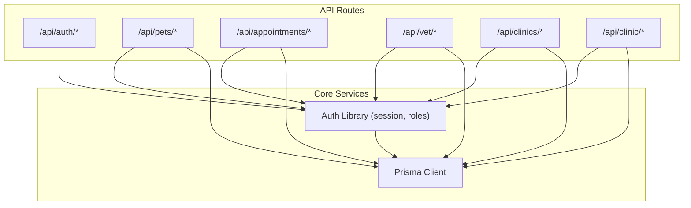
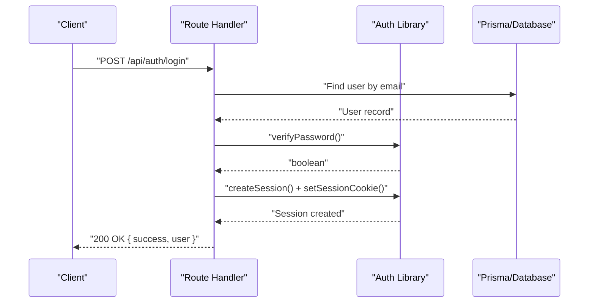
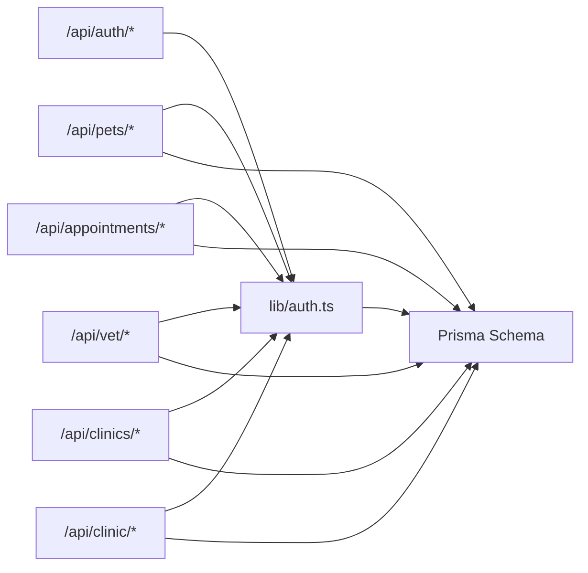

# API Reference

<cite>
**Referenced Files in This Document**
- [03-api-specification.md](file://docs/03-architecture/03-api-specification.md)
- [auth.ts](file://lib/auth.ts)
- [schema.prisma](file://prisma/schema.prisma)
- [route.ts (register)](file://app/api/auth/register/route.ts)
- [route.ts (login)](file://app/api/auth/login/route.ts)
- [route.ts (logout)](file://app/api/auth/logout/route.ts)
- [route.ts (me)](file://app/api/auth/me/route.ts)
- [route.ts (pets list/create)](file://app/api/pets/route.ts)
- [route.ts (pet detail CRUD)](file://app/api/pets/[petId]/route.ts)
- [route.ts (appointments list/create)](file://app/api/appointments/route.ts)
- [route.ts (appointment status update)](file://app/api/appointments/[appointmentId]/route.ts)
- [route.ts (vet patients)](file://app/api/vet/patients/route.ts)
- [route.ts (clinics list)](file://app/api/clinics/route.ts)
- [route.ts (clinic vets list)](file://app/api/clinic/vets/route.ts)
- [route.ts (vet profile)](file://app/api/vet/profile/route.ts)
</cite>

## Table of Contents
1. Introduction
2. Project Structure
3. Core Components
4. Architecture Overview
5. Detailed Component Analysis
6. Dependency Analysis
7. Performance Considerations
8. Troubleshooting Guide
9. Conclusion
10. Appendices

## Introduction
This document provides comprehensive API documentation for the PETIVA Pet Healthcare Ecosystem RESTful APIs. It covers authentication, pet management, appointment scheduling, veterinary patient management, and clinic administration endpoints. For each endpoint group, it specifies HTTP methods, URL patterns, required headers, request/response schemas, validation rules, error codes, and authorization requirements. It also includes common use cases, client implementation guidelines, error handling strategies, debugging approaches, and notes on versioning and backwards compatibility.

## Project Structure
The API surface is implemented as Next.js Route Handlers under app/api with a shared authentication library and Prisma data models. The base path for all endpoints is /api.

**Diagram sources**
- [route.ts (register):1-78](file://app/api/auth/register/route.ts#L1-L78)
- [route.ts (login):1-58](file://app/api/auth/login/route.ts#L1-L58)
- [route.ts (pets list/create):1-69](file://app/api/pets/route.ts#L1-L69)
- [route.ts (appointments list/create):1-143](file://app/api/appointments/route.ts#L1-L143)
- [route.ts (vet patients):1-71](file://app/api/vet/patients/route.ts#L1-L71)
- [route.ts (clinics list):1-49](file://app/api/clinics/route.ts#L1-L49)
- [auth.ts:1-125](file://lib/auth.ts#L1-L125)

**Section sources**
- [03-api-specification.md:7-23](file://docs/03-architecture/03-api-specification.md#L7-L23)

## Core Components
- Authentication and session management:
  - Cookie-based sessions using an HttpOnly cookie named session_token with a 2-hour expiry and sliding window extension when within one hour of expiration.
  - Password hashing via Argon2id and secure token generation/hashing.
  - Role-based access control helpers to enforce user roles.
- Data layer:
  - Prisma schema defines core entities such as User, Session, Pet, Veterinarian, Clinic, Appointment, MedicalRecord, Vaccination, Medication, HealthMetric, Document, AIConversation, AIMessage, AuditLog, and related associations.

Key responsibilities:
- Auth library validates sessions, enforces roles, and manages cookies.
- Route handlers validate inputs, enforce authorization, interact with Prisma, and return standardized JSON responses.

**Section sources**
- [auth.ts:1-125](file://lib/auth.ts#L1-L125)
- [schema.prisma:9-14](file://prisma/schema.prisma#L9-L14)
- [schema.prisma:30-53](file://prisma/schema.prisma#L30-L53)
- [schema.prisma:55-66](file://prisma/schema.prisma#L55-L66)
- [schema.prisma:68-88](file://prisma/schema.prisma#L68-L88)
- [schema.prisma:90-105](file://prisma/schema.prisma#L90-L105)
- [schema.prisma:107-119](file://prisma/schema.prisma#L107-L119)
- [schema.prisma:164-182](file://prisma/schema.prisma#L164-L182)

## Architecture Overview
The system follows a layered architecture:
- Clients send HTTP requests to /api endpoints.
- Route handlers parse and validate requests, enforce authentication and authorization via the auth library, and query/update data through Prisma.
- Responses are returned in a consistent JSON envelope with success/error structure.

**Diagram sources**
- [route.ts (login):1-58](file://app/api/auth/login/route.ts#L1-L58)
- [auth.ts:15-44](file://lib/auth.ts#L15-L44)
- [auth.ts:83-97](file://lib/auth.ts#L83-L97)

## Detailed Component Analysis

### Authentication Endpoints (/api/auth/*)
- POST /api/auth/register
  - Purpose: Create a new user account and start a session.
  - Authentication: None.
  - Authorization: None.
  - Request body fields:
    - email: string, required, valid email format.
    - password: string, required, minimum length enforced server-side.
    - role: enum, required; allowed values defined in UserRole.
    - firstName: string, required.
    - lastName: string, required.
    - phone: string, optional.
  - Response: 201 Created with user object excluding sensitive fields.
  - Errors:
    - 400 BAD_REQUEST: Missing or invalid fields.
    - 409 CONFLICT: Email already exists.
    - 500 INTERNAL_SERVER_ERROR: Unexpected server error.
  - Headers: Content-Type: application/json.

- POST /api/auth/login
  - Purpose: Authenticate user and create session.
  - Authentication: None.
  - Authorization: None.
  - Request body fields:
    - email: string, required.
    - password: string, required.
  - Response: 200 OK with user object; sets HttpOnly session cookie.
  - Errors:
    - 400 BAD_REQUEST: Missing fields.
    - 401 UNAUTHORIZED: Invalid credentials.
    - 500 INTERNAL_SERVER_ERROR.
  - Headers: Content-Type: application/json.

- POST /api/auth/logout
  - Purpose: Invalidate session and clear cookie.
  - Authentication: Required (cookie).
  - Authorization: None.
  - Request body: None.
  - Response: 200 OK.
  - Errors: 500 INTERNAL_SERVER_ERROR.

- GET /api/auth/me
  - Purpose: Retrieve current authenticated user profile.
  - Authentication: Required (cookie).
  - Authorization: None.
  - Response: 200 OK with user object.
  - Errors:
    - 401 UNAUTHORIZED: Not logged in.
    - 500 INTERNAL_SERVER_ERROR.

Notes:
- Sessions use an HttpOnly cookie named session_token with a 2-hour expiry and sliding window extension when within one hour of expiration.
- Roles are enforced via requireRole where applicable.

**Section sources**
- [route.ts (register):1-78](file://app/api/auth/register/route.ts#L1-L78)
- [route.ts (login):1-58](file://app/api/auth/login/route.ts#L1-L58)
- [route.ts (logout):1-25](file://app/api/auth/logout/route.ts#L1-L25)
- [route.ts (me):1-33](file://app/api/auth/me/route.ts#L1-L33)
- [auth.ts:1-125](file://lib/auth.ts#L1-L125)
- [schema.prisma:9-14](file://prisma/schema.prisma#L9-L14)

### Pet Management Endpoints (/api/pets/*)
- GET /api/pets
  - Purpose: List pets owned by the authenticated user.
  - Authentication: Required.
  - Authorization: PET_OWNER (enforced by ownership filter).
  - Query parameters: None.
  - Response: 200 OK with array of pets.
  - Errors:
    - 401 UNAUTHORIZED: Not logged in.
    - 500 INTERNAL_SERVER_ERROR.

- POST /api/pets
  - Purpose: Create a new pet profile.
  - Authentication: Required.
  - Authorization: PET_OWNER only.
  - Request body fields:
    - name: string, required.
    - species: string, required.
    - breed: string, optional.
    - gender: string, optional.
    - dateOfBirth: ISO datetime string, optional.
    - weight: number/string convertible to number, optional.
  - Response: 201 Created with created pet object.
  - Errors:
    - 400 BAD_REQUEST: Missing required fields.
    - 401 UNAUTHORIZED: Not logged in.
    - 500 INTERNAL_SERVER_ERROR.

- GET /api/pets/{petId}
  - Purpose: Get pet details by ID.
  - Authentication: Required.
  - Authorization: Owner of the pet.
  - Path parameter: petId (string, UUID).
  - Response: 200 OK with pet object.
  - Errors:
    - 401 UNAUTHORIZED: Not logged in.
    - 403 FORBIDDEN: Not owner.
    - 404 NOT_FOUND: Pet not found.
    - 500 INTERNAL_SERVER_ERROR.

- PUT /api/pets/{petId}
  - Purpose: Update pet details.
  - Authentication: Required.
  - Authorization: Owner of the pet.
  - Path parameter: petId (string, UUID).
  - Request body fields: Same as create (name and species required).
  - Response: 200 OK with updated pet object.
  - Errors:
    - 400 BAD_REQUEST: Missing required fields.
    - 401 UNAUTHORIZED: Not logged in.
    - 403 FORBIDDEN: Not owner.
    - 404 NOT_FOUND: Pet not found.
    - 500 INTERNAL_SERVER_ERROR.

- DELETE /api/pets/{petId}
  - Purpose: Delete/archive pet profile.
  - Authentication: Required.
  - Authorization: Owner of the pet.
  - Path parameter: petId (string, UUID).
  - Response: 200 OK with success message.
  - Errors:
    - 401 UNAUTHORIZED: Not logged in.
    - 403 FORBIDDEN: Not owner.
    - 404 NOT_FOUND: Pet not found.
    - 500 INTERNAL_SERVER_ERROR.

**Section sources**
- [route.ts (pets list/create):1-69](file://app/api/pets/route.ts#L1-L69)
- [route.ts (pet detail CRUD):1-141](file://app/api/pets/[petId]/route.ts#L1-L141)
- [schema.prisma:68-88](file://prisma/schema.prisma#L68-L88)

### Appointment Scheduling Endpoints (/api/appointments/*)
- GET /api/appointments
  - Purpose: Retrieve appointments based on role:
    - PET_OWNER: Own appointments.
    - VETERINARIAN: Appointments assigned to vet.
    - CLINIC_ADMIN: Appointments at associated clinic.
  - Authentication: Required.
  - Authorization: Role-based filtering.
  - Response: 200 OK with array of appointments including related pet, vet, owner, clinic.
  - Errors:
    - 401 UNAUTHORIZED: Not logged in.
    - 500 INTERNAL_SERVER_ERROR.

- POST /api/appointments
  - Purpose: Book a new appointment.
  - Authentication: Required.
  - Authorization: PET_OWNER only; must own the pet.
  - Request body fields:
    - petId: string, required (UUID).
    - vetId: string, required (UUID).
    - clinicId: string, required (UUID).
    - dateTime: ISO datetime string, required.
    - reason: string, required.
  - Response: 201 Created with appointment details.
  - Validation and constraints:
    - Ownership check for petId.
    - Double-booking prevention for vet at requested time slot.
  - Errors:
    - 400 BAD_REQUEST: Missing required fields.
    - 401 UNAUTHORIZED: Not logged in.
    - 403 FORBIDDEN: Not owner of pet.
    - 409 CONFLICT: Vet already booked at that time.
    - 500 INTERNAL_SERVER_ERROR.

- PUT /api/appointments/{appointmentId}
  - Purpose: Update appointment status (confirm, cancel, reject, complete).
  - Authentication: Required.
  - Authorization:
    - PET_OWNER: Can cancel own upcoming appointments.
    - VETERINARIAN: Manage own appointments.
    - CLINIC_ADMIN: Manage appointments at their clinic.
    - PLATFORM_ADMIN: Full access.
  - Path parameter: appointmentId (string, UUID).
  - Request body field:
    - status: enum; must be one of AppointmentStatus values.
  - Response: 200 OK with updated appointment.
  - Validation and constraints:
    - Status transition enforcement.
    - Conflict detection when confirming overlapping slots.
    - Audit log written for updates.
  - Errors:
    - 400 BAD_REQUEST: Invalid status.
    - 401 UNAUTHORIZED: Not logged in.
    - 403 FORBIDDEN: Unauthorized action.
    - 404 NOT_FOUND: Appointment not found.
    - 409 CONFLICT: Conflicting confirmed appointment.
    - 500 INTERNAL_SERVER_ERROR.

**Section sources**
- [route.ts (appointments list/create):1-143](file://app/api/appointments/route.ts#L1-L143)
- [route.ts (appointment status update):1-119](file://app/api/appointments/[appointmentId]/route.ts#L1-L119)
- [schema.prisma:164-182](file://prisma/schema.prisma#L164-L182)

### Veterinary Patient Management (/api/vet/*)
- GET /api/vet/patients
  - Purpose: List authorized patients (pets with confirmed appointments with the authenticated veterinarian).
  - Authentication: Required.
  - Authorization: VETERINARIAN only.
  - Response: 200 OK with deduplicated list of patients including owner contact info and appointment date.
  - Errors:
    - 403 FORBIDDEN: Not a veterinarian or unauthorized.
    - 404 NOT_FOUND: Veterinarian profile not found.
    - 500 INTERNAL_SERVER_ERROR.

- GET /api/vet/profile
  - Purpose: Retrieve veterinarian professional profile.
  - Authentication: Required.
  - Authorization: VETERINARIAN only.
  - Response: 200 OK with vet profile and user details.
  - Errors:
    - 403 FORBIDDEN: Not a veterinarian.
    - 404 NOT_FOUND: Profile not found.
    - 500 INTERNAL_SERVER_ERROR.

- PUT /api/vet/profile
  - Purpose: Edit veterinarian professional profile (user and vet profile updates in a transaction).
  - Authentication: Required.
  - Authorization: VETERINARIAN only.
  - Request body fields:
    - firstName: string, required.
    - lastName: string, required.
    - phone: string, optional.
    - specialization: string, optional.
  - Response: 200 OK with updated vet profile.
  - Errors:
    - 400 BAD_REQUEST: Missing required fields.
    - 403 FORBIDDEN: Not a veterinarian.
    - 500 INTERNAL_SERVER_ERROR.

**Section sources**
- [route.ts (vet patients):1-71](file://app/api/vet/patients/route.ts#L1-L71)
- [route.ts (vet profile):1-100](file://app/api/vet/profile/route.ts#L1-L100)
- [schema.prisma:90-105](file://prisma/schema.prisma#L90-L105)

### Clinic Administration Endpoints (/api/clinics/* and /api/clinic/*)
- GET /api/clinics
  - Purpose: List clinics:
    - If authenticated as VETERINARIAN: Return clinics associated with the vet.
    - Otherwise: Return verified clinics for discovery.
  - Authentication: Required.
  - Authorization: Role-based behavior.
  - Response: 200 OK with array of clinics.
  - Errors:
    - 401 UNAUTHORIZED: Not logged in.
    - 500 INTERNAL_SERVER_ERROR.

- GET /api/clinic/vets
  - Purpose: List veterinarians associated with the authenticated clinic administrator’s clinic.
  - Authentication: Required.
  - Authorization: CLINIC_ADMIN only; requires associated clinicId.
  - Response: 200 OK with array of vet summaries including user details and association status.
  - Errors:
    - 400 BAD_REQUEST: No clinic associated with admin.
    - 401 UNAUTHORIZED: Not logged in.
    - 403 FORBIDDEN: Not a clinic admin.
    - 500 INTERNAL_SERVER_ERROR.

**Section sources**
- [route.ts (clinics list):1-49](file://app/api/clinics/route.ts#L1-L49)
- [route.ts (clinic vets list):1-65](file://app/api/clinic/vets/route.ts#L1-L65)
- [schema.prisma:107-131](file://prisma/schema.prisma#L107-L131)

## Dependency Analysis
- Route handlers depend on:
  - Auth library for session validation, role checks, and cookie management.
  - Prisma client for database operations.
- Shared enums and models:
  - UserRole, AssociationStatus, AppointmentStatus define allowed values used across routes.
- Authorization boundaries:
  - Ownership checks for pets and appointments.
  - Role-based filters for appointments and clinic resources.

**Diagram sources**
- [auth.ts:1-125](file://lib/auth.ts#L1-L125)
- [schema.prisma:9-14](file://prisma/schema.prisma#L9-L14)
- [schema.prisma:164-182](file://prisma/schema.prisma#L164-L182)

**Section sources**
- [schema.prisma:9-14](file://prisma/schema.prisma#L9-L14)
- [schema.prisma:164-182](file://prisma/schema.prisma#L164-L182)

## Performance Considerations
- Use pagination and filtering for large lists (e.g., appointments, pets) to reduce payload size and improve response times.
- Leverage indexes present in the schema (e.g., vetId+dateTime for appointments) for efficient queries.
- Avoid over-fetching; select only necessary fields in include/select clauses.
- Batch operations where possible (e.g., transactions for multi-entity updates).
- Implement rate limiting at the gateway or middleware layer to protect endpoints from abuse.

[No sources needed since this section provides general guidance]

## Troubleshooting Guide
Common errors and how to handle them:
- 400 BAD_REQUEST: Validate request body fields and types before sending. Check required fields and enums.
- 401 UNAUTHORIZED: Ensure session cookie is present and valid; re-authenticate if expired.
- 403 FORBIDDEN: Verify role and ownership permissions; ensure you are acting on resources you own or are authorized to manage.
- 404 NOT_FOUND: Confirm resource IDs exist; check path parameters and entity existence.
- 409 CONFLICT: Resolve double-booking conflicts; adjust appointment times or statuses.
- 500 INTERNAL_SERVER_ERROR: Inspect server logs; retry after transient failures.

Debugging tips:
- Log request payloads and responses in development to trace issues.
- Use audit logs for critical state changes (e.g., appointment status updates).
- Validate dates and timezone handling when creating or updating appointments.

**Section sources**
- [route.ts (appointment status update):94-103](file://app/api/appointments/[appointmentId]/route.ts#L94-L103)

## Conclusion
The PETIVA API provides a robust foundation for pet healthcare workflows with strong authentication, role-based authorization, and well-defined data models. Endpoints cover registration, login, logout, pet management, appointment scheduling, veterinary patient access, and clinic administration. Consistent error envelopes and clear validation rules facilitate reliable client integrations. Adopt recommended performance practices and implement rate limiting to ensure scalability and security.

[No sources needed since this section summarizes without analyzing specific files]

## Appendices

### Global Specifications
- Base path: /api
- Content type: application/json for requests and responses
- Authentication: Cookie-based sessions (HttpOnly) or Bearer tokens where applicable
- Error envelope:
  - success: boolean
  - error.code: string
  - error.message: string
  - error.details: object (optional)

**Section sources**
- [03-api-specification.md:7-23](file://docs/03-architecture/03-api-specification.md#L7-L23)

### Common Use Cases with Examples
- Register and login flow:
  - POST /api/auth/register with required fields returns 201 and sets session cookie.
  - POST /api/auth/login with email/password returns 200 and sets session cookie.
  - Subsequent requests include the session cookie automatically.
- Create a pet:
  - POST /api/pets with name and species returns 201 with pet details.
- Book an appointment:
  - POST /api/appointments with petId, vetId, clinicId, dateTime, reason returns 201; handles double-booking checks.
- Vet view patients:
  - GET /api/vet/patients returns pets with confirmed appointments for the vet.

[No sources needed since this section provides conceptual examples]

### Client Implementation Guidelines
- JavaScript/TypeScript (Fetch):
  - Include credentials: fetch(url, { method, headers: {"Content-Type":"application/json"}, body: JSON.stringify(payload), credentials: "include" }).
  - Handle cookies automatically for session-based auth.
- Python (requests):
  - Use sessions.Session() to persist cookies across requests.
  - Set headers: {"Content-Type": "application/json"}.
- Mobile (iOS/Android):
  - Store and send HttpOnly cookies securely; respect SameSite policies.
  - Implement retries and exponential backoff for transient errors.
- Rate limiting:
  - Respect server responses indicating throttling; implement client-side queuing and backoff.

[No sources needed since this section provides general guidance]

### Versioning and Backwards Compatibility
- Current versioning:
  - No explicit version prefix in URLs; consider adding a version segment (e.g., /api/v1) for future evolution.
- Backwards compatibility:
  - Maintain existing response envelopes and field names.
  - Deprecate endpoints gradually with documented migration paths and sunset dates.
  - Introduce new fields as optional to avoid breaking clients.

[No sources needed since this section provides general guidance]