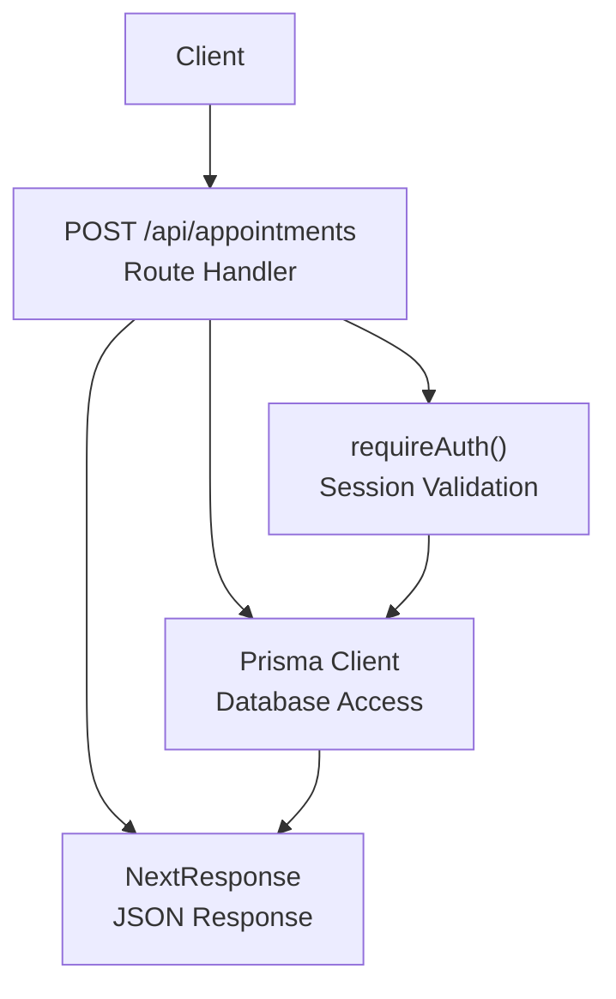
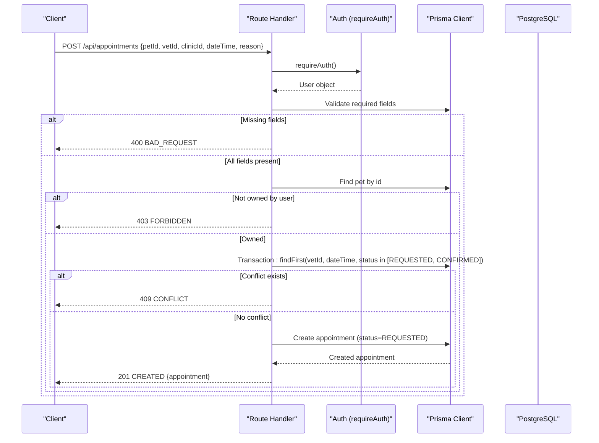
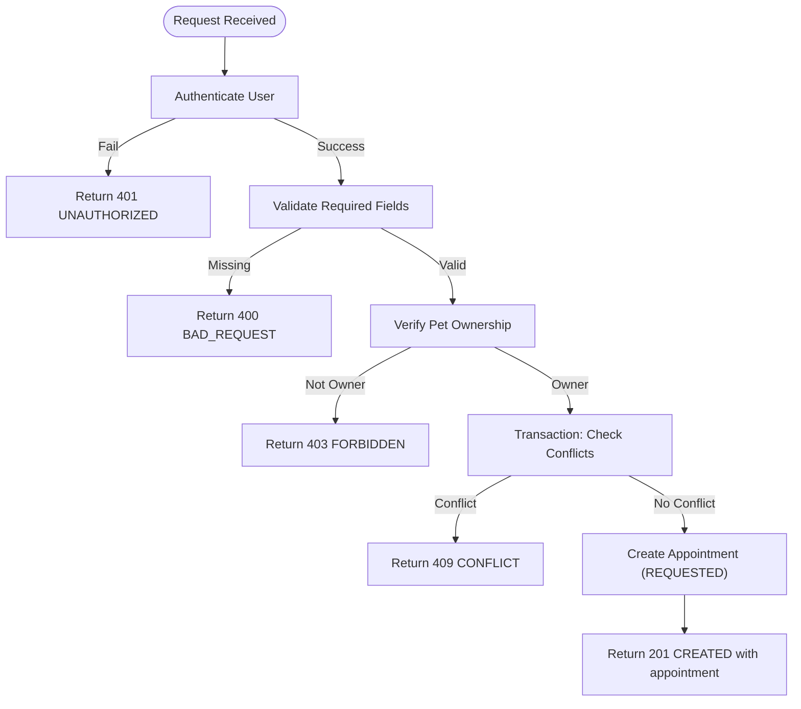
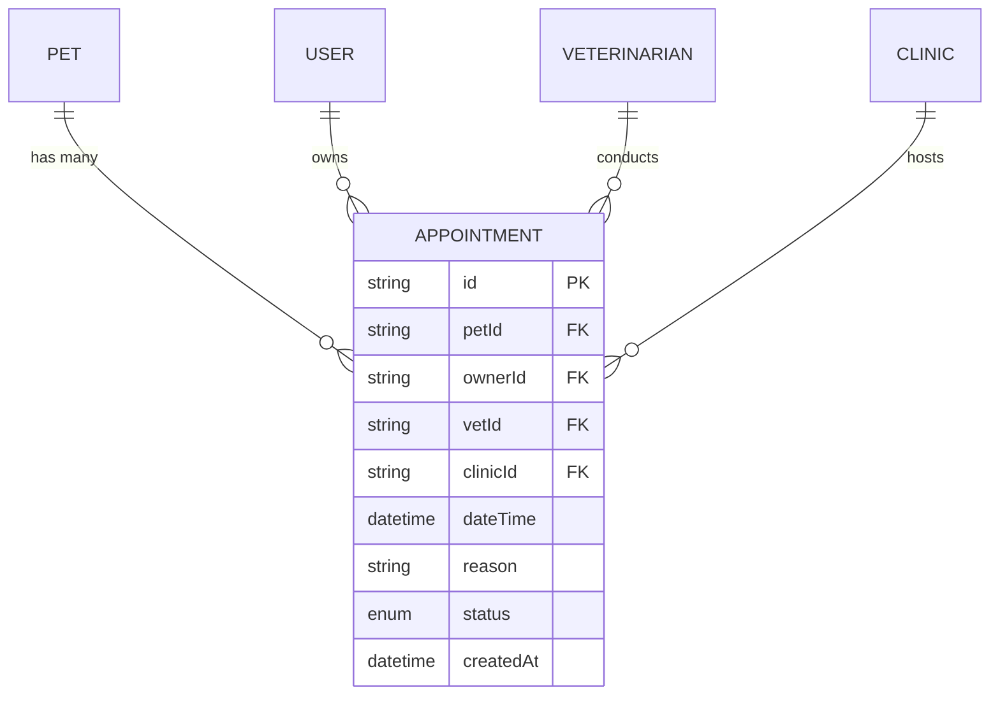
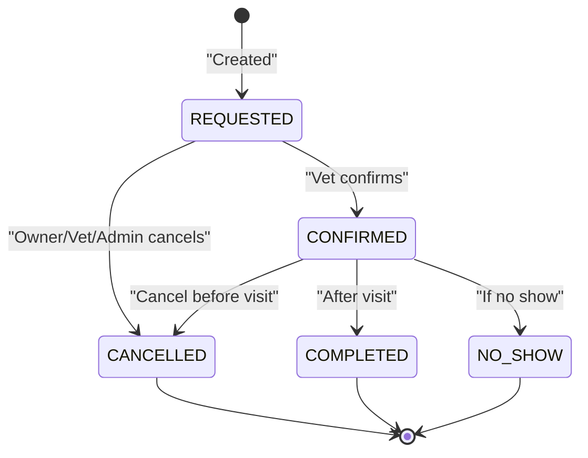
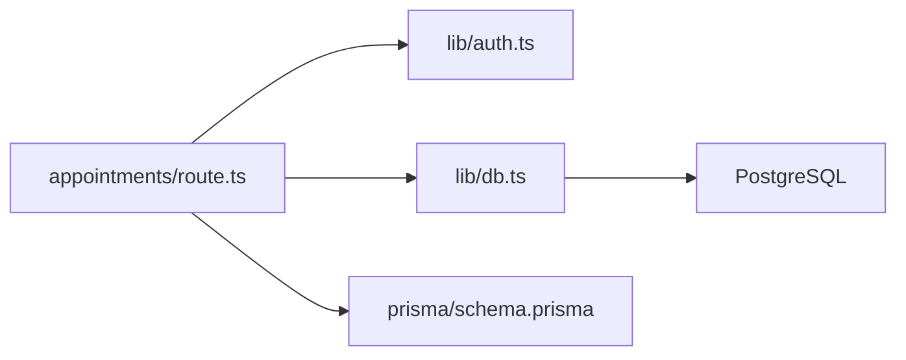

# Appointment Creation API

<cite>
**Referenced Files in This Document**
- [route.ts](file://app/api/appointments/route.ts)
- [route.ts](file://app/api/appointments/[appointmentId]/route.ts)
- [schema.prisma](file://prisma/schema.prisma)
- [auth.ts](file://lib/auth.ts)
- [db.ts](file://lib/db.ts)
- [03-api-specification.md](file://docs/03-architecture/03-api-specification.md)
- [test_booking.ts](file://test_booking.ts)
</cite>

## Table of Contents
1. [Introduction](#introduction)
2. [Project Structure](#project-structure)
3. [Core Components](#core-components)
4. [Architecture Overview](#architecture-overview)
5. [Detailed Component Analysis](#detailed-component-analysis)
6. [Dependency Analysis](#dependency-analysis)
7. [Performance Considerations](#performance-considerations)
8. [Troubleshooting Guide](#troubleshooting-guide)
9. [Conclusion](#conclusion)
10. [Appendices](#appendices)

## Introduction
This document provides detailed API documentation for creating appointments via the POST /api/appointments endpoint. It covers required fields, request body validation, authorization checks to ensure pet ownership, double-booking prevention using database transactions, response formats, and the appointment status workflow from REQUESTED to other states. It also includes examples of successful creation and error handling scenarios such as missing fields, unauthorized access, and time slot conflicts.

## Project Structure
The appointment creation flow is implemented in a Next.js App Router route that:
- Authenticates the user
- Validates input fields
- Enforces pet ownership
- Prevents double bookings with a transactional check
- Creates the appointment and returns it

**Diagram sources**
- [route.ts:70-143](file://app/api/appointments/route.ts#L70-L143)
- [auth.ts:109-115](file://lib/auth.ts#L109-L115)
- [db.ts:1-33](file://lib/db.ts#L1-L33)

**Section sources**
- [route.ts:70-143](file://app/api/appointments/route.ts#L70-L143)
- [auth.ts:109-115](file://lib/auth.ts#L109-L115)
- [db.ts:1-33](file://lib/db.ts#L1-L33)

## Core Components
- Authentication middleware: requireAuth ensures the caller has a valid session and returns the current user.
- Input validation: The endpoint requires petId, vetId, clinicId, dateTime, and reason; missing fields return a 400 BAD_REQUEST.
- Authorization: The endpoint verifies that the authenticated user owns the specified pet; otherwise returns 403 FORBIDDEN.
- Conflict detection: A database transaction checks for existing REQUESTED or CONFIRMED appointments at the same vetId and dateTime to prevent double booking; if found, returns 409 CONFLICT.
- Creation: On success, creates an appointment with status REQUESTED and returns the created record with related entities.

**Section sources**
- [route.ts:70-143](file://app/api/appointments/route.ts#L70-L143)
- [auth.ts:109-115](file://lib/auth.ts#L109-L115)
- [schema.prisma:164-182](file://prisma/schema.prisma#L164-L182)

## Architecture Overview
The POST /api/appointments endpoint orchestrates authentication, validation, authorization, conflict checking, and persistence.

**Diagram sources**
- [route.ts:70-143](file://app/api/appointments/route.ts#L70-L143)
- [auth.ts:109-115](file://lib/auth.ts#L109-L115)
- [schema.prisma:164-182](file://prisma/schema.prisma#L164-L182)

## Detailed Component Analysis

### Endpoint: POST /api/appointments
- Purpose: Create a new appointment for a pet with a veterinarian at a specific clinic and time.
- Authentication: Required. Unauthenticated requests receive 401 UNAUTHORIZED.
- Authorization: Only the owner of the pet can book an appointment for that pet. Non-owners receive 403 FORBIDDEN.
- Request Body Schema:
  - petId: string (required)
  - vetId: string (required)
  - clinicId: string (required)
  - dateTime: ISO 8601 datetime string (required)
  - reason: string (required)
- Validation:
  - If any required field is missing, returns 400 BAD_REQUEST with a descriptive message.
  - dateTime is parsed into a Date object before use.
- Pet Ownership Check:
  - Retrieves the pet by petId and compares its ownerId to the authenticated user’s id.
  - If mismatched or pet not found, returns 403 FORBIDDEN.
- Double-Booking Prevention:
  - Uses a Prisma transaction to atomically check for existing appointments with the same vetId and dateTime where status is REQUESTED or CONFIRMED.
  - If a conflict is found, returns 409 CONFLICT.
- Success Response:
  - Status: 201 CREATED
  - Body: { success: true, appointment: <Appointment with pet, vet.user, clinic included> }
- Error Responses:
  - 400 BAD_REQUEST: Missing required fields
  - 401 UNAUTHORIZED: Not logged in
  - 403 FORBIDDEN: Unauthorized pet ownership
  - 409 CONFLICT: Time slot already booked for the vet
  - 500 INTERNAL_SERVER_ERROR: Unexpected server error

**Diagram sources**
- [route.ts:70-143](file://app/api/appointments/route.ts#L70-L143)

**Section sources**
- [route.ts:70-143](file://app/api/appointments/route.ts#L70-L143)

### Data Model: Appointment
- Fields:
  - id: string (primary key)
  - petId: string (foreign key to Pet)
  - ownerId: string (foreign key to User)
  - vetId: string (foreign key to Veterinarian)
  - clinicId: string (foreign key to Clinic)
  - dateTime: DateTime
  - reason: string
  - status: AppointmentStatus enum defaulting to REQUESTED
  - createdAt: DateTime
- Indexes:
  - Composite index on vetId and dateTime supports efficient conflict checks.
  - Additional indexes on ownerId and petId optimize queries.

**Diagram sources**
- [schema.prisma:164-182](file://prisma/schema.prisma#L164-L182)

**Section sources**
- [schema.prisma:164-182](file://prisma/schema.prisma#L164-L182)

### Status Workflow: REQUESTED to Other States
- Initial state: When created, an appointment starts with status REQUESTED.
- Management:
  - Veterinarians can confirm, cancel, reject, or complete their appointments via PUT /api/appointments/[appointmentId].
  - Pet owners can cancel their own upcoming appointments.
  - Clinic admins and platform admins have broader management capabilities based on clinic association or role.
- Confirmation safeguards:
  - When confirming, the system checks for another confirmed appointment at the same vetId and dateTime to avoid conflicts.

**Diagram sources**
- [schema.prisma:22-28](file://prisma/schema.prisma#L22-L28)
- [route.ts:6-119](file://app/api/appointments/[appointmentId]/route.ts#L6-L119)

**Section sources**
- [route.ts:6-119](file://app/api/appointments/[appointmentId]/route.ts#L6-L119)
- [schema.prisma:22-28](file://prisma/schema.prisma#L22-L28)

### Examples

- Successful appointment creation:
  - Request: POST /api/appointments with { petId, vetId, clinicId, dateTime, reason }
  - Response: 201 CREATED with { success: true, appointment: {...} }
  - Reference: [route.ts:112-129](file://app/api/appointments/route.ts#L112-L129)

- Missing required fields:
  - Response: 400 BAD_REQUEST with { success: false, error: { code: 'BAD_REQUEST', message: 'Missing required booking fields.' } }
  - Reference: [route.ts:75-80](file://app/api/appointments/route.ts#L75-L80)

- Unauthorized access (not logged in):
  - Response: 401 UNAUTHORIZED with { success: false, error: { code: 'UNAUTHORIZED', message: 'Not logged in.' } }
  - Reference: [route.ts:131-135](file://app/api/appointments/route.ts#L131-L135)

- Unauthorized pet ownership:
  - Response: 403 FORBIDDEN with { success: false, error: { code: 'FORBIDDEN', message: 'You do not own this pet.' } }
  - Reference: [route.ts:85-91](file://app/api/appointments/route.ts#L85-L91)

- Time slot conflict (double booking):
  - Response: 409 CONFLICT with { success: false, error: { code: 'CONFLICT', message: 'The veterinarian is already booked for this time slot.' } }
  - Reference: [route.ts:94-110](file://app/api/appointments/route.ts#L94-L110)

- Confirming an appointment (vet side):
  - Endpoint: PUT /api/appointments/[appointmentId] with { status: 'CONFIRMED' }
  - Conflict guard during confirmation prevents overlapping confirmed slots
  - Reference: [route.ts:66-82](file://app/api/appointments/[appointmentId]/route.ts#L66-L82)

**Section sources**
- [route.ts:75-110](file://app/api/appointments/route.ts#L75-L110)
- [route.ts:66-82](file://app/api/appointments/[appointmentId]/route.ts#L66-L82)

## Dependency Analysis
- Route handler depends on:
  - Authentication via requireAuth to enforce session validity
  - Prisma client for data access and transactions
  - Prisma schema enums for status validation
- Database indices support efficient conflict checks and filtering by vet/time and owner/pet.

**Diagram sources**
- [route.ts:1-5](file://app/api/appointments/route.ts#L1-L5)
- [auth.ts:1-125](file://lib/auth.ts#L1-L125)
- [db.ts:1-33](file://lib/db.ts#L1-L33)
- [schema.prisma:164-182](file://prisma/schema.prisma#L164-L182)

**Section sources**
- [route.ts:1-5](file://app/api/appointments/route.ts#L1-L5)
- [auth.ts:1-125](file://lib/auth.ts#L1-L125)
- [db.ts:1-33](file://lib/db.ts#L1-L33)
- [schema.prisma:164-182](file://prisma/schema.prisma#L164-L182)

## Performance Considerations
- Use of composite index on vetId and dateTime accelerates conflict checks during creation and confirmation.
- Transactions ensure atomicity when checking for conflicts and creating appointments, preventing race conditions under concurrent requests.
- Include only necessary relations in responses to reduce payload size.

[No sources needed since this section provides general guidance]

## Troubleshooting Guide
- 400 BAD_REQUEST: Ensure all required fields are present and correctly formatted.
- 401 UNAUTHORIZED: Verify the session cookie is valid and not expired.
- 403 FORBIDDEN: Confirm the authenticated user owns the pet being booked.
- 409 CONFLICT: Choose a different time slot or verify existing REQUESTED/CONFIRMED appointments for the vet.
- 500 INTERNAL_SERVER_ERROR: Inspect server logs for unexpected errors.

**Section sources**
- [route.ts:75-143](file://app/api/appointments/route.ts#L75-L143)
- [route.ts:16-21](file://app/api/appointments/[appointmentId]/route.ts#L16-L21)

## Conclusion
The POST /api/appointments endpoint provides a secure and robust mechanism for booking veterinary appointments. It enforces strict input validation, ensures pet ownership, and prevents double bookings through transactional conflict checks. The resulting appointment begins in REQUESTED status and can be transitioned by authorized roles through dedicated endpoints.

[No sources needed since this section summarizes without analyzing specific files]

## Appendices

### API Specification Reference
- Endpoint: POST /api/appointments
- Authentication: Required
- Authorization: PET_OWNER
- Request Body: { petId, vetId, clinicId, dateTime, reason }
- Response: 201 Created with appointment details
- Reference: [03-api-specification.md:193-212](file://docs/03-architecture/03-api-specification.md#L193-L212)

**Section sources**
- [03-api-specification.md:193-212](file://docs/03-architecture/03-api-specification.md#L193-L212)

### Test Scenarios
- Example test script demonstrates setup of users, pets, vets, clinics, and testing of booking flows including past dates, double bookings, and working hours constraints.
- Reference: [test_booking.ts:1-149](file://test_booking.ts#L1-L149)

**Section sources**
- [test_booking.ts:1-149](file://test_booking.ts#L1-L149)