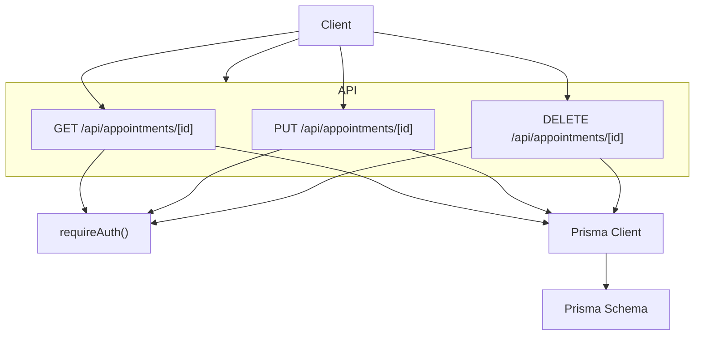
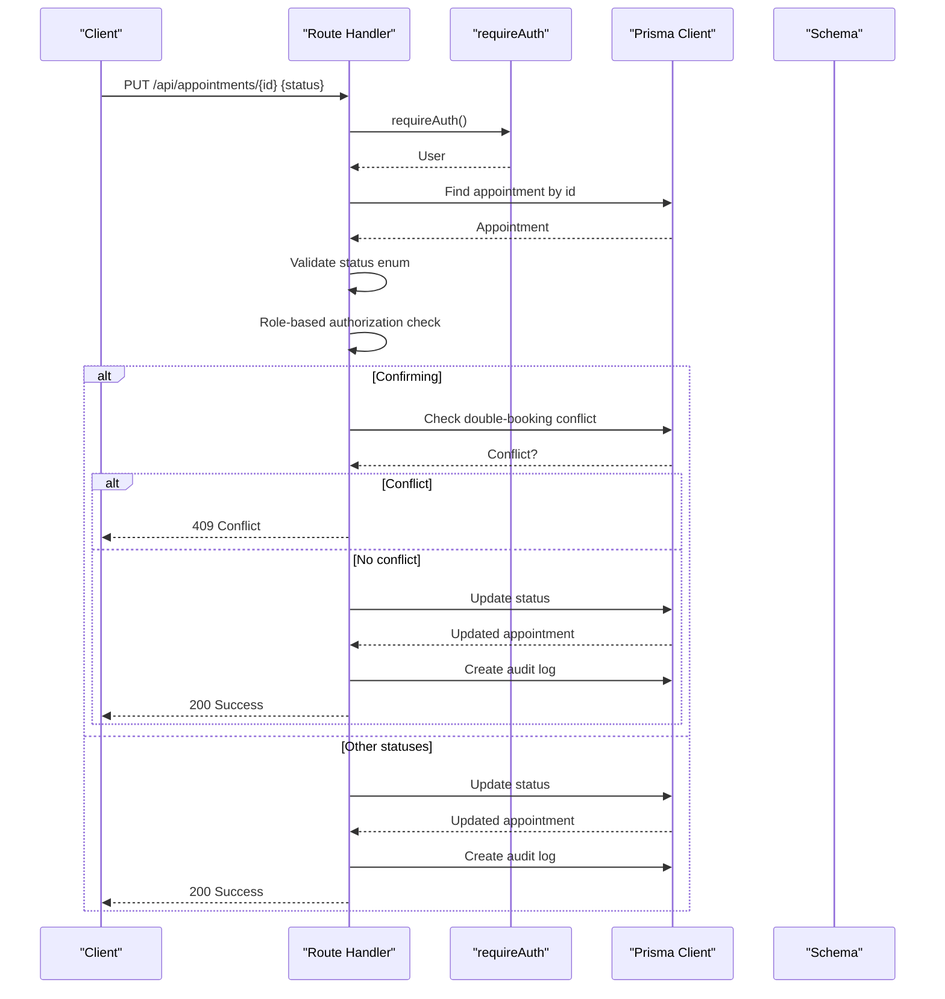
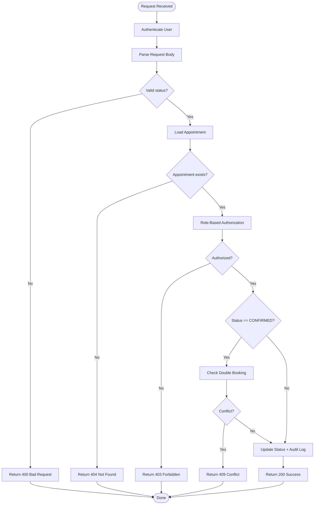
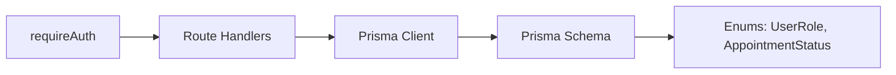

# Appointment Management API

<cite>
**Referenced Files in This Document**
- [route.ts](file://app/api/appointments/[appointmentId]/route.ts)
- [route.ts](file://app/api/appointments/route.ts)
- [route.ts](file://app/api/clinic/appointments/route.ts)
- [schema.prisma](file://prisma/schema.prisma)
- [auth.ts](file://lib/auth.ts)
- [db.ts](file://lib/db.ts)
</cite>

## Table of Contents
1. [Introduction](#introduction)
2. [Project Structure](#project-structure)
3. [Core Components](#core-components)
4. [Architecture Overview](#architecture-overview)
5. [Detailed Component Analysis](#detailed-component-analysis)
6. [Dependency Analysis](#dependency-analysis)
7. [Performance Considerations](#performance-considerations)
8. [Troubleshooting Guide](#troubleshooting-guide)
9. [Conclusion](#conclusion)
10. [Appendices](#appendices)

## Introduction
This document provides detailed API documentation for individual appointment management endpoints under /api/appointments/[appointmentId]. It covers:
- GET to retrieve a specific appointment’s details
- PUT/PATCH to update an appointment’s status and information
- DELETE to cancel an appointment (via status transition)
It also documents the allowed appointment status transitions, role-based permissions, validation rules, business logic for modifications, cascade effects on related records, common workflows, error responses, and concurrency handling.

## Project Structure
The appointment management functionality is implemented as Next.js Route Handlers with Prisma data access and session-based authentication.

**Diagram sources**
- [route.ts:1-119](file://app/api/appointments/[appointmentId]/route.ts#L1-L119)
- [route.ts:1-143](file://app/api/appointments/route.ts#L1-L143)
- [schema.prisma:164-182](file://prisma/schema.prisma#L164-L182)
- [auth.ts:109-115](file://lib/auth.ts#L109-L115)
- [db.ts:1-33](file://lib/db.ts#L1-L33)

**Section sources**
- [route.ts:1-119](file://app/api/appointments/[appointmentId]/route.ts#L1-L119)
- [route.ts:1-143](file://app/api/appointments/route.ts#L1-L143)
- [schema.prisma:164-182](file://prisma/schema.prisma#L164-L182)
- [auth.ts:109-115](file://lib/auth.ts#L109-L115)
- [db.ts:1-33](file://lib/db.ts#L1-L33)

## Core Components
- Authentication middleware: requireAuth enforces session-based login and returns user context or throws UNAUTHENTICATED.
- Data layer: Prisma client configured via db.ts connects to PostgreSQL; schema defines entities including Appointment, User, Veterinarian, Clinic, Pet, and AuditLog.
- Endpoints:
  - GET /api/appointments/[appointmentId]: Retrieve a single appointment by ID.
  - PUT /api/appointments/[appointmentId]: Update appointment status with role checks and conflict detection.
  - DELETE /api/appointments/[appointmentId]: Not implemented in this route file; cancellation is performed via PUT with status CANCELLED.

Key behaviors:
- Role-based authorization per action.
- Double-booking prevention when confirming appointments.
- Audit logging for status changes.
- Consistent error response shape.

**Section sources**
- [auth.ts:109-115](file://lib/auth.ts#L109-L115)
- [schema.prisma:164-182](file://prisma/schema.prisma#L164-L182)
- [route.ts:1-119](file://app/api/appointments/[appointmentId]/route.ts#L1-L119)

## Architecture Overview
The endpoint flow ensures secure, validated updates to appointment status while preventing conflicts and recording audit trails.

**Diagram sources**
- [route.ts:1-119](file://app/api/appointments/[appointmentId]/route.ts#L1-L119)
- [schema.prisma:164-182](file://prisma/schema.prisma#L164-L182)
- [auth.ts:109-115](file://lib/auth.ts#L109-L115)

## Detailed Component Analysis

### Endpoint: GET /api/appointments/[appointmentId]
- Purpose: Retrieve details for a specific appointment by its ID.
- Authorization: Requires authenticated user via requireAuth.
- Behavior: Fetches the appointment record using Prisma. If not found, returns 404.
- Response: Returns appointment details with related pet, vet, and clinic included.

Notes:
- The current implementation focuses on PUT for status updates and includes retrieval within that handler. A dedicated GET for a single appointment can be added similarly to the list endpoint patterns.

**Section sources**
- [route.ts:1-119](file://app/api/appointments/[appointmentId]/route.ts#L1-L119)

### Endpoint: PUT /api/appointments/[appointmentId]
- Purpose: Update appointment status (e.g., confirm, cancel, complete).
- Authorization:
  - PET_OWNER: Can only cancel their own upcoming appointments.
  - VETERINARIAN: Can manage appointments assigned to them (confirm, cancel, complete).
  - CLINIC_ADMIN: Can manage appointments at their clinic.
  - PLATFORM_ADMIN: Full access.
- Validation:
  - Status must be a valid enum value from AppointmentStatus.
  - On CONFIRMED, double-booking check prevents conflicts with another confirmed appointment for the same vet at the same time.
- Business Logic:
  - Updates the appointment status atomically.
  - Creates an audit log entry capturing previous and new status.
- Response:
  - 200 OK with updated appointment on success.
  - 400 BAD_REQUEST if status is invalid.
  - 401 UNAUTHORIZED if not logged in.
  - 403 FORBIDDEN if unauthorized for the requested transition.
  - 404 NOT_FOUND if appointment does not exist.
  - 409 CONFLICT if double-booking detected during confirmation.
  - 500 INTERNAL_SERVER_ERROR for unexpected errors.

**Diagram sources**
- [route.ts:1-119](file://app/api/appointments/[appointmentId]/route.ts#L1-L119)

**Section sources**
- [route.ts:1-119](file://app/api/appointments/[appointmentId]/route.ts#L1-L119)

### Endpoint: DELETE /api/appointments/[appointmentId]
- Current state: Not implemented in this route file.
- Recommended approach: Implement DELETE to set status to CANCELLED with the same authorization and validation as PUT. This aligns with the existing cancellation workflow via status transition.

**Section sources**
- [route.ts:1-119](file://app/api/appointments/[appointmentId]/route.ts#L1-L119)

### Related Endpoints for Context
- GET /api/appointments: Lists appointments filtered by role (pet owner, veterinarian, clinic admin).
- POST /api/appointments: Creates a new appointment with REQUESTED status, enforcing pet ownership and double-booking prevention.
- GET /api/clinic/appointments: Filters clinic-wide appointments by date/status for clinic admins.

These provide context for how appointments are created and viewed across roles.

**Section sources**
- [route.ts:1-143](file://app/api/appointments/route.ts#L1-L143)
- [route.ts:1-98](file://app/api/clinic/appointments/route.ts#L1-L98)

## Dependency Analysis
- Authentication dependency: All endpoints call requireAuth to ensure a valid session and user context.
- Database dependency: Prisma client interacts with PostgreSQL; schema defines relationships and constraints.
- Role model: UserRole enum governs access control decisions.
- Appointment model: AppointmentStatus enum constrains allowed values and drives validation.

**Diagram sources**
- [auth.ts:109-115](file://lib/auth.ts#L109-L115)
- [db.ts:1-33](file://lib/db.ts#L1-L33)
- [schema.prisma:9-28](file://prisma/schema.prisma#L9-L28)
- [schema.prisma:164-182](file://prisma/schema.prisma#L164-L182)

**Section sources**
- [auth.ts:109-115](file://lib/auth.ts#L109-L115)
- [db.ts:1-33](file://lib/db.ts#L1-L33)
- [schema.prisma:9-28](file://prisma/schema.prisma#L9-L28)
- [schema.prisma:164-182](file://prisma/schema.prisma#L164-L182)

## Performance Considerations
- Index usage: Appointments are indexed on vetId+dateTime and ownerId to optimize conflict checks and filtering.
- Transactional safety: Creation uses a transaction to prevent race conditions during booking; similar transactions should be used for updates where necessary.
- N+1 queries: Include relations in queries to reduce round trips; avoid unnecessary joins.
- Concurrency: For high-concurrency scenarios, consider database-level constraints or advisory locks to enforce unique time slots per vet.

[No sources needed since this section provides general guidance]

## Troubleshooting Guide
Common errors and causes:
- 401 UNAUTHORIZED: Missing or expired session token. Ensure the client sends a valid session cookie.
- 400 BAD_REQUEST: Invalid status value or missing required fields. Verify payload matches expected enums and fields.
- 403 FORBIDDEN: Unauthorized role or resource mismatch (e.g., pet owner trying to modify another’s appointment).
- 404 NOT_FOUND: Appointment ID does not exist.
- 409 CONFLICT: Double-booking detected when confirming an appointment at the same time slot for the same vet.
- 500 INTERNAL_SERVER_ERROR: Unexpected server-side issues; check logs and database connectivity.

Operational tips:
- Always include audit logs to trace who changed what and when.
- Use consistent error shapes with code and message fields for client handling.
- Validate inputs early to fail fast and reduce database load.

**Section sources**
- [route.ts:1-119](file://app/api/appointments/[appointmentId]/route.ts#L1-L119)
- [route.ts:1-143](file://app/api/appointments/route.ts#L1-L143)

## Conclusion
The appointment management API provides robust, role-aware status updates with strong validation and conflict prevention. While GET for a single appointment is not explicitly implemented in the provided route, the pattern is clear and can be added consistently. DELETE is recommended to map to cancellation via status transition to maintain consistency. Audit logging and standardized error responses support reliability and observability.

[No sources needed since this section summarizes without analyzing specific files]

## Appendices

### Appointment Status Transitions and Roles
Allowed transitions based on current implementation:
- REQUESTED -> CONFIRMED: Veterinarian or Clinic Admin (with appropriate scope).
- REQUESTED -> CANCELLED: Pet Owner (own appointment), Veterinarian (assigned), Clinic Admin (clinic scope), Platform Admin.
- CONFIRMED -> COMPLETED: Veterinarian or Clinic Admin (with appropriate scope).
- Any -> CANCELLED: As above depending on role and scope.
- NO_SHOW: Not enforced in the current route; could be added for administrative marking.

Constraints:
- Double-booking prevention on CONFIRMED transitions.
- Role-based authorization boundaries enforced per request.

**Section sources**
- [route.ts:1-119](file://app/api/appointments/[appointmentId]/route.ts#L1-L119)
- [schema.prisma:22-28](file://prisma/schema.prisma#L22-L28)

### Common Workflows

#### Confirming an Appointment
- Actor: Veterinarian or Clinic Admin.
- Steps:
  - Authenticate.
  - Send PUT with status CONFIRMED.
  - System checks double-booking; if conflict, returns 409.
  - On success, returns updated appointment and creates audit log.

**Section sources**
- [route.ts:1-119](file://app/api/appointments/[appointmentId]/route.ts#L1-L119)

#### Rescheduling an Appointment
- Approach: Update dateTime via a PATCH-like operation. Since the current route updates status, extend it to accept dateTime updates alongside status.
- Validation: Re-run double-booking checks for the new time slot.
- Authorization: Same role checks apply.

Note: Extend the route to handle dateTime updates and re-validate conflicts.

**Section sources**
- [route.ts:1-119](file://app/api/appointments/[appointmentId]/route.ts#L1-L119)

#### Canceling an Appointment
- Actors:
  - Pet Owner: Only their own upcoming appointments.
  - Veterinarian: Assigned appointments.
  - Clinic Admin: Appointments at their clinic.
  - Platform Admin: Any appointment.
- Steps:
  - Authenticate.
  - Send PUT with status CANCELLED.
  - System validates role and updates status; creates audit log.

**Section sources**
- [route.ts:1-119](file://app/api/appointments/[appointmentId]/route.ts#L1-L119)

#### Handling Concurrent Modifications
- Use database transactions around critical sections (as done in creation).
- Consider optimistic locking or versioned records if concurrent edits to non-status fields are introduced.
- Enforce unique constraints at the database level for vet+dateTime combinations to guard against race conditions.

**Section sources**
- [route.ts:1-143](file://app/api/appointments/route.ts#L1-L143)

### Error Responses Reference
- 400 BAD_REQUEST: Invalid status or missing fields.
- 401 UNAUTHORIZED: Not logged in.
- 403 FORBIDDEN: Unauthorized role/resource.
- 404 NOT_FOUND: Appointment not found.
- 409 CONFLICT: Double-booking during confirmation.
- 500 INTERNAL_SERVER_ERROR: Server error.

**Section sources**
- [route.ts:1-119](file://app/api/appointments/[appointmentId]/route.ts#L1-L119)
- [route.ts:1-143](file://app/api/appointments/route.ts#L1-L143)