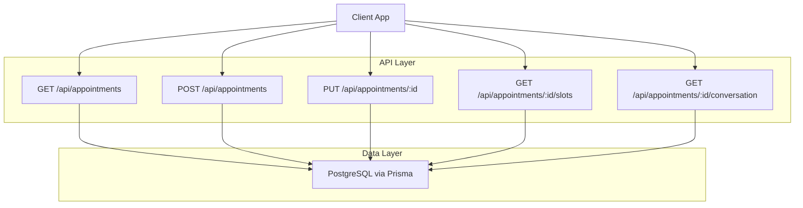
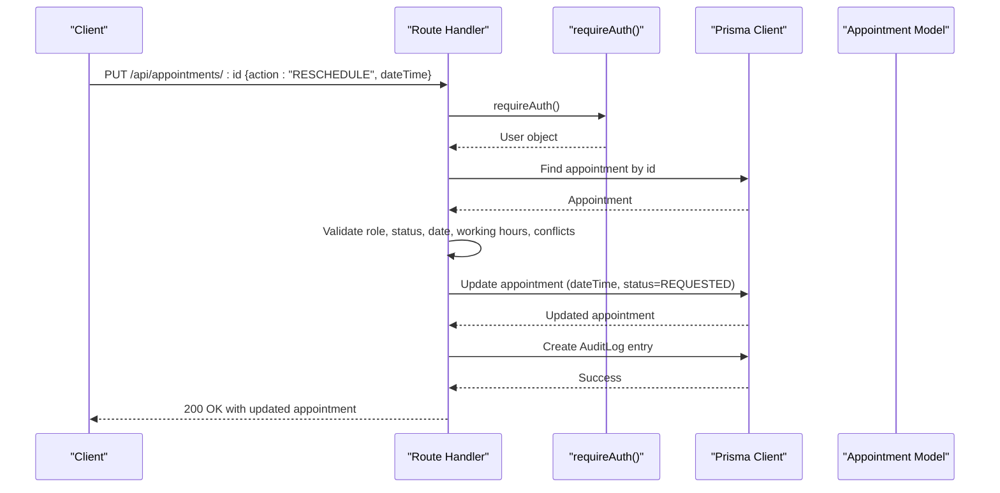
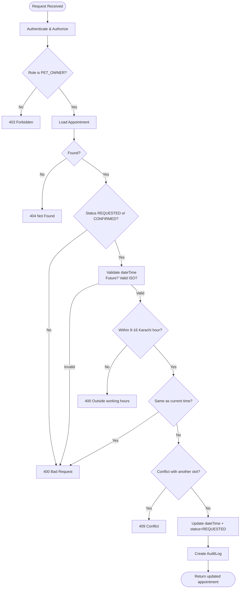
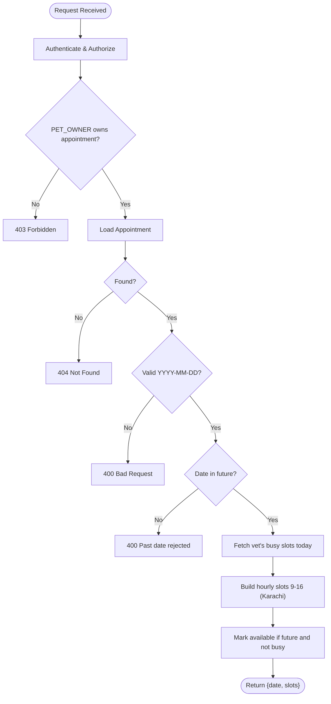
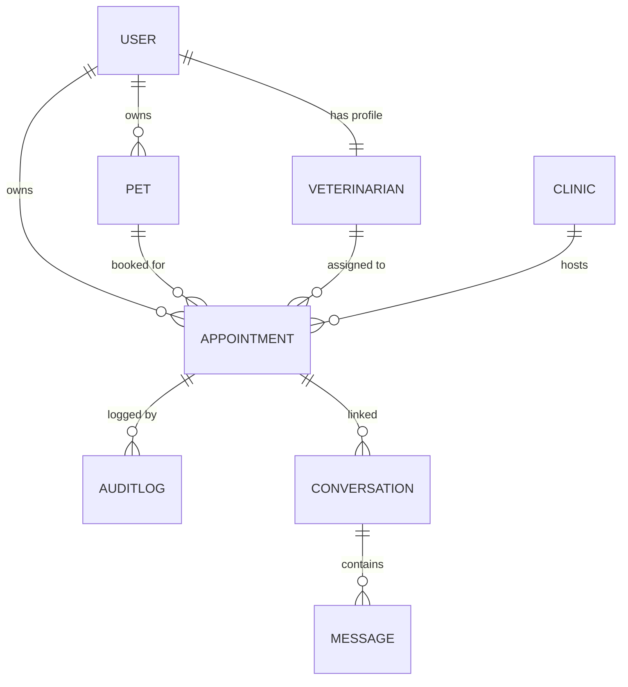
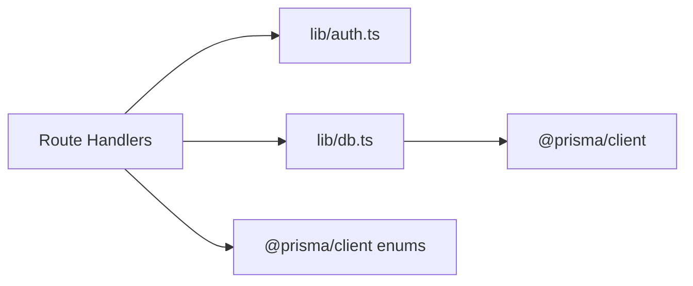

# Appointment Rescheduling API

<cite>
**Referenced Files in This Document**
- [route.ts](file://app/api/appointments/route.ts)
- [route.ts](file://app/api/appointments/[appointmentId]/route.ts)
- [route.ts](file://app/api/appointments/[appointmentId]/slots/route.ts)
- [route.ts](file://app/api/appointments/[appointmentId]/conversation/route.ts)
- [schema.prisma](file://prisma/schema.prisma)
- [auth.ts](file://lib/auth.ts)
- [db.ts](file://lib/db.ts)
</cite>

## Table of Contents
1. Introduction
2. Project Structure
3. Core Components
4. Architecture Overview
5. Detailed Component Analysis
6. Dependency Analysis
7. Performance Considerations
8. Troubleshooting Guide
9. Conclusion

## Introduction
This document describes the Appointment Rescheduling API for a pet healthcare platform. It explains how pet owners can reschedule upcoming appointments, how availability is computed, and how authorization, validation, and audit logging are enforced. The system supports multiple roles (Pet Owner, Veterinarian, Clinic Admin, Platform Admin) and enforces working hours and double-booking constraints to ensure consistent scheduling.

## Project Structure
The appointment rescheduling feature spans several Next.js Route Handlers under app/api/appointments:
- GET/POST /api/appointments: list and create appointments
- PUT /api/appointments/[appointmentId]: confirm/cancel/reschedule/update status with role-based authorization
- GET /api/appointments/[appointmentId]/slots: compute available time slots for rescheduling
- GET /api/appointments/[appointmentId]/conversation: access or create conversation tied to an appointment

**Diagram sources**
- [route.ts:7-75](file://app/api/appointments/route.ts#L7-L75)
- [route.ts:77-157](file://app/api/appointments/route.ts#L77-L157)
- [route.ts:7-241](file://app/api/appointments/[appointmentId]/route.ts#L7-L241)
- [route.ts:15-116](file://app/api/appointments/[appointmentId]/slots/route.ts#L15-L116)
- [route.ts:6-64](file://app/api/appointments/[appointmentId]/conversation/route.ts#L6-L64)
- [db.ts:1-33](file://lib/db.ts#L1-L33)

**Section sources**
- [route.ts:7-75](file://app/api/appointments/route.ts#L7-L75)
- [route.ts:77-157](file://app/api/appointments/route.ts#L77-L157)
- [route.ts:7-241](file://app/api/appointments/[appointmentId]/route.ts#L7-L241)
- [route.ts:15-116](file://app/api/appointments/[appointmentId]/slots/route.ts#L15-L116)
- [route.ts:6-64](file://app/api/appointments/[appointmentId]/conversation/route.ts#L6-L64)
- [db.ts:1-33](file://lib/db.ts#L1-L33)

## Core Components
- Authentication and Authorization: requireAuth ensures requests are authenticated; role checks enforce who can perform actions like rescheduling or updating status.
- Appointment CRUD: List by role-scoped filters; create with ownership and conflict checks; update status or reschedule with strict validations.
- Availability Calculation: Compute hourly slots within working hours while excluding busy times for the vet on the requested date.
- Audit Logging: Record reschedules and status changes for compliance and traceability.

Key responsibilities:
- GET /api/appointments: returns appointments filtered by user role with enriched relations.
- POST /api/appointments: validates inputs, verifies pet ownership, prevents double booking, creates REQUESTED appointment.
- PUT /api/appointments/[appointmentId]: handles RESCHEDULE action and general status updates with role-based authorization and conflict checks.
- GET /api/appointments/[appointmentId]/slots: returns available hourly slots for a given date based on vet’s existing bookings and working hours.
- GET /api/appointments/[appointmentId]/conversation: retrieves or creates a conversation linked to the appointment when allowed.

**Section sources**
- [auth.ts:109-124](file://lib/auth.ts#L109-L124)
- [route.ts:7-75](file://app/api/appointments/route.ts#L7-L75)
- [route.ts:77-157](file://app/api/appointments/route.ts#L77-L157)
- [route.ts:7-241](file://app/api/appointments/[appointmentId]/route.ts#L7-L241)
- [route.ts:15-116](file://app/api/appointments/[appointmentId]/slots/route.ts#L15-L116)
- [route.ts:6-64](file://app/api/appointments/[appointmentId]/conversation/route.ts#L6-L64)

## Architecture Overview
The API follows a layered approach:
- Route handlers validate input, enforce authorization, and coordinate data operations.
- Prisma client interacts with PostgreSQL using a connection pool configured per environment.
- Working hours and timezone rules are applied server-side to ensure consistency across clients.

**Diagram sources**
- [route.ts:7-241](file://app/api/appointments/[appointmentId]/route.ts#L7-L241)
- [auth.ts:109-124](file://lib/auth.ts#L109-L124)
- [db.ts:1-33](file://lib/db.ts#L1-L33)
- [schema.prisma:168-187](file://prisma/schema.prisma#L168-L187)

## Detailed Component Analysis

### Reschedule Endpoint: PUT /api/appointments/[appointmentId]
Purpose:
- Allow pet owners to reschedule upcoming appointments to a new future time within working hours.
- Enforce role-based permissions and prevent double bookings.
- Reset status to REQUESTED after rescheduling and log the change.

Key behaviors:
- Only PET_OWNER can reschedule.
- Accepts only REQUESTED or CONFIRMED statuses for rescheduling.
- Validates that the new date/time is in the future and within working hours (Asia/Karachi 9 AM–5 PM).
- Prevents same-time reschedules and conflicts with other booked slots for the same vet.
- Updates the appointment and writes an audit log.

Error handling:
- Returns 401 if unauthenticated.
- Returns 403 if unauthorized (wrong role or not owner).
- Returns 400 for invalid inputs, past dates, off-hours, or same-time reschedule.
- Returns 404 if appointment not found.
- Returns 409 if conflict detected.

**Diagram sources**
- [route.ts:17-136](file://app/api/appointments/[appointmentId]/route.ts#L17-L136)

**Section sources**
- [route.ts:17-136](file://app/api/appointments/[appointmentId]/route.ts#L17-L136)

### Slots Endpoint: GET /api/appointments/[appointmentId]/slots
Purpose:
- Provide available hourly slots for rescheduling on a specified date for the appointment’s vet.

Key behaviors:
- Restricted to PET_OWNER and must own the appointment.
- Requires a valid YYYY-MM-DD date parameter.
- Rejects past dates.
- Computes busy times from the vet’s existing REQUESTED/CONFIRMED appointments on that day, excluding the current appointment.
- Generates hourly slots from 9 AM to 5 PM (Karachi wall-clock), marking each as available if it is in the future and not busy.

Response:
- Returns date and an array of slot objects with hour, label, iso timestamp, and availability flag.

**Diagram sources**
- [route.ts:15-116](file://app/api/appointments/[appointmentId]/slots/route.ts#L15-L116)

**Section sources**
- [route.ts:15-116](file://app/api/appointments/[appointmentId]/slots/route.ts#L15-L116)

### General Status Updates: PUT /api/appointments/[appointmentId]
Purpose:
- Allow authorized users to transition appointment status (e.g., confirm, cancel, complete) with role-based boundaries and conflict checks.

Key behaviors:
- Validates status against enum values.
- Applies role-specific authorization:
  - PET_OWNER: can cancel their own upcoming appointments.
  - VETERINARIAN: can manage appointments assigned to them.
  - CLINIC_ADMIN: can manage appointments at their clinic.
  - PLATFORM_ADMIN: full access.
- During confirmation, checks for conflicting confirmed appointments at the same time for the same vet.
- Writes an audit log for all status transitions.

**Section sources**
- [route.ts:139-228](file://app/api/appointments/[appointmentId]/route.ts#L139-L228)

### Conversation Access: GET /api/appointments/[appointmentId]/conversation
Purpose:
- Retrieve or create a conversation associated with an appointment for chat between owner and vet.

Key behaviors:
- Authorized for PET_OWNER (must own appointment) and VETERINARIAN (must be assigned to appointment).
- Only allowed for CONFIRMED or COMPLETED appointments.
- Creates a conversation record if none exists.

**Section sources**
- [route.ts:6-64](file://app/api/appointments/[appointmentId]/conversation/route.ts#L6-L64)

### Data Models and Relationships
Core models involved in rescheduling:
- User: identifies roles and relationships to pets, vets, clinics, and conversations.
- Pet: belongs to an owner; linked to appointments.
- Veterinarian: linked to appointments and conversations.
- Clinic: linked to appointments and admins.
- Appointment: central entity with dateTime, reason, status, and relations to pet, owner, vet, clinic, and optional conversation.
- AuditLog: records actions such as APPOINTMENT_RESCHEDULED and APPOINTMENT_UPDATED.
- Conversation and Message: support post-confirmation communication.

**Diagram sources**
- [schema.prisma:30-55](file://prisma/schema.prisma#L30-L55)
- [schema.prisma:70-91](file://prisma/schema.prisma#L70-L91)
- [schema.prisma:93-109](file://prisma/schema.prisma#L93-L109)
- [schema.prisma:111-123](file://prisma/schema.prisma#L111-L123)
- [schema.prisma:168-187](file://prisma/schema.prisma#L168-L187)
- [schema.prisma:303-316](file://prisma/schema.prisma#L303-L316)
- [schema.prisma:318-349](file://prisma/schema.prisma#L318-L349)

**Section sources**
- [schema.prisma:30-55](file://prisma/schema.prisma#L30-L55)
- [schema.prisma:70-91](file://prisma/schema.prisma#L70-L91)
- [schema.prisma:93-109](file://prisma/schema.prisma#L93-L109)
- [schema.prisma:111-123](file://prisma/schema.prisma#L111-L123)
- [schema.prisma:168-187](file://prisma/schema.prisma#L168-L187)
- [schema.prisma:303-316](file://prisma/schema.prisma#L303-L316)
- [schema.prisma:318-349](file://prisma/schema.prisma#L318-L349)

## Dependency Analysis
- Route handlers depend on:
  - Authentication utility (requireAuth) for session validation and user retrieval.
  - Prisma client for database operations.
  - Prisma enums (AppointmentStatus) for validation.
- Database configuration uses a connection pool in production and a global singleton in development to avoid hot-reload issues.

**Diagram sources**
- [auth.ts:109-124](file://lib/auth.ts#L109-L124)
- [db.ts:1-33](file://lib/db.ts#L1-L33)

**Section sources**
- [auth.ts:109-124](file://lib/auth.ts#L109-L124)
- [db.ts:1-33](file://lib/db.ts#L1-L33)

## Performance Considerations
- Indexing: Appointment model includes indexes on vetId+dateTime and ownerId to optimize conflict checks and listing queries.
- Timezone handling: Working hours are enforced using Asia/Karachi wall-clock time to avoid ambiguity and ensure consistent availability calculations.
- Transaction usage: Creation flow uses a transaction to safely check for conflicts before creating an appointment.
- Minimal payload: Responses include only necessary relations to reduce bandwidth.

[No sources needed since this section provides general guidance]

## Troubleshooting Guide
Common errors and resolutions:
- 401 Unauthorized: Ensure a valid session cookie is present; verify authentication middleware is invoked.
- 403 Forbidden: Confirm the user has the required role and owns the appointment when applicable.
- 400 Bad Request: Check that dateTime is valid, future, and within working hours; ensure required fields are provided.
- 404 Not Found: Verify the appointment ID exists.
- 409 Conflict: Another appointment already occupies the desired time slot; choose a different time.

Operational tips:
- Use the slots endpoint to obtain valid reschedule options aligned with working hours and existing bookings.
- Review audit logs for reschedule and status change history to diagnose discrepancies.

**Section sources**
- [route.ts:17-136](file://app/api/appointments/[appointmentId]/route.ts#L17-L136)
- [route.ts:139-228](file://app/api/appointments/[appointmentId]/route.ts#L139-L228)
- [route.ts:15-116](file://app/api/appointments/[appointmentId]/slots/route.ts#L15-L116)

## Conclusion
The Appointment Rescheduling API provides a robust, secure, and consistent mechanism for pet owners to reschedule upcoming appointments. It enforces role-based permissions, validates inputs, respects working hours, prevents double bookings, and maintains an audit trail. The slots endpoint simplifies client-side scheduling by returning precomputed availability aligned with business rules.