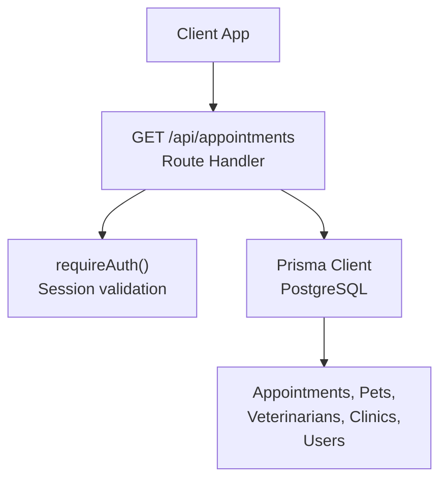
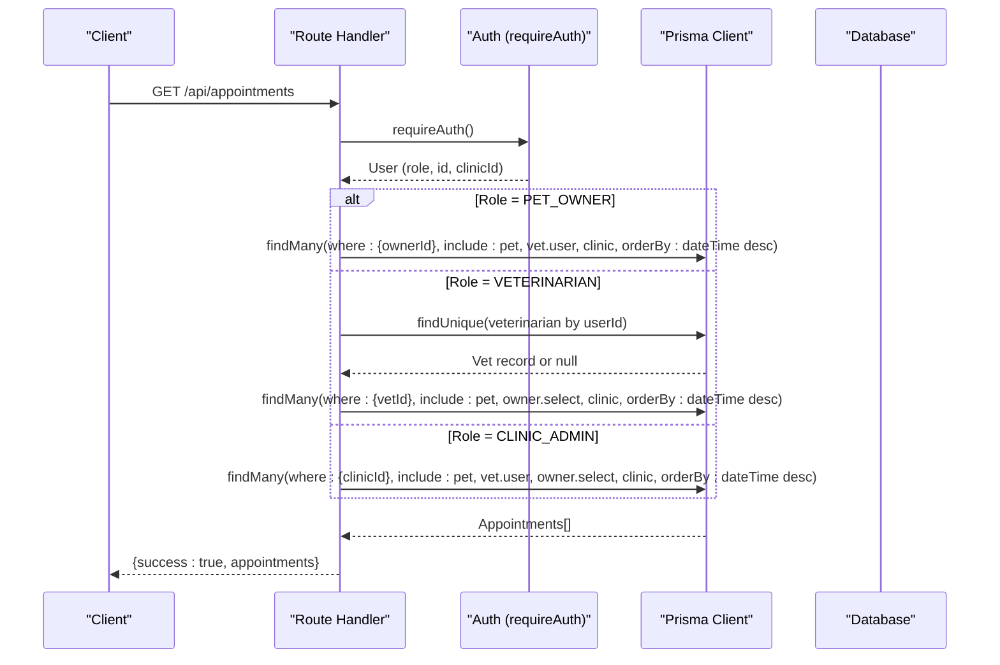
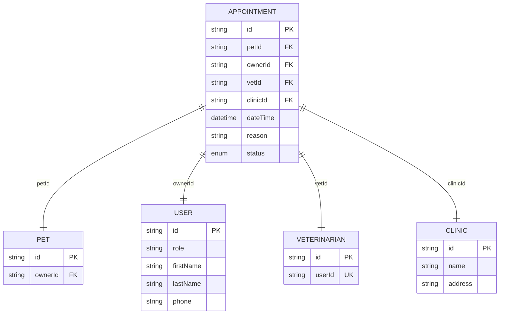
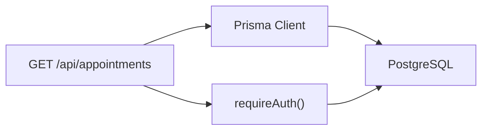

# Appointment Retrieval API

<cite>
**Referenced Files in This Document**
- [route.ts](file://app/api/appointments/route.ts)
- [route.ts](file://app/api/clinic/appointments/route.ts)
- [schema.prisma](file://prisma/schema.prisma)
- [auth.ts](file://lib/auth.ts)
- [db.ts](file://lib/db.ts)
- [03-api-specification.md](file://docs/03-architecture/03-api-specification.md)
</cite>

## Table of Contents
1. [Introduction](#introduction)
2. [Project Structure](#project-structure)
3. [Core Components](#core-components)
4. [Architecture Overview](#architecture-overview)
5. [Detailed Component Analysis](#detailed-component-analysis)
6. [Dependency Analysis](#dependency-analysis)
7. [Performance Considerations](#performance-considerations)
8. [Troubleshooting Guide](#troubleshooting-guide)
9. [Conclusion](#conclusion)
10. [Appendices](#appendices)

## Introduction
This document provides comprehensive API documentation for retrieving appointments via the GET /api/appointments endpoint. It explains role-based data filtering for PET_OWNER, VETERINARIAN, and CLINIC_ADMIN roles, including how each role receives a different dataset:
- PET_OWNER: their own appointments
- VETERINARIAN: appointments for their patients (appointments assigned to them)
- CLINIC_ADMIN: all appointments within their clinic

It also details included related data (pet, veterinarian, owner contact information, clinic), sorting behavior by date/time, error handling for authentication failures, pagination considerations, and performance optimization strategies for large datasets.

## Project Structure
The appointment retrieval logic is implemented as a Next.js Route Handler under app/api/appointments/route.ts. Authentication is enforced via lib/auth.ts using session cookies and database-backed sessions. Data access uses Prisma with PostgreSQL through lib/db.ts. The data model and relationships are defined in prisma/schema.prisma. An additional clinic-scoped endpoint exists at app/api/clinic/appointments/route.ts that supports status filters and richer owner/vet includes for administrative views.

**Diagram sources**
- [route.ts:7-67](file://app/api/appointments/route.ts#L7-L67)
- [auth.ts:100-115](file://lib/auth.ts#L100-L115)
- [db.ts:1-33](file://lib/db.ts#L1-L33)
- [schema.prisma:164-182](file://prisma/schema.prisma#L164-L182)

**Section sources**
- [route.ts:1-67](file://app/api/appointments/route.ts#L1-L67)
- [auth.ts:1-125](file://lib/auth.ts#L1-L125)
- [db.ts:1-33](file://lib/db.ts#L1-L33)
- [schema.prisma:1-312](file://prisma/schema.prisma#L1-L312)

## Core Components
- Role-based filtering:
  - PET_OWNER: returns appointments where ownerId equals the authenticated user’s id
  - VETERINARIAN: resolves the vet profile from userId and returns appointments where vetId matches
  - CLINIC_ADMIN: returns appointments where clinicId equals the admin’s associated clinicId
- Related data inclusion:
  - PET_OWNER: includes pet, vet.user (firstName, lastName), and clinic
  - VETERINARIAN: includes pet, owner (firstName, lastName, phone), and clinic
  - CLINIC_ADMIN: includes pet, vet.user (firstName, lastName), owner (firstName, lastName), and clinic
- Sorting:
  - All three roles sort by dateTime descending (newest first)
- Error handling:
  - Unauthenticated requests return 401 with a standardized error envelope
  - Internal errors return 500 with a standardized error envelope

**Section sources**
- [route.ts:13-54](file://app/api/appointments/route.ts#L13-L54)
- [route.ts:55-67](file://app/api/appointments/route.ts#L55-L67)

## Architecture Overview
The GET /api/appointments endpoint enforces authentication, determines the caller’s role, and queries the database with role-specific filters and includes. The response always wraps results in a success envelope.

**Diagram sources**
- [route.ts:7-67](file://app/api/appointments/route.ts#L7-L67)
- [auth.ts:100-115](file://lib/auth.ts#L100-L115)
- [schema.prisma:164-182](file://prisma/schema.prisma#L164-L182)

## Detailed Component Analysis

### GET /api/appointments
- Purpose: Retrieve appointments filtered by the authenticated user’s role.
- Authentication: Required via session cookie; unauthenticated requests receive 401.
- Authorization:
  - PET_OWNER: sees only their own appointments
  - VETERINARIAN: sees appointments assigned to them
  - CLINIC_ADMIN: sees all appointments in their clinic
- Includes:
  - PET_OWNER: pet, vet.user (firstName, lastName), clinic
  - VETERINARIAN: pet, owner (firstName, lastName, phone), clinic
  - CLINIC_ADMIN: pet, vet.user (firstName, lastName), owner (firstName, lastName), clinic
- Sorting: dateTime descending
- Response envelope: { success: boolean, appointments: Appointment[] }
- Errors:
  - 401 UNAUTHORIZED when not logged in
  - 500 INTERNAL_SERVER_ERROR on unexpected server errors

Example responses by role:
- PET_OWNER:
  - Returns an array of appointments owned by the user, each including pet details, vet name, and clinic info, sorted newest first.
- VETERINARIAN:
  - Returns appointments assigned to the vet, each including pet details, owner contact (name and phone), and clinic info, sorted newest first.
- CLINIC_ADMIN:
  - Returns all appointments for the admin’s clinic, each including pet details, vet name, owner name, and clinic info, sorted newest first.

Notes:
- If a VETERINARIAN has no vet profile, the endpoint returns an empty list successfully.
- If a CLINIC_ADMIN lacks an associated clinicId, the endpoint returns an empty list successfully.

**Section sources**
- [route.ts:7-67](file://app/api/appointments/route.ts#L7-L67)

### Clinic Admins Alternative Endpoint: GET /api/clinic/appointments
- Purpose: Provides a clinic-wide view with additional filtering options for administrators.
- Authentication: Required; restricted to CLINIC_ADMIN role.
- Query parameters:
  - filter: ALL | TODAY | UPCOMING | COMPLETED | CANCELLED | REQUESTED | CONFIRMED
- Includes:
  - pet, owner (firstName, lastName, email, phone), vet.user (firstName, lastName, email), clinic
- Sorting: dateTime ascending
- Use cases:
  - TODAY: appointments within current day boundaries
  - UPCOMING: future dates with REQUESTED or CONFIRMED status
  - Status-based filters: COMPLETED, CANCELLED, REQUESTED, CONFIRMED

**Section sources**
- [route.ts:5-97](file://app/api/clinic/appointments/route.ts#L5-L97)

### Data Model Relationships
The Appointment model links to Pet, Owner (User), Veterinarian, and Clinic. Indexes exist on vetId+dateTime, ownerId, and petId to support efficient querying.

**Diagram sources**
- [schema.prisma:164-182](file://prisma/schema.prisma#L164-L182)
- [schema.prisma:30-53](file://prisma/schema.prisma#L30-L53)
- [schema.prisma:68-88](file://prisma/schema.prisma#L68-L88)
- [schema.prisma:90-105](file://prisma/schema.prisma#L90-L105)
- [schema.prisma:107-119](file://prisma/schema.prisma#L107-L119)

## Dependency Analysis
- Route handler depends on:
  - Authentication via requireAuth() which validates session cookies and returns the User object
  - Prisma client configured with PostgreSQL connection pooling
- Data dependencies:
  - Appointment records and related entities (Pet, Veterinarian, Clinic, User)
- External services:
  - None beyond the database

**Diagram sources**
- [route.ts:1-67](file://app/api/appointments/route.ts#L1-L67)
- [auth.ts:100-115](file://lib/auth.ts#L100-L115)
- [db.ts:1-33](file://lib/db.ts#L1-L33)

**Section sources**
- [route.ts:1-67](file://app/api/appointments/route.ts#L1-L67)
- [auth.ts:1-125](file://lib/auth.ts#L1-L125)
- [db.ts:1-33](file://lib/db.ts#L1-L33)

## Performance Considerations
- Current implementation does not implement pagination or query parameter filtering for the main GET /api/appointments endpoint. For large datasets, consider:
  - Adding cursor-based or offset-based pagination (e.g., limit and skip)
  - Supporting query parameters for status filtering and date ranges
  - Using select to fetch only needed fields instead of full includes when possible
- Database indexes:
  - Existing indexes on vetId+dateTime, ownerId, and petId help with common queries
- Caching:
  - Consider short-lived caching for read-heavy scenarios (e.g., Redis) with cache invalidation on updates
- Connection pooling:
  - Production uses a pooled PrismaPg adapter; ensure pool size is tuned for expected concurrency
- N+1 queries:
  - Includes are used judiciously; avoid over-fetching by selecting only required fields for high-volume endpoints

[No sources needed since this section provides general guidance]

## Troubleshooting Guide
Common issues and resolutions:
- 401 Unauthorized:
  - Cause: Missing or invalid session cookie
  - Resolution: Ensure login flow sets the session cookie and that subsequent requests include it
- 500 Internal Server Error:
  - Cause: Unexpected server-side error during processing
  - Resolution: Check logs and database connectivity; verify environment variables for DATABASE_URL
- Empty results:
  - VETERINARIAN without a vet profile: returns empty list intentionally
  - CLINIC_ADMIN without clinicId: returns empty list intentionally
  - Verify role and associated profiles/clinic assignments

Error response envelope:
- { success: false, error: { code: "UNAUTHORIZED"|"INTERNAL_SERVER_ERROR", message: "..." } }

**Section sources**
- [route.ts:55-67](file://app/api/appointments/route.ts#L55-L67)
- [auth.ts:109-115](file://lib/auth.ts#L109-L115)

## Conclusion
The GET /api/appointments endpoint provides role-based retrieval of appointments with consistent sorting by date/time and rich related data per role. While the current implementation does not include pagination or advanced filtering for this endpoint, the clinic-specific endpoint demonstrates available filtering patterns. For production-scale usage, adding pagination, selective field projection, and optional caching will improve performance and scalability.

[No sources needed since this section summarizes without analyzing specific files]

## Appendices

### Request and Response Examples
- PET_OWNER:
  - Request: GET /api/appointments (with valid session cookie)
  - Response: { success: true, appointments: [ ... ] }
  - Each appointment includes pet details, vet user names, and clinic info
- VETERINARIAN:
  - Request: GET /api/appointments (with valid session cookie)
  - Response: { success: true, appointments: [ ... ] }
  - Each appointment includes pet details, owner contact (name and phone), and clinic info
- CLINIC_ADMIN:
  - Request: GET /api/appointments (with valid session cookie)
  - Response: { success: true, appointments: [ ... ] }
  - Each appointment includes pet details, vet user names, owner names, and clinic info

Note: These examples reflect the structure returned by the endpoint based on role-based includes and sorting.

**Section sources**
- [route.ts:13-54](file://app/api/appointments/route.ts#L13-L54)

### Additional Notes
- Global API specification defines standard JSON envelopes and authentication expectations.
- The clinic-specific endpoint supports additional filters and richer includes for administrative workflows.

**Section sources**
- [03-api-specification.md:7-22](file://docs/03-architecture/03-api-specification.md#L7-L22)
- [route.ts:5-97](file://app/api/clinic/appointments/route.ts#L5-L97)