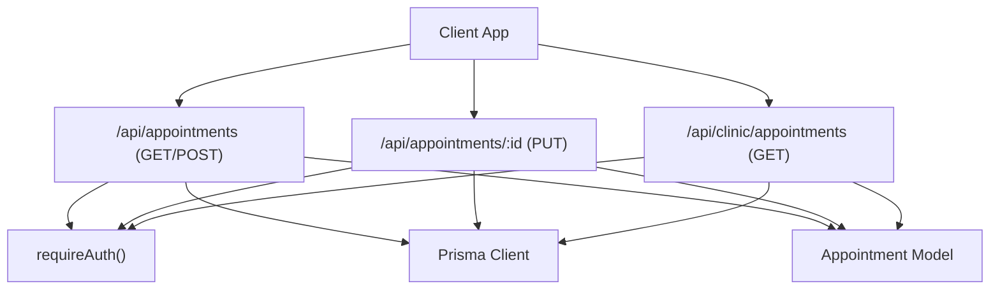
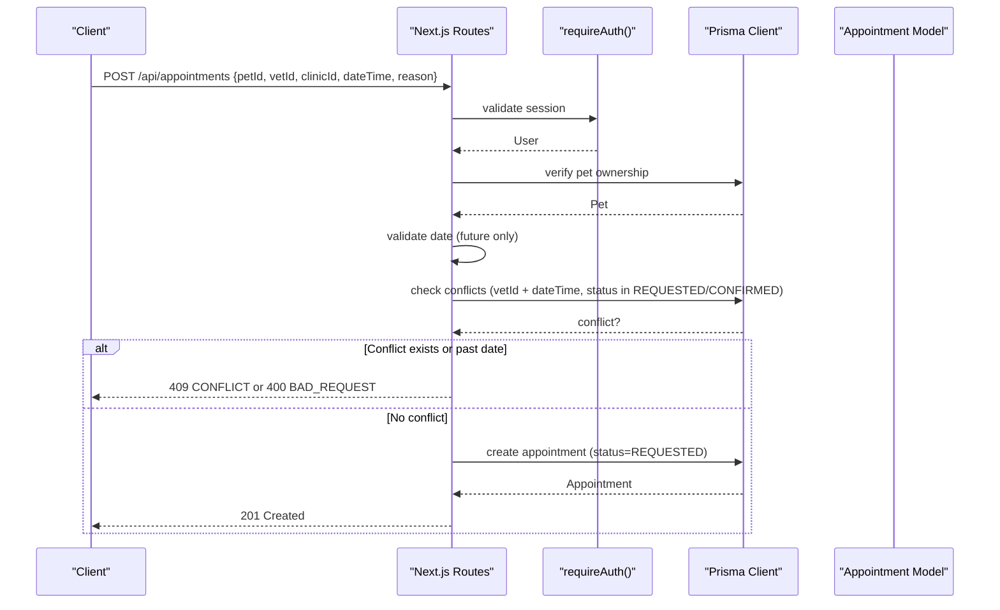
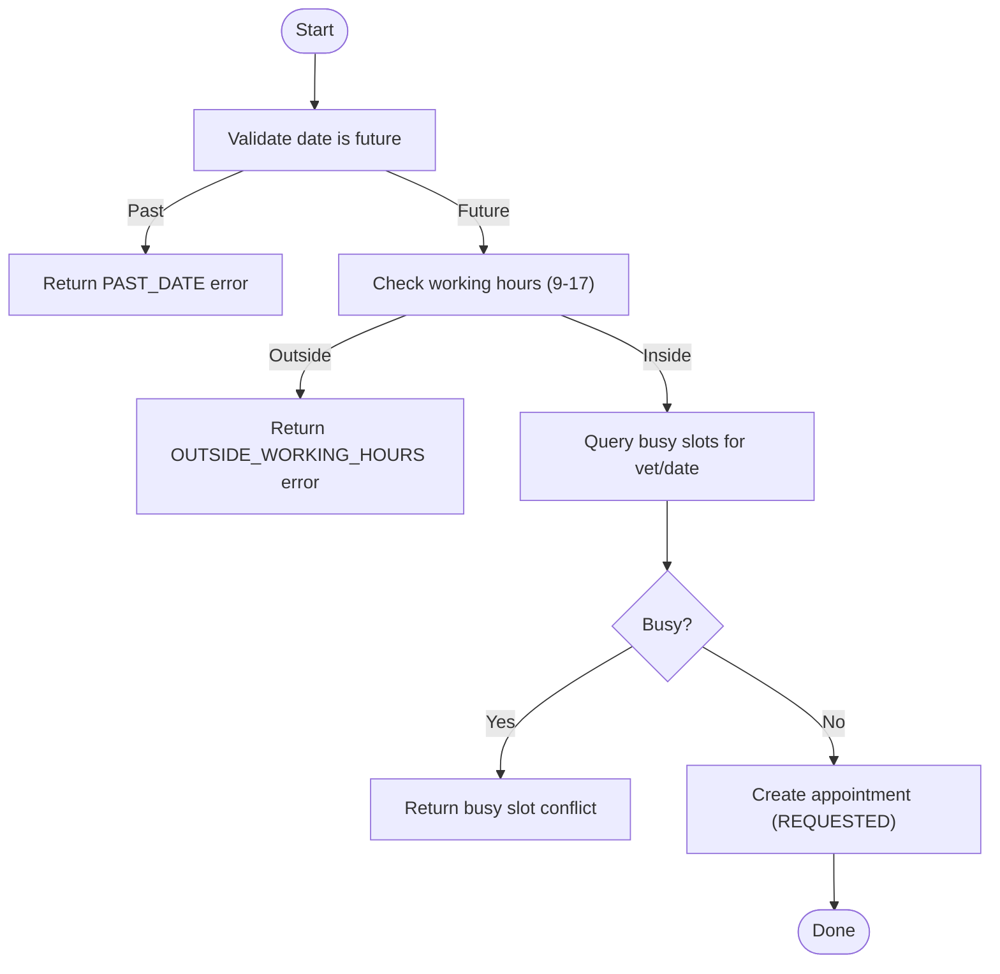
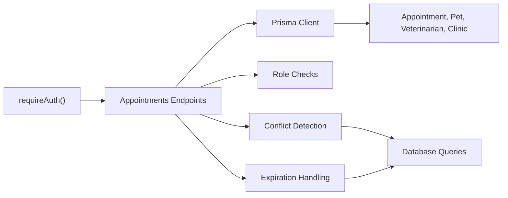

Based on my analysis of the codebase, I can see the key changes that have been applied to the appointment APIs. Let me now update the documentation to reflect these improvements:

# Appointment Scheduling API

<cite>
**Referenced Files in This Document**
- [route.ts](file://app/api/appointments/route.ts)
- [route.ts](file://app/api/appointments/[appointmentId]/route.ts)
- [route.ts](file://app/api/clinic/appointments/route.ts)
- [schema.prisma](file://prisma/schema.prisma)
- [auth.ts](file://lib/auth.ts)
- [db.ts](file://lib/db.ts)
- [ai.ts](file://lib/ai.ts)
</cite>

## Update Summary
**Changes Made**
- Enhanced validation with date validation to prevent booking past appointments
- Added automatic status updates for expired appointments (REQUESTED/CONFIRMED → EXPIRED)
- Improved clinic filtering for administrators with better error handling
- Enhanced conflict detection and prevention mechanisms
- Updated working hours validation in AI tools

## Table of Contents
1. [Introduction](#introduction)
2. [Project Structure](#project-structure)
3. [Core Components](#core-components)
4. [Architecture Overview](#architecture-overview)
5. [Detailed Component Analysis](#detailed-component-analysis)
6. [Dependency Analysis](#dependency-analysis)
7. [Performance Considerations](#performance-considerations)
8. [Troubleshooting Guide](#troubleshooting-guide)
9. [Conclusion](#conclusion)
10. [Appendices](#appendices)

## Introduction
This document provides detailed API documentation for appointment scheduling endpoints in the PETIVA system. It covers:
- General appointment management under /api/appointments/*
- Clinic-specific appointment listing under /api/clinic/appointments
- Appointment status management and conflict prevention
- Request/response schemas, validation rules, and error handling
- Real-time availability checking via AI tools
- Examples of booking workflows, modifications, cancellations, and common scenarios

## Project Structure
The appointment scheduling functionality is implemented as Next.js Route Handlers with Prisma data access and role-based authentication.

**Diagram sources**
- [route.ts:6-158](file://app/api/appointments/route.ts#L6-L158)
- [route.ts:6-119](file://app/api/appointments/[appointmentId]/route.ts#L6-L119)
- [route.ts:5-106](file://app/api/clinic/appointments/route.ts#L5-L106)
- [schema.prisma:168-187](file://prisma/schema.prisma#L168-L187)
- [auth.ts:109-115](file://lib/auth.ts#L109-L115)
- [db.ts:1-33](file://lib/db.ts#L1-L33)

**Section sources**
- [route.ts:6-158](file://app/api/appointments/route.ts#L6-L158)
- [route.ts:6-119](file://app/api/appointments/[appointmentId]/route.ts#L6-L119)
- [route.ts:5-106](file://app/api/clinic/appointments/route.ts#L5-L106)
- [schema.prisma:168-187](file://prisma/schema.prisma#L168-L187)
- [auth.ts:109-115](file://lib/auth.ts#L109-L115)
- [db.ts:1-33](file://lib/db.ts#L1-L33)

## Core Components
- Authentication middleware: requireAuth enforces session-based authentication and returns a user object or throws an UNAUTHENTICATED error.
- Data layer: Prisma client connects to PostgreSQL; models include User, Pet, Veterinarian, Clinic, and Appointment.
- Endpoints:
  - GET /api/appointments: List appointments filtered by user role (pet owner, veterinarian, clinic admin) with automatic expiration handling.
  - POST /api/appointments: Create a new appointment with enhanced validation including date validation and conflict detection.
  - PUT /api/appointments/:id: Update appointment status with role-based permissions and double-booking guard on confirmation.
  - GET /api/clinic/appointments: List clinic appointments with filters (ALL, TODAY, UPCOMING, COMPLETED, CANCELLED, REQUESTED, CONFIRMED) and improved error handling.

**Updated** Enhanced validation and automatic status management for expired appointments.

**Section sources**
- [auth.ts:109-115](file://lib/auth.ts#L109-L115)
- [schema.prisma:9-28](file://prisma/schema.prisma#L9-L28)
- [schema.prisma:68-119](file://prisma/schema.prisma#L68-L119)
- [schema.prisma:168-187](file://prisma/schema.prisma#L168-L187)
- [route.ts:6-158](file://app/api/appointments/route.ts#L6-L158)
- [route.ts:6-119](file://app/api/appointments/[appointmentId]/route.ts#L6-L119)
- [route.ts:5-106](file://app/api/clinic/appointments/route.ts#L5-L106)

## Architecture Overview
The appointment scheduling flow integrates authentication, authorization, database queries, and conflict detection with enhanced validation.

**Diagram sources**
- [route.ts:77-158](file://app/api/appointments/route.ts#L77-L158)
- [schema.prisma:168-187](file://prisma/schema.prisma#L168-L187)
- [auth.ts:109-115](file://lib/auth.ts#L109-L115)

## Detailed Component Analysis

### Endpoint: GET /api/appointments
- Purpose: Retrieve appointments based on authenticated user role with automatic expiration handling.
- Authorization: Requires authentication; role determines query scope.
- Query behavior:
  - PET_OWNER: Returns appointments owned by the user.
  - VETERINARIAN: Returns appointments assigned to the vet profile linked to the user.
  - CLINIC_ADMIN: Returns appointments for the associated clinic.
- **Enhanced**: Automatic status updates - appointments with REQUESTED or CONFIRMED status that are in the past are automatically marked as EXPIRED.
- Response: success boolean and array of appointments including related pet, vet, owner, and clinic details.
- Error handling:
  - 401 UNAUTHORIZED if not logged in.
  - 500 INTERNAL_SERVER_ERROR for unexpected errors.

Request
- Method: GET
- URL: /api/appointments
- Headers: Session cookie set by auth middleware
- Body: None

Response
- Success: { success: true, appointments: Appointment[] }
- Errors: { success: false, error: { code: string, message: string } }

Validation Rules
- Role-based filtering enforced server-side.
- Sorting by dateTime descending.
- **New**: Automatic expiration of past appointments (REQUESTED/CONFIRMED → EXPIRED).

Example Scenarios
- A pet owner lists their upcoming and past appointments with automatic expiration handling.
- A veterinarian lists all appointments assigned to them with expired status updates.
- A clinic admin lists all appointments at their clinic with enhanced filtering.

**Updated** Added automatic expiration handling for past appointments.

**Section sources**
- [route.ts:6-75](file://app/api/appointments/route.ts#L6-L75)
- [schema.prisma:168-187](file://prisma/schema.prisma#L168-L187)
- [auth.ts:109-115](file://lib/auth.ts#L109-L115)

### Endpoint: POST /api/appointments
- Purpose: Create a new appointment request with enhanced validation.
- Authorization: Requires authentication; verifies pet ownership.
- Request body schema:
  - petId: string (required)
  - vetId: string (required)
  - clinicId: string (required)
  - dateTime: ISO date-time string (required)
  - reason: string (required)
- **Enhanced Validation**:
  - All fields required.
  - **New**: Date validation prevents booking past appointments.
  - Pet ownership verified against authenticated user.
  - Double-booking prevention within a transaction for vetId + dateTime where status is REQUESTED or CONFIRMED.
- Response:
  - 201 Created with created appointment including pet, vet, clinic relations.
  - 400 BAD_REQUEST if missing fields or past date.
  - 403 FORBIDDEN if pet ownership fails.
  - 409 CONFLICT if time slot already booked.
  - 401 UNAUTHORIZED if not logged in.
  - 500 INTERNAL_SERVER_ERROR for unexpected errors.

Conflict Detection
- Transactional check prevents race conditions when multiple requests target the same vet/time slot.

Working Hours and Availability
- Working hours enforcement is available via AI tooling; see Availability Checking section.

Example Workflow
- Client sends POST with petId, vetId, clinicId, dateTime, reason.
- Server validates ownership, checks date is future, and verifies no conflicts.
- If valid, creates appointment with status REQUESTED and returns it.

**Updated** Added date validation to prevent booking past appointments.

**Section sources**
- [route.ts:77-158](file://app/api/appointments/route.ts#L77-L158)
- [schema.prisma:168-187](file://prisma/schema.prisma#L168-L187)
- [auth.ts:109-115](file://lib/auth.ts#L109-L115)

### Endpoint: PUT /api/appointments/:id
- Purpose: Update appointment status (confirm, cancel, reject, complete).
- Authorization: Role-based boundary checks:
  - PET_OWNER: Can only cancel their own upcoming appointments.
  - VETERINARIAN: Can manage appointments assigned to them.
  - CLINIC_ADMIN: Can manage appointments at their clinic.
  - PLATFORM_ADMIN: Full access.
- Validation:
  - Status must be a valid enum value from AppointmentStatus.
  - On CONFIRMED, additional conflict check ensures no other confirmed appointment exists for the same vet/time slot.
- Response:
  - 200 OK with updated appointment including pet, vet, clinic relations.
  - 400 BAD_REQUEST for invalid status.
  - 403 FORBIDDEN if unauthorized.
  - 404 NOT_FOUND if appointment does not exist.
  - 409 CONFLICT if another confirmed appointment conflicts.
  - 401 UNAUTHORIZED if not logged in.
  - 500 INTERNAL_SERVER_ERROR for unexpected errors.

Audit Logging
- Every status update writes an audit log entry capturing previous and new status.

Example Workflow
- Vet confirms an appointment; server checks for conflicts and updates status to CONFIRMED.
- Pet owner cancels their own appointment; server verifies ownership and updates status to CANCELLED.

**Section sources**
- [route.ts:6-119](file://app/api/appointments/[appointmentId]/route.ts#L6-L119)
- [schema.prisma:22-28](file://prisma/schema.prisma#L22-L28)
- [schema.prisma:168-187](file://prisma/schema.prisma#L168-L187)
- [auth.ts:109-115](file://lib/auth.ts#L109-L115)

### Endpoint: GET /api/clinic/appointments
- Purpose: List clinic appointments with filters for clinic admins with enhanced error handling.
- Authorization: Requires authentication and CLINIC_ADMIN role; requires associated clinicId.
- Query parameters:
  - filter: ALL | TODAY | UPCOMING | COMPLETED | CANCELLED | REQUESTED | CONFIRMED
- **Enhanced Behavior**:
  - Filters by clinicId and optional dateTime ranges or status values.
  - Includes pet, owner, vet (with user details), and clinic.
  - Sorted by dateTime ascending.
  - **New**: Improved error handling for missing clinic associations.
  - **Enhanced**: Automatic expiration handling for past appointments.
- Response:
  - 200 OK with success boolean and appointments array.
  - 400 BAD_REQUEST if no clinic associated with admin.
  - 403 FORBIDDEN if not a clinic admin.
  - 401 UNAUTHORIZED if not logged in.
  - 500 INTERNAL_SERVER_ERROR for unexpected errors.

Example Scenarios
- Clinic admin retrieves today's appointments using filter=TODAY.
- Retrieves upcoming requested and confirmed appointments using filter=UPCOMING.

**Updated** Enhanced error handling and automatic expiration for clinic appointments.

**Section sources**
- [route.ts:5-106](file://app/api/clinic/appointments/route.ts#L5-L106)
- [schema.prisma:168-187](file://prisma/schema.prisma#L168-L187)
- [auth.ts:109-115](file://lib/auth.ts#L109-L115)

### Availability Checking and Working Hours (AI Tools)
- The AI service provides tools for real-time availability and booking with enhanced validation:
  - check_slots: Returns busy slots for a vet on a given date.
  - create_booking: Validates working hours (9 AM–5 PM Karachi time), prevents past dates, and avoids double bookings before creating an appointment.
  - cancel_appointment: Handles appointment cancellation with proper authorization and audit logging.
- These tools complement the REST endpoints by offering pre-flight checks and additional validations.

Availability Flow

**Diagram sources**
- [ai.ts:387-430](file://lib/ai.ts#L387-L430)

**Section sources**
- [ai.ts:380-470](file://lib/ai.ts#L380-L470)

## Dependency Analysis
- Authentication dependency: All endpoints call requireAuth to ensure a valid session and retrieve the current user.
- Database dependency: All endpoints use Prisma client to read/write Appointment and related entities.
- Role-based dependencies:
  - PET_OWNER: Limited to own pets/appointments.
  - VETERINARIAN: Limited to assigned appointments.
  - CLINIC_ADMIN: Limited to clinic-scoped appointments.
  - PLATFORM_ADMIN: Full access.
- Conflict prevention:
  - Creation endpoint uses transactional conflict checks.
  - Confirmation endpoint includes additional conflict guard.
  - AI tools provide pre-flight availability checks and working hours validation.
- **Enhanced**: Automatic expiration handling reduces manual status management.

**Diagram sources**
- [auth.ts:109-115](file://lib/auth.ts#L109-L115)
- [route.ts:6-158](file://app/api/appointments/route.ts#L6-L158)
- [route.ts:6-119](file://app/api/appointments/[appointmentId]/route.ts#L6-L119)
- [route.ts:5-106](file://app/api/clinic/appointments/route.ts#L5-L106)
- [schema.prisma:168-187](file://prisma/schema.prisma#L168-L187)

**Section sources**
- [auth.ts:109-115](file://lib/auth.ts#L109-L115)
- [route.ts:6-158](file://app/api/appointments/route.ts#L6-L158)
- [route.ts:6-119](file://app/api/appointments/[appointmentId]/route.ts#L6-L119)
- [route.ts:5-106](file://app/api/clinic/appointments/route.ts#L5-L106)
- [schema.prisma:168-187](file://prisma/schema.prisma#L168-L187)

## Performance Considerations
- Use indexes: Appointment model includes indexes on vetId+dateTime and ownerId for efficient queries.
- Transactions: Creation endpoint uses transactions to prevent race conditions during conflict checks.
- Filtering: Clinic endpoint supports filters to reduce payload size and improve response times.
- Pre-flight checks: AI availability tools can reduce failed booking attempts by validating working hours and conflicts before submission.
- **Enhanced**: Automatic expiration handling reduces database load by processing expired appointments on retrieval rather than background jobs.

## Troubleshooting Guide
Common issues and resolutions:
- 401 UNAUTHORIZED: Ensure session cookie is present and valid; check session expiration and sliding window logic.
- 400 BAD_REQUEST: Verify all required fields are provided; confirm status values match AppointmentStatus enum; **new**: Check that appointment dates are in the future.
- 403 FORBIDDEN: Confirm role-based permissions; pet owners can only cancel their own appointments; vets can only manage their own appointments; clinic admins need an associated clinicId.
- 404 NOT_FOUND: Appointment ID does not exist; verify correct path parameter.
- 409 CONFLICT: Time slot already booked or another confirmed appointment exists; use availability checking to select free slots.
- 500 INTERNAL_SERVER_ERROR: Unexpected server errors; check logs and database connectivity.

Additional notes:
- Audit logs record status changes for traceability.
- Working hours enforcement is handled by AI tools; ensure clients validate times before calling creation endpoints.
- **New**: Past appointments are automatically marked as EXPIRED to maintain data consistency.

**Updated** Added guidance for date validation errors and automatic expiration handling.

**Section sources**
- [route.ts:6-158](file://app/api/appointments/route.ts#L6-L158)
- [route.ts:6-119](file://app/api/appointments/[appointmentId]/route.ts#L6-L119)
- [route.ts:5-106](file://app/api/clinic/appointments/route.ts#L5-L106)
- [auth.ts:109-115](file://lib/auth.ts#L109-L115)
- [schema.prisma:22-28](file://prisma/schema.prisma#L22-L28)

## Conclusion
The PETIVA appointment scheduling API provides robust endpoints for creating, retrieving, updating, and managing appointments with strong role-based authorization and conflict prevention. Recent enhancements include improved validation with date validation to prevent past bookings, automatic status updates for expired appointments, and enhanced clinic filtering for administrators. Integration with AI tools enables real-time availability checks and working hours validation, improving user experience and reducing booking errors. Clinic administrators gain powerful filtering capabilities to manage daily operations effectively.

## Appendices

### Data Models Reference
- Appointment: id, petId, ownerId, vetId, clinicId, dateTime, reason, status, createdAt
- AppointmentStatus: REQUESTED, CONFIRMED, CANCELLED, COMPLETED, NO_SHOW, **EXPIRED**
- UserRole: PET_OWNER, VETERINARIAN, CLINIC_ADMIN, PLATFORM_ADMIN

**Updated** Added EXPIRED status for automatic expiration handling.

**Section sources**
- [schema.prisma:22-28](file://prisma/schema.prisma#L22-L28)
- [schema.prisma:9-14](file://prisma/schema.prisma#L9-L14)
- [schema.prisma:168-187](file://prisma/schema.prisma#L168-L187)

### Example Workflows
- Booking workflow:
  - Check availability via AI tool (check_slots).
  - Validate working hours and future date.
  - Submit POST /api/appointments with required fields.
  - Receive 201 Created with REQUESTED status.
  - Vet confirms via PUT /api/appointments/:id with status CONFIRMED.
- Modification workflow:
  - Vet updates status to CONFIRMED or CANCELLED based on availability and policy.
  - System writes audit log for each change.
  - **New**: Past appointments are automatically marked as EXPIRED.
- Cancellation process:
  - Pet owner cancels their own upcoming appointment via PUT with status CANCELLED.
  - System verifies ownership and updates status.

**Updated** Added automatic expiration handling in modification workflow.

[No sources needed since this section provides conceptual examples]