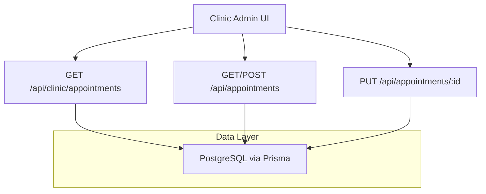
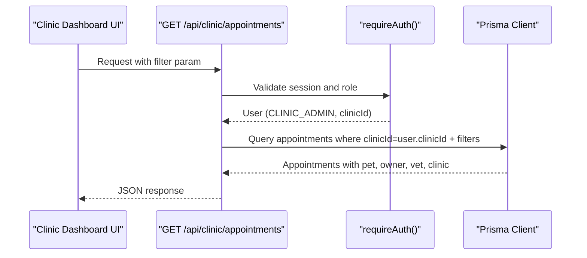
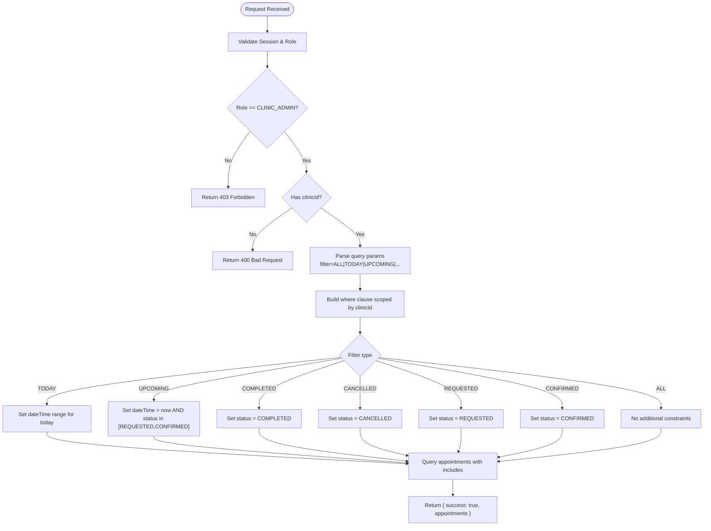
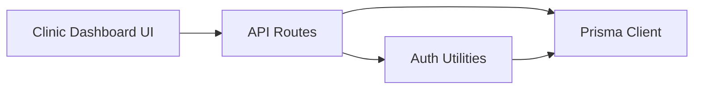

# Clinic Appointment Management API

<cite>
**Referenced Files in This Document**
- [route.ts](file://app/api/clinic/appointments/route.ts)
- [route.ts](file://app/api/appointments/route.ts)
- [route.ts](file://app/api/appointments/[appointmentId]/route.ts)
- [schema.prisma](file://prisma/schema.prisma)
- [auth.ts](file://lib/auth.ts)
- [db.ts](file://lib/db.ts)
- [page.tsx](file://app/clinic/dashboard/page.tsx)
</cite>

## Table of Contents
1. Introduction
2. Project Structure
3. Core Components
4. Architecture Overview
5. Detailed Component Analysis
6. Dependency Analysis
7. Performance Considerations
8. Troubleshooting Guide
9. Conclusion

## Introduction
This document provides comprehensive API documentation for clinic-specific appointment management endpoints, focusing on the /api/clinic/appointments endpoint that enables clinic administrators to oversee all appointments within their facility. It explains how clinic admins can view and filter appointments across multiple veterinarians and staff members, clarifies data isolation between clinics, and outlines integration points with scheduling systems, staff assignment features, and capacity management. It also includes guidance for multi-clinic scenarios and data segregation requirements.

## Project Structure
The appointment management functionality is implemented as Next.js API routes backed by a Prisma-managed PostgreSQL database. The key files involved are:
- Clinic admin appointment listing: app/api/clinic/appointments/route.ts
- General appointment operations (owner/vet/admin views and creation): app/api/appointments/route.ts
- Appointment status updates with role-based authorization: app/api/appointments/[appointmentId]/route.ts
- Data model definitions: prisma/schema.prisma
- Authentication and session utilities: lib/auth.ts
- Database client configuration: lib/db.ts
- Clinic dashboard UI that consumes these APIs: app/clinic/dashboard/page.tsx



**Diagram sources**
- [route.ts:5-97](file://app/api/clinic/appointments/route.ts#L5-L97)
- [route.ts:7-67](file://app/api/appointments/route.ts#L7-L67)
- [route.ts:7-119](file://app/api/appointments/[appointmentId]/route.ts#L7-L119)
- [schema.prisma:164-182](file://prisma/schema.prisma#L164-L182)

**Section sources**
- [route.ts:5-97](file://app/api/clinic/appointments/route.ts#L5-L97)
- [route.ts:7-67](file://app/api/appointments/route.ts#L7-L67)
- [route.ts:7-119](file://app/api/appointments/[appointmentId]/route.ts#L7-L119)
- [schema.prisma:164-182](file://prisma/schema.prisma#L164-L182)
- [auth.ts:109-125](file://lib/auth.ts#L109-L125)
- [db.ts:1-33](file://lib/db.ts#L1-L33)

## Core Components
- Clinic Admin Appointment Listing: GET /api/clinic/appointments
  - Enforces CLINIC_ADMIN role and associates requests with the admin’s clinicId for strict data isolation.
  - Supports filtering by ALL, TODAY, UPCOMING, COMPLETED, CANCELLED, REQUESTED, CONFIRMED.
  - Returns enriched appointment records including pet, owner, vet, and clinic details.
- General Appointments: GET /api/appointments
  - Role-aware listing: PET_OWNER sees own appointments; VETERINARIAN sees assigned appointments; CLINIC_ADMIN sees all appointments for their clinic.
  - Creation endpoint POST /api/appointments enforces ownership and double-booking prevention.
- Appointment Status Updates: PUT /api/appointments/:id
  - Validates requested status transitions and enforces role-based authorization boundaries.
  - Prevents conflicting confirmations and logs audit events for compliance.

Key capabilities for clinic administrators:
- View all appointments within their clinic with rich context (pet, owner, vet).
- Filter by time windows and statuses to support daily operations and reporting.
- Manage appointment lifecycle through shared update endpoint with appropriate permissions.

**Section sources**
- [route.ts:5-97](file://app/api/clinic/appointments/route.ts#L5-L97)
- [route.ts:7-67](file://app/api/appointments/route.ts#L7-L67)
- [route.ts:7-119](file://app/api/appointments/[appointmentId]/route.ts#L7-L119)
- [schema.prisma:164-182](file://prisma/schema.prisma#L164-L182)

## Architecture Overview
The system uses role-based access control and clinic-scoped queries to ensure data isolation. Clinic admins are restricted to their associated clinicId, while other roles see only relevant subsets.



**Diagram sources**
- [route.ts:5-97](file://app/api/clinic/appointments/route.ts#L5-L97)
- [auth.ts:109-125](file://lib/auth.ts#L109-L125)
- [schema.prisma:164-182](file://prisma/schema.prisma#L164-L182)

## Detailed Component Analysis

### GET /api/clinic/appointments
Purpose:
- Provide clinic administrators with a filtered, clinic-scoped list of appointments for oversight and reporting.

Authorization and isolation:
- Requires authentication and CLINIC_ADMIN role.
- Uses user.clinicId to scope queries, ensuring strict data isolation per clinic.

Filtering:
- Supported filters: ALL, TODAY, UPCOMING, COMPLETED, CANCELLED, REQUESTED, CONFIRMED.
- TODAY uses date range boundaries for the current day.
- UPCOMING restricts to future times and specific statuses.

Response payload:
- Includes related entities: pet, owner (selected fields), vet (with user details), and clinic.

Error handling:
- Returns UNAUTHORIZED if not logged in.
- Returns FORBIDDEN if not CLINIC_ADMIN.
- Returns BAD_REQUEST if no clinic association exists.
- Returns INTERNAL_SERVER_ERROR for unexpected failures.



**Diagram sources**
- [route.ts:5-97](file://app/api/clinic/appointments/route.ts#L5-L97)

**Section sources**
- [route.ts:5-97](file://app/api/clinic/appointments/route.ts#L5-L97)

### GET /api/appointments
Purpose:
- Provide role-aware appointment listings:
  - PET_OWNER: own appointments
  - VETERINARIAN: appointments assigned to them
  - CLINIC_ADMIN: all appointments for their clinic

Behavior:
- Filters results by role and entity relationships.
- Returns enriched data including pet, vet, and clinic.

**Section sources**
- [route.ts:7-67](file://app/api/appointments/route.ts#L7-L67)

### POST /api/appointments
Purpose:
- Create new appointment requests with validation and conflict checks.

Validation and safety:
- Ensures required fields are present.
- Verifies pet ownership.
- Prevents double booking using transactional checks.

Status:
- New appointments are created with status REQUESTED.

**Section sources**
- [route.ts:69-143](file://app/api/appointments/route.ts#L69-L143)

### PUT /api/appointments/:id
Purpose:
- Update appointment status with robust authorization and conflict checks.

Authorization:
- PET_OWNER: can cancel own upcoming appointments.
- VETERINARIAN: can manage appointments assigned to them.
- CLINIC_ADMIN: can manage appointments within their clinic.
- PLATFORM_ADMIN: full access.

Conflict handling:
- Prevents confirmation conflicts for the same vet/time slot.

Audit logging:
- Records status changes for compliance and traceability.

**Section sources**
- [route.ts:7-119](file://app/api/appointments/[appointmentId]/route.ts#L7-L119)

### Data Model and Relationships
Core entities:
- User: includes role and optional clinicId for admin scoping.
- Clinic: represents a veterinary facility.
- Veterinarian: linked to users and clinics via associations.
- Pet: owned by users.
- Appointment: links pet, owner, vet, clinic, datetime, reason, and status.

Indexes:
- Optimized indexes on vetId+dateTime, ownerId, and petId for efficient querying.

```mermaid
erDiagram
USER {
string id PK
string email UK
enum role
string firstName
string lastName
string phone
string clinicId FK
}
CLINIC {
string id PK
string name
string address
string phone
}
VETERINARIAN {
string id PK
string userId UK FK
string specialization
string licenseNumber UK
boolean isVerified
}
PET {
string id PK
string ownerId FK
string name
string species
}
APPOINTMENT {
string id PK
string petId FK
string ownerId FK
string vetId FK
string clinicId FK
datetime dateTime
string reason
enum status
}
USER ||--o{ APPOINTMENT : "owns"
USER ||--|| CLINIC : "administers (via clinicId)"
VETERINARIAN ||--o{ APPOINTMENT : "assigned to"
PET ||--o{ APPOINTMENT : "has"
CLINIC ||--o{ APPOINTMENT : "hosts"
```

**Diagram sources**
- [schema.prisma:30-53](file://prisma/schema.prisma#L30-L53)
- [schema.prisma:107-119](file://prisma/schema.prisma#L107-L119)
- [schema.prisma:90-105](file://prisma/schema.prisma#L90-L105)
- [schema.prisma:68-88](file://prisma/schema.prisma#L68-L88)
- [schema.prisma:164-182](file://prisma/schema.prisma#L164-L182)

**Section sources**
- [schema.prisma:30-53](file://prisma/schema.prisma#L30-L53)
- [schema.prisma:107-119](file://prisma/schema.prisma#L107-L119)
- [schema.prisma:90-105](file://prisma/schema.prisma#L90-L105)
- [schema.prisma:68-88](file://prisma/schema.prisma#L68-L88)
- [schema.prisma:164-182](file://prisma/schema.prisma#L164-L182)

### Integration Points and Workflows
- Scheduling system integration:
  - Use POST /api/appointments to create new requests with vetId, clinicId, dateTime, and reason.
  - Confirmations should be performed via PUT /api/appointments/:id with status CONFIRMED after verifying availability.
- Staff assignment features:
  - Retrieve associated vets for a clinic via /api/clinic/vets to inform scheduling and assignment decisions.
- Capacity management:
  - Avoid double bookings by checking existing REQUESTED or CONFIRMED appointments before confirming.
  - Use UPCOMING filter to monitor near-term capacity and plan staffing.

Multi-clinic scenarios and data segregation:
- Each CLINIC_ADMIN has a clinicId that scopes all queries and mutations to their clinic.
- Ensure that any bulk operations or integrations respect clinicId boundaries to maintain data isolation.

**Section sources**
- [route.ts:69-143](file://app/api/appointments/route.ts#L69-L143)
- [route.ts:7-119](file://app/api/appointments/[appointmentId]/route.ts#L7-L119)
- [route.ts:5-97](file://app/api/clinic/appointments/route.ts#L5-L97)

## Dependency Analysis
Authentication and authorization:
- requireAuth ensures valid sessions and returns the authenticated user.
- Role checks enforce CLINIC_ADMIN for clinic-specific endpoints.

Database layer:
- Prisma client configured with PostgreSQL adapter and connection pooling.

UI consumption:
- Clinic dashboard fetches clinic profile, vets, and appointments, and applies filters client-side or server-side via query parameters.



**Diagram sources**
- [auth.ts:109-125](file://lib/auth.ts#L109-L125)
- [db.ts:1-33](file://lib/db.ts#L1-L33)
- [page.tsx:38-82](file://app/clinic/dashboard/page.tsx#L38-L82)

**Section sources**
- [auth.ts:109-125](file://lib/auth.ts#L109-L125)
- [db.ts:1-33](file://lib/db.ts#L1-L33)
- [page.tsx:38-82](file://app/clinic/dashboard/page.tsx#L38-L82)

## Performance Considerations
- Filtering at the database level reduces payload size and improves performance.
- Use indexes on frequently queried fields (vetId, dateTime, ownerId, petId) to optimize lookups.
- For large datasets, consider pagination and additional filters (e.g., date ranges) to limit result sets.
- Avoid unnecessary includes; select only required fields when possible.

[No sources needed since this section provides general guidance]

## Troubleshooting Guide
Common errors and resolutions:
- UNAUTHORIZED: Ensure a valid session cookie is present and not expired.
- FORBIDDEN: Verify the user has CLINIC_ADMIN role and an associated clinicId.
- BAD_REQUEST: Check that required fields are provided and filters are valid.
- NOT_FOUND: Confirm the appointment or clinic exists before performing operations.
- CONFLICT: Resolve double-booking issues by adjusting time slots or vet assignments.

Operational tips:
- Log and inspect error responses from API calls.
- Validate inputs on the client side to reduce server errors.
- Use audit logs to track status changes and investigate discrepancies.

**Section sources**
- [route.ts:5-97](file://app/api/clinic/appointments/route.ts#L5-L97)
- [route.ts:7-67](file://app/api/appointments/route.ts#L7-L67)
- [route.ts:7-119](file://app/api/appointments/[appointmentId]/route.ts#L7-L119)

## Conclusion
The /api/clinic/appointments endpoint provides clinic administrators with secure, filtered access to all appointments within their facility, enabling effective oversight, reporting, and operational workflows. Combined with role-based authorization, clinic-scoped data isolation, and robust conflict checks, the system supports scalable multi-clinic operations and integrates seamlessly with scheduling and staff assignment processes. Adhering to the documented patterns ensures reliable, secure, and performant appointment management across diverse clinic environments.

[No sources needed since this section summarizes without analyzing specific files]