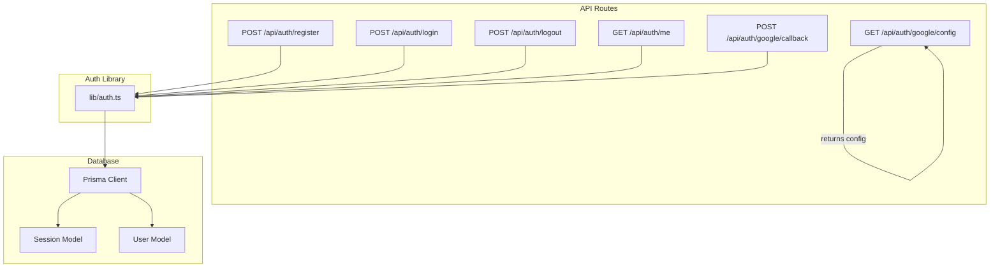
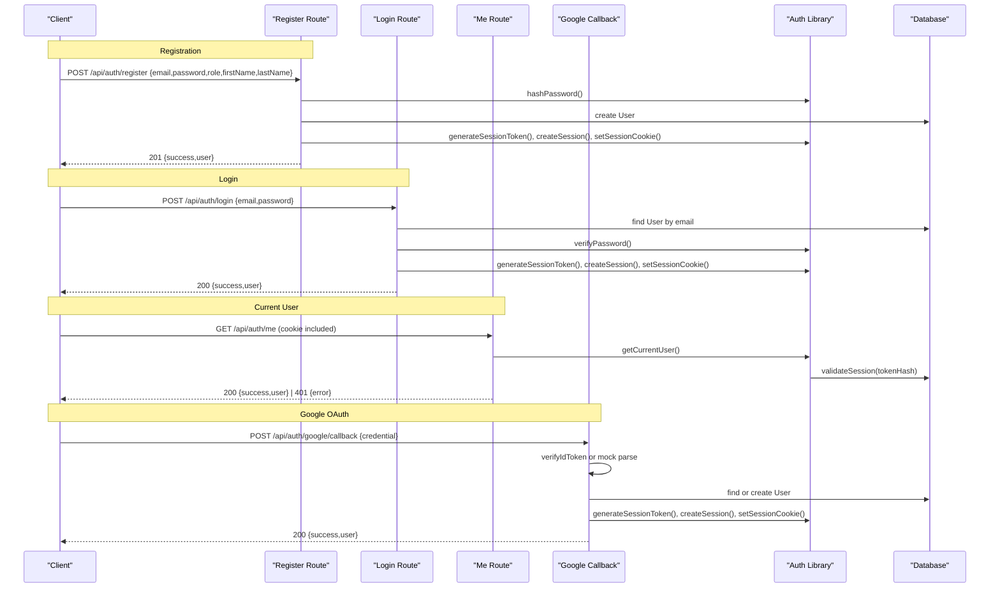
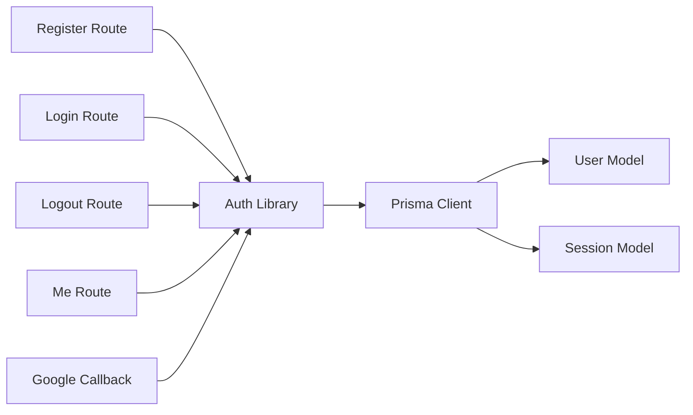
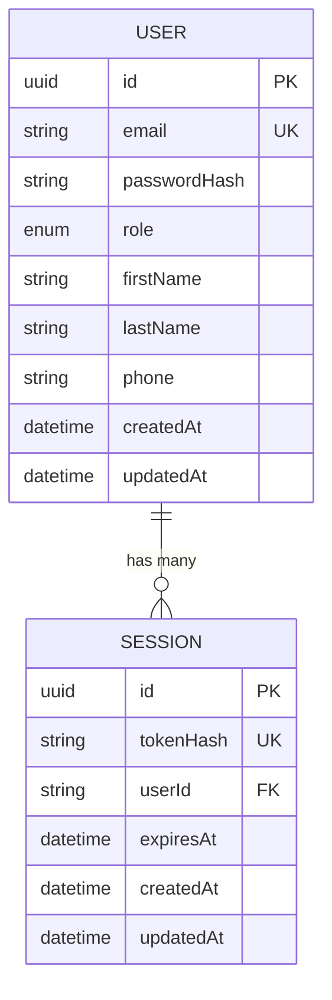

# Authentication API

<cite>
**Referenced Files in This Document**
- [register/route.ts](file://app/api/auth/register/route.ts)
- [login/route.ts](file://app/api/auth/login/route.ts)
- [logout/route.ts](file://app/api/auth/logout/route.ts)
- [me/route.ts](file://app/api/auth/me/route.ts)
- [google/callback/route.ts](file://app/api/auth/google/callback/route.ts)
- [google/config/route.ts](file://app/api/auth/google/config/route.ts)
- [auth.ts](file://lib/auth.ts)
- [schema.prisma](file://prisma/schema.prisma)
- [db.ts](file://lib/db.ts)
- [api-specification.md](file://docs/03-architecture/03-api-specification.md)
</cite>

## Table of Contents
1. Introduction
2. Project Structure
3. Core Components
4. Architecture Overview
5. Detailed Component Analysis
6. Dependency Analysis
7. Performance Considerations
8. Troubleshooting Guide
9. Conclusion
10. Appendices

## Introduction
This document provides detailed API documentation for the authentication endpoints in the PETIVA system. It covers user registration, login, logout, current user retrieval, and Google OAuth integration. For each endpoint, it specifies HTTP methods, URL patterns, required headers, request body schemas with validation rules, response formats (including session cookies), and error codes. It also includes authentication flow examples, security considerations (password hashing with Argon2, token expiration, secure cookie configuration), and client implementation guidelines for handling authentication state across frameworks and browsers.

## Project Structure
The authentication endpoints are implemented as Next.js Route Handlers under app/api/auth. Shared authentication logic is centralized in lib/auth.ts, which handles password hashing, session creation/validation, and cookie management. The database schema defines User and Session models used by these endpoints.

**Diagram sources**
- [register/route.ts:6-78](file://app/api/auth/register/route.ts#L6-L78)
- [login/route.ts:5-58](file://app/api/auth/login/route.ts#L5-L58)
- [logout/route.ts:5-25](file://app/api/auth/logout/route.ts#L5-L25)
- [me/route.ts:4-33](file://app/api/auth/me/route.ts#L4-L33)
- [google/callback/route.ts:6-98](file://app/api/auth/google/callback/route.ts#L6-L98)
- [google/config/route.ts:3-8](file://app/api/auth/google/config/route.ts#L3-L8)
- [auth.ts:10-125](file://lib/auth.ts#L10-L125)
- [schema.prisma:30-66](file://prisma/schema.prisma#L30-L66)

**Section sources**
- [register/route.ts:6-78](file://app/api/auth/register/route.ts#L6-L78)
- [login/route.ts:5-58](file://app/api/auth/login/route.ts#L5-L58)
- [logout/route.ts:5-25](file://app/api/auth/logout/route.ts#L5-L25)
- [me/route.ts:4-33](file://app/api/auth/me/route.ts#L4-L33)
- [google/callback/route.ts:6-98](file://app/api/auth/google/callback/route.ts#L6-L98)
- [google/config/route.ts:3-8](file://app/api/auth/google/config/route.ts#L3-L8)
- [auth.ts:10-125](file://lib/auth.ts#L10-L125)
- [schema.prisma:30-66](file://prisma/schema.prisma#L30-L66)

## Core Components
- Password hashing and verification using Argon2id.
- Server-side session management with random tokens stored as hashed values in the database.
- Secure cookie handling with HttpOnly, SameSite=Lax, and Secure flags in production.
- Sliding-window session expiration with automatic extension near expiry.
- Role-based access control utilities for protected routes.

Key responsibilities:
- Register: validate input, create user, set session cookie.
- Login: verify credentials, create session, set cookie.
- Logout: invalidate session, clear cookie.
- Me: resolve current user from session cookie.
- Google OAuth callback: verify Google ID token, create or find user, set session cookie.
- Google config: expose client ID to clients.

**Section sources**
- [auth.ts:10-125](file://lib/auth.ts#L10-L125)
- [schema.prisma:30-66](file://prisma/schema.prisma#L30-L66)

## Architecture Overview
Authentication flows use server-managed sessions via cookies rather than bearer tokens. Clients authenticate via POST requests; successful responses set a secure HttpOnly cookie containing the session token. Subsequent requests automatically include the cookie, enabling authenticated operations without manual token management.

**Diagram sources**
- [register/route.ts:6-78](file://app/api/auth/register/route.ts#L6-L78)
- [login/route.ts:5-58](file://app/api/auth/login/route.ts#L5-L58)
- [me/route.ts:4-33](file://app/api/auth/me/route.ts#L4-L33)
- [google/callback/route.ts:6-98](file://app/api/auth/google/callback/route.ts#L6-L98)
- [auth.ts:33-107](file://lib/auth.ts#L33-L107)

## Detailed Component Analysis

### Register User
- Method & Route: POST /api/auth/register
- Authentication: None
- Request Body:
  - email: string, valid email format
  - password: string, minimum length 8
  - role: enum, one of PET_OWNER, VETERINARIAN, CLINIC_ADMIN, PLATFORM_ADMIN
  - firstName: string
  - lastName: string
  - phone: string, optional
- Validation Rules:
  - All fields except phone are required
  - role must be a valid UserRole
  - password must be at least 8 characters
  - email must be unique
- Response (201 Created):
  - success: boolean
  - user: object with id, email, role, firstName, lastName
- Error Responses:
  - 400 BAD_REQUEST: missing fields, invalid role, short password
  - 409 CONFLICT: email already exists
  - 500 INTERNAL_SERVER_ERROR: unexpected errors

Flow highlights:
- Input validation
- Duplicate email check
- Hash password with Argon2id
- Create user record
- Generate session token, create session, set secure cookie

**Section sources**
- [register/route.ts:6-78](file://app/api/auth/register/route.ts#L6-L78)
- [auth.ts:10-13](file://lib/auth.ts#L10-L13)
- [schema.prisma:9-14](file://prisma/schema.prisma#L9-L14)

### Login User
- Method & Route: POST /api/auth/login
- Authentication: None
- Request Body:
  - email: string
  - password: string
- Validation Rules:
  - Both fields required
  - User must exist and have a passwordHash
  - Password must match stored hash
- Response (200 OK):
  - success: boolean
  - user: object with id, email, role, firstName, lastName
- Error Responses:
  - 400 BAD_REQUEST: missing fields
  - 401 UNAUTHORIZED: invalid email/password
  - 500 INTERNAL_SERVER_ERROR: unexpected errors

Flow highlights:
- Lookup user by email
- Verify password with Argon2
- Create session and set secure cookie

**Section sources**
- [login/route.ts:5-58](file://app/api/auth/login/route.ts#L5-L58)
- [auth.ts:15-21](file://lib/auth.ts#L15-L21)

### Logout User
- Method & Route: POST /api/auth/logout
- Authentication: Required (session cookie)
- Request Body: None
- Behavior:
  - Read session token from cookie
  - Invalidate session by deleting matching session record
  - Clear session cookie
- Response (200 OK):
  - success: boolean
- Error Responses:
  - 500 INTERNAL_SERVER_ERROR: unexpected errors

**Section sources**
- [logout/route.ts:5-25](file://app/api/auth/logout/route.ts#L5-L25)
- [auth.ts:77-97](file://lib/auth.ts#L77-L97)

### Get Current User
- Method & Route: GET /api/auth/me
- Authentication: Required (session cookie)
- Request Headers: Cookie with session_token
- Response (200 OK):
  - success: boolean
  - user: object with id, email, role, firstName, lastName
- Error Responses:
  - 401 UNAUTHORIZED: not logged in
  - 500 INTERNAL_SERVER_ERROR: unexpected errors

Behavior:
- Resolve current user from session cookie
- Validate session and return user data

**Section sources**
- [me/route.ts:4-33](file://app/api/auth/me/route.ts#L4-L33)
- [auth.ts:100-107](file://lib/auth.ts#L100-L107)

### Google OAuth Integration
- Configuration Endpoint:
  - Method & Route: GET /api/auth/google/config
  - Response:
    - clientId: string (from environment)
- Callback Endpoint:
  - Method & Route: POST /api/auth/google/callback
  - Authentication: None
  - Request Body:
    - credential: string (Google ID token)
  - Behavior:
    - In development, supports mock tokens prefixed with a specific pattern to extract email and names
    - In production, verifies ID token using Google OAuth2 library and configured client ID
    - Finds or creates user based on verified email
    - Creates session and sets secure cookie
  - Response (200 OK):
    - success: boolean
    - user: object with id, email, role, firstName, lastName
  - Error Responses:
    - 400 BAD_REQUEST: missing credential
    - 401 UNAUTHORIZED: invalid token payload or authentication failed
    - 500 INTERNAL_SERVER_ERROR: missing client ID or unexpected errors

OAuth Flow Highlights:
- Client obtains Google ID token via Google Sign-In
- Sends credential to callback endpoint
- Server verifies token, resolves or creates user, issues session

**Section sources**
- [google/config/route.ts:3-8](file://app/api/auth/google/config/route.ts#L3-L8)
- [google/callback/route.ts:6-98](file://app/api/auth/google/callback/route.ts#L6-L98)

### Security Considerations
- Password Hashing: Uses Argon2id for secure password hashing and verification.
- Session Tokens: Randomly generated tokens stored as SHA-256 hashes in the database; plaintext tokens only in cookies.
- Cookie Security:
  - HttpOnly: true to prevent client-side script access
  - Secure: enabled in production to enforce HTTPS
  - SameSite: lax to mitigate CSRF risks
  - Path: root path for broad availability
- Expiration and Sliding Window:
  - Sessions expire after a fixed duration
  - Automatic extension when nearing expiry to maintain active sessions
- Environment Variables:
  - GOOGLE_CLIENT_ID required for Google OAuth verification
  - DATABASE_URL for Prisma connection

**Section sources**
- [auth.ts:10-13](file://lib/auth.ts#L10-L13)
- [auth.ts:23-30](file://lib/auth.ts#L23-L30)
- [auth.ts:33-75](file://lib/auth.ts#L33-L75)
- [auth.ts:83-97](file://lib/auth.ts#L83-L97)
- [google/callback/route.ts:21-54](file://app/api/auth/google/callback/route.ts#L21-L54)

### Client Implementation Guidelines
- Registration:
  - Send POST with required fields; handle 201 and error codes
  - Store user state locally if needed; rely on server cookie for session
- Login:
  - Send POST with email and password; handle 200 and error codes
  - Do not manually manage cookies; browser will include them on subsequent requests
- Current User:
  - Call GET /api/auth/me to retrieve current user; handle 401 for unauthenticated state
- Logout:
  - Call POST /api/auth/logout to invalidate session and clear cookie
- Google OAuth:
  - Use Google Sign-In to obtain ID token
  - Send credential to POST /api/auth/google/callback
  - Handle redirect or update UI upon receiving user data
- Cross-Origin Requests:
  - Ensure cookies are sent with credentials (e.g., fetch with credentials: 'include')
  - Configure CORS appropriately on the server if necessary
- Framework-Specific Notes:
  - React/Vue/Angular: ensure XHR/fetch includes credentials and handles redirects
  - SSR frameworks: rely on server-side cookie handling; avoid exposing tokens in localStorage

[No sources needed since this section provides general guidance]

## Dependency Analysis
Authentication endpoints depend on shared auth utilities and database models. The following diagram shows key dependencies:

**Diagram sources**
- [register/route.ts:6-78](file://app/api/auth/register/route.ts#L6-L78)
- [login/route.ts:5-58](file://app/api/auth/login/route.ts#L5-L58)
- [logout/route.ts:5-25](file://app/api/auth/logout/route.ts#L5-L25)
- [me/route.ts:4-33](file://app/api/auth/me/route.ts#L4-L33)
- [google/callback/route.ts:6-98](file://app/api/auth/google/callback/route.ts#L6-L98)
- [auth.ts:10-125](file://lib/auth.ts#L10-L125)
- [schema.prisma:30-66](file://prisma/schema.prisma#L30-L66)

**Section sources**
- [auth.ts:10-125](file://lib/auth.ts#L10-L125)
- [schema.prisma:30-66](file://prisma/schema.prisma#L30-L66)

## Performance Considerations
- Database Queries:
  - Minimize N+1 queries by including related user data during session validation
  - Indexes on userId and expiresAt improve lookup and cleanup performance
- Session Extension:
  - Sliding window reduces re-authentication frequency but may increase write load; consider batching cleanup tasks
- Password Operations:
  - Argon2 hashing is CPU-intensive; ensure adequate server resources and consider rate limiting registration/login attempts
- Cookie Handling:
  - Avoid unnecessary cookie reads/writes; reuse session resolution where possible

[No sources needed since this section provides general guidance]

## Troubleshooting Guide
Common issues and resolutions:
- Missing Fields:
  - Ensure all required fields are present in register/login payloads
- Invalid Role:
  - Confirm role matches allowed enums
- Duplicate Email:
  - Check for existing users before registration
- Invalid Credentials:
  - Verify email and password; ensure passwordHash exists for login
- Unauthenticated Access:
  - Confirm session cookie is present and not expired; call logout then login again
- Google OAuth Failures:
  - Verify GOOGLE_CLIENT_ID is configured
  - Ensure ID token audience matches client ID
  - In development, use supported mock token format

Error Codes Reference:
- BAD_REQUEST: malformed or incomplete request
- UNAUTHORIZED: invalid credentials or missing session
- CONFLICT: duplicate resource (e.g., email)
- INTERNAL_SERVER_ERROR: unexpected server-side errors

**Section sources**
- [register/route.ts:10-39](file://app/api/auth/register/route.ts#L10-L39)
- [login/route.ts:9-32](file://app/api/auth/login/route.ts#L9-L32)
- [me/route.ts:6-12](file://app/api/auth/me/route.ts#L6-L12)
- [google/callback/route.ts:10-54](file://app/api/auth/google/callback/route.ts#L10-L54)

## Conclusion
The PETIVA authentication system uses secure, server-managed sessions with robust password hashing and safe cookie practices. Endpoints provide clear request/response contracts and consistent error handling. Clients should rely on cookies for session management and follow the outlined flows for registration, login, logout, and Google OAuth integration. Proper configuration of environment variables and adherence to validation rules ensures reliable and secure authentication.

[No sources needed since this section summarizes without analyzing specific files]

## Appendices

### Data Models Relevant to Authentication

**Diagram sources**
- [schema.prisma:30-66](file://prisma/schema.prisma#L30-L66)

### Global API Specification Notes
- Prefix: /api
- Format: application/json
- Authentication: Cookies or Bearer headers (authentication APIs use cookies)
- Error envelope: standard JSON with success, error.code, error.message

**Section sources**
- [api-specification.md:7-22](file://docs/03-architecture/03-api-specification.md#L7-L22)