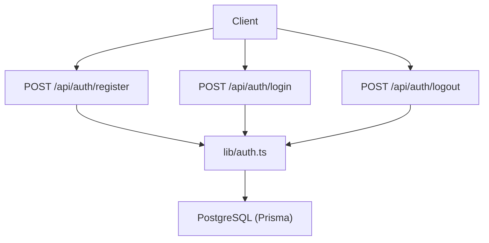
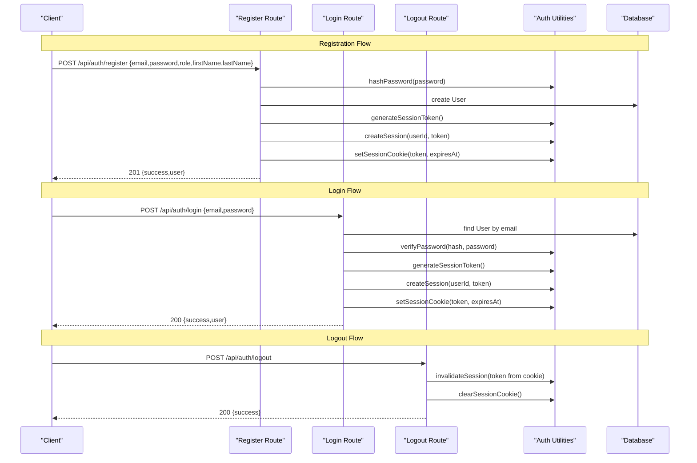
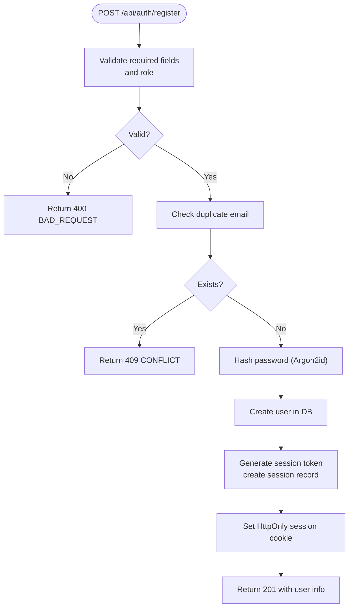
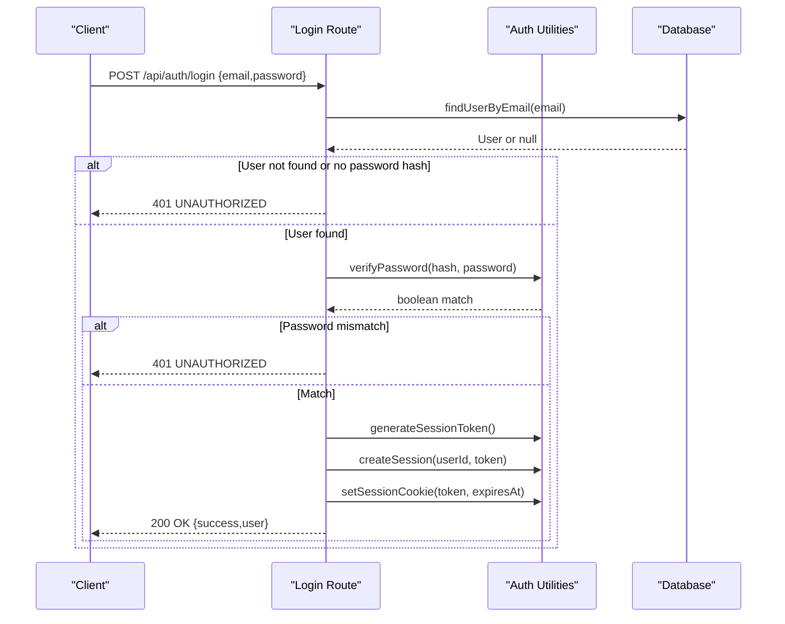
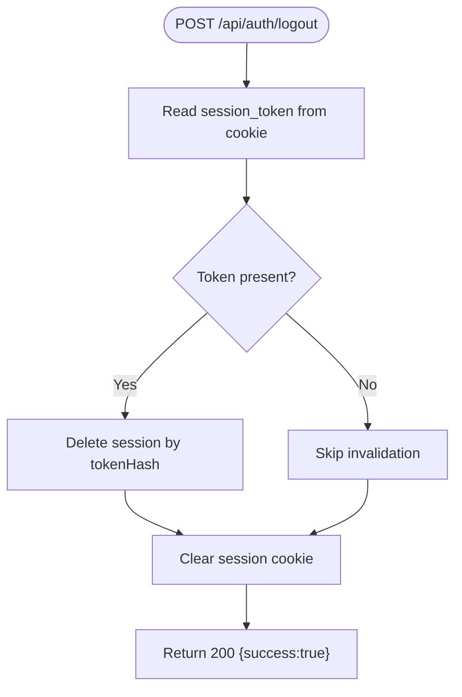
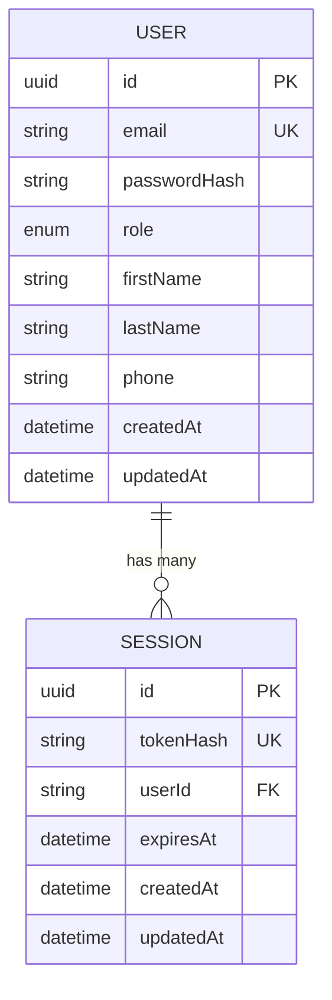
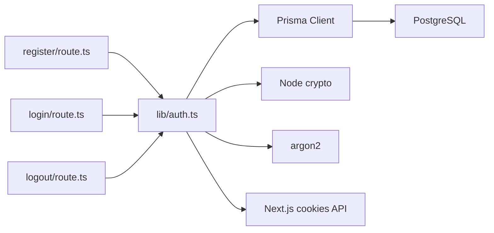

# Email & Password Authentication

<cite>
**Referenced Files in This Document**
- [route.ts](file://app/api/auth/register/route.ts)
- [route.ts](file://app/api/auth/login/route.ts)
- [route.ts](file://app/api/auth/logout/route.ts)
- [auth.ts](file://lib/auth.ts)
- [schema.prisma](file://prisma/schema.prisma)
- [03-authentication-decision.md](file://docs/02-requirements/03-authentication-decision.md)
</cite>

## Table of Contents
1. Introduction
2. Project Structure
3. Core Components
4. Architecture Overview
5. Detailed Component Analysis
6. Dependency Analysis
7. Performance Considerations
8. Troubleshooting Guide
9. Conclusion
10. Appendices

## Introduction
This document provides comprehensive API documentation for email and password authentication endpoints in the PETIVA system. It covers user registration, login, and logout flows, including request/response schemas, validation rules, error responses, and session handling. The system uses database-backed opaque sessions with HttpOnly cookies and Argon2id for password hashing. No JWT tokens are used; instead, secure random session tokens are issued and stored as hashed values in the database.

## Project Structure
The authentication endpoints are implemented as Next.js App Router route handlers under app/api/auth:
- POST /api/auth/register
- POST /api/auth/login
- POST /api/auth/logout

Authentication utilities (password hashing, session creation/validation, cookie helpers) are centralized in lib/auth.ts. The data model for users and sessions is defined in prisma/schema.prisma.

**Diagram sources**
- [route.ts:6-77](file://app/api/auth/register/route.ts#L6-L77)
- [route.ts:5-57](file://app/api/auth/login/route.ts#L5-L57)
- [route.ts:5-24](file://app/api/auth/logout/route.ts#L5-L24)
- [auth.ts:10-124](file://lib/auth.ts#L10-L124)

**Section sources**
- [route.ts:6-77](file://app/api/auth/register/route.ts#L6-L77)
- [route.ts:5-57](file://app/api/auth/login/route.ts#L5-L57)
- [route.ts:5-24](file://app/api/auth/logout/route.ts#L5-L24)
- [auth.ts:10-124](file://lib/auth.ts#L10-L124)
- [schema.prisma:30-66](file://prisma/schema.prisma#L30-L66)

## Core Components
- Registration handler validates input, checks for duplicate emails, hashes passwords with Argon2id, creates a user, issues a session token, stores its hash, sets an HttpOnly cookie, and returns user details.
- Login handler validates credentials, verifies the password using Argon2id, creates a session, sets an HttpOnly cookie, and returns user details.
- Logout handler invalidates the current session by deleting the matching session record and clears the session cookie.
- Authentication utilities provide password hashing/verification, session token generation/hashing, session CRUD, cookie management, and helper functions to get or require authenticated users.

Key security properties:
- Passwords are hashed with Argon2id.
- Session tokens are cryptographically random and stored only as SHA-256 hashes in the database.
- Cookies are HttpOnly, Secure in production, SameSite=Lax, Path=/, and time-bound.

**Section sources**
- [route.ts:6-77](file://app/api/auth/register/route.ts#L6-L77)
- [route.ts:5-57](file://app/api/auth/login/route.ts#L5-L57)
- [route.ts:5-24](file://app/api/auth/logout/route.ts#L5-L24)
- [auth.ts:10-124](file://lib/auth.ts#L10-L124)

## Architecture Overview
The authentication flow uses server-side session management with database-backed opaque tokens. On successful registration or login, a secure session token is set in an HttpOnly cookie and a corresponding hashed token is persisted in the Session table. Subsequent requests rely on the cookie to identify the user via server-side validation.

**Diagram sources**
- [route.ts:6-77](file://app/api/auth/register/route.ts#L6-L77)
- [route.ts:5-57](file://app/api/auth/login/route.ts#L5-L57)
- [route.ts:5-24](file://app/api/auth/logout/route.ts#L5-L24)
- [auth.ts:10-124](file://lib/auth.ts#L10-L124)

## Detailed Component Analysis

### Registration Endpoint: POST /api/auth/register
- Purpose: Create a new user account and establish an authenticated session.
- Request body schema:
  - email: string, required, must be unique
  - password: string, required, minimum length 8 characters
  - role: string, required, must be one of the allowed roles
  - firstName: string, required
  - lastName: string, required
  - phone: string, optional
- Validation rules:
  - All required fields must be present
  - Role must be valid according to the UserRole enum
  - Password must meet minimum length requirement
  - Duplicate email check prevents registration if the email already exists
- Processing logic:
  - Hash password using Argon2id
  - Create user record
  - Generate a secure session token
  - Persist session with hashed token and expiration
  - Set HttpOnly session cookie
- Success response:
  - Status: 201 Created
  - Body: { success: true, user: { id, email, role, firstName, lastName } }
- Error responses:
  - 400 Bad Request: Missing required fields, invalid role, or weak password
  - 409 Conflict: Email already registered
  - 500 Internal Server Error: Unexpected server error

**Diagram sources**
- [route.ts:6-77](file://app/api/auth/register/route.ts#L6-L77)
- [auth.ts:10-44](file://lib/auth.ts#L10-L44)

**Section sources**
- [route.ts:6-77](file://app/api/auth/register/route.ts#L6-L77)
- [auth.ts:10-44](file://lib/auth.ts#L10-L44)
- [schema.prisma:30-66](file://prisma/schema.prisma#L30-L66)

### Login Endpoint: POST /api/auth/login
- Purpose: Authenticate a user with email and password and establish a session.
- Method: POST
- Headers: Content-Type: application/json
- Request body schema:
  - email: string, required
  - password: string, required
- Processing logic:
  - Lookup user by email
  - Verify password using Argon2id against stored hash
  - If valid, generate a secure session token, persist session with hashed token and expiration, and set HttpOnly cookie
- Success response:
  - Status: 200 OK
  - Body: { success: true, user: { id, email, role, firstName, lastName } }
- Error responses:
  - 400 Bad Request: Missing email or password
  - 401 Unauthorized: Invalid email or password
  - 500 Internal Server Error: Unexpected server error

**Diagram sources**
- [route.ts:5-57](file://app/api/auth/login/route.ts#L5-L57)
- [auth.ts:10-44](file://lib/auth.ts#L10-L44)

**Section sources**
- [route.ts:5-57](file://app/api/auth/login/route.ts#L5-L57)
- [auth.ts:10-44](file://lib/auth.ts#L10-L44)

### Logout Endpoint: POST /api/auth/logout
- Purpose: Terminate the current session and remove the session cookie.
- Method: POST
- Processing logic:
  - Read session token from HttpOnly cookie
  - Invalidate session by deleting the matching session record
  - Clear the session cookie
- Success response:
  - Status: 200 OK
  - Body: { success: true }
- Error responses:
  - 500 Internal Server Error: Unexpected server error

**Diagram sources**
- [route.ts:5-24](file://app/api/auth/logout/route.ts#L5-L24)
- [auth.ts:77-97](file://lib/auth.ts#L77-L97)

**Section sources**
- [route.ts:5-24](file://app/api/auth/logout/route.ts#L5-L24)
- [auth.ts:77-97](file://lib/auth.ts#L77-L97)

### Data Models and Session Handling
- User model includes email, passwordHash, role, firstName, lastName, phone, timestamps, and relations.
- Session model stores a unique hashed token, userId, expiration timestamp, and timestamps.
- Sliding-window expiration extends sessions when nearing expiry to improve UX while maintaining security boundaries.

**Diagram sources**
- [schema.prisma:30-66](file://prisma/schema.prisma#L30-L66)

**Section sources**
- [schema.prisma:30-66](file://prisma/schema.prisma#L30-L66)
- [auth.ts:46-75](file://lib/auth.ts#L46-L75)

## Dependency Analysis
- Route handlers depend on Prisma client for database operations and auth utilities for cryptographic and session functions.
- Auth utilities depend on Node crypto for token generation and hashing, argon2 for password hashing, and Next.js cookies API for session cookie management.
- Database schema defines relationships between User and Session, ensuring referential integrity and enabling efficient lookups.

**Diagram sources**
- [route.ts:6-77](file://app/api/auth/register/route.ts#L6-L77)
- [route.ts:5-57](file://app/api/auth/login/route.ts#L5-L57)
- [route.ts:5-24](file://app/api/auth/logout/route.ts#L5-L24)
- [auth.ts:1-124](file://lib/auth.ts#L1-L124)

**Section sources**
- [route.ts:6-77](file://app/api/auth/register/route.ts#L6-L77)
- [route.ts:5-57](file://app/api/auth/login/route.ts#L5-L57)
- [route.ts:5-24](file://app/api/auth/logout/route.ts#L5-L24)
- [auth.ts:1-124](file://lib/auth.ts#L1-L124)

## Performance Considerations
- Session validation performs a single indexed lookup by tokenHash, which is efficient even under load.
- Sliding-window expiration reduces frequent re-authentication while keeping sessions bounded in time.
- Password hashing uses Argon2id, which is computationally intensive but appropriate for protecting credentials; ensure adequate server resources during peak registration/login times.
- Avoid unnecessary database queries in hot paths; reuse validated user context where possible.

[No sources needed since this section provides general guidance]

## Troubleshooting Guide
Common errors and resolutions:
- 400 Bad Request: Ensure all required fields are included and correctly typed; validate role values against the UserRole enum; ensure password meets minimum length requirements.
- 401 Unauthorized: Verify email exists and password matches the stored hash; confirm that the user has a passwordHash set.
- 409 Conflict: Registration fails if the email is already in use; prompt the user to sign in or recover their account.
- 500 Internal Server Error: Check server logs for unexpected exceptions; verify database connectivity and Prisma client configuration.

Operational tips:
- Confirm that the session cookie is set with HttpOnly, Secure (in production), SameSite=Lax, and correct path.
- Ensure session records are cleaned up appropriately; expired sessions are removed during validation.
- For debugging, inspect the presence and attributes of the session_token cookie in the browser network tab.

**Section sources**
- [route.ts:6-77](file://app/api/auth/register/route.ts#L6-L77)
- [route.ts:5-57](file://app/api/auth/login/route.ts#L5-L57)
- [route.ts:5-24](file://app/api/auth/logout/route.ts#L5-L24)
- [auth.ts:82-97](file://lib/auth.ts#L82-L97)

## Conclusion
The PETIVA authentication system implements secure email/password-based authentication using database-backed opaque sessions and Argon2id password hashing. The endpoints provide robust validation, consistent error handling, and secure session lifecycle management. Clients should handle cookies automatically and manage UI state based on the provided success/error responses.

[No sources needed since this section summarizes without analyzing specific files]

## Appendices

### Request/Response Examples

- Successful registration:
  - Request: POST /api/auth/register
    - Body: { email, password, role, firstName, lastName }
  - Response: 201 Created
    - Body: { success: true, user: { id, email, role, firstName, lastName } }

- Successful login:
  - Request: POST /api/auth/login
    - Body: { email, password }
  - Response: 200 OK
    - Body: { success: true, user: { id, email, role, firstName, lastName } }

- Successful logout:
  - Request: POST /api/auth/logout
  - Response: 200 OK
    - Body: { success: true }

- Error examples:
  - Missing fields: 400 Bad Request
    - Body: { success: false, error: { code: "BAD_REQUEST", message: "..." } }
  - Invalid role: 400 Bad Request
    - Body: { success: false, error: { code: "BAD_REQUEST", message: "Invalid role provided." } }
  - Weak password: 400 Bad Request
    - Body: { success: false, error: { code: "BAD_REQUEST", message: "Password must be at least 8 characters long." } }
  - Duplicate email: 409 Conflict
    - Body: { success: false, error: { code: "CONFLICT", message: "User with this email already exists." } }
  - Invalid credentials: 401 Unauthorized
    - Body: { success: false, error: { code: "UNAUTHORIZED", message: "Invalid email or password." } }
  - Server error: 500 Internal Server Error
    - Body: { success: false, error: { code: "INTERNAL_SERVER_ERROR", message: "An unexpected error occurred." } }

**Section sources**
- [route.ts:6-77](file://app/api/auth/register/route.ts#L6-L77)
- [route.ts:5-57](file://app/api/auth/login/route.ts#L5-L57)
- [route.ts:5-24](file://app/api/auth/logout/route.ts#L5-L24)

### Client Implementation Guidelines

- Authentication state management:
  - After successful login or registration, rely on the HttpOnly cookie to maintain session state; do not store tokens in localStorage or memory.
  - Use a protected route or endpoint (e.g., GET /api/auth/me) to determine if the user is logged in before rendering sensitive UI.

- Token storage and security:
  - Tokens are managed via HttpOnly cookies; avoid reading them from JavaScript.
  - Ensure your frontend runs over HTTPS in production so Secure cookies are enforced.

- Session lifecycle:
  - On logout, call POST /api/auth/logout to invalidate the session and clear the cookie.
  - Handle redirects after logout to prevent access to protected routes.

- Frontend frameworks:
  - React/Next.js: Use fetch or axios with credentials: 'include' to send cookies automatically.
  - Vue/Nuxt: Configure Axios or Fetch to include credentials and handle redirects based on /me response.
  - Angular: Enable withCredentials in HttpClient and subscribe to auth state changes.
  - Mobile apps: Treat the backend as a cookie-based service; ensure the HTTP client preserves cookies across requests.

- Error handling:
  - Display user-friendly messages for 400, 401, 409, and 500 responses.
  - Retry transient 5xx errors with exponential backoff if appropriate.

[No sources needed since this section provides general guidance]