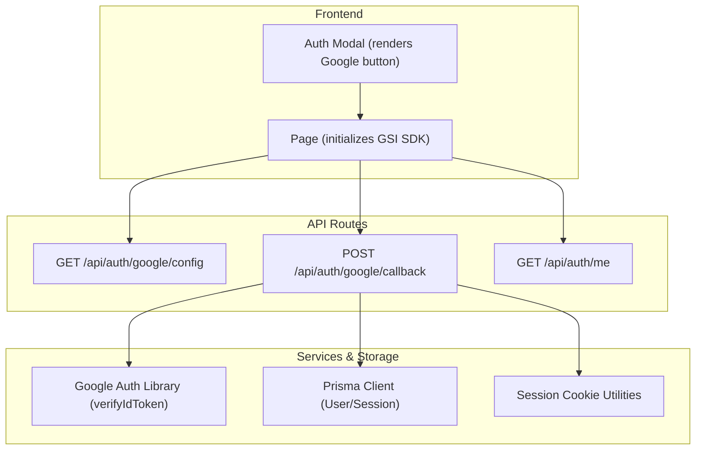
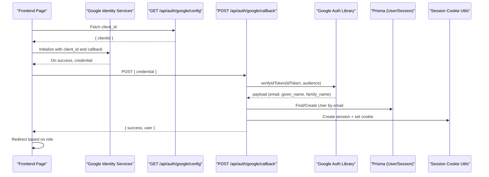
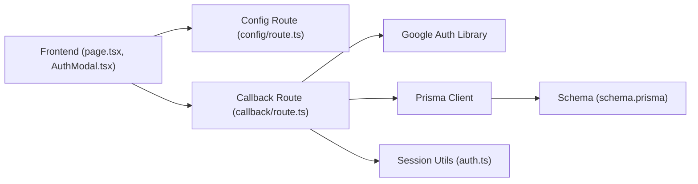

# Google OAuth Integration

<cite>
**Referenced Files in This Document**
- [route.ts](file://app/api/auth/google/config/route.ts)
- [route.ts](file://app/api/auth/google/callback/route.ts)
- [auth.ts](file://lib/auth.ts)
- [page.tsx](file://app/page.tsx)
- [AuthModal.tsx](file://app/components/AuthModal.tsx)
- [schema.prisma](file://prisma/schema.prisma)
- [route.ts](file://app/api/auth/me/route.ts)
</cite>

## Table of Contents
1. [Introduction](#introduction)
2. [Project Structure](#project-structure)
3. [Core Components](#core-components)
4. [Architecture Overview](#architecture-overview)
5. [Detailed Component Analysis](#detailed-component-analysis)
6. [Dependency Analysis](#dependency-analysis)
7. [Performance Considerations](#performance-considerations)
8. [Troubleshooting Guide](#troubleshooting-guide)
9. [Conclusion](#conclusion)
10. [Appendices](#appendices)

## Introduction
This document provides comprehensive API documentation for the Google OAuth integration in the PETIVA system. It covers:
- The configuration endpoint that returns client initialization parameters to the frontend.
- The callback endpoint that completes the OAuth flow by verifying the ID token, mapping user profile data, creating or linking accounts, establishing a session, and returning a success response.
- Security considerations around state handling and error management.
- End-to-end flow examples from initial authorization to successful authentication and common error scenarios.
- Implementation guidelines for configuring credentials, mapping profiles, and integrating with existing user accounts.

## Project Structure
The Google OAuth integration spans server-side routes, shared authentication utilities, and the frontend that initializes Google Identity Services and handles callbacks.

**Diagram sources**
- [page.tsx:55-77](file://app/page.tsx#L55-L77)
- [AuthModal.tsx:55-69](file://app/components/AuthModal.tsx#L55-L69)
- [route.ts:3-7](file://app/api/auth/google/config/route.ts#L3-L7)
- [route.ts:6-97](file://app/api/auth/google/callback/route.ts#L6-L97)
- [auth.ts:33-92](file://lib/auth.ts#L33-L92)
- [schema.prisma:30-66](file://prisma/schema.prisma#L30-L66)

**Section sources**
- [page.tsx:34-82](file://app/page.tsx#L34-L82)
- [AuthModal.tsx:55-69](file://app/components/AuthModal.tsx#L55-L69)
- [route.ts:3-7](file://app/api/auth/google/config/route.ts#L3-L7)
- [route.ts:6-97](file://app/api/auth/google/callback/route.ts#L6-L97)
- [auth.ts:33-92](file://lib/auth.ts#L33-L92)
- [schema.prisma:30-66](file://prisma/schema.prisma#L30-L66)

## Core Components
- Configuration endpoint: Returns the Google client ID used to initialize the Google Identity Services SDK on the client.
- Callback endpoint: Verifies the Google ID token, extracts user profile fields, creates or reuses a user account, establishes a session, sets an HTTP-only cookie, and returns authenticated user info.
- Session utilities: Generate tokens, persist sessions, validate sessions with sliding expiration, and manage cookies.
- Frontend integration: Dynamically loads Google’s client script, initializes it with the client ID, renders the sign-in button, and posts the credential to the callback endpoint.

**Section sources**
- [route.ts:3-7](file://app/api/auth/google/config/route.ts#L3-L7)
- [route.ts:6-97](file://app/api/auth/google/callback/route.ts#L6-L97)
- [auth.ts:23-92](file://lib/auth.ts#L23-L92)
- [page.tsx:55-111](file://app/page.tsx#L55-L111)
- [AuthModal.tsx:55-69](file://app/components/AuthModal.tsx#L55-L69)

## Architecture Overview
The OAuth flow uses Google Identity Services (client-side) and a server-side verification step.

**Diagram sources**
- [page.tsx:55-111](file://app/page.tsx#L55-L111)
- [route.ts:3-7](file://app/api/auth/google/config/route.ts#L3-L7)
- [route.ts:6-97](file://app/api/auth/google/callback/route.ts#L6-L97)
- [auth.ts:33-92](file://lib/auth.ts#L33-L92)
- [schema.prisma:30-66](file://prisma/schema.prisma#L30-L66)

## Detailed Component Analysis

### Configuration Endpoint: GET /api/auth/google/config
- Purpose: Provide the Google client ID to the frontend for initializing the Google Identity Services SDK.
- Behavior: Reads the client ID from environment variables and returns it in a JSON object.
- Security note: Only exposes the public client ID; secrets are not included.

Response shape:
- clientId: string

Error behavior:
- If the client ID is missing, an empty string is returned; the frontend should handle this gracefully.

**Section sources**
- [route.ts:3-7](file://app/api/auth/google/config/route.ts#L3-L7)

### Callback Endpoint: POST /api/auth/google/callback
- Purpose: Complete the OAuth flow by verifying the Google ID token, mapping user profile data, creating or reusing a user account, establishing a session, and returning authenticated user information.
- Input: JSON body containing the credential field (Google ID token).
- Processing steps:
  - Validate presence of credential.
  - In development/testing, support a mock token format for rapid iteration.
  - Verify the ID token using the Google Auth Library with the configured client ID and audience.
  - Extract email, first name, last name from the token payload.
  - Locate or create a user record by email.
  - Generate a session token, persist the session, and set an HTTP-only cookie.
  - Return a success response with minimal user info.

Success response shape:
- success: boolean
- user: object with id, email, role, firstName, lastName

Error responses:
- Missing credential: 400 Bad Request
- Missing client ID configuration: 500 Internal Server Error
- Invalid token payload: 401 Unauthorized
- Any unexpected error: 401 Unauthorized with generic message

Security notes:
- Token verification ensures the credential was issued by Google and intended for your client.
- Sessions are stored server-side with hashed tokens and time-bound expiration.
- Cookies are HTTP-only and secure in production.

**Section sources**
- [route.ts:6-97](file://app/api/auth/google/callback/route.ts#L6-L97)
- [auth.ts:23-92](file://lib/auth.ts#L23-L92)
- [schema.prisma:30-66](file://prisma/schema.prisma#L30-L66)

### Frontend Integration: Initialization and Callback Handling
- Loads Google Identity Services SDK dynamically.
- Fetches the client ID from the configuration endpoint and initializes the SDK with a callback function.
- Renders the Google sign-in button inside the auth modal.
- On successful sign-in, posts the credential to the callback endpoint and redirects users based on their role.

Behavior highlights:
- Graceful handling of network errors and authentication failures.
- Role-based redirection after successful login.

**Section sources**
- [page.tsx:55-111](file://app/page.tsx#L55-L111)
- [AuthModal.tsx:55-69](file://app/components/AuthModal.tsx#L55-L69)

### Session Management and Authentication Helpers
- Generates cryptographically random session tokens.
- Persists sessions with hashed tokens and expiration timestamps.
- Validates sessions with sliding expiration to extend active sessions near expiry.
- Sets and clears HTTP-only cookies for authenticated requests.

**Section sources**
- [auth.ts:23-92](file://lib/auth.ts#L23-L92)

### Data Model: Users and Sessions
- User model stores identity attributes including email, names, and role.
- Session model stores hashed tokens, associated user, and expiration.

**Section sources**
- [schema.prisma:30-66](file://prisma/schema.prisma#L30-L66)

### Current User Endpoint: GET /api/auth/me
- Purpose: Retrieve the current authenticated user from the session cookie.
- Behavior: Returns user info if authenticated; otherwise returns an unauthorized response.

**Section sources**
- [route.ts:4-32](file://app/api/auth/me/route.ts#L4-L32)

## Dependency Analysis
Key dependencies and relationships:
- Frontend depends on Google Identity Services SDK and the configuration endpoint.
- Callback endpoint depends on Google Auth Library for token verification and Prisma for database operations.
- Session utilities depend on Next.js cookies API and cryptographic primitives.
- Database schema defines User and Session models used throughout the flow.

**Diagram sources**
- [page.tsx:55-111](file://app/page.tsx#L55-L111)
- [AuthModal.tsx:55-69](file://app/components/AuthModal.tsx#L55-L69)
- [route.ts:3-7](file://app/api/auth/google/config/route.ts#L3-L7)
- [route.ts:6-97](file://app/api/auth/google/callback/route.ts#L6-L97)
- [auth.ts:23-92](file://lib/auth.ts#L23-L92)
- [schema.prisma:30-66](file://prisma/schema.prisma#L30-L66)

**Section sources**
- [page.tsx:55-111](file://app/page.tsx#L55-L111)
- [AuthModal.tsx:55-69](file://app/components/AuthModal.tsx#L55-L69)
- [route.ts:3-7](file://app/api/auth/google/config/route.ts#L3-L7)
- [route.ts:6-97](file://app/api/auth/google/callback/route.ts#L6-L97)
- [auth.ts:23-92](file://lib/auth.ts#L23-L92)
- [schema.prisma:30-66](file://prisma/schema.prisma#L30-L66)

## Performance Considerations
- Token verification involves network calls to Google; ensure timeouts and retries are handled appropriately at the application layer.
- Session validation includes database lookups; consider caching strategies for frequently accessed sessions if needed.
- Sliding expiration updates occur when sessions are nearing expiry; monitor write load accordingly.
- Avoid unnecessary re-renders of the Google button; the modal defers rendering until opened.

[No sources needed since this section provides general guidance]

## Troubleshooting Guide
Common issues and resolutions:
- Missing credential in callback request: Ensure the frontend posts the credential received from Google Identity Services.
- Client ID not configured: Verify the environment variable is set and accessible to the server.
- Invalid token payload: Check that the audience matches the configured client ID and that the token is valid.
- Network errors during callback: Handle connection failures on the frontend and retry or show a user-friendly message.
- Session not established: Confirm that session creation and cookie setting succeed; inspect logs for errors.

Operational checks:
- Use the development mock token path to test flows without real Google traffic.
- Inspect the current user endpoint to validate session establishment.

**Section sources**
- [route.ts:6-97](file://app/api/auth/google/callback/route.ts#L6-L97)
- [route.ts:4-32](file://app/api/auth/me/route.ts#L4-L32)
- [page.tsx:84-111](file://app/page.tsx#L84-L111)

## Conclusion
The PETIVA system integrates Google OAuth via a clean separation of concerns: the frontend initializes Google Identity Services and delegates credential verification to the server. The callback endpoint validates tokens, manages user accounts, establishes sessions, and returns authenticated user data. While the current implementation does not use an explicit state parameter, security relies on server-side token verification and robust session management. For enhanced security, consider adding state parameter validation and refining consent handling according to your privacy requirements.

[No sources needed since this section summarizes without analyzing specific files]

## Appendices

### API Definitions

#### GET /api/auth/google/config
- Description: Returns the Google client ID required to initialize the Google Identity Services SDK.
- Response:
  - clientId: string

**Section sources**
- [route.ts:3-7](file://app/api/auth/google/config/route.ts#L3-L7)

#### POST /api/auth/google/callback
- Description: Exchanges the Google ID token for a session and authenticated user info.
- Request body:
  - credential: string (Google ID token)
- Success response:
  - success: boolean
  - user: object with id, email, role, firstName, lastName
- Error responses:
  - 400: Missing credential
  - 500: Missing client ID configuration
  - 401: Invalid token payload or other authentication failure

**Section sources**
- [route.ts:6-97](file://app/api/auth/google/callback/route.ts#L6-L97)

#### GET /api/auth/me
- Description: Retrieves the current authenticated user from the session cookie.
- Success response:
  - success: boolean
  - user: object with id, email, role, firstName, lastName
- Error responses:
  - 401: Not logged in
  - 500: Unexpected server error

**Section sources**
- [route.ts:4-32](file://app/api/auth/me/route.ts#L4-L32)

### Flow Examples

#### Initial Authorization Request
- Frontend loads Google Identity Services SDK and fetches the client ID from the configuration endpoint.
- Initializes the SDK with the client ID and sets up a callback handler.
- Renders the Google sign-in button within the auth modal.

**Section sources**
- [page.tsx:55-77](file://app/page.tsx#L55-L77)
- [AuthModal.tsx:55-69](file://app/components/AuthModal.tsx#L55-L69)

#### Callback Processing
- After user signs in via Google, the frontend posts the credential to the callback endpoint.
- Server verifies the token, maps profile fields, creates or reuses a user, establishes a session, and sets a cookie.
- Frontend receives a success response and redirects based on user role.

**Section sources**
- [page.tsx:84-111](file://app/page.tsx#L84-L111)
- [route.ts:6-97](file://app/api/auth/google/callback/route.ts#L6-L97)
- [auth.ts:33-92](file://lib/auth.ts#L33-L92)

#### Successful Authentication Response
- Response includes success flag and minimal user info.
- Frontend closes the auth modal and navigates to the appropriate dashboard.

**Section sources**
- [route.ts:79-88](file://app/api/auth/google/callback/route.ts#L79-L88)
- [page.tsx:95-103](file://app/page.tsx#L95-L103)

#### Error Scenarios
- User cancels or denies consent: No credential is sent; frontend shows an error message.
- Network failure: Frontend catches exceptions and displays a connection error.
- Invalid token or misconfiguration: Server returns appropriate error codes and messages.

**Section sources**
- [page.tsx:104-111](file://app/page.tsx#L104-L111)
- [route.ts:10-15](file://app/api/auth/google/callback/route.ts#L10-L15)
- [route.ts:29-49](file://app/api/auth/google/callback/route.ts#L29-L49)
- [route.ts:90-96](file://app/api/auth/google/callback/route.ts#L90-L96)

### Implementation Guidelines

#### Configuring Google OAuth Credentials
- Set the Google client ID in the environment variable consumed by the configuration endpoint.
- Ensure the client ID matches the audience used during token verification.

**Section sources**
- [route.ts:3-7](file://app/api/auth/google/config/route.ts#L3-L7)
- [route.ts:29-41](file://app/api/auth/google/callback/route.ts#L29-L41)

#### Handling User Profile Mapping
- Map email, given name, and family name from the token payload to the user model.
- Default values are provided for optional fields to ensure consistent records.

**Section sources**
- [route.ts:43-54](file://app/api/auth/google/callback/route.ts#L43-L54)
- [schema.prisma:30-53](file://prisma/schema.prisma#L30-L53)

#### Integrating With Existing User Accounts
- Account linking is performed by email uniqueness; existing users are reused upon successful authentication.
- New users are created with default roles and profile fields.

**Section sources**
- [route.ts:56-70](file://app/api/auth/google/callback/route.ts#L56-L70)
- [schema.prisma:30-53](file://prisma/schema.prisma#L30-L53)

### Security Notes
- State Parameter: The current implementation does not include an explicit state parameter in the OAuth flow. Consider adding state validation to mitigate CSRF risks when extending the flow.
- Consent Management: Google’s consent screen is managed by the client-side SDK; ensure scopes align with required permissions and inform users about data usage.
- Session Security: Sessions are stored server-side with hashed tokens and HTTP-only cookies; leverage these protections consistently across protected endpoints.

[No sources needed since this section provides general guidance]