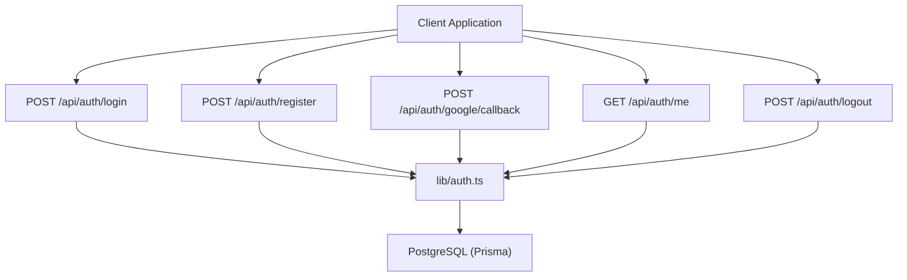
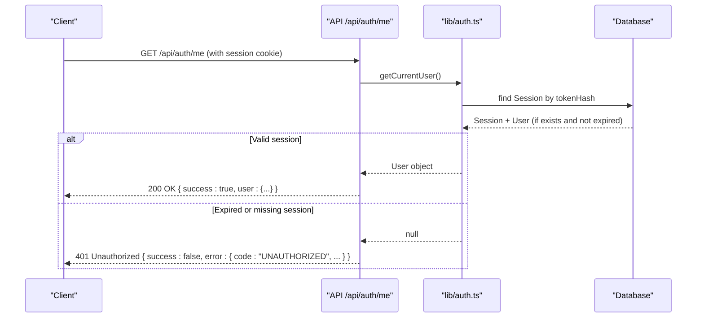
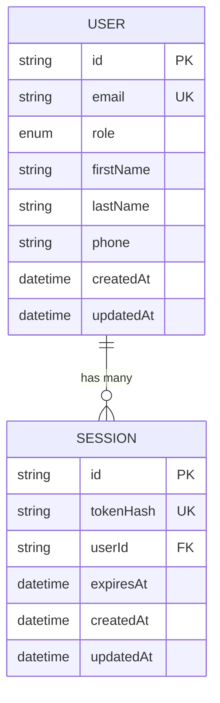
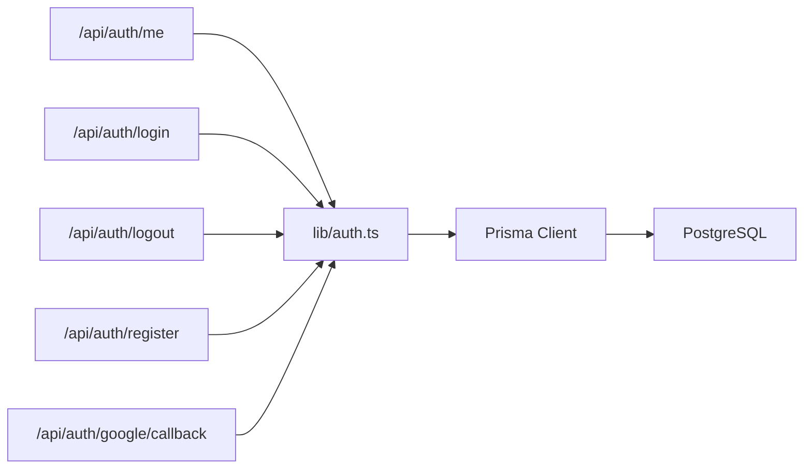

# User Session Management

<cite>
**Referenced Files in This Document**
- [route.ts](file://app/api/auth/me/route.ts)
- [auth.ts](file://lib/auth.ts)
- [route.ts](file://app/api/auth/login/route.ts)
- [route.ts](file://app/api/auth/logout/route.ts)
- [route.ts](file://app/api/auth/register/route.ts)
- [route.ts](file://app/api/auth/google/callback/route.ts)
- [schema.prisma](file://prisma/schema.prisma)
- [03-authentication-decision.md](file://docs/02-requirements/03-authentication-decision.md)
</cite>

## Table of Contents
1. Introduction
2. Project Structure
3. Core Components
4. Architecture Overview
5. Detailed Component Analysis
6. Dependency Analysis
7. Performance Considerations
8. Troubleshooting Guide
9. Conclusion
10. Appendices

## Introduction
This document explains the PETIVA system’s user session management APIs with a focus on retrieving the current user via /api/auth/me and the underlying session architecture. It covers authentication requirements, response formats, role-based information, secure cookie handling, token generation and validation, expiration behavior, concurrent sessions, security measures, error handling, and client-side implementation guidance for persistence and refresh strategies.

## Project Structure
The session management is implemented across Next.js App Router API routes and a shared authentication library:
- Authentication utilities and helpers are centralized in lib/auth.ts.
- API endpoints for login, logout, registration, Google OAuth callback, and current user retrieval live under app/api/auth/.
- The database schema defines the Session model and related entities in prisma/schema.prisma.
- Architectural decisions and security rationale are documented in docs/02-requirements/03-authentication-decision.md.

**Diagram sources**
- [route.ts:1-33](file://app/api/auth/me/route.ts#L1-L33)
- [route.ts:1-58](file://app/api/auth/login/route.ts#L1-L58)
- [route.ts:1-25](file://app/api/auth/logout/route.ts#L1-L25)
- [route.ts:1-78](file://app/api/auth/register/route.ts#L1-L78)
- [route.ts:1-98](file://app/api/auth/google/callback/route.ts#L1-L98)
- [auth.ts:1-125](file://lib/auth.ts#L1-L125)

**Section sources**
- [route.ts:1-33](file://app/api/auth/me/route.ts#L1-L33)
- [auth.ts:1-125](file://lib/auth.ts#L1-L125)
- [schema.prisma:30-66](file://prisma/schema.prisma#L30-L66)
- [03-authentication-decision.md:125-130](file://docs/02-requirements/03-authentication-decision.md#L125-L130)

## Core Components
- Current user endpoint: GET /api/auth/me returns the authenticated user profile when a valid session cookie is present.
- Authentication library: Provides token generation, hashing, session creation/validation/invalidation, cookie helpers, and auth guards (getCurrentUser, requireAuth, requireRole).
- Login/Logout/Register/Google OAuth: Endpoints that create or terminate sessions and set cookies accordingly.
- Database models: User and Session models define relationships and constraints used by the session flow.

Key responsibilities:
- Securely store only hashed tokens in the database while sending plaintext tokens over HttpOnly cookies.
- Validate sessions per request using indexed lookups by token hash.
- Enforce sliding-window expiration to keep active sessions alive.
- Support multiple concurrent sessions per user via independent tokens.

**Section sources**
- [route.ts:1-33](file://app/api/auth/me/route.ts#L1-L33)
- [auth.ts:23-125](file://lib/auth.ts#L23-L125)
- [schema.prisma:30-66](file://prisma/schema.prisma#L30-L66)

## Architecture Overview
The session architecture uses database-backed opaque tokens stored as SHA-256 hashes, with cookies carrying the plaintext token. Each request to protected endpoints reads the cookie, validates the session against the database, and returns the associated user data if valid.

**Diagram sources**
- [route.ts:1-33](file://app/api/auth/me/route.ts#L1-L33)
- [auth.ts:100-107](file://lib/auth.ts#L100-L107)
- [auth.ts:46-75](file://lib/auth.ts#L46-L75)
- [schema.prisma:55-66](file://prisma/schema.prisma#L55-L66)

## Detailed Component Analysis

### GET /api/auth/me
- Method: GET
- Purpose: Retrieve the currently authenticated user’s profile.
- Authentication: Requires a valid session cookie named session_token. If absent or invalid, returns 401.
- Response format:
  - Success (200): { success: true, user: { id, email, role, firstName, lastName } }
  - Unauthorized (401): { success: false, error: { code: "UNAUTHORIZED", message: "Not logged in." } }
  - Server error (500): { success: false, error: { code: "INTERNAL_SERVER_ERROR", message: "An unexpected error occurred." } }
- Role-based information: The user object includes role, enabling downstream authorization checks.

Implementation highlights:
- Reads the session cookie and resolves the user via getCurrentUser().
- Returns a minimal profile payload excluding sensitive fields.
- Centralized error handling ensures consistent error shapes.

**Section sources**
- [route.ts:1-33](file://app/api/auth/me/route.ts#L1-L33)
- [auth.ts:100-107](file://lib/auth.ts#L100-L107)

### Session Management Library (lib/auth.ts)
Responsibilities:
- Token generation and hashing:
  - generateSessionToken(): cryptographically secure random token.
  - hashSessionToken(token): SHA-256 hash for storage.
- Session lifecycle:
  - createSession(userId, token): persists token hash, userId, expiresAt.
  - validateSession(token): finds session by tokenHash, checks expiration, performs sliding-window extension if within one hour of expiry, returns associated user.
  - invalidateSession(token): deletes session by tokenHash.
- Cookie helpers:
  - setSessionCookie(token, expiresAt): sets HttpOnly, Secure (in production), SameSite=Lax, Path=/ cookie.
  - clearSessionCookie(): deletes the session cookie.
- Auth guards:
  - getCurrentUser(): reads cookie, validates session, returns user or null.
  - requireAuth(): throws if no authenticated user.
  - requireRole(allowedRoles): enforces RBAC by checking user.role.

Expiration and concurrency:
- Expiration: 2-hour sliding window; extended when less than one hour remains.
- Concurrency: Multiple sessions per user supported because each token maps to its own Session row.

Security notes:
- Only token hashes are stored in the database.
- Cookies are HttpOnly and, in production, Secure; SameSite=Lax mitigates CSRF via cross-site requests.

**Section sources**
- [auth.ts:23-125](file://lib/auth.ts#L23-L125)
- [schema.prisma:55-66](file://prisma/schema.prisma#L55-L66)
- [03-authentication-decision.md:125-130](file://docs/02-requirements/03-authentication-decision.md#L125-L130)

### POST /api/auth/login
- Validates credentials, verifies password, creates a session, sets the session cookie, and returns the user profile.
- Error responses include BAD_REQUEST for missing inputs and UNAUTHORIZED for invalid credentials.

**Section sources**
- [route.ts:1-58](file://app/api/auth/login/route.ts#L1-L58)
- [auth.ts:11-21](file://lib/auth.ts#L11-L21)
- [auth.ts:33-44](file://lib/auth.ts#L33-L44)
- [auth.ts:83-92](file://lib/auth.ts#L83-L92)

### POST /api/auth/logout
- Invalidates the session by deleting the matching Session row and clears the session cookie.
- Returns success on completion or an internal server error on failure.

**Section sources**
- [route.ts:1-25](file://app/api/auth/logout/route.ts#L1-L25)
- [auth.ts:77-80](file://lib/auth.ts#L77-L80)
- [auth.ts:94-97](file://lib/auth.ts#L94-L97)

### POST /api/auth/register
- Validates input, hashes password, creates user, generates a session, sets the cookie, and returns the new user profile.
- Handles conflicts for existing emails and invalid roles.

**Section sources**
- [route.ts:1-78](file://app/api/auth/register/route.ts#L1-L78)
- [auth.ts:11-21](file://lib/auth.ts#L11-L21)
- [auth.ts:33-44](file://lib/auth.ts#L33-L44)
- [auth.ts:83-92](file://lib/auth.ts#L83-L92)

### POST /api/auth/google/callback
- Verifies Google ID token (or supports mock tokens in development), locates or creates a user, creates a session, sets the cookie, and returns the user profile.

**Section sources**
- [route.ts:1-98](file://app/api/auth/google/callback/route.ts#L1-L98)
- [auth.ts:33-44](file://lib/auth.ts#L33-L44)
- [auth.ts:83-92](file://lib/auth.ts#L83-L92)

### Data Model: Session and User
- Session stores tokenHash, userId, expiresAt, and timestamps. Indexed on tokenHash, userId, and expiresAt for efficient lookup and cleanup.
- User includes role and personal details exposed in API responses.

**Diagram sources**
- [schema.prisma:30-66](file://prisma/schema.prisma#L30-L66)

## Dependency Analysis
- API routes depend on lib/auth.ts for all session operations and cookie handling.
- lib/auth.ts depends on Prisma client to persist and query Session records.
- The Session model indexes ensure fast lookups by tokenHash and support expiration-based maintenance.

**Diagram sources**
- [route.ts:1-33](file://app/api/auth/me/route.ts#L1-L33)
- [route.ts:1-58](file://app/api/auth/login/route.ts#L1-L58)
- [route.ts:1-25](file://app/api/auth/logout/route.ts#L1-L25)
- [route.ts:1-78](file://app/api/auth/register/route.ts#L1-L78)
- [route.ts:1-98](file://app/api/auth/google/callback/route.ts#L1-L98)
- [auth.ts:1-125](file://lib/auth.ts#L1-L125)

**Section sources**
- [auth.ts:1-125](file://lib/auth.ts#L1-L125)
- [schema.prisma:55-66](file://prisma/schema.prisma#L55-L66)

## Performance Considerations
- Session validation performs a single indexed lookup by tokenHash, which is optimized for sub-millisecond queries on PostgreSQL.
- Sliding-window expiration reduces frequent re-authentication while keeping sessions short-lived for security.
- Consider periodic background jobs to purge expired sessions beyond immediate deletion on access.

[No sources needed since this section provides general guidance]

## Troubleshooting Guide
Common issues and resolutions:
- 401 Unauthorized on /api/auth/me:
  - Missing or invalid session cookie. Ensure the browser sends cookies to the backend and that the cookie path/domain match your deployment.
  - Expired session: Re-login or implement automatic refresh logic.
- 500 Internal Server Error:
  - Unexpected server-side exceptions. Check logs for stack traces and verify database connectivity.
- Logout not clearing session:
  - Confirm the logout endpoint is called and that the session cookie is cleared. Verify that the server deletes the Session record.

Error response patterns:
- Unauthorized: { success: false, error: { code: "UNAUTHORIZED", message: "..." } }
- Bad Request: { success: false, error: { code: "BAD_REQUEST", message: "..." } }
- Conflict: { success: false, error: { code: "CONFLICT", message: "..." } }
- Internal Server Error: { success: false, error: { code: "INTERNAL_SERVER_ERROR", message: "..." } }

**Section sources**
- [route.ts:1-33](file://app/api/auth/me/route.ts#L1-L33)
- [route.ts:1-58](file://app/api/auth/login/route.ts#L1-L58)
- [route.ts:1-25](file://app/api/auth/logout/route.ts#L1-L25)
- [route.ts:1-78](file://app/api/auth/register/route.ts#L1-L78)

## Conclusion
PETIVA’s session management uses secure, database-backed opaque tokens with HttpOnly cookies, robust validation, and sliding-window expiration. The /api/auth/me endpoint provides a simple way to retrieve the authenticated user’s profile and role. The design supports concurrent sessions, immediate revocation, and strong protection against token theft via database leaks. Clients should handle 401 responses by prompting re-authentication and consider implementing automatic refresh flows for better UX.

[No sources needed since this section summarizes without analyzing specific files]

## Appendices

### Security Measures Summary
- HTTP-only cookies prevent client-side script access to session tokens.
- Secure flag in production restricts cookies to HTTPS.
- SameSite=Lax mitigates CSRF risks for cross-site requests.
- Token hashing (SHA-256) protects against database-leak hijacking.
- Immediate session invalidation on logout and during account changes.

**Section sources**
- [auth.ts:83-92](file://lib/auth.ts#L83-L92)
- [auth.ts:77-80](file://lib/auth.ts#L77-L80)
- [03-authentication-decision.md:125-130](file://docs/02-requirements/03-authentication-decision.md#L125-L130)

### Client-Side Implementation Guidelines
- Persistence:
  - Do not store session tokens in localStorage or sessionStorage. Rely on HttpOnly cookies managed by the browser.
- Automatic refresh:
  - On receiving 401 from /api/auth/me or other protected endpoints, redirect users to login or trigger a silent re-auth flow if applicable.
  - For long-lived sessions, consider refreshing at intervals before expiration to avoid interruptions.
- Cross-origin considerations:
  - Ensure cookies are sent with cross-origin requests by configuring appropriate CORS and cookie settings on the server side.

[No sources needed since this section provides general guidance]