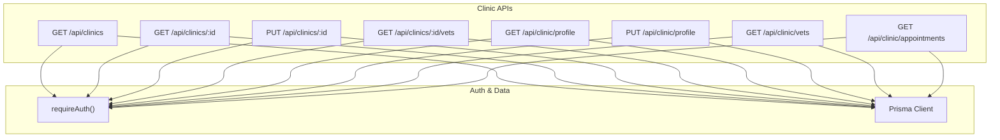
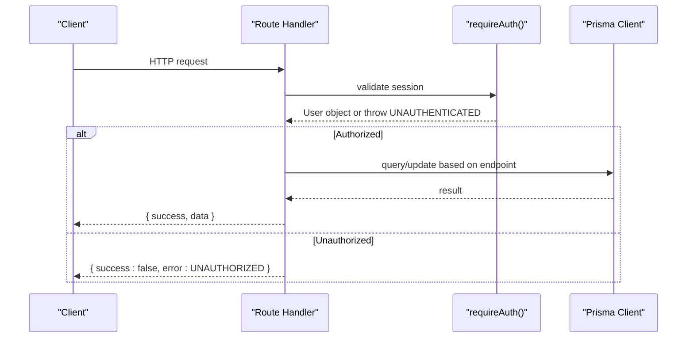
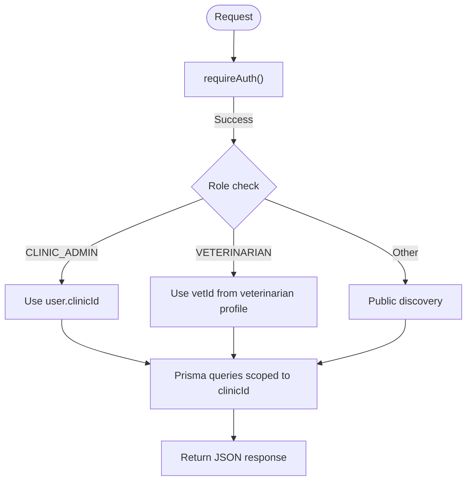

# Clinic Administration API

<cite>
**Referenced Files in This Document**
- [route.ts](file://app/api/clinics/route.ts)
- [route.ts](file://app/api/clinics/[clinicId]/route.ts)
- [route.ts](file://app/api/clinics/[clinicId]/vets/route.ts)
- [route.ts](file://app/api/clinic/profile/route.ts)
- [route.ts](file://app/api/clinic/vets/route.ts)
- [route.ts](file://app/api/clinic/appointments/route.ts)
- [schema.prisma](file://prisma/schema.prisma)
- [auth.ts](file://lib/auth.ts)
</cite>

## Table of Contents
1. [Introduction](#introduction)
2. [Project Structure](#project-structure)
3. [Core Components](#core-components)
4. [Architecture Overview](#architecture-overview)
5. [Detailed Component Analysis](#detailed-component-analysis)
6. [Dependency Analysis](#dependency-analysis)
7. [Performance Considerations](#performance-considerations)
8. [Troubleshooting Guide](#troubleshooting-guide)
9. [Conclusion](#conclusion)

## Introduction
This document provides detailed API documentation for clinic administration endpoints in the PETIVA system. It covers:
- Clinic discovery and listing
- Clinic profile management
- Vet-clinic associations
- Clinic-level vet management
- Clinic-level appointment scheduling and filtering

The API is built on Next.js Route Handlers with Prisma ORM and a role-based access control model using sessions.

## Project Structure
Clinic administration endpoints are organized under two namespaces:
- /api/clinics/* — general clinic operations (listing, fetching by ID, editing clinic details, listing vets per clinic)
- /api/clinic/* — clinic-admin-scoped operations scoped to the authenticated admin’s associated clinic (profile, vets, appointments)

**Diagram sources**
- [route.ts:6-48](file://app/api/clinics/route.ts#L6-L48)
- [route.ts:6-83](file://app/api/clinics/[clinicId]/route.ts#L6-L83)
- [route.ts:6-55](file://app/api/clinics/[clinicId]/vets/route.ts#L6-L55)
- [route.ts:5-94](file://app/api/clinic/profile/route.ts#L5-L94)
- [route.ts:5-64](file://app/api/clinic/vets/route.ts#L5-L64)
- [route.ts:5-97](file://app/api/clinic/appointments/route.ts#L5-L97)
- [auth.ts:109-124](file://lib/auth.ts#L109-L124)

**Section sources**
- [route.ts:6-48](file://app/api/clinics/route.ts#L6-L48)
- [route.ts:6-83](file://app/api/clinics/[clinicId]/route.ts#L6-L83)
- [route.ts:6-55](file://app/api/clinics/[clinicId]/vets/route.ts#L6-L55)
- [route.ts:5-94](file://app/api/clinic/profile/route.ts#L5-L94)
- [route.ts:5-64](file://app/api/clinic/vets/route.ts#L5-L64)
- [route.ts:5-97](file://app/api/clinic/appointments/route.ts#L5-L97)
- [auth.ts:109-124](file://lib/auth.ts#L109-L124)

## Core Components
- Authentication middleware: requireAuth enforces session validation and returns the current user or throws UNAUTHENTICATED.
- Role checks: Endpoints enforce CLINIC_ADMIN or PLATFORM_ADMIN where necessary.
- Data isolation: Clinic-admin endpoints scope queries to the admin’s associated clinic via user.clinicId.
- Vet-clinic associations: VetClinicAssociation links Veterinarian and Clinic with status (PENDING, ACTIVE, INACTIVE).

**Section sources**
- [auth.ts:109-124](file://lib/auth.ts#L109-L124)
- [schema.prisma:9-20](file://prisma/schema.prisma#L9-L20)
- [schema.prisma:90-131](file://prisma/schema.prisma#L90-L131)
- [schema.prisma:107-119](file://prisma/schema.prisma#L107-L119)

## Architecture Overview
The API follows a consistent pattern:
- Validate session via requireAuth
- Enforce role-based permissions
- Query or update data through Prisma
- Return standardized success/error responses

**Diagram sources**
- [auth.ts:109-124](file://lib/auth.ts#L109-L124)
- [route.ts:6-48](file://app/api/clinics/route.ts#L6-L48)
- [route.ts:6-83](file://app/api/clinics/[clinicId]/route.ts#L6-L83)
- [route.ts:5-94](file://app/api/clinic/profile/route.ts#L5-L94)

## Detailed Component Analysis

### Endpoint: GET /api/clinics
- Purpose: List clinics. For veterinarians, returns clinics associated with them; otherwise returns verified clinics for discovery.
- Authentication: Required
- Authorization: VETERINARIAN can list their own clinics; others see verified clinics
- Request: None
- Response:
  - success: boolean
  - clinics: array of Clinic objects
- Error handling:
  - 401 UNAUTHORIZED if not logged in
  - 500 INTERNAL_SERVER_ERROR for unexpected errors

Example response shape:
{
  "success": true,
  "clinics": [ /* Clinic objects */ ]
}

**Section sources**
- [route.ts:6-48](file://app/api/clinics/route.ts#L6-L48)
- [schema.prisma:107-119](file://prisma/schema.prisma#L107-L119)

### Endpoint: GET /api/clinics/:clinicId
- Purpose: Fetch details of a specific clinic by ID.
- Authentication: Required
- Authorization: Any authenticated user
- Path params:
  - clinicId: string
- Response:
  - success: boolean
  - clinic: Clinic object
- Errors:
  - 401 UNAUTHORIZED
  - 404 NOT_FOUND if clinic does not exist
  - 500 INTERNAL_SERVER_ERROR

**Section sources**
- [route.ts:6-37](file://app/api/clinics/[clinicId]/route.ts#L6-L37)
- [schema.prisma:107-119](file://prisma/schema.prisma#L107-L119)

### Endpoint: PUT /api/clinics/:clinicId
- Purpose: Edit clinic profile details (name, address, phone).
- Authentication: Required
- Authorization: CLINIC_ADMIN or PLATFORM_ADMIN only
- Request body:
  - name: string (required)
  - address: string (required)
  - phone: string? (optional)
- Response:
  - success: boolean
  - clinic: updated Clinic object
- Errors:
  - 400 BAD_REQUEST if required fields missing
  - 401 UNAUTHORIZED
  - 403 FORBIDDEN if insufficient role
  - 500 INTERNAL_SERVER_ERROR

Example request:
{
  "name": "String",
  "address": "String",
  "phone": "String?"
}

**Section sources**
- [route.ts:40-83](file://app/api/clinics/[clinicId]/route.ts#L40-L83)
- [schema.prisma:107-119](file://prisma/schema.prisma#L107-L119)

### Endpoint: GET /api/clinics/:clinicId/vets
- Purpose: List all veterinarians associated with a specific clinic.
- Authentication: Required
- Authorization: Any authenticated user
- Path params:
  - clinicId: string
- Response:
  - success: boolean
  - vets: array of vet summary objects including:
    - id: string
    - specialization: string?
    - licenseNumber: string
    - isVerified: boolean
    - firstName: string
    - lastName: string
    - email: string
    - status: AssociationStatus (PENDING | ACTIVE | INACTIVE)
- Errors:
  - 401 UNAUTHORIZED
  - 500 INTERNAL_SERVER_ERROR

**Section sources**
- [route.ts:6-55](file://app/api/clinics/[clinicId]/vets/route.ts#L6-L55)
- [schema.prisma:90-131](file://prisma/schema.prisma#L90-L131)

### Endpoint: GET /api/clinic/profile
- Purpose: Retrieve the clinic profile associated with the authenticated CLINIC_ADMIN.
- Authentication: Required
- Authorization: CLINIC_ADMIN only
- Request: None
- Response:
  - success: boolean
  - clinic: Clinic object
- Errors:
  - 400 BAD_REQUEST if admin has no associated clinic
  - 401 UNAUTHORIZED
  - 403 FORBIDDEN
  - 404 NOT_FOUND if associated clinic not found
  - 500 INTERNAL_SERVER_ERROR

**Section sources**
- [route.ts:5-47](file://app/api/clinic/profile/route.ts#L5-L47)
- [schema.prisma:30-53](file://prisma/schema.prisma#L30-L53)
- [schema.prisma:107-119](file://prisma/schema.prisma#L107-L119)

### Endpoint: PUT /api/clinic/profile
- Purpose: Update the clinic profile for the authenticated CLINIC_ADMIN’s associated clinic.
- Authentication: Required
- Authorization: CLINIC_ADMIN only
- Request body:
  - name: string (required)
  - address: string (required)
  - phone: string? (optional)
- Response:
  - success: boolean
  - clinic: updated Clinic object
- Errors:
  - 400 BAD_REQUEST if required fields missing or no associated clinic
  - 401 UNAUTHORIZED
  - 403 FORBIDDEN
  - 500 INTERNAL_SERVER_ERROR

Example request:
{
  "name": "String",
  "address": "String",
  "phone": "String?"
}

**Section sources**
- [route.ts:49-94](file://app/api/clinic/profile/route.ts#L49-L94)
- [schema.prisma:30-53](file://prisma/schema.prisma#L30-L53)
- [schema.prisma:107-119](file://prisma/schema.prisma#L107-L119)

### Endpoint: GET /api/clinic/vets
- Purpose: List all veterinarians associated with the authenticated CLINIC_ADMIN’s clinic.
- Authentication: Required
- Authorization: CLINIC_ADMIN only
- Request: None
- Response:
  - success: boolean
  - vets: array of vet summary objects (same shape as /api/clinics/:clinicId/vets)
- Errors:
  - 400 BAD_REQUEST if admin has no associated clinic
  - 401 UNAUTHORIZED
  - 403 FORBIDDEN
  - 500 INTERNAL_SERVER_ERROR

**Section sources**
- [route.ts:5-64](file://app/api/clinic/vets/route.ts#L5-L64)
- [schema.prisma:90-131](file://prisma/schema.prisma#L90-L131)

### Endpoint: GET /api/clinic/appointments
- Purpose: List appointments for the authenticated CLINIC_ADMIN’s clinic with optional filters.
- Authentication: Required
- Authorization: CLINIC_ADMIN only
- Query parameters:
  - filter: ALL | TODAY | UPCOMING | COMPLETED | CANCELLED | REQUESTED | CONFIRMED
- Response:
  - success: boolean
  - appointments: array of Appointment objects with included pet, owner, vet, and clinic details
- Errors:
  - 400 BAD_REQUEST if admin has no associated clinic
  - 401 UNAUTHORIZED
  - 403 FORBIDDEN
  - 500 INTERNAL_SERVER_ERROR

Filter behavior:
- TODAY: appointments within current day
- UPCOMING: future appointments with REQUESTED or CONFIRMED status
- Other statuses: exact match on Appointment.status

**Section sources**
- [route.ts:5-97](file://app/api/clinic/appointments/route.ts#L5-L97)
- [schema.prisma:164-182](file://prisma/schema.prisma#L164-L182)

## Dependency Analysis
- All endpoints depend on requireAuth for session validation.
- Clinic-admin endpoints rely on user.clinicId to scope data to the correct tenant (clinic).
- Vet listings use VetClinicAssociation to join Veterinarian and Clinic and include user details.
- Appointments are filtered by clinicId and optionally by date/status.

**Diagram sources**
- [auth.ts:109-124](file://lib/auth.ts#L109-L124)
- [route.ts:6-48](file://app/api/clinics/route.ts#L6-L48)
- [route.ts:5-97](file://app/api/clinic/appointments/route.ts#L5-L97)

**Section sources**
- [auth.ts:109-124](file://lib/auth.ts#L109-L124)
- [route.ts:6-48](file://app/api/clinics/route.ts#L6-L48)
- [route.ts:5-97](file://app/api/clinic/appointments/route.ts#L5-L97)

## Performance Considerations
- Use appropriate includes to minimize N+1 queries when returning related entities (e.g., vet.user).
- Filter appointments server-side using date ranges and status arrays to reduce payload size.
- Ensure indexes exist on frequently queried fields such as clinicId, vetId, dateTime, and userId relationships.

[No sources needed since this section provides general guidance]

## Troubleshooting Guide
Common errors and resolutions:
- 401 UNAUTHORIZED: Missing or invalid session cookie. Ensure login succeeded and session is active.
- 403 FORBIDDEN: Insufficient role. Only CLINIC_ADMIN or PLATFORM_ADMIN can edit clinics; only CLINIC_ADMIN can manage clinic profile, vets, and appointments.
- 400 BAD_REQUEST: Missing required fields (name, address) or admin lacks an associated clinic (user.clinicId is null).
- 404 NOT_FOUND: Clinic not found or associated clinic not found for the admin.
- 500 INTERNAL_SERVER_ERROR: Unexpected server-side error; check logs and database connectivity.

**Section sources**
- [route.ts:6-48](file://app/api/clinics/route.ts#L6-L48)
- [route.ts:6-83](file://app/api/clinics/[clinicId]/route.ts#L6-L83)
- [route.ts:5-94](file://app/api/clinic/profile/route.ts#L5-L94)
- [route.ts:5-64](file://app/api/clinic/vets/route.ts#L5-L64)
- [route.ts:5-97](file://app/api/clinic/appointments/route.ts#L5-L97)

## Conclusion
The PETIVA clinic administration API provides secure, role-based endpoints for managing clinics, vet associations, and appointments. Clinic administrators can manage their clinic’s profile and staff, while veterinarians can view associated clinics. The design emphasizes data isolation per clinic via user.clinicId and robust authentication and authorization checks.

[No sources needed since this section summarizes without analyzing specific files]