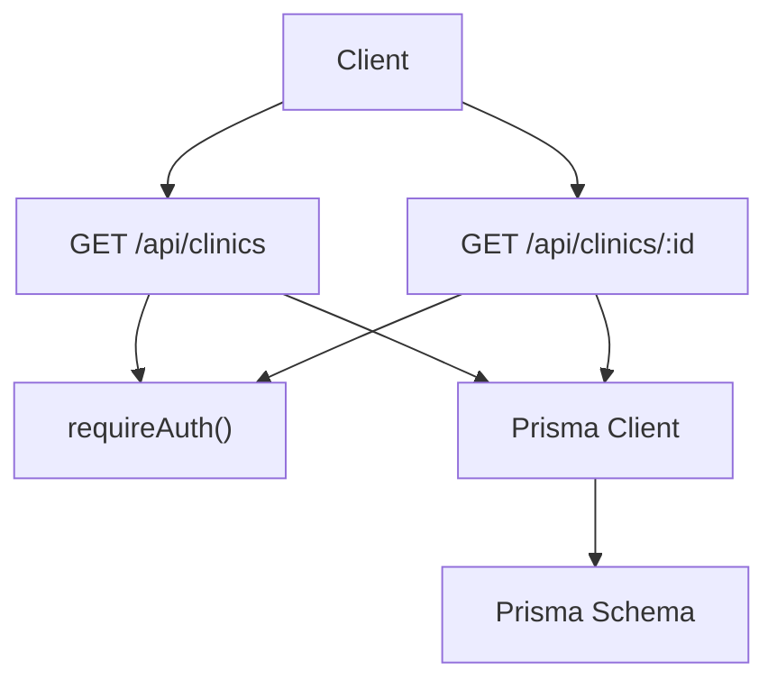
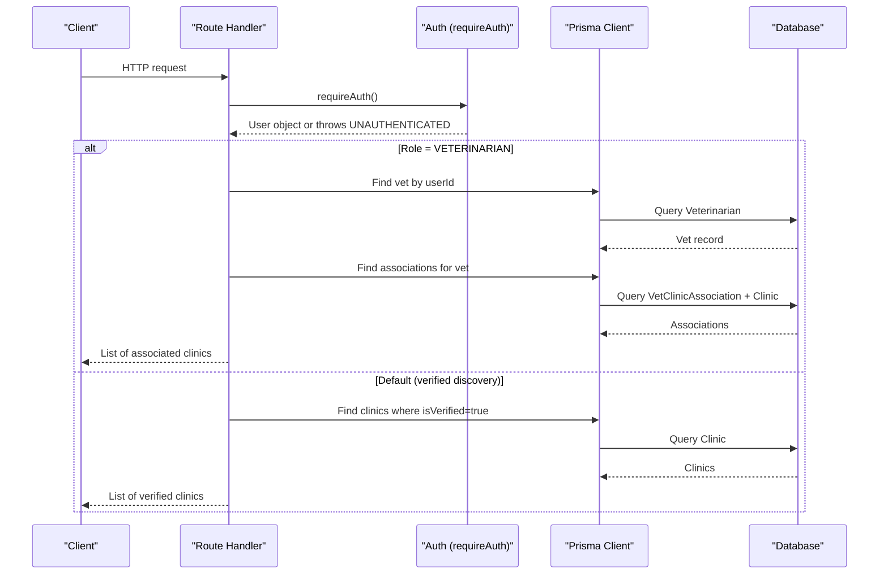
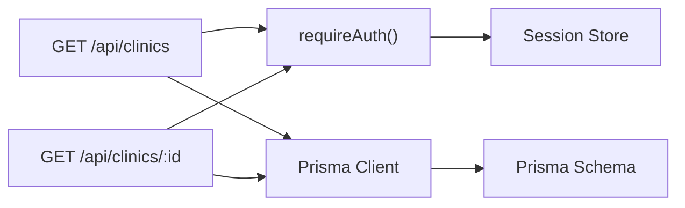

# Clinic CRUD Operations

<cite>
**Referenced Files in This Document**
- [route.ts](file://app/api/clinics/route.ts)
- [route.ts](file://app/api/clinics/[clinicId]/route.ts)
- [schema.prisma](file://prisma/schema.prisma)
- [auth.ts](file://lib/auth.ts)
- [db.ts](file://lib/db.ts)
- [route.ts](file://app/api/clinic/profile/route.ts)
- [route.ts](file://app/api/clinic/vets/route.ts)
</cite>

## Table of Contents
1. [Introduction](#introduction)
2. [Project Structure](#project-structure)
3. [Core Components](#core-components)
4. [Architecture Overview](#architecture-overview)
5. [Detailed Component Analysis](#detailed-component-analysis)
6. [Dependency Analysis](#dependency-analysis)
7. [Performance Considerations](#performance-considerations)
8. [Troubleshooting Guide](#troubleshooting-guide)
9. [Conclusion](#conclusion)
10. [Appendices](#appendices)

## Introduction
This document provides detailed API documentation for clinic-related endpoints in the PETIVA system, focusing on:
- Listing clinics with role-based filtering
- Retrieving a specific clinic’s details
- Authentication and authorization requirements
- Request/response schemas for clinic objects
- Error handling patterns
- Examples for different user roles (veterinarian vs public discovery)

The implementation uses Next.js Route Handlers with Prisma ORM and database-backed sessions for authentication.

## Project Structure
Clinic APIs are implemented as Next.js route handlers under app/api/clinics. The data model is defined in Prisma schema, and authentication is enforced via a shared auth utility.

**Diagram sources**
- [route.ts:6-48](file://app/api/clinics/route.ts#L6-L48)
- [route.ts:6-38](file://app/api/clinics/[clinicId]/route.ts#L6-L38)
- [auth.ts:109-115](file://lib/auth.ts#L109-L115)
- [schema.prisma:107-119](file://prisma/schema.prisma#L107-L119)

**Section sources**
- [route.ts:6-48](file://app/api/clinics/route.ts#L6-L48)
- [route.ts:6-38](file://app/api/clinics/[clinicId]/route.ts#L6-L38)
- [schema.prisma:107-119](file://prisma/schema.prisma#L107-L119)
- [auth.ts:109-115](file://lib/auth.ts#L109-L115)

## Core Components
- GET /api/clinics: Lists clinics based on authenticated user role
  - Veterinarians see only their associated clinics
  - Other authenticated users see verified clinics for discovery
- GET /api/clinics/[clinicId]: Retrieves a single clinic by ID (requires authentication)
- PUT /api/clinics/[clinicId]: Updates clinic profile fields (name, address, phone) for authorized roles

Authentication is enforced using requireAuth(), which validates session cookies and returns an error if unauthenticated.

**Section sources**
- [route.ts:6-48](file://app/api/clinics/route.ts#L6-L48)
- [route.ts:6-84](file://app/api/clinics/[clinicId]/route.ts#L6-L84)
- [auth.ts:109-115](file://lib/auth.ts#L109-L115)

## Architecture Overview
The clinic endpoints follow a consistent flow:
1. Validate authentication via requireAuth()
2. Resolve user role to determine visibility or permissions
3. Query the database using Prisma
4. Return standardized success/error responses

**Diagram sources**
- [route.ts:6-48](file://app/api/clinics/route.ts#L6-L48)
- [auth.ts:109-115](file://lib/auth.ts#L109-L115)
- [schema.prisma:90-131](file://prisma/schema.prisma#L90-L131)

## Detailed Component Analysis

### Endpoint: GET /api/clinics
Purpose:
- List clinics with role-based filtering
- Veterinarians: return clinics associated with the current vet
- Other authenticated users: return verified clinics for discovery

Authentication:
- Requires a valid session cookie; otherwise returns 401

Request:
- Method: GET
- Headers: Cookie containing session token
- Body: None

Response:
- Success: { success: true, clinics: Clinic[] }
- Unauthorized: { success: false, error: { code: "UNAUTHORIZED", message: "Not logged in." } }
- Server error: { success: false, error: { code: "INTERNAL_SERVER_ERROR", message: "An error occurred." } }

Role behavior:
- If user.role === "VETERINARIAN":
  - Fetch vet profile by userId
  - If no vet profile found: return empty list
  - Otherwise, fetch VetClinicAssociation records for that vet and include related Clinic
- Else:
  - Fetch all clinics where isVerified is true, ordered by name ascending

Example scenarios:
- Veterinarian lists their own clinics
- Non-veterinarian authenticated user lists verified clinics for discovery

**Section sources**
- [route.ts:6-48](file://app/api/clinics/route.ts#L6-L48)

### Endpoint: GET /api/clinics/[clinicId]
Purpose:
- Retrieve details for a specific clinic by ID

Authentication:
- Requires a valid session cookie; otherwise returns 401

Request:
- Method: GET
- Path parameter: clinicId (string)
- Headers: Cookie containing session token
- Body: None

Response:
- Success: { success: true, clinic: Clinic }
- Not found: { success: false, error: { code: "NOT_FOUND", message: "Clinic not found." } }
- Unauthorized: { success: false, error: { code: "UNAUTHORIZED", message: "Not logged in." } }
- Server error: { success: false, error: { code: "INTERNAL_SERVER_ERROR", message: "An error occurred." } }

Notes:
- Returns the full Clinic entity from the database

**Section sources**
- [route.ts:6-38](file://app/api/clinics/[clinicId]/route.ts#L6-L38)

### Endpoint: PUT /api/clinics/[clinicId]
Purpose:
- Update clinic profile fields (name, address, phone)

Authorization:
- Requires authentication
- Only CLINIC_ADMIN or PLATFORM_ADMIN can update a clinic

Request:
- Method: PUT
- Path parameter: clinicId (string)
- Headers: Cookie containing session token
- Body: { name: string, address: string, phone?: string }

Validation:
- name and address are required; otherwise returns 400

Response:
- Success: { success: true, clinic: Clinic }
- Bad request: { success: false, error: { code: "BAD_REQUEST", message: "Clinic name and address are required." } }
- Forbidden: { success: false, error: { code: "FORBIDDEN", message: "Access Denied." } }
- Unauthorized: { success: false, error: { code: "UNAUTHORIZED", message: "Not logged in." } }
- Server error: { success: false, error: { code: "INTERNAL_SERVER_ERROR", message: "An error occurred." } }

**Section sources**
- [route.ts:40-84](file://app/api/clinics/[clinicId]/route.ts#L40-L84)

### Data Model: Clinic
Fields exposed by the API correspond to the Clinic model in the Prisma schema:
- id: string (primary key)
- name: string
- address: string
- phone: string? (optional)
- isVerified: boolean (default false)
- createdAt: DateTime
- updatedAt: DateTime

Relationships relevant to clinic listing:
- Veterinarian-to-Clinic association via VetClinicAssociation
- Appointments linked to clinic
- Medical records linked to clinic
- Admin users linked to clinic

Note: Services are not modeled in the current schema; therefore, services are not returned by these endpoints.

**Section sources**
- [schema.prisma:107-119](file://prisma/schema.prisma#L107-L119)
- [schema.prisma:121-131](file://prisma/schema.prisma#L121-L131)

### Authentication and Session Management
- Sessions are stored in the database with hashed tokens and expiration times
- requireAuth() reads the session cookie, validates it, and returns the user or throws UNAUTHENTICATED
- Sliding window expiration extends sessions nearing expiry

Security considerations:
- Cookies are httpOnly and secure in production
- Token hashing prevents storing plaintext tokens

**Section sources**
- [auth.ts:33-75](file://lib/auth.ts#L33-L75)
- [auth.ts:109-115](file://lib/auth.ts#L109-L115)

## Dependency Analysis
Clinic endpoints depend on:
- Authentication utility for session validation
- Prisma client configured for PostgreSQL
- Database schema defining Clinic, Veterinarian, and VetClinicAssociation

**Diagram sources**
- [route.ts:6-48](file://app/api/clinics/route.ts#L6-L48)
- [route.ts:6-38](file://app/api/clinics/[clinicId]/route.ts#L6-L38)
- [auth.ts:109-115](file://lib/auth.ts#L109-L115)
- [schema.prisma:107-131](file://prisma/schema.prisma#L107-L131)

**Section sources**
- [route.ts:6-48](file://app/api/clinics/route.ts#L6-L48)
- [route.ts:6-38](file://app/api/clinics/[clinicId]/route.ts#L6-L38)
- [auth.ts:109-115](file://lib/auth.ts#L109-L115)
- [schema.prisma:107-131](file://prisma/schema.prisma#L107-L131)

## Performance Considerations
- Use selective includes when fetching associated data to avoid over-fetching
- Indexes on frequently queried fields (e.g., isVerified, userId) improve performance
- Avoid unnecessary joins; fetch associations only when needed
- Cache verified clinic lists at the application layer if appropriate for read-heavy workloads

[No sources needed since this section provides general guidance]

## Troubleshooting Guide
Common errors and resolutions:
- 401 Unauthorized: Missing or invalid session cookie; ensure login succeeded and cookie is present
- 403 Forbidden: Insufficient role to update clinic; only CLINIC_ADMIN or PLATFORM_ADMIN allowed
- 404 Not Found: Clinic ID does not exist; verify path parameter
- 400 Bad Request: Missing required fields (name, address) in update requests; provide both fields
- 500 Internal Server Error: Unexpected server-side failure; check logs and database connectivity

Error response format:
- { success: false, error: { code: "...", message: "..." } }

**Section sources**
- [route.ts:36-48](file://app/api/clinics/route.ts#L36-L48)
- [route.ts:26-38](file://app/api/clinics/[clinicId]/route.ts#L26-L38)
- [route.ts:71-84](file://app/api/clinics/[clinicId]/route.ts#L71-L84)

## Conclusion
The clinic endpoints implement role-aware listing and retrieval of clinic data with robust authentication and error handling. Veterinarians see only their associated clinics, while other authenticated users discover verified clinics. Updates are restricted to authorized roles. The data model supports core clinic attributes such as name, address, phone, and verification status. Services are not currently modeled and thus not exposed by these endpoints.

[No sources needed since this section summarizes without analyzing specific files]

## Appendices

### Request/Response Schemas

- Clinic object fields:
  - id: string
  - name: string
  - address: string
  - phone: string?
  - isVerified: boolean
  - createdAt: DateTime
  - updatedAt: DateTime

- GET /api/clinics response:
  - { success: true, clinics: Clinic[] }

- GET /api/clinics/[clinicId] response:
  - { success: true, clinic: Clinic }

- PUT /api/clinics/[clinicId] request body:
  - { name: string, address: string, phone?: string }

- PUT /api/clinics/[clinicId] response:
  - { success: true, clinic: Clinic }

**Section sources**
- [schema.prisma:107-119](file://prisma/schema.prisma#L107-L119)
- [route.ts:6-48](file://app/api/clinics/route.ts#L6-L48)
- [route.ts:6-38](file://app/api/clinics/[clinicId]/route.ts#L6-L38)
- [route.ts:40-84](file://app/api/clinics/[clinicId]/route.ts#L40-L84)

### Example Workflows

- Veterinarian listing their clinics:
  - Authenticate as a veterinarian
  - Call GET /api/clinics
  - Receive list of clinics associated with the vet

- Public discovery of verified clinics:
  - Authenticate as any non-veterinarian user
  - Call GET /api/clinics
  - Receive list of verified clinics

- Access individual clinic details:
  - Authenticate as any user
  - Call GET /api/clinics/[clinicId]
  - Receive clinic object if found

- Update clinic profile:
  - Authenticate as CLINIC_ADMIN or PLATFORM_ADMIN
  - Call PUT /api/clinics/[clinicId] with name and address
  - Receive updated clinic object

**Section sources**
- [route.ts:6-48](file://app/api/clinics/route.ts#L6-L48)
- [route.ts:6-38](file://app/api/clinics/[clinicId]/route.ts#L6-L38)
- [route.ts:40-84](file://app/api/clinics/[clinicId]/route.ts#L40-L84)