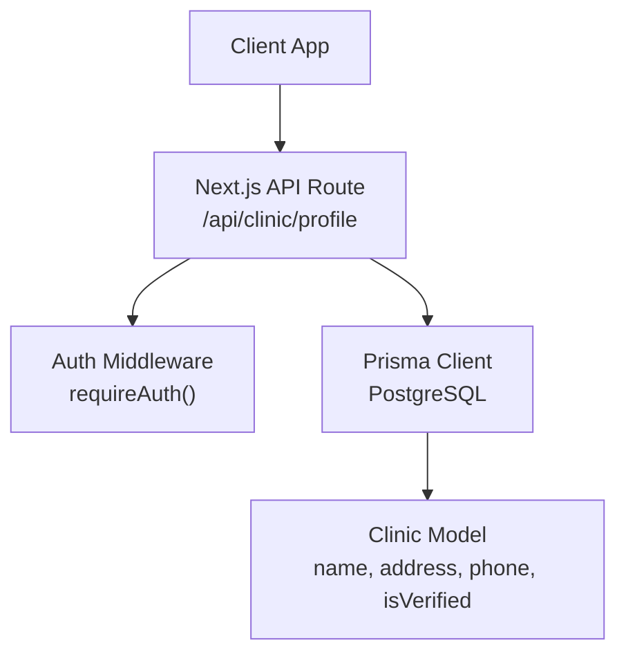
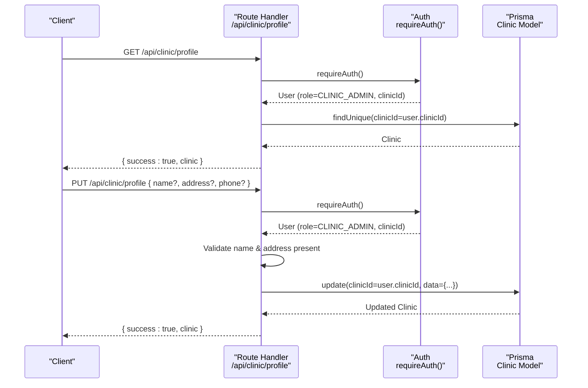
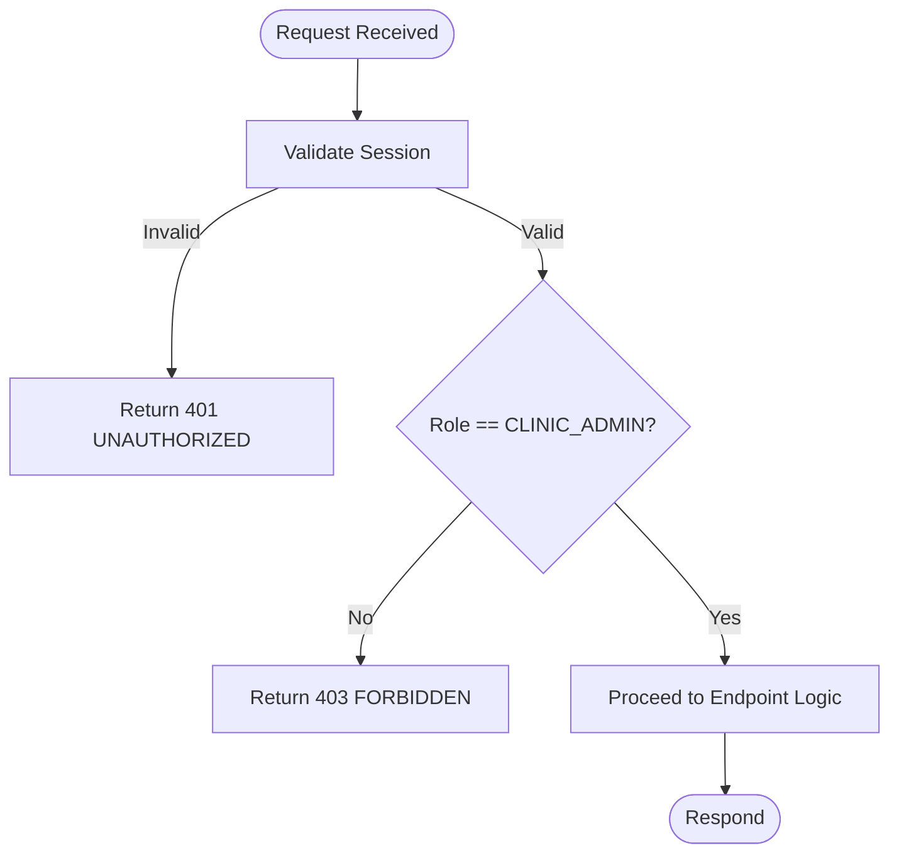
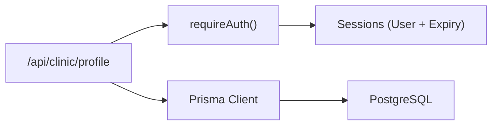

# Clinic Profile Management

<cite>
**Referenced Files in This Document**
- [route.ts](file://app/api/clinic/profile/route.ts)
- [schema.prisma](file://prisma/schema.prisma)
- [auth.ts](file://lib/auth.ts)
- [db.ts](file://lib/db.ts)
- [route.ts](file://app/api/clinics/[clinicId]/route.ts)
</cite>

## Table of Contents
1. [Introduction](#introduction)
2. [Project Structure](#project-structure)
3. [Core Components](#core-components)
4. [Architecture Overview](#architecture-overview)
5. [Detailed Component Analysis](#detailed-component-analysis)
6. [Dependency Analysis](#dependency-analysis)
7. [Performance Considerations](#performance-considerations)
8. [Troubleshooting Guide](#troubleshooting-guide)
9. [Conclusion](#conclusion)

## Introduction
This document provides detailed API documentation for clinic profile management endpoints under /api/clinic/profile. It covers:
- Retrieving the current clinic’s profile
- Updating clinic information (name, address, phone)
- Authentication and authorization requirements for clinic administrators
- Validation rules for profile data
- Examples of partial updates
- Field-level permissions and entity structure

The implementation is built on Next.js Route Handlers with Prisma ORM and a session-based authentication system.

## Project Structure
The clinic profile functionality is implemented as a Next.js API route that:
- Authenticates requests using a session cookie
- Enforces role-based access control (CLINIC_ADMIN)
- Reads/writes clinic data via Prisma against a PostgreSQL database

**Diagram sources**
- [route.ts:5-47](file://app/api/clinic/profile/route.ts#L5-L47)
- [auth.ts:109-115](file://lib/auth.ts#L109-L115)
- [schema.prisma:107-119](file://prisma/schema.prisma#L107-L119)

**Section sources**
- [route.ts:1-95](file://app/api/clinic/profile/route.ts#L1-L95)
- [schema.prisma:107-119](file://prisma/schema.prisma#L107-L119)
- [auth.ts:100-125](file://lib/auth.ts#L100-L125)
- [db.ts:1-33](file://lib/db.ts#L1-L33)

## Core Components
- GET /api/clinic/profile
  - Purpose: Retrieve the clinic profile associated with the authenticated CLINIC_ADMIN user.
  - Authorization: Requires an authenticated session and role CLINIC_ADMIN.
  - Data source: Clinic record linked to the user’s clinicId.
- PUT /api/clinic/profile
  - Purpose: Update clinic profile fields (partial update supported).
  - Authorization: Requires an authenticated session and role CLINIC_ADMIN.
  - Validation: name and address are required; phone is optional.
  - Data source: Updates only the provided fields on the clinic record identified by the user’s clinicId.

Field-level permissions:
- Only CLINIC_ADMIN users can read/update their own clinic profile via this endpoint.
- The isVerified field is not exposed for update through this endpoint; it is managed elsewhere.

**Section sources**
- [route.ts:5-47](file://app/api/clinic/profile/route.ts#L5-L47)
- [route.ts:49-94](file://app/api/clinic/profile/route.ts#L49-L94)
- [schema.prisma:107-119](file://prisma/schema.prisma#L107-L119)

## Architecture Overview
The request flow enforces authentication and role checks before interacting with the database.

**Diagram sources**
- [route.ts:5-47](file://app/api/clinic/profile/route.ts#L5-L47)
- [route.ts:49-94](file://app/api/clinic/profile/route.ts#L49-L94)
- [auth.ts:109-115](file://lib/auth.ts#L109-L115)
- [schema.prisma:107-119](file://prisma/schema.prisma#L107-L119)

## Detailed Component Analysis

### GET /api/clinic/profile
- Authentication: Session-based via requireAuth(). If no valid session exists, returns 401 UNAUTHORIZED.
- Authorization: Must be CLINIC_ADMIN; otherwise returns 403 FORBIDDEN.
- Context: Requires the user to have an associated clinicId; otherwise returns 400 BAD_REQUEST.
- Behavior: Fetches the clinic by user.clinicId; if not found, returns 404 NOT_FOUND.
- Response: Returns the full clinic object on success.

Request
- Method: GET
- Path: /api/clinic/profile
- Headers: Cookie containing session token

Response
- Success (200): { success: true, clinic: Clinic }
- Unauthorized (401): { success: false, error: { code: "UNAUTHORIZED", message: "Not logged in." } }
- Forbidden (403): { success: false, error: { code: "FORBIDDEN", message: "Access Denied." } }
- Bad Request (400): { success: false, error: { code: "BAD_REQUEST", message: "No clinic associated with this administrator." } }
- Not Found (404): { success: false, error: { code: "NOT_FOUND", message: "Associated clinic not found." } }
- Server Error (500): { success: false, error: { code: "INTERNAL_SERVER_ERROR", message: "An error occurred." } }

**Section sources**
- [route.ts:5-47](file://app/api/clinic/profile/route.ts#L5-L47)
- [auth.ts:109-115](file://lib/auth.ts#L109-L115)

### PUT /api/clinic/profile
- Authentication: Session-based via requireAuth(). If no valid session exists, returns 401 UNAUTHORIZED.
- Authorization: Must be CLINIC_ADMIN; otherwise returns 403 FORBIDDEN.
- Context: Requires the user to have an associated clinicId; otherwise returns 400 BAD_REQUEST.
- Validation: name and address are required; phone is optional. Missing required fields return 400 BAD_REQUEST.
- Behavior: Performs a partial update on the clinic record identified by user.clinicId using only the provided fields.
- Response: Returns the updated clinic object on success.

Request
- Method: PUT
- Path: /api/clinic/profile
- Headers: Cookie containing session token
- Body: Partial update object
  - name: string (required)
  - address: string (required)
  - phone: string | undefined (optional)

Response
- Success (200): { success: true, clinic: Clinic }
- Unauthorized (401): { success: false, error: { code: "UNAUTHORIZED", message: "Not logged in." } }
- Forbidden (403): { success: false, error: { code: "FORBIDDEN", message: "Access Denied." } }
- Bad Request (400): { success: false, error: { code: "BAD_REQUEST", message: "Clinic name and address are required." } } or context-specific messages
- Server Error (500): { success: false, error: { code: "INTERNAL_SERVER_ERROR", message: "An error occurred." } }

Example usage patterns
- Update name and address:
  - Body: { name: "...", address: "..." }
- Partial update (only phone):
  - Not allowed: name and address are required for this endpoint.
- Partial update (name only):
  - Not allowed: address is also required.
- Partial update (address only):
  - Not allowed: name is also required.

Note: For truly partial updates where only one field changes, consider using the alternate endpoint /api/clinics/[clinicId] which allows updating name, address, and phone with similar validation but requires explicit clinicId in the path and supports both CLINIC_ADMIN and PLATFORM_ADMIN roles.

**Section sources**
- [route.ts:49-94](file://app/api/clinic/profile/route.ts#L49-L94)
- [route.ts:40-83](file://app/api/clinics/[clinicId]/route.ts#L40-L83)

### Clinic Entity Structure and Permissions
- Clinic model fields:
  - id: string (primary key)
  - name: string (required)
  - address: string (required)
  - phone: string | null (optional)
  - isVerified: boolean (default false; not updatable via /api/clinic/profile)
  - timestamps: createdAt, updatedAt
- Relationship:
  - Users with role CLINIC_ADMIN may be linked to a clinic via clinicId.
  - The endpoint restricts updates to the clinic associated with the authenticated admin.

Field-level permissions for /api/clinic/profile
- name: writable by CLINIC_ADMIN (required)
- address: writable by CLINIC_ADMIN (required)
- phone: writable by CLINIC_ADMIN (optional)
- isVerified: not writable via this endpoint

**Section sources**
- [schema.prisma:107-119](file://prisma/schema.prisma#L107-L119)
- [route.ts:5-47](file://app/api/clinic/profile/route.ts#L5-L47)
- [route.ts:49-94](file://app/api/clinic/profile/route.ts#L49-L94)

### Authentication and Authorization Flow
- Sessions are stored server-side with hashed tokens and expiration handling.
- requireAuth() ensures a valid session exists and returns the user.
- Role checks enforce CLINIC_ADMIN for /api/clinic/profile.

**Diagram sources**
- [auth.ts:100-125](file://lib/auth.ts#L100-L125)
- [route.ts:5-47](file://app/api/clinic/profile/route.ts#L5-L47)
- [route.ts:49-94](file://app/api/clinic/profile/route.ts#L49-L94)

## Dependency Analysis
- Route handlers depend on:
  - Authentication middleware (requireAuth)
  - Database client (Prisma)
  - Clinic model schema
- The database layer uses a connection pool and Prisma adapter for PostgreSQL.

**Diagram sources**
- [route.ts:1-95](file://app/api/clinic/profile/route.ts#L1-L95)
- [auth.ts:100-125](file://lib/auth.ts#L100-L125)
- [db.ts:1-33](file://lib/db.ts#L1-L33)
- [schema.prisma:107-119](file://prisma/schema.prisma#L107-L119)

**Section sources**
- [db.ts:1-33](file://lib/db.ts#L1-L33)
- [auth.ts:100-125](file://lib/auth.ts#L100-L125)
- [route.ts:1-95](file://app/api/clinic/profile/route.ts#L1-L95)

## Performance Considerations
- Use partial updates to minimize payload size and database writes.
- Ensure indexes exist on frequently queried fields (e.g., clinic.id is primary key).
- Avoid unnecessary includes in reads to reduce response size.
- Leverage session sliding expiration to reduce re-authentication overhead.

[No sources needed since this section provides general guidance]

## Troubleshooting Guide
Common errors and resolutions:
- 401 UNAUTHORIZED: Missing or invalid session cookie. Ensure login completed and session cookie is present.
- 403 FORBIDDEN: User role is not CLINIC_ADMIN. Verify user role assignment.
- 400 BAD_REQUEST: Missing required fields (name, address) or missing clinic association. Provide required fields and ensure the admin has an associated clinicId.
- 404 NOT_FOUND: Associated clinic not found. Confirm clinic exists and is linked to the user.
- 500 INTERNAL_SERVER_ERROR: Unexpected server error. Check logs and database connectivity.

Validation checklist for PUT requests:
- Include both name and address in the request body.
- Phone is optional; omitting it will not cause validation errors.
- Ensure the session is active and belongs to a CLINIC_ADMIN with a valid clinicId.

**Section sources**
- [route.ts:5-47](file://app/api/clinic/profile/route.ts#L5-L47)
- [route.ts:49-94](file://app/api/clinic/profile/route.ts#L49-L94)
- [auth.ts:109-115](file://lib/auth.ts#L109-L115)

## Conclusion
The /api/clinic/profile endpoints provide secure, role-gated access for clinic administrators to retrieve and update core clinic profile fields (name, address, phone). Updates are partial and validated to ensure required fields are present. The isVerified status is not modifiable via this endpoint and must be managed through other processes. For broader clinic editing scenarios (including explicit clinicId), use /api/clinics/[clinicId].

[No sources needed since this section summarizes without analyzing specific files]