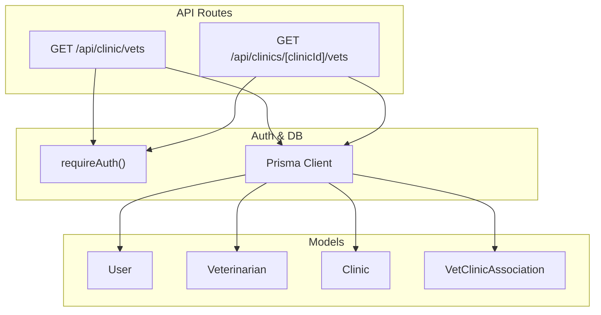
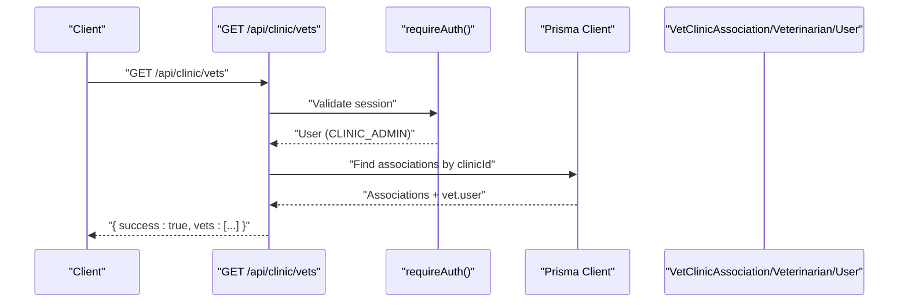
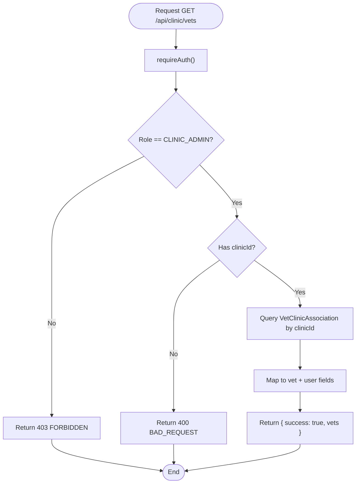
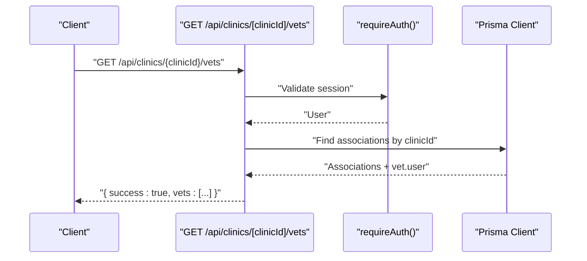
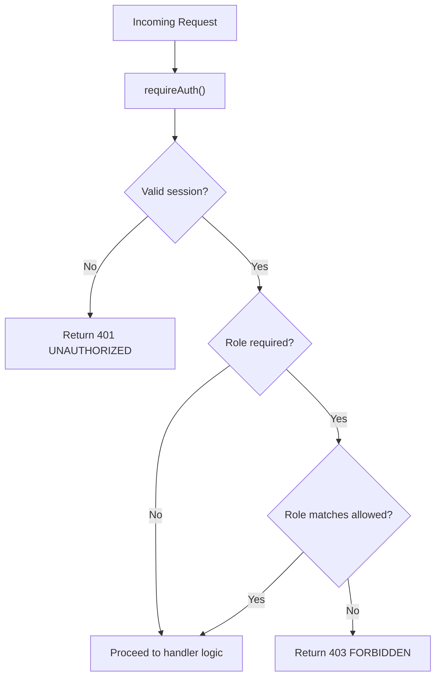
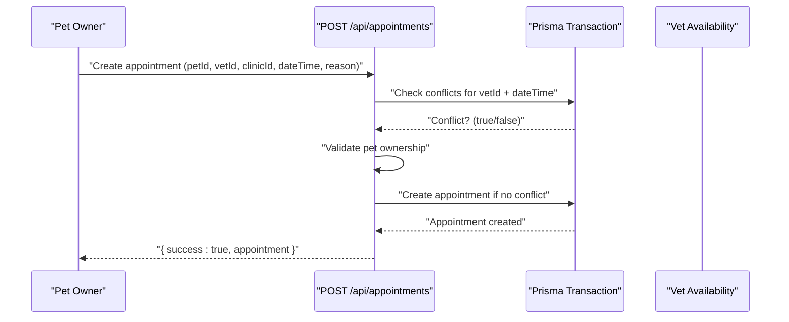
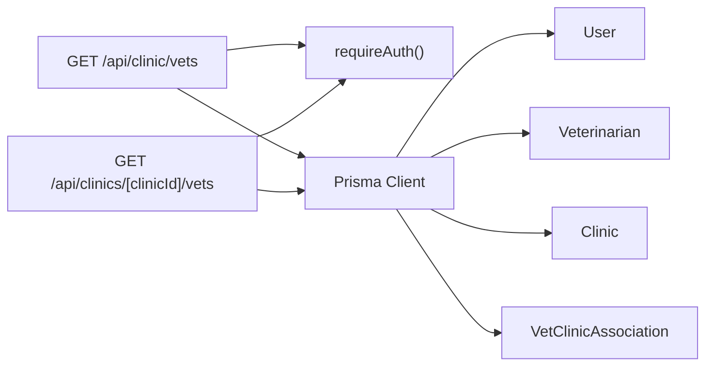

# Clinic-Level Vet Management

<cite>
**Referenced Files in This Document**
- [route.ts](file://app/api/clinic/vets/route.ts)
- [route.ts](file://app/api/clinics/[clinicId]/vets/route.ts)
- [schema.prisma](file://prisma/schema.prisma)
- [auth.ts](file://lib/auth.ts)
- [route.ts](file://app/api/appointments/route.ts)
- [api-specification.md](file://docs/03-architecture/03-api-specification.md)
- [migration.sql](file://prisma/migrations/20260827123510_add_clinic_admin_relation/migration.sql)
</cite>

## Table of Contents
1. [Introduction](#introduction)
2. [Project Structure](#project-structure)
3. [Core Components](#core-components)
4. [Architecture Overview](#architecture-overview)
5. [Detailed Component Analysis](#detailed-component-analysis)
6. [Dependency Analysis](#dependency-analysis)
7. [Performance Considerations](#performance-considerations)
8. [Troubleshooting Guide](#troubleshooting-guide)
9. [Conclusion](#conclusion)
10. [Appendices](#appendices)

## Introduction
This document provides comprehensive API documentation for clinic-level veterinarian management endpoints under /api/clinic/vets and related clinic-scoped vet listing. It covers:
- Listing clinic staff (veterinarians associated with a clinic)
- Role-based access control for clinic administrators
- Integration points with scheduling and appointments
- Request/response schemas and error handling patterns
- Examples for staff roster management, shift assignments, and vet performance tracking (as currently implemented or planned)

The goal is to help developers integrate vet management workflows within the clinic context while maintaining security and data consistency.

## Project Structure
Clinic-level vet management is implemented via Next.js Route Handlers:
- GET /api/clinic/vets: Lists veterinarians associated with the authenticated clinic administrator’s clinic.
- GET /api/clinics/[clinicId]/vets: Lists all veterinarians associated with a specified clinic (requires authentication).

Data models are defined in Prisma schema, including User, Veterinarian, Clinic, and VetClinicAssociation. Authentication and authorization are handled centrally in lib/auth.ts.



**Diagram sources**
- [route.ts:5-65](file://app/api/clinic/vets/route.ts#L5-L65)
- [route.ts:6-56](file://app/api/clinics/[clinicId]/vets/route.ts#L6-L56)
- [schema.prisma:30-131](file://prisma/schema.prisma#L30-L131)
- [auth.ts:109-125](file://lib/auth.ts#L109-L125)

**Section sources**
- [route.ts:5-65](file://app/api/clinic/vets/route.ts#L5-L65)
- [route.ts:6-56](file://app/api/clinics/[clinicId]/vets/route.ts#L6-L56)
- [schema.prisma:30-131](file://prisma/schema.prisma#L30-L131)
- [auth.ts:109-125](file://lib/auth.ts#L109-L125)

## Core Components
- Authentication and Authorization:
  - requireAuth(): Ensures a valid session exists; throws UNAUTHENTICATED if not.
  - Role checks: Clinic admin operations enforce role boundaries (e.g., CLINIC_ADMIN).
- Data Access:
  - VetClinicAssociation links Veterinarians to Clinics with an association status (PENDING, ACTIVE, INACTIVE).
  - Queries include user details for veterinarians (name, email).
- Error Handling:
  - Standardized JSON envelope with success flag and error object containing code and message.
  - Handles UNAUTHORIZED (401), FORBIDDEN (403), BAD_REQUEST (400), NOT_FOUND (404), CONFLICT (409), INTERNAL_SERVER_ERROR (500).

**Section sources**
- [auth.ts:109-125](file://lib/auth.ts#L109-L125)
- [schema.prisma:16-20](file://prisma/schema.prisma#L16-L20)
- [schema.prisma:90-131](file://prisma/schema.prisma#L90-L131)
- [route.ts:5-65](file://app/api/clinic/vets/route.ts#L5-L65)
- [route.ts:6-56](file://app/api/clinics/[clinicId]/vets/route.ts#L6-L56)

## Architecture Overview
The clinic-level vet management flow involves:
- Client requests to list vets at a clinic.
- Server validates authentication and roles.
- Server queries VetClinicAssociation to retrieve associated veterinarians and their user profiles.
- Server returns structured vet list or appropriate errors.



**Diagram sources**
- [route.ts:5-65](file://app/api/clinic/vets/route.ts#L5-L65)
- [auth.ts:109-125](file://lib/auth.ts#L109-L125)
- [schema.prisma:90-131](file://prisma/schema.prisma#L90-L131)

## Detailed Component Analysis

### Endpoint: List Vets for Admin’s Clinic
- Method & Route: GET /api/clinic/vets
- Authentication: Required (session cookie)
- Authorization: CLINIC_ADMIN only
- Behavior:
  - Validates user role and ensures the admin has an associated clinicId.
  - Retrieves VetClinicAssociation records for that clinic.
  - Includes veterinarian details and linked user profile fields (firstName, lastName, email).
  - Returns vet list with association status.
- Success Response Schema:
  - { success: true, vets: [{ id, specialization, licenseNumber, isVerified, firstName, lastName, email, status }] }
- Error Responses:
  - 401 UNAUTHORIZED: Not logged in
  - 403 FORBIDDEN: Not a clinic admin
  - 400 BAD_REQUEST: No clinic associated with this administrator
  - 500 INTERNAL_SERVER_ERROR: Unexpected server error



**Diagram sources**
- [route.ts:5-65](file://app/api/clinic/vets/route.ts#L5-L65)
- [auth.ts:109-125](file://lib/auth.ts#L109-L125)
- [schema.prisma:90-131](file://prisma/schema.prisma#L90-L131)

**Section sources**
- [route.ts:5-65](file://app/api/clinic/vets/route.ts#L5-L65)

### Endpoint: List Vets for a Specific Clinic
- Method & Route: GET /api/clinics/[clinicId]/vets
- Authentication: Required
- Authorization: Any authenticated user (no explicit role check in route)
- Behavior:
  - Retrieves VetClinicAssociation records for the provided clinicId.
  - Includes veterinarian details and linked user profile fields.
  - Returns vet list with association status.
- Success Response Schema:
  - { success: true, vets: [{ id, specialization, licenseNumber, isVerified, firstName, lastName, email, status }] }
- Error Responses:
  - 401 UNAUTHORIZED: Not logged in
  - 500 INTERNAL_SERVER_ERROR: Unexpected server error



**Diagram sources**
- [route.ts:6-56](file://app/api/clinics/[clinicId]/vets/route.ts#L6-L56)
- [auth.ts:109-125](file://lib/auth.ts#L109-L125)
- [schema.prisma:90-131](file://prisma/schema.prisma#L90-L131)

**Section sources**
- [route.ts:6-56](file://app/api/clinics/[clinicId]/vets/route.ts#L6-L56)

### Data Model Relationships
```mermaid
erDiagram
USER {
string id PK
string email UK
string role
string firstName
string lastName
string phone
string clinicId FK
}
VETERINARIAN {
string id PK
string userId UK FK
string specialization
string licenseNumber UK
boolean isVerified
datetime verifiedAt
string verifiedById FK
}
CLINIC {
string id PK
string name
string address
string phone
boolean isVerified
}
VET_CLINIC_ASSOCIATION {
string id PK
string vetId FK
string clinicId FK
enum status
datetime createdAt
}
USER ||--o{ VETERINARIAN : "has profile"
USER ||--o{ CLINIC : "admin (clinicId)"
VETERINARIAN ||--o{ VET_CLINIC_ASSOCIATION : "associated with clinics"
CLINIC ||--o{ VET_CLINIC_ASSOCIATION : "has many associations"
```

**Diagram sources**
- [schema.prisma:30-131](file://prisma/schema.prisma#L30-L131)

**Section sources**
- [schema.prisma:30-131](file://prisma/schema.prisma#L30-L131)

### Role-Based Access Control
- requireAuth(): Enforces session validation and returns the current user or throws UNAUTHENTICATED.
- Role enforcement:
  - Clinic admin-only endpoints check user.role === 'CLINIC_ADMIN'.
  - Other endpoints may rely on general authentication without role checks.
- Session management:
  - Secure HttpOnly cookies with expiration and sliding window extension.



**Diagram sources**
- [auth.ts:109-125](file://lib/auth.ts#L109-L125)
- [route.ts:5-65](file://app/api/clinic/vets/route.ts#L5-L65)

**Section sources**
- [auth.ts:109-125](file://lib/auth.ts#L109-L125)
- [route.ts:5-65](file://app/api/clinic/vets/route.ts#L5-L65)

### Integration with Scheduling Systems
- Appointment creation enforces double-booking prevention using transactions and checks against existing REQUESTED/CONFIRMED appointments for the same vet and dateTime.
- AI assistant tools support availability checking and booking flows:
  - check_slots: Returns busy slots for a vet on a given date.
  - create_booking: Creates appointments with working hours constraints and conflict checks.



**Diagram sources**
- [route.ts:70-143](file://app/api/appointments/route.ts#L70-L143)
- [schema.prisma:164-182](file://prisma/schema.prisma#L164-L182)

**Section sources**
- [route.ts:70-143](file://app/api/appointments/route.ts#L70-L143)
- [schema.prisma:164-182](file://prisma/schema.prisma#L164-L182)

### Staff Roster Management Example
- Use GET /api/clinic/vets to fetch the current roster of veterinarians associated with the clinic.
- Filter results by association status (PENDING, ACTIVE, INACTIVE) to manage active staff visibility.
- Combine with appointment data to identify which vets are scheduled during specific time windows.

**Section sources**
- [route.ts:5-65](file://app/api/clinic/vets/route.ts#L5-L65)
- [route.ts:7-67](file://app/api/appointments/route.ts#L7-L67)

### Shift Assignments Example
- While dedicated shift endpoints are not present, you can model shifts conceptually using:
  - Association status changes to mark availability (e.g., ACTIVE vs INACTIVE).
  - Appointment slots to infer assigned shifts per day.
- For advanced shift management, consider adding a Shift model and endpoints to assign vets to time-bound shifts.

[No sources needed since this section proposes conceptual extensions]

### Vet Performance Tracking Example
- Current implementation does not include explicit performance metrics endpoints.
- Potential integration points:
  - Count completed appointments per vet over time.
  - Track medical record revisions authored by vets.
  - Use audit logs to track vet actions on records.

**Section sources**
- [schema.prisma:164-182](file://prisma/schema.prisma#L164-L182)
- [schema.prisma:148-162](file://prisma/schema.prisma#L148-L162)
- [schema.prisma:298-311](file://prisma/schema.prisma#L298-L311)

## Dependency Analysis
- API routes depend on:
  - Authentication module (requireAuth)
  - Prisma client for database operations
  - Prisma models for data integrity and relationships
- Clinic admin relation:
  - Users can be linked to clinics via clinicId to enable admin-specific behaviors.



**Diagram sources**
- [route.ts:5-65](file://app/api/clinic/vets/route.ts#L5-L65)
- [route.ts:6-56](file://app/api/clinics/[clinicId]/vets/route.ts#L6-L56)
- [auth.ts:109-125](file://lib/auth.ts#L109-L125)
- [schema.prisma:30-131](file://prisma/schema.prisma#L30-L131)

**Section sources**
- [route.ts:5-65](file://app/api/clinic/vets/route.ts#L5-L65)
- [route.ts:6-56](file://app/api/clinics/[clinicId]/vets/route.ts#L6-L56)
- [auth.ts:109-125](file://lib/auth.ts#L109-L125)
- [schema.prisma:30-131](file://prisma/schema.prisma#L30-L131)

## Performance Considerations
- Use indexes on frequently queried fields:
  - VetClinicAssociation.clinicId and .vetId
  - Appointment.vetId and Appointment.dateTime
- Minimize N+1 queries by including necessary relations in a single query.
- Cache vet lists for short periods if accessed frequently by clinic dashboards.
- Ensure transactional safety when creating appointments to prevent double bookings.

[No sources needed since this section provides general guidance]

## Troubleshooting Guide
Common issues and resolutions:
- 401 UNAUTHORIZED:
  - Ensure a valid session cookie is present and not expired.
  - Verify session creation and cookie settings.
- 403 FORBIDDEN:
  - Confirm the user has CLINIC_ADMIN role for admin-only endpoints.
- 400 BAD_REQUEST:
  - Ensure the clinic admin has an associated clinicId.
- 404 NOT_FOUND:
  - Verify clinicId exists when fetching clinic details.
- 409 CONFLICT:
  - Avoid double booking by checking existing appointments before creating new ones.
- 500 INTERNAL_SERVER_ERROR:
  - Inspect server logs for unexpected exceptions.

**Section sources**
- [route.ts:5-65](file://app/api/clinic/vets/route.ts#L5-L65)
- [route.ts:6-56](file://app/api/clinics/[clinicId]/vets/route.ts#L6-L56)
- [route.ts:70-143](file://app/api/appointments/route.ts#L70-L143)

## Conclusion
The clinic-level vet management endpoints provide essential functionality for listing veterinarians associated with a clinic, enforcing role-based access, and integrating with appointment scheduling. While dedicated shift assignment and performance tracking endpoints are not yet implemented, the existing data models and scheduling integrations offer a solid foundation for future enhancements.

[No sources needed since this section summarizes without analyzing specific files]

## Appendices

### API Specification References
- Global specifications, authentication, and standard error envelopes are defined in the project’s API specification.

**Section sources**
- [api-specification.md:7-23](file://docs/03-architecture/03-api-specification.md#L7-L23)

### Database Migration Notes
- Added clinic admin relation to User model to support clinic-scoped admin behavior.

**Section sources**
- [migration.sql:1-6](file://prisma/migrations/20260827123510_add_clinic_admin_relation/migration.sql#L1-L6)