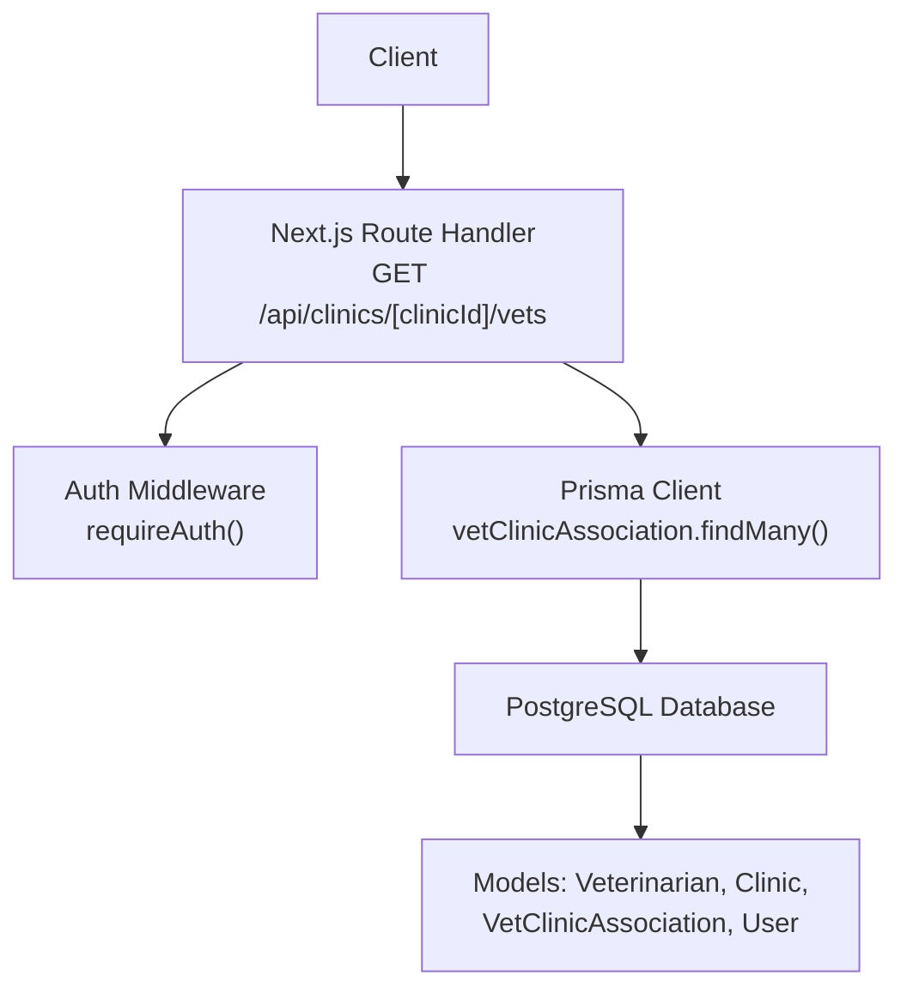
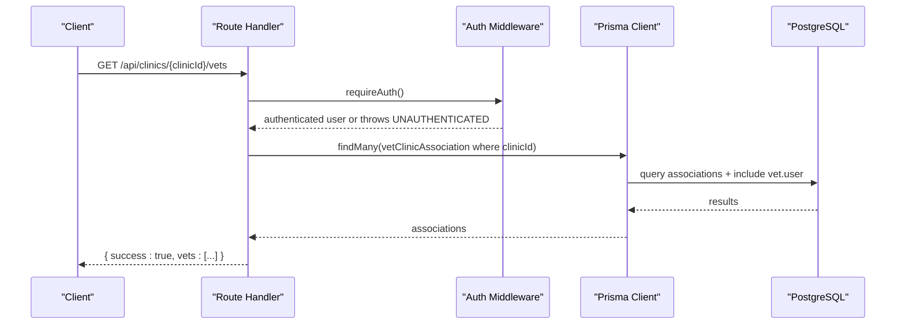
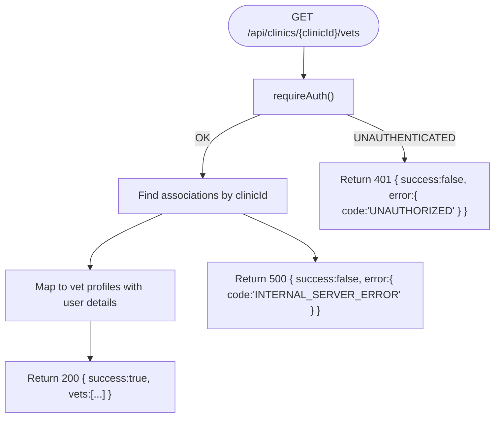
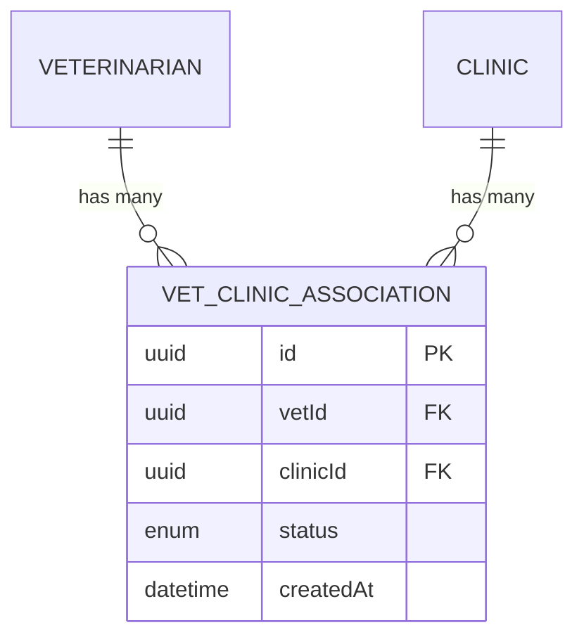
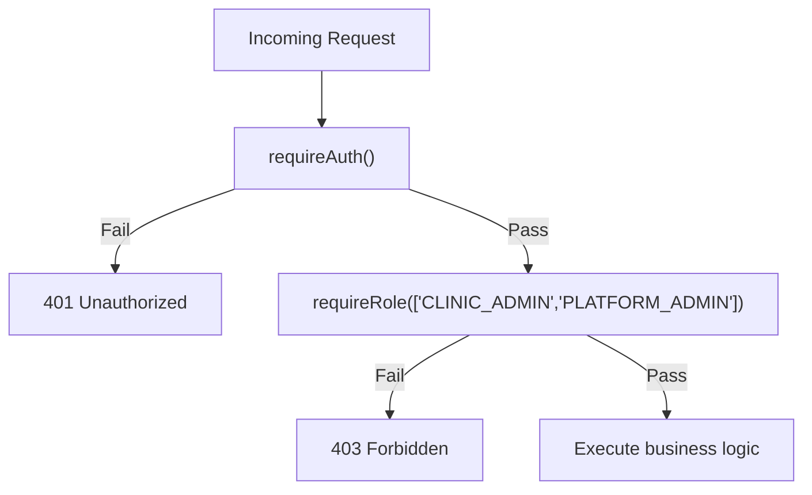
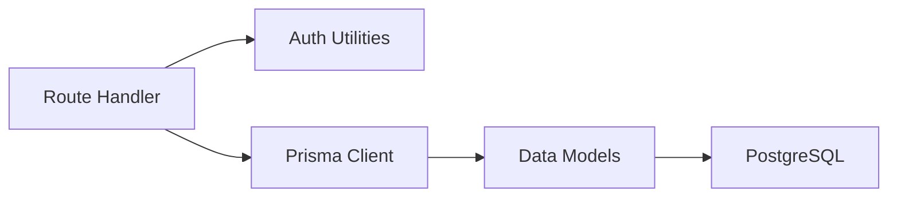

# Vet-Clinic Associations Management

<cite>
**Referenced Files in This Document**
- [route.ts](file://app/api/clinics/[clinicId]/vets/route.ts)
- [schema.prisma](file://prisma/schema.prisma)
- [auth.ts](file://lib/auth.ts)
- [api-specification.md](file://docs/03-architecture/03-api-specification.md)
- [migration.sql](file://prisma/migrations/20260827123510_add_clinic_admin_relation/migration.sql)
</cite>

## Table of Contents
1. [Introduction](#introduction)
2. [Project Structure](#project-structure)
3. [Core Components](#core-components)
4. [Architecture Overview](#architecture-overview)
5. [Detailed Component Analysis](#detailed-component-analysis)
6. [Dependency Analysis](#dependency-analysis)
7. [Performance Considerations](#performance-considerations)
8. [Troubleshooting Guide](#troubleshooting-guide)
9. [Conclusion](#conclusion)

## Introduction
This document provides comprehensive API documentation for managing vet-clinic associations under the endpoint group /api/clinics/[clinicId]/vets. It covers listing veterinarians associated with a clinic, and outlines the intended methods for adding and removing veterinarians from clinics as specified by the project’s API specification. It also documents request/response schemas, role-based permissions (requiring clinic administrator access), error handling, and the data model relationships that underpin these operations.

## Project Structure
The vet-clinic association endpoints are implemented using Next.js Route Handlers. The primary route file for this feature is located at app/api/clinics/[clinicId]/vets/route.ts. Data models and constraints are defined in Prisma schema, and authentication/authorization logic is centralized in lib/auth.ts. The API specification in docs defines the intended POST method to associate a vet with a clinic.

**Diagram sources**
- [route.ts:1-56](file://app/api/clinics/[clinicId]/vets/route.ts#L1-L56)
- [schema.prisma:90-131](file://prisma/schema.prisma#L90-L131)
- [auth.ts:109-124](file://lib/auth.ts#L109-L124)

**Section sources**
- [route.ts:1-56](file://app/api/clinics/[clinicId]/vets/route.ts#L1-L56)
- [schema.prisma:90-131](file://prisma/schema.prisma#L90-L131)
- [auth.ts:109-124](file://lib/auth.ts#L109-L124)

## Core Components
- Route handler for listing vets associated with a clinic: GET /api/clinics/[clinicId]/vets
- Authentication and authorization via requireAuth() and role checks
- Data model VetClinicAssociation linking Veterinarian and Clinic with status tracking
- API specification defining POST /api/clinics/[clinicId]/vets for associating a vet with a clinic

Key responsibilities:
- Validate user session and enforce role-based access
- Query associations for a given clinic and return vet profiles with minimal user details
- Enforce unique constraint on vet-clinic pairs to prevent duplicate assignments
- Provide consistent success/error response envelopes

**Section sources**
- [route.ts:1-56](file://app/api/clinics/[clinicId]/vets/route.ts#L1-L56)
- [schema.prisma:90-131](file://prisma/schema.prisma#L90-L131)
- [api-specification.md:179-189](file://docs/03-architecture/03-api-specification.md#L179-L189)

## Architecture Overview
The system follows a layered approach:
- Presentation layer: Next.js route handlers expose RESTful endpoints
- Authorization layer: Centralized auth utilities validate sessions and roles
- Domain layer: Business rules around vet-clinic associations enforced via Prisma queries and database constraints
- Persistence layer: PostgreSQL database storing entities and relationships

**Diagram sources**
- [route.ts:6-42](file://app/api/clinics/[clinicId]/vets/route.ts#L6-L42)
- [auth.ts:109-115](file://lib/auth.ts#L109-L115)
- [schema.prisma:121-131](file://prisma/schema.prisma#L121-L131)

## Detailed Component Analysis

### Endpoint: List Vets for a Clinic
- Method: GET
- Path: /api/clinics/[clinicId]/vets
- Authentication: Required
- Authorization: The current implementation calls requireAuth(). The broader API spec indicates CLINIC_ADMIN or platform admin should be required for management actions; ensure role enforcement aligns with policy.
- Request parameters:
  - clinicId: URL path parameter identifying the target clinic
- Response body (success):
  - success: boolean
  - vets: array of vet profile objects including:
    - id: veterinarian ID
    - specialization: string
    - licenseNumber: string
    - isVerified: boolean
    - firstName: string
    - lastName: string
    - email: string
    - status: association status (PENDING | ACTIVE | INACTIVE)
- Error responses:
  - 401 Unauthorized: when not logged in
  - 500 Internal Server Error: for unexpected server errors

**Diagram sources**
- [route.ts:6-55](file://app/api/clinics/[clinicId]/vets/route.ts#L6-L55)

**Section sources**
- [route.ts:6-55](file://app/api/clinics/[clinicId]/vets/route.ts#L6-L55)

### Endpoint: Associate Vet with Clinic (Planned)
- Method: POST
- Path: /api/clinics/[clinicId]/vets
- Authentication: Required
- Authorization: CLINIC_ADMIN or platform admin (per API specification)
- Request body:
  - vetId: string (UUID)
- Behavior:
  - Create a new VetClinicAssociation record with default status PENDING
  - Enforce uniqueness of vetId+clinicId to avoid duplicates
- Success response:
  - success: boolean
  - association: object containing vetId, clinicId, status, createdAt
- Error responses:
  - 401 Unauthorized: if not authenticated
  - 403 Forbidden: if insufficient role
  - 409 Conflict: if association already exists
  - 404 Not Found: if vetId or clinicId does not exist
  - 500 Internal Server Error: for unexpected server errors

Note: The POST handler is not yet implemented in the route file; it should be added to match the documented specification.

**Section sources**
- [api-specification.md:179-189](file://docs/03-architecture/03-api-specification.md#L179-L189)
- [schema.prisma:121-131](file://prisma/schema.prisma#L121-L131)

### Endpoint: Remove Vet from Clinic (Planned)
- Method: DELETE
- Path: /api/clinics/[clinicId]/vets
- Authentication: Required
- Authorization: CLINIC_ADMIN or platform admin
- Request body:
  - vetId: string (UUID)
- Behavior:
  - Delete the VetClinicAssociation record for the given clinic and vet
  - Ensure referential integrity and handle cascades appropriately
- Success response:
  - success: boolean
  - message: confirmation string
- Error responses:
  - 401 Unauthorized: if not authenticated
  - 403 Forbidden: if insufficient role
  - 404 Not Found: if no association exists
  - 500 Internal Server Error: for unexpected server errors

Note: The DELETE handler is not yet implemented in the route file; it should be added to support removal workflows.

**Section sources**
- [schema.prisma:121-131](file://prisma/schema.prisma#L121-L131)

### Data Model: VetClinicAssociation
The VetClinicAssociation model links Veterinarian and Clinic entities and tracks the relationship status.

- Fields:
  - id: primary key (UUID)
  - vetId: foreign key to Veterinarian
  - clinicId: foreign key to Clinic
  - status: AssociationStatus enum (PENDING | ACTIVE | INACTIVE)
  - createdAt: timestamp
- Constraints:
  - Unique composite index on (vetId, clinicId) to prevent duplicate associations
- Relationships:
  - Many-to-one to Veterinarian
  - Many-to-one to Clinic

**Diagram sources**
- [schema.prisma:90-131](file://prisma/schema.prisma#L90-L131)

**Section sources**
- [schema.prisma:90-131](file://prisma/schema.prisma#L90-L131)

### Role-Based Permissions
- Current GET implementation enforces authentication via requireAuth()
- For management operations (POST/DELETE), enforce CLINIC_ADMIN or platform admin per API specification
- Use requireRole(['CLINIC_ADMIN', 'PLATFORM_ADMIN']) to restrict access
- Ensure user.clinicId is set for clinic-scoped administrators when needed

**Diagram sources**
- [auth.ts:109-124](file://lib/auth.ts#L109-L124)
- [api-specification.md:179-189](file://docs/03-architecture/03-api-specification.md#L179-L189)

**Section sources**
- [auth.ts:109-124](file://lib/auth.ts#L109-L124)
- [api-specification.md:179-189](file://docs/03-architecture/03-api-specification.md#L179-L189)

## Dependency Analysis
- Route handler depends on:
  - NextRequest/NextResponse for HTTP handling
  - Prisma client for data access
  - Auth utilities for session validation and role checks
- Data model dependencies:
  - Veterinarian and Clinic entities linked through VetClinicAssociation
  - User entity included in vet profiles for display purposes
- External dependencies:
  - PostgreSQL database
  - Session storage via cookies and database-backed sessions

**Diagram sources**
- [route.ts:1-56](file://app/api/clinics/[clinicId]/vets/route.ts#L1-L56)
- [schema.prisma:90-131](file://prisma/schema.prisma#L90-L131)
- [auth.ts:109-124](file://lib/auth.ts#L109-L124)

**Section sources**
- [route.ts:1-56](file://app/api/clinics/[clinicId]/vets/route.ts#L1-L56)
- [schema.prisma:90-131](file://prisma/schema.prisma#L90-L131)
- [auth.ts:109-124](file://lib/auth.ts#L109-L124)

## Performance Considerations
- Minimize N+1 queries by using Prisma includes to fetch vet and user details in a single query
- Leverage indexes on foreign keys and composite unique constraints to optimize lookups and prevent duplicates
- Paginate large lists of vets if necessary to reduce payload size and improve responsiveness
- Cache frequently accessed clinic-vet mappings at the application layer if read-heavy

[No sources needed since this section provides general guidance]

## Troubleshooting Guide
Common issues and resolutions:
- 401 Unauthorized:
  - Cause: Missing or invalid session cookie
  - Resolution: Ensure login flow sets session cookie correctly and routes call requireAuth()
- 403 Forbidden:
  - Cause: Insufficient role for management operations
  - Resolution: Enforce requireRole(['CLINIC_ADMIN','PLATFORM_ADMIN']) for POST/DELETE
- 409 Conflict:
  - Cause: Duplicate vet-clinic association
  - Resolution: Check existence before creating or handle Prisma unique constraint errors
- 404 Not Found:
  - Cause: Invalid vetId or clinicId
  - Resolution: Validate IDs exist prior to mutation
- 500 Internal Server Error:
  - Cause: Unexpected server-side exceptions
  - Resolution: Log stack traces and sanitize error messages returned to clients

Error response envelope pattern:
- success: boolean
- error: object with code and message fields

**Section sources**
- [route.ts:43-55](file://app/api/clinics/[clinicId]/vets/route.ts#L43-L55)
- [auth.ts:109-124](file://lib/auth.ts#L109-L124)

## Conclusion
The vet-clinic association management endpoints provide a foundation for listing and managing veterinarians within clinics. The GET endpoint is implemented and returns vet profiles with associated user details. The POST and DELETE endpoints are specified but not yet implemented; they should be added to complete the CRUD surface area. Role-based access control must be enforced to ensure only authorized clinic administrators can manage associations. The VetClinicAssociation model ensures data integrity through unique constraints and status tracking, enabling robust staff roster management and assignment conflict prevention.

[No sources needed since this section summarizes without analyzing specific files]