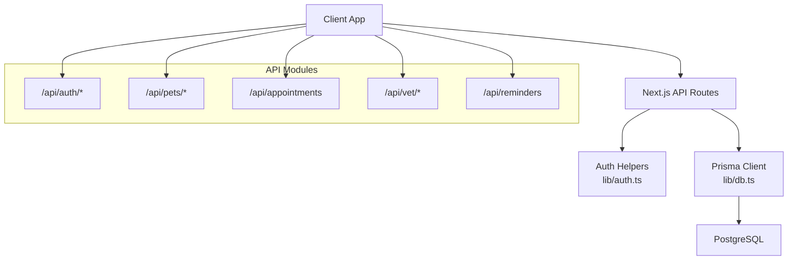
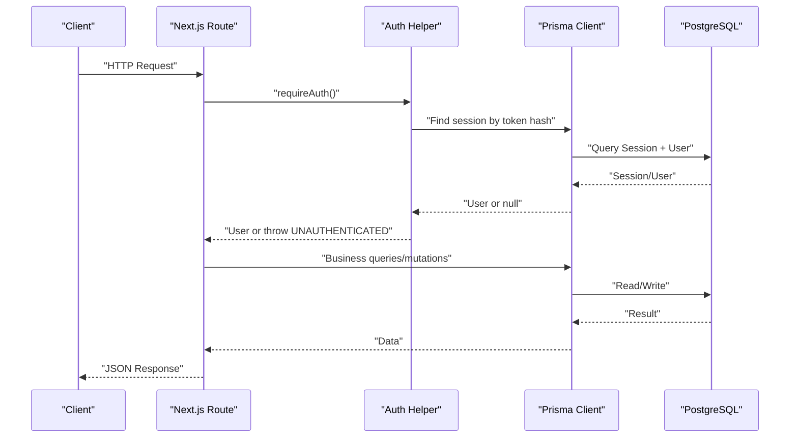
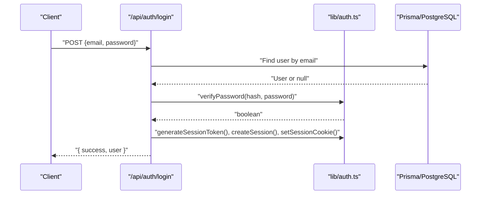
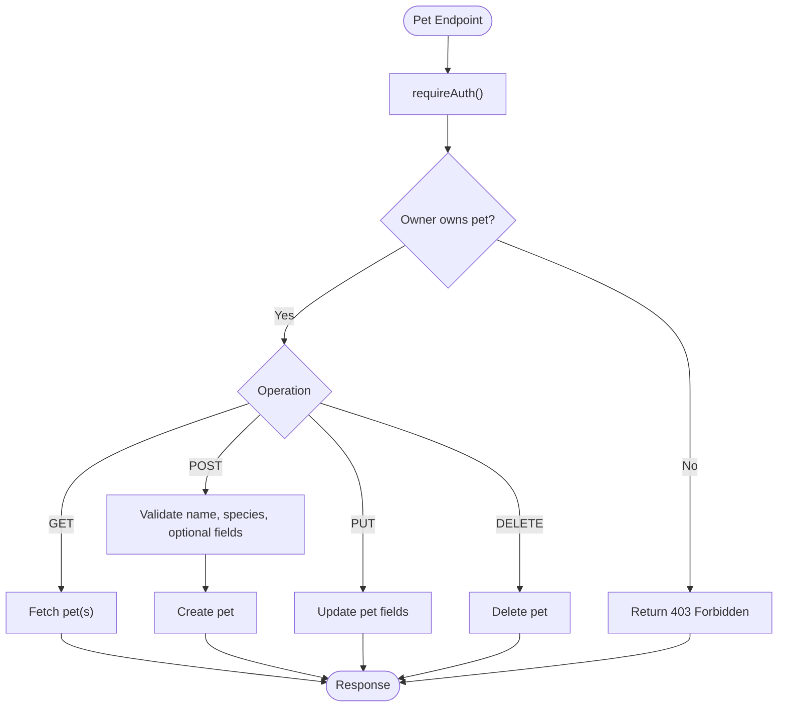
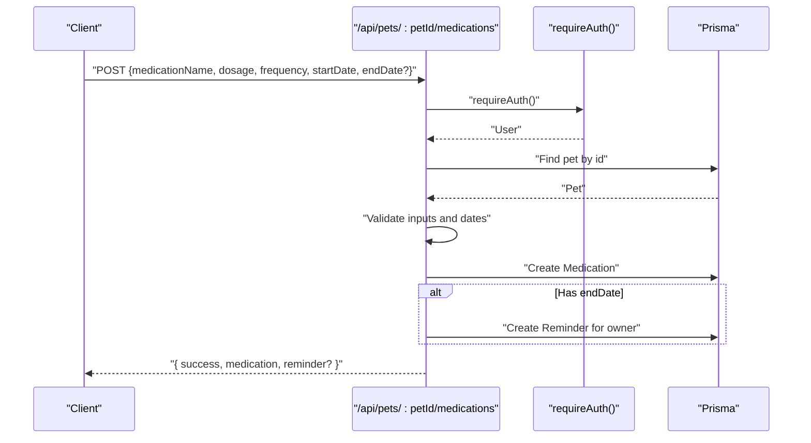
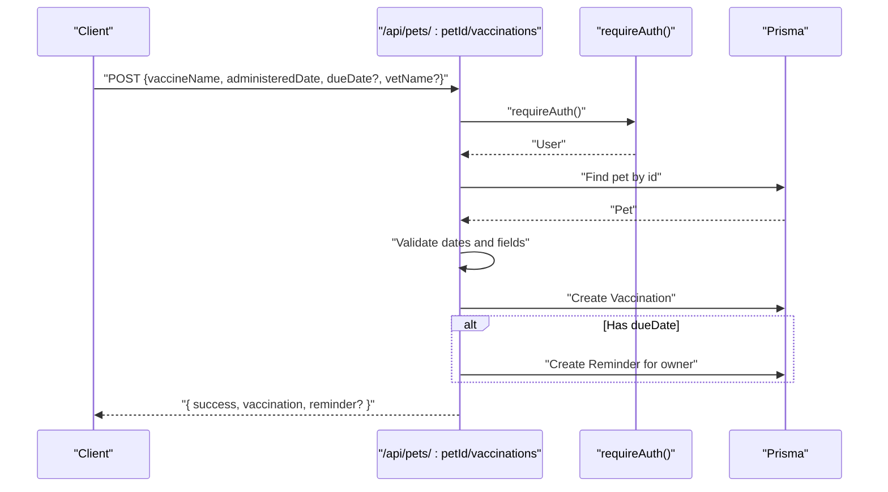
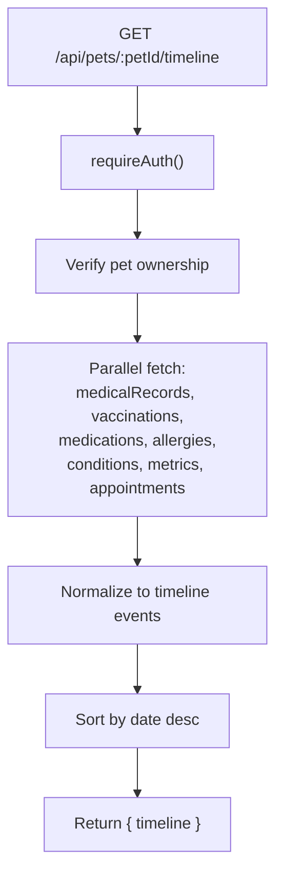
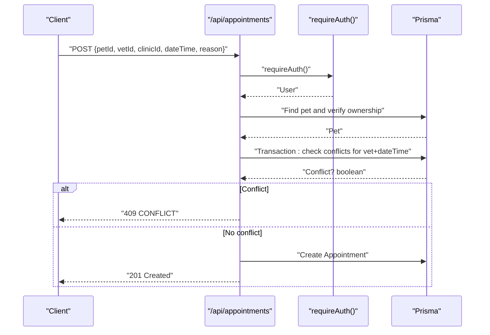
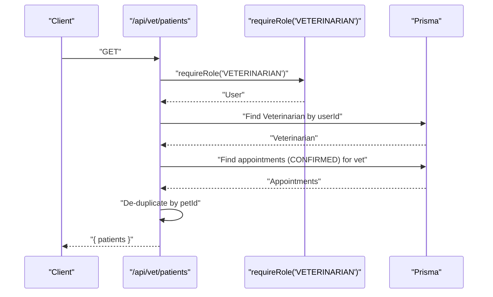
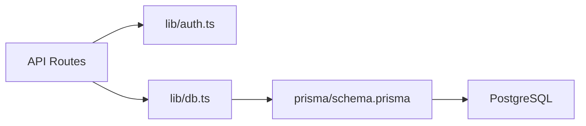

# Health Tracking API

<cite>
**Referenced Files in This Document**
- [README.md](file://README.md)
- [package.json](file://package.json)
- [schema.prisma](file://prisma/schema.prisma)
- [db.ts](file://lib/db.ts)
- [auth.ts](file://lib/auth.ts)
- [pets route.ts](file://app/api/pets/route.ts)
- [pet detail route.ts](file://app/api/pets/[petId]/route.ts)
- [medications route.ts](file://app/api/pets/[petId]/medications/route.ts)
- [vaccinations route.ts](file://app/api/pets/[petId]/vaccinations/route.ts)
- [timeline route.ts](file://app/api/pets/[petId]/timeline/route.ts)
- [appointments route.ts](file://app/api/appointments/route.ts)
- [reminders route.ts](file://app/api/reminders/route.ts)
- [vet patients route.ts](file://app/api/vet/patients/route.ts)
- [login route.ts](file://app/api/auth/login/route.ts)
- [register route.ts](file://app/api/auth/register/route.ts)
</cite>

## Table of Contents
1. [Introduction](#introduction)
2. [Project Structure](#project-structure)
3. [Core Components](#core-components)
4. [Architecture Overview](#architecture-overview)
5. [Detailed Component Analysis](#detailed-component-analysis)
6. [Dependency Analysis](#dependency-analysis)
7. [Performance Considerations](#performance-considerations)
8. [Troubleshooting Guide](#troubleshooting-guide)
9. [Conclusion](#conclusion)

## Introduction
This document describes the Health Tracking API for a Next.js pet healthcare application. It covers authentication, pet profiles, preventive care (vaccinations and medications), health metrics, appointment scheduling, reminders, and a unified timeline view that aggregates all health events for a pet. The API is built on Next.js App Router with Prisma and PostgreSQL, enforcing role-based access and ownership checks server-side.

## Project Structure
The project follows a feature-based API layout under app/api, with shared utilities in lib and data modeling via Prisma schema. Key areas:
- Authentication endpoints under app/api/auth
- Pet-centric health tracking under app/api/pets
- Appointment management under app/api/appointments
- Vet-facing patient list under app/api/vet
- Reminders under app/api/reminders
- Shared database client in lib/db.ts and auth helpers in lib/auth.ts
- Data model defined in prisma/schema.prisma

**Diagram sources**
- [db.ts:1-33](file://lib/db.ts#L1-L33)
- [auth.ts:100-125](file://lib/auth.ts#L100-L125)
- [pets route.ts:1-69](file://app/api/pets/route.ts#L1-L69)
- [appointments route.ts:1-158](file://app/api/appointments/route.ts#L1-L158)
- [reminders route.ts:1-30](file://app/api/reminders/route.ts#L1-L30)
- [vet patients route.ts:1-71](file://app/api/vet/patients/route.ts#L1-L71)

**Section sources**
- [README.md:1-37](file://README.md#L1-L37)
- [package.json:1-36](file://package.json#L1-L36)

## Core Components
- Authentication and sessions:
  - Password hashing and verification using Argon2
  - Database-backed session store with expiration and sliding window renewal
  - Cookie-based session transport with secure flags in production
- Pet health tracking:
  - CRUD for pet profiles with ownership enforcement
  - Medication courses with validation and reminder creation
  - Vaccination records with due-date reminders
  - Unified timeline aggregating medical records, vaccinations, medications, allergies, conditions, metrics, and appointments
- Appointments:
  - Role-aware listing for owners, veterinarians, and clinic admins
  - Booking with double-booking prevention via transactional checks
- Vet patient list:
  - Lists pets with confirmed appointments for a vet, de-duplicated
- Reminders:
  - Fetches pending reminders for the authenticated user

**Section sources**
- [auth.ts:1-125](file://lib/auth.ts#L1-L125)
- [pets route.ts:1-69](file://app/api/pets/route.ts#L1-L69)
- [pet detail route.ts:1-141](file://app/api/pets/[petId]/route.ts#L1-L141)
- [medications route.ts:1-158](file://app/api/pets/[petId]/medications/route.ts#L1-L158)
- [vaccinations route.ts:1-156](file://app/api/pets/[petId]/vaccinations/route.ts#L1-L156)
- [timeline route.ts:1-149](file://app/api/pets/[petId]/timeline/route.ts#L1-L149)
- [appointments route.ts:1-158](file://app/api/appointments/route.ts#L1-L158)
- [vet patients route.ts:1-71](file://app/api/vet/patients/route.ts#L1-L71)
- [reminders route.ts:1-30](file://app/api/reminders/route.ts#L1-L30)

## Architecture Overview
The API uses Next.js Serverless functions to handle HTTP requests. Each route validates the request, enforces authentication and authorization, interacts with Prisma to read/write Postgres, and returns structured JSON responses.

**Diagram sources**
- [auth.ts:46-75](file://lib/auth.ts#L46-L75)
- [auth.ts:100-125](file://lib/auth.ts#L100-L125)
- [db.ts:1-33](file://lib/db.ts#L1-L33)

## Detailed Component Analysis

### Authentication Endpoints
- Login:
  - Validates email/password, verifies password hash, creates a session, sets an httpOnly cookie, and returns minimal user info.
- Register:
  - Validates inputs, ensures unique email, hashes password, creates user, creates session, sets cookie, and returns minimal user info.

**Diagram sources**
- [login route.ts:1-58](file://app/api/auth/login/route.ts#L1-L58)
- [auth.ts:11-30](file://lib/auth.ts#L11-L30)
- [auth.ts:33-92](file://lib/auth.ts#L33-L92)

**Section sources**
- [login route.ts:1-58](file://app/api/auth/login/route.ts#L1-L58)
- [register route.ts:1-78](file://app/api/auth/register/route.ts#L1-L78)
- [auth.ts:1-125](file://lib/auth.ts#L1-L125)

### Pet Profiles
- List pets for the authenticated owner
- Create/update/delete pet profile with ownership checks
- Input validation for required fields and date parsing

**Diagram sources**
- [pets route.ts:1-69](file://app/api/pets/route.ts#L1-L69)
- [pet detail route.ts:1-141](file://app/api/pets/[petId]/route.ts#L1-L141)

**Section sources**
- [pets route.ts:1-69](file://app/api/pets/route.ts#L1-L69)
- [pet detail route.ts:1-141](file://app/api/pets/[petId]/route.ts#L1-L141)

### Medications
- List medication records for a pet (owner-only)
- Create medication course with strict validation:
  - Required fields: medicationName, dosage, frequency, startDate
  - Optional endDate must be after startDate
  - Creates a reminder when an end date is provided

**Diagram sources**
- [medications route.ts:1-158](file://app/api/pets/[petId]/medications/route.ts#L1-L158)

**Section sources**
- [medications route.ts:1-158](file://app/api/pets/[petId]/medications/route.ts#L1-L158)

### Vaccinations
- List vaccination records for a pet (owner-only)
- Create vaccination record with validation:
  - Required: vaccineName, administeredDate (must not be in future)
  - Optional dueDate must be after administeredDate
  - Creates a reminder when a due date is provided

**Diagram sources**
- [vaccinations route.ts:1-156](file://app/api/pets/[petId]/vaccinations/route.ts#L1-L156)

**Section sources**
- [vaccinations route.ts:1-156](file://app/api/pets/[petId]/vaccinations/route.ts#L1-L156)

### Timeline Aggregation
- Fetches multiple related entities for a pet in parallel and merges them into a chronological event list sorted newest-first.
- Includes medical records (current version), vaccinations, medications, allergies, conditions, metrics, and appointments.

**Diagram sources**
- [timeline route.ts:1-149](file://app/api/pets/[petId]/timeline/route.ts#L1-L149)

**Section sources**
- [timeline route.ts:1-149](file://app/api/pets/[petId]/timeline/route.ts#L1-L149)

### Appointments
- Role-aware listing:
  - PET_OWNER: their own appointments
  - VETERINARIAN: appointments assigned to them
  - CLINIC_ADMIN: appointments at their clinic
- Booking flow:
  - Validates required fields and future date
  - Enforces pet ownership
  - Prevents double booking within a transaction
  - Creates appointment with status REQUESTED

**Diagram sources**
- [appointments route.ts:1-158](file://app/api/appointments/route.ts#L1-L158)

**Section sources**
- [appointments route.ts:1-158](file://app/api/appointments/route.ts#L1-L158)

### Vet Patients
- Requires VETERINARIAN role
- Retrieves pets with CONFIRMED appointments for the vet and de-duplicates by pet

**Diagram sources**
- [vet patients route.ts:1-71](file://app/api/vet/patients/route.ts#L1-L71)

**Section sources**
- [vet patients route.ts:1-71](file://app/api/vet/patients/route.ts#L1-L71)

### Reminders
- Returns pending reminders for the authenticated user, ordered by due date ascending

**Section sources**
- [reminders route.ts:1-30](file://app/api/reminders/route.ts#L1-L30)

## Dependency Analysis
- API routes depend on:
  - Authentication helpers for session validation and role checks
  - Prisma client for data access
  - PostgreSQL via Prisma adapter
- Data model defines relationships among User, Pet, Veterinarian, Clinic, MedicalRecord, Vaccination, Medication, Allergy, HealthCondition, HealthMetric, Appointment, Reminder, Conversation, Message, and others

**Diagram sources**
- [db.ts:1-33](file://lib/db.ts#L1-L33)
- [auth.ts:100-125](file://lib/auth.ts#L100-L125)
- [schema.prisma:1-350](file://prisma/schema.prisma#L1-L350)

**Section sources**
- [schema.prisma:1-350](file://prisma/schema.prisma#L1-L350)
- [db.ts:1-33](file://lib/db.ts#L1-L33)
- [auth.ts:1-125](file://lib/auth.ts#L1-L125)

## Performance Considerations
- Parallel fetching in timeline endpoint reduces latency by querying multiple tables concurrently.
- Transactional conflict checks prevent race conditions during appointment booking.
- Sliding-window session expiry improves UX while maintaining security.
- Use of indexes in schema (e.g., on foreign keys and timestamps) supports efficient queries.

[No sources needed since this section provides general guidance]

## Troubleshooting Guide
Common error patterns and handling:
- UNAUTHORIZED (401): Returned when no valid session is present or session is expired.
- FORBIDDEN (403): Returned when the user lacks required role or does not own the resource.
- BAD_REQUEST (400): Returned for missing or invalid input (e.g., required fields, invalid dates).
- CONFLICT (409): Returned when attempting to book an already occupied time slot.
- INTERNAL_SERVER_ERROR (500): Generic fallback for unexpected errors.

Recommendations:
- Always validate inputs before database writes.
- Ensure ownership checks are performed server-side for every pet-scoped operation.
- Log and surface consistent error shapes to clients for easier debugging.

**Section sources**
- [pets route.ts:1-69](file://app/api/pets/route.ts#L1-L69)
- [pet detail route.ts:1-141](file://app/api/pets/[petId]/route.ts#L1-L141)
- [medications route.ts:1-158](file://app/api/pets/[petId]/medications/route.ts#L1-L158)
- [vaccinations route.ts:1-156](file://app/api/pets/[petId]/vaccinations/route.ts#L1-L156)
- [timeline route.ts:1-149](file://app/api/pets/[petId]/timeline/route.ts#L1-L149)
- [appointments route.ts:1-158](file://app/api/appointments/route.ts#L1-L158)
- [vet patients route.ts:1-71](file://app/api/vet/patients/route.ts#L1-L71)
- [reminders route.ts:1-30](file://app/api/reminders/route.ts#L1-L30)

## Conclusion
The Health Tracking API provides a robust, secure foundation for managing pet health data, preventive care, and appointments. It emphasizes server-side ownership and role-based access control, consistent error handling, and performance-conscious data retrieval. The modular design allows easy extension for additional health features such as metrics posting and advanced reporting.

[No sources needed since this section summarizes without analyzing specific files]