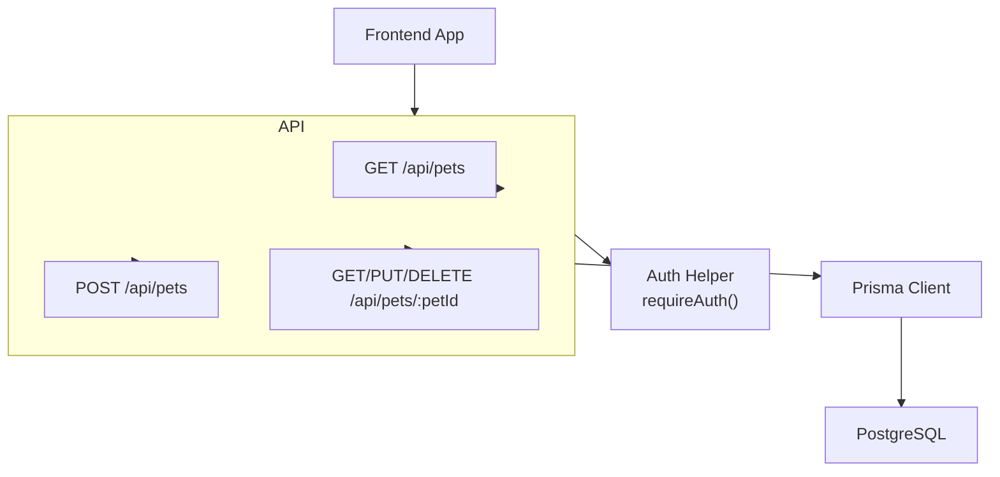
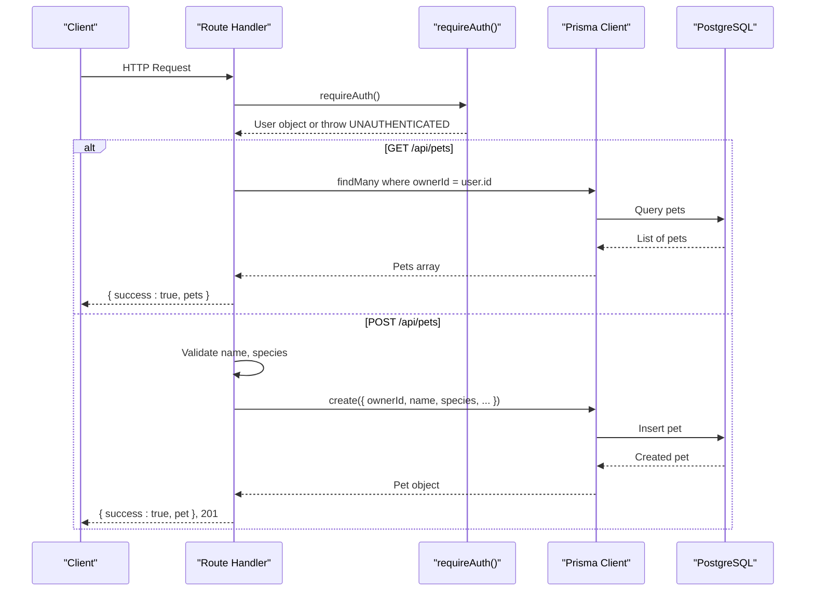
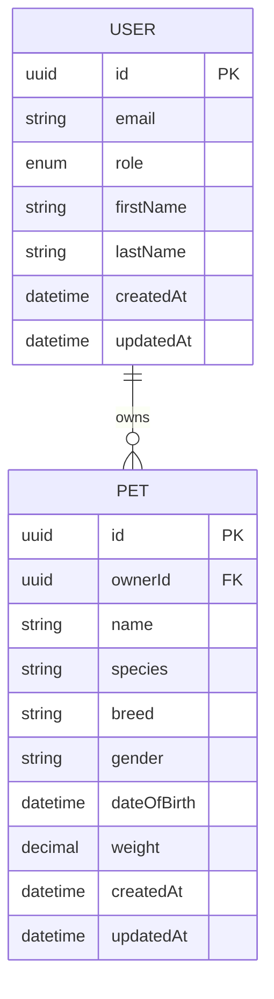
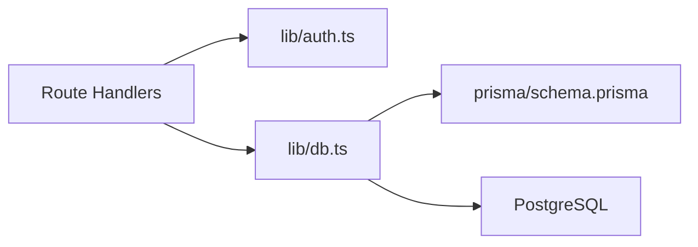

# Pet CRUD Operations

<cite>
**Referenced Files in This Document**
- [route.ts](file://app/api/pets/route.ts)
- [route.ts](file://app/api/pets/[petId]/route.ts)
- [schema.prisma](file://prisma/schema.prisma)
- [auth.ts](file://lib/auth.ts)
- [db.ts](file://lib/db.ts)
- [03-api-specification.md](file://docs/03-architecture/03-api-specification.md)
</cite>

## Table of Contents
1. [Introduction](#introduction)
2. [Project Structure](#project-structure)
3. [Core Components](#core-components)
4. [Architecture Overview](#architecture-overview)
5. [Detailed Component Analysis](#detailed-component-analysis)
6. [Dependency Analysis](#dependency-analysis)
7. [Performance Considerations](#performance-considerations)
8. [Troubleshooting Guide](#troubleshooting-guide)
9. [Conclusion](#conclusion)
10. [Appendices](#appendices)

## Introduction
This document provides detailed API documentation for pet CRUD operations, focusing on:
- GET /api/pets: Retrieve all pets belonging to the authenticated user
- POST /api/pets: Create a new pet profile

It covers authentication requirements, request/response schemas, validation rules, error handling, security considerations, and integration patterns with frontend components. It also clarifies the relationship between pets and users as modeled in the database schema.

## Project Structure
The pet endpoints are implemented as Next.js Route Handlers under app/api/pets. The data model is defined in Prisma schema, and authentication is enforced via a shared auth helper that validates session cookies.

**Diagram sources**
- [route.ts:6-28](file://app/api/pets/route.ts#L6-L28)
- [route.ts:31-68](file://app/api/pets/route.ts#L31-L68)
- [route.ts:23-52](file://app/api/pets/[petId]/route.ts#L23-L52)
- [auth.ts:109-115](file://lib/auth.ts#L109-L115)
- [db.ts:1-33](file://lib/db.ts#L1-L33)

**Section sources**
- [route.ts:6-28](file://app/api/pets/route.ts#L6-L28)
- [route.ts:31-68](file://app/api/pets/route.ts#L31-L68)
- [route.ts:23-52](file://app/api/pets/[petId]/route.ts#L23-L52)
- [auth.ts:109-115](file://lib/auth.ts#L109-L115)
- [db.ts:1-33](file://lib/db.ts#L1-L33)

## Core Components
- Authentication: requireAuth enforces a valid session cookie and returns the current user or throws an unauthenticated error.
- Data access: Prisma client queries the PostgreSQL database using models defined in schema.prisma.
- Endpoints:
  - GET /api/pets lists only the authenticated user’s pets.
  - POST /api/pets creates a new pet owned by the authenticated user with required fields name and species.

Key behaviors:
- All pet endpoints require authentication.
- Ownership is enforced at query time (list by ownerId) and per-resource authorization checks for individual pet operations.

**Section sources**
- [auth.ts:109-115](file://lib/auth.ts#L109-L115)
- [route.ts:6-28](file://app/api/pets/route.ts#L6-L28)
- [route.ts:31-68](file://app/api/pets/route.ts#L31-L68)
- [schema.prisma:68-88](file://prisma/schema.prisma#L68-L88)

## Architecture Overview
The pet APIs follow a consistent flow: authenticate the request, validate inputs, enforce ownership, perform database operations, and return standardized JSON responses.

**Diagram sources**
- [route.ts:6-28](file://app/api/pets/route.ts#L6-L28)
- [route.ts:31-68](file://app/api/pets/route.ts#L31-L68)
- [auth.ts:109-115](file://lib/auth.ts#L109-L115)
- [db.ts:1-33](file://lib/db.ts#L1-L33)

## Detailed Component Analysis

### GET /api/pets
- Purpose: Retrieve all pets belonging to the authenticated user.
- Authentication: Required. A valid session cookie must be present; otherwise, a 401 Unauthorized response is returned.
- Authorization: Only the owner can list their own pets.
- Response format:
  - Success: { success: true, pets: Pet[] }
  - Error: { success: false, error: { code: "UNAUTHORIZED" | "INTERNAL_SERVER_ERROR", message: string } }
- Sorting: Results are ordered by creation date descending.

Pet object fields (from schema):
- id: string (UUID)
- ownerId: string (UUID)
- name: string
- species: string
- breed: string?
- gender: string?
- dateOfBirth: DateTime?
- weight: Decimal?
- createdAt: DateTime
- updatedAt: DateTime

Example successful response:
{
  "success": true,
  "pets": [
    {
      "id": "uuid",
      "ownerId": "uuid",
      "name": "Luna",
      "species": "Dog",
      "breed": "Golden Retriever",
      "gender": "Female",
      "dateOfBirth": "2024-01-15T00:00:00Z",
      "weight": 12.5,
      "createdAt": "2024-06-01T10:00:00Z",
      "updatedAt": "2024-06-01T10:00:00Z"
    }
  ]
}

Common errors:
- 401 Unauthorized: Missing or invalid session.
- 500 Internal Server Error: Unexpected server-side failure.

**Section sources**
- [route.ts:6-28](file://app/api/pets/route.ts#L6-L28)
- [schema.prisma:68-88](file://prisma/schema.prisma#L68-L88)

### POST /api/pets
- Purpose: Create a new pet profile for the authenticated user.
- Authentication: Required.
- Request body schema:
  - Required:
    - name: string (non-empty)
    - species: string (non-empty)
  - Optional:
    - breed: string
    - gender: string
    - dateOfBirth: ISO date string (converted to DateTime)
    - weight: number (converted to Decimal)
- Validation rules:
  - name and species must be provided; otherwise, a 400 Bad Request is returned.
  - dateOfBirth is parsed into a Date; invalid values will cause server-side processing errors.
  - weight is parsed to a number; invalid values will cause server-side processing errors.
- Response format:
  - Success: { success: true, pet: Pet }, status 201
  - Error: { success: false, error: { code: "BAD_REQUEST" | "UNAUTHORIZED" | "INTERNAL_SERVER_ERROR", message: string } }

Example successful request:
{
  "name": "Luna",
  "species": "Dog",
  "breed": "Golden Retriever",
  "gender": "Female",
  "dateOfBirth": "2024-01-15T00:00:00Z",
  "weight": 12.5
}

Example successful response:
{
  "success": true,
  "pet": {
    "id": "uuid",
    "ownerId": "uuid",
    "name": "Luna",
    "species": "Dog",
    "breed": "Golden Retriever",
    "gender": "Female",
    "dateOfBirth": "2024-01-15T00:00:00Z",
    "weight": 12.5,
    "createdAt": "2024-06-01T10:00:00Z",
    "updatedAt": "2024-06-01T10:00:00Z"
  }
}

Common errors:
- 400 Bad Request: Missing required fields (name, species).
- 401 Unauthorized: Missing or invalid session.
- 500 Internal Server Error: Unexpected server-side failure.

**Section sources**
- [route.ts:31-68](file://app/api/pets/route.ts#L31-L68)
- [schema.prisma:68-88](file://prisma/schema.prisma#L68-L88)

### Relationship Between Pets and Users
- Each pet belongs to exactly one user via ownerId.
- Deleting a user cascades to related pets (onDelete: Cascade).
- This ensures tenant isolation: users can only access their own pets unless explicitly granted additional permissions elsewhere.

**Diagram sources**
- [schema.prisma:30-53](file://prisma/schema.prisma#L30-L53)
- [schema.prisma:68-88](file://prisma/schema.prisma#L68-L88)

**Section sources**
- [schema.prisma:30-53](file://prisma/schema.prisma#L30-L53)
- [schema.prisma:68-88](file://prisma/schema.prisma#L68-L88)

## Dependency Analysis
- Route handlers depend on:
  - requireAuth from lib/auth.ts for session validation
  - prisma client from lib/db.ts for database access
- Database layer depends on PostgreSQL configured via DATABASE_URL
- Schema defines relationships and constraints that enforce data integrity

**Diagram sources**
- [route.ts:1-4](file://app/api/pets/route.ts#L1-L4)
- [route.ts:1-4](file://app/api/pets/[petId]/route.ts#L1-L4)
- [auth.ts:109-115](file://lib/auth.ts#L109-L115)
- [db.ts:1-33](file://lib/db.ts#L1-L33)
- [schema.prisma:68-88](file://prisma/schema.prisma#L68-L88)

**Section sources**
- [route.ts:1-4](file://app/api/pets/route.ts#L1-L4)
- [route.ts:1-4](file://app/api/pets/[petId]/route.ts#L1-L4)
- [auth.ts:109-115](file://lib/auth.ts#L109-L115)
- [db.ts:1-33](file://lib/db.ts#L1-L33)
- [schema.prisma:68-88](file://prisma/schema.prisma#L68-L88)

## Performance Considerations
- List endpoint filters by ownerId, leveraging indexed lookups if available. Ensure ownerId is indexed for large datasets.
- Avoid over-fetching: only select necessary fields when possible.
- Use pagination for large pet lists to reduce payload size and improve responsiveness.
- Connection pooling is configured for production; ensure appropriate pool sizing based on load.

[No sources needed since this section provides general guidance]

## Troubleshooting Guide
Common issues and resolutions:
- 401 Unauthorized:
  - Cause: Missing or expired session cookie.
  - Resolution: Ensure login flow sets the session cookie correctly; verify cookie domain/path/security flags.
- 400 Bad Request:
  - Cause: Missing required fields (name, species) or invalid types.
  - Resolution: Validate client-side before sending; ensure date strings are ISO format and weight is numeric.
- 404 Not Found:
  - Cause: Referencing a non-existent pet ID.
  - Resolution: Verify petId exists and belongs to the authenticated user.
- 403 Forbidden:
  - Cause: Attempting to access another user’s pet.
  - Resolution: Confirm ownership checks pass; ensure correct user context.
- 500 Internal Server Error:
  - Cause: Unexpected server-side failures (e.g., database connectivity, parsing errors).
  - Resolution: Check logs and environment configuration; validate input types and database state.

Error envelope follows the global specification used across the API.

**Section sources**
- [route.ts:16-27](file://app/api/pets/route.ts#L16-L27)
- [route.ts:56-67](file://app/api/pets/route.ts#L56-L67)
- [route.ts:40-51](file://app/api/pets/[petId]/route.ts#L40-L51)
- [03-api-specification.md:7-22](file://docs/03-architecture/03-api-specification.md#L7-L22)

## Conclusion
The pet CRUD endpoints provide secure, authenticated access to manage pet profiles. They enforce ownership, validate inputs, and return consistent JSON responses. Frontend integrations should handle authentication via cookies, validate inputs client-side, and gracefully handle standard error codes.

[No sources needed since this section summarizes without analyzing specific files]

## Appendices

### Security Considerations
- Session-based authentication uses HttpOnly, Secure cookies in production.
- Ownership checks prevent cross-user data access.
- Input validation ensures required fields and safe type conversions.
- Follow least privilege: only authenticated owners can access their pets.

**Section sources**
- [auth.ts:83-92](file://lib/auth.ts#L83-L92)
- [auth.ts:109-115](file://lib/auth.ts#L109-L115)
- [route.ts:31-68](file://app/api/pets/route.ts#L31-L68)

### Integration Patterns with Frontend
- Authentication:
  - After login, ensure the session cookie is set and included in subsequent requests.
- Listing pets:
  - Call GET /api/pets on mount or when the user navigates to the pets page.
  - Display loading states and handle empty lists.
- Creating a pet:
  - Show a form with required fields highlighted.
  - On submit, send POST /api/pets with validated payload.
  - Handle 201 Created and update UI with the new pet entry.
- Error handling:
  - Map error codes to user-friendly messages.
  - Retry transient network errors; do not retry auth errors without re-authentication.

[No sources needed since this section provides general guidance]