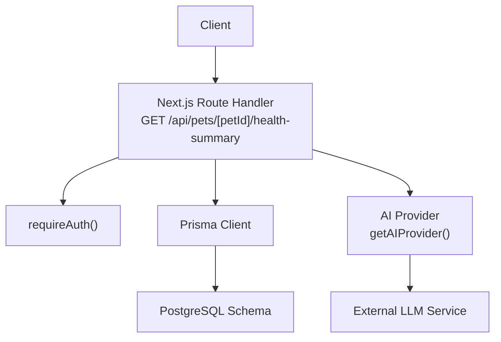
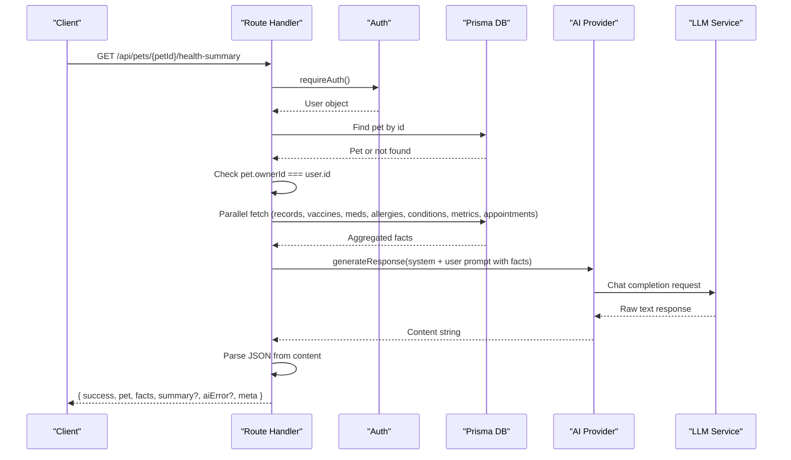
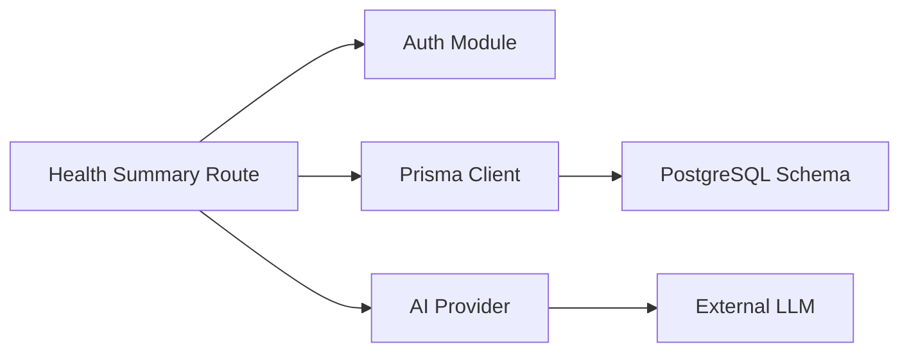

# Pet Health Summary API

<cite>
**Referenced Files in This Document**
- [health-summary/route.ts](file://app/api/pets/[petId]/health-summary/route.ts)
- [pets/route.ts](file://app/api/pets/route.ts)
- [pets/[petId]/route.ts](file://app/api/pets/[petId]/route.ts)
- [vaccinations/route.ts](file://app/api/pets/[petId]/vaccinations/route.ts)
- [medications/route.ts](file://app/api/pets/[petId]/medications/route.ts)
- [schema.prisma](file://prisma/schema.prisma)
- [db.ts](file://lib/db.ts)
- [auth.ts](file://lib/auth.ts)
- [ai.ts](file://lib/ai.ts)
- [api-specification.md](file://docs/03-architecture/03-api-specification.md)
</cite>

## Table of Contents
1. [Introduction](#introduction)
2. [Project Structure](#project-structure)
3. [Core Components](#core-components)
4. [Architecture Overview](#architecture-overview)
5. [Detailed Component Analysis](#detailed-component-analysis)
6. [Dependency Analysis](#dependency-analysis)
7. [Performance Considerations](#performance-considerations)
8. [Troubleshooting Guide](#troubleshooting-guide)
9. [Conclusion](#conclusion)

## Introduction
This document explains the Pet Health Summary API, which aggregates a pet’s structured health records and produces an AI-generated summary to help owners prepare for veterinary visits. The endpoint returns two distinct parts:
- Stored facts: verbatim data from the database (conditions, consultations, medications, vaccinations, allergies, metrics, appointments).
- AI summary: a concise overview, recurring concerns, observations, and suggested topics for the veterinarian.

The service enforces authentication and ownership checks server-side and is resilient to AI provider failures by still returning stored facts even if the AI summary cannot be generated.

## Project Structure
The Pet Health Summary feature spans Next.js App Router route handlers, Prisma schema models, shared auth and DB modules, and an AI provider abstraction.

**Diagram sources**
- [health-summary/route.ts:1-206](file://app/api/pets/[petId]/health-summary/route.ts#L1-L206)
- [db.ts:1-33](file://lib/db.ts#L1-L33)
- [auth.ts:1-125](file://lib/auth.ts#L1-L125)
- [ai.ts:1-137](file://lib/ai.ts#L1-L137)

**Section sources**
- [health-summary/route.ts:1-206](file://app/api/pets/[petId]/health-summary/route.ts#L1-L206)
- [schema.prisma:70-249](file://prisma/schema.prisma#L70-L249)
- [db.ts:1-33](file://lib/db.ts#L1-L33)
- [auth.ts:1-125](file://lib/auth.ts#L1-L125)
- [ai.ts:1-137](file://lib/ai.ts#L1-L137)

## Core Components
- Health Summary Endpoint: Aggregates pet records and calls the AI provider to generate a summary. Returns both facts and AI interpretation with metadata.
- Authentication: Session-based auth via cookies; requires valid session and validates ownership of the pet.
- Data Layer: Prisma client configured with PostgreSQL; uses connection pooling and environment-specific initialization.
- AI Provider Abstraction: Pluggable providers (Groq fallback, Gemini, Qwen, OpenRouter) selected by environment variable; robust parsing of JSON responses.

Key responsibilities:
- Enforce authorization and ownership at the API boundary.
- Aggregate multiple related entities efficiently using parallel queries.
- Provide clear separation between factual data and AI-generated insights.
- Handle external AI failures gracefully without compromising core data delivery.

**Section sources**
- [health-summary/route.ts:32-205](file://app/api/pets/[petId]/health-summary/route.ts#L32-L205)
- [auth.ts:99-125](file://lib/auth.ts#L99-L125)
- [db.ts:1-33](file://lib/db.ts#L1-L33)
- [ai.ts:105-137](file://lib/ai.ts#L105-L137)

## Architecture Overview
The request flow authenticates the user, verifies pet ownership, gathers structured health data, invokes the AI provider, and returns a combined response.

**Diagram sources**
- [health-summary/route.ts:32-205](file://app/api/pets/[petId]/health-summary/route.ts#L32-L205)
- [auth.ts:99-125](file://lib/auth.ts#L99-L125)
- [ai.ts:105-137](file://lib/ai.ts#L105-L137)

## Detailed Component Analysis

### Health Summary Endpoint
Responsibilities:
- Authenticate and authorize access to the pet.
- Fetch and normalize structured health facts across multiple entities.
- Build system and user prompts for the AI summarizer.
- Parse and validate AI output into a typed structure.
- Return consistent envelope with success flag, pet info, facts, optional summary, optional aiError, and metadata.

Key behaviors:
- Ownership enforcement: ensures pet.ownerId matches authenticated user.
- Parallel data retrieval: reduces latency by querying related tables concurrently.
- Robust JSON extraction: handles markdown fences and prose around JSON.
- Graceful degradation: if AI fails or returns invalid JSON, facts are still returned with an aiError hint.

Response envelope:
- success: boolean
- pet: { id, name, species, breed }
- facts: { conditions, consultations, medications, vaccinations, allergies, metrics, appointments, counts }
- summary?: { overview, recurringConcerns, observations, topicsForVet }
- aiError? : string when AI parsing or generation fails
- meta: { provider, generatedAt }

**Section sources**
- [health-summary/route.ts:32-205](file://app/api/pets/[petId]/health-summary/route.ts#L32-L205)

### Authentication and Authorization
- requireAuth(): Validates session cookie, returns user or throws UNAUTHENTICATED.
- Ownership check: Compares pet.ownerId with user.id to prevent cross-user access.
- Role checks: Some endpoints enforce PET_OWNER role for write operations.

Security considerations:
- Sessions are stored securely with hashed tokens and expiration.
- Sliding window expiration extends sessions nearing expiry.
- All ownership decisions are server-side; client-supplied IDs are never trusted for access control.

**Section sources**
- [auth.ts:33-75](file://lib/auth.ts#L33-L75)
- [auth.ts:99-125](file://lib/auth.ts#L99-L125)
- [pets/[petId]/route.ts:6-20](file://app/api/pets/[petId]/route.ts#L6-L20)
- [vaccinations/route.ts:59-78](file://app/api/pets/[petId]/vaccinations/route.ts#L59-L78)
- [medications/route.ts:59-78](file://app/api/pets/[petId]/medications/route.ts#L59-L78)

### Data Layer and Models
- Database: PostgreSQL via Prisma with connection pooling.
- Key models used by the health summary:
  - Pet: owner relationships and links to medical records, vaccinations, medications, allergies, conditions, metrics, appointments.
  - MedicalRecord and MedicalRecordVersion: current version selection for summaries.
  - Vaccination, Medication, Allergy, HealthCondition, HealthMetric, Appointment: aggregated into facts.

Data normalization:
- Dates converted to ISO strings for consistent UI consumption.
- Counts included to support UI indicators and analytics.

**Section sources**
- [db.ts:1-33](file://lib/db.ts#L1-L33)
- [schema.prisma:70-249](file://prisma/schema.prisma#L70-L249)
- [health-summary/route.ts:54-126](file://app/api/pets/[petId]/health-summary/route.ts#L54-L126)

### AI Provider Integration
- Provider selection: Environment variable determines active provider; default includes fallback logic for resilience.
- Prompt engineering: System prompt enforces strict JSON output and safe language; user prompt injects normalized facts.
- Response parsing: Extracts JSON from potential markdown fences and validates required fields before inclusion in response.
- Error handling: Logs provider errors and returns aiError while preserving facts.

Provider options:
- Groq (with fallback to Gemini), Gemini, Qwen, OpenRouter.

**Section sources**
- [ai.ts:32-137](file://lib/ai.ts#L32-L137)
- [health-summary/route.ts:128-183](file://app/api/pets/[petId]/health-summary/route.ts#L128-L183)

### Related Pet Management Endpoints
- List pets: Returns all pets owned by the authenticated user.
- CRUD per pet: Get, update, delete with ownership checks.
- Vaccinations and medications: List and create with validation and reminder creation on due/end dates.

These endpoints complement the health summary by enabling data entry that feeds into future summaries.

**Section sources**
- [pets/route.ts:1-69](file://app/api/pets/route.ts#L1-L69)
- [pets/[petId]/route.ts:1-141](file://app/api/pets/[petId]/route.ts#L1-L141)
- [vaccinations/route.ts:1-156](file://app/api/pets/[petId]/vaccinations/route.ts#L1-L156)
- [medications/route.ts:1-158](file://app/api/pets/[petId]/medications/route.ts#L1-L158)

## Dependency Analysis
The health summary endpoint depends on:
- Authentication module for session validation.
- Prisma client for data access.
- AI provider abstraction for summarization.
- Consistent error envelope across APIs.

**Diagram sources**
- [health-summary/route.ts:1-206](file://app/api/pets/[petId]/health-summary/route.ts#L1-L206)
- [auth.ts:1-125](file://lib/auth.ts#L1-L125)
- [db.ts:1-33](file://lib/db.ts#L1-L33)
- [ai.ts:1-137](file://lib/ai.ts#L1-L137)

**Section sources**
- [health-summary/route.ts:1-206](file://app/api/pets/[petId]/health-summary/route.ts#L1-L206)
- [ai.ts:1-137](file://lib/ai.ts#L1-L137)
- [db.ts:1-33](file://lib/db.ts#L1-L33)
- [auth.ts:1-125](file://lib/auth.ts#L1-L125)

## Performance Considerations
- Parallel queries: Health summary uses Promise.all to fetch multiple entity sets concurrently, reducing total latency.
- Connection pooling: Prisma configured with pg pool in production to manage connections efficiently.
- AI provider fallback: Default provider includes fallback to mitigate rate limits or outages.
- Data limiting: Queries limit recent records (e.g., top 10) to reduce payload size and processing time.

Recommendations:
- Monitor AI provider latency and consider caching frequently accessed summaries with appropriate invalidation.
- Add pagination for large datasets if needed.
- Ensure indexes exist on frequently queried fields (e.g., petId, dateTime) — already present in schema.

[No sources needed since this section provides general guidance]

## Troubleshooting Guide
Common issues and resolutions:
- Unauthorized access: Ensure a valid session cookie is present; requireAuth will throw UNAUTHENTICATED otherwise.
- Forbidden access: Verify pet.ownerId matches the authenticated user; ensure correct ownership checks.
- Not found: Confirm petId exists in the database.
- AI summary missing: If AI parsing fails or provider errors occur, facts are still returned; check aiError field and logs.
- Validation errors: For vaccination and medication creation, ensure dates are valid and constraints are met (e.g., due date after administered date).

Operational tips:
- Inspect meta.provider and generatedAt to confirm which AI provider was used and when the summary was generated.
- Use consistent error envelopes to handle failures uniformly in clients.

**Section sources**
- [health-summary/route.ts:193-205](file://app/api/pets/[petId]/health-summary/route.ts#L193-L205)
- [vaccinations/route.ts:82-118](file://app/api/pets/[petId]/vaccinations/route.ts#L82-L118)
- [medications/route.ts:82-118](file://app/api/pets/[petId]/medications/route.ts#L82-L118)
- [auth.ts:99-125](file://lib/auth.ts#L99-L125)

## Conclusion
The Pet Health Summary API delivers a reliable, secure, and extensible way to aggregate a pet’s health records and provide actionable insights through AI. It separates factual data from AI-generated interpretations, enforces strict ownership controls, and remains resilient to external AI failures. With clear error handling, efficient data fetching, and pluggable AI providers, it forms a solid foundation for owner-facing health insights and vet preparation workflows.

[No sources needed since this section summarizes without analyzing specific files]