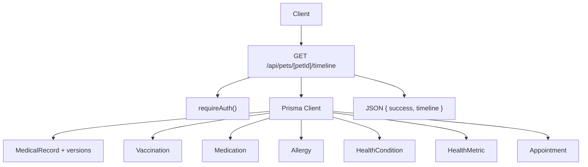
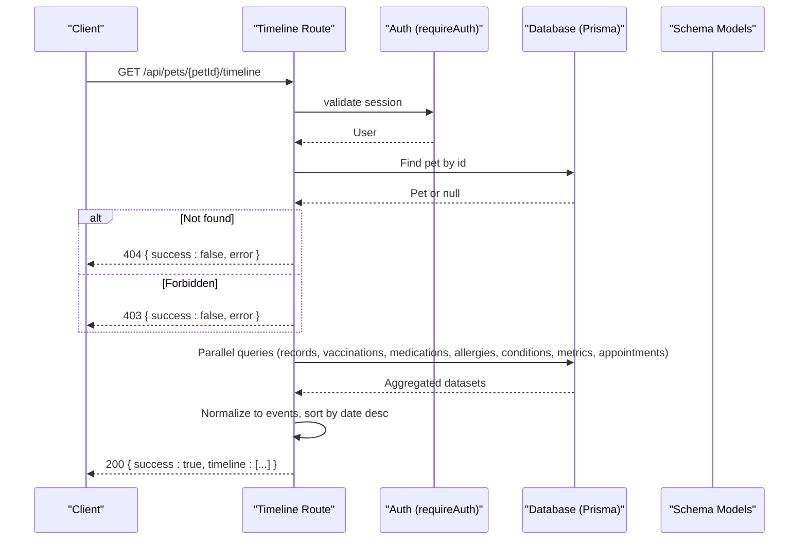
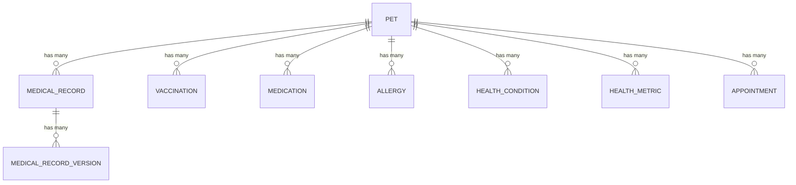
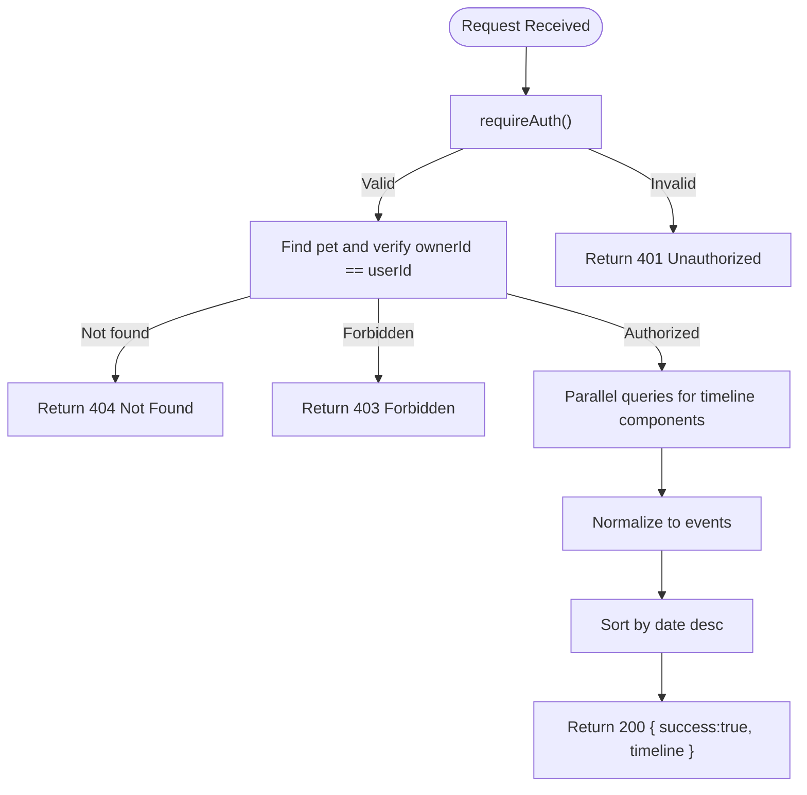
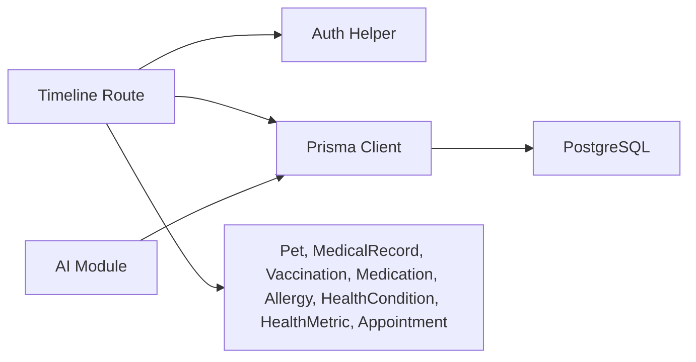

# Pet Health Timeline

<cite>
**Referenced Files in This Document**
- [route.ts](file://app/api/pets/[petId]/timeline/route.ts)
- [schema.prisma](file://prisma/schema.prisma)
- [auth.ts](file://lib/auth.ts)
- [api-specification.md](file://docs/03-architecture/03-api-specification.md)
- [project-blueprint.md](file://docs/01-product/01-project-blueprint.md)
- [ai.ts](file://lib/ai.ts)
</cite>

## Table of Contents
1. [Introduction](#introduction)
2. [Project Structure](#project-structure)
3. [Core Components](#core-components)
4. [Architecture Overview](#architecture-overview)
5. [Detailed Component Analysis](#detailed-component-analysis)
6. [Dependency Analysis](#dependency-analysis)
7. [Performance Considerations](#performance-considerations)
8. [Troubleshooting Guide](#troubleshooting-guide)
9. [Conclusion](#conclusion)
10. [Appendices](#appendices)

## Introduction
This document provides detailed API documentation for the pet health timeline functionality exposed by GET /api/pets/[petId]/timeline. It explains how chronological health events are retrieved and aggregated from multiple data sources (medical records, vaccinations, medications, allergies, conditions, metrics, and appointments), how responses are structured, and how to use this endpoint for generating health reports, tracking vaccination schedules, and monitoring medication adherence. It also addresses pagination considerations, performance optimization strategies for historical data retrieval, and integration patterns with veterinary systems for automated health record updates.

## Project Structure
The timeline endpoint is implemented as a Next.js App Router route under app/api/pets/[petId]/timeline/route.ts. It authenticates the caller, verifies ownership of the requested pet, aggregates data across several Prisma models, normalizes them into a unified event list, sorts chronologically, and returns a JSON response. The database schema defines the entities that contribute to the timeline.

**Diagram sources**
- [route.ts:6-149](file://app/api/pets/[petId]/timeline/route.ts#L6-L149)
- [schema.prisma:133-244](file://prisma/schema.prisma#L133-L244)

**Section sources**
- [route.ts:6-149](file://app/api/pets/[petId]/timeline/route.ts#L6-L149)
- [schema.prisma:68-88](file://prisma/schema.prisma#L68-L88)

## Core Components
- Authentication and authorization: requireAuth ensures the caller is logged in; ownership check ensures the user owns the pet.
- Data aggregation: Parallel queries fetch medical records (with current version), vaccinations, medications, allergies, conditions, metrics, and appointments for the given pet.
- Event normalization: Each data source is mapped to a consistent event shape with type, date, title, description, and meta fields.
- Chronological sorting: Events are sorted descending by date (newest first).
- Response envelope: Success flag and timeline array or error object with code and message.

Key responsibilities and behaviors are defined in the timeline route implementation and supported by the Prisma schema.

**Section sources**
- [route.ts:10-53](file://app/api/pets/[petId]/timeline/route.ts#L10-L53)
- [route.ts:55-135](file://app/api/pets/[petId]/timeline/route.ts#L55-L135)
- [schema.prisma:133-244](file://prisma/schema.prisma#L133-L244)

## Architecture Overview
The endpoint follows a layered approach:
- Request handling: Next.js route receives the request and extracts petId.
- Security: requireAuth validates session; ownership validation prevents unauthorized access.
- Data layer: Prisma executes parallel queries to collect all relevant records.
- Transformation: Records are transformed into a unified timeline event format.
- Output: A single JSON response containing a sorted timeline.

**Diagram sources**
- [route.ts:6-149](file://app/api/pets/[petId]/timeline/route.ts#L6-L149)
- [schema.prisma:133-244](file://prisma/schema.prisma#L133-L244)

## Detailed Component Analysis

### Endpoint Specification: GET /api/pets/[petId]/timeline
- Purpose: Retrieve a chronological timeline of a pet’s health events including medical records, vaccinations, medications, allergies, conditions, metrics, and appointments.
- Path parameters:
  - petId: UUID string identifying the pet.
- Query parameters:
  - None currently implemented in the route. Filtering by date ranges, event types, or severity levels is not supported at this time.
- Authentication:
  - Required via session cookie. Unauthenticated requests return 401.
- Authorization:
  - Ownership check: The authenticated user must own the pet. Non-owners receive 403.
- Success response:
  - Status: 200 OK
  - Body:
    - success: boolean true
    - timeline: array of event objects
      - type: string (one of MEDICAL_RECORD, VACCINATION, MEDICATION, ALLERGY, CONDITION, METRIC, APPOINTMENT)
      - date: ISO datetime string
      - title: human-readable summary
      - description: additional details
      - meta: object with event-specific metadata
- Error responses:
  - 401 Unauthorized: Not logged in
  - 403 Forbidden: Not owner of the pet
  - 404 Not Found: Pet does not exist
  - 500 Internal Server Error: Unexpected server error

Example success response structure:
{
  "success": true,
  "timeline": [
    {
      "type": "VACCINATION",
      "date": "2026-08-20T10:30:00.000Z",
      "title": "Vaccine: DHPP Booster",
      "description": "Next booster due: 2027-08-20",
      "meta": { "vetName": "Dr. Alice Smith" }
    },
    {
      "type": "MEDICATION",
      "date": "2026-08-20T00:00:00.000Z",
      "title": "Medication Started: Joint Supplement Chewables",
      "description": "Dosage: 1 chewable chew (Every morning)",
      "meta": { "status": "ACTIVE", "endDate": null }
    },
    {
      "type": "ALLERGY",
      "date": "2026-08-20T10:30:00.000Z",
      "title": "Allergy Identified: Penicillin",
      "description": "Severity: HIGH",
      "meta": {}
    },
    {
      "type": "CONDITION",
      "date": "2026-08-19T00:00:00.000Z",
      "title": "Condition Diagnosed: Front Left Paw Limp",
      "description": "Status: RESOLVED",
      "meta": {}
    },
    {
      "type": "METRIC",
      "date": "2026-08-20T10:15:00.000Z",
      "title": "Metric Update: WEIGHT",
      "description": "28.5 kg",
      "meta": {}
    },
    {
      "type": "APPOINTMENT",
      "date": "2026-09-01T10:00:00.000Z",
      "title": "Appointment: Annual checkup",
      "description": "Status: REQUESTED",
      "meta": { "vetId": "...", "clinicId": "..." }
    }
  ]
}

Notes on filtering and pagination:
- Current implementation does not support query parameters for filtering by date range, event type, or severity level.
- Pagination is not implemented; the endpoint returns all events for the pet. For large timelines, consider client-side pagination or implementing server-side pagination in future iterations.

Use cases:
- Generating health reports: Aggregate timeline entries to produce printable summaries or dashboards.
- Tracking vaccination schedules: Use VACCINATION events to monitor upcoming due dates and compliance.
- Monitoring medication adherence: Use MEDICATION events to track start/end dates and status changes.

**Section sources**
- [route.ts:6-149](file://app/api/pets/[petId]/timeline/route.ts#L6-L149)
- [schema.prisma:133-244](file://prisma/schema.prisma#L133-L244)

### Data Model Relationships Relevant to Timeline
The timeline aggregates data from multiple models linked to the Pet entity.

**Diagram sources**
- [schema.prisma:68-88](file://prisma/schema.prisma#L68-L88)
- [schema.prisma:133-244](file://prisma/schema.prisma#L133-L244)

### Event Normalization Logic
Each data source is normalized into a consistent event shape:
- Medical Record: Uses the current version to populate diagnosis and treatment plan; includes symptoms and notes in meta.
- Vaccination: Includes vaccine name, administered date, next due date if present, and vet name.
- Medication: Includes medication name, dosage, frequency, status, and optional end date.
- Allergy: Includes allergen and severity.
- Condition: Includes condition name and status; uses onset date when available.
- Metric: Includes metric type, value, and unit.
- Appointment: Includes reason, status, and references to vet and clinic.

Events are then sorted by date descending to present the most recent events first.

**Section sources**
- [route.ts:55-135](file://app/api/pets/[petId]/timeline/route.ts#L55-L135)

### Authentication and Authorization Flow
- requireAuth enforces session-based authentication using cookies.
- Ownership verification ensures only the pet owner can access the timeline.
- Errors map to standard HTTP status codes with consistent error envelopes.

**Diagram sources**
- [auth.ts:109-115](file://lib/auth.ts#L109-L115)
- [route.ts:10-31](file://app/api/pets/[petId]/timeline/route.ts#L10-L31)

**Section sources**
- [auth.ts:109-115](file://lib/auth.ts#L109-L115)
- [route.ts:10-31](file://app/api/pets/[petId]/timeline/route.ts#L10-L31)

## Dependency Analysis
- Route depends on:
  - Next.js server utilities for request/response handling
  - Prisma client for database access
  - Authentication helper for session validation
- Database dependencies:
  - PostgreSQL via Prisma datasource
  - Indexed relationships for efficient querying (e.g., petId indexes)
- External integrations:
  - AI assistant functions reference similar data retrieval patterns for timeline-related queries, demonstrating reuse of Prisma queries for related features.

**Diagram sources**
- [route.ts:1-149](file://app/api/pets/[petId]/timeline/route.ts#L1-L149)
- [schema.prisma:1-312](file://prisma/schema.prisma#L1-L312)
- [ai.ts:270-313](file://lib/ai.ts#L270-L313)

**Section sources**
- [route.ts:1-149](file://app/api/pets/[petId]/timeline/route.ts#L1-L149)
- [schema.prisma:1-312](file://prisma/schema.prisma#L1-L312)
- [ai.ts:270-313](file://lib/ai.ts#L270-L313)

## Performance Considerations
- Parallel queries: The endpoint uses Promise.all to fetch all timeline components concurrently, reducing latency.
- Indexing: Ensure petId indexes exist on relevant tables to optimize lookups (already present in schema for some models).
- Sorting cost: In-memory sorting of all events may become expensive for very large timelines. Consider server-side pagination and filtering in future versions.
- Selective inclusion: Only include necessary fields to reduce payload size.
- Caching: For read-heavy scenarios, consider caching timeline results per pet with appropriate invalidation policies.

[No sources needed since this section provides general guidance]

## Troubleshooting Guide
Common issues and resolutions:
- 401 Unauthorized:
  - Cause: Missing or invalid session cookie.
  - Resolution: Ensure the client sends a valid session token cookie set by login endpoints.
- 403 Forbidden:
  - Cause: Authenticated user does not own the pet.
  - Resolution: Verify the pet’s ownerId matches the authenticated user’s id.
- 404 Not Found:
  - Cause: Pet ID does not exist.
  - Resolution: Confirm the petId parameter is correct and the pet exists.
- 500 Internal Server Error:
  - Cause: Unexpected server-side exception.
  - Resolution: Inspect server logs and database connectivity.

Error response envelope:
{
  "success": false,
  "error": {
    "code": "UNAUTHORIZED|FORBIDDEN|NOT_FOUND|INTERNAL_SERVER_ERROR",
    "message": "Human-readable description"
  }
}

**Section sources**
- [route.ts:136-149](file://app/api/pets/[petId]/timeline/route.ts#L136-L149)
- [api-specification.md:12-22](file://docs/03-architecture/03-api-specification.md#L12-L22)

## Conclusion
The GET /api/pets/[petId]/timeline endpoint provides a comprehensive, chronological view of a pet’s health events by aggregating multiple data sources into a unified timeline. It enforces authentication and ownership checks, normalizes diverse records into a consistent event format, and returns them sorted by date. While filtering and pagination are not currently implemented, the design supports future enhancements for large-scale timelines and advanced query capabilities. Integration points with AI and veterinary workflows can leverage the same underlying data model and query patterns.

[No sources needed since this section summarizes without analyzing specific files]

## Appendices

### Example Workflows

#### Generating Health Reports
- Use the timeline to compile annual or lifetime summaries.
- Group events by year or category (vaccinations, medications, allergies, conditions, metrics, appointments).
- Export or render as PDF/HTML for sharing with veterinarians.

#### Tracking Vaccination Schedules
- Parse VACCINATION events to identify next due dates.
- Generate reminders based on dueDate fields.
- Monitor compliance over time.

#### Monitoring Medication Adherence
- Track MEDICATION events for start/end dates and status changes.
- Identify gaps or discontinuations.
- Alert owners about upcoming medication renewals.

[No sources needed since this section provides general guidance]

### Integration with Veterinary Systems
- Automated updates: Vet clinics can push new records via existing POST endpoints (e.g., vaccinations, medications, metrics) which will be reflected in the timeline.
- Consent-based access: Temporary access windows can be granted upon confirmed appointments, enabling vets to retrieve relevant history.
- Standardized payloads: Follow the API specification for creating records to ensure consistency.

**Section sources**
- [api-specification.md:130-160](file://docs/03-architecture/03-api-specification.md#L130-L160)
- [project-blueprint.md:379-435](file://docs/01-product/01-project-blueprint.md#L379-L435)