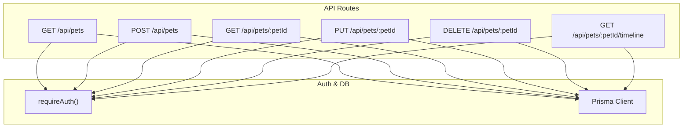
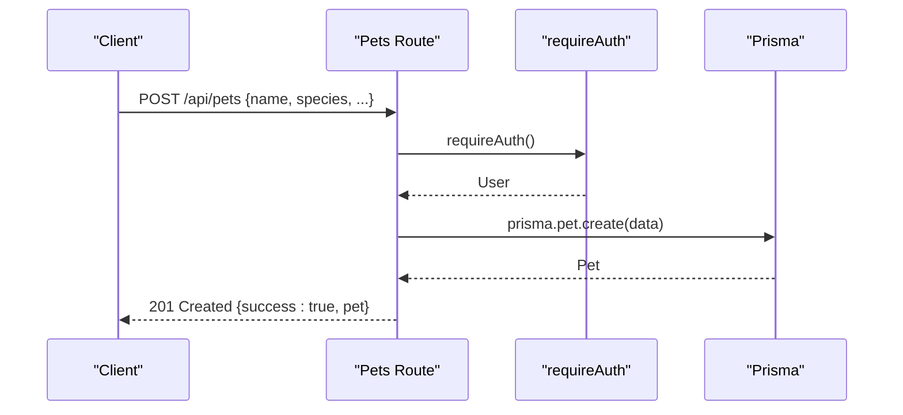
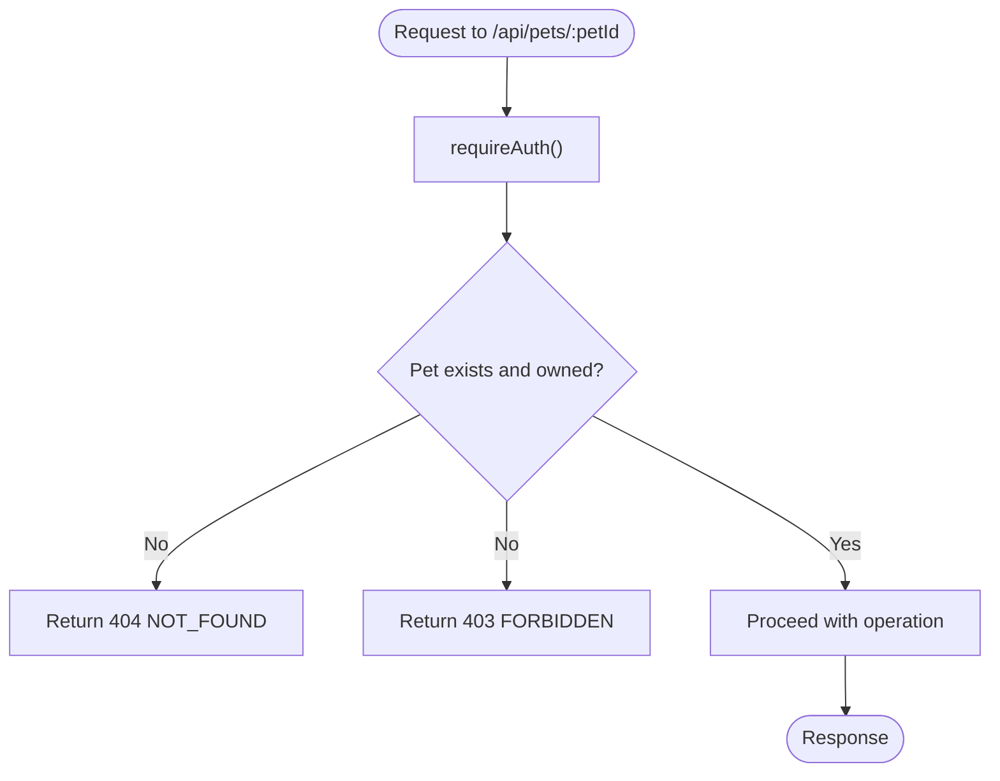
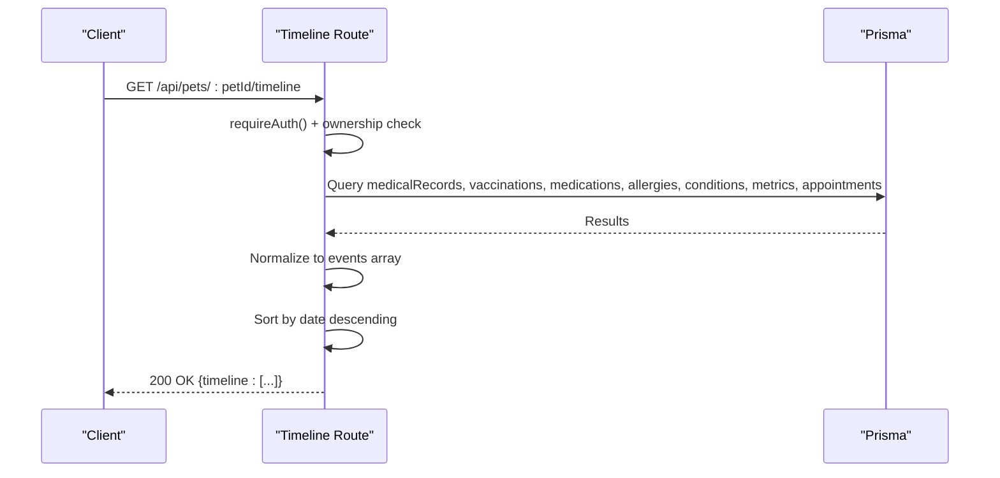
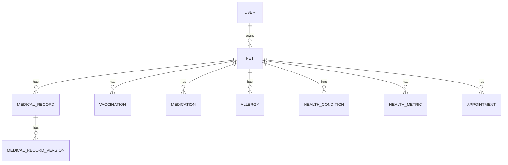

# Pet Management API

<cite>
**Referenced Files in This Document**
- [route.ts](file://app/api/pets/route.ts)
- [route.ts](file://app/api/pets/[petId]/route.ts)
- [route.ts](file://app/api/pets/[petId]/timeline/route.ts)
- [schema.prisma](file://prisma/schema.prisma)
- [auth.ts](file://lib/auth.ts)
- [db.ts](file://lib/db.ts)
- [03-api-specification.md](file://docs/03-architecture/03-api-specification.md)
</cite>

## Table of Contents
1. [Introduction](#introduction)
2. [Project Structure](#project-structure)
3. [Core Components](#core-components)
4. [Architecture Overview](#architecture-overview)
5. [Detailed Component Analysis](#detailed-component-analysis)
6. [Dependency Analysis](#dependency-analysis)
7. [Performance Considerations](#performance-considerations)
8. [Troubleshooting Guide](#troubleshooting-guide)
9. [Conclusion](#conclusion)
10. [Appendices](#appendices)

## Introduction
This document provides comprehensive API documentation for pet management endpoints in the PETIVA system. It covers CRUD operations for pet profiles (/api/pets/*), access to a unified health timeline (/api/pets/[petId]/timeline), and related health data management as defined by the project’s API specification. Each endpoint includes HTTP methods, URL patterns with path parameters, request body schemas, response formats, validation rules, and examples of common workflows such as adding new pets, logging medical events, retrieving vaccination histories, and generating health reports. Ownership verification and privacy considerations are also explained.

## Project Structure
The pet management functionality is implemented using Next.js App Router route handlers under app/api/pets. The database schema defines entities for pets, users, appointments, vaccinations, medications, allergies, health conditions, metrics, and documents. Authentication and session handling are centralized in lib/auth.ts, and Prisma client configuration is in lib/db.ts.

**Diagram sources**
- [route.ts:6-28](file://app/api/pets/route.ts#L6-L28)
- [route.ts:31-68](file://app/api/pets/route.ts#L31-L68)
- [route.ts:23-52](file://app/api/pets/[petId]/route.ts#L23-L52)
- [route.ts:55-104](file://app/api/pets/[petId]/route.ts#L55-L104)
- [route.ts:107-140](file://app/api/pets/[petId]/route.ts#L107-L140)
- [route.ts:6-148](file://app/api/pets/[petId]/timeline/route.ts#L6-L148)
- [auth.ts:109-115](file://lib/auth.ts#L109-L115)
- [db.ts:1-33](file://lib/db.ts#L1-L33)

**Section sources**
- [route.ts:6-68](file://app/api/pets/route.ts#L6-L68)
- [route.ts:23-140](file://app/api/pets/[petId]/route.ts#L23-L140)
- [route.ts:6-148](file://app/api/pets/[petId]/timeline/route.ts#L6-L148)
- [schema.prisma:68-88](file://prisma/schema.prisma#L68-L88)
- [auth.ts:109-115](file://lib/auth.ts#L109-L115)
- [db.ts:1-33](file://lib/db.ts#L1-L33)

## Core Components
- Authentication middleware: requireAuth ensures requests are authenticated via session cookies and returns the current user or throws an UNAUTHENTICATED error.
- Pet ownership checks: getAuthorizedPet validates that the requesting user owns the specified pet before allowing read/write operations.
- Data layer: Prisma client queries Pet and related health entities (MedicalRecord, Vaccination, Medication, Allergy, HealthCondition, HealthMetric, Appointment).
- Timeline aggregation: GET /api/pets/[petId]/timeline aggregates multiple health components into a single chronological event list.

**Section sources**
- [auth.ts:109-115](file://lib/auth.ts#L109-L115)
- [route.ts:6-20](file://app/api/pets/[petId]/route.ts#L6-L20)
- [route.ts:34-53](file://app/api/pets/[petId]/timeline/route.ts#L34-L53)
- [schema.prisma:68-88](file://prisma/schema.prisma#L68-L88)

## Architecture Overview
The pet management APIs follow a consistent pattern:
- Authenticate the caller using requireAuth.
- For resource-specific routes, verify ownership via getAuthorizedPet or inline checks.
- Perform database operations through Prisma.
- Return standardized JSON responses with success envelopes and error codes.

**Diagram sources**
- [route.ts:31-68](file://app/api/pets/route.ts#L31-L68)
- [auth.ts:109-115](file://lib/auth.ts#L109-L115)
- [schema.prisma:68-88](file://prisma/schema.prisma#L68-L88)

## Detailed Component Analysis

### Endpoints: /api/pets
- GET /api/pets
  - Purpose: List all pets belonging to the authenticated owner.
  - Authorization: Requires authentication; lists only the caller’s pets.
  - Response: Array of pet objects sorted by creation date descending.
  - Error handling: 401 if unauthenticated; 500 on internal errors.
- POST /api/pets
  - Purpose: Create a new pet profile.
  - Request body fields: name (required), species (required), breed (optional), gender (optional), dateOfBirth (optional ISO datetime), weight (optional number).
  - Validation: name and species required; dateOfBirth parsed to Date; weight parsed to float.
  - Response: 201 Created with created pet object.
  - Error handling: 400 for missing required fields; 401 if unauthenticated; 500 on internal errors.

Example workflow: Adding a new pet
- Send POST /api/pets with name and species.
- Receive 201 with the new pet’s id and attributes.
- Use the returned pet id for subsequent operations like updating details or accessing the timeline.

**Section sources**
- [route.ts:6-28](file://app/api/pets/route.ts#L6-L28)
- [route.ts:31-68](file://app/api/pets/route.ts#L31-L68)
- [schema.prisma:68-88](file://prisma/schema.prisma#L68-L88)

### Endpoints: /api/pets/[petId]
- GET /api/pets/[petId]
  - Purpose: Retrieve details for a specific pet.
  - Authorization: Requires authentication and ownership verification.
  - Response: Single pet object.
  - Error handling: 404 if not found; 403 if not owned; 401 if unauthenticated; 500 on internal errors.
- PUT /api/pets/[petId]
  - Purpose: Update pet details.
  - Request body fields: name (required), species (required), breed (optional), gender (optional), dateOfBirth (optional ISO datetime), weight (optional number).
  - Validation: name and species required; dateOfBirth parsed to Date; weight parsed to float.
  - Response: Updated pet object.
  - Error handling: 400 for missing required fields; 404/403 for authorization failures; 401 if unauthenticated; 500 on internal errors.
- DELETE /api/pets/[petId]
  - Purpose: Delete/archive a pet profile.
  - Authorization: Requires authentication and ownership verification.
  - Response: Success message.
  - Error handling: 404/403 for authorization failures; 401 if unauthenticated; 500 on internal errors.

Ownership verification flow:

**Diagram sources**
- [route.ts:6-20](file://app/api/pets/[petId]/route.ts#L6-L20)
- [route.ts:23-52](file://app/api/pets/[petId]/route.ts#L23-L52)
- [route.ts:55-104](file://app/api/pets/[petId]/route.ts#L55-L104)
- [route.ts:107-140](file://app/api/pets/[petId]/route.ts#L107-L140)

**Section sources**
- [route.ts:23-52](file://app/api/pets/[petId]/route.ts#L23-L52)
- [route.ts:55-104](file://app/api/pets/[petId]/route.ts#L55-L104)
- [route.ts:107-140](file://app/api/pets/[petId]/route.ts#L107-L140)

### Endpoint: /api/pets/[petId]/timeline
- GET /api/pets/[petId]/timeline
  - Purpose: Fetch a unified chronological timeline of health-related events for a pet.
  - Authorization: Requires authentication and ownership verification.
  - Aggregated components:
    - Medical records (current version included)
    - Vaccinations
    - Medications
    - Allergies
    - Health conditions
    - Health metrics
    - Appointments
  - Response: Array of timeline events sorted newest-first with type, date, title, description, and meta fields.
  - Error handling: 404 if pet not found; 403 if not owned; 401 if unauthenticated; 500 on internal errors.

Timeline generation flow:

**Diagram sources**
- [route.ts:6-148](file://app/api/pets/[petId]/timeline/route.ts#L6-L148)
- [schema.prisma:133-244](file://prisma/schema.prisma#L133-L244)

**Section sources**
- [route.ts:6-148](file://app/api/pets/[petId]/timeline/route.ts#L6-L148)
- [schema.prisma:133-244](file://prisma/schema.prisma#L133-L244)

### Related Health Data Management (per API specification)
While the primary implementation focuses on listing/updating/deleting pets and reading timelines, the API specification defines additional endpoints for managing preventative care and metrics:
- POST /api/pets/[petId]/vaccinations
  - Purpose: Add a vaccination record.
  - Request body: vaccineName (string), administeredDate (ISO datetime), dueDate (optional ISO datetime).
  - Authorization: Veterinarian or authorized pet owner.
  - Entity: Vaccination.
- POST /api/pets/[petId]/medications
  - Purpose: Add a medication record.
  - Authorization: As per spec.
  - Entity: Medication.
- POST /api/pets/[petId]/metrics
  - Purpose: Post a health metric (e.g., weight, temperature).
  - Request body: metricType (string), value (number), unit (string).
  - Entity: HealthMetric.

These endpoints complement the timeline by enabling updates that will be reflected when fetching the timeline.

**Section sources**
- [03-api-specification.md:130-160](file://docs/03-architecture/03-api-specification.md#L130-L160)
- [schema.prisma:196-244](file://prisma/schema.prisma#L196-L244)

## Dependency Analysis
- Authentication dependency: All pet endpoints call requireAuth to ensure the caller has a valid session. Errors propagate as UNAUTHENTICATED and are handled consistently across routes.
- Database dependency: All routes use Prisma to interact with PostgreSQL via the configured adapter.
- Schema relationships:
  - Pet belongs to User (ownerId).
  - Pet has many MedicalRecord, Vaccination, Medication, Allergy, HealthCondition, HealthMetric, Document, Appointment.
  - MedicalRecord has versions (MedicalRecordVersion) and prescriptions.
  - Appointments link Pet, Owner (User), Veterinarian, and Clinic.

**Diagram sources**
- [schema.prisma:30-53](file://prisma/schema.prisma#L30-L53)
- [schema.prisma:68-88](file://prisma/schema.prisma#L68-L88)
- [schema.prisma:133-162](file://prisma/schema.prisma#L133-L162)
- [schema.prisma:164-182](file://prisma/schema.prisma#L164-L182)
- [schema.prisma:196-244](file://prisma/schema.prisma#L196-L244)

**Section sources**
- [schema.prisma:30-53](file://prisma/schema.prisma#L30-L53)
- [schema.prisma:68-88](file://prisma/schema.prisma#L68-L88)
- [schema.prisma:133-162](file://prisma/schema.prisma#L133-L162)
- [schema.prisma:164-182](file://prisma/schema.prisma#L164-L182)
- [schema.prisma:196-244](file://prisma/schema.prisma#L196-L244)

## Performance Considerations
- Batched timeline queries: The timeline endpoint uses Promise.all to fetch multiple related tables concurrently, reducing latency.
- Sorting in memory: Events are sorted client-side after retrieval; consider pagination for large datasets.
- Indexing: Database indexes exist on frequently queried fields (e.g., petId, vetId+dateTime) to optimize lookups.
- Session sliding expiration: Sessions extend automatically near expiry to reduce re-authentication overhead.

[No sources needed since this section provides general guidance]

## Troubleshooting Guide
Common issues and resolutions:
- 401 Unauthorized: Ensure a valid session cookie is present. Verify login flow sets the session cookie correctly.
- 403 Forbidden: Confirm the authenticated user owns the requested pet. Ownership is enforced server-side.
- 404 Not Found: Verify the petId exists in the database.
- 400 Bad Request: Ensure required fields (name, species) are provided and properly formatted. Dates should be ISO strings; weights should be numeric.
- 500 Internal Server Error: Check server logs for database connectivity or unexpected exceptions.

Error handling patterns:
- Unauthenticated requests return a standardized error envelope with code UNAUTHORIZED.
- Validation failures return BAD_REQUEST with descriptive messages.
- Internal errors return INTERNAL_SERVER_ERROR with generic messages.

**Section sources**
- [route.ts:16-27](file://app/api/pets/route.ts#L16-L27)
- [route.ts:56-67](file://app/api/pets/route.ts#L56-L67)
- [route.ts:40-51](file://app/api/pets/[petId]/route.ts#L40-L51)
- [route.ts:92-103](file://app/api/pets/[petId]/route.ts#L92-L103)
- [route.ts:128-139](file://app/api/pets/[petId]/route.ts#L128-L139)
- [route.ts:136-147](file://app/api/pets/[petId]/timeline/route.ts#L136-L147)

## Conclusion
The PETIVA pet management API provides robust CRUD operations for pet profiles and a unified timeline for health-related events. Authentication and ownership checks ensure data privacy and security. The timeline endpoint consolidates diverse health data into a chronological view, supporting workflows such as logging medical events, tracking vaccinations, and generating health reports. Additional endpoints for vaccinations, medications, and metrics are defined in the API specification to complete the health data lifecycle.

[No sources needed since this section summarizes without analyzing specific files]

## Appendices

### Request and Response Schemas
- Pet object fields:
  - id (string, UUID)
  - ownerId (string, UUID)
  - name (string)
  - species (string)
  - breed (string, optional)
  - gender (string, optional)
  - dateOfBirth (datetime, optional)
  - weight (decimal, optional)
  - createdAt (datetime)
  - updatedAt (datetime)
- Timeline event fields:
  - type (string): MEDICAL_RECORD, VACCINATION, MEDICATION, ALLERGY, CONDITION, METRIC, APPOINTMENT
  - date (datetime)
  - title (string)
  - description (string)
  - meta (object): varies by type (e.g., symptoms, notes, vetName, status, endDate, vetId, clinicId)

**Section sources**
- [schema.prisma:68-88](file://prisma/schema.prisma#L68-L88)
- [route.ts:58-130](file://app/api/pets/[petId]/timeline/route.ts#L58-L130)

### Common Workflows
- Adding a new pet:
  - POST /api/pets with name and species.
  - Receive 201 with pet id.
  - Use pet id to update details or access timeline.
- Logging a medical event:
  - Create a medical record via the veterinarian endpoint (as per API spec).
  - Fetch timeline to see the new entry.
- Retrieving vaccination history:
  - Add vaccination records via the vaccination endpoint (as per API spec).
  - Fetch timeline to view vaccination entries with next booster dates.
- Generating a health report:
  - Fetch timeline to aggregate all relevant health events.
  - Use the timeline data to produce summaries or export reports.

**Section sources**
- [route.ts:31-68](file://app/api/pets/route.ts#L31-L68)
- [route.ts:6-148](file://app/api/pets/[petId]/timeline/route.ts#L6-L148)
- [03-api-specification.md:93-124](file://docs/03-architecture/03-api-specification.md#L93-L124)
- [03-api-specification.md:130-160](file://docs/03-architecture/03-api-specification.md#L130-L160)