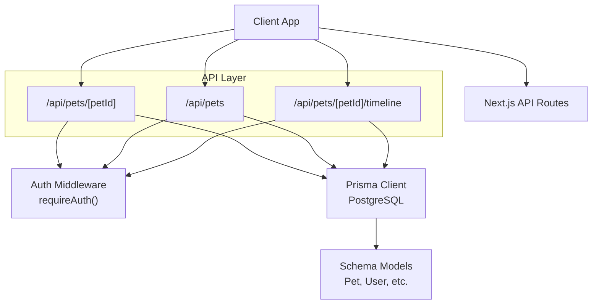
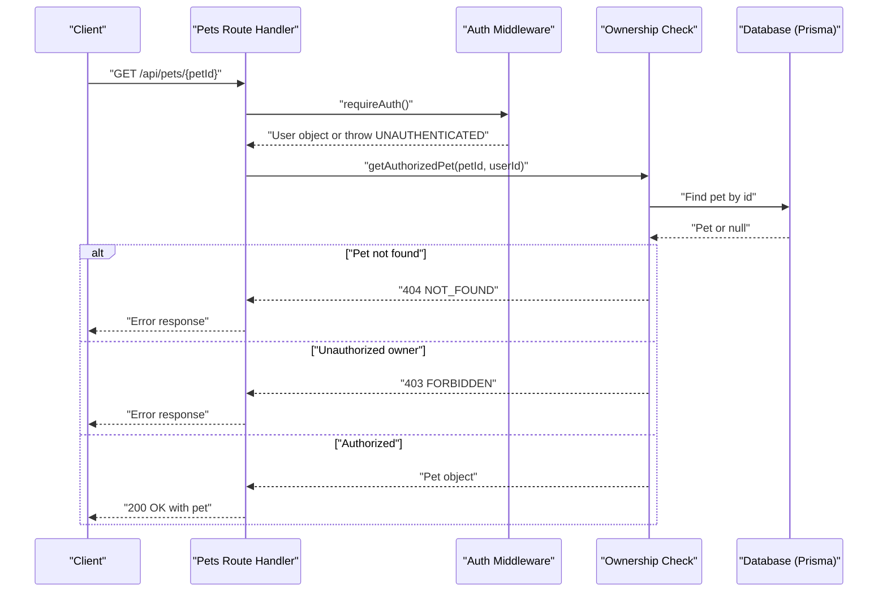
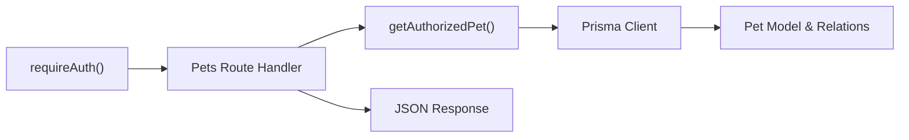

# Pet Profile Management

<cite>
**Referenced Files in This Document**
- [route.ts](file://app/api/pets/[petId]/route.ts)
- [route.ts](file://app/api/pets/route.ts)
- [schema.prisma](file://prisma/schema.prisma)
- [auth.ts](file://lib/auth.ts)
- [api-specification.md](file://docs/03-architecture/03-api-specification.md)
- [timeline route.ts](file://app/api/pets/[petId]/timeline/route.ts)
</cite>

## Table of Contents
1. [Introduction](#introduction)
2. [Project Structure](#project-structure)
3. [Core Components](#core-components)
4. [Architecture Overview](#architecture-overview)
5. [Detailed Component Analysis](#detailed-component-analysis)
6. [Dependency Analysis](#dependency-analysis)
7. [Performance Considerations](#performance-considerations)
8. [Troubleshooting Guide](#troubleshooting-guide)
9. [Conclusion](#conclusion)
10. [Appendices](#appendices)

## Introduction
This document provides comprehensive API documentation for individual pet profile management endpoints:
- GET /api/pets/[petId]: Retrieve a specific pet’s details with ownership verification.
- PUT /api/pets/[petId]: Update pet information with validation and ownership checks.
- DELETE /api/pets/[petId]: Remove (delete) a pet profile after authorization.

It covers path parameters, authentication and authorization requirements ensuring users can only access their own pets, request/response schemas, error handling for unauthorized access or non-existent pets, and common workflows such as updating medical records, changing ownership, and managing health data. It also addresses data integrity constraints and business logic for the pet profile lifecycle.

## Project Structure
The pet profile endpoints are implemented as Next.js Route Handlers under app/api/pets. The core handler for individual pet operations is located at app/api/pets/[petId]/route.ts. Supporting files include:
- Authentication and session utilities in lib/auth.ts
- Data model definitions in prisma/schema.prisma
- Global API specification in docs/03-architecture/03-api-specification.md
- Timeline aggregation endpoint in app/api/pets/[petId]/timeline/route.ts

**Diagram sources**
- [route.ts](file://app/api/pets/[petId]/route.ts)
- [route.ts](file://app/api/pets/route.ts)
- [timeline route.ts](file://app/api/pets/[petId]/timeline/route.ts)
- [auth.ts](file://lib/auth.ts)
- [schema.prisma](file://prisma/schema.prisma)

**Section sources**
- [route.ts](file://app/api/pets/[petId]/route.ts)
- [route.ts](file://app/api/pets/route.ts)
- [schema.prisma](file://prisma/schema.prisma)
- [auth.ts](file://lib/auth.ts)
- [api-specification.md](file://docs/03-architecture/03-api-specification.md)

## Core Components
- Ownership verification helper: Ensures the authenticated user owns the requested pet before any read/update/delete operation.
- Authentication middleware: requireAuth() enforces session-based authentication and throws UNAUTHENTICATED if not logged in.
- Data models: Pet model defines fields like name, species, breed, gender, dateOfBirth, weight, and relationships to medical records, vaccinations, medications, allergies, conditions, metrics, documents, and appointments.
- Error handling: Consistent JSON envelope with success flag and error object containing code and message; standardized status codes for UNAUTHORIZED, NOT_FOUND, FORBIDDEN, BAD_REQUEST, INTERNAL_SERVER_ERROR.

Key responsibilities:
- GET: Fetch pet details after verifying ownership.
- PUT: Validate required fields (name, species), update allowed fields, and return updated pet.
- DELETE: Remove pet profile after ownership verification.

**Section sources**
- [route.ts](file://app/api/pets/[petId]/route.ts)
- [auth.ts](file://lib/auth.ts)
- [schema.prisma](file://prisma/schema.prisma)

## Architecture Overview
The pet profile management follows a layered architecture:
- Client sends HTTP requests to Next.js API routes.
- Each route invokes requireAuth() to validate the session and retrieve the current user.
- For individual pet operations, getAuthorizedPet() verifies that the pet exists and belongs to the authenticated user.
- Prisma client performs database operations against PostgreSQL using the schema-defined models.
- Responses follow a consistent JSON structure with success/error envelopes.

**Diagram sources**
- [route.ts](file://app/api/pets/[petId]/route.ts)
- [auth.ts](file://lib/auth.ts)
- [schema.prisma](file://prisma/schema.prisma)

## Detailed Component Analysis

### GET /api/pets/[petId]
Retrieves a specific pet’s details with ownership verification.

- Path Parameters:
  - petId: string (UUID). Required.

- Authentication & Authorization:
  - Authentication required via session cookie.
  - Authorization enforced by ownership check: pet.ownerId must equal the authenticated user’s id.

- Request:
  - Method: GET
  - Headers: Cookie with session token set by login flow.

- Response:
  - Success (200): { success: true, pet: Pet }
  - Not Found (404): { success: false, error: { code: "NOT_FOUND", message: "Pet not found." } }
  - Forbidden (403): { success: false, error: { code: "FORBIDDEN", message: "You do not own this pet." } }
  - Unauthorized (401): { success: false, error: { code: "UNAUTHORIZED", message: "Not logged in." } }
  - Internal Server Error (500): { success: false, error: { code: "INTERNAL_SERVER_ERROR", message: "An error occurred." } }

- Business Logic:
  - Validates existence and ownership before returning pet data.
  - Uses Prisma to fetch the pet record.

- Example Workflow:
  - Owner retrieves their pet’s profile to view basic info and related health data.

**Section sources**
- [route.ts](file://app/api/pets/[petId]/route.ts)
- [auth.ts](file://lib/auth.ts)
- [schema.prisma](file://prisma/schema.prisma)

### PUT /api/pets/[petId]
Updates pet information with validation and ownership checks.

- Path Parameters:
  - petId: string (UUID). Required.

- Authentication & Authorization:
  - Authentication required.
  - Ownership enforced: Only the pet’s owner can update the profile.

- Request Body:
  - Fields:
    - name: string (required)
    - species: string (required)
    - breed: string? (optional)
    - gender: string? (optional)
    - dateOfBirth: ISO datetime string? (optional)
    - weight: number? (optional)
  - Validation:
    - name and species are required; otherwise returns 400 BAD_REQUEST.
    - dateOfBirth parsed to Date; weight parsed to float.

- Response:
  - Success (200): { success: true, pet: UpdatedPet }
  - Bad Request (400): { success: false, error: { code: "BAD_REQUEST", message: "Pet name and species are required." } }
  - Not Found (404): { success: false, error: { code: "NOT_FOUND", message: "Pet not found." } }
  - Forbidden (403): { success: false, error: { code: "FORBIDDEN", message: "You do not own this pet." } }
  - Unauthorized (401): { success: false, error: { code: "UNAUTHORIZED", message: "Not logged in." } }
  - Internal Server Error (500): { success: false, error: { code: "INTERNAL_SERVER_ERROR", message: "An error occurred." } }

- Business Logic:
  - Updates only provided fields; optional fields remain unchanged if omitted.
  - Enforces data types and presence of required fields.

- Example Workflows:
  - Updating pet medical records: While this endpoint updates pet metadata, related medical records are managed through other endpoints; owners can coordinate updates here and in record endpoints.
  - Changing ownership: Not supported directly by this endpoint; ownership changes should be handled via administrative processes or dedicated transfer endpoints (not present here). If needed, implement an admin-only transfer workflow that updates pet.ownerId with appropriate audit logging.
  - Managing pet health data: Use this endpoint to keep pet profile accurate; use timeline and related endpoints for health metrics and records.

**Section sources**
- [route.ts](file://app/api/pets/[petId]/route.ts)
- [schema.prisma](file://prisma/schema.prisma)

### DELETE /api/pets/[petId]
Removes a pet profile after authorization.

- Path Parameters:
  - petId: string (UUID). Required.

- Authentication & Authorization:
  - Authentication required.
  - Ownership enforced: Only the pet’s owner can delete the profile.

- Request:
  - Method: DELETE
  - Headers: Cookie with session token.

- Response:
  - Success (200): { success: true, message: "Pet deleted successfully." }
  - Not Found (404): { success: false, error: { code: "NOT_FOUND", message: "Pet not found." } }
  - Forbidden (403): { success: false, error: { code: "FORBIDDEN", message: "You do not own this pet." } }
  - Unauthorized (401): { success: false, error: { code: "UNAUTHORIZED", message: "Not logged in." } }
  - Internal Server Error (500): { success: false, error: { code: "INTERNAL_SERVER_ERROR", message: "An error occurred." } }

- Business Logic:
  - Deletes the pet record from the database.
  - Due to cascade relations defined in the schema, related records (e.g., medical records, vaccinations) will be removed accordingly.

- Example Workflow:
  - Owner deletes a pet profile when no longer needed; ensure downstream systems are aware of deletion.

**Section sources**
- [route.ts](file://app/api/pets/[petId]/route.ts)
- [schema.prisma](file://prisma/schema.prisma)

### Related Endpoint: Timeline Aggregation
While not part of the core pet profile CRUD, the timeline endpoint aggregates chronological events for a pet and enforces ownership.

- GET /api/pets/[petId]/timeline
- Returns a sorted list of events including medical records, vaccinations, medications, allergies, conditions, metrics, and appointments.
- Enforces ownership similarly to the main pet endpoints.

Useful for:
- Displaying a unified history of a pet’s health and care events.
- Auditing changes over time.

**Section sources**
- [timeline route.ts](file://app/api/pets/[petId]/timeline/route.ts)

## Dependency Analysis
- Authentication dependency: All endpoints rely on requireAuth() to ensure the caller is authenticated.
- Ownership dependency: Individual pet endpoints depend on getAuthorizedPet() to enforce per-resource authorization.
- Database dependency: Prisma client interacts with PostgreSQL using the schema-defined models.
- Schema relationships: Pet has one-to-many relationships with MedicalRecord, Vaccination, Medication, Allergy, HealthCondition, HealthMetric, Document, and Appointment; these influence cascade behavior on deletion.

**Diagram sources**
- [auth.ts](file://lib/auth.ts)
- [route.ts](file://app/api/pets/[petId]/route.ts)
- [schema.prisma](file://prisma/schema.prisma)

**Section sources**
- [auth.ts](file://lib/auth.ts)
- [route.ts](file://app/api/pets/[petId]/route.ts)
- [schema.prisma](file://prisma/schema.prisma)

## Performance Considerations
- Single-record lookups: GET, PUT, DELETE operate on a single pet record; efficient with indexed primary keys.
- Optional includes: Avoid fetching large related datasets unless necessary; the timeline endpoint uses Promise.all to parallelize reads but still limits to relevant entities.
- Session validation: Sliding window expiration extends sessions near expiry; consider caching user context where appropriate to reduce repeated DB calls.
- Input parsing: Ensure minimal parsing overhead; validate early to fail fast.

[No sources needed since this section provides general guidance]

## Troubleshooting Guide
Common errors and resolutions:
- UNAUTHORIZED (401):
  - Cause: Missing or invalid session cookie.
  - Resolution: Ensure the client includes the session cookie from login; verify cookie domain/path settings.

- NOT_FOUND (404):
  - Cause: Pet does not exist.
  - Resolution: Verify petId; confirm creation via POST /api/pets.

- FORBIDDEN (403):
  - Cause: Attempted access to another user’s pet.
  - Resolution: Confirm the authenticated user is the pet’s owner; implement proper role-based flows if sharing is required.

- BAD_REQUEST (400):
  - Cause: Missing required fields (name, species) in PUT.
  - Resolution: Provide all required fields; ensure correct types (ISO datetime for dateOfBirth, numeric for weight).

- INTERNAL_SERVER_ERROR (500):
  - Cause: Unexpected server-side failure.
  - Resolution: Check logs; validate database connectivity and Prisma queries.

**Section sources**
- [route.ts](file://app/api/pets/[petId]/route.ts)
- [auth.ts](file://lib/auth.ts)

## Conclusion
The pet profile management endpoints provide secure, ownership-enforced CRUD operations for pet profiles. They integrate with session-based authentication, validate inputs, and maintain data integrity through schema constraints and cascade behaviors. The timeline endpoint complements profile management by aggregating health-related events. Implement additional workflows (e.g., ownership transfer) with appropriate authorization and audit logging as needed.

[No sources needed since this section summarizes without analyzing specific files]

## Appendices

### API Reference Summary

#### GET /api/pets/[petId]
- Purpose: Retrieve a specific pet’s details.
- Path Parameter: petId (string, UUID).
- Authentication: Required (session cookie).
- Authorization: Owner-only.
- Success Response: { success: true, pet: Pet }
- Error Responses:
  - 401: { success: false, error: { code: "UNAUTHORIZED", message: "Not logged in." } }
  - 404: { success: false, error: { code: "NOT_FOUND", message: "Pet not found." } }
  - 403: { success: false, error: { code: "FORBIDDEN", message: "You do not own this pet." } }
  - 500: { success: false, error: { code: "INTERNAL_SERVER_ERROR", message: "An error occurred." } }

#### PUT /api/pets/[petId]
- Purpose: Update pet information.
- Path Parameter: petId (string, UUID).
- Authentication: Required (session cookie).
- Authorization: Owner-only.
- Request Body:
  - name: string (required)
  - species: string (required)
  - breed: string? (optional)
  - gender: string? (optional)
  - dateOfBirth: ISO datetime string? (optional)
  - weight: number? (optional)
- Success Response: { success: true, pet: UpdatedPet }
- Error Responses:
  - 400: { success: false, error: { code: "BAD_REQUEST", message: "Pet name and species are required." } }
  - 401/403/404/500: As above.

#### DELETE /api/pets/[petId]
- Purpose: Delete a pet profile.
- Path Parameter: petId (string, UUID).
- Authentication: Required (session cookie).
- Authorization: Owner-only.
- Success Response: { success: true, message: "Pet deleted successfully." }
- Error Responses:
  - 401/403/404/500: As above.

### Data Model Constraints (Pet)
- Required fields: name, species.
- Optional fields: breed, gender, dateOfBirth, weight.
- Relationships: One-to-many with MedicalRecord, Vaccination, Medication, Allergy, HealthCondition, HealthMetric, Document, Appointment.
- Cascade behavior: Deleting a pet removes related records due to onDelete: Cascade.

**Section sources**
- [schema.prisma](file://prisma/schema.prisma)

### Common Workflows

#### Updating Pet Medical Records
- Note: This endpoint updates pet metadata; medical records are managed via separate endpoints.
- Steps:
  - Use PUT /api/pets/[petId] to ensure profile accuracy.
  - Use medical record endpoints to add or revise records.
  - Use GET /api/pets/[petId]/timeline to review consolidated history.

#### Changing Ownership
- Not supported by current endpoints.
- Recommendation: Implement an admin-only transfer workflow that updates pet.ownerId with audit logging and notifications.

#### Managing Pet Health Data
- Use PUT /api/pets/[petId] to update basic profile fields.
- Use timeline and related endpoints to manage vaccinations, medications, allergies, conditions, and metrics.
- Use GET /api/pets/[petId]/timeline to visualize chronological health events.

**Section sources**
- [route.ts](file://app/api/pets/[petId]/route.ts)
- [timeline route.ts](file://app/api/pets/[petId]/timeline/route.ts)
- [schema.prisma](file://prisma/schema.prisma)