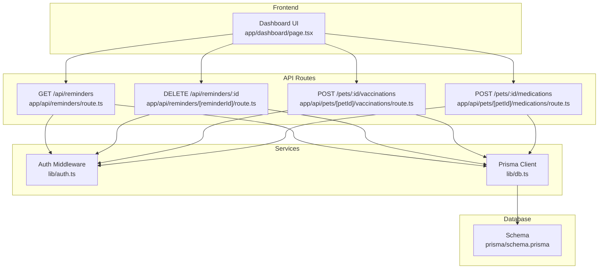
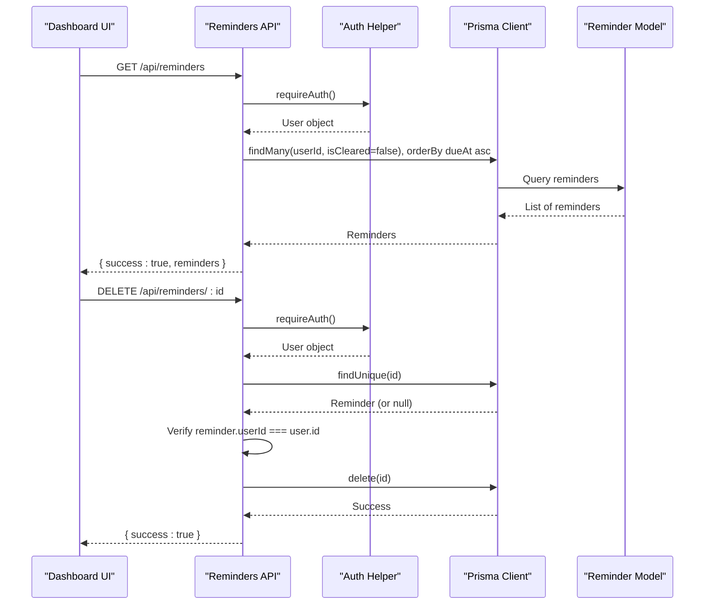
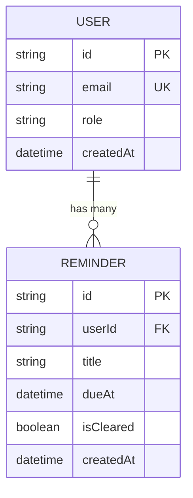
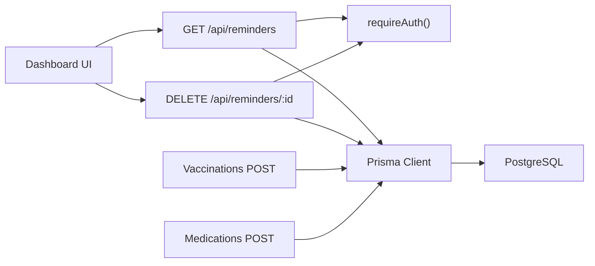

# Reminder System

<cite>
**Referenced Files in This Document**
- [route.ts](file://app/api/reminders/route.ts)
- [route.ts](file://app/api/reminders/[reminderId]/route.ts)
- [schema.prisma](file://prisma/schema.prisma)
- [auth.ts](file://lib/auth.ts)
- [db.ts](file://lib/db.ts)
- [route.ts](file://app/api/pets/[petId]/vaccinations/route.ts)
- [route.ts](file://app/api/pets/[petId]/medications/route.ts)
- [page.tsx](file://app/dashboard/page.tsx)
- [verify_handoff.js](file://verify_handoff.js)
</cite>

## Table of Contents
1. [Introduction](#introduction)
2. [Project Structure](#project-structure)
3. [Core Components](#core-components)
4. [Architecture Overview](#architecture-overview)
5. [Detailed Component Analysis](#detailed-component-analysis)
6. [Dependency Analysis](#dependency-analysis)
7. [Performance Considerations](#performance-considerations)
8. [Troubleshooting Guide](#troubleshooting-guide)
9. [Conclusion](#conclusion)

## Introduction
This document explains the Reminder System implemented in the pet healthcare application. It covers how reminders are created, retrieved, and cleared; how they integrate with vaccinations and medications; and how authentication and authorization protect user data. The system uses Next.js API routes backed by a Prisma-managed PostgreSQL database.

## Project Structure
The reminder feature is centered around:
- API endpoints for listing and clearing reminders
- Automatic creation of reminders when recording vaccinations or medications
- A dashboard UI that fetches and displays reminders
- Database schema defining the Reminder model and its relationships

**Diagram sources**
- [route.ts:7-29](file://app/api/reminders/route.ts#L7-L29)
- [route.ts:8-45](file://app/api/reminders/[reminderId]/route.ts#L8-L45)
- [route.ts:51-155](file://app/api/pets/[petId]/vaccinations/route.ts#L51-L155)
- [route.ts:51-158](file://app/api/pets/[petId]/medications/route.ts#L51-L158)
- [auth.ts:109-115](file://lib/auth.ts#L109-L115)
- [db.ts:1-33](file://lib/db.ts#L1-L33)
- [schema.prisma:275-283](file://prisma/schema.prisma#L275-L283)

**Section sources**
- [route.ts:7-29](file://app/api/reminders/route.ts#L7-L29)
- [route.ts:8-45](file://app/api/reminders/[reminderId]/route.ts#L8-L45)
- [route.ts:51-155](file://app/api/pets/[petId]/vaccinations/route.ts#L51-L155)
- [route.ts:51-158](file://app/api/pets/[petId]/medications/route.ts#L51-L158)
- [schema.prisma:275-283](file://prisma/schema.prisma#L275-L283)
- [auth.ts:109-115](file://lib/auth.ts#L109-L115)
- [db.ts:1-33](file://lib/db.ts#L1-L33)
- [page.tsx:226-236](file://app/dashboard/page.tsx#L226-L236)

## Core Components
- Reminder retrieval endpoint: lists non-cleared reminders for the authenticated user, ordered by due date ascending.
- Reminder clearance endpoint: deletes a reminder after verifying ownership against the session user.
- Reminder creation triggers:
  - Vaccination record with a due date creates a reminder for the owner.
  - Medication course with an end date creates a reminder for the owner.
- Dashboard integration: fetches reminders and renders them with due-date labels and badges.

Key behaviors:
- Authentication is enforced via a server-side auth helper that throws on missing sessions.
- Ownership checks are performed server-side using the session user ID, not client-supplied IDs.
- Reminders are stored with title, due date, and cleared flag; only non-cleared reminders are returned by default.

**Section sources**
- [route.ts:7-29](file://app/api/reminders/route.ts#L7-L29)
- [route.ts:8-45](file://app/api/reminders/[reminderId]/route.ts#L8-L45)
- [route.ts:120-142](file://app/api/pets/[petId]/vaccinations/route.ts#L120-L142)
- [route.ts:120-144](file://app/api/pets/[petId]/medications/route.ts#L120-L144)
- [schema.prisma:275-283](file://prisma/schema.prisma#L275-L283)
- [page.tsx:226-236](file://app/dashboard/page.tsx#L226-L236)

## Architecture Overview
The Reminder System follows a standard Next.js API route pattern with server-side authentication and Prisma data access.

**Diagram sources**
- [route.ts:7-29](file://app/api/reminders/route.ts#L7-L29)
- [route.ts:8-45](file://app/api/reminders/[reminderId]/route.ts#L8-L45)
- [auth.ts:109-115](file://lib/auth.ts#L109-L115)
- [schema.prisma:275-283](file://prisma/schema.prisma#L275-L283)

## Detailed Component Analysis

### Reminder Retrieval Endpoint
- Purpose: Return all pending (non-cleared) reminders for the current user, sorted by due date ascending.
- Security: Requires authentication; returns 401 if unauthenticated.
- Data access: Uses Prisma to filter by userId and isCleared=false.

Error handling:
- Unauthenticated requests return a standardized error response.
- Unexpected errors return a generic internal server error.

**Section sources**
- [route.ts:7-29](file://app/api/reminders/route.ts#L7-L29)

### Reminder Clearance Endpoint
- Purpose: Delete a specific reminder owned by the authenticated user.
- Security:
  - Requires authentication.
  - Verifies ownership by comparing reminder.userId with the session user’s id.
  - Returns 404 if the reminder does not exist.
  - Returns 403 if the user attempts to clear another user’s reminder.
- Data access: Deletes the reminder by id.

**Section sources**
- [route.ts:8-45](file://app/api/reminders/[reminderId]/route.ts#L8-L45)

### Reminder Creation Triggers

#### Vaccination Reminder Creation
- Trigger: Creating a vaccination record with a valid due date.
- Behavior: After saving the vaccination, a reminder is created for the owner with a title indicating the vaccine name and pet name, and dueAt set to the due date.
- Validation: Ensures administered date is valid and not in the future; ensures due date is after administered date.

**Section sources**
- [route.ts:51-155](file://app/api/pets/[petId]/vaccinations/route.ts#L51-L155)

#### Medication Reminder Creation
- Trigger: Creating a medication course with an end date.
- Behavior: After saving the medication, a reminder is created for the owner with a title indicating the medication name and pet name, and dueAt set to the end date.
- Validation: Ensures start and end dates are valid and end date is after start date.

**Section sources**
- [route.ts:51-158](file://app/api/pets/[petId]/medications/route.ts#L51-L158)

### Dashboard Integration
- Fetches reminders from the API and renders them in the Health Reminders section.
- Displays due-date labels and color-coded badges based on urgency.
- Provides a way to refresh reminders and interact with individual items.

**Section sources**
- [page.tsx:226-236](file://app/dashboard/page.tsx#L226-L236)
- [page.tsx:996-1013](file://app/dashboard/page.tsx#L996-L1013)

### Database Schema and Relationships
- Reminder model includes:
  - id (primary key)
  - userId (foreign key to User)
  - title (string)
  - dueAt (datetime)
  - isCleared (boolean, default false)
  - createdAt (datetime)
- Relationship: Each reminder belongs to a User; cascade deletion is configured.

**Diagram sources**
- [schema.prisma:30-55](file://prisma/schema.prisma#L30-L55)
- [schema.prisma:275-283](file://prisma/schema.prisma#L275-L283)

**Section sources**
- [schema.prisma:275-283](file://prisma/schema.prisma#L275-L283)

## Dependency Analysis
- API routes depend on:
  - Authentication helper for session validation and user resolution.
  - Prisma client for database operations.
- Prisma client depends on:
  - Environment configuration for database connection pooling.
- Dashboard UI depends on:
  - API endpoints to retrieve and manage reminders.
- Tests validate:
  - Reminder creation during vaccination and medication flows.
  - Ownership enforcement when clearing reminders across users.

**Diagram sources**
- [route.ts:7-29](file://app/api/reminders/route.ts#L7-L29)
- [route.ts:8-45](file://app/api/reminders/[reminderId]/route.ts#L8-L45)
- [route.ts:51-155](file://app/api/pets/[petId]/vaccinations/route.ts#L51-L155)
- [route.ts:51-158](file://app/api/pets/[petId]/medications/route.ts#L51-L158)
- [auth.ts:109-115](file://lib/auth.ts#L109-L115)
- [db.ts:1-33](file://lib/db.ts#L1-L33)

**Section sources**
- [verify_handoff.js:287-307](file://verify_handoff.js#L287-L307)

## Performance Considerations
- Query efficiency:
  - Listing reminders filters by userId and isCleared=false and orders by dueAt, which should be indexed for performance.
- Connection pooling:
  - Production uses a dedicated pool; development reuses global instances to avoid leaks.
- Minimize payload:
  - Only non-cleared reminders are returned by default, reducing unnecessary data transfer.

[No sources needed since this section provides general guidance]

## Troubleshooting Guide
Common issues and resolutions:
- Unauthorized access:
  - Ensure the session cookie is present and valid; the auth helper will throw if missing or expired.
- Not found:
  - When clearing a reminder, verify the reminder exists before attempting deletion.
- Forbidden:
  - Ownership check prevents clearing another user’s reminders; ensure the request is made with the correct session.
- Internal server error:
  - Check database connectivity and Prisma client initialization; review logs for unexpected exceptions.

Validation pitfalls:
- Vaccination due date must be after administered date.
- Medication end date must be after start date.
- Missing required fields (e.g., vaccine name, dosage, frequency) result in bad request responses.

**Section sources**
- [route.ts:8-45](file://app/api/reminders/[reminderId]/route.ts#L8-L45)
- [route.ts:51-155](file://app/api/pets/[petId]/vaccinations/route.ts#L51-L155)
- [route.ts:51-158](file://app/api/pets/[petId]/medications/route.ts#L51-L158)
- [auth.ts:109-115](file://lib/auth.ts#L109-L115)

## Conclusion
The Reminder System integrates seamlessly with vaccination and medication workflows to proactively notify pet owners about upcoming or ending care tasks. It enforces strong authentication and ownership controls, ensuring users can only manage their own reminders. The design leverages Next.js API routes, Prisma ORM, and a straightforward database schema to provide reliable and maintainable functionality.