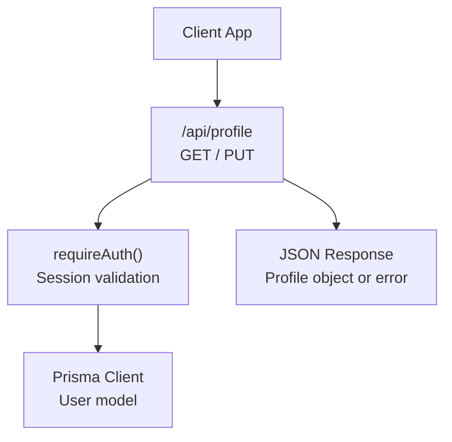
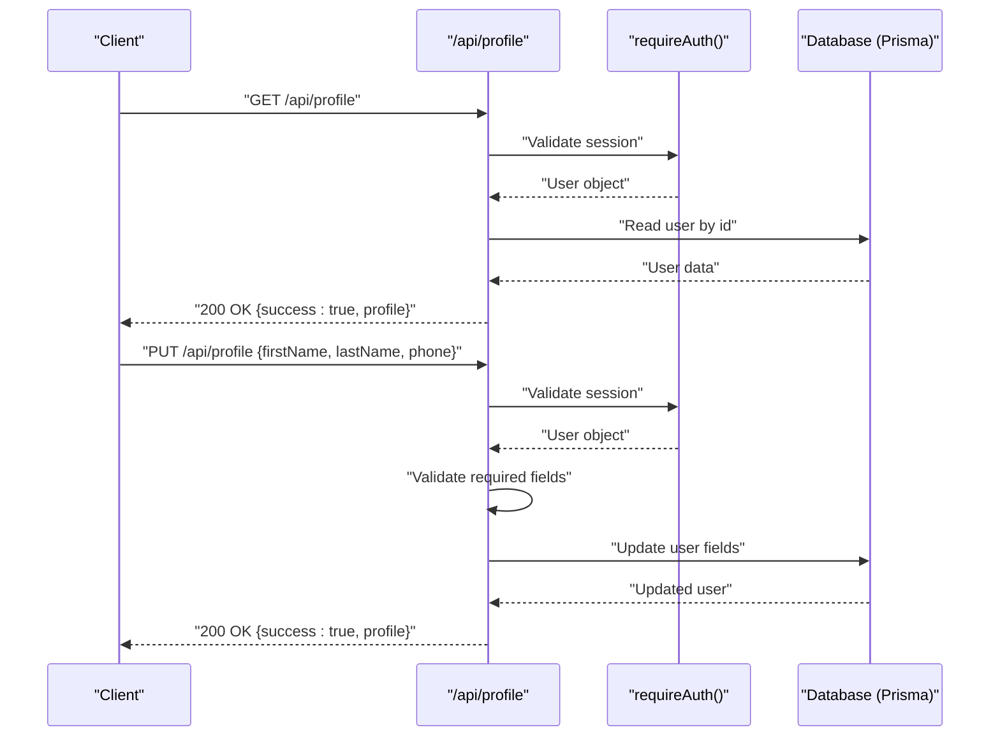
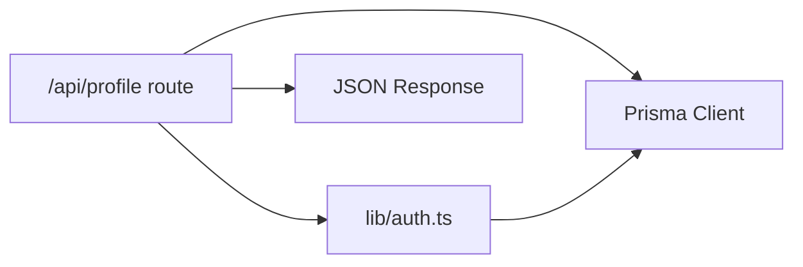
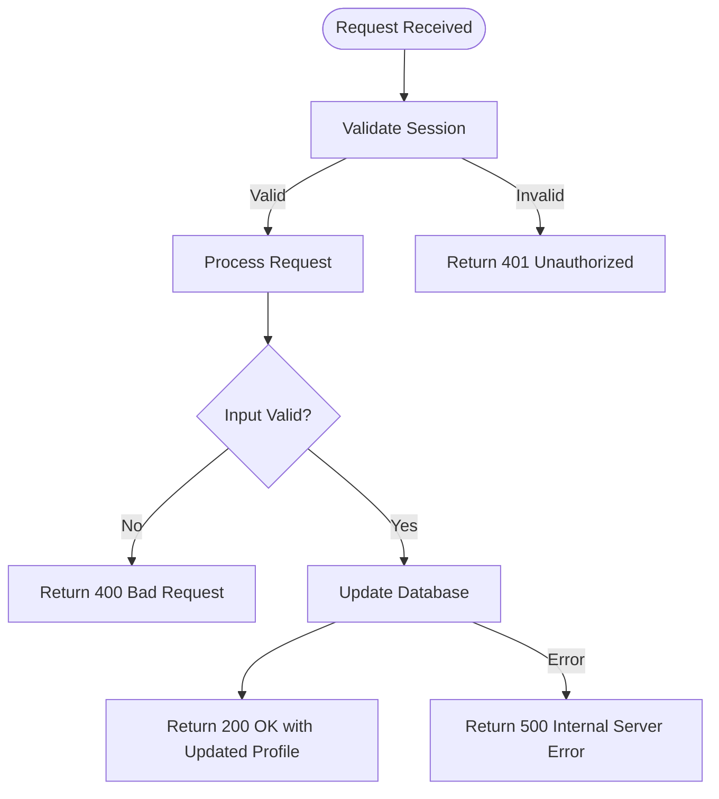

# User Profile API

<cite>
**Referenced Files in This Document**
- [app/api/profile/route.ts](file://app/api/profile/route.ts)
- [app/api/auth/me/route.ts](file://app/api/auth/me/route.ts)
- [lib/auth.ts](file://lib/auth.ts)
- [prisma/schema.prisma](file://prisma/schema.prisma)
- [docs/03-architecture/03-api-specification.md](file://docs/03-architecture/03-api-specification.md)
</cite>

## Table of Contents
1. [Introduction](#introduction)
2. [Project Structure](#project-structure)
3. [Core Components](#core-components)
4. [Architecture Overview](#architecture-overview)
5. [Detailed Component Analysis](#detailed-component-analysis)
6. [Dependency Analysis](#dependency-analysis)
7. [Performance Considerations](#performance-considerations)
8. [Troubleshooting Guide](#troubleshooting-guide)
9. [Conclusion](#conclusion)
10. [Appendices](#appendices)

## Introduction
This document provides detailed API documentation for user profile management endpoints in the PETIVA system, focusing on profile retrieval and updates under /api/profile. It covers HTTP methods, request/response schemas, validation rules, error handling, privacy controls, and synchronization with authentication systems. Where applicable, it also outlines related workflows such as authentication and session management that support profile operations.

## Project Structure
The profile management functionality is implemented as Next.js Route Handlers:
- GET /api/profile: Retrieve the authenticated user’s profile
- PUT /api/profile: Update personal information fields (first name, last name, phone)

Authentication is enforced via a shared auth module that validates sessions stored in secure HttpOnly cookies and returns the current user context to protected routes.

**Diagram sources**
- [app/api/profile/route.ts:6-81](file://app/api/profile/route.ts#L6-L81)
- [lib/auth.ts:100-115](file://lib/auth.ts#L100-L115)
- [prisma/schema.prisma:30-53](file://prisma/schema.prisma#L30-L53)

**Section sources**
- [app/api/profile/route.ts:6-81](file://app/api/profile/route.ts#L6-L81)
- [lib/auth.ts:100-115](file://lib/auth.ts#L100-L115)
- [prisma/schema.prisma:30-53](file://prisma/schema.prisma#L30-L53)

## Core Components
- Profile Route Handler: Provides GET and PUT endpoints for retrieving and updating the authenticated owner’s profile.
- Authentication Module: Validates sessions from cookies, enforces authentication, and exposes the current user.
- Data Model: The User entity defines profile fields including email, role, names, phone, and timestamps.

Key responsibilities:
- Enforce authentication before any profile operation
- Validate input fields for updates
- Persist changes to the database using Prisma
- Return standardized success/error responses

**Section sources**
- [app/api/profile/route.ts:6-81](file://app/api/profile/route.ts#L6-L81)
- [lib/auth.ts:100-115](file://lib/auth.ts#L100-L115)
- [prisma/schema.prisma:30-53](file://prisma/schema.prisma#L30-L53)

## Architecture Overview
The profile API follows a standard request flow:
1. Client sends a request to /api/profile with an authenticated session cookie.
2. The route handler calls requireAuth() to validate the session and retrieve the current user.
3. For GET, the handler returns a sanitized profile object.
4. For PUT, the handler validates input, updates the user record, and returns the updated profile.
5. Errors are returned in a consistent JSON envelope with appropriate HTTP status codes.

**Diagram sources**
- [app/api/profile/route.ts:6-81](file://app/api/profile/route.ts#L6-L81)
- [lib/auth.ts:100-115](file://lib/auth.ts#L100-L115)
- [prisma/schema.prisma:30-53](file://prisma/schema.prisma#L30-L53)

## Detailed Component Analysis

### Endpoint: GET /api/profile
- Purpose: Retrieve the authenticated user’s profile.
- Authentication: Required (session cookie).
- Authorization: Any authenticated user can read their own profile.
- Request: No body; relies on session cookie.
- Response (200 OK):
  - success: boolean
  - profile: object containing id, email, role, firstName, lastName, phone, createdAt
- Error Responses:
  - 401 Unauthorized: Not logged in
  - 500 Internal Server Error: Unexpected server error

Validation Rules:
- None for input (read-only endpoint).

Example Success Response:
- { success: true, profile: { id, email, role, firstName, lastName, phone, createdAt } }

Example Error Response:
- { success: false, error: { code: "UNAUTHORIZED", message: "Not logged in." } }

**Section sources**
- [app/api/profile/route.ts:6-34](file://app/api/profile/route.ts#L6-L34)
- [lib/auth.ts:100-115](file://lib/auth.ts#L100-L115)

### Endpoint: PUT /api/profile
- Purpose: Update personal information fields for the authenticated user.
- Authentication: Required (session cookie).
- Authorization: Any authenticated user can update their own profile.
- Request Body:
  - firstName: string (required)
  - lastName: string (required)
  - phone: string (optional)
- Response (200 OK):
  - success: boolean
  - profile: object containing id, email, role, firstName, lastName, phone
- Error Responses:
  - 400 Bad Request: Missing required fields (firstName, lastName)
  - 401 Unauthorized: Not logged in
  - 500 Internal Server Error: Unexpected server error

Validation Rules:
- firstName and lastName are required.
- phone is optional.

Example Request:
- { firstName: "Jane", lastName: "Doe", phone: "+15551234567" }

Example Success Response:
- { success: true, profile: { id, email, role, firstName, lastName, phone } }

Example Validation Error:
- { success: false, error: { code: "BAD_REQUEST", message: "First name and last name are required." } }

**Section sources**
- [app/api/profile/route.ts:36-81](file://app/api/profile/route.ts#L36-L81)

### Related Endpoint: GET /api/auth/me
- Purpose: Retrieve current user identity and basic profile info for UI state.
- Authentication: Required (session cookie).
- Response (200 OK):
  - success: boolean
  - user: object containing id, email, role, firstName, lastName
- Error Responses:
  - 401 Unauthorized: Not logged in
  - 500 Internal Server Error: Unexpected server error

Note: This endpoint complements profile operations by providing minimal user context without requiring full profile details.

**Section sources**
- [app/api/auth/me/route.ts:4-32](file://app/api/auth/me/route.ts#L4-L32)

### Authentication and Session Management
- Sessions are stored securely using HttpOnly cookies with token hashing and expiration checks.
- requireAuth() ensures requests to protected routes have a valid session; otherwise, throws UNAUTHENTICATED.
- getCurrentUser() retrieves the authenticated user if present.

Security Notes:
- Tokens are hashed before storage and comparison.
- Sessions expire after a defined duration and may be extended near expiry.
- Cookies are set with secure flags in production environments.

**Section sources**
- [lib/auth.ts:23-97](file://lib/auth.ts#L23-L97)
- [lib/auth.ts:100-115](file://lib/auth.ts#L100-L115)

### Data Model and Fields
- User model includes:
  - id, email (unique), passwordHash (optional), role, firstName, lastName, phone, createdAt, updatedAt
- Role-based access control supports different roles (e.g., PET_OWNER, VETERINARIAN, CLINIC_ADMIN, PLATFORM_ADMIN).

Privacy Controls:
- Only authenticated users can access or modify their own profile.
- Sensitive fields like passwordHash are not exposed in profile responses.

**Section sources**
- [prisma/schema.prisma:30-53](file://prisma/schema.prisma#L30-L53)
- [prisma/schema.prisma:9-14](file://prisma/schema.prisma#L9-L14)

## Dependency Analysis
The profile endpoints depend on:
- Next.js Request/Response objects for handling HTTP traffic
- Prisma Client for database interactions
- Auth module for session validation and user retrieval

**Diagram sources**
- [app/api/profile/route.ts:1-81](file://app/api/profile/route.ts#L1-L81)
- [lib/auth.ts:1-125](file://lib/auth.ts#L1-L125)
- [prisma/schema.prisma:30-53](file://prisma/schema.prisma#L30-L53)

**Section sources**
- [app/api/profile/route.ts:1-81](file://app/api/profile/route.ts#L1-L81)
- [lib/auth.ts:1-125](file://lib/auth.ts#L1-L125)

## Performance Considerations
- Minimal payload: Profile endpoints return only necessary fields to reduce bandwidth.
- Database queries: Single read/update per request; ensure indexes exist on frequently queried fields (e.g., userId in sessions).
- Session caching: Sliding window extension reduces frequent re-authentication overhead.

[No sources needed since this section provides general guidance]

## Troubleshooting Guide
Common issues and resolutions:
- 401 Unauthorized: Ensure the client sends a valid session cookie. Verify login flow sets the cookie correctly.
- 400 Bad Request: Include both firstName and lastName in PUT requests. Validate field presence before sending.
- 500 Internal Server Error: Check server logs for unexpected errors; verify database connectivity and Prisma configuration.

Error Handling Patterns:
- Consistent JSON envelope with success flag and error object containing code and message.
- Specific error codes: UNAUTHORIZED, BAD_REQUEST, INTERNAL_SERVER_ERROR.

**Section sources**
- [app/api/profile/route.ts:22-33](file://app/api/profile/route.ts#L22-L33)
- [app/api/profile/route.ts:69-81](file://app/api/profile/route.ts#L69-L81)
- [docs/03-architecture/03-api-specification.md:7-22](file://docs/03-architecture/03-api-specification.md#L7-L22)

## Conclusion
The PETIVA profile API provides secure, validated endpoints for retrieving and updating user profiles. Authentication is enforced through session cookies, and inputs are validated to ensure data integrity. The design emphasizes simplicity, security, and consistency in responses and errors. Future enhancements could include additional profile fields, notification preferences, and file upload capabilities aligned with existing patterns.

[No sources needed since this section summarizes without analyzing specific files]

## Appendices

### Workflow Examples

#### Updating Personal Information
- Method: PUT
- Route: /api/profile
- Request Body: { firstName, lastName, phone? }
- Success Response: { success: true, profile: { id, email, role, firstName, lastName, phone } }
- Validation: firstName and lastName required

**Section sources**
- [app/api/profile/route.ts:36-81](file://app/api/profile/route.ts#L36-L81)

#### Changing Passwords
- Note: Current profile endpoints do not handle password changes. Use the authentication flow to manage credentials securely. If implementing password updates, follow similar validation and hashing patterns used in registration and login.

[No sources needed since this section provides general guidance]

#### Managing Notification Preferences
- Note: Notification preferences are not currently exposed via profile endpoints. Extend the User model and profile update logic to support toggling notification settings while maintaining validation and privacy controls.

[No sources needed since this section provides general guidance]

#### Profile Photo Uploads
- Note: Profile photo uploads are not implemented in the profile endpoints. Follow the existing document upload pattern to generate presigned URLs and associate uploaded files with user records securely.

[No sources needed since this section provides general guidance]

### Error Handling Flow

**Diagram sources**
- [app/api/profile/route.ts:6-81](file://app/api/profile/route.ts#L6-L81)
- [lib/auth.ts:100-115](file://lib/auth.ts#L100-L115)