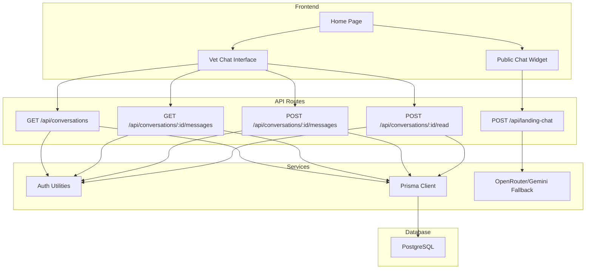
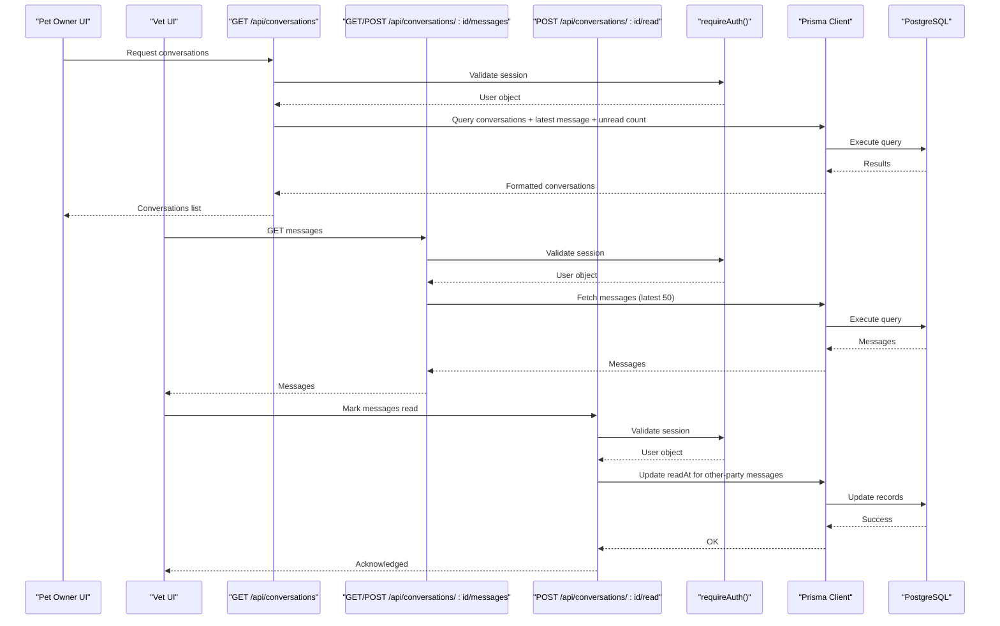
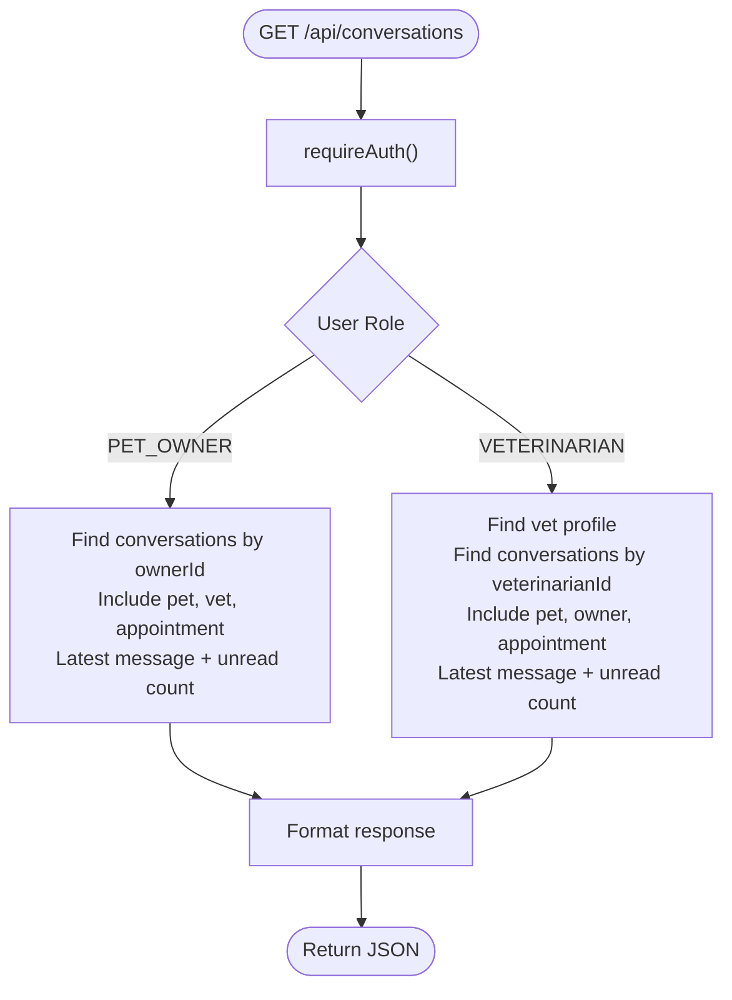
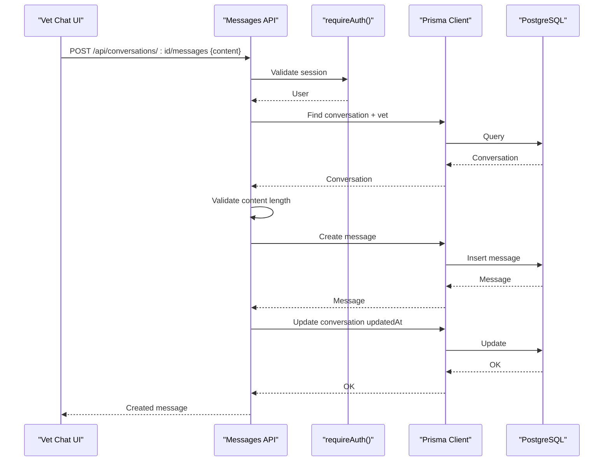
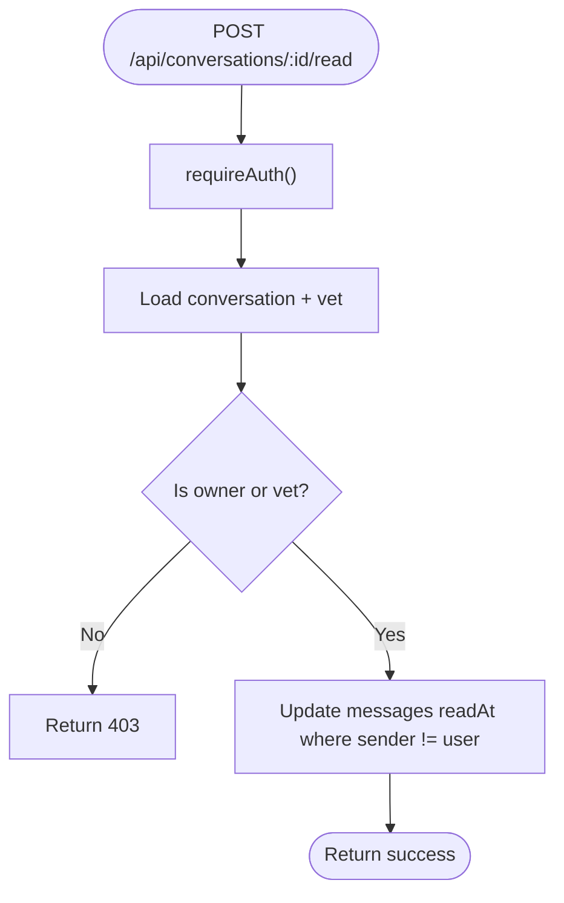
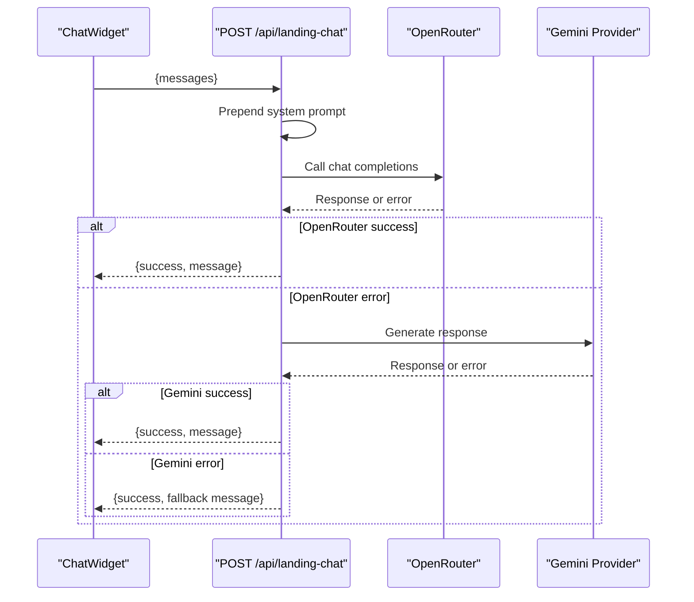
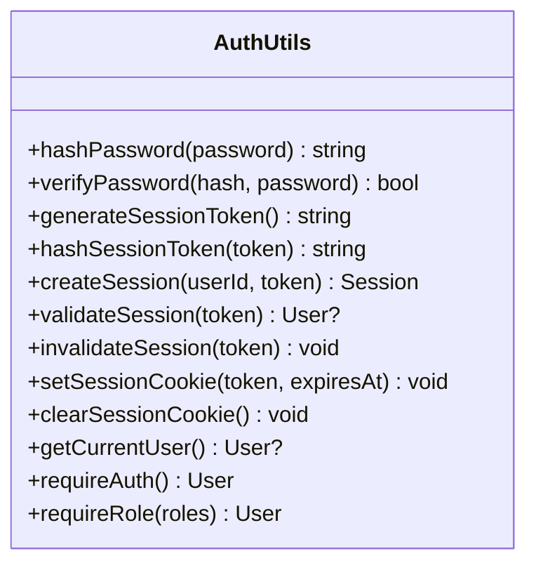
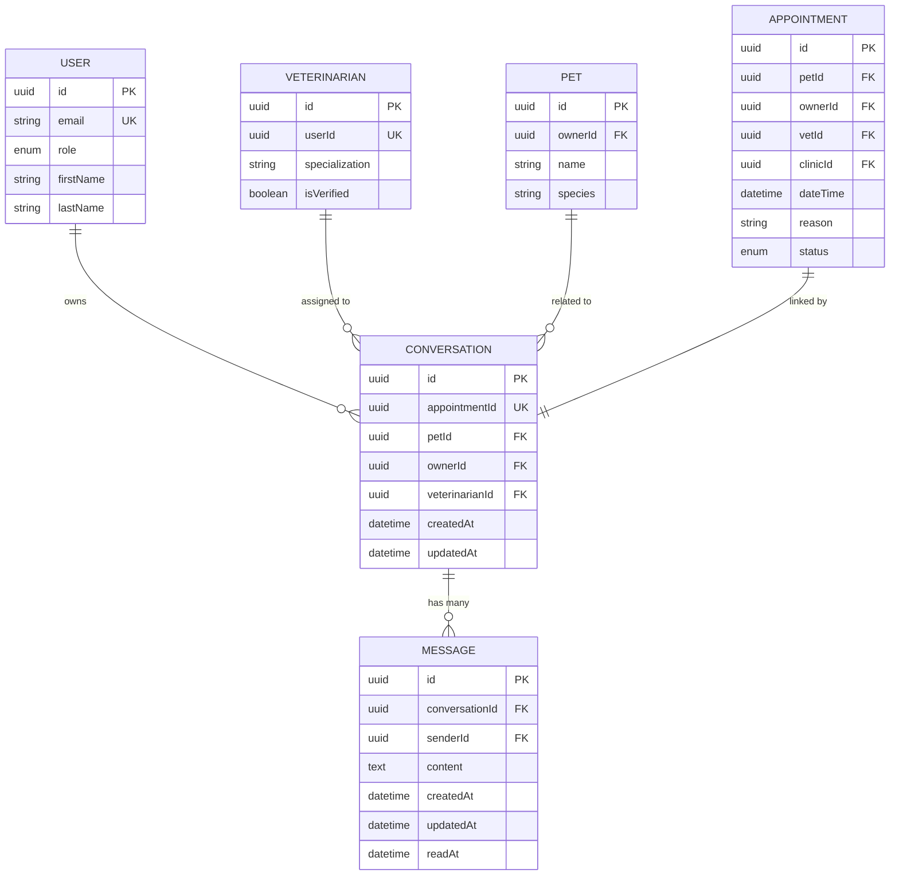
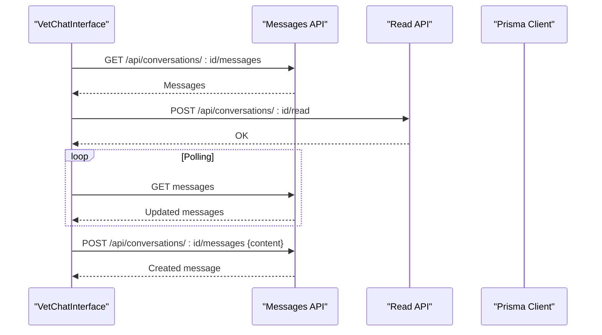
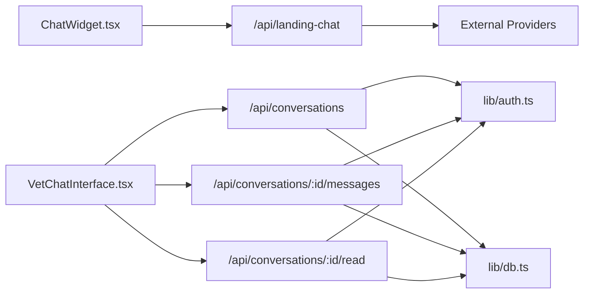

# Veterinary Chat Messaging System

<cite>
**Referenced Files in This Document**
- [README.md](file://README.md)
- [package.json](file://package.json)
- [schema.prisma](file://prisma/schema.prisma)
- [db.ts](file://lib/db.ts)
- [auth.ts](file://lib/auth.ts)
- [route.ts (conversations)](file://app/api/conversations/route.ts)
- [route.ts (messages)](file://app/api/conversations/[conversationId]/messages/route.ts)
- [route.ts (read)](file://app/api/conversations/[conversationId]/read/route.ts)
- [route.ts (landing-chat)](file://app/api/landing-chat/route.ts)
- [ChatWidget.tsx](file://app/components/ChatWidget.tsx)
- [VetChatInterface.tsx](file://app/components/VetChatInterface.tsx)
- [page.tsx (home)](file://app/page.tsx)
</cite>

## Table of Contents
1. [Introduction](#introduction)
2. [Project Structure](#project-structure)
3. [Core Components](#core-components)
4. [Architecture Overview](#architecture-overview)
5. [Detailed Component Analysis](#detailed-component-analysis)
6. [Dependency Analysis](#dependency-analysis)
7. [Performance Considerations](#performance-considerations)
8. [Troubleshooting Guide](#troubleshooting-guide)
9. [Conclusion](#conclusion)

## Introduction
This document describes the Veterinary Chat Messaging System built with Next.js, Prisma, and PostgreSQL. It enables pet owners and veterinarians to communicate via conversation threads tied to appointments or pets, supports read receipts, and includes a public AI assistant for platform help on the landing page. The system uses database-backed sessions for secure authentication and role-based access control across owner and vet interfaces.

## Project Structure
The application follows a feature-oriented structure:
- API routes under app/api handle authentication, conversations, messages, and AI chat.
- UI components include a public chat widget and a vet-facing chat interface.
- Data models are defined in Prisma schema; database connections are managed centrally.
- Authentication utilities provide session management and authorization helpers.

**Diagram sources**
- [page.tsx (home):1-223](file://app/page.tsx#L1-L223)
- [ChatWidget.tsx:1-149](file://app/components/ChatWidget.tsx#L1-L149)
- [VetChatInterface.tsx:1-222](file://app/components/VetChatInterface.tsx#L1-L222)
- [route.ts (conversations):1-90](file://app/api/conversations/route.ts#L1-L90)
- [route.ts (messages):1-104](file://app/api/conversations/[conversationId]/messages/route.ts#L1-L104)
- [route.ts (read):1-50](file://app/api/conversations/[conversationId]/read/route.ts#L1-L50)
- [route.ts (landing-chat):1-113](file://app/api/landing-chat/route.ts#L1-L113)
- [auth.ts:1-125](file://lib/auth.ts#L1-L125)
- [db.ts:1-33](file://lib/db.ts#L1-L33)

**Section sources**
- [README.md:1-37](file://README.md#L1-L37)
- [package.json:1-36](file://package.json#L1-L36)

## Core Components
- Conversations API: Lists conversations for authenticated users based on role (pet owner or veterinarian), including latest message and unread counts.
- Messages API: Retrieves recent messages for a conversation and creates new messages with validation and authorization checks.
- Read Receipts API: Marks unread messages from the other party as read when a user opens a conversation.
- Public AI Assistant: Handles unauthenticated chat queries with OpenRouter and fallback providers.
- Authentication: Database-backed sessions using HttpOnly cookies, password hashing with Argon2, and role-based guards.
- UI Components: A floating public chat widget and a vet dashboard chat interface with polling for real-time updates.

**Section sources**
- [route.ts (conversations):1-90](file://app/api/conversations/route.ts#L1-L90)
- [route.ts (messages):1-104](file://app/api/conversations/[conversationId]/messages/route.ts#L1-L104)
- [route.ts (read):1-50](file://app/api/conversations/[conversationId]/read/route.ts#L1-L50)
- [route.ts (landing-chat):1-113](file://app/api/landing-chat/route.ts#L1-L113)
- [auth.ts:1-125](file://lib/auth.ts#L1-L125)
- [ChatWidget.tsx:1-149](file://app/components/ChatWidget.tsx#L1-L149)
- [VetChatInterface.tsx:1-222](file://app/components/VetChatInterface.tsx#L1-L222)

## Architecture Overview
The system is a Next.js full-stack application with server-side API routes that enforce authentication and authorization before interacting with a PostgreSQL database via Prisma. The vet chat interface polls for new messages to simulate real-time updates. The public landing chat integrates an external AI provider with fallback logic.

**Diagram sources**
- [route.ts (conversations):1-90](file://app/api/conversations/route.ts#L1-L90)
- [route.ts (messages):1-104](file://app/api/conversations/[conversationId]/messages/route.ts#L1-L104)
- [route.ts (read):1-50](file://app/api/conversations/[conversationId]/read/route.ts#L1-L50)
- [auth.ts:1-125](file://lib/auth.ts#L1-L125)
- [db.ts:1-33](file://lib/db.ts#L1-L33)

## Detailed Component Analysis

### Conversations API
- Purpose: Retrieve conversations for the authenticated user, tailored by role (pet owner vs veterinarian). Includes related entities (pet, owner, veterinarian, appointment) and computes unread counts for messages not yet read by the current user.
- Key behaviors:
  - Role-based filtering: Owners see their own conversations; vets see conversations assigned to them.
  - Latest message inclusion: Optimized to fetch only the most recent message per conversation.
  - Unread count: Counts messages where sender is not the current user and readAt is null.
- Error handling: Returns 401 for unauthenticated requests and 403 for forbidden roles.

**Diagram sources**
- [route.ts (conversations):1-90](file://app/api/conversations/route.ts#L1-L90)
- [auth.ts:1-125](file://lib/auth.ts#L1-L125)

**Section sources**
- [route.ts (conversations):1-90](file://app/api/conversations/route.ts#L1-L90)

### Messages API
- Purpose: Manage message retrieval and creation within a conversation.
- Retrieval:
  - Authorization: Ensures the requester is either the pet owner or the assigned veterinarian.
  - Pagination: Limits to the latest 50 messages for performance.
  - Response ordering: Reverses fetched messages to chronological order.
- Creation:
  - Validation: Enforces non-empty content and maximum length constraints.
  - Authorization: Same ownership checks as retrieval.
  - Persistence: Creates message record and updates conversation updatedAt timestamp.
- Error handling: Returns appropriate status codes for validation failures, authorization issues, and server errors.

**Diagram sources**
- [route.ts (messages):1-104](file://app/api/conversations/[conversationId]/messages/route.ts#L1-L104)
- [auth.ts:1-125](file://lib/auth.ts#L1-L125)
- [db.ts:1-33](file://lib/db.ts#L1-L33)

**Section sources**
- [route.ts (messages):1-104](file://app/api/conversations/[conversationId]/messages/route.ts#L1-L104)

### Read Receipts API
- Purpose: Mark unread messages from the other party as read when a user views a conversation.
- Behavior:
  - Authorization: Validates user role and association with the conversation.
  - Update: Sets readAt timestamps for messages sent by others in the same conversation.
- Error handling: Returns 401/403 for auth issues and 500 for server errors.

**Diagram sources**
- [route.ts (read):1-50](file://app/api/conversations/[conversationId]/read/route.ts#L1-L50)
- [auth.ts:1-125](file://lib/auth.ts#L1-L125)

**Section sources**
- [route.ts (read):1-50](file://app/api/conversations/[conversationId]/read/route.ts#L1-L50)

### Public Landing Chat
- Purpose: Provide an unauthenticated AI assistant for general platform questions.
- Flow:
  - Accepts chat history and prepends a system prompt defining scope and behavior.
  - Calls OpenRouter with multiple model fallbacks.
  - Falls back to Gemini if OpenRouter fails.
  - Returns friendly error messages if all providers fail.
- Security: No user data access; strictly scoped to platform information.

**Diagram sources**
- [route.ts (landing-chat):1-113](file://app/api/landing-chat/route.ts#L1-L113)
- [ChatWidget.tsx:1-149](file://app/components/ChatWidget.tsx#L1-L149)

**Section sources**
- [route.ts (landing-chat):1-113](file://app/api/landing-chat/route.ts#L1-L113)
- [ChatWidget.tsx:1-149](file://app/components/ChatWidget.tsx#L1-L149)

### Authentication and Session Management
- Password hashing: Uses Argon2 for secure storage.
- Sessions:
  - Token generation: Cryptographically secure random tokens.
  - Storage: Only hashed tokens stored in the database; plaintext token set in HttpOnly cookie.
  - Expiration: Sliding window with automatic extension near expiry.
- Guards:
  - requireAuth(): Throws UNAUTHENTICATED if no valid session.
  - requireRole(): Enforces role-based access.

**Diagram sources**
- [auth.ts:1-125](file://lib/auth.ts#L1-L125)

**Section sources**
- [auth.ts:1-125](file://lib/auth.ts#L1-L125)

### Database Models Relevant to Chat
- Conversation: Links appointments, pets, owners, and veterinarians; tracks timestamps and relationships to messages.
- Message: Stores content, sender, timestamps, and readAt for read receipts.
- Veterinarian and User: Roles determine access to conversations and messages.

**Diagram sources**
- [schema.prisma:318-349](file://prisma/schema.prisma#L318-L349)
- [schema.prisma:30-55](file://prisma/schema.prisma#L30-L55)
- [schema.prisma:93-109](file://prisma/schema.prisma#L93-L109)
- [schema.prisma:70-91](file://prisma/schema.prisma#L70-L91)
- [schema.prisma:168-187](file://prisma/schema.prisma#L168-L187)

**Section sources**
- [schema.prisma:318-349](file://prisma/schema.prisma#L318-L349)
- [schema.prisma:30-55](file://prisma/schema.prisma#L30-L55)
- [schema.prisma:93-109](file://prisma/schema.prisma#L93-L109)
- [schema.prisma:70-91](file://prisma/schema.prisma#L70-L91)
- [schema.prisma:168-187](file://prisma/schema.prisma#L168-L187)

### UI Components
- ChatWidget: Floating public assistant with markdown rendering and network error handling.
- VetChatInterface: Vet-facing chat with polling every few seconds, optimistic UI updates, and retry mechanisms.

**Diagram sources**
- [VetChatInterface.tsx:1-222](file://app/components/VetChatInterface.tsx#L1-L222)
- [route.ts (messages):1-104](file://app/api/conversations/[conversationId]/messages/route.ts#L1-L104)
- [route.ts (read):1-50](file://app/api/conversations/[conversationId]/read/route.ts#L1-L50)

**Section sources**
- [ChatWidget.tsx:1-149](file://app/components/ChatWidget.tsx#L1-L149)
- [VetChatInterface.tsx:1-222](file://app/components/VetChatInterface.tsx#L1-L222)

## Dependency Analysis
- API routes depend on:
  - Authentication utilities for session validation and role enforcement.
  - Prisma client for database operations.
  - External AI providers for public chat.
- Frontend components depend on:
  - API endpoints for fetching conversations, sending messages, and marking reads.
  - Local state for UI feedback and optimistic updates.

**Diagram sources**
- [ChatWidget.tsx:1-149](file://app/components/ChatWidget.tsx#L1-L149)
- [VetChatInterface.tsx:1-222](file://app/components/VetChatInterface.tsx#L1-L222)
- [route.ts (conversations):1-90](file://app/api/conversations/route.ts#L1-L90)
- [route.ts (messages):1-104](file://app/api/conversations/[conversationId]/messages/route.ts#L1-L104)
- [route.ts (read):1-50](file://app/api/conversations/[conversationId]/read/route.ts#L1-L50)
- [route.ts (landing-chat):1-113](file://app/api/landing-chat/route.ts#L1-L113)
- [auth.ts:1-125](file://lib/auth.ts#L1-L125)
- [db.ts:1-33](file://lib/db.ts#L1-L33)

**Section sources**
- [route.ts (conversations):1-90](file://app/api/conversations/route.ts#L1-L90)
- [route.ts (messages):1-104](file://app/api/conversations/[conversationId]/messages/route.ts#L1-L104)
- [route.ts (read):1-50](file://app/api/conversations/[conversationId]/read/route.ts#L1-L50)
- [route.ts (landing-chat):1-113](file://app/api/landing-chat/route.ts#L1-L113)
- [auth.ts:1-125](file://lib/auth.ts#L1-L125)
- [db.ts:1-33](file://lib/db.ts#L1-L33)

## Performance Considerations
- Message retrieval limits: Fetching the latest 50 messages reduces payload size and improves load times.
- Unread counts: Computed via aggregated queries to avoid client-side counting overhead.
- Polling interval: Vet chat polls every few seconds; consider tuning based on expected message volume and server capacity.
- Database indexing: Ensure indexes on frequently queried fields (e.g., conversationId, createdAt, ownerId, veterinarianId) to optimize lookups.
- AI fallback chain: Multiple model fallbacks reduce latency impact from provider outages but may increase request volume; monitor costs and rate limits.

[No sources needed since this section provides general guidance]

## Troubleshooting Guide
- Authentication failures:
  - Symptoms: 401 responses from protected endpoints.
  - Causes: Missing or expired session cookie; invalid token hash in database.
  - Actions: Verify session cookie presence and expiration; check session cleanup logic.
- Authorization errors:
  - Symptoms: 403 responses when accessing conversations or messages.
  - Causes: User role mismatch or incorrect association with conversation.
  - Actions: Confirm user role and conversation ownership/assignment.
- Message send failures:
  - Symptoms: Validation errors or connection errors.
  - Causes: Empty or overly long content; network issues.
  - Actions: Validate input length; retry with exponential backoff; inspect server logs.
- Read receipt issues:
  - Symptoms: Unread counts not updating.
  - Causes: Failure to mark messages read due to authorization or DB errors.
  - Actions: Verify read endpoint calls and permissions; check database updates.
- AI assistant downtime:
  - Symptoms: Fallback messages or errors.
  - Causes: Provider API failures or missing environment variables.
  - Actions: Ensure OPENROUTER_API_KEY configured; verify fallback provider availability.

**Section sources**
- [route.ts (conversations):1-90](file://app/api/conversations/route.ts#L1-L90)
- [route.ts (messages):1-104](file://app/api/conversations/[conversationId]/messages/route.ts#L1-L104)
- [route.ts (read):1-50](file://app/api/conversations/[conversationId]/read/route.ts#L1-L50)
- [route.ts (landing-chat):1-113](file://app/api/landing-chat/route.ts#L1-L113)
- [auth.ts:1-125](file://lib/auth.ts#L1-L125)

## Conclusion
The Veterinary Chat Messaging System provides a robust foundation for secure, role-based communication between pet owners and veterinarians, complemented by a public AI assistant for platform support. The architecture emphasizes security through database-backed sessions, clear separation of concerns via API routes, and efficient data access patterns. Future enhancements could include WebSocket-based real-time messaging, richer media support, and advanced analytics for conversation metrics.

[No sources needed since this section summarizes without analyzing specific files]