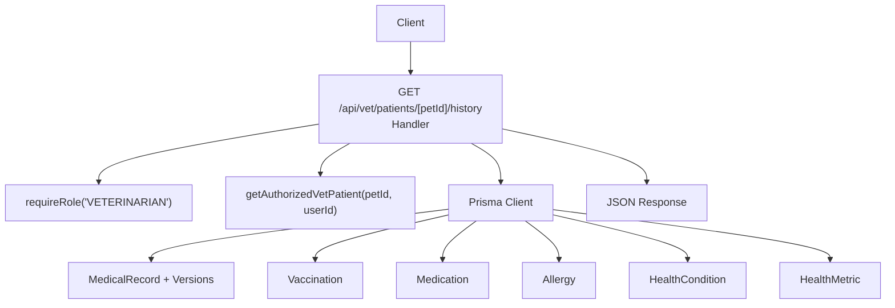
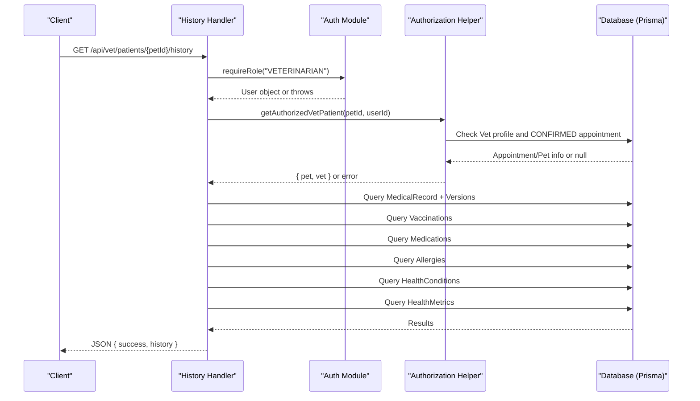
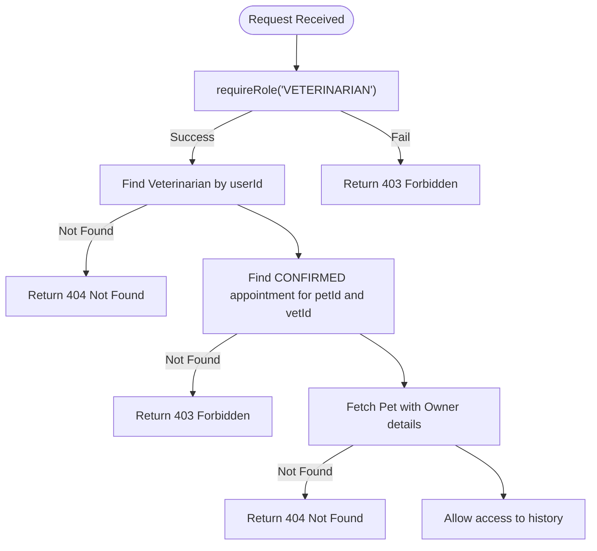
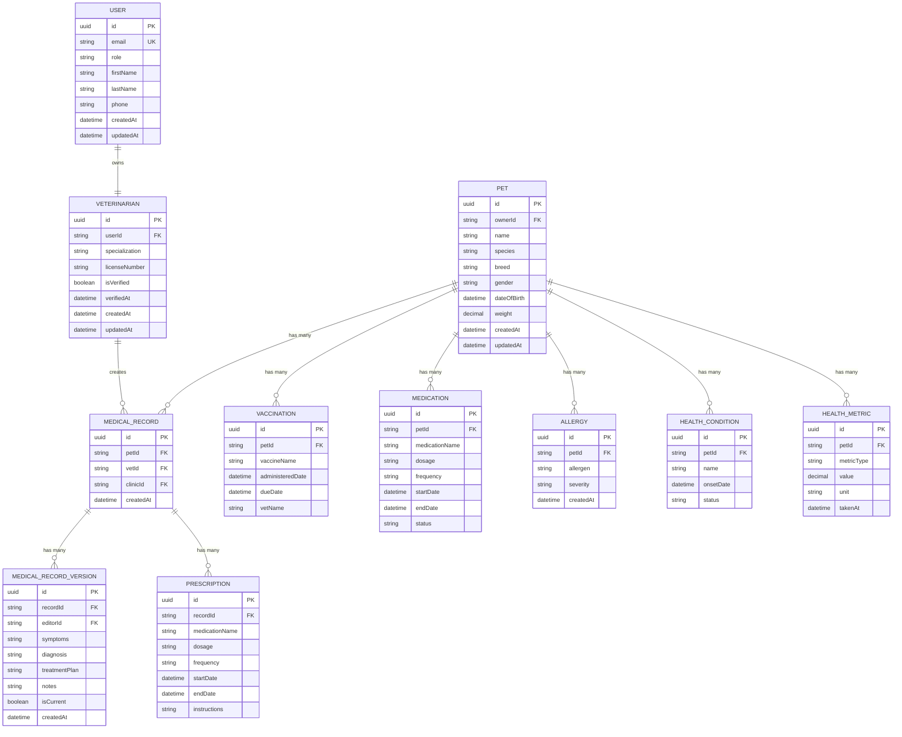
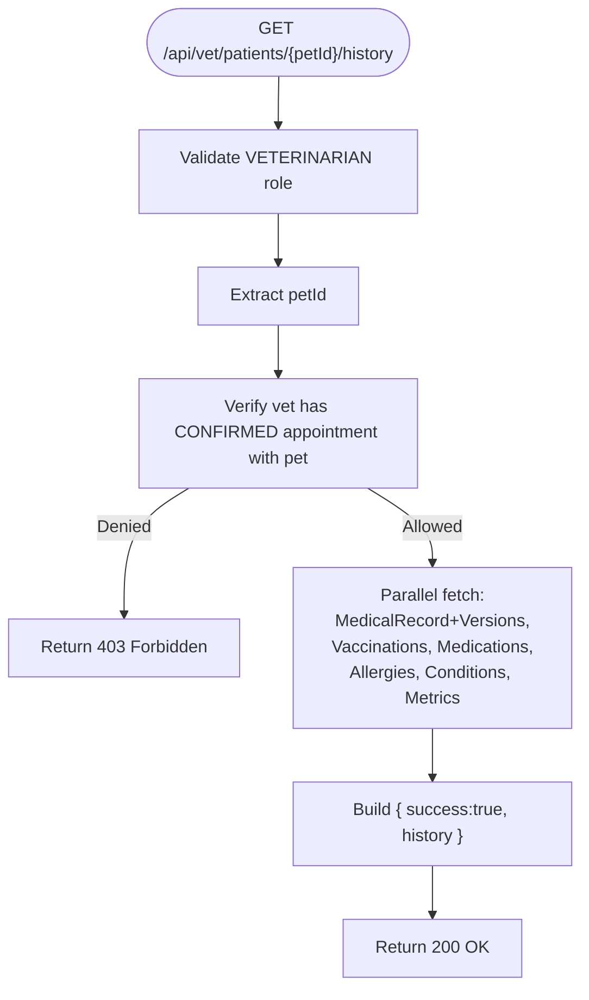
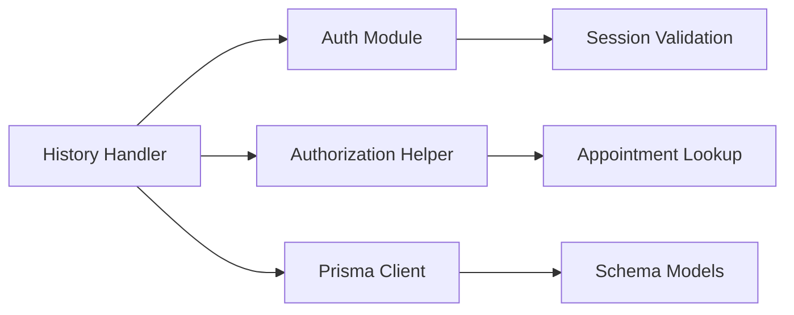

# Medical History API

<cite>
**Referenced Files in This Document**
- [route.ts](file://app/api/vet/patients/[petId]/history/route.ts)
- [route.ts](file://app/api/vet/patients/[petId]/route.ts)
- [auth.ts](file://lib/auth.ts)
- [schema.prisma](file://prisma/schema.prisma)
- [db.ts](file://lib/db.ts)
</cite>

## Table of Contents
1. [Introduction](#introduction)
2. [Project Structure](#project-structure)
3. [Core Components](#core-components)
4. [Architecture Overview](#architecture-overview)
5. [Detailed Component Analysis](#detailed-component-analysis)
6. [Dependency Analysis](#dependency-analysis)
7. [Performance Considerations](#performance-considerations)
8. [Troubleshooting Guide](#troubleshooting-guide)
9. [Conclusion](#conclusion)

## Introduction
This document specifies the GET endpoint for retrieving a complete medical history for a specific patient (pet) under the veterinary namespace: /api/vet/patients/[petId]/history. It covers authorization, request parameters, response schema, data integrity validation, and compliance considerations based on the implemented codebase.

## Project Structure
The endpoint is implemented as a Next.js App Router handler that enforces role-based access, validates vet-patient authorization, and aggregates multiple related records from the database to return a comprehensive medical history payload.

**Diagram sources**
- [route.ts:7-69](file://app/api/vet/patients/[petId]/history/route.ts#L7-L69)
- [route.ts:6-47](file://app/api/vet/patients/[petId]/route.ts#L6-L47)
- [auth.ts:109-124](file://lib/auth.ts#L109-L124)
- [schema.prisma:133-244](file://prisma/schema.prisma#L133-L244)

**Section sources**
- [route.ts:7-69](file://app/api/vet/patients/[petId]/history/route.ts#L7-L69)
- [route.ts:6-47](file://app/api/vet/patients/[petId]/route.ts#L6-L47)
- [auth.ts:109-124](file://lib/auth.ts#L109-L124)
- [schema.prisma:133-244](file://prisma/schema.prisma#L133-L244)

## Core Components
- Authorization: Role check ensures only users with the VETERINARIAN role can call this endpoint.
- Patient Authorization: Confirms the veterinarian has an active CONFIRMED appointment with the pet before exposing any records.
- Data Aggregation: Retrieves medical records with versions, vaccinations, medications, allergies, health conditions, and health metrics for the specified pet.
- Error Handling: Returns standardized error responses for authentication/authorization failures and internal errors.

**Section sources**
- [route.ts:7-69](file://app/api/vet/patients/[petId]/history/route.ts#L7-L69)
- [route.ts:6-47](file://app/api/vet/patients/[petId]/route.ts#L6-L47)
- [auth.ts:109-124](file://lib/auth.ts#L109-L124)

## Architecture Overview
The GET flow performs strict authorization checks and then queries multiple tables concurrently to assemble the full medical history. The response includes structured arrays for each record type, enabling clients to render chronological timelines and summaries.

**Diagram sources**
- [route.ts:7-69](file://app/api/vet/patients/[petId]/history/route.ts#L7-L69)
- [route.ts:6-47](file://app/api/vet/patients/[petId]/route.ts#L6-L47)
- [auth.ts:109-124](file://lib/auth.ts#L109-L124)
- [schema.prisma:133-244](file://prisma/schema.prisma#L133-L244)

## Detailed Component Analysis

### Endpoint Specification: GET /api/vet/patients/[petId]/history
- Purpose: Retrieve complete medical history for a specific pet authorized to the calling veterinarian.
- Authentication: Required. Must be authenticated via session token stored in cookies.
- Authorization: Requires VETERINARIAN role and a confirmed appointment with the pet.
- Path Parameters:
  - petId: string (UUID). Identifies the patient whose history is requested.
- Query Parameters:
  - None currently implemented in the handler. Any filtering by date range, record type, or pagination would need to be added to the handler logic.
- Request Body: Not applicable for GET.
- Success Response (200):
  - success: boolean (true)
  - history: object containing:
    - medicalRecords: array of MedicalRecord entries, each including:
      - id, petId, vetId, clinicId, createdAt
      - versions: array of MedicalRecordVersion ordered by creation time descending, each including:
        - id, recordId, editorId, symptoms, diagnosis, treatmentPlan, notes, isCurrent, createdAt
      - vet: object including user details (firstName, lastName)
    - vaccinations: array of Vaccination records linked to the pet
    - medications: array of Medication records linked to the pet
    - allergies: array of Allergy records linked to the pet
    - conditions: array of HealthCondition records linked to the pet
    - metrics: array of HealthMetric records linked to the pet
- Error Responses:
  - 403 Forbidden: Unauthenticated or unauthorized (role mismatch or no confirmed appointment).
  - 404 Not Found: Veterinarian profile not found or pet not found during authorization check.
  - 500 Internal Server Error: Unexpected server-side failure.

Notes on current behavior:
- No query parameter filtering is implemented; all records for the pet are returned.
- Ordering: Medical records are ordered by createdAt descending; versions within each record are also ordered by createdAt descending.

**Section sources**
- [route.ts:7-69](file://app/api/vet/patients/[petId]/history/route.ts#L7-L69)
- [route.ts:6-47](file://app/api/vet/patients/[petId]/route.ts#L6-L47)

### Authorization Flow
- Role Enforcement: requireRole ensures the caller has the VETERINARIAN role.
- Patient Access Control: getAuthorizedVetPatient verifies:
  - The user has a Veterinarian profile.
  - There exists a CONFIRMED appointment between the vet and the pet.
  - The pet exists and returns owner contact details for context.

**Diagram sources**
- [route.ts:6-47](file://app/api/vet/patients/[petId]/route.ts#L6-L47)
- [auth.ts:109-124](file://lib/auth.ts#L109-L124)

**Section sources**
- [route.ts:6-47](file://app/api/vet/patients/[petId]/route.ts#L6-L47)
- [auth.ts:109-124](file://lib/auth.ts#L109-L124)

### Data Model and Relationships
The following entities participate in the medical history retrieval:

**Diagram sources**
- [schema.prisma:30-53](file://prisma/schema.prisma#L30-L53)
- [schema.prisma:68-88](file://prisma/schema.prisma#L68-L88)
- [schema.prisma:90-105](file://prisma/schema.prisma#L90-L105)
- [schema.prisma:133-146](file://prisma/schema.prisma#L133-L146)
- [schema.prisma:148-162](file://prisma/schema.prisma#L148-L162)
- [schema.prisma:184-194](file://prisma/schema.prisma#L184-L194)
- [schema.prisma:196-244](file://prisma/schema.prisma#L196-L244)

**Section sources**
- [schema.prisma:30-53](file://prisma/schema.prisma#L30-L53)
- [schema.prisma:68-88](file://prisma/schema.prisma#L68-L88)
- [schema.prisma:90-105](file://prisma/schema.prisma#L90-L105)
- [schema.prisma:133-146](file://prisma/schema.prisma#L133-L146)
- [schema.prisma:148-162](file://prisma/schema.prisma#L148-L162)
- [schema.prisma:184-194](file://prisma/schema.prisma#L184-L194)
- [schema.prisma:196-244](file://prisma/schema.prisma#L196-L244)

### Request Processing Logic
- Validates role and extracts petId from route params.
- Enforces vet-patient authorization via confirmed appointment.
- Executes parallel queries to fetch:
  - Medical records with associated versions and vet user details.
  - Vaccinations, medications, allergies, health conditions, and health metrics.
- Assembles and returns a unified history object.

**Diagram sources**
- [route.ts:7-69](file://app/api/vet/patients/[petId]/history/route.ts#L7-L69)

**Section sources**
- [route.ts:7-69](file://app/api/vet/patients/[petId]/history/route.ts#L7-L69)

## Dependency Analysis
- Handler depends on:
  - Authentication module for role enforcement.
  - Authorization helper to validate vet-patient relationship.
  - Prisma client configured via db module for database operations.
- Database schema defines relationships among pets, medical records, versions, prescriptions, and other health-related entities.

**Diagram sources**
- [route.ts:7-69](file://app/api/vet/patients/[petId]/history/route.ts#L7-L69)
- [route.ts:6-47](file://app/api/vet/patients/[petId]/route.ts#L6-L47)
- [auth.ts:109-124](file://lib/auth.ts#L109-L124)
- [db.ts:1-33](file://lib/db.ts#L1-L33)
- [schema.prisma:133-244](file://prisma/schema.prisma#L133-L244)

**Section sources**
- [route.ts:7-69](file://app/api/vet/patients/[petId]/history/route.ts#L7-L69)
- [route.ts:6-47](file://app/api/vet/patients/[petId]/route.ts#L6-L47)
- [auth.ts:109-124](file://lib/auth.ts#L109-L124)
- [db.ts:1-33](file://lib/db.ts#L1-L33)
- [schema.prisma:133-244](file://prisma/schema.prisma#L133-L244)

## Performance Considerations
- Parallel Queries: The handler uses concurrent queries to reduce latency when fetching multiple record types.
- Indexing: Ensure indexes exist on frequently filtered fields such as petId, createdAt, and appointment status if additional filtering is introduced.
- Pagination: Currently not implemented. For large histories, consider adding cursor-based or offset-based pagination to limit payload size and improve performance.
- Selective Includes: Only include necessary relations (e.g., vet.user fields) to minimize payload size.

[No sources needed since this section provides general guidance]

## Troubleshooting Guide
Common issues and resolutions:
- 403 Forbidden:
  - Cause: Missing session token, expired session, or user lacks VETERINARIAN role; or no confirmed appointment exists for the pet.
  - Resolution: Verify session cookie validity and ensure the vet has a CONFIRMED appointment with the pet.
- 404 Not Found:
  - Cause: Veterinarian profile not found or pet not found during authorization.
  - Resolution: Confirm the user’s veterinarian profile exists and the petId is valid.
- 500 Internal Server Error:
  - Cause: Unexpected server-side exception during processing or database access.
  - Resolution: Inspect server logs and database connectivity; verify environment variables and database credentials.

**Section sources**
- [route.ts:7-69](file://app/api/vet/patients/[petId]/history/route.ts#L7-L69)
- [route.ts:6-47](file://app/api/vet/patients/[petId]/route.ts#L6-L47)
- [auth.ts:109-124](file://lib/auth.ts#L109-L124)

## Conclusion
The GET /api/vet/patients/[petId]/history endpoint provides a secure, role-gated mechanism for veterinarians to retrieve a comprehensive medical history for authorized patients. It enforces strict authorization through role checks and confirmed appointments, aggregates multiple related records into a single response, and returns standardized error codes for robust client handling. While filtering and pagination are not yet implemented, the current design supports future enhancements to meet evolving clinical needs and compliance requirements.

[No sources needed since this section summarizes without analyzing specific files]