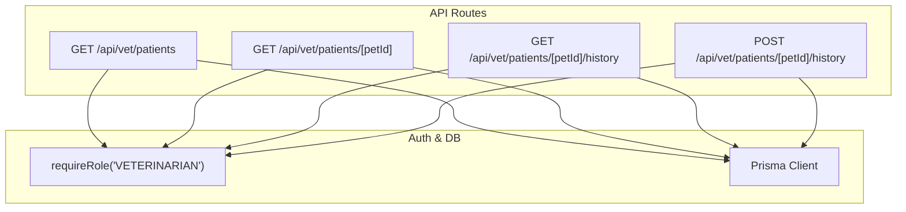
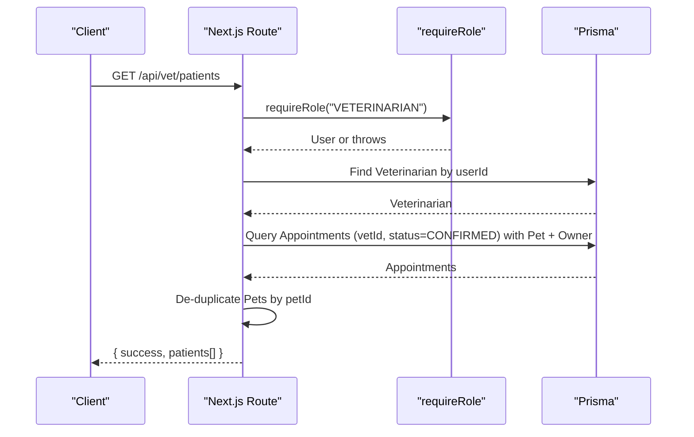
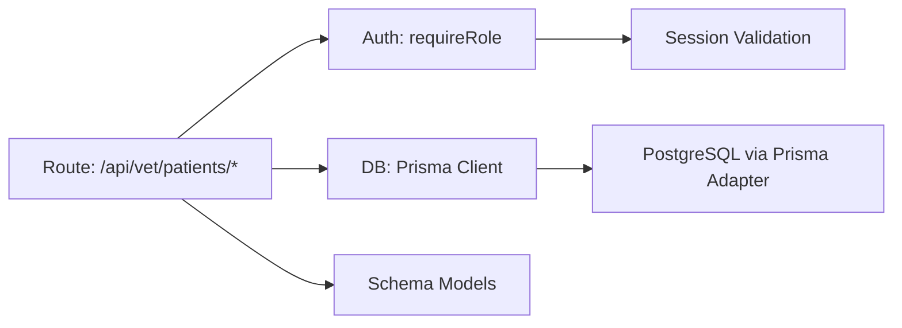

# Patient Management API

<cite>
**Referenced Files in This Document**
- [route.ts](file://app/api/vet/patients/route.ts)
- [route.ts](file://app/api/vet/patients/[petId]/route.ts)
- [route.ts](file://app/api/vet/patients/[petId]/history/route.ts)
- [auth.ts](file://lib/auth.ts)
- [schema.prisma](file://prisma/schema.prisma)
- [db.ts](file://lib/db.ts)
</cite>

## Table of Contents
1. Introduction
2. Project Structure
3. Core Components
4. Architecture Overview
5. Detailed Component Analysis
6. Dependency Analysis
7. Performance Considerations
8. Troubleshooting Guide
9. Conclusion

## Introduction
This document provides comprehensive API documentation for patient management endpoints under /api/vet/patients/*. It covers:
- GET /api/vet/patients to list patients authorized to the authenticated veterinarian, including filtering by clinic association and ownership verification via confirmed appointments.
- GET /api/vet/patients/[petId] to retrieve a specific pet’s record with owner details when the vet is authorized.
- GET /api/vet/patients/[petId]/history to fetch medical history summaries and current health status (medical records, vaccinations, medications, allergies, conditions, metrics).
It also documents request parameters, response schemas, role-based access controls, authorization validation, and privacy protections.

## Project Structure
The patient management APIs are implemented as Next.js Route Handlers under app/api/vet/patients. Authorization and session handling are centralized in lib/auth.ts. Database access uses Prisma with schema definitions in prisma/schema.prisma.

**Diagram sources**
- [route.ts:6-70](file://app/api/vet/patients/route.ts#L6-L70)
- [route.ts:50-79](file://app/api/vet/patients/[petId]/route.ts#L50-L79)
- [route.ts:7-69](file://app/api/vet/patients/[petId]/history/route.ts#L7-L69)
- [route.ts:72-152](file://app/api/vet/patients/[petId]/history/route.ts#L72-L152)
- [auth.ts:117-124](file://lib/auth.ts#L117-L124)
- [db.ts:1-33](file://lib/db.ts#L1-L33)

**Section sources**
- [route.ts:6-70](file://app/api/vet/patients/route.ts#L6-L70)
- [route.ts:50-79](file://app/api/vet/patients/[petId]/route.ts#L50-L79)
- [route.ts:7-69](file://app/api/vet/patients/[petId]/history/route.ts#L7-L69)
- [auth.ts:117-124](file://lib/auth.ts#L117-L124)
- [schema.prisma:68-182](file://prisma/schema.prisma#L68-L182)

## Core Components
- Authentication and Role Enforcement: requireRole ensures only VETERINARIAN can access patient endpoints.
- Authorization per Pet: getAuthorizedVetPatient verifies that the vet has a CONFIRMED appointment with the requested pet before exposing data.
- Data Access: Prisma queries fetch pets, owners, appointments, and medical history entities.

Key responsibilities:
- List patients: returns unique pets linked to the vet via CONFIRMED appointments, de-duplicated.
- Get patient: returns pet and owner details if authorized.
- History: returns full medical history and current health metrics for an authorized pet.

**Section sources**
- [auth.ts:109-124](file://lib/auth.ts#L109-L124)
- [route.ts:6-47](file://app/api/vet/patients/[petId]/route.ts#L6-L47)
- [route.ts:21-57](file://app/api/vet/patients/route.ts#L21-L57)
- [route.ts:23-56](file://app/api/vet/patients/[petId]/history/route.ts#L23-L56)

## Architecture Overview
The patient management API enforces strict role-based access and per-resource authorization based on appointment relationships. All endpoints validate the user’s role and then check vet-pet authorization through confirmed appointments.

**Diagram sources**
- [route.ts:6-70](file://app/api/vet/patients/route.ts#L6-L70)
- [auth.ts:117-124](file://lib/auth.ts#L117-L124)
- [schema.prisma:164-182](file://prisma/schema.prisma#L164-L182)

## Detailed Component Analysis

### GET /api/vet/patients
Purpose:
- Retrieve a list of patients (pets) associated with the authenticated veterinarian through confirmed appointments.

Authorization:
- Requires VETERINARIAN role.
- Ensures the vet profile exists; otherwise returns 404 NOT_FOUND.

Request:
- Method: GET
- Path: /api/vet/patients
- Headers: Session cookie required (handled by auth middleware).
- Query parameters: Not implemented in code. Filtering by clinic, search, pagination, or health status is not supported at this time.

Response:
- Success: { success: true, patients: Array<{ pet fields, owner fields, appointmentDate }> }
- Error:
  - 403 FORBIDDEN: UNAUTHENTICATED or FORBIDDEN from requireRole.
  - 404 NOT_FOUND: Veterinarian profile not found.
  - 500 INTERNAL_SERVER_ERROR: Unexpected error.

Data model mapping:
- Patients are derived from Appointment records where status is CONFIRMED and vetId matches the authenticated vet.
- Each pet includes owner details (firstName, lastName, phone).
- appointmentDate reflects the latest confirmed appointment date per pet due to de-duplication logic.

Privacy and access control:
- Only pets with confirmed appointments with the vet are returned.
- No direct exposure of sensitive owner PII beyond name and phone as included in the query.

Notes:
- Pagination, search, and clinic filters are not implemented. If needed, extend the route with query parsing and Prisma filters.

**Section sources**
- [route.ts:6-70](file://app/api/vet/patients/route.ts#L6-L70)
- [schema.prisma:68-88](file://prisma/schema.prisma#L68-L88)
- [schema.prisma:164-182](file://prisma/schema.prisma#L164-L182)

### GET /api/vet/patients/[petId]
Purpose:
- Retrieve detailed information for a specific pet if the authenticated vet is authorized via a confirmed appointment.

Authorization:
- Requires VETERINARIAN role.
- Uses getAuthorizedVetPatient to verify a CONFIRMED appointment exists between the vet and the pet.

Request:
- Method: GET
- Path: /api/vet/patients/[petId]
- Path parameter: petId (string)
- Headers: Session cookie required.

Response:
- Success: { success: true, pet: { ...pet fields, owner: { firstName, lastName, phone, email } } }
- Errors:
  - 403 FORBIDDEN: No confirmed appointment exists with this pet.
  - 404 NOT_FOUND: Veterinarian profile not found or Pet not found.
  - 403 FORBIDDEN: UNAUTHENTICATED or FORBIDDEN from requireRole.
  - 500 INTERNAL_SERVER_ERROR: Unexpected error.

Privacy and access control:
- Owner details are included only when the vet is authorized.
- Sensitive identifiers are not exposed beyond what is necessary for care coordination.

**Section sources**
- [route.ts:6-47](file://app/api/vet/patients/[petId]/route.ts#L6-L47)
- [route.ts:50-79](file://app/api/vet/patients/[petId]/route.ts#L50-L79)
- [schema.prisma:68-88](file://prisma/schema.prisma#L68-L88)

### GET /api/vet/patients/[petId]/history
Purpose:
- Fetch the complete medical history and current health status for an authorized pet.

Authorization:
- Requires VETERINARIAN role.
- Reuses getAuthorizedVetPatient to ensure the vet has a confirmed appointment with the pet.

Request:
- Method: GET
- Path: /api/vet/patients/[petId]/history
- Path parameter: petId (string)
- Headers: Session cookie required.

Response:
- Success: { success: true, history: { medicalRecords[], vaccinations[], medications[], allergies[], conditions[], metrics[] } }
- Errors:
  - 403 FORBIDDEN: Unauthorized or no confirmed appointment.
  - 500 INTERNAL_SERVER_ERROR: Unexpected error.

Data model mapping:
- medicalRecords: Includes versions ordered by creation date and vet info.
- vaccinations, medications, allergies, conditions, metrics: Directly fetched by petId.

Privacy and access control:
- Medical records are only accessible to vets with confirmed appointments for the pet.
- Audit logging is performed on write operations (see POST below).

**Section sources**
- [route.ts:7-69](file://app/api/vet/patients/[petId]/history/route.ts#L7-L69)
- [schema.prisma:133-162](file://prisma/schema.prisma#L133-L162)
- [schema.prisma:196-244](file://prisma/schema.prisma#L196-L244)

### POST /api/vet/patients/[petId]/history
Purpose:
- Create a new medical record entry for an authorized pet.

Authorization:
- Requires VETERINARIAN role.
- Validates confirmed appointment via getAuthorizedVetPatient.

Request:
- Method: POST
- Path: /api/vet/patients/[petId]/history
- Body: { symptoms, diagnosis, treatmentPlan, notes? }
- Required fields: symptoms, diagnosis, treatmentPlan.

Response:
- Success: 201 Created with { success: true, record: { ...MedicalRecord with initial version } }
- Errors:
  - 400 BAD_REQUEST: Missing required fields.
  - 403 FORBIDDEN: Unauthorized or no confirmed appointment.
  - 404 NOT_FOUND: Vet record mismatch.
  - 500 INTERNAL_SERVER_ERROR: Unexpected error.

Processing logic:
- Creates a MedicalRecord and its first MedicalRecordVersion within a transaction.
- Writes an AuditLog entry for traceability.

Privacy and access control:
- Only vets with confirmed appointments can create records for a pet.
- Audit logs capture editor identity and action for compliance.

**Section sources**
- [route.ts:72-152](file://app/api/vet/patients/[petId]/history/route.ts#L72-L152)
- [schema.prisma:133-162](file://prisma/schema.prisma#L133-L162)
- [schema.prisma:298-311](file://prisma/schema.prisma#L298-L311)

## Dependency Analysis
- Role enforcement depends on lib/auth.ts requireRole which validates session and role.
- Data layer depends on Prisma client configured in lib/db.ts.
- Entity relationships rely on schema.prisma models (User, Veterinarian, Pet, Appointment, MedicalRecord, etc.).

**Diagram sources**
- [auth.ts:109-124](file://lib/auth.ts#L109-L124)
- [db.ts:1-33](file://lib/db.ts#L1-L33)
- [schema.prisma:30-53](file://prisma/schema.prisma#L30-L53)

**Section sources**
- [auth.ts:109-124](file://lib/auth.ts#L109-L124)
- [db.ts:1-33](file://lib/db.ts#L1-L33)
- [schema.prisma:30-53](file://prisma/schema.prisma#L30-L53)

## Performance Considerations
- The list endpoint de-duplicates pets using an in-memory Map after fetching all confirmed appointments for the vet. For large datasets, consider adding server-side pagination and filtering to reduce payload size and database load.
- The history endpoint performs multiple parallel queries via Promise.all for different entities. This is efficient but may benefit from indexing strategies on petId and timestamps.
- Ensure appropriate database indexes exist for frequent filters (e.g., Appointment.vetId, Appointment.status, MedicalRecord.petId).

[No sources needed since this section provides general guidance]

## Troubleshooting Guide
Common errors and resolutions:
- 403 FORBIDDEN:
  - Cause: UNAUTHENTICATED or FORBIDDEN from requireRole.
  - Resolution: Ensure valid session cookie and VETERINARIAN role.
- 404 NOT_FOUND:
  - Cause: Veterinarian profile not found or Pet not found.
  - Resolution: Verify vet profile linkage and correct petId.
- 400 BAD_REQUEST:
  - Cause: Missing required fields in POST history.
  - Resolution: Include symptoms, diagnosis, and treatmentPlan.
- 500 INTERNAL_SERVER_ERROR:
  - Cause: Unexpected server error.
  - Resolution: Check logs and database connectivity.

Authorization pitfalls:
- Accessing a pet without a confirmed appointment results in 403 FORBIDDEN. Confirm appointment status is CONFIRMED for the vet-pet pair.

**Section sources**
- [route.ts:58-69](file://app/api/vet/patients/route.ts#L58-L69)
- [route.ts:67-79](file://app/api/vet/patients/[petId]/route.ts#L67-L79)
- [route.ts:57-68](file://app/api/vet/patients/[petId]/history/route.ts#L57-L68)
- [route.ts:89-102](file://app/api/vet/patients/[petId]/history/route.ts#L89-L102)

## Conclusion
The patient management API provides secure, role-gated access for veterinarians to view and manage patient data tied to confirmed appointments. While the current implementation supports listing authorized patients, retrieving individual patient details, and accessing full medical history, it does not yet implement advanced filtering, search, or pagination. Extending these capabilities will improve scalability and usability for larger clinics.

[No sources needed since this section summarizes without analyzing specific files]