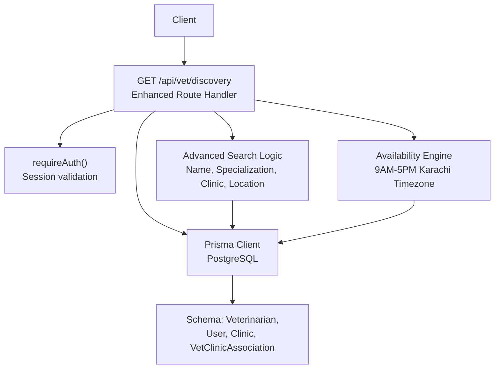
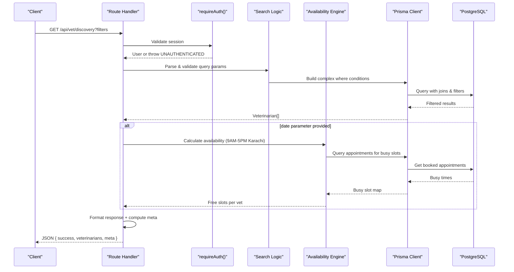
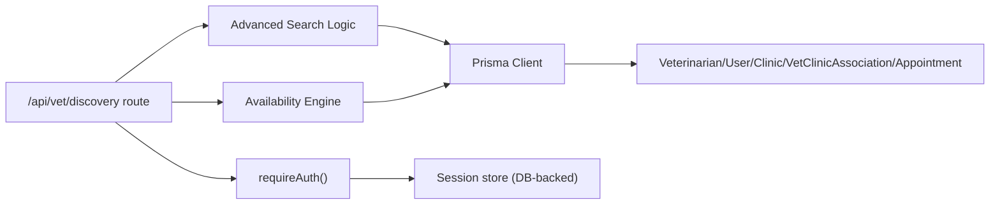
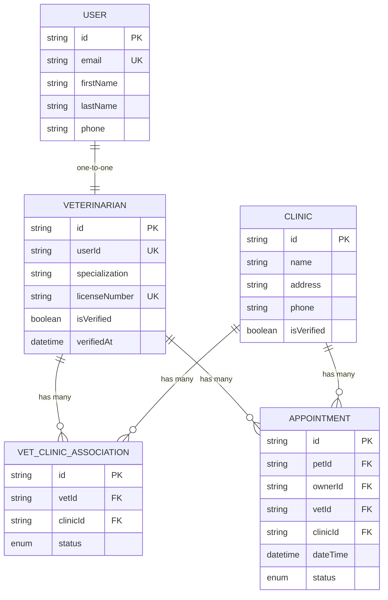

# Veterinarian Discovery API

<cite>
**Referenced Files in This Document**
- [route.ts](file://app/api/vet/discovery/route.ts)
- [auth.ts](file://lib/auth.ts)
- [schema.prisma](file://prisma/schema.prisma)
- [db.ts](file://lib/db.ts)
- [slots/route.ts](file://app/api/appointments/[appointmentId]/slots/route.ts)
</cite>

## Update Summary
**Changes Made**
- Enhanced endpoint with advanced search capabilities including name matching, specialization filtering, clinic name matching, and location/address searching
- Added date-based availability checking with 9 AM to 5 PM working schedule in Asia/Karachi timezone
- Implemented comprehensive query parameter validation and error handling
- Added metadata response with distinct specializations and clinics for filter dropdowns
- Updated response schema to include availability information when date parameter is provided

## Table of Contents
1. [Introduction](#introduction)
2. [Project Structure](#project-structure)
3. [Core Components](#core-components)
4. [Architecture Overview](#architecture-overview)
5. [Detailed Component Analysis](#detailed-component-analysis)
6. [Dependency Analysis](#dependency-analysis)
7. [Performance Considerations](#performance-considerations)
8. [Troubleshooting Guide](#troubleshooting-guide)
9. [Conclusion](#conclusion)
10. [Appendices](#appendices)

## Introduction
This document provides detailed API documentation for the enhanced veterinarian discovery endpoint that lists available veterinarians with advanced search capabilities and their associated active clinics. The endpoint supports filtering by name, specialization, clinic name, location/address, and date-based availability checking within the 9 AM to 5 PM working hours in Asia/Karachi timezone. It covers authentication, request parameters, response schema, error handling, and example usage scenarios such as querying vet directories for pet owner appointments or clinic staff management.

## Project Structure
The endpoint is implemented as a Next.js Route Handler under the vet module with enhanced search functionality. Authentication is enforced via a shared middleware function, and data is retrieved from a PostgreSQL database using Prisma ORM with complex filtering capabilities.

**Diagram sources**
- [route.ts:24-206](file://app/api/vet/discovery/route.ts#L24-L206)
- [auth.ts:109-115](file://lib/auth.ts#L109-L115)
- [schema.prisma:93-135](file://prisma/schema.prisma#L93-L135)

**Section sources**
- [route.ts:24-206](file://app/api/vet/discovery/route.ts#L24-L206)
- [auth.ts:109-115](file://lib/auth.ts#L109-L115)
- [schema.prisma:93-135](file://prisma/schema.prisma#L93-L135)

## Core Components
- Endpoint: GET /api/vet/discovery
- Authentication: requireAuth() enforces a valid session cookie; returns 401 if missing or invalid
- Advanced Search: Supports filtering by name (first/last), specialization, clinic name, and location/address
- Availability Engine: Date-based availability checking with 9 AM to 5 PM working schedule in Asia/Karachi timezone
- Response Formatting: Returns only ACTIVE clinic associations, selected user fields, and optional availability data

Key implementation references:
- Enhanced endpoint handler and search logic: [route.ts:24-192](file://app/api/vet/discovery/route.ts#L24-L192)
- Authentication enforcement: [auth.ts:109-115](file://lib/auth.ts#L109-L115)
- Database models used: [schema.prisma:93-135](file://prisma/schema.prisma#L93-L135)

**Section sources**
- [route.ts:24-192](file://app/api/vet/discovery/route.ts#L24-L192)
- [auth.ts:109-115](file://lib/auth.ts#L109-L115)
- [schema.prisma:93-135](file://prisma/schema.prisma#L93-L135)

## Architecture Overview
The enhanced endpoint follows a sophisticated server-side flow:
1. The client sends an authenticated HTTP GET request with optional query parameters to /api/vet/discovery.
2. The route handler calls requireAuth() to validate the session cookie.
3. Query parameters are parsed and validated (name, specialization, clinic, location, date).
4. Complex Prisma queries are constructed based on provided filters.
5. For date-based searches, availability is calculated using 9 AM to 5 PM working hours in Asia/Karachi timezone.
6. Results are filtered to only ACTIVE clinic associations and formatted into a concise response payload.
7. Metadata containing distinct specializations and clinics is computed for stable filter dropdowns.
8. Errors are handled to return standardized 401 (unauthenticated), 400 (bad request), or 500 (server error) responses.

**Diagram sources**
- [route.ts:24-192](file://app/api/vet/discovery/route.ts#L24-L192)
- [auth.ts:109-115](file://lib/auth.ts#L109-L115)
- [schema.prisma:93-135](file://prisma/schema.prisma#L93-L135)

## Detailed Component Analysis

### Endpoint: GET /api/vet/discovery
- Purpose: Retrieve a list of veterinarians with advanced search capabilities, contact information, specialization, license number, verification status, and associated active clinics.
- Authentication: Required. Uses requireAuth() which reads the session cookie and validates it against stored sessions. If no valid session exists, throws UNAUTHENTICATED.
- Request Parameters:
  - `name`: Matches veterinarian first/last name (contains, case-insensitive)
  - `specialization`: Matches specialization (contains, case-insensitive)
  - `clinic`: Matches associated clinic name (contains, case-insensitive)
  - `location`: Matches associated clinic address (contains, case-insensitive)
  - `date=YYYY-MM-DD`: Availability filter - each result gets availability.freeSlots for that date (same 9-17 Karachi grid); vets with no free slot that day are excluded
- Response:
  - success: boolean
  - veterinarians: array of vet profiles
    - id: string
    - firstName: string
    - lastName: string
    - email: string
    - phone: string?
    - specialization: string?
    - licenseNumber: string
    - isVerified: boolean
    - clinics: array of active clinic associations
      - id: string
      - name: string
      - address: string
    - availability: object (only when date parameter provided)
      - date: string
      - freeSlots: array of available time slots
        - hour: number
        - label: string (formatted time like "9 AM")
        - iso: string (ISO format with +05:00 timezone)
  - meta: object containing filter options
    - specializations: array of distinct specialization strings
    - clinics: array of distinct clinic objects with id, name, address

Error handling:
- 401 Unauthorized: Returned when requireAuth() detects an unauthenticated request.
- 400 Bad Request: Returned for invalid date format or past dates when date parameter is provided.
- 500 Internal Server Error: Returned for unexpected errors during processing.

Example usage scenarios:
- Pet owner appointment planning: Use this endpoint to discover verified veterinarians by name, specialization, location, or check availability for specific dates to schedule appointments.
- Clinic staff management: Administrators can review the full directory of veterinarians with advanced filtering for staffing and coordination purposes.
- Real-time availability: Check which veterinarians have open slots on specific dates within working hours (9 AM - 5 PM Karachi time).

Notes:
- All search operations use case-insensitive contains matching for better user experience.
- When date parameter is provided, only veterinarians with at least one free slot on that date are returned.
- Working hours are fixed at 9 AM to 5 PM in Asia/Karachi timezone (UTC+5) with no daylight saving adjustments.
- The endpoint returns metadata with distinct specializations and clinics to support dynamic filter dropdowns.

**Section sources**
- [route.ts:24-192](file://app/api/vet/discovery/route.ts#L24-L192)
- [auth.ts:109-115](file://lib/auth.ts#L109-L115)
- [schema.prisma:93-135](file://prisma/schema.prisma#L93-L135)

### Authentication: requireAuth()
- Behavior: Reads the session cookie, validates it against stored sessions, and returns the current user or throws UNAUTHENTICATED.
- Session storage: Sessions are persisted in the database with expiration and sliding window extension logic.
- Cookie configuration: HttpOnly, secure in production, SameSite lax, path root.

Security considerations:
- Ensure clients send the session cookie with requests to protected endpoints.
- Do not expose session tokens in URLs or logs.

**Section sources**
- [auth.ts:23-30](file://lib/auth.ts#L23-L30)
- [auth.ts:33-75](file://lib/auth.ts#L33-L75)
- [auth.ts:82-97](file://lib/auth.ts#L82-L97)
- [auth.ts:109-115](file://lib/auth.ts#L109-L115)

### Data Models and Relationships
- Veterinarian: Contains specialization, licenseNumber, isVerified, and relations to User and VetClinicAssociation.
- User: Contains firstName, lastName, email, phone, and role.
- Clinic: Contains name, address, phone, and isVerified.
- VetClinicAssociation: Links Veterinarian to Clinic with status (ACTIVE, PENDING, INACTIVE).
- Appointment: Contains dateTime, status, and relations to Veterinarian, Pet, and Clinic.

These relationships enable the endpoint to fetch veterinarian profiles along with their active clinic associations and calculate availability based on existing appointments.

**Section sources**
- [schema.prisma:93-135](file://prisma/schema.prisma#L93-L135)
- [schema.prisma:168-187](file://prisma/schema.prisma#L168-L187)

### Advanced Search Implementation
The endpoint implements sophisticated search logic with multiple filter combinations:
- Name search: Searches both firstName and lastName fields with OR logic
- Specialization search: Case-insensitive contains matching
- Clinic search: Filters by associated clinic names with ACTIVE status requirement
- Location search: Filters by clinic addresses with ACTIVE status requirement
- Combined filters: Multiple parameters can be combined with AND logic

### Availability Engine
The availability engine calculates free slots based on:
- Fixed working hours: 9 AM to 5 PM (17:00) in Asia/Karachi timezone
- Past date validation: Rejects dates that have already passed
- Existing appointments: Queries REQUESTED and CONFIRMED appointments for the specified date
- Real-time availability: Excludes current time if it's already past the current hour
- Slot formatting: Provides human-readable labels (e.g., "9 AM", "10 AM") and ISO timestamps with timezone

**Section sources**
- [route.ts:54-84](file://app/api/vet/discovery/route.ts#L54-L84)
- [route.ts:100-165](file://app/api/vet/discovery/route.ts#L100-L165)

## Dependency Analysis
The endpoint depends on:
- Next.js routing for HTTP handling
- Shared authentication middleware
- Prisma client configured for PostgreSQL
- Database schema defining Veterinarian, User, Clinic, VetClinicAssociation, and Appointment

**Diagram sources**
- [route.ts:24-192](file://app/api/vet/discovery/route.ts#L24-L192)
- [auth.ts:109-115](file://lib/auth.ts#L109-L115)
- [schema.prisma:93-187](file://prisma/schema.prisma#L93-L187)

**Section sources**
- [route.ts:24-192](file://app/api/vet/discovery/route.ts#L24-L192)
- [auth.ts:109-115](file://lib/auth.ts#L109-L115)
- [schema.prisma:93-187](file://prisma/schema.prisma#L93-L187)

## Performance Considerations
- Query optimization: The endpoint uses efficient Prisma queries with proper where conditions and includes to minimize database load.
- Indexing: Ensure indexes exist on frequently filtered columns (e.g., specialization, isVerified) and on association keys (vetId, clinicId) to optimize queries.
- Pagination: Consider implementing pagination for large result sets to avoid memory pressure and slow responses.
- Selective includes: Only include necessary fields to minimize network overhead.
- Availability calculation: For date-based searches, the endpoint performs additional queries to calculate availability, which may impact performance with large datasets.
- Metadata computation: Distinct specializations and clinics are computed over all veterinarians, which could be optimized with caching for high-traffic scenarios.

## Troubleshooting Guide
Common issues and resolutions:
- 401 Unauthorized:
  - Cause: Missing or invalid session cookie.
  - Resolution: Ensure the client includes the session cookie set by the login flow. Verify session validity and expiration.
- 400 Bad Request:
  - Cause: Invalid date format or past date when date parameter is provided.
  - Resolution: Ensure date parameter follows YYYY-MM-DD format and represents a future date.
- 500 Internal Server Error:
  - Cause: Unexpected error during request processing or database access.
  - Resolution: Check server logs and database connectivity. Validate environment variables and Prisma client configuration.

Authentication flow reference:
- requireAuth() throws UNAUTHENTICATED when no valid session is found.
- The route handler catches this and returns a standardized 401 response.

**Section sources**
- [route.ts:193-205](file://app/api/vet/discovery/route.ts#L193-L205)
- [auth.ts:109-115](file://lib/auth.ts#L109-L115)

## Conclusion
The enhanced veterinarian discovery endpoint provides a comprehensive solution for finding veterinarians with advanced search capabilities and real-time availability checking. The endpoint supports multiple filtering options including name, specialization, clinic, and location searches, along with date-based availability within the 9 AM to 5 PM working hours in Asia/Karachi timezone. Proper authentication ensures secure access, standardized error responses facilitate robust client integration, and the metadata response enables dynamic filter dropdowns for improved user experience.

## Appendices

### Request and Response Examples
- Basic Request:
  - Method: GET
  - Path: /api/vet/discovery
  - Headers: Include session cookie from login flow
- Search by Name:
  - Method: GET
  - Path: /api/vet/discovery?name=diana
  - Headers: Include session cookie from login flow
- Search by Specialization:
  - Method: GET
  - Path: /api/vet/discovery?specialization=cardio
  - Headers: Include session cookie from login flow
- Search by Location:
  - Method: GET
  - Path: /api/vet/discovery?location=metropolis
  - Headers: Include session cookie from login flow
- Search with Availability:
  - Method: GET
  - Path: /api/vet/discovery?date=2024-12-25
  - Headers: Include session cookie from login flow

- Success Response (200):
  - Body:
    - success: true
    - veterinarians: array of vet profiles with user details, specialization, license number, verification status, active clinics, and optional availability
    - meta: object containing specializations and clinics arrays

- Error Responses:
  - 401 Unauthorized:
    - Body: { success: false, error: { code: "UNAUTHORIZED", message: "Not logged in." } }
  - 400 Bad Request:
    - Body: { success: false, error: { code: "BAD_REQUEST", message: "Date must be in YYYY-MM-DD format." } }
  - 500 Internal Server Error:
    - Body: { success: false, error: { code: "INTERNAL_SERVER_ERROR", message: "An error occurred." } }

**Section sources**
- [route.ts:24-205](file://app/api/vet/discovery/route.ts#L24-L205)

### Data Model Reference

**Diagram sources**
- [schema.prisma:93-187](file://prisma/schema.prisma#L93-L187)

### Working Hours and Timezone Configuration
- Working Hours: 9 AM to 5 PM (17:00)
- Timezone: Asia/Karachi (UTC+5)
- No Daylight Saving: Fixed UTC offset without DST adjustments
- Slot Generation: Hourly slots from 9 AM to 4 PM (8 total slots)
- Past Time Handling: Current time slots are excluded if they've already passed

**Section sources**
- [route.ts:5-8](file://app/api/vet/discovery/route.ts#L5-L8)
- [route.ts:134-145](file://app/api/vet/discovery/route.ts#L134-L145)