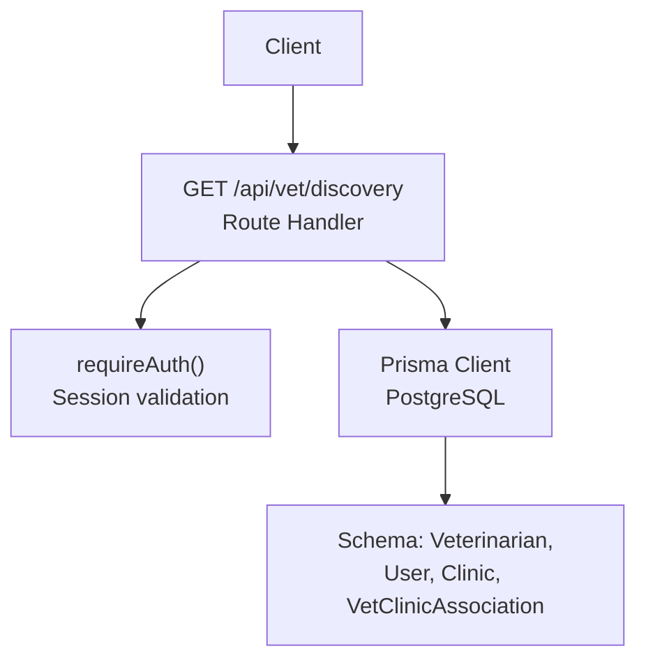
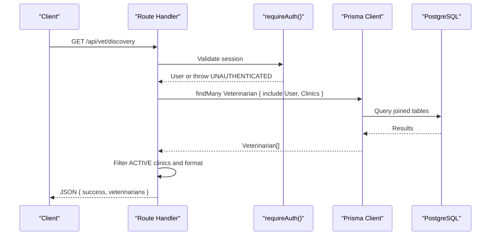
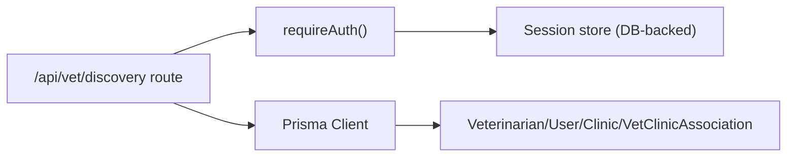
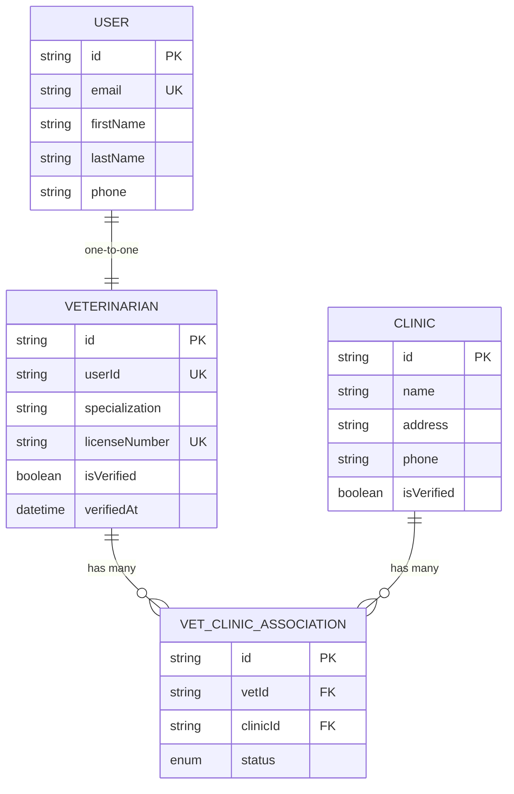

# Veterinarian Discovery API

<cite>
**Referenced Files in This Document**
- [route.ts](file://app/api/vet/discovery/route.ts)
- [auth.ts](file://lib/auth.ts)
- [schema.prisma](file://prisma/schema.prisma)
- [db.ts](file://lib/db.ts)
</cite>

## Table of Contents
1. [Introduction](#introduction)
2. [Project Structure](#project-structure)
3. [Core Components](#core-components)
4. [Architecture Overview](#architecture-overview)
5. [Detailed Component Analysis](#detailed-component-analysis)
6. [Dependency Analysis](#dependency-analysis)
7. [Performance Considerations](#performance-considerations)
8. [Troubleshooting Guide](#troubleshooting-guide)
9. [Conclusion](#conclusion)
10. [Appendices](#appendices)

## Introduction
This document provides detailed API documentation for the veterinarian discovery endpoint that lists available veterinarians and their associated active clinics. It covers authentication, request parameters, response schema, error handling, and example usage scenarios such as querying vet directories for pet owner appointments or clinic staff management.

## Project Structure
The endpoint is implemented as a Next.js Route Handler under the vet module. Authentication is enforced via a shared middleware function, and data is retrieved from a PostgreSQL database using Prisma ORM.

**Diagram sources**
- [route.ts:1-60](file://app/api/vet/discovery/route.ts#L1-L60)
- [auth.ts:100-115](file://lib/auth.ts#L100-L115)
- [schema.prisma:90-131](file://prisma/schema.prisma#L90-L131)

**Section sources**
- [route.ts:1-60](file://app/api/vet/discovery/route.ts#L1-L60)
- [auth.ts:100-115](file://lib/auth.ts#L100-L115)
- [schema.prisma:90-131](file://prisma/schema.prisma#L90-L131)

## Core Components
- Endpoint: GET /api/vet/discovery
- Authentication: requireAuth() enforces a valid session cookie; returns 401 if missing or invalid
- Data retrieval: Fetches all veterinarians with user details and associated clinics
- Response formatting: Returns only ACTIVE clinic associations and selected user fields

Key implementation references:
- Endpoint handler and response shaping: [route.ts:6-46](file://app/api/vet/discovery/route.ts#L6-L46)
- Authentication enforcement: [auth.ts:109-115](file://lib/auth.ts#L109-L115)
- Database models used: [schema.prisma:90-131](file://prisma/schema.prisma#L90-L131)

**Section sources**
- [route.ts:6-46](file://app/api/vet/discovery/route.ts#L6-L46)
- [auth.ts:109-115](file://lib/auth.ts#L109-L115)
- [schema.prisma:90-131](file://prisma/schema.prisma#L90-L131)

## Architecture Overview
The endpoint follows a simple server-side flow:
1. The client sends an authenticated HTTP GET request to /api/vet/discovery.
2. The route handler calls requireAuth() to validate the session cookie.
3. On success, it queries the Veterinarian model with related User and VetClinicAssociation records.
4. It filters to only ACTIVE clinic associations and maps the result into a concise response payload.
5. Errors are handled to return standardized 401 (unauthenticated) or 500 (server error) responses.

**Diagram sources**
- [route.ts:6-46](file://app/api/vet/discovery/route.ts#L6-L46)
- [auth.ts:100-115](file://lib/auth.ts#L100-L115)
- [schema.prisma:90-131](file://prisma/schema.prisma#L90-L131)

## Detailed Component Analysis

### Endpoint: GET /api/vet/discovery
- Purpose: Retrieve a list of veterinarians with their contact information, specialization, license number, verification status, and associated active clinics.
- Authentication: Required. Uses requireAuth() which reads the session cookie and validates it against stored sessions. If no valid session exists, throws UNAUTHENTICATED.
- Request parameters: None currently implemented. The endpoint returns all veterinarians regardless of query parameters.
- Response:
  - success: boolean
  - veterinarians: array of vet profiles
    - id: string
    - firstName: string
    - lastName: string
    - email: string
    - phone: string?
    - specialization: string?
    - licenseNumber: string
    - isVerified: boolean
    - clinics: array of active clinic associations
      - id: string
      - name: string
      - address: string

Error handling:
- 401 Unauthorized: Returned when requireAuth() detects an unauthenticated request.
- 500 Internal Server Error: Returned for unexpected errors during processing.

Example usage scenarios:
- Pet owner appointment planning: Use this endpoint to discover verified veterinarians and their active clinics to schedule appointments based on specialization and location.
- Clinic staff management: Administrators can review the full directory of veterinarians and their active clinic associations for staffing and coordination purposes.

Notes:
- Filtering by specialization, location, or verification status is not implemented in the current codebase. The endpoint returns all veterinarians and filters only to ACTIVE clinic associations on the server side.

**Section sources**
- [route.ts:6-59](file://app/api/vet/discovery/route.ts#L6-L59)
- [auth.ts:100-115](file://lib/auth.ts#L100-L115)
- [schema.prisma:90-131](file://prisma/schema.prisma#L90-L131)

### Authentication: requireAuth()
- Behavior: Reads the session cookie, validates it against stored sessions, and returns the current user or throws UNAUTHENTICATED.
- Session storage: Sessions are persisted in the database with expiration and sliding window extension logic.
- Cookie configuration: HttpOnly, secure in production, SameSite lax, path root.

Security considerations:
- Ensure clients send the session cookie with requests to protected endpoints.
- Do not expose session tokens in URLs or logs.

**Section sources**
- [auth.ts:23-30](file://lib/auth.ts#L23-L30)
- [auth.ts:33-75](file://lib/auth.ts#L33-L75)
- [auth.ts:82-97](file://lib/auth.ts#L82-L97)
- [auth.ts:100-115](file://lib/auth.ts#L100-L115)

### Data Models and Relationships
- Veterinarian: Contains specialization, licenseNumber, isVerified, and relations to User and VetClinicAssociation.
- User: Contains firstName, lastName, email, phone, and role.
- Clinic: Contains name, address, phone, and isVerified.
- VetClinicAssociation: Links Veterinarian to Clinic with status (ACTIVE, PENDING, INACTIVE).

These relationships enable the endpoint to fetch veterinarian profiles along with their active clinic associations.

**Section sources**
- [schema.prisma:90-131](file://prisma/schema.prisma#L90-L131)

## Dependency Analysis
The endpoint depends on:
- Next.js routing for HTTP handling
- Shared authentication middleware
- Prisma client configured for PostgreSQL
- Database schema defining Veterinarian, User, Clinic, and VetClinicAssociation

**Diagram sources**
- [route.ts:1-60](file://app/api/vet/discovery/route.ts#L1-L60)
- [auth.ts:100-115](file://lib/auth.ts#L100-L115)
- [schema.prisma:90-131](file://prisma/schema.prisma#L90-L131)

**Section sources**
- [route.ts:1-60](file://app/api/vet/discovery/route.ts#L1-L60)
- [auth.ts:100-115](file://lib/auth.ts#L100-L115)
- [schema.prisma:90-131](file://prisma/schema.prisma#L90-L131)

## Performance Considerations
- Current behavior retrieves all veterinarians and includes related data. For large datasets, consider adding query parameters to filter by specialization, location, or verification status to reduce payload size and improve performance.
- Indexing: Ensure indexes exist on frequently filtered columns (e.g., specialization, isVerified) and on association keys (vetId, clinicId) to optimize queries.
- Pagination: Implement pagination for large result sets to avoid memory pressure and slow responses.
- Selective includes: Only include necessary fields to minimize network overhead.

[No sources needed since this section provides general guidance]

## Troubleshooting Guide
Common issues and resolutions:
- 401 Unauthorized:
  - Cause: Missing or invalid session cookie.
  - Resolution: Ensure the client includes the session cookie set by the login flow. Verify session validity and expiration.
- 500 Internal Server Error:
  - Cause: Unexpected error during request processing or database access.
  - Resolution: Check server logs and database connectivity. Validate environment variables and Prisma client configuration.

Authentication flow reference:
- requireAuth() throws UNAUTHENTICATED when no valid session is found.
- The route handler catches this and returns a standardized 401 response.

**Section sources**
- [route.ts:47-59](file://app/api/vet/discovery/route.ts#L47-L59)
- [auth.ts:109-115](file://lib/auth.ts#L109-L115)

## Conclusion
The veterinarian discovery endpoint provides a straightforward way to retrieve a comprehensive list of veterinarians and their active clinic associations. While it currently lacks filtering capabilities, it serves as a foundation for building more advanced search features. Proper authentication ensures secure access, and standardized error responses facilitate robust client integration.

[No sources needed since this section summarizes without analyzing specific files]

## Appendices

### Request and Response Examples
- Request:
  - Method: GET
  - Path: /api/vet/discovery
  - Headers: Include session cookie from login flow
- Success Response (200):
  - Body:
    - success: true
    - veterinarians: array of vet profiles with user details, specialization, license number, verification status, and active clinics

- Error Responses:
  - 401 Unauthorized:
    - Body: { success: false, error: { code: "UNAUTHORIZED", message: "Not logged in." } }
  - 500 Internal Server Error:
    - Body: { success: false, error: { code: "INTERNAL_SERVER_ERROR", message: "An error occurred." } }

**Section sources**
- [route.ts:46-59](file://app/api/vet/discovery/route.ts#L46-L59)

### Data Model Reference

**Diagram sources**
- [schema.prisma:90-131](file://prisma/schema.prisma#L90-L131)