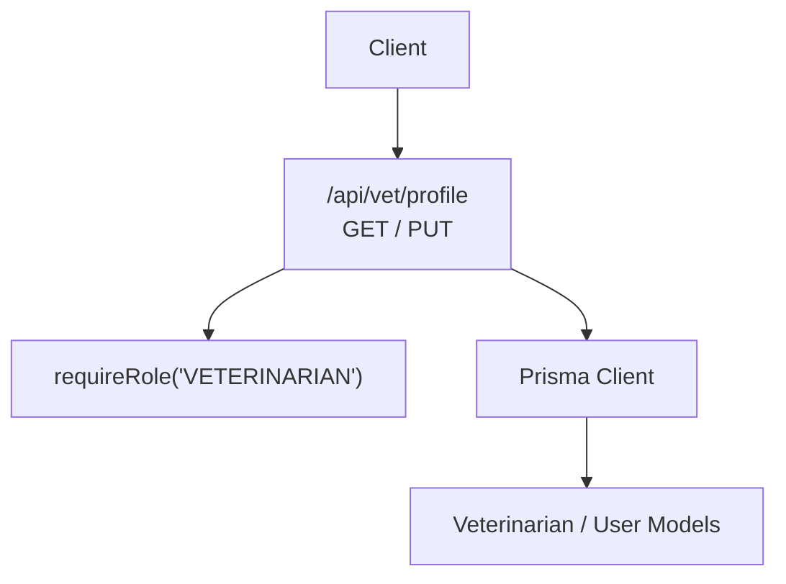
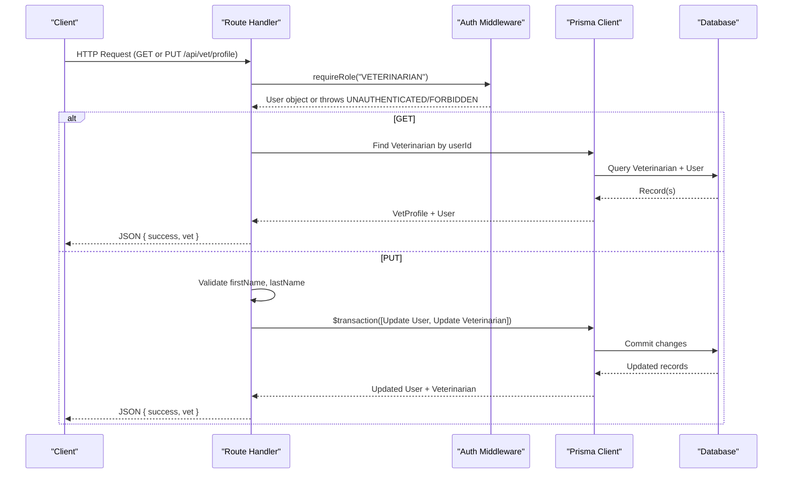
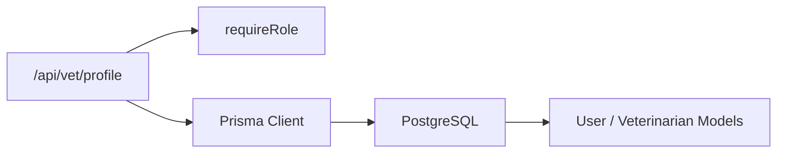

# Veterinarian Profile API

<cite>
**Referenced Files in This Document**
- [route.ts](file://app/api/vet/profile/route.ts)
- [auth.ts](file://lib/auth.ts)
- [schema.prisma](file://prisma/schema.prisma)
</cite>

## Table of Contents
1. [Introduction](#introduction)
2. [Project Structure](#project-structure)
3. [Core Components](#core-components)
4. [Architecture Overview](#architecture-overview)
5. [Detailed Component Analysis](#detailed-component-analysis)
6. [Dependency Analysis](#dependency-analysis)
7. [Performance Considerations](#performance-considerations)
8. [Troubleshooting Guide](#troubleshooting-guide)
9. [Conclusion](#conclusion)

## Introduction
This document provides comprehensive API documentation for the veterinarian profile management endpoint at /api/vet/profile. It covers retrieving and updating veterinarian profile information, including personal details, professional credentials, specializations, licensing information, and clinic affiliations where applicable. It also specifies request/response schemas, authentication requirements, validation rules, and error handling behaviors.

## Project Structure
The veterinarian profile API is implemented as a Next.js Route Handler under app/api/vet/profile/route.ts. Authentication and authorization are enforced via lib/auth.ts using role-based access control. Data models and constraints are defined in prisma/schema.prisma.



**Diagram sources**
- [route.ts:1-100](file://app/api/vet/profile/route.ts#L1-L100)
- [auth.ts:109-124](file://lib/auth.ts#L109-L124)
- [schema.prisma:90-105](file://prisma/schema.prisma#L90-L105)

**Section sources**
- [route.ts:1-100](file://app/api/vet/profile/route.ts#L1-L100)
- [auth.ts:109-124](file://lib/auth.ts#L109-L124)
- [schema.prisma:90-105](file://prisma/schema.prisma#L90-L105)

## Core Components
- Endpoint: /api/vet/profile
  - GET: Retrieve the authenticated veterinarian’s professional profile
  - PUT: Update veterinarian profile fields (personal details and specialization)
- Authentication: Requires an active session and VETERINARIAN role
- Data persistence: Prisma ORM with PostgreSQL-backed schema

Key responsibilities:
- Enforce role-based access control before any data read/write
- Validate required fields on updates
- Return consistent JSON responses with success flag and error objects
- Use database transactions to keep user and veterinarian records consistent during updates

**Section sources**
- [route.ts:5-48](file://app/api/vet/profile/route.ts#L5-L48)
- [route.ts:50-99](file://app/api/vet/profile/route.ts#L50-L99)
- [auth.ts:109-124](file://lib/auth.ts#L109-L124)

## Architecture Overview
The API follows a simple request-response flow with middleware-style authorization:



**Diagram sources**
- [route.ts:5-99](file://app/api/vet/profile/route.ts#L5-L99)
- [auth.ts:109-124](file://lib/auth.ts#L109-L124)
- [schema.prisma:30-53](file://prisma/schema.prisma#L30-L53)
- [schema.prisma:90-105](file://prisma/schema.prisma#L90-L105)

## Detailed Component Analysis

### GET /api/vet/profile
Purpose:
- Retrieve the current veterinarian’s profile, including personal details, license number, specialization, verification status, and verification timestamp.

Authentication:
- Requires an active session and VETERINARIAN role via requireRole.

Request:
- Method: GET
- Headers: Cookie containing session token
- Body: None

Response (success):
- Fields:
  - success: boolean
  - vet: object
    - id: string (veterinarian record id)
    - email: string
    - firstName: string
    - lastName: string
    - phone: string?
    - specialization: string?
    - licenseNumber: string
    - isVerified: boolean
    - verifiedAt: datetime?

Error responses:
- 403 Forbidden: Unauthorized or insufficient role
- 404 Not Found: Veterinarian profile not found
- 500 Internal Server Error: Unexpected server error

Validation:
- No input validation needed for GET; server enforces role and existence checks.

Notes:
- The response includes both user and veterinarian fields merged into vet for convenience.

**Section sources**
- [route.ts:5-48](file://app/api/vet/profile/route.ts#L5-L48)
- [auth.ts:109-124](file://lib/auth.ts#L109-L124)
- [schema.prisma:30-53](file://prisma/schema.prisma#L30-L53)
- [schema.prisma:90-105](file://prisma/schema.prisma#L90-L105)

### PUT /api/vet/profile
Purpose:
- Update veterinarian profile fields: first name, last name, phone (from User model), and specialization (from Veterinarian model).

Authentication:
- Requires an active session and VETERINARIAN role via requireRole.

Request:
- Method: PUT
- Content-Type: application/json
- Body fields:
  - firstName: string (required)
  - lastName: string (required)
  - phone: string? (optional)
  - specialization: string? (optional)

Response (success):
- Fields:
  - success: boolean
  - vet: object
    - id: string (veterinarian record id)
    - email: string
    - firstName: string
    - lastName: string
    - phone: string?
    - specialization: string?
    - licenseNumber: string
    - isVerified: boolean

Error responses:
- 400 Bad Request: Missing required fields (firstName, lastName)
- 403 Forbidden: Unauthorized or insufficient role
- 500 Internal Server Error: Unexpected server error

Validation rules:
- firstName and lastName are required
- phone and specialization are optional
- Updates are performed atomically across User and Veterinarian tables using a transaction

Data integrity:
- License number uniqueness is enforced by the database schema
- Specialization is stored in the Veterinarian model and can be updated independently

Notes:
- The endpoint does not allow direct modification of licenseNumber or verification flags through this API.

**Section sources**
- [route.ts:50-99](file://app/api/vet/profile/route.ts#L50-L99)
- [schema.prisma:30-53](file://prisma/schema.prisma#L30-L53)
- [schema.prisma:90-105](file://prisma/schema.prisma#L90-L105)

### Authentication and Authorization
- Session-based authentication using cookies
- Role enforcement ensures only users with VETERINARIAN role can access the endpoint
- Expired sessions are cleaned up automatically

Session lifecycle highlights:
- Token hashing and storage in Session table
- Sliding window expiration with automatic extension near expiry
- Secure cookie configuration in production

**Section sources**
- [auth.ts:23-80](file://lib/auth.ts#L23-L80)
- [auth.ts:109-124](file://lib/auth.ts#L109-L124)

### Data Model Relationships
```mermaid
erDiagram
USER {
string id PK
string email UK
string role
string firstName
string lastName
string phone
datetime createdAt
datetime updatedAt
}
VETERINARIAN {
string id PK
string userId UK FK
string specialization
string licenseNumber UK
boolean isVerified
datetime verifiedAt
datetime createdAt
datetime updatedAt
}
USER ||--o| VETERINARIAN : "has one-to-one via userId"
```

**Diagram sources**
- [schema.prisma:30-53](file://prisma/schema.prisma#L30-L53)
- [schema.prisma:90-105](file://prisma/schema.prisma#L90-L105)

## Dependency Analysis
- Route handler depends on:
  - Authentication middleware (requireRole)
  - Prisma client for data access
- Database schema enforces:
  - Unique constraints on email and licenseNumber
  - Referential integrity between User and Veterinarian
- Transaction usage ensures consistency when updating both User and Veterinarian records



**Diagram sources**
- [route.ts:1-100](file://app/api/vet/profile/route.ts#L1-L100)
- [auth.ts:109-124](file://lib/auth.ts#L109-L124)
- [schema.prisma:30-53](file://prisma/schema.prisma#L30-L53)
- [schema.prisma:90-105](file://prisma/schema.prisma#L90-L105)

**Section sources**
- [route.ts:1-100](file://app/api/vet/profile/route.ts#L1-L100)
- [auth.ts:109-124](file://lib/auth.ts#L109-L124)
- [schema.prisma:30-53](file://prisma/schema.prisma#L30-L53)
- [schema.prisma:90-105](file://prisma/schema.prisma#L90-L105)

## Performance Considerations
- Single database query for GET with included user data reduces round trips
- Transactional update for PUT minimizes inconsistency risk and improves reliability
- Session sliding window reduces re-authentication overhead while maintaining security
- Indexes on frequently queried fields (e.g., userId, expiresAt) improve lookup performance

[No sources needed since this section provides general guidance]

## Troubleshooting Guide
Common issues and resolutions:
- 403 Forbidden: Ensure the request includes a valid session cookie and the user has the VETERINARIAN role
- 404 Not Found: Verify that a Veterinarian record exists for the authenticated user
- 400 Bad Request: Include both firstName and lastName in the PUT request body
- 500 Internal Server Error: Check server logs for unexpected errors; ensure database connectivity and Prisma client initialization

Error response format:
- success: boolean
- error: object
  - code: string (e.g., FORBIDDEN, NOT_FOUND, BAD_REQUEST, INTERNAL_SERVER_ERROR)
  - message: string (human-readable description)

**Section sources**
- [route.ts:36-48](file://app/api/vet/profile/route.ts#L36-L48)
- [route.ts:87-99](file://app/api/vet/profile/route.ts#L87-L99)

## Conclusion
The /api/vet/profile endpoint provides secure, role-gated access for veterinarians to retrieve and update their professional profiles. It enforces strong authentication, validates required fields, and uses database transactions to maintain data consistency. The API returns standardized JSON responses and handles common error scenarios gracefully. For features such as license number updates, certification dates, practice areas, contact information beyond phone, and clinic affiliations, additional endpoints or enhancements would be required based on evolving business needs.