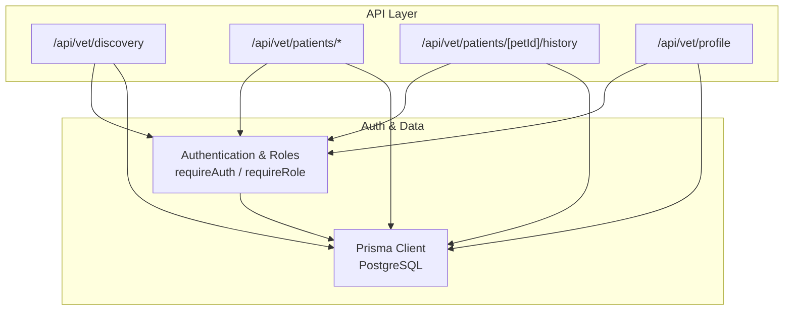
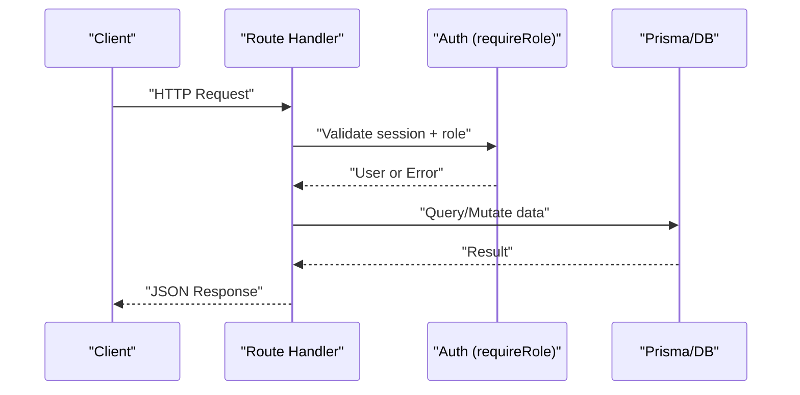
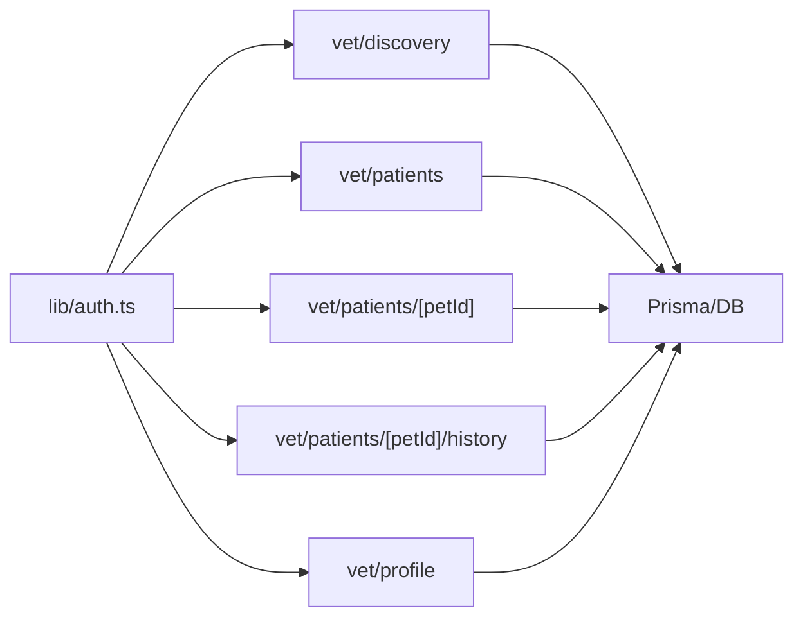
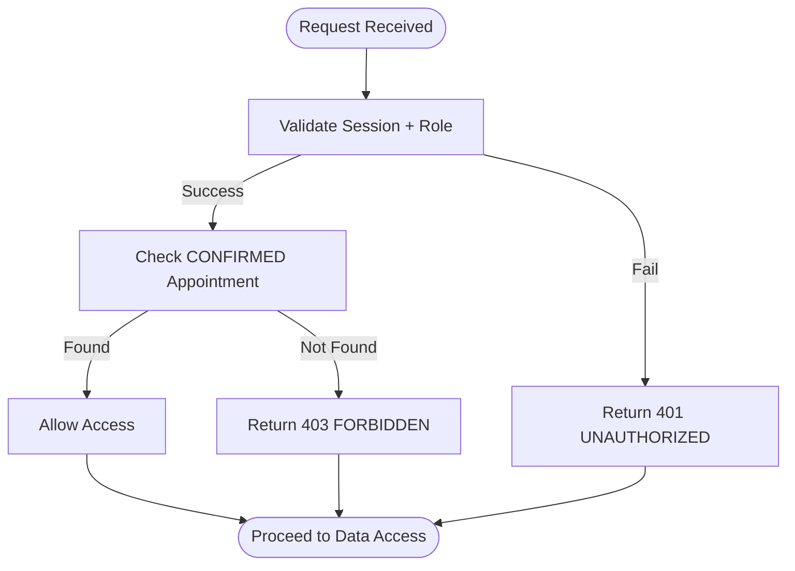

# Veterinary Tools API

<cite>
**Referenced Files in This Document**
- [route.ts](file://app/api/vet/discovery/route.ts)
- [route.ts](file://app/api/vet/patients/route.ts)
- [route.ts](file://app/api/vet/patients/[petId]/route.ts)
- [route.ts](file://app/api/vet/patients/[petId]/history/route.ts)
- [route.ts](file://app/api/vet/profile/route.ts)
- [auth.ts](file://lib/auth.ts)
- [schema.prisma](file://prisma/schema.prisma)
</cite>

## Table of Contents
1. [Introduction](#introduction)
2. [Project Structure](#project-structure)
3. [Core Components](#core-components)
4. [Architecture Overview](#architecture-overview)
5. [Detailed Component Analysis](#detailed-component-analysis)
6. [Dependency Analysis](#dependency-analysis)
7. [Performance Considerations](#performance-considerations)
8. [Troubleshooting Guide](#troubleshooting-guide)
9. [Conclusion](#conclusion)

## Introduction
This document provides comprehensive API documentation for the veterinary tools and patient management endpoints in the PETIVA system. It covers vet discovery, patient listing, individual patient access, medical history retrieval, and veterinarian profile management. For each endpoint, it specifies HTTP methods, URL patterns, request parameters, response schemas, role-based access controls, and examples of typical usage scenarios such as finding veterinarians by specialty/location, accessing patient records, writing medical notes, and managing vet profiles. It also documents authorization requirements for veterinary staff, patient privacy protections, and data sharing permissions between vets and clinics.

## Project Structure
The veterinary APIs are implemented as Next.js Route Handlers under app/api/vet. Each endpoint enforces authentication and role checks via shared utilities and reads/writes to a PostgreSQL database through Prisma. The core models include User, Veterinarian, Pet, Appointment, MedicalRecord, MedicalRecordVersion, Clinic, VetClinicAssociation, Vaccination, Medication, Allergy, HealthCondition, HealthMetric, and AuditLog.

**Diagram sources**
- [route.ts:1-60](file://app/api/vet/discovery/route.ts#L1-L60)
- [route.ts:1-71](file://app/api/vet/patients/route.ts#L1-L71)
- [route.ts:1-80](file://app/api/vet/patients/[petId]/route.ts#L1-L80)
- [route.ts:1-153](file://app/api/vet/patients/[petId]/history/route.ts#L1-L153)
- [route.ts:1-100](file://app/api/vet/profile/route.ts#L1-L100)
- [auth.ts:109-124](file://lib/auth.ts#L109-L124)

**Section sources**
- [route.ts:1-60](file://app/api/vet/discovery/route.ts#L1-L60)
- [route.ts:1-71](file://app/api/vet/patients/route.ts#L1-L71)
- [route.ts:1-80](file://app/api/vet/patients/[petId]/route.ts#L1-L80)
- [route.ts:1-153](file://app/api/vet/patients/[petId]/history/route.ts#L1-L153)
- [route.ts:1-100](file://app/api/vet/profile/route.ts#L1-L100)
- [auth.ts:109-124](file://lib/auth.ts#L109-L124)
- [schema.prisma:30-312](file://prisma/schema.prisma#L30-L312)

## Core Components
- Authentication and Authorization:
  - requireAuth ensures a valid session exists and returns the current user.
  - requireRole restricts access to users with specific roles (e.g., VETERINARIAN).
- Database Access:
  - Prisma client queries across Veterinarian, Pet, Appointment, MedicalRecord, and related entities.
- Role Model:
  - UserRole includes PET_OWNER, VETERINARIAN, CLINIC_ADMIN, PLATFORM_ADMIN.

Key behaviors:
- Vet discovery lists all veterinarians with their active clinic associations.
- Patient listing shows pets with confirmed appointments for the authenticated veterinarian.
- Individual patient access requires a confirmed appointment between the vet and the pet.
- Medical history retrieval aggregates records, vaccinations, medications, allergies, conditions, and metrics for an authorized pet.
- Profile endpoints allow vets to read and update their professional profile fields.

**Section sources**
- [auth.ts:109-124](file://lib/auth.ts#L109-L124)
- [schema.prisma:9-14](file://prisma/schema.prisma#L9-L14)
- [route.ts:1-71](file://app/api/vet/patients/route.ts#L1-L71)
- [route.ts:1-80](file://app/api/vet/patients/[petId]/route.ts#L1-L80)
- [route.ts:1-153](file://app/api/vet/patients/[petId]/history/route.ts#L1-L153)
- [route.ts:1-100](file://app/api/vet/profile/route.ts#L1-L100)

## Architecture Overview
The veterinary APIs follow a consistent pattern:
- Validate session and role using middleware-like functions.
- Resolve authorization based on business rules (e.g., confirmed appointment).
- Query or mutate data via Prisma.
- Return standardized success/error responses.

**Diagram sources**
- [auth.ts:109-124](file://lib/auth.ts#L109-L124)
- [route.ts:1-71](file://app/api/vet/patients/route.ts#L1-L71)
- [route.ts:1-153](file://app/api/vet/patients/[petId]/history/route.ts#L1-L153)

## Detailed Component Analysis

### Vet Discovery: GET /api/vet/discovery
- Purpose: Browse/search available veterinarians and their active clinic associations.
- Method: GET
- URL: /api/vet/discovery
- Authentication: Requires a valid session (requireAuth).
- Authorization: Any authenticated user can list vets; no role restriction enforced here.
- Request Parameters: None.
- Response Schema:
  - success: boolean
  - veterinarians: array of vet objects containing:
    - id: string
    - specialization: string?
    - licenseNumber: string
    - isVerified: boolean
    - firstName: string
    - lastName: string
    - email: string
    - phone: string?
    - clinics: array of clinic objects (only ACTIVE status):
      - id: string
      - name: string
      - address: string
- Notes:
  - Filtering by specialty or location is not implemented server-side; clients should filter the returned list locally if needed.
- Example Usage:
  - Find veterinarians by specialty: retrieve all vets and filter by specialization field.
  - Find veterinarians by location: retrieve all vets and filter by clinic address.

**Section sources**
- [route.ts:1-60](file://app/api/vet/discovery/route.ts#L1-L60)
- [schema.prisma:90-131](file://prisma/schema.prisma#L90-L131)

### Patient Management: GET /api/vet/patients
- Purpose: List patients (pets) that have confirmed appointments with the authenticated veterinarian.
- Method: GET
- URL: /api/vet/patients
- Authentication: Required.
- Authorization: Requires VETERINARIAN role.
- Request Parameters: None.
- Response Schema:
  - success: boolean
  - patients: array of pet objects with owner details and latest appointment date:
    - id: string
    - ownerId: string
    - name: string
    - species: string
    - breed: string?
    - gender: string?
    - dateOfBirth: datetime?
    - weight: decimal?
    - owner: { firstName, lastName, phone }
    - appointmentDate: datetime (from latest CONFIRMED appointment)
- Notes:
  - Only pets with at least one CONFIRMED appointment with this vet are included.
  - Duplicate pets are de-duplicated; only the most recent appointment date is attached.
- Example Usage:
  - Retrieve your patient roster to manage upcoming visits.

**Section sources**
- [route.ts:1-71](file://app/api/vet/patients/route.ts#L1-L71)
- [schema.prisma:68-88](file://prisma/schema.prisma#L68-L88)
- [schema.prisma:164-182](file://prisma/schema.prisma#L164-L182)

### Individual Patient Access: GET /api/vet/patients/[petId]
- Purpose: Retrieve detailed information for a specific pet when the vet has a confirmed appointment with that pet.
- Method: GET
- URL: /api/vet/patients/{petId}
- Path Parameter:
  - petId: string (required)
- Authentication: Required.
- Authorization: Requires VETERINARIAN role and a CONFIRMED appointment between the vet and the pet.
- Response Schema:
  - success: boolean
  - pet: full pet object including owner details:
    - id, ownerId, name, species, breed, gender, dateOfBirth, weight
    - owner: { firstName, lastName, phone, email }
- Error Responses:
  - 403 FORBIDDEN: No confirmed appointment exists with this pet.
  - 404 NOT_FOUND: Veterinarian profile not found or pet not found.
- Example Usage:
  - Access patient record before or after an appointment to review owner contact info and pet details.

**Section sources**
- [route.ts:1-80](file://app/api/vet/patients/[petId]/route.ts#L1-L80)
- [schema.prisma:68-88](file://prisma/schema.prisma#L68-L88)
- [schema.prisma:164-182](file://prisma/schema.prisma#L164-L182)

### Medical History Retrieval: GET /api/vet/patients/[petId]/history
- Purpose: Fetch complete medical details and records for an authorized pet.
- Method: GET
- URL: /api/vet/patients/{petId}/history
- Path Parameter:
  - petId: string (required)
- Authentication: Required.
- Authorization: Requires VETERINARIAN role and a CONFIRMED appointment between the vet and the pet.
- Response Schema:
  - success: boolean
  - history: object containing:
    - medicalRecords: array of MedicalRecord with versions and authoring vet info
    - vaccinations: array of Vaccination
    - medications: array of Medication
    - allergies: array of Allergy
    - conditions: array of HealthCondition
    - metrics: array of HealthMetric
- Notes:
  - Medical records include versioned entries ordered by creation time descending.
  - Authoring vet info includes editor names from the linked User model.
- Example Usage:
  - Review a pet’s full clinical history prior to an examination.

**Section sources**
- [route.ts:1-153](file://app/api/vet/patients/[petId]/history/route.ts#L1-L153)
- [schema.prisma:133-162](file://prisma/schema.prisma#L133-L162)
- [schema.prisma:196-244](file://prisma/schema.prisma#L196-L244)

### Writing Medical Notes: POST /api/vet/patients/[petId]/history
- Purpose: Create a new medical record entry (symptoms, diagnosis, treatment plan, optional notes) for an authorized pet.
- Method: POST
- URL: /api/vet/patients/{petId}/history
- Path Parameter:
  - petId: string (required)
- Authentication: Required.
- Authorization: Requires VETERINARIAN role and a CONFIRMED appointment between the vet and the pet.
- Request Body:
  - symptoms: string (required)
  - diagnosis: string (required)
  - treatmentPlan: string (required)
  - notes: string? (optional)
- Response Schema:
  - success: boolean
  - record: created MedicalRecord with initial version and audit log entry
- Validation Errors:
  - 400 BAD_REQUEST: Missing required fields (symptoms, diagnosis, treatmentPlan).
- Security:
  - Creates a MedicalRecord and its first version within a transaction.
  - Writes an AuditLog entry for traceability.
- Example Usage:
  - Add a new visit note documenting symptoms, diagnosis, and treatment plan.

**Section sources**
- [route.ts:71-153](file://app/api/vet/patients/[petId]/history/route.ts#L71-L153)
- [schema.prisma:133-162](file://prisma/schema.prisma#L133-L162)
- [schema.prisma:298-311](file://prisma/schema.prisma#L298-L311)

### Vet Profile Management: GET /api/vet/profile and PUT /api/vet/profile
- Purpose: Read and update the authenticated veterinarian’s professional profile.
- Methods:
  - GET: Retrieve vet profile
  - PUT: Update vet profile
- URL: /api/vet/profile
- Authentication: Required.
- Authorization: Requires VETERINARIAN role.
- GET Response Schema:
  - success: boolean
  - vet: object containing:
    - id: string
    - email: string
    - firstName: string
    - lastName: string
    - phone: string?
    - specialization: string?
    - licenseNumber: string
    - isVerified: boolean
    - verifiedAt: datetime?
- PUT Request Body:
  - firstName: string (required)
  - lastName: string (required)
  - phone: string? (optional)
  - specialization: string? (optional)
- PUT Response Schema:
  - success: boolean
  - vet: updated vet object with latest values
- Validation Errors:
  - 400 BAD_REQUEST: Missing firstName or lastName.
- Notes:
  - Updates both User (contact/name) and Veterinarian (specialization) tables atomically via a transaction.

**Section sources**
- [route.ts:1-100](file://app/api/vet/profile/route.ts#L1-L100)
- [schema.prisma:30-53](file://prisma/schema.prisma#L30-L53)
- [schema.prisma:90-105](file://prisma/schema.prisma#L90-L105)

## Dependency Analysis
- Authentication dependency:
  - All vet endpoints depend on lib/auth for session validation and role enforcement.
- Data dependencies:
  - Vet discovery depends on Veterinarian, User, and VetClinicAssociation/Clinic relationships.
  - Patient listing depends on Appointment (CONFIRMED), Pet, and User (owner).
  - Individual patient access depends on Appointment (CONFIRMED) and Pet with Owner details.
  - Medical history depends on MedicalRecord, MedicalRecordVersion, Vaccination, Medication, Allergy, HealthCondition, HealthMetric.
  - Profile management depends on User and Veterinarian.

**Diagram sources**
- [auth.ts:109-124](file://lib/auth.ts#L109-L124)
- [route.ts:1-60](file://app/api/vet/discovery/route.ts#L1-L60)
- [route.ts:1-71](file://app/api/vet/patients/route.ts#L1-L71)
- [route.ts:1-80](file://app/api/vet/patients/[petId]/route.ts#L1-L80)
- [route.ts:1-153](file://app/api/vet/patients/[petId]/history/route.ts#L1-L153)
- [route.ts:1-100](file://app/api/vet/profile/route.ts#L1-L100)

**Section sources**
- [auth.ts:109-124](file://lib/auth.ts#L109-L124)
- [schema.prisma:30-312](file://prisma/schema.prisma#L30-L312)

## Performance Considerations
- Vet discovery returns all veterinarians; consider client-side filtering for large datasets.
- Patient listing uses de-duplication logic; ensure indexes exist on Appointment(vetId, dateTime) and Pet(id) for efficient queries.
- Medical history performs multiple parallel queries; ensure appropriate indexes on MedicalRecord(petId), Vaccination(petId), Medication(petId), Allergy(petId), HealthCondition(petId), HealthMetric(petId).
- Use pagination or filtering in future enhancements to reduce payload sizes for large histories.

[No sources needed since this section provides general guidance]

## Troubleshooting Guide
Common errors and resolutions:
- UNAUTHORIZED (401):
  - Occurs when no valid session is present. Ensure the session cookie is set and not expired.
- FORBIDDEN (403):
  - Occurs when the user lacks the required role or does not have a confirmed appointment with the pet. Verify role assignment and appointment status.
- NOT_FOUND (404):
  - Occurs when a veterinarian profile or pet is missing. Confirm IDs and existence in the database.
- BAD_REQUEST (400):
  - Occurs when required fields are missing in requests (e.g., creating medical records or updating profiles). Validate payloads before sending.
- INTERNAL_SERVER_ERROR (500):
  - Indicates unexpected server issues. Check logs and database connectivity.

Authorization flow for patient-related endpoints:

**Section sources**
- [auth.ts:109-124](file://lib/auth.ts#L109-L124)
- [route.ts:1-80](file://app/api/vet/patients/[petId]/route.ts#L1-L80)
- [route.ts:71-153](file://app/api/vet/patients/[petId]/history/route.ts#L71-L153)

## Conclusion
The veterinary tools API provides secure, role-based access to vet discovery, patient management, medical history, and profile operations. Authorization is tightly controlled through session validation and role checks, with additional business-rule enforcement ensuring vets can only access pets with confirmed appointments. Data integrity is maintained via transactions and audit logging for critical writes. Future enhancements may include advanced search filters, pagination, and expanded clinic-level permissions to support multi-vet workflows.

[No sources needed since this section summarizes without analyzing specific files]