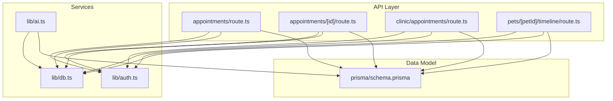
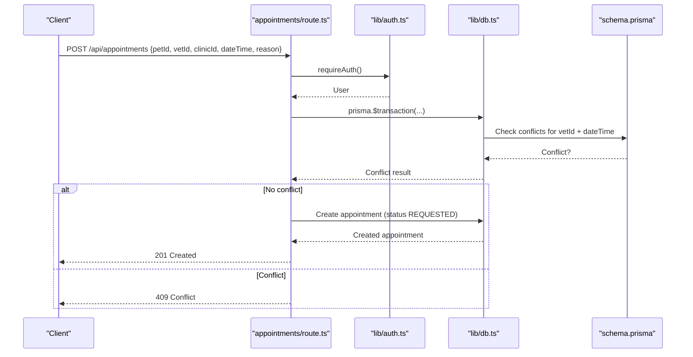
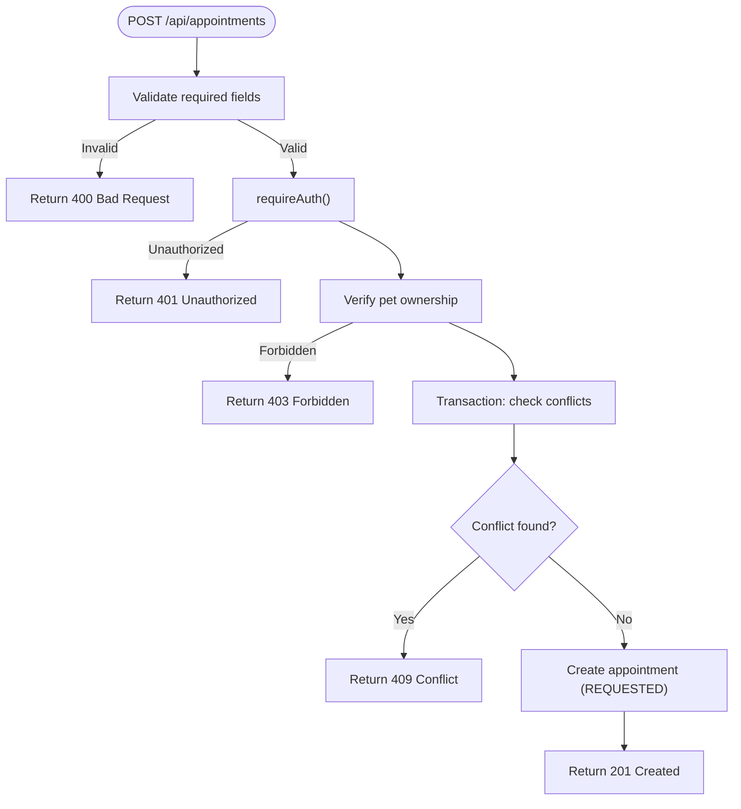
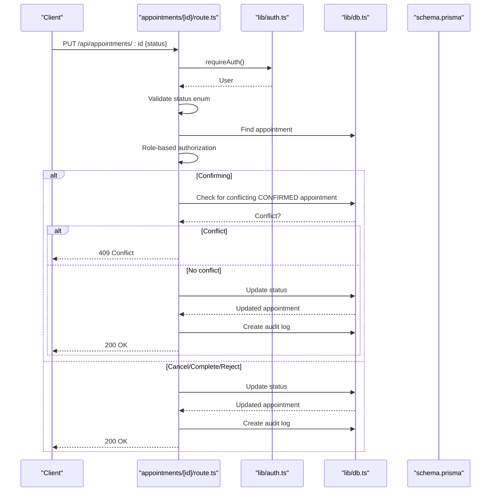
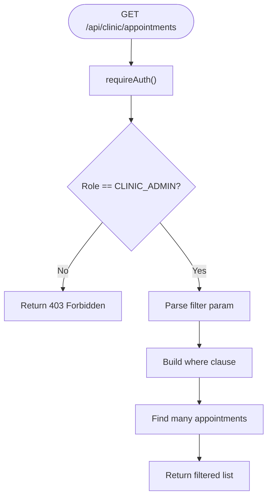
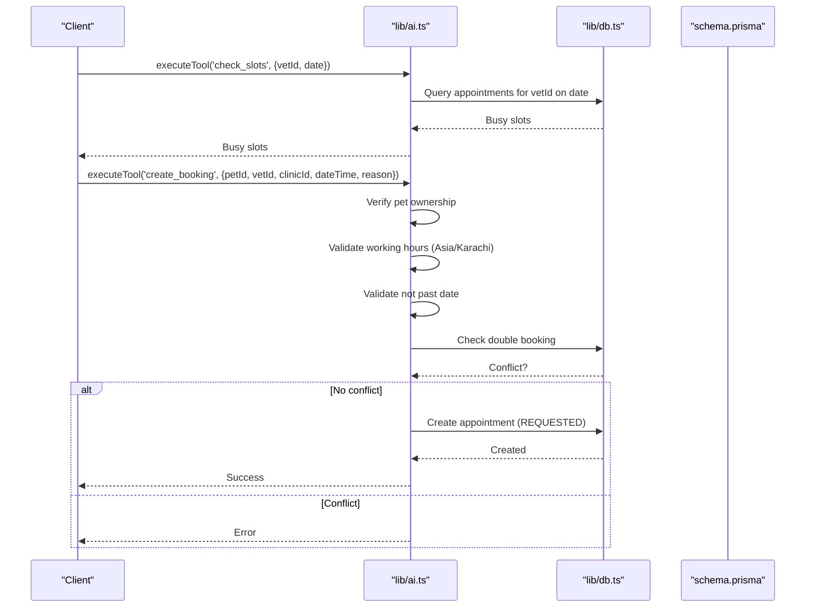
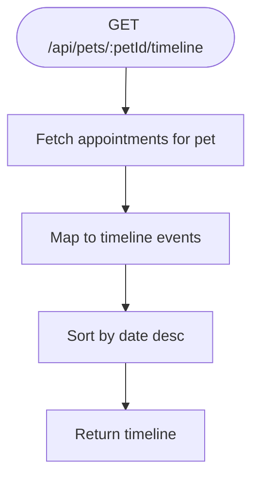
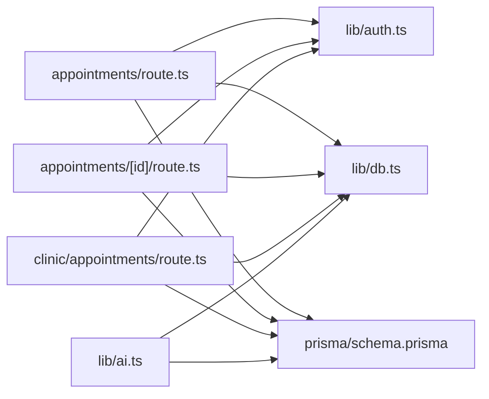

# Appointment Scheduling System

<cite>
**Referenced Files in This Document**
- [route.ts](file://app/api/appointments/route.ts)
- [route.ts](file://app/api/appointments/[appointmentId]/route.ts)
- [route.ts](file://app/api/clinic/appointments/route.ts)
- [schema.prisma](file://prisma/schema.prisma)
- [db.ts](file://lib/db.ts)
- [auth.ts](file://lib/auth.ts)
- [ai.ts](file://lib/ai.ts)
- [test_booking.ts](file://test_booking.ts)
- [timeline route.ts](file://app/api/pets/[petId]/timeline/route.ts)
</cite>

## Table of Contents
1. [Introduction](#introduction)
2. [Project Structure](#project-structure)
3. [Core Components](#core-components)
4. [Architecture Overview](#architecture-overview)
5. [Detailed Component Analysis](#detailed-component-analysis)
6. [Dependency Analysis](#dependency-analysis)
7. [Performance Considerations](#performance-considerations)
8. [Troubleshooting Guide](#troubleshooting-guide)
9. [Conclusion](#conclusion)
10. [Appendices](#appendices)

## Introduction
This document explains the Appointment Scheduling System in PETIVA, focusing on the end-to-end booking workflow from availability checking to appointment confirmation. It covers real-time slot reservation, conflict prevention, working hours enforcement, multi-vet clinic support, appointment status management, calendar integration, notifications/reminders, rescheduling/cancellation workflows, and performance considerations for concurrent requests. It also includes testing approaches for scheduling logic and edge cases such as timezone differences and daylight saving transitions.

## Project Structure
The scheduling system is implemented as a set of Next.js API routes backed by Prisma with PostgreSQL. The core data model defines users, pets, veterinarians, clinics, appointments, notifications, reminders, and audit logs. AI-driven tools provide additional scheduling capabilities including slot checks and bookings.

**Diagram sources**
- [route.ts:1-143](file://app/api/appointments/route.ts#L1-L143)
- [route.ts:1-119](file://app/api/appointments/[appointmentId]/route.ts#L1-L119)
- [route.ts:1-98](file://app/api/clinic/appointments/route.ts#L1-L98)
- [timeline route.ts:122-148](file://app/api/pets/[petId]/timeline/route.ts#L122-L148)
- [auth.ts:1-125](file://lib/auth.ts#L1-L125)
- [ai.ts:1-467](file://lib/ai.ts#L1-L467)
- [db.ts:1-33](file://lib/db.ts#L1-L33)
- [schema.prisma:1-312](file://prisma/schema.prisma#L1-L312)

**Section sources**
- [route.ts:1-143](file://app/api/appointments/route.ts#L1-L143)
- [schema.prisma:1-312](file://prisma/schema.prisma#L1-L312)

## Core Components
- Appointment creation and listing: REST endpoints for pet owners, veterinarians, and clinic admins.
- Status transitions: Confirm, cancel, complete, reject with role-based authorization and audit logging.
- Availability and conflicts: Real-time double-booking prevention using database transactions.
- Working hours enforcement: Timezone-aware validation (e.g., Asia/Karachi) for booking times.
- Multi-vet clinic support: Appointments are associated with both vet and clinic; clinic admins can view all appointments within their clinic.
- Calendar integration: Timeline endpoint aggregates appointments into events for UI calendars.
- Notifications and reminders: Data models exist for notifications and reminders; current implementation focuses on storage and retrieval hooks.
- AI-assisted scheduling: Tools to check slots and create bookings with validations.

**Section sources**
- [route.ts:1-143](file://app/api/appointments/route.ts#L1-L143)
- [route.ts:1-119](file://app/api/appointments/[appointmentId]/route.ts#L1-L119)
- [route.ts:1-98](file://app/api/clinic/appointments/route.ts#L1-L98)
- [ai.ts:1-467](file://lib/ai.ts#L1-L467)
- [schema.prisma:164-182](file://prisma/schema.prisma#L164-L182)
- [schema.prisma:260-278](file://prisma/schema.prisma#L260-L278)

## Architecture Overview
The system follows a layered architecture:
- API layer: Next.js route handlers enforce authentication, authorization, input validation, and business rules.
- Service layer: Shared utilities for auth, DB connection pooling, and AI tooling.
- Data layer: Prisma client over PostgreSQL with typed schema and indexes for performance.

**Diagram sources**
- [route.ts:69-143](file://app/api/appointments/route.ts#L69-L143)
- [auth.ts:109-115](file://lib/auth.ts#L109-L115)
- [db.ts:1-33](file://lib/db.ts#L1-L33)
- [schema.prisma:164-182](file://prisma/schema.prisma#L164-L182)

## Detailed Component Analysis

### Appointment Creation Workflow
- Authentication and authorization: Ensures the requester owns the pet or has appropriate role.
- Input validation: Required fields validated before processing.
- Conflict detection: Uses a transaction to atomically check for existing REQUESTED or CONFIRMED appointments at the same vet and time.
- Creation: Creates an appointment with status REQUESTED and returns enriched data.

**Diagram sources**
- [route.ts:69-143](file://app/api/appointments/route.ts#L69-L143)

**Section sources**
- [route.ts:69-143](file://app/api/appointments/route.ts#L69-L143)

### Appointment Status Management
- Role-based boundary checks: Pet owners can cancel upcoming appointments; veterinarians manage their own; clinic admins manage within their clinic; platform admins have broad access.
- Double-booking guard during confirmation: Prevents confirming overlapping appointments for the same vet at the same time.
- Audit logging: Every status update is recorded in audit logs for compliance and traceability.

**Diagram sources**
- [route.ts:1-119](file://app/api/appointments/[appointmentId]/route.ts#L1-L119)
- [schema.prisma:22-28](file://prisma/schema.prisma#L22-L28)
- [schema.prisma:298-311](file://prisma/schema.prisma#L298-L311)

**Section sources**
- [route.ts:1-119](file://app/api/appointments/[appointmentId]/route.ts#L1-L119)

### Clinic Admin View and Filtering
- Access control: Only clinic admins can list clinic-wide appointments.
- Filters: ALL, TODAY, UPCOMING, COMPLETED, CANCELLED, REQUESTED, CONFIRMED.
- Enriched queries: Includes pet, owner, vet user details, and clinic info.

**Diagram sources**
- [route.ts:1-98](file://app/api/clinic/appointments/route.ts#L1-L98)

**Section sources**
- [route.ts:1-98](file://app/api/clinic/appointments/route.ts#L1-L98)

### AI-Assisted Scheduling Tools
- Slot checking: Returns busy slots for a vet on a given date, considering only REQUESTED and CONFIRMED statuses.
- Booking via AI: Validates pet ownership, working hours (Asia/Karachi), past dates, and double-booking before creating an appointment.
- Provider abstraction: Supports multiple AI providers with fallback.

**Diagram sources**
- [ai.ts:375-462](file://lib/ai.ts#L375-L462)
- [schema.prisma:164-182](file://prisma/schema.prisma#L164-L182)

**Section sources**
- [ai.ts:141-467](file://lib/ai.ts#L141-L467)

### Calendar Integration
- Timeline aggregation: Retrieves appointments for a pet and formats them as timeline events with metadata (vetId, clinicId).
- Sorting: Events sorted chronologically descending for display.

**Diagram sources**
- [timeline route.ts:122-148](file://app/api/pets/[petId]/timeline/route.ts#L122-L148)

**Section sources**
- [timeline route.ts:122-148](file://app/api/pets/[petId]/timeline/route.ts#L122-L148)

### Working Hours Enforcement
- Timezone-aware validation: Uses Asia/Karachi timezone to determine allowed hours (e.g., 9 AM–5 PM).
- Past date prevention: Rejects bookings for dates earlier than the current date in the target timezone.
- Consistency: Both API and AI paths apply similar constraints to ensure uniform behavior.

**Section sources**
- [ai.ts:418-436](file://lib/ai.ts#L418-L436)

### Multi-Vet Clinic Support
- Associations: Veterinarians are linked to clinics via VetClinicAssociation with status tracking.
- Queries: Appointments include clinicId and vetId; clinic admins can filter by clinic context.
- Views: Clinic dashboards aggregate stats and lists across vets within the clinic.

**Section sources**
- [schema.prisma:90-131](file://prisma/schema.prisma#L90-L131)
- [schema.prisma:164-182](file://prisma/schema.prisma#L164-L182)
- [route.ts:1-98](file://app/api/clinic/appointments/route.ts#L1-L98)

### Notification and Reminder Systems
- Models: Notification and Reminder entities exist for storing messages and due dates.
- Current usage: Endpoints focus on appointment CRUD; notification/reminder creation is available for extension points.

**Section sources**
- [schema.prisma:260-278](file://prisma/schema.prisma#L260-L278)

### Rescheduling and Cancellation Workflows
- Cancellation: Pet owners can cancel upcoming appointments via status update endpoint.
- Rescheduling: Typically involves cancelling the original and creating a new appointment; ensure no conflicts and valid working hours.
- Authorization: Role-based checks prevent unauthorized modifications.

**Section sources**
- [route.ts:1-119](file://app/api/appointments/[appointmentId]/route.ts#L1-L119)
- [route.ts:69-143](file://app/api/appointments/route.ts#L69-L143)

## Dependency Analysis
- API routes depend on authentication middleware and Prisma client.
- AI tools depend on Prisma and environment configuration for AI providers.
- Database connection pooling is managed centrally to avoid leaks and improve performance.

**Diagram sources**
- [route.ts:1-143](file://app/api/appointments/route.ts#L1-L143)
- [route.ts:1-119](file://app/api/appointments/[appointmentId]/route.ts#L1-L119)
- [route.ts:1-98](file://app/api/clinic/appointments/route.ts#L1-L98)
- [ai.ts:1-467](file://lib/ai.ts#L1-L467)
- [db.ts:1-33](file://lib/db.ts#L1-L33)
- [schema.prisma:1-312](file://prisma/schema.prisma#L1-L312)

**Section sources**
- [db.ts:1-33](file://lib/db.ts#L1-L33)
- [schema.prisma:1-312](file://prisma/schema.prisma#L1-L312)

## Performance Considerations
- Database locking strategies:
  - Use Prisma transactions for atomic conflict checks during booking creation to prevent race conditions.
  - Leverage unique constraints and indexes on vetId+dateTime to speed up conflict queries.
- Connection pooling:
  - Centralized pool in production mode avoids duplicate connections and improves throughput.
- Query optimization:
  - Include only necessary relations to reduce payload size.
  - Use filters (date ranges, statuses) to limit query scope.
- Cache invalidation patterns:
  - When appointments change, invalidate any cached views for affected vet/clinic timelines.
  - For AI tools, re-check slots immediately after booking to reflect real-time state.
- Concurrency:
  - Transactions serialize conflicting writes; consider idempotency keys for retry safety.
  - Rate-limit endpoints if needed to protect against bursts.

[No sources needed since this section provides general guidance]

## Troubleshooting Guide
Common issues and resolutions:
- Unauthorized access: Ensure session cookie is present and valid; verify role permissions.
- Forbidden actions: Confirm user role matches required permissions (e.g., clinic admin for clinic-wide views).
- Conflicts: If double-booking errors occur, verify that the requested slot is free and within working hours.
- Timezone mismatches: Ensure datetime values are normalized to UTC and displayed in local timezones consistently.
- Audit logs: Review audit logs for status changes to trace who modified appointments and when.

**Section sources**
- [route.ts:1-119](file://app/api/appointments/[appointmentId]/route.ts#L1-L119)
- [route.ts:69-143](file://app/api/appointments/route.ts#L69-L143)
- [schema.prisma:298-311](file://prisma/schema.prisma#L298-L311)

## Conclusion
PETIVA’s Appointment Scheduling System provides a robust foundation for managing veterinary appointments with strong conflict prevention, role-based authorization, timezone-aware working hours, and multi-vet clinic support. The combination of REST APIs and AI tools enables flexible booking experiences while maintaining data integrity through transactions and audit trails. Extending notifications and reminders will further enhance user engagement and operational efficiency.

[No sources needed since this section summarizes without analyzing specific files]

## Appendices

### Common Scheduling Scenarios
- Recurring appointments: Implement recurring logic by creating multiple appointments with staggered dates, ensuring each respects working hours and conflicts.
- Emergency bookings: Allow bypass of normal restrictions with elevated privileges; still enforce basic conflict checks and audit logging.
- Bulk scheduling: Batch-create appointments with transactional boundaries per batch; validate each slot individually and handle partial failures gracefully.

[No sources needed since this section provides conceptual guidance]

### Testing Approaches
- Unit tests: Validate input parsing, role checks, and error responses.
- Integration tests: Simulate concurrent booking attempts to verify transactional conflict resolution.
- Timezone tests: Assert behavior around DST transitions and different timezones; ensure consistent UTC storage and localized display.
- Scenario tests: Cover past dates, outside working hours, double bookings, and role-bound operations.

**Section sources**
- [test_booking.ts:1-149](file://test_booking.ts#L1-L149)