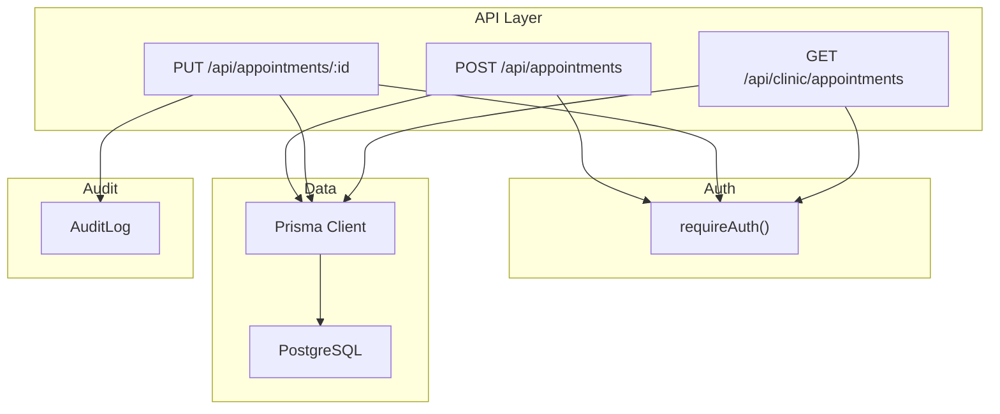
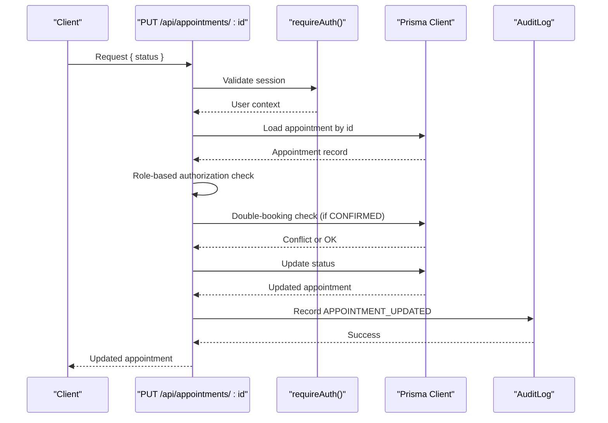
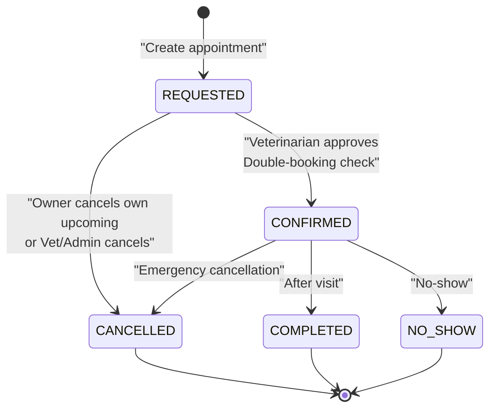
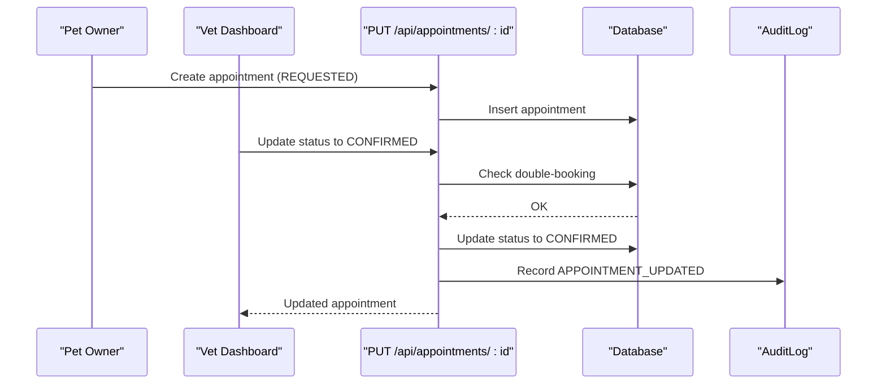
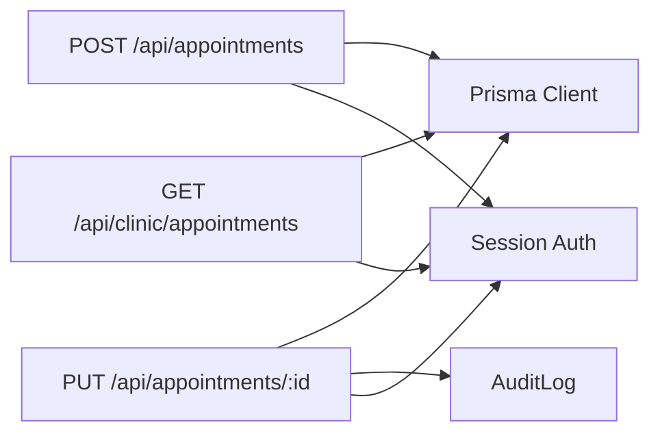

# Appointment Status Management & Transitions

<cite>
**Referenced Files in This Document**
- [schema.prisma](file://prisma/schema.prisma)
- [route.ts (appointments POST)](file://app/api/appointments/route.ts)
- [route.ts (appointments PUT by ID)](file://app/api/appointments/[appointmentId]/route.ts)
- [route.ts (clinic appointments GET)](file://app/api/clinic/appointments/route.ts)
- [auth.ts](file://lib/auth.ts)
- [api-specification.md](file://docs/03-architecture/03-api-specification.md)
- [security.md](file://docs/03-architecture/06-security.md)
- [system-architecture.md](file://docs/03-architecture/01-system-architecture.md)
- [vet dashboard page.tsx](file://app/vet/dashboard/page.tsx)
</cite>

## Table of Contents
1. [Introduction](#introduction)
2. [Project Structure](#project-structure)
3. [Core Components](#core-components)
4. [Architecture Overview](#architecture-overview)
5. [Detailed Component Analysis](#detailed-component-analysis)
6. [Dependency Analysis](#dependency-analysis)
7. [Performance Considerations](#performance-considerations)
8. [Troubleshooting Guide](#troubleshooting-guide)
9. [Conclusion](#conclusion)
10. [Appendices](#appendices)

## Introduction
This document explains the appointment status management system for the Pet Healthcare application, covering the full lifecycle from creation to completion. It details supported statuses, valid transitions, business rules, API endpoints for updating status, authorization checks, audit logging, and integration points with external systems. It also provides example workflows for common scenarios such as confirmations, rescheduling, no-shows, and emergency cancellations.

## Project Structure
The appointment status system is implemented across:
- Data model definitions for statuses and entities
- RESTful API routes for creating and updating appointments
- Role-based authorization and session handling
- Audit logging for state changes
- Clinic and vet dashboards that trigger status updates

**Diagram sources**
- [route.ts (appointments POST):70-143](file://app/api/appointments/route.ts#L70-L143)
- [route.ts (appointments PUT by ID):7-119](file://app/api/appointments/[appointmentId]/route.ts#L7-L119)
- [route.ts (clinic appointments GET):5-98](file://app/api/clinic/appointments/route.ts#L5-L98)
- [auth.ts:109-115](file://lib/auth.ts#L109-L115)
- [schema.prisma:22-28](file://prisma/schema.prisma#L22-L28)
- [schema.prisma:164-182](file://prisma/schema.prisma#L164-L182)
- [schema.prisma:298-311](file://prisma/schema.prisma#L298-L311)

**Section sources**
- [schema.prisma:22-28](file://prisma/schema.prisma#L22-L28)
- [schema.prisma:164-182](file://prisma/schema.prisma#L164-L182)
- [route.ts (appointments POST):70-143](file://app/api/appointments/route.ts#L70-L143)
- [route.ts (appointments PUT by ID):7-119](file://app/api/appointments/[appointmentId]/route.ts#L7-L119)
- [route.ts (clinic appointments GET):5-98](file://app/api/clinic/appointments/route.ts#L5-L98)
- [auth.ts:109-115](file://lib/auth.ts#L109-L115)

## Core Components
- AppointmentStatus enum defines all supported states: REQUESTED, CONFIRMED, CANCELLED, COMPLETED, NO_SHOW.
- Appointment entity stores pet, owner, veterinarian, clinic, scheduled time, reason, and current status.
- API endpoints:
  - Create appointment (POST /api/appointments) sets initial status to REQUESTED.
  - Update appointment status (PUT /api/appointments/:id) enforces role-based permissions and double-booking checks.
  - Clinic admin listing (GET /api/clinic/appointments) supports filtering by status.
- Authorization uses requireAuth() to ensure a valid session and user context.
- Audit logging records status changes with actor, action, entity, and payload.

**Section sources**
- [schema.prisma:22-28](file://prisma/schema.prisma#L22-L28)
- [schema.prisma:164-182](file://prisma/schema.prisma#L164-L182)
- [route.ts (appointments POST):70-143](file://app/api/appointments/route.ts#L70-L143)
- [route.ts (appointments PUT by ID):7-119](file://app/api/appointments/[appointmentId]/route.ts#L7-L119)
- [route.ts (clinic appointments GET):5-98](file://app/api/clinic/appointments/route.ts#L5-L98)
- [auth.ts:109-115](file://lib/auth.ts#L109-L115)

## Architecture Overview
The status management flow integrates authentication, validation, database operations, and audit logging:

**Diagram sources**
- [route.ts (appointments PUT by ID):7-119](file://app/api/appointments/[appointmentId]/route.ts#L7-L119)
- [auth.ts:109-115](file://lib/auth.ts#L109-L115)
- [schema.prisma:298-311](file://prisma/schema.prisma#L298-L311)

## Detailed Component Analysis

### Supported Statuses and Valid Transitions
- Defined statuses: REQUESTED, CONFIRMED, CANCELLED, COMPLETED, NO_SHOW.
- Creation sets status to REQUESTED.
- Confirmed requires veterinarian approval and passes double-booking checks.
- Cancellation can be initiated by pet owners for their own upcoming appointments; veterinarians and clinic admins can cancel within their scope.
- Completion and No-show are terminal states typically set after the appointment occurs.

**Diagram sources**
- [schema.prisma:22-28](file://prisma/schema.prisma#L22-L28)
- [route.ts (appointments POST):112-127](file://app/api/appointments/route.ts#L112-L127)
- [route.ts (appointments PUT by ID):34-82](file://app/api/appointments/[appointmentId]/route.ts#L34-L82)

**Section sources**
- [schema.prisma:22-28](file://prisma/schema.prisma#L22-L28)
- [route.ts (appointments POST):112-127](file://app/api/appointments/route.ts#L112-L127)
- [route.ts (appointments PUT by ID):34-82](file://app/api/appointments/[appointmentId]/route.ts#L34-L82)

### Business Rules Governing Status Changes
- Authorization:
  - PET_OWNER: Can cancel only their own upcoming appointments.
  - VETERINARIAN: Can manage appointments assigned to them (confirm, cancel, complete).
  - CLINIC_ADMIN: Can manage appointments within their clinic.
  - PLATFORM_ADMIN: Full access.
- Validation:
  - Status must be one of the defined values.
  - Confirmation triggers a double-booking conflict check against existing CONFIRMED appointments at the same time slot for the same veterinarian.
- Timeframe constraints:
  - The code does not enforce explicit time windows for cancellation beyond ownership and role checks. Implementers may add time-based guards if required.

**Section sources**
- [route.ts (appointments PUT by ID):34-82](file://app/api/appointments/[appointmentId]/route.ts#L34-L82)
- [route.ts (appointments POST):84-110](file://app/api/appointments/route.ts#L84-L110)

### API Endpoints for Updating Appointment Status
- PUT /api/appointments/:id
  - Purpose: Update appointment status (e.g., CONFIRMED, CANCELLED, COMPLETED, NO_SHOW).
  - Authentication: Required via session cookie.
  - Authorization: Role-based boundary checks per user role and appointment ownership/assignment.
  - Validation: Ensures status is valid; performs double-booking check when confirming.
  - Side effects: Creates an audit log entry recording previous and new status.
  - Response: Returns updated appointment on success; structured error responses otherwise.

- POST /api/appointments
  - Purpose: Create a new appointment request.
  - Authentication: Required.
  - Authorization: PET_OWNER only; validates pet ownership.
  - Validation: Prevents double booking during creation; sets initial status to REQUESTED.
  - Response: 201 Created with appointment details.

- GET /api/clinic/appointments
  - Purpose: List clinic appointments with filters (ALL, TODAY, UPCOMING, COMPLETED, CANCELLED, REQUESTED, CONFIRMED).
  - Authentication: Required; CLINIC_ADMIN only.
  - Response: Appointments with related pet, owner, vet, and clinic data.

**Section sources**
- [route.ts (appointments PUT by ID):7-119](file://app/api/appointments/[appointmentId]/route.ts#L7-L119)
- [route.ts (appointments POST):70-143](file://app/api/appointments/route.ts#L70-L143)
- [route.ts (clinic appointments GET):5-98](file://app/api/clinic/appointments/route.ts#L5-L98)
- [api-specification.md:193-210](file://docs/03-architecture/03-api-specification.md#L193-L210)

### Authorization Checks and Audit Logging
- Authorization:
  - requireAuth() ensures a valid session and returns user context.
  - Role checks restrict actions based on PET_OWNER, VETERINARIAN, CLINIC_ADMIN, and PLATFORM_ADMIN roles.
- Audit Logging:
  - On status update, an AuditLog entry is created with userId, action (APPOINTMENT_UPDATED), entity (Appointment), entityId, and payload containing previous and new status.
  - Security documentation highlights audit logs for sensitive operations and lists relevant events.

**Section sources**
- [auth.ts:109-115](file://lib/auth.ts#L109-L115)
- [route.ts (appointments PUT by ID):94-103](file://app/api/appointments/[appointmentId]/route.ts#L94-L103)
- [schema.prisma:298-311](file://prisma/schema.prisma#L298-L311)
- [security.md:81-90](file://docs/03-architecture/06-security.md#L81-L90)

### Notification Triggers and External Integrations
- Current implementation does not include built-in notification triggers for status changes.
- Integration points exist via:
  - AuditLog entries for tracking changes.
  - Clinic and vet dashboards that display status and allow manual actions.
- Recommended approach:
  - Add event-driven notifications triggered by status transitions (e.g., email/SMS to owners upon CONFIRMED or CANCELLED).
  - Use webhooks or message queues to integrate with external notification services.

[No sources needed since this section provides general guidance based on observed gaps]

### Example Workflows

#### Appointment Confirmation Workflow

**Diagram sources**
- [route.ts (appointments POST):112-127](file://app/api/appointments/route.ts#L112-L127)
- [route.ts (appointments PUT by ID):65-103](file://app/api/appointments/[appointmentId]/route.ts#L65-L103)
- [vet dashboard page.tsx:545-560](file://app/vet/dashboard/page.tsx#L545-L560)

#### Rescheduling Workflow
- Cancel existing REQUESTED or CONFIRMED appointment.
- Create a new appointment for the desired time.
- Ensure double-booking checks pass for both operations.

**Section sources**
- [route.ts (appointments PUT by ID):34-82](file://app/api/appointments/[appointmentId]/route.ts#L34-L82)
- [route.ts (appointments POST):84-110](file://app/api/appointments/route.ts#L84-L110)

#### No-Show Handling
- After a CONFIRMED appointment where the owner does not attend, set status to NO_SHOW.
- Optionally notify the owner and schedule follow-up.

[No sources needed since this section provides general guidance]

#### Emergency Cancellation
- Veterinarian or clinic admin cancels a CONFIRMED appointment due to emergencies.
- Audit log captures the change for compliance.

**Section sources**
- [route.ts (appointments PUT by ID):34-82](file://app/api/appointments/[appointmentId]/route.ts#L34-L82)
- [route.ts (appointments PUT by ID):94-103](file://app/api/appointments/[appointmentId]/route.ts#L94-L103)

## Dependency Analysis
Key dependencies and relationships:
- API routes depend on Prisma client for data access and auth middleware for session validation.
- Status transitions rely on role-based authorization and double-booking checks.
- Audit logging depends on the AuditLog schema and is invoked on status updates.

**Diagram sources**
- [route.ts (appointments POST):70-143](file://app/api/appointments/route.ts#L70-L143)
- [route.ts (appointments PUT by ID):7-119](file://app/api/appointments/[appointmentId]/route.ts#L7-L119)
- [route.ts (clinic appointments GET):5-98](file://app/api/clinic/appointments/route.ts#L5-L98)
- [auth.ts:109-115](file://lib/auth.ts#L109-L115)
- [schema.prisma:298-311](file://prisma/schema.prisma#L298-L311)

**Section sources**
- [route.ts (appointments POST):70-143](file://app/api/appointments/route.ts#L70-L143)
- [route.ts (appointments PUT by ID):7-119](file://app/api/appointments/[appointmentId]/route.ts#L7-L119)
- [route.ts (clinic appointments GET):5-98](file://app/api/clinic/appointments/route.ts#L5-L98)
- [auth.ts:109-115](file://lib/auth.ts#L109-L115)
- [schema.prisma:298-311](file://prisma/schema.prisma#L298-L311)

## Performance Considerations
- Double-booking checks use targeted queries to minimize overhead.
- Filtering clinic appointments by status reduces dataset size.
- Consider adding indexes on frequently queried fields (already present for vetId, dateTime, ownerId, petId).
- For high-volume environments, consider caching frequent reads and using transactions for write-heavy operations.

[No sources needed since this section provides general guidance]

## Troubleshooting Guide
Common issues and resolutions:
- Unauthorized access:
  - Ensure a valid session exists; requireAuth() will throw UNAUTHENTICATED if missing.
- Forbidden action:
  - Verify role-based permissions; pet owners can only cancel their own upcoming appointments.
- Conflict on confirmation:
  - Another confirmed appointment exists at the same time slot for the same veterinarian; adjust scheduling.
- Internal server errors:
  - Check database connectivity and Prisma client usage; review error handling in API routes.

**Section sources**
- [route.ts (appointments PUT by ID):106-117](file://app/api/appointments/[appointmentId]/route.ts#L106-L117)
- [route.ts (appointments POST):130-141](file://app/api/appointments/route.ts#L130-L141)
- [route.ts (clinic appointments GET):85-96](file://app/api/clinic/appointments/route.ts#L85-L96)

## Conclusion
The appointment status management system provides a robust foundation for handling the full lifecycle of appointments with clear status definitions, role-based authorization, and audit logging. While core transitions and validations are implemented, additional features such as time-based cancellation rules and automated notifications can be added to enhance operational workflows.

[No sources needed since this section summarizes without analyzing specific files]

## Appendices

### API Reference Summary
- POST /api/appointments
  - Creates a new appointment with status REQUESTED.
  - Requires PET_OWNER role and validates pet ownership.
  - Prevents double booking during creation.
- PUT /api/appointments/:id
  - Updates appointment status with role-based checks and double-booking validation on confirmation.
  - Records audit log entries for status changes.
- GET /api/clinic/appointments
  - Lists clinic appointments with filter support for various statuses.
  - Requires CLINIC_ADMIN role.

**Section sources**
- [api-specification.md:193-210](file://docs/03-architecture/03-api-specification.md#L193-L210)
- [route.ts (appointments POST):70-143](file://app/api/appointments/route.ts#L70-L143)
- [route.ts (appointments PUT by ID):7-119](file://app/api/appointments/[appointmentId]/route.ts#L7-L119)
- [route.ts (clinic appointments GET):5-98](file://app/api/clinic/appointments/route.ts#L5-L98)