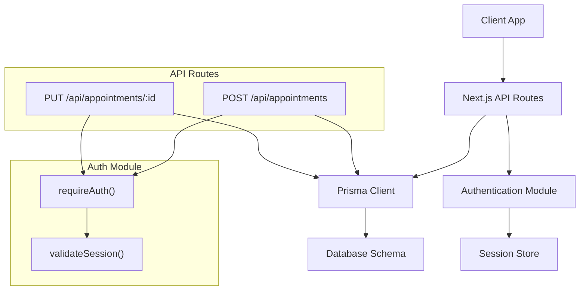
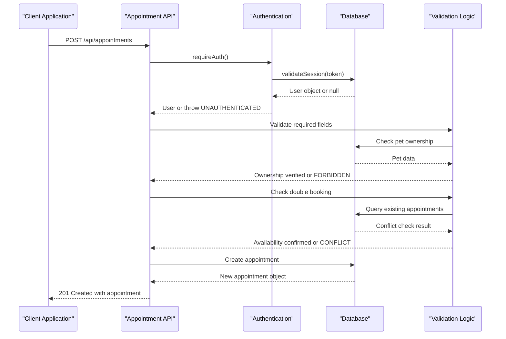
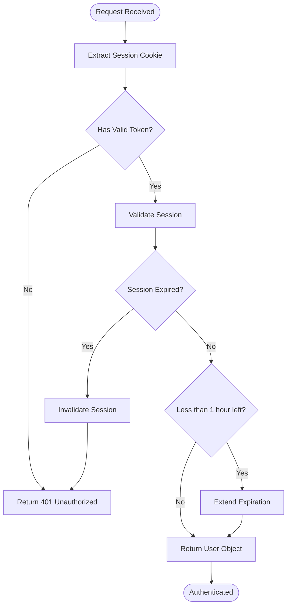
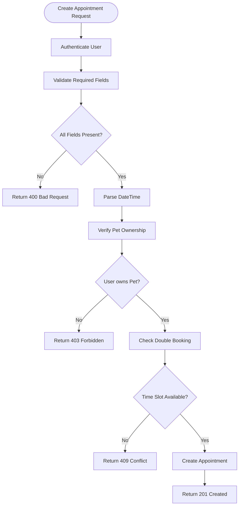
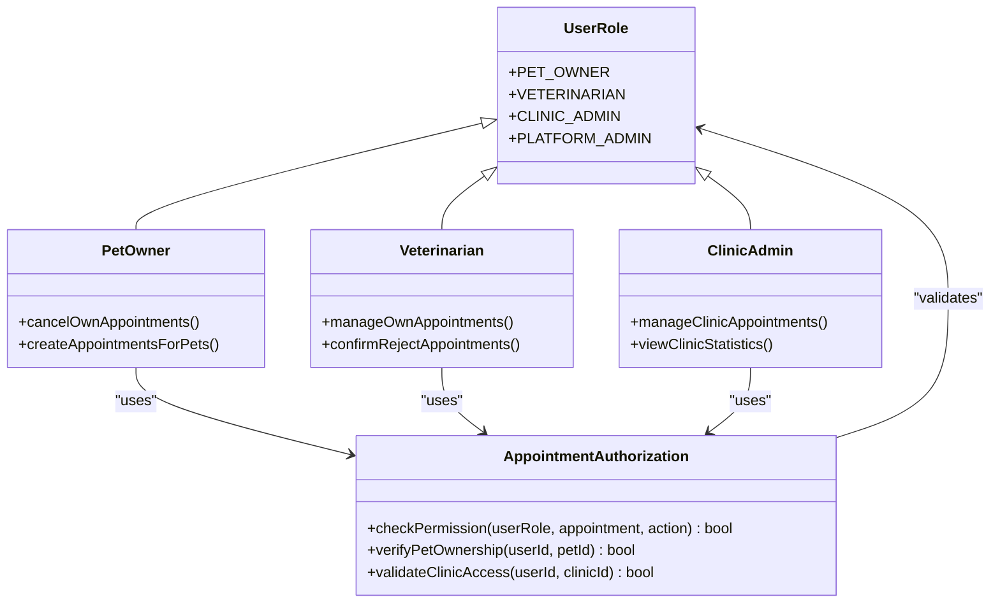
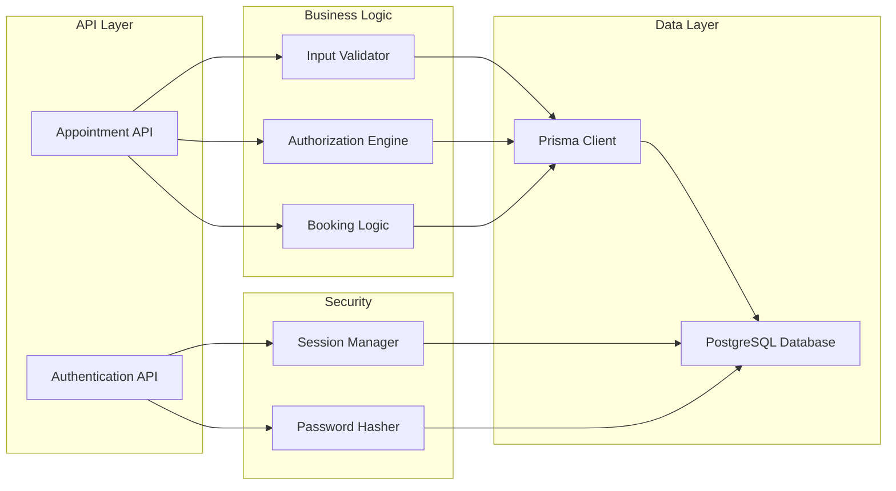

# Appointment Creation & Validation

<cite>
**Referenced Files in This Document**
- [route.ts](file://app/api/appointments/route.ts)
- [route.ts](file://app/api/appointments/[appointmentId]/route.ts)
- [auth.ts](file://lib/auth.ts)
- [schema.prisma](file://prisma/schema.prisma)
- [db.ts](file://lib/db.ts)
- [route.ts](file://app/api/auth/login/route.ts)
- [route.ts](file://app/api/auth/register/route.ts)
- [test_booking.ts](file://test_booking.ts)
</cite>

## Table of Contents
1. [Introduction](#introduction)
2. [Project Structure](#project-structure)
3. [Core Components](#core-components)
4. [Architecture Overview](#architecture-overview)
5. [Detailed Component Analysis](#detailed-component-analysis)
6. [Dependency Analysis](#dependency-analysis)
7. [Performance Considerations](#performance-considerations)
8. [Troubleshooting Guide](#troubleshooting-guide)
9. [Conclusion](#conclusion)

## Introduction
This document explains the complete appointment creation and validation process for the pet healthcare application. It covers authentication verification, required field validation (petId, vetId, clinicId, dateTime, reason), pet ownership authorization checks, input validation logic, error handling scenarios, and security considerations such as session validation and role-based access control during booking.

## Project Structure
The appointment booking flow is implemented using Next.js API routes with Prisma ORM for database operations and a custom authentication module for session management. The key files involved are:
- POST /api/appointments: Creates new appointments with validation and authorization checks
- PUT /api/appointments/[id]: Updates appointment status with role-based authorization
- Authentication helpers for session validation and cookie management
- Database schema defining users, pets, veterinarians, clinics, and appointments

**Diagram sources**
- [route.ts:70-142](file://app/api/appointments/route.ts#L70-L142)
- [route.ts:7-118](file://app/api/appointments/[appointmentId]/route.ts#L7-L118)
- [auth.ts:109-115](file://lib/auth.ts#L109-L115)

**Section sources**
- [route.ts:70-142](file://app/api/appointments/route.ts#L70-L142)
- [route.ts:7-118](file://app/api/appointments/[appointmentId]/route.ts#L7-L118)
- [auth.ts:109-115](file://lib/auth.ts#L109-L115)

## Core Components
The appointment system consists of several core components that work together to ensure secure and validated booking requests:

### Authentication System
The authentication system provides session-based authentication with secure cookie handling, token generation, and session validation. It includes password hashing with Argon2, session expiration management, and role-based access control.

### Appointment Creation Handler
The main appointment creation endpoint validates all required fields, performs pet ownership authorization checks, prevents double bookings, and creates new appointments with proper status tracking.

### Authorization and Validation Logic
Comprehensive validation ensures data integrity through required field checking, date validation, pet ownership verification, and role-based authorization for different user types.

**Section sources**
- [auth.ts:1-125](file://lib/auth.ts#L1-L125)
- [route.ts:70-142](file://app/api/appointments/route.ts#L70-L142)
- [schema.prisma:164-182](file://prisma/schema.prisma#L164-L182)

## Architecture Overview
The appointment booking architecture follows a layered approach with clear separation of concerns between authentication, validation, business logic, and data persistence.

**Diagram sources**
- [route.ts:70-142](file://app/api/appointments/route.ts#L70-L142)
- [auth.ts:109-115](file://lib/auth.ts#L109-L115)
- [schema.prisma:164-182](file://prisma/schema.prisma#L164-L182)

## Detailed Component Analysis

### Authentication Flow
The authentication system uses HTTP-only cookies for session management with secure token storage and automatic expiration handling.

**Diagram sources**
- [auth.ts:46-75](file://lib/auth.ts#L46-L75)
- [auth.ts:109-115](file://lib/auth.ts#L109-L115)

### Appointment Creation Process
The appointment creation process implements comprehensive validation and authorization checks to ensure data integrity and security.

**Diagram sources**
- [route.ts:70-142](file://app/api/appointments/route.ts#L70-L142)

### Role-Based Authorization
Different user roles have specific permissions for appointment management operations.

**Diagram sources**
- [schema.prisma:9-14](file://prisma/schema.prisma#L9-L14)
- [route.ts:34-63](file://app/api/appointments/[appointmentId]/route.ts#L34-L63)

**Section sources**
- [auth.ts:46-75](file://lib/auth.ts#L46-L75)
- [route.ts:70-142](file://app/api/appointments/route.ts#L70-L142)
- [route.ts:34-63](file://app/api/appointments/[appointmentId]/route.ts#L34-L63)

## Dependency Analysis
The appointment system has well-defined dependencies between components that ensure proper functionality and maintainability.

**Diagram sources**
- [route.ts:70-142](file://app/api/appointments/route.ts#L70-L142)
- [auth.ts:1-125](file://lib/auth.ts#L1-L125)
- [db.ts:1-33](file://lib/db.ts#L1-L33)

**Section sources**
- [route.ts:70-142](file://app/api/appointments/route.ts#L70-L142)
- [auth.ts:1-125](file://lib/auth.ts#L1-L125)
- [db.ts:1-33](file://lib/db.ts#L1-L33)

## Performance Considerations
The appointment system implements several performance optimizations including database indexing, transaction usage for critical operations, and efficient query patterns.

Key performance considerations include:
- Database indexes on frequently queried fields (vetId, dateTime, ownerId, petId)
- Transaction usage for double-booking prevention to ensure data consistency
- Efficient Prisma queries with selective field inclusion
- Session caching and sliding window expiration to reduce database load

[No sources needed since this section provides general guidance]

## Troubleshooting Guide
Common issues and their resolution strategies for the appointment booking system:

### Authentication Issues
- **401 Unauthorized**: Missing or invalid session token - verify login was successful and cookie is properly set
- **Session expired**: Automatic session cleanup occurs when tokens expire beyond the configured timeout

### Validation Errors
- **400 Bad Request**: Missing required fields (petId, vetId, clinicId, dateTime, reason) - ensure all mandatory parameters are provided
- **Invalid date format**: Ensure dateTime is in ISO 8601 format with proper timezone handling

### Authorization Problems
- **403 Forbidden**: User attempting to book for another user's pet - verify pet ownership relationship
- **Insufficient permissions**: Role-based access denied for certain operations - check user role and permissions

### Data Conflicts
- **409 Conflict**: Time slot already booked - check for existing appointments with conflicting times
- **Duplicate pet/vet/clinic references**: Verify all referenced entities exist and are valid

**Section sources**
- [route.ts:75-91](file://app/api/appointments/route.ts#L75-L91)
- [route.ts:105-110](file://app/api/appointments/route.ts#L105-L110)
- [route.ts:16-21](file://app/api/appointments/[appointmentId]/route.ts#L16-L21)

## Conclusion
The appointment creation and validation system provides a robust, secure, and scalable solution for managing veterinary appointments. The implementation includes comprehensive authentication, thorough input validation, pet ownership authorization, double-booking prevention, and role-based access control. The system handles various error scenarios gracefully while maintaining data integrity and security throughout the booking process.

The modular architecture separates concerns effectively, making the system maintainable and extensible. Future enhancements could include additional validation rules, notification systems, and advanced scheduling features while maintaining the current security and reliability standards.

[No sources needed since this section summarizes without analyzing specific files]