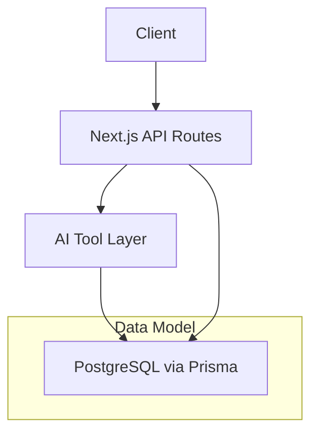
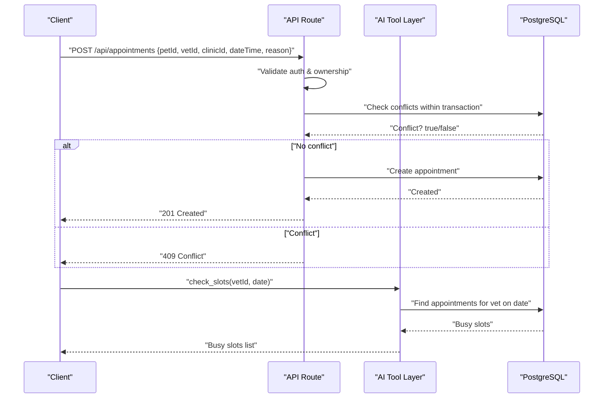
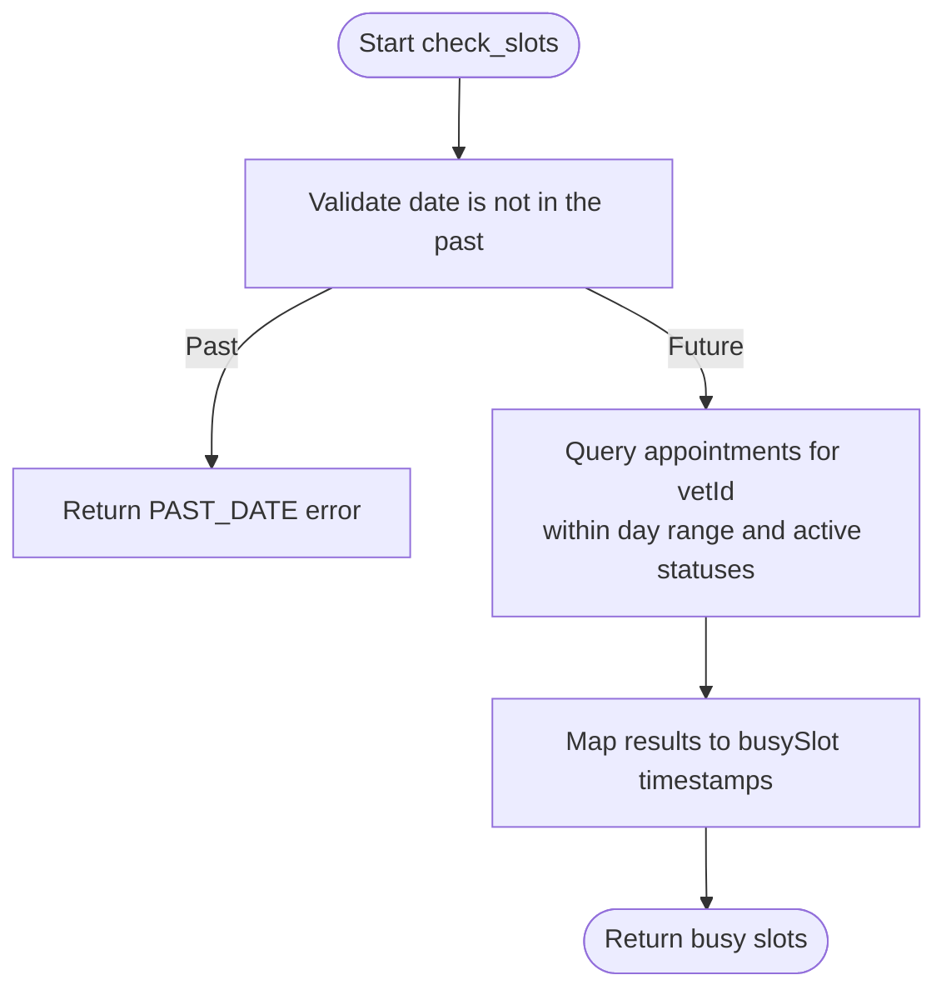
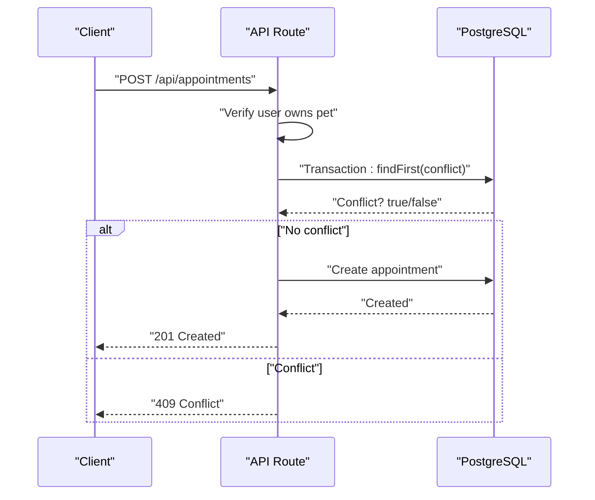
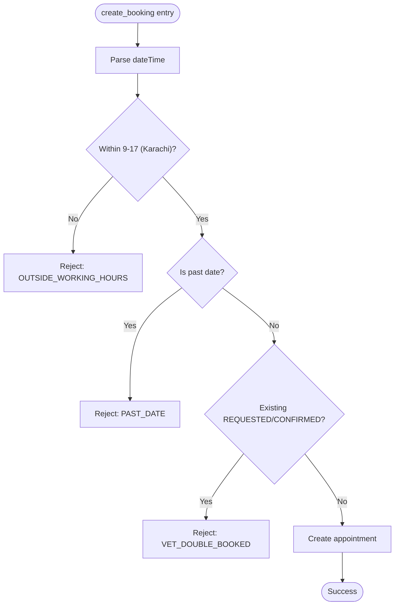
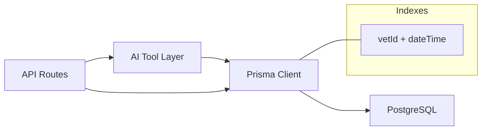

# Availability Checking & Time Slot Management

<cite>
**Referenced Files in This Document**
- [schema.prisma](file://prisma/schema.prisma)
- [ai.ts](file://lib/ai.ts)
- [route.ts](file://app/api/appointments/route.ts)
- [route.ts](file://app/api/clinic/appointments/route.ts)
- [db.ts](file://lib/db.ts)
- [test_booking.ts](file://test_booking.ts)
- [02-database-design.md](file://docs/03-architecture/02-database-design.md)
- [01-system-architecture.md](file://docs/03-architecture/01-system-architecture.md)
</cite>

## Table of Contents
1. Introduction
2. Project Structure
3. Core Components
4. Architecture Overview
5. Detailed Component Analysis
6. Dependency Analysis
7. Performance Considerations
8. Troubleshooting Guide
9. Conclusion

## Introduction
This document explains the availability checking and time slot management system for booking veterinary appointments. It covers how working hours are validated, how clinic schedules integrate with veterinarian availability, and how the system prevents bookings outside authorized timeframes. It also documents business rules around double-booking prevention, minimum duration and buffer times (as implemented), holiday/leave handling (current state and recommendations), real-time schedule updates, caching strategies, and database query optimization.

## Project Structure
The availability and booking logic spans:
- API routes that enforce authorization, validation, and conflict checks when creating or listing appointments
- An AI tool layer that exposes check_slots and create_booking functions used by the assistant
- The Prisma data model that stores appointments and related entities
- Database configuration and connection pooling

**Diagram sources**
- [route.ts:1-143](file://app/api/appointments/route.ts#L1-L143)
- [ai.ts:236-423](file://lib/ai.ts#L236-L423)
- [schema.prisma:164-182](file://prisma/schema.prisma#L164-L182)
- [db.ts:1-33](file://lib/db.ts#L1-L33)

**Section sources**
- [01-system-architecture.md:1-151](file://docs/03-architecture/01-system-architecture.md#L1-L151)
- [02-database-design.md:129-141](file://docs/03-architecture/02-database-design.md#L129-L141)

## Core Components
- Appointment model and indexes: Stores vet, pet, owner, clinic, dateTime, status; includes indexes on vetId+dateTime and other keys to optimize availability queries.
- API POST /api/appointments: Creates a new appointment with ownership verification and double-booking prevention inside a transaction.
- API GET /api/appointments and /api/clinic/appointments: Lists appointments with role-based filtering and date/status filters.
- AI tools:
  - check_slots: Returns busy slots for a vet on a given date, excluding past dates.
  - create_booking: Validates working hours, past dates, and double-booking before persisting.

Key responsibilities:
- Authorization: Ensure the requester owns the pet or has appropriate role.
- Validation: Enforce working hours and future-date constraints.
- Conflict detection: Prevent double-booking at the same time slot for a vet.
- Data retrieval: Efficiently fetch busy slots using indexed queries.

**Section sources**
- [schema.prisma:164-182](file://prisma/schema.prisma#L164-L182)
- [route.ts:69-143](file://app/api/appointments/route.ts#L69-L143)
- [route.ts:5-98](file://app/api/clinic/appointments/route.ts#L5-L98)
- [ai.ts:331-418](file://lib/ai.ts#L331-L418)

## Architecture Overview
The availability flow integrates client requests, API routes, AI tools, and the database.

**Diagram sources**
- [route.ts:69-143](file://app/api/appointments/route.ts#L69-L143)
- [ai.ts:331-365](file://lib/ai.ts#L331-L365)
- [schema.prisma:164-182](file://prisma/schema.prisma#L164-L182)

## Detailed Component Analysis

### Availability Query: check_slots
Purpose: Return busy time slots for a specific veterinarian on a given date.

Behavior:
- Rejects past dates based on current date in Asia/Karachi timezone.
- Queries appointments for the vet within the full day range, filtering to active statuses.
- Returns only the appointment timestamps as busy slots.

Optimizations:
- Uses vetId + dateTime index to efficiently scan relevant rows.
- Filters by status to avoid counting completed/cancelled appointments.

**Diagram sources**
- [ai.ts:331-365](file://lib/ai.ts#L331-L365)
- [schema.prisma:164-182](file://prisma/schema.prisma#L164-L182)

**Section sources**
- [ai.ts:331-365](file://lib/ai.ts#L331-L365)

### Booking Creation: create_booking (API)
Purpose: Create a new appointment while enforcing authorization and preventing double-booking.

Business rules enforced:
- Ownership: Only the pet owner can book their own pets.
- Conflict: Prevents multiple REQUESTED or CONFIRMED appointments for the same vet at the same dateTime.
- Transactional safety: Conflict check and creation occur within a single transaction to avoid race conditions.

**Diagram sources**
- [route.ts:69-143](file://app/api/appointments/route.ts#L69-L143)
- [schema.prisma:164-182](file://prisma/schema.prisma#L164-L182)

**Section sources**
- [route.ts:69-143](file://app/api/appointments/route.ts#L69-L143)

### Working Hours and Past Date Validation (AI Tool)
Purpose: Ensure bookings respect clinic/vet working hours and cannot be made for past dates.

Rules:
- Working hours: Requests outside 9 AM–5 PM (Asia/Karachi) are rejected.
- Past date: Bookings for past dates are rejected.
- Double-booking: Additional check for existing REQUESTED or CONFIRMED appointments at the requested time.

**Diagram sources**
- [ai.ts:366-418](file://lib/ai.ts#L366-L418)

**Section sources**
- [ai.ts:366-418](file://lib/ai.ts#L366-L418)

### Clinic Schedule Integration
Current implementation:
- Appointments store clinicId alongside vetId and dateTime, linking each booking to a clinic.
- No explicit per-clinic opening hours or per-vet calendar tables exist in the schema.
- Availability checks currently focus on vet-level conflicts and global working hours.

Recommendations to integrate clinic schedules:
- Add clinic operating hours and holiday calendars to the Clinic model or a dedicated schedule table.
- Extend availability checks to ensure the requested dateTime falls within the clinic’s open hours and is not a holiday.
- Optionally add vet-specific weekly schedules to support variable shifts.

**Section sources**
- [schema.prisma:107-131](file://prisma/schema.prisma#L107-L131)
- [schema.prisma:164-182](file://prisma/schema.prisma#L164-L182)
- [02-database-design.md:85-104](file://docs/03-architecture/02-database-design.md#L85-L104)

### Business Rules Summary
- Minimum booking duration: Not explicitly enforced in code; consider adding a rule to prevent overlapping durations if needed.
- Buffer times between appointments: Not implemented; consider adding a buffer window to avoid back-to-back bookings.
- Holiday/leave handling: Not implemented; consider adding a holiday calendar and vet leave flags to block unavailable days/times.
- Real-time updates: The system reads live from the database on each request; no in-memory cache is used.

[No sources needed since this section summarizes rules without analyzing specific files]

### Example Availability Query Patterns
- Check busy slots for a vet on a specific date:
  - Use check_slots with vetId and date to retrieve busy timestamps.
- List upcoming appointments for a clinic admin:
  - Use GET /api/clinic/appointments with filter=UPCOMING to get future REQUESTED/CONFIRMED appointments.
- Filter today’s appointments:
  - Use GET /api/clinic/appointments with filter=TODAY to get appointments within the current day.

**Section sources**
- [ai.ts:331-365](file://lib/ai.ts#L331-L365)
- [route.ts:5-98](file://app/api/clinic/appointments/route.ts#L5-L98)

### Real-Time Schedule Updates
- All availability checks read directly from PostgreSQL on each request, ensuring up-to-date information.
- Transactions protect against race conditions during booking creation.
- No background jobs or webhooks are present for proactive updates; clients should refresh or poll endpoints as needed.

**Section sources**
- [route.ts:93-103](file://app/api/appointments/route.ts#L93-L103)
- [ai.ts:331-365](file://lib/ai.ts#L331-L365)

## Dependency Analysis
The availability system depends on:
- Next.js API routes for request handling and authorization
- AI tool layer for check_slots and create_booking logic
- Prisma ORM and PostgreSQL for persistence
- Database indexes for performance

**Diagram sources**
- [route.ts:1-143](file://app/api/appointments/route.ts#L1-L143)
- [ai.ts:236-423](file://lib/ai.ts#L236-L423)
- [schema.prisma:164-182](file://prisma/schema.prisma#L164-L182)
- [db.ts:1-33](file://lib/db.ts#L1-L33)

**Section sources**
- [schema.prisma:164-182](file://prisma/schema.prisma#L164-L182)
- [db.ts:1-33](file://lib/db.ts#L1-L33)

## Performance Considerations
- Index usage:
  - The Appointment model includes an index on vetId + dateTime, which speeds up availability lookups and conflict checks.
- Query efficiency:
  - check_slots selects only dateTime fields to minimize payload size.
  - Status filtering avoids scanning completed/cancelled records.
- Connection pooling:
  - Production uses a pooled PrismaPg adapter; development reuses a global pool to avoid hot-reload overhead.
- Caching strategy recommendations:
  - In-memory cache: Cache busy slots per vet per day for a short TTL (e.g., 30–60 seconds) to reduce DB load under high concurrency.
  - Read-through cache: Use a Redis-backed cache keyed by vetId+date; invalidate on appointment create/update/delete.
  - Write path: After successful booking, invalidate or update the cache entry for that vet/date.
- Batched reads:
  - For multi-day availability UIs, batch queries by vet and date ranges to reduce round trips.

**Section sources**
- [schema.prisma:164-182](file://prisma/schema.prisma#L164-L182)
- [ai.ts:331-365](file://lib/ai.ts#L331-L365)
- [db.ts:10-29](file://lib/db.ts#L10-L29)

## Troubleshooting Guide
Common issues and resolutions:
- Past date errors:
  - Occur when attempting to book or check slots for a past date. Ensure client sends future dates relative to Asia/Karachi.
- Outside working hours:
  - Requests outside 9 AM–5 PM (Karachi) are rejected. Adjust client time selection to valid windows.
- Double booking conflicts:
  - If a REQUESTED or CONFIRMED appointment exists at the same time for the vet, creation fails with a conflict. Retry with a different slot.
- Authentication/authorization failures:
  - Ensure the authenticated user owns the pet being booked; otherwise, the request is forbidden.

Operational tips:
- Verify indexes exist on Appointment(vetId, dateTime).
- Monitor database query plans for availability queries to ensure index usage.
- Log tool execution details for diagnostics when integrating with the AI assistant.

**Section sources**
- [ai.ts:331-418](file://lib/ai.ts#L331-L418)
- [route.ts:69-143](file://app/api/appointments/route.ts#L69-L143)
- [test_booking.ts:81-148](file://test_booking.ts#L81-L148)

## Conclusion
The system provides robust availability checking and booking enforcement through:
- Clear business rules for working hours, past dates, and double-booking prevention
- Efficient database queries leveraging indexes
- Role-based authorization and ownership checks
- Real-time reads from the database for accurate availability

To further improve:
- Integrate clinic operating hours and holiday calendars into availability checks
- Implement buffer times and minimum duration rules
- Add caching for busy slots to reduce database load under high traffic
- Extend vet schedules to support variable shifts and leave management

[No sources needed since this section summarizes without analyzing specific files]