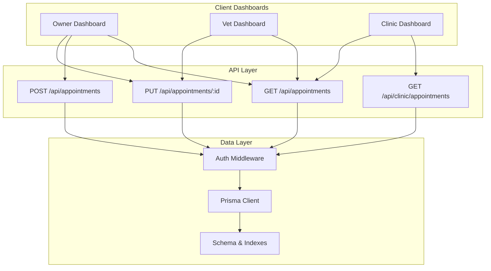
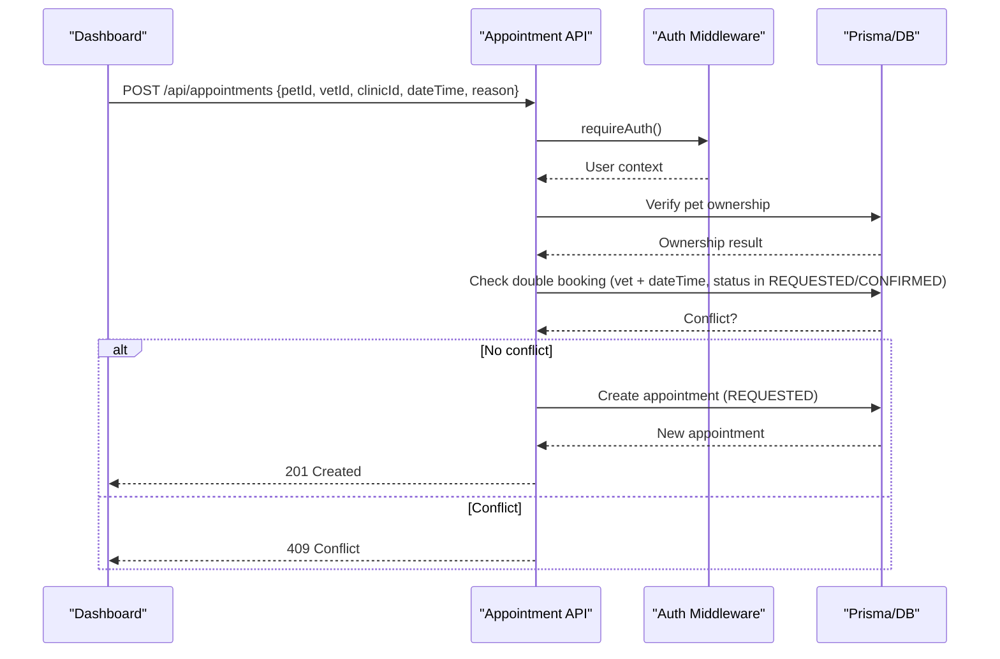
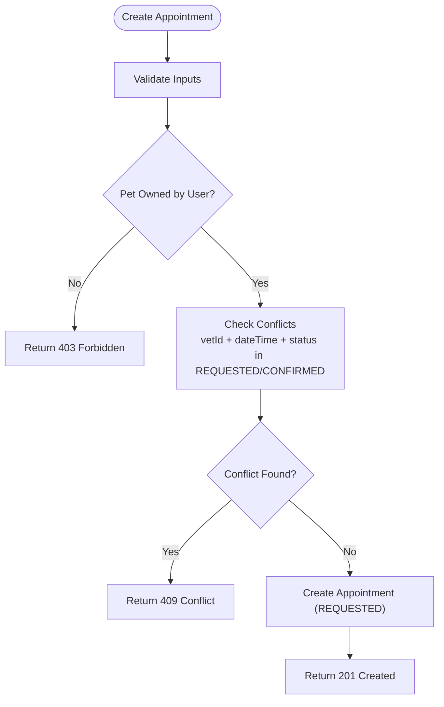
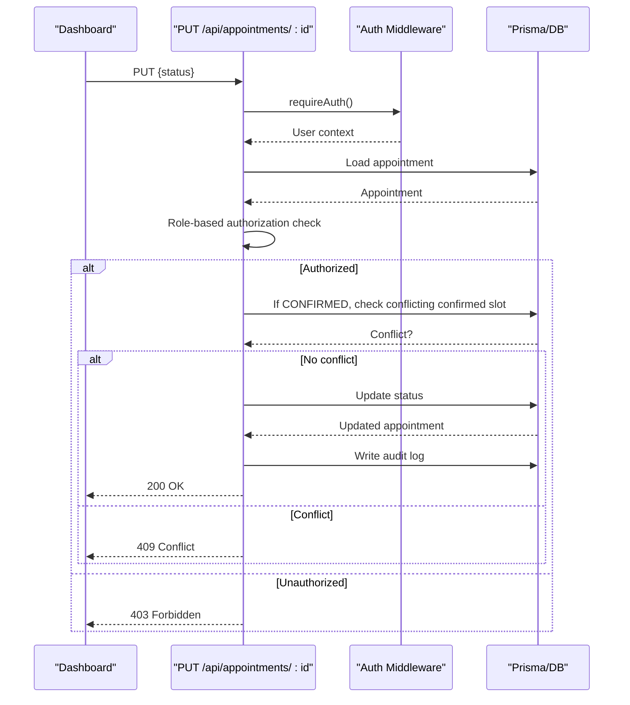
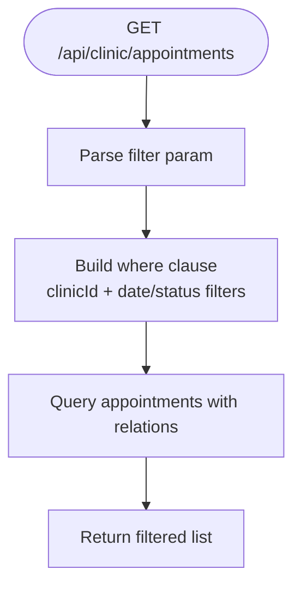
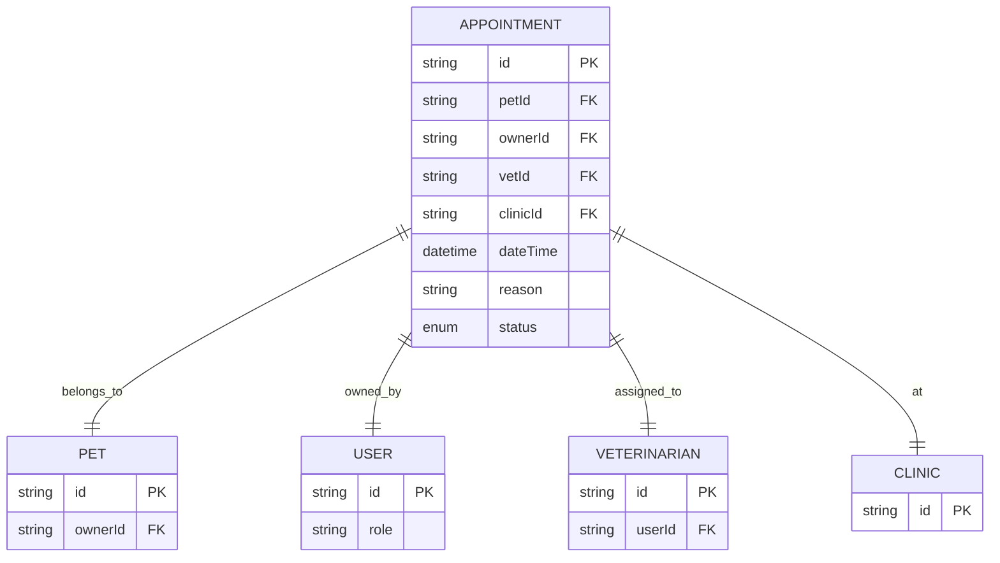
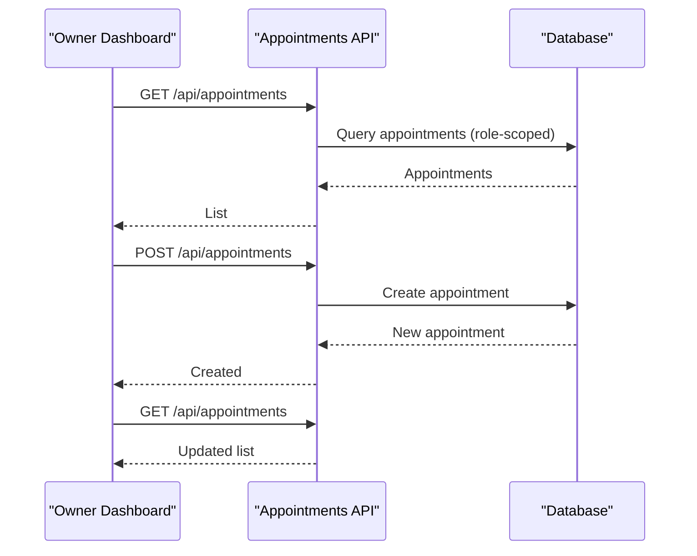
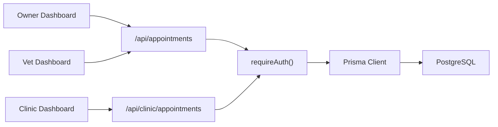

# Calendar Integration & Real-time Updates

<cite>
**Referenced Files in This Document**
- [route.ts](file://app/api/appointments/route.ts)
- [route.ts](file://app/api/appointments/[appointmentId]/route.ts)
- [route.ts](file://app/api/clinic/appointments/route.ts)
- [schema.prisma](file://prisma/schema.prisma)
- [auth.ts](file://lib/auth.ts)
- [db.ts](file://lib/db.ts)
- [page.tsx](file://app/dashboard/page.tsx)
- [page.tsx](file://app/clinic/dashboard/page.tsx)
- [page.tsx](file://app/vet/dashboard/page.tsx)
</cite>

## Table of Contents
1. Introduction
2. Project Structure
3. Core Components
4. Architecture Overview
5. Detailed Component Analysis
6. Dependency Analysis
7. Performance Considerations
8. Troubleshooting Guide
9. Conclusion

## Introduction
This document explains the calendar integration system that synchronizes appointment data across pet owner, veterinarian, and clinic admin interfaces. It covers how events are created, modified, and cancelled; how concurrent modifications are prevented; and how data consistency is maintained across clients. It also outlines an event-driven update model suitable for real-time availability updates and provides guidance on optimistic UI updates, conflict resolution strategies, and performance optimizations for large-scale scheduling.

## Project Structure
The calendar integration spans server-side API routes, a Prisma-backed data layer, authentication utilities, and multiple client dashboards:
- API routes handle listing, creation, and status transitions of appointments with role-based authorization and conflict checks.
- The Prisma schema defines core entities (User, Pet, Veterinarian, Clinic, Appointment) and indexes to support efficient queries.
- Authentication middleware validates sessions and enforces permissions.
- Client dashboards fetch and render appointment data per role and trigger updates via API calls.

**Diagram sources**
- [route.ts:7-67](file://app/api/appointments/route.ts#L7-L67)
- [route.ts:70-143](file://app/api/appointments/route.ts#L70-L143)
- [route.ts:7-119](file://app/api/appointments/[appointmentId]/route.ts#L7-L119)
- [route.ts:5-98](file://app/api/clinic/appointments/route.ts#L5-L98)
- [schema.prisma:164-182](file://prisma/schema.prisma#L164-L182)
- [auth.ts:109-115](file://lib/auth.ts#L109-L115)

**Section sources**
- [route.ts:7-143](file://app/api/appointments/route.ts#L7-L143)
- [route.ts:7-119](file://app/api/appointments/[appointmentId]/route.ts#L7-L119)
- [route.ts:5-98](file://app/api/clinic/appointments/route.ts#L5-L98)
- [schema.prisma:164-182](file://prisma/schema.prisma#L164-L182)
- [auth.ts:109-115](file://lib/auth.ts#L109-L115)

## Core Components
- Appointment APIs:
  - List appointments by role (owner, vet, clinic admin).
  - Create new appointments with ownership verification and double-booking prevention.
  - Update appointment status with role-based authorization and conflict checks during confirmation.
  - Clinic-specific filtered listing for administrative views.
- Data Model:
  - Appointment entity with vet, owner, pet, clinic associations and time-based indexes.
  - Status enum supports REQUESTED, CONFIRMED, CANCELLED, COMPLETED, NO_SHOW.
- Authentication:
  - Session-based auth with cookie handling and role enforcement.
- Client Dashboards:
  - Owner dashboard lists upcoming appointments and allows cancellation.
  - Vet dashboard lists appointments and supports confirm/cancel actions.
  - Clinic dashboard filters appointments by date/status and shows details.

**Section sources**
- [route.ts:7-143](file://app/api/appointments/route.ts#L7-L143)
- [route.ts:7-119](file://app/api/appointments/[appointmentId]/route.ts#L7-L119)
- [route.ts:5-98](file://app/api/clinic/appointments/route.ts#L5-L98)
- [schema.prisma:22-28](file://prisma/schema.prisma#L22-L28)
- [schema.prisma:164-182](file://prisma/schema.prisma#L164-L182)
- [auth.ts:109-115](file://lib/auth.ts#L109-L115)
- [page.tsx:232-280](file://app/dashboard/page.tsx#L232-L280)
- [page.tsx:162-189](file://app/vet/dashboard/page.tsx#L162-L189)
- [page.tsx:84-99](file://app/clinic/dashboard/page.tsx#L84-L99)

## Architecture Overview
The system follows a request/response architecture with strong server-side validation and authorization. Each API route:
- Authenticates the user and enforces role-based access.
- Validates inputs and business rules (e.g., pet ownership, working hours where applicable).
- Prevents conflicts (double bookings) using database queries within transactions or atomic checks.
- Persists changes and returns normalized responses consumed by dashboards.

**Diagram sources**
- [route.ts:70-143](file://app/api/appointments/route.ts#L70-L143)
- [auth.ts:109-115](file://lib/auth.ts#L109-L115)

**Section sources**
- [route.ts:70-143](file://app/api/appointments/route.ts#L70-L143)
- [auth.ts:109-115](file://lib/auth.ts#L109-L115)

## Detailed Component Analysis

### Appointment Creation Flow
- Input validation ensures required fields are present.
- Pet ownership is verified against the authenticated user.
- Double-booking check prevents overlapping confirmed/requested slots for the same vet at the same time.
- On success, the appointment is created with REQUESTED status and returned with related entities.

**Diagram sources**
- [route.ts:70-143](file://app/api/appointments/route.ts#L70-L143)

**Section sources**
- [route.ts:70-143](file://app/api/appointments/route.ts#L70-L143)

### Appointment Status Transition Flow
- Role-based authorization determines allowed transitions:
  - Pet owners can cancel their own upcoming appointments.
  - Veterinarians can manage their own appointments (confirm, cancel, complete).
  - Clinic admins can manage appointments within their clinic.
  - Platform admins have broad authority.
- Confirmation includes a final conflict check to prevent duplicate confirmed slots.
- Successful updates are audited via an audit log entry.

**Diagram sources**
- [route.ts:7-119](file://app/api/appointments/[appointmentId]/route.ts#L7-L119)
- [auth.ts:109-115](file://lib/auth.ts#L109-L115)

**Section sources**
- [route.ts:7-119](file://app/api/appointments/[appointmentId]/route.ts#L7-L119)

### Clinic Appointments Filtering
- Clinic admins retrieve appointments scoped to their clinic with optional filters: ALL, TODAY, UPCOMING, COMPLETED, CANCELLED, REQUESTED, CONFIRMED.
- Queries use date ranges and status conditions to tailor results for operational views.

**Diagram sources**
- [route.ts:5-98](file://app/api/clinic/appointments/route.ts#L5-L98)

**Section sources**
- [route.ts:5-98](file://app/api/clinic/appointments/route.ts#L5-L98)

### Data Model and Indexing
- Appointment model links pet, owner, vet, and clinic with a timestamped dateTime and status.
- Indexes on vetId+dateTime, ownerId, and petId optimize common query patterns such as:
  - Finding available slots per vet.
  - Listing owner’s appointments.
  - Aggregating pet-related visits.

**Diagram sources**
- [schema.prisma:164-182](file://prisma/schema.prisma#L164-L182)
- [schema.prisma:68-88](file://prisma/schema.prisma#L68-L88)
- [schema.prisma:90-105](file://prisma/schema.prisma#L90-L105)
- [schema.prisma:107-119](file://prisma/schema.prisma#L107-L119)

**Section sources**
- [schema.prisma:164-182](file://prisma/schema.prisma#L164-L182)

### Client-Side Synchronization Patterns
- Owner dashboard:
  - Fetches initial appointments and timeline on load.
  - Creates new appointments and refreshes the list after successful creation.
  - Cancels appointments and re-fetches the list to reflect state changes.
- Vet dashboard:
  - Loads appointments and performs status transitions (confirm/cancel), then refreshes lists and patient data.
- Clinic dashboard:
  - Loads clinic profile, vets, and appointments; supports filtering by date/status.

**Diagram sources**
- [page.tsx:45-96](file://app/dashboard/page.tsx#L45-L96)
- [page.tsx:232-280](file://app/dashboard/page.tsx#L232-L280)
- [route.ts:7-143](file://app/api/appointments/route.ts#L7-L143)

**Section sources**
- [page.tsx:45-96](file://app/dashboard/page.tsx#L45-L96)
- [page.tsx:232-280](file://app/dashboard/page.tsx#L232-L280)
- [route.ts:7-143](file://app/api/appointments/route.ts#L7-L143)

## Dependency Analysis
- API routes depend on:
  - Authentication middleware for session validation and role enforcement.
  - Prisma client configured with PostgreSQL adapter and connection pooling.
- Client dashboards depend on:
  - API endpoints for fetching and mutating appointment data.
  - Local state management to reflect UI changes post-mutation.

**Diagram sources**
- [route.ts:7-143](file://app/api/appointments/route.ts#L7-L143)
- [route.ts:5-98](file://app/api/clinic/appointments/route.ts#L5-L98)
- [auth.ts:109-115](file://lib/auth.ts#L109-L115)
- [db.ts:1-33](file://lib/db.ts#L1-L33)

**Section sources**
- [route.ts:7-143](file://app/api/appointments/route.ts#L7-L143)
- [route.ts:5-98](file://app/api/clinic/appointments/route.ts#L5-L98)
- [auth.ts:109-115](file://lib/auth.ts#L109-L115)
- [db.ts:1-33](file://lib/db.ts#L1-L33)

## Performance Considerations
- Database indexing:
  - Use composite indexes on vetId+dateTime to accelerate conflict checks and availability queries.
  - Index ownerId and petId for fast listing and filtering.
- Query optimization:
  - Select only necessary fields and include minimal relations to reduce payload size.
  - Use date range filters for “today” and “upcoming” views to limit result sets.
- Concurrency control:
  - Wrap conflict checks and mutations in transactions to ensure atomicity and prevent race conditions.
- Caching strategy:
  - Implement short-lived cache for read-heavy endpoints (e.g., today’s schedule) with invalidation on writes.
- Pagination and virtualization:
  - For large appointment histories, paginate results and virtualize rendering to improve UI responsiveness.
- Connection pooling:
  - Ensure Prisma uses a pooled connection in production to handle high concurrency efficiently.

[No sources needed since this section provides general guidance]

## Troubleshooting Guide
Common issues and resolutions:
- Authentication failures:
  - Ensure session cookies are set correctly and not expired.
  - Validate token hashing and sliding expiration logic.
- Authorization errors:
  - Confirm role-based checks align with intended permissions (owner, vet, clinic admin, platform admin).
- Double-booking conflicts:
  - Review conflict checks for vetId+dateTime and status constraints; ensure transactional integrity.
- Data inconsistencies:
  - Audit logs capture status transitions; review payloads to trace changes.
- Performance bottlenecks:
  - Inspect query plans for slow lookups; verify indexes exist on frequently queried columns.

**Section sources**
- [auth.ts:33-80](file://lib/auth.ts#L33-L80)
- [route.ts:7-119](file://app/api/appointments/[appointmentId]/route.ts#L7-L119)
- [route.ts:70-143](file://app/api/appointments/route.ts#L70-L143)

## Conclusion
The calendar integration system provides robust appointment management across multiple roles with strong authorization, conflict prevention, and consistent data modeling. While the current implementation relies on request/response cycles, it is well-suited for extending into an event-driven architecture to deliver real-time availability updates. Recommended enhancements include adding WebSocket-based event broadcasting, optimistic UI updates with conflict reconciliation, and advanced caching/pagination for scalability.

[No sources needed since this section summarizes without analyzing specific files]