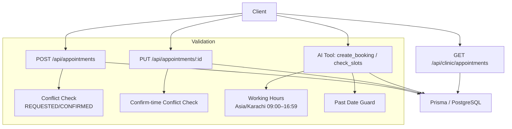
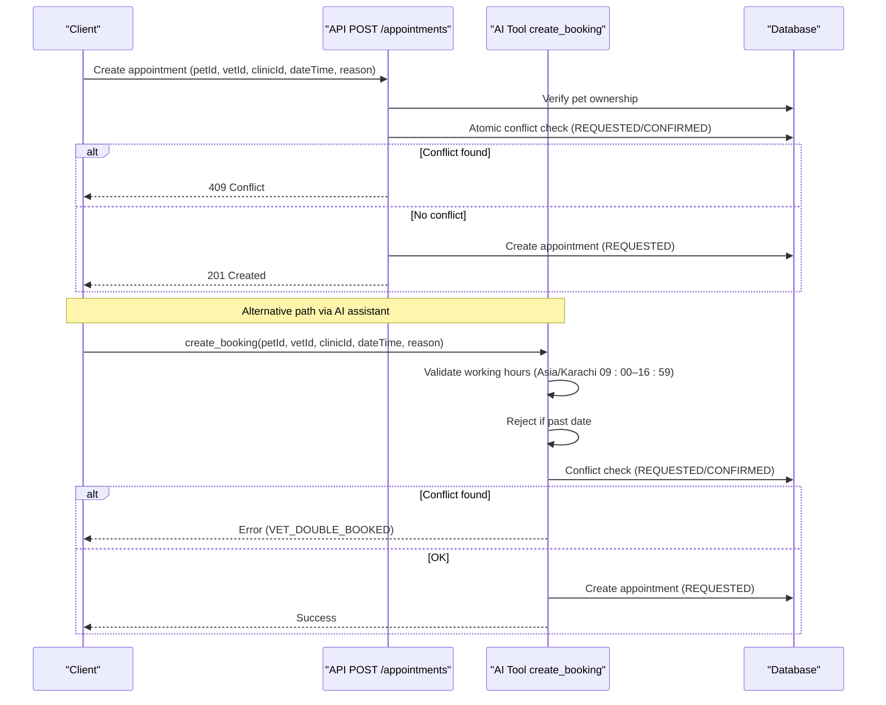
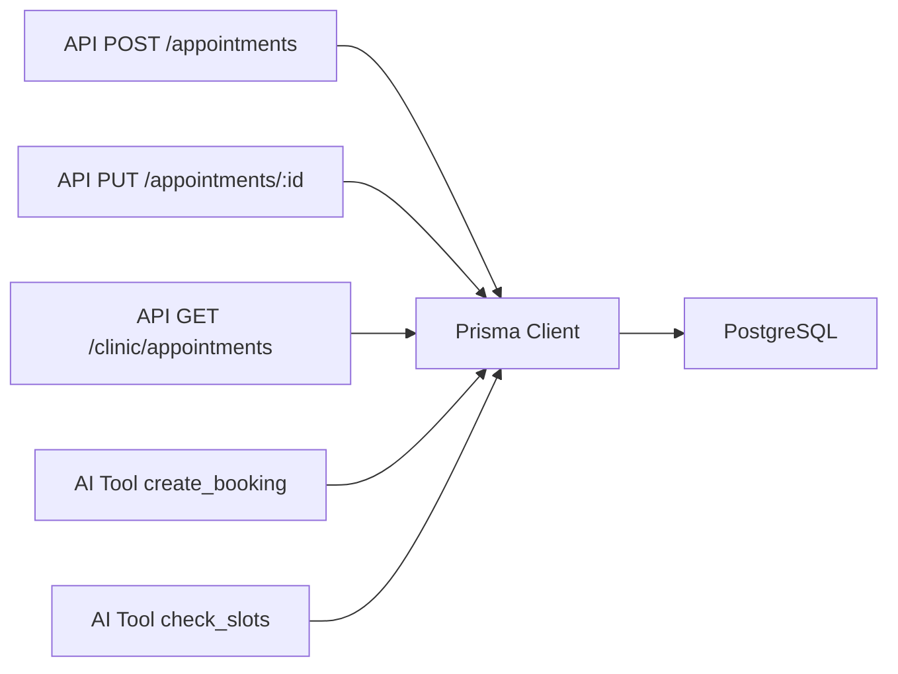

# Schedule Validation & Working Hours

<cite>
**Referenced Files in This Document**
- [app/api/appointments/route.ts](file://app/api/appointments/route.ts)
- [app/api/appointments/[appointmentId]/route.ts](file://app/api/appointments/[appointmentId]/route.ts)
- [app/api/clinic/appointments/route.ts](file://app/api/clinic/appointments/route.ts)
- [lib/ai.ts](file://lib/ai.ts)
- [prisma/schema.prisma](file://prisma/schema.prisma)
- [test_booking.ts](file://test_booking.ts)
</cite>

## Table of Contents
1. [Introduction](#introduction)
2. [Project Structure](#project-structure)
3. [Core Components](#core-components)
4. [Architecture Overview](#architecture-overview)
5. [Detailed Component Analysis](#detailed-component-analysis)
6. [Dependency Analysis](#dependency-analysis)
7. [Performance Considerations](#performance-considerations)
8. [Troubleshooting Guide](#troubleshooting-guide)
9. [Conclusion](#conclusion)

## Introduction
This document explains the schedule validation system that ensures appointments are only booked within authorized working hours and that vet availability is respected. It covers how the system validates veterinarian schedules against clinic operating hours, handles timezone considerations (using a fixed clinic timezone), enforces business rules for appointment timing, prevents double bookings, and maintains data consistency under concurrent booking attempts. It also documents current limitations regarding weekends, holidays, and special closure dates.

## Project Structure
The schedule validation logic spans API endpoints and an AI tool executor:
- Appointment creation and conflict checks live in the REST endpoints.
- Timezone-aware working hours and slot queries are implemented in the AI tools layer.
- The database schema defines core entities and indexes used by validations.

**Diagram sources**
- [app/api/appointments/route.ts:69-129](file://app/api/appointments/route.ts#L69-L129)
- [app/api/appointments/[appointmentId]/route.ts:65-82](file://app/api/appointments/[appointmentId]/route.ts#L65-L82)
- [lib/ai.ts:331-417](file://lib/ai.ts#L331-L417)
- [prisma/schema.prisma:164-182](file://prisma/schema.prisma#L164-L182)

**Section sources**
- [app/api/appointments/route.ts:69-129](file://app/api/appointments/route.ts#L69-L129)
- [app/api/appointments/[appointmentId]/route.ts:65-82](file://app/api/appointments/[appointmentId]/route.ts#L65-L82)
- [lib/ai.ts:331-417](file://lib/ai.ts#L331-L417)
- [prisma/schema.prisma:164-182](file://prisma/schema.prisma#L164-L182)

## Core Components
- Appointment creation endpoint: validates ownership, performs atomic double-booking prevention, and persists new requests.
- Appointment update endpoint: enforces role-based permissions and re-checks conflicts on confirmation.
- Clinic admin query endpoint: filters appointments by date/status for operational views.
- AI tools: provide timezone-aware working hours enforcement, past-date guard, busy slot retrieval, and booking creation with conflict checks.
- Database schema: defines Appointment model with indexes to support efficient conflict detection.

Key responsibilities:
- Enforce pet ownership before booking.
- Prevent double bookings using transactions or direct conflict checks.
- Validate requested times against clinic working hours in Asia/Karachi.
- Disallow past-date bookings.
- Provide read-only views for clinics to manage schedules.

**Section sources**
- [app/api/appointments/route.ts:69-129](file://app/api/appointments/route.ts#L69-L129)
- [app/api/appointments/[appointmentId]/route.ts:6-118](file://app/api/appointments/[appointmentId]/route.ts#L6-L118)
- [app/api/clinic/appointments/route.ts:5-84](file://app/api/clinic/appointments/route.ts#L5-L84)
- [lib/ai.ts:331-417](file://lib/ai.ts#L331-L417)
- [prisma/schema.prisma:164-182](file://prisma/schema.prisma#L164-L182)

## Architecture Overview
The system combines REST APIs and AI-driven tools to enforce scheduling policies consistently.

**Diagram sources**
- [app/api/appointments/route.ts:69-129](file://app/api/appointments/route.ts#L69-L129)
- [lib/ai.ts:366-417](file://lib/ai.ts#L366-L417)

## Detailed Component Analysis

### Appointment Creation Endpoint
- Validates required fields and authenticates the user.
- Verifies pet ownership; rejects if not owned by the requester.
- Performs an atomic double-booking check for the same vet and exact datetime where status is REQUESTED or CONFIRMED.
- Creates the appointment with status REQUESTED and returns it.

Concurrency handling:
- Uses a transactional block to ensure the conflict check and subsequent write are consistent, preventing race conditions when multiple users book the same slot simultaneously.

Error responses:
- 400 for missing fields
- 403 for unauthorized pet access
- 409 for conflict (vet already booked)
- 500 for internal errors

**Section sources**
- [app/api/appointments/route.ts:69-129](file://app/api/appointments/route.ts#L69-L129)

### Appointment Update Endpoint
- Validates status transitions and enforces role-based authorization:
  - Pet owners can cancel their own upcoming appointments.
  - Veterinarians can manage their own appointments.
  - Clinic admins can manage appointments at their clinic.
  - Platform admins have full access.
- When confirming an appointment, re-checks for conflicts among existing CONFIRMED appointments for the same vet and time.
- Writes an audit log entry for status changes.

**Section sources**
- [app/api/appointments/[appointmentId]/route.ts:6-118](file://app/api/appointments/[appointmentId]/route.ts#L6-L118)

### Clinic Admin Appointments Query
- Filters appointments by clinic and supports filters such as TODAY, UPCOMING, COMPLETED, CANCELLED, REQUESTED, CONFIRMED.
- Builds date ranges for “today” using server-side date boundaries.
- Returns enriched appointment data including owner, vet, and clinic details.

**Section sources**
- [app/api/clinic/appointments/route.ts:5-84](file://app/api/clinic/appointments/route.ts#L5-L84)

### AI Tools: Working Hours, Past Date, and Conflicts
- check_slots:
  - Ensures the requested date is not in the past (based on Asia/Karachi).
  - Retrieves busy slots for a vet on a given day by querying REQUESTED/CONFIRMED appointments within UTC day boundaries.
- create_booking:
  - Validates pet ownership.
  - Enforces working hours in Asia/Karachi: allowed between 09:00 and 16:59 (hourly granularity implied by comments).
  - Rejects past dates.
  - Checks for conflicts with existing REQUESTED/CONFIRMED appointments for the same vet and exact datetime.
  - Creates the appointment with status REQUESTED.

Timezone handling:
- Uses Intl.DateTimeFormat with timeZone set to Asia/Karachi to compute local hour and compare against working hours.
- For day-range queries, uses UTC boundaries to match stored timestamps.

**Section sources**
- [lib/ai.ts:331-417](file://lib/ai.ts#L331-L417)

### Data Model and Indexes
- Appointment model includes fields for pet, owner, vet, clinic, datetime, reason, and status.
- Indexes on (vetId, dateTime), ownerId, and petId optimize conflict checks and filtering.

**Section sources**
- [prisma/schema.prisma:164-182](file://prisma/schema.prisma#L164-L182)

### Business Rules Summary
- Ownership: Only pet owners can book for their pets.
- Working hours: Bookings must fall within clinic working hours in Asia/Karachi (09:00–16:59).
- Past dates: Cannot book appointments in the past.
- Double booking: Prevents overlapping appointments for the same vet at the same time in REQUESTED or CONFIRMED states.
- Confirmation safety: Re-validates conflicts when moving to CONFIRMED.

**Section sources**
- [app/api/appointments/route.ts:69-129](file://app/api/appointments/route.ts#L69-L129)
- [lib/ai.ts:366-417](file://lib/ai.ts#L366-L417)
- [app/api/appointments/[appointmentId]/route.ts:65-82](file://app/api/appointments/[appointmentId]/route.ts#L65-L82)

## Dependency Analysis
- API endpoints depend on Prisma client and authentication middleware.
- AI tools depend on Prisma client and use Intl.DateTimeFormat for timezone conversions.
- Database schema provides necessary relationships and indexes to support fast conflict resolution.

**Diagram sources**
- [app/api/appointments/route.ts:1-129](file://app/api/appointments/route.ts#L1-L129)
- [app/api/appointments/[appointmentId]/route.ts:1-118](file://app/api/appointments/[appointmentId]/route.ts#L1-L118)
- [app/api/clinic/appointments/route.ts:1-84](file://app/api/clinic/appointments/route.ts#L1-L84)
- [lib/ai.ts:1-423](file://lib/ai.ts#L1-L423)

**Section sources**
- [app/api/appointments/route.ts:1-129](file://app/api/appointments/route.ts#L1-L129)
- [app/api/appointments/[appointmentId]/route.ts:1-118](file://app/api/appointments/[appointmentId]/route.ts#L1-L118)
- [app/api/clinic/appointments/route.ts:1-84](file://app/api/clinic/appointments/route.ts#L1-L84)
- [lib/ai.ts:1-423](file://lib/ai.ts#L1-L423)

## Performance Considerations
- Conflict checks leverage indexes on (vetId, dateTime) to minimize query latency during peak booking times.
- Using transactions for create flows reduces race conditions and improves consistency.
- Day-range queries in AI tools use UTC boundaries; ensure timezone alignment between storage and queries to avoid off-by-one issues.
- Avoid unnecessary includes in high-throughput paths; include only needed relations.

[No sources needed since this section provides general guidance]

## Troubleshooting Guide
Common issues and resolutions:
- Missing required fields: Ensure petId, vetId, clinicId, dateTime, and reason are provided.
- Unauthorized pet access: Verify the authenticated user owns the pet.
- Outside working hours: Adjust request to fall within 09:00–16:59 in Asia/Karachi.
- Past date: Use a future date relative to Asia/Karachi.
- Double booking: Choose a different time slot or wait for the existing appointment to be cancelled or completed.
- Confirmation conflict: Another confirmed appointment exists for the same vet/time; coordinate rescheduling.

Diagnostic tips:
- Use the clinic dashboard filters to inspect today/upcoming/requested/confirmed/cancelled/completed appointments.
- Run the test script to simulate working hours and double booking scenarios.

**Section sources**
- [app/api/appointments/route.ts:69-129](file://app/api/appointments/route.ts#L69-L129)
- [app/api/appointments/[appointmentId]/route.ts:6-118](file://app/api/appointments/[appointmentId]/route.ts#L6-L118)
- [lib/ai.ts:331-417](file://lib/ai.ts#L331-L417)
- [test_booking.ts:81-148](file://test_booking.ts#L81-L148)

## Conclusion
The schedule validation system enforces robust business rules to protect vet availability and clinic operating hours. It combines API-level conflict checks with AI-tool timezone-aware validations to ensure consistent behavior across booking paths. While weekends, holidays, and special closures are not currently modeled, the foundation is in place to extend these checks by adding explicit holiday/closure tables and integrating them into both API and AI tool validation flows.

[No sources needed since this section summarizes without analyzing specific files]