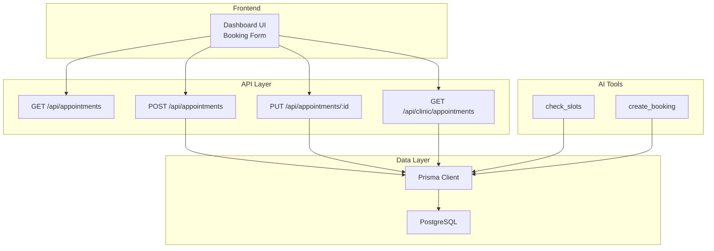
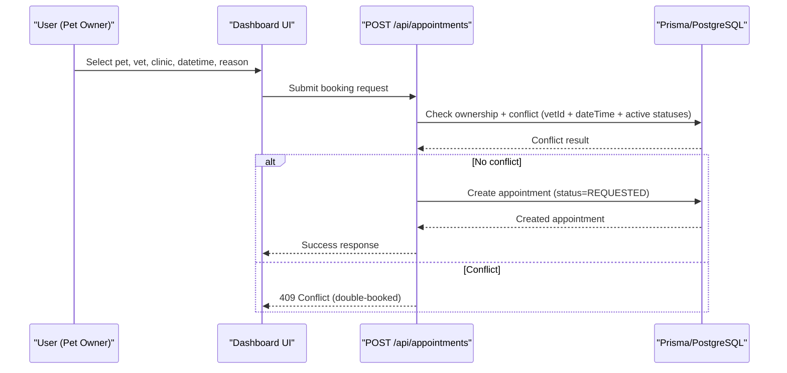
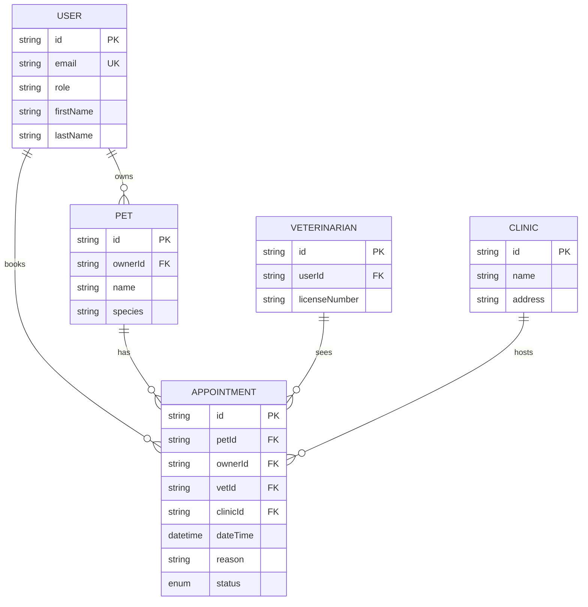
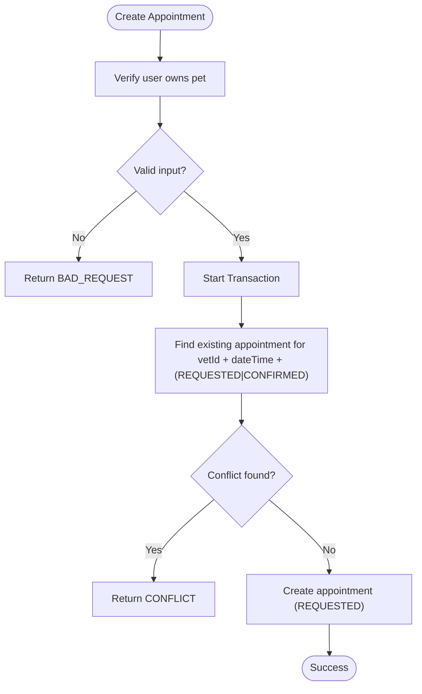
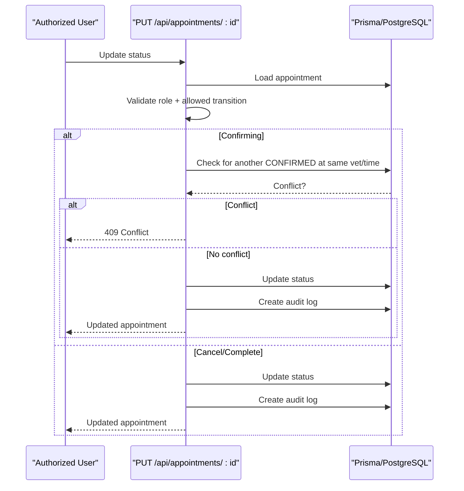
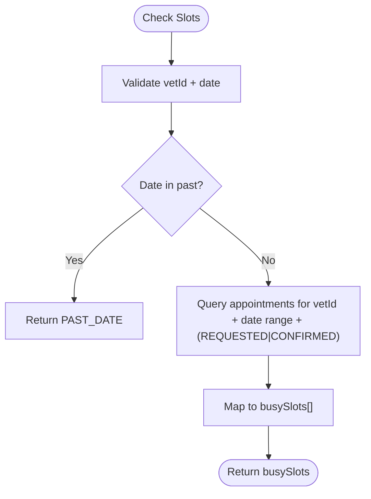
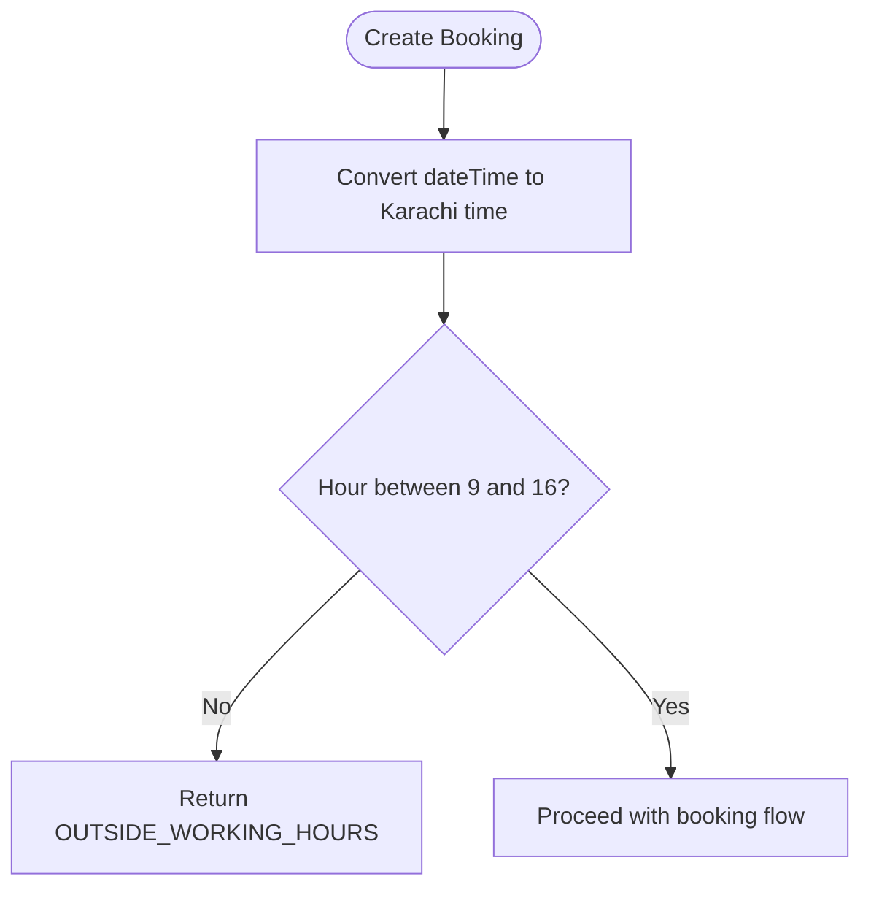
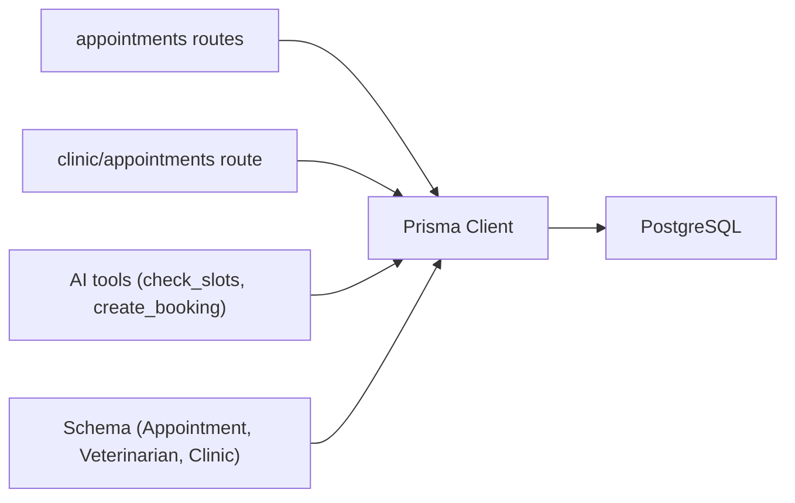

# Time Slot Allocation & Management

<cite>
**Referenced Files in This Document**
- [route.ts](file://app/api/appointments/route.ts)
- [route.ts](file://app/api/appointments/[appointmentId]/route.ts)
- [route.ts](file://app/api/clinic/appointments/route.ts)
- [schema.prisma](file://prisma/schema.prisma)
- [ai.ts](file://lib/ai.ts)
- [db.ts](file://lib/db.ts)
- [test_booking.ts](file://test_booking.ts)
- [page.tsx](file://app/dashboard/page.tsx)
</cite>

## Table of Contents
1. [Introduction](#introduction)
2. [Project Structure](#project-structure)
3. [Core Components](#core-components)
4. [Architecture Overview](#architecture-overview)
5. [Detailed Component Analysis](#detailed-component-analysis)
6. [Dependency Analysis](#dependency-analysis)
7. [Performance Considerations](#performance-considerations)
8. [Troubleshooting Guide](#troubleshooting-guide)
9. [Conclusion](#conclusion)
10. [Appendices](#appendices)

## Introduction
This document explains the time slot allocation engine that manages appointment scheduling and prevents double-booking across veterinarians, clinics, and pet owners. It details how available slots are determined, how conflicts are detected, and how different roles interact with the system. It also covers real-time updates via status transitions, database query optimization through indexes, and edge cases such as last-minute cancellations and rescheduling.

## Project Structure
The scheduling functionality spans API routes, a Prisma data model, an AI tooling layer for availability checks and bookings, and frontend booking flows.

**Diagram sources**
- [route.ts:7-67](file://app/api/appointments/route.ts#L7-L67)
- [route.ts:70-142](file://app/api/appointments/route.ts#L70-L142)
- [route.ts:7-118](file://app/api/appointments/[appointmentId]/route.ts#L7-L118)
- [route.ts:5-97](file://app/api/clinic/appointments/route.ts#L5-L97)
- [ai.ts:331-418](file://lib/ai.ts#L331-L418)
- [db.ts:1-33](file://lib/db.ts#L1-L33)

**Section sources**
- [route.ts:7-67](file://app/api/appointments/route.ts#L7-L67)
- [route.ts:70-142](file://app/api/appointments/route.ts#L70-L142)
- [route.ts:7-118](file://app/api/appointments/[appointmentId]/route.ts#L7-L118)
- [route.ts:5-97](file://app/api/clinic/appointments/route.ts#L5-L97)
- [ai.ts:331-418](file://lib/ai.ts#L331-L418)
- [db.ts:1-33](file://lib/db.ts#L1-L33)

## Core Components
- Appointment model and statuses define the core state machine and constraints.
- API endpoints enforce authorization, validate inputs, and prevent double-booking at creation and confirmation.
- AI tools provide availability queries and create bookings with working-hours and past-date guards.
- Frontend provides the booking form and displays appointments per role.

Key responsibilities:
- Availability lookup: retrieve busy slots for a vet on a given date.
- Conflict detection: ensure no two active appointments overlap for the same vet at the same time.
- Role-based access: restrict who can update or cancel appointments.
- Auditability: log status changes for compliance.

**Section sources**
- [schema.prisma:164-182](file://prisma/schema.prisma#L164-L182)
- [schema.prisma:22-28](file://prisma/schema.prisma#L22-L28)
- [route.ts:70-142](file://app/api/appointments/route.ts#L70-L142)
- [route.ts:7-118](file://app/api/appointments/[appointmentId]/route.ts#L7-L118)
- [ai.ts:331-418](file://lib/ai.ts#L331-L418)

## Architecture Overview
The system uses a layered architecture:
- Presentation: Dashboard UI collects booking requests.
- API: Next.js route handlers validate and persist appointments.
- AI Tooling: Optional path to check availability and book using centralized logic.
- Data: Prisma client interacts with PostgreSQL; indexes optimize lookups by vet and time.

**Diagram sources**
- [route.ts:70-142](file://app/api/appointments/route.ts#L70-L142)
- [schema.prisma:164-182](file://prisma/schema.prisma#L164-L182)

## Detailed Component Analysis

### Appointment Model and Statuses
- The Appointment entity links pet, owner, veterinarian, clinic, and stores a precise timestamp and reason.
- Statuses include REQUESTED, CONFIRMED, CANCELLED, COMPLETED, NO_SHOW. These drive availability and filtering.
- Indexes on vetId+dateTime and ownerId/petId improve performance for common queries.

**Diagram sources**
- [schema.prisma:30-53](file://prisma/schema.prisma#L30-L53)
- [schema.prisma:68-88](file://prisma/schema.prisma#L68-L88)
- [schema.prisma:90-105](file://prisma/schema.prisma#L90-L105)
- [schema.prisma:107-119](file://prisma/schema.prisma#L107-L119)
- [schema.prisma:164-182](file://prisma/schema.prisma#L164-L182)

**Section sources**
- [schema.prisma:164-182](file://prisma/schema.prisma#L164-L182)
- [schema.prisma:22-28](file://prisma/schema.prisma#L22-L28)

### Creating Appointments (Double-Booking Prevention)
- Authorization: Only the pet owner can book for their own pets.
- Conflict check: A transactional read ensures no existing REQUESTED or CONFIRMED appointment exists for the same vet at the exact same dateTime.
- Creation: If no conflict, a new appointment is created with status REQUESTED.

**Diagram sources**
- [route.ts:70-142](file://app/api/appointments/route.ts#L70-L142)

**Section sources**
- [route.ts:70-142](file://app/api/appointments/route.ts#L70-L142)

### Updating Appointments (Confirm/Cancel/Complete)
- Authorization: Role-based checks allow only authorized users to change status.
- Confirmation guard: When confirming, another confirmed appointment for the same vet/time is rejected.
- Audit: All updates are logged with previous/new status.

**Diagram sources**
- [route.ts:7-118](file://app/api/appointments/[appointmentId]/route.ts#L7-L118)

**Section sources**
- [route.ts:7-118](file://app/api/appointments/[appointmentId]/route.ts#L7-L118)

### Availability Lookup (Busy Slots)
- The availability tool returns busy slots for a vet on a specific date by querying all non-cancelled active appointments within that day.
- Past dates are rejected for safety.

**Diagram sources**
- [ai.ts:331-365](file://lib/ai.ts#L331-L365)

**Section sources**
- [ai.ts:331-365](file://lib/ai.ts#L331-L365)

### Working Hours and Timezone Handling
- Bookings are validated against working hours in Asia/Karachi timezone. Requests outside 9 AM–5 PM are rejected.
- Date comparisons use timezone-aware formatting to avoid off-by-one errors.

**Diagram sources**
- [ai.ts:374-379](file://lib/ai.ts#L374-L379)

**Section sources**
- [ai.ts:374-379](file://lib/ai.ts#L374-L379)

### Clinic Admin Views and Filtering
- Clinic admins can filter appointments by TODAY, UPCOMING, COMPLETED, CANCELLED, REQUESTED, CONFIRMED.
- Queries use date ranges and status filters to present relevant views efficiently.

**Section sources**
- [route.ts:5-97](file://app/api/clinic/appointments/route.ts#L5-L97)

### Frontend Booking Flow
- The dashboard includes a booking dialog where users select pet, vet, clinic, datetime, and reason before submitting.
- This integrates with the backend APIs to create or manage appointments.

**Section sources**
- [page.tsx:1246-1316](file://app/dashboard/page.tsx#L1246-L1316)

## Dependency Analysis
- API routes depend on Prisma client and authentication utilities.
- AI tools depend on Prisma for availability and booking operations.
- Database schema defines relationships and indexes used by queries.

**Diagram sources**
- [route.ts:70-142](file://app/api/appointments/route.ts#L70-L142)
- [route.ts:5-97](file://app/api/clinic/appointments/route.ts#L5-L97)
- [ai.ts:331-418](file://lib/ai.ts#L331-L418)
- [schema.prisma:164-182](file://prisma/schema.prisma#L164-L182)
- [db.ts:1-33](file://lib/db.ts#L1-L33)

**Section sources**
- [route.ts:70-142](file://app/api/appointments/route.ts#L70-L142)
- [route.ts:5-97](file://app/api/clinic/appointments/route.ts#L5-L97)
- [ai.ts:331-418](file://lib/ai.ts#L331-L418)
- [schema.prisma:164-182](file://prisma/schema.prisma#L164-L182)
- [db.ts:1-33](file://lib/db.ts#L1-L33)

## Performance Considerations
- Index usage:
  - Composite index on vetId + dateTime accelerates conflict checks and daily availability queries.
  - Indexes on ownerId and petId support efficient retrieval for pet owners and timelines.
- Query minimization:
  - Availability tool selects only necessary fields (dateTime) to reduce payload size.
  - Clinic admin filters apply targeted WHERE clauses to limit results.
- Transactions:
  - Creation flow uses a transaction to ensure atomicity during conflict checks and insertion.
- Timezone handling:
  - Using timezone-aware formatting avoids misinterpretation of timestamps across regions.

[No sources needed since this section provides general guidance]

## Troubleshooting Guide
Common issues and resolutions:
- Double-booking conflict:
  - Symptom: 409 Conflict when creating or confirming an appointment.
  - Cause: Another REQUESTED or CONFIRMED appointment exists for the same vet at the same time.
  - Resolution: Choose a different time slot or confirm that conflicting appointment is cancelled/completed first.
- Outside working hours:
  - Symptom: Rejection due to being outside 9 AM–5 PM Karachi time.
  - Resolution: Adjust requested time to fall within working hours.
- Past date booking:
  - Symptom: Rejection for past dates.
  - Resolution: Select a future date.
- Unauthorized status update:
  - Symptom: 403 Forbidden when trying to confirm/cancel.
  - Resolution: Ensure you have the correct role and ownership for the appointment.
- Not found:
  - Symptom: 404 when updating a non-existent appointment.
  - Resolution: Verify the appointment ID.

**Section sources**
- [route.ts:70-142](file://app/api/appointments/route.ts#L70-L142)
- [route.ts:7-118](file://app/api/appointments/[appointmentId]/route.ts#L7-L118)
- [ai.ts:331-418](file://lib/ai.ts#L331-L418)

## Conclusion
The time slot allocation engine enforces robust double-booking prevention, role-based access control, and timezone-aware working hour validation. It leverages indexed queries for efficient availability lookups and maintains audit trails for critical status changes. While the current implementation uses discrete time points rather than duration-based buffers, it provides a solid foundation for extending to minimum booking durations and buffer times in future iterations.

[No sources needed since this section summarizes without analyzing specific files]

## Appendices

### Example Slot Reservation Patterns
- Single-slot reservation:
  - Request a specific datetime for a vet; if free, appointment is created as REQUESTED.
- Rescheduling pattern:
  - Cancel the original appointment (status CANCELLED), then book a new slot.
- Last-minute cancellation:
  - Pet owners can cancel upcoming appointments; vets/admins can manage based on role permissions.

These patterns are supported by the API endpoints and status transitions described above.

**Section sources**
- [route.ts:7-118](file://app/api/appointments/[appointmentId]/route.ts#L7-L118)
- [route.ts:70-142](file://app/api/appointments/route.ts#L70-L142)

### Testing Coverage
- Automated tests demonstrate:
  - Past date rejection.
  - Double-booking prevention.
  - Availability checks for a given date.
  - Working hours enforcement.

**Section sources**
- [test_booking.ts:81-148](file://test_booking.ts#L81-L148)