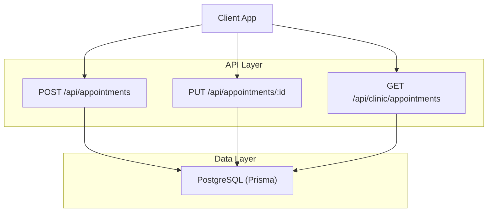
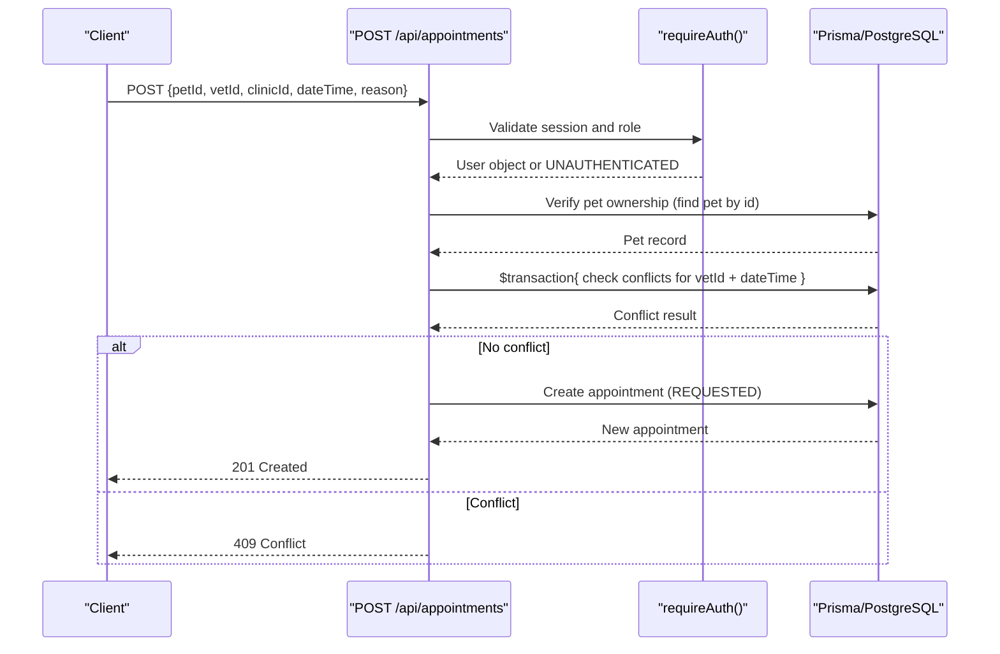
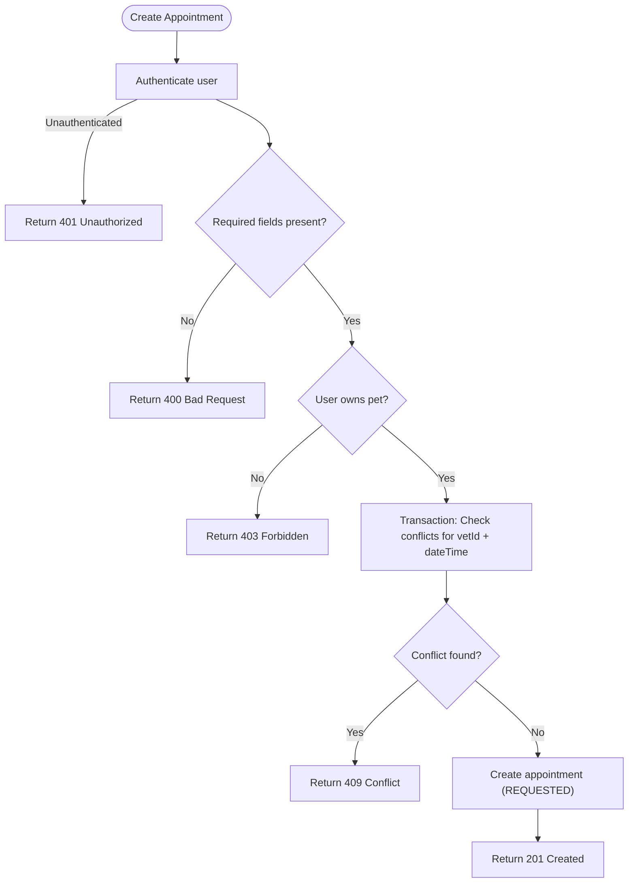
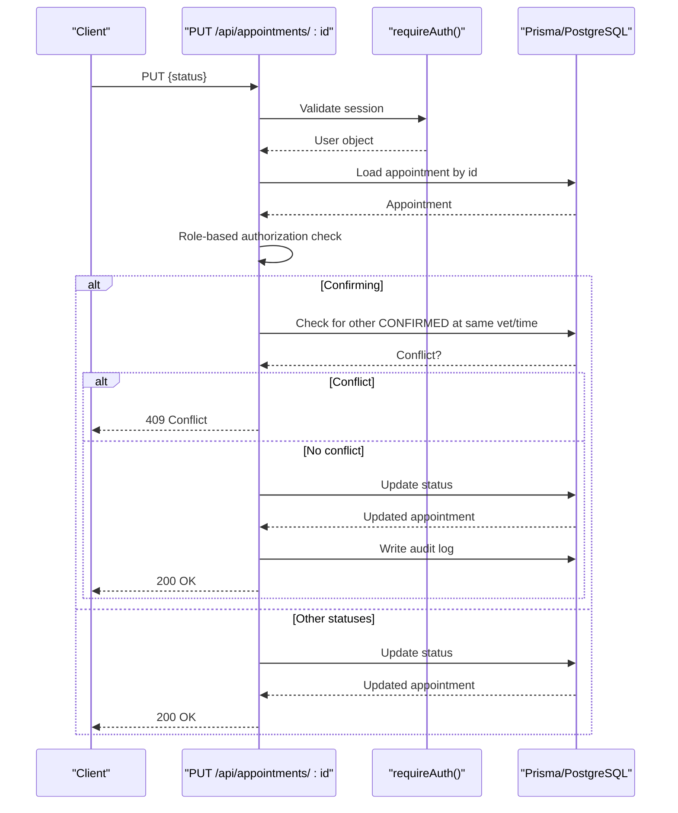
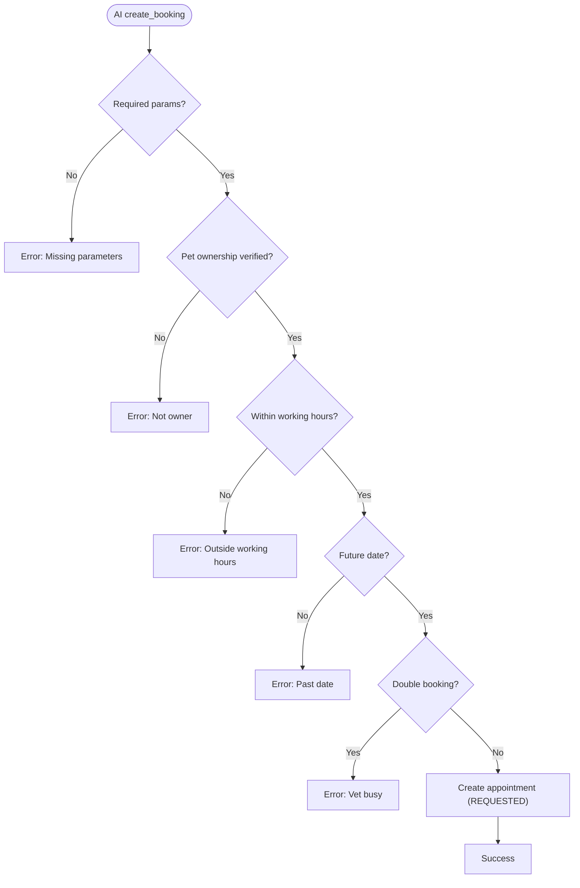
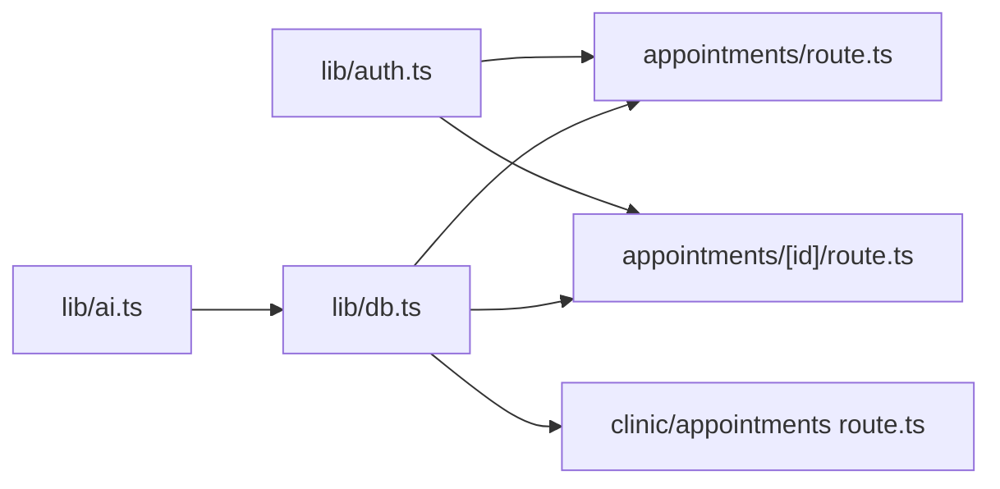

# Booking Workflow & Availability Management

<cite>
**Referenced Files in This Document**
- [route.ts](file://app/api/appointments/route.ts)
- [route.ts](file://app/api/appointments/[appointmentId]/route.ts)
- [schema.prisma](file://prisma/schema.prisma)
- [auth.ts](file://lib/auth.ts)
- [db.ts](file://lib/db.ts)
- [ai.ts](file://lib/ai.ts)
- [route.ts](file://app/api/clinic/appointments/route.ts)
- [route.ts](file://app/api/clinic/vets/route.ts)
- [route.ts](file://app/api/clinics/[clinicId]/vets/route.ts)
- [test_booking.ts](file://test_booking.ts)
</cite>

## Table of Contents
1. Introduction
2. Project Structure
3. Core Components
4. Architecture Overview
5. Detailed Component Analysis
6. Dependency Analysis
7. Performance Considerations
8. Troubleshooting Guide
9. Conclusion

## Introduction
This document explains the end-to-end appointment booking workflow and availability management system for the pet healthcare application. It covers:
- Authentication and authorization for booking requests
- Pet ownership validation
- Veterinarian availability checking and double-booking prevention
- Working hours enforcement against clinic schedules
- Transaction-based conflict detection to prevent concurrent duplicate bookings
- API usage examples, error handling, and performance considerations for high-concurrency scenarios

## Project Structure
The booking system is implemented as a set of Next.js API routes backed by Prisma and PostgreSQL. Key areas include:
- Appointment creation and listing endpoints
- Appointment status transitions (confirm/reject/cancel) with role-based authorization
- Clinic admin views for appointments and vet associations
- AI-driven tools that enforce working hours and validate availability
- Database schema defining users, pets, veterinarians, clinics, and appointments

**Diagram sources**
- [route.ts:70-129](file://app/api/appointments/route.ts#L70-L129)
- [route.ts:7-67](file://app/api/appointments/route.ts#L7-L67)
- [route.ts:7-105](file://app/api/appointments/[appointmentId]/route.ts#L7-L105)
- [route.ts:5-84](file://app/api/clinic/appointments/route.ts#L5-L84)
- [schema.prisma:164-182](file://prisma/schema.prisma#L164-L182)

**Section sources**
- [route.ts:70-129](file://app/api/appointments/route.ts#L70-L129)
- [route.ts:7-105](file://app/api/appointments/[appointmentId]/route.ts#L7-L105)
- [route.ts:5-84](file://app/api/clinic/appointments/route.ts#L5-L84)
- [schema.prisma:164-182](file://prisma/schema.prisma#L164-L182)

## Core Components
- Authentication and session management: Validates user sessions and enforces roles for protected routes.
- Appointment creation: Validates required fields, verifies pet ownership, checks for double bookings within a transaction, and creates an appointment with REQUESTED status.
- Appointment lifecycle updates: Role-based transitions (CONFIRMED, CANCELLED, COMPLETED, NO_SHOW) with additional conflict checks on confirmation.
- Clinic administration: Lists appointments and vets associated with a clinic for administrative oversight.
- AI-assisted booking: Enforces working hours, past-date checks, and availability before creating bookings via tool calls.

**Section sources**
- [auth.ts:109-124](file://lib/auth.ts#L109-L124)
- [route.ts:70-129](file://app/api/appointments/route.ts#L70-L129)
- [route.ts:7-105](file://app/api/appointments/[appointmentId]/route.ts#L7-L105)
- [route.ts:5-84](file://app/api/clinic/appointments/route.ts#L5-L84)
- [ai.ts:375-461](file://lib/ai.ts#L375-L461)

## Architecture Overview
The booking flow integrates authentication, business rules, and database operations to ensure data consistency and correct scheduling.

**Diagram sources**
- [route.ts:70-129](file://app/api/appointments/route.ts#L70-L129)
- [auth.ts:109-124](file://lib/auth.ts#L109-L124)
- [schema.prisma:164-182](file://prisma/schema.prisma#L164-L182)

## Detailed Component Analysis

### Appointment Creation (POST /api/appointments)
- Authentication: Requires a valid session; returns 401 if unauthenticated.
- Input validation: Ensures petId, vetId, clinicId, dateTime, and reason are present; otherwise returns 400.
- Pet ownership: Verifies the requesting user owns the specified pet; otherwise returns 403.
- Double-booking prevention: Uses a database transaction to atomically check for existing REQUESTED or CONFIRMED appointments for the same vet at the same time; prevents race conditions under concurrency.
- Creation: Creates the appointment with status REQUESTED and includes related entities for response.

**Diagram sources**
- [route.ts:70-129](file://app/api/appointments/route.ts#L70-L129)

**Section sources**
- [route.ts:70-129](file://app/api/appointments/route.ts#L70-L129)

### Appointment Status Transitions (PUT /api/appointments/:id)
- Authentication and authorization:
  - PET_OWNER can cancel their own upcoming appointments.
  - VETERINARIAN can manage appointments assigned to them.
  - CLINIC_ADMIN can manage appointments for their clinic.
  - PLATFORM_ADMIN has full access.
- Validation: Ensures status is one of the allowed values; otherwise returns 400.
- Conflict check on confirmation: Prevents confirming an appointment if another CONFIRMED appointment exists for the same vet at the same time; returns 409 if conflict.
- Audit logging: Records status changes for security and compliance.

**Diagram sources**
- [route.ts:7-105](file://app/api/appointments/[appointmentId]/route.ts#L7-L105)

**Section sources**
- [route.ts:7-105](file://app/api/appointments/[appointmentId]/route.ts#L7-L105)

### Working Hours Enforcement and Availability Checks (AI Tools)
- Working hours: The AI tool validates that requested times fall within clinic working hours using timezone-aware formatting; outside hours return an explicit error.
- Past date validation: Prevents booking in the past based on local date comparison.
- Availability: Queries busy slots for a given vet and date range to inform UI or assist in selection.
- Booking via AI: Performs pet ownership verification, working hours validation, past date check, and double-booking check before creating an appointment.

**Diagram sources**
- [ai.ts:375-461](file://lib/ai.ts#L375-L461)

**Section sources**
- [ai.ts:375-461](file://lib/ai.ts#L375-L461)

### Clinic Administration Views
- Appointment listing: Filters by clinic and optional filters (TODAY, UPCOMING, COMPLETED, etc.), returning enriched appointment data including pet, owner, vet, and clinic details.
- Vet listing: Returns vets associated with a clinic, including profile and association status.

**Section sources**
- [route.ts:5-84](file://app/api/clinic/appointments/route.ts#L5-L84)
- [route.ts:5-51](file://app/api/clinic/vets/route.ts#L5-L51)
- [route.ts:6-42](file://app/api/clinics/[clinicId]/vets/route.ts#L6-L42)

### Data Model and Indexes
- Appointment model includes indexes on vetId+dateTime and ownerId to optimize conflict checks and queries.
- Enums define roles and appointment statuses to constrain state transitions.

**Section sources**
- [schema.prisma:9-28](file://prisma/schema.prisma#L9-L28)
- [schema.prisma:164-182](file://prisma/schema.prisma#L164-L182)

## Dependency Analysis
- API routes depend on authentication utilities to enforce session validity and roles.
- Database layer uses Prisma with a connection pool configured per environment for performance.
- AI tools integrate with the same database to provide availability and booking features.

**Diagram sources**
- [auth.ts:109-124](file://lib/auth.ts#L109-L124)
- [db.ts:1-33](file://lib/db.ts#L1-L33)
- [route.ts:70-129](file://app/api/appointments/route.ts#L70-L129)
- [route.ts:7-105](file://app/api/appointments/[appointmentId]/route.ts#L7-L105)
- [route.ts:5-84](file://app/api/clinic/appointments/route.ts#L5-L84)
- [ai.ts:375-461](file://lib/ai.ts#L375-L461)

**Section sources**
- [auth.ts:109-124](file://lib/auth.ts#L109-L124)
- [db.ts:1-33](file://lib/db.ts#L1-L33)
- [route.ts:70-129](file://app/api/appointments/route.ts#L70-L129)
- [route.ts:7-105](file://app/api/appointments/[appointmentId]/route.ts#L7-L105)
- [route.ts:5-84](file://app/api/clinic/appointments/route.ts#L5-L84)
- [ai.ts:375-461](file://lib/ai.ts#L375-L461)

## Performance Considerations
- Database indexing: Appointment table indexes on vetId+dateTime and ownerId support fast conflict checks and filtered queries.
- Connection pooling: Production uses a dedicated pg Pool with PrismaPg adapter to reduce overhead and improve throughput.
- Transactional conflict checks: Using Prisma transactions ensures atomicity when checking and creating appointments, preventing race conditions under high concurrency.
- Read patterns: Clinic admin endpoints use selective includes and ordering to minimize payload size and optimize sorting.
- Recommendations:
  - Add unique constraints or partial indexes to enforce uniqueness of vetId+dateTime for active statuses if not already enforced at the DB level.
  - Consider optimistic locking or row-level locks for critical sections if contention increases.
  - Cache busy slots for short periods to reduce repeated reads during peak booking windows.

[No sources needed since this section provides general guidance]

## Troubleshooting Guide
Common errors and their causes:
- 401 Unauthorized: Missing or invalid session token; ensure login succeeded and cookie is present.
- 400 Bad Request: Missing required fields (petId, vetId, clinicId, dateTime, reason) or invalid status value.
- 403 Forbidden: Attempting to book for a pet you do not own; or unauthorized role for the requested action.
- 404 Not Found: Appointment does not exist.
- 409 Conflict: Time slot already booked for the veterinarian (double-booking detected).
- 500 Internal Server Error: Unexpected server-side issues; check logs and database connectivity.

Validation tips:
- Ensure dateTime is a valid ISO timestamp and falls within working hours.
- Confirm vet is associated with the selected clinic.
- For AI-assisted bookings, verify timezone handling aligns with clinic operating hours.

**Section sources**
- [route.ts:70-129](file://app/api/appointments/route.ts#L70-L129)
- [route.ts:7-105](file://app/api/appointments/[appointmentId]/route.ts#L7-L105)
- [ai.ts:375-461](file://lib/ai.ts#L375-L461)

## Conclusion
The booking system combines robust authentication, strict pet ownership validation, transactional conflict detection, and working hours enforcement to deliver a reliable appointment scheduling experience. With appropriate database indexes and connection pooling, it supports high-concurrency environments while maintaining data consistency. Clinic administrators have visibility into appointments and vet associations to manage operations effectively.

[No sources needed since this section summarizes without analyzing specific files]