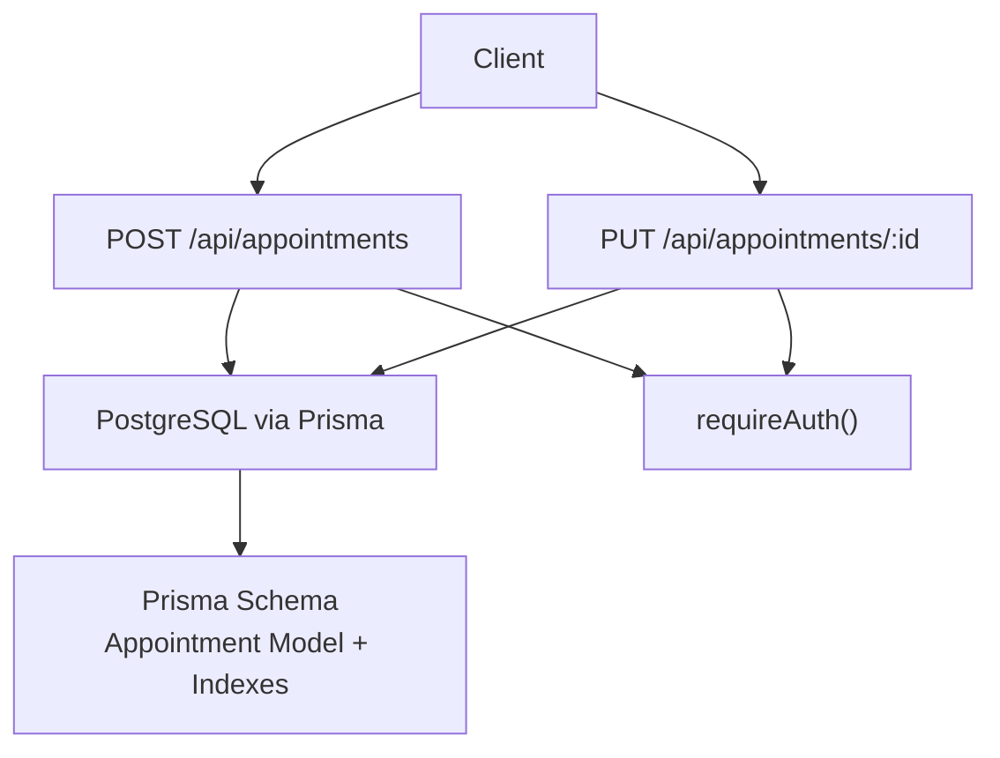
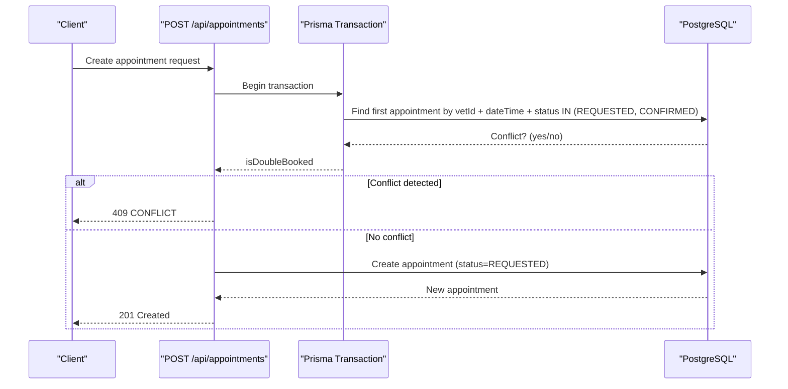
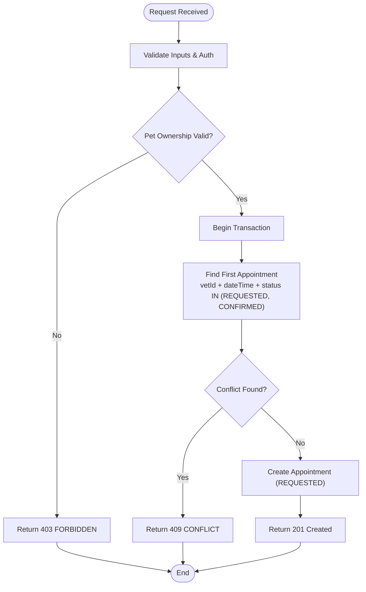
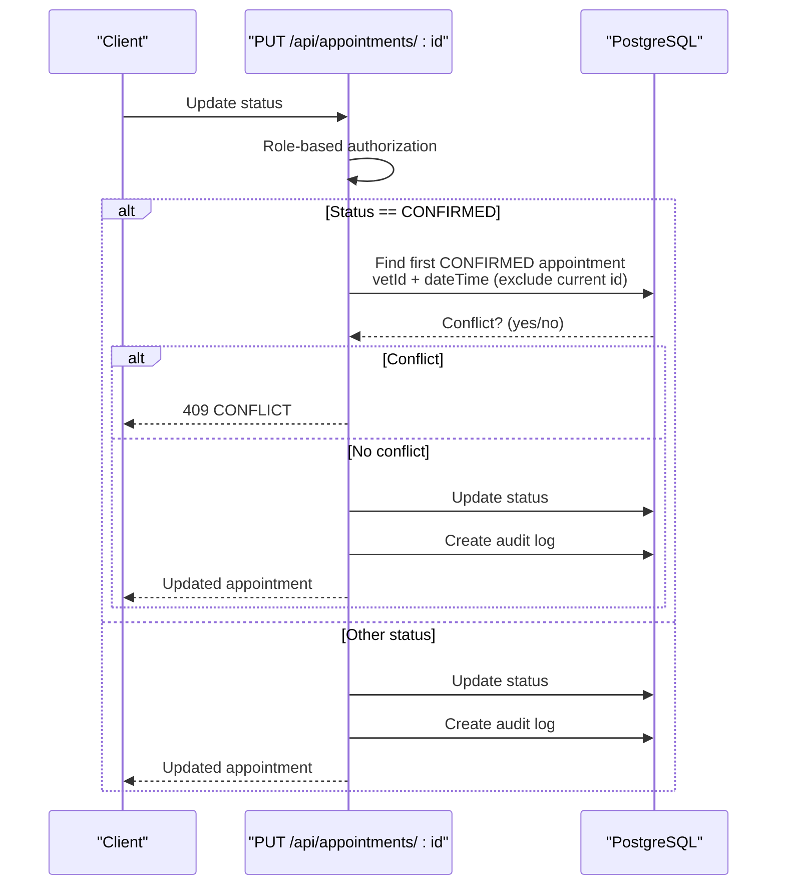
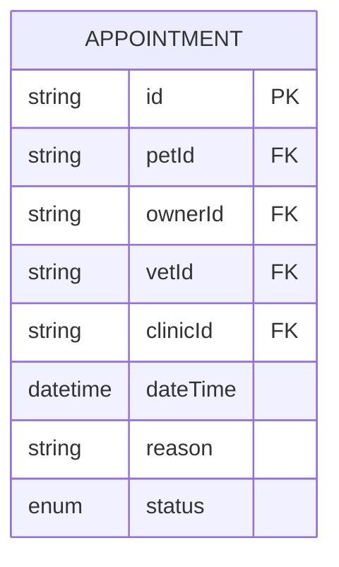
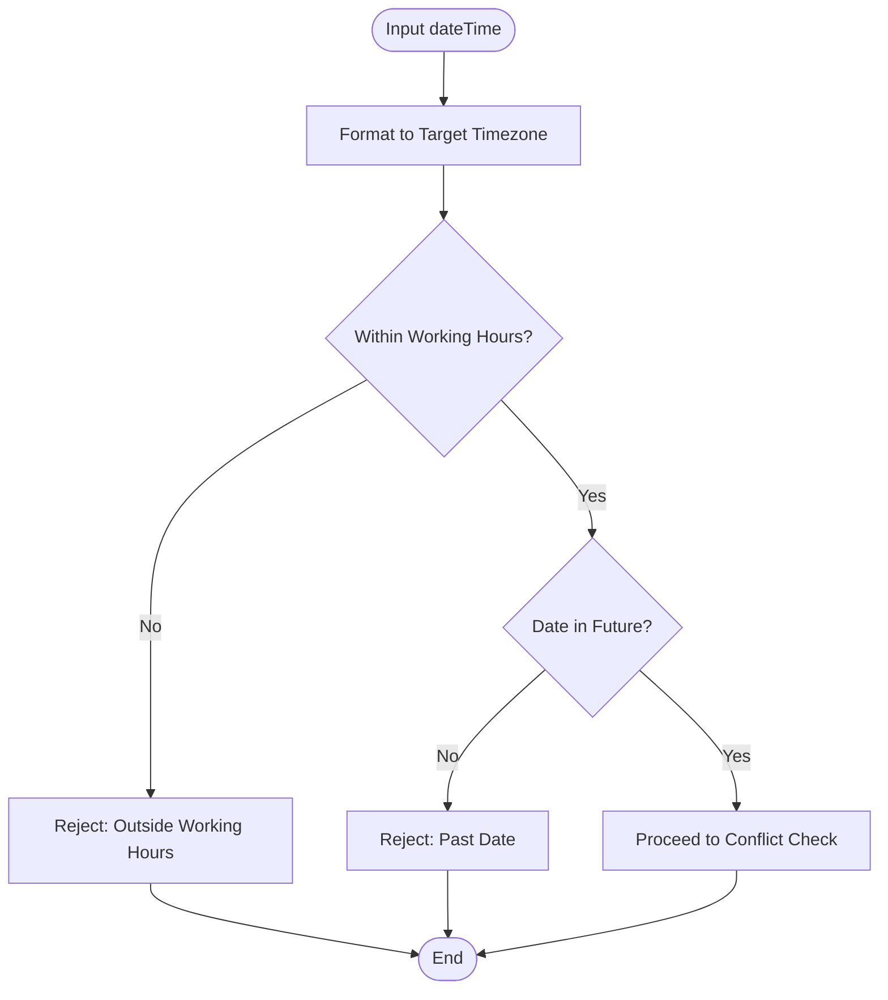
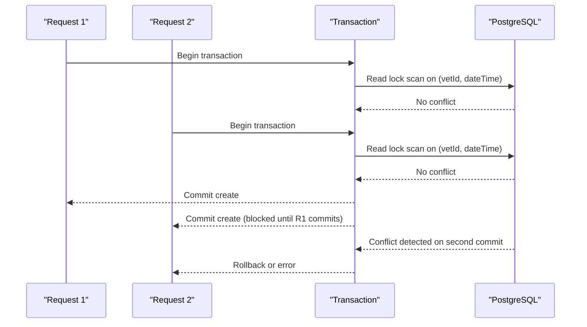
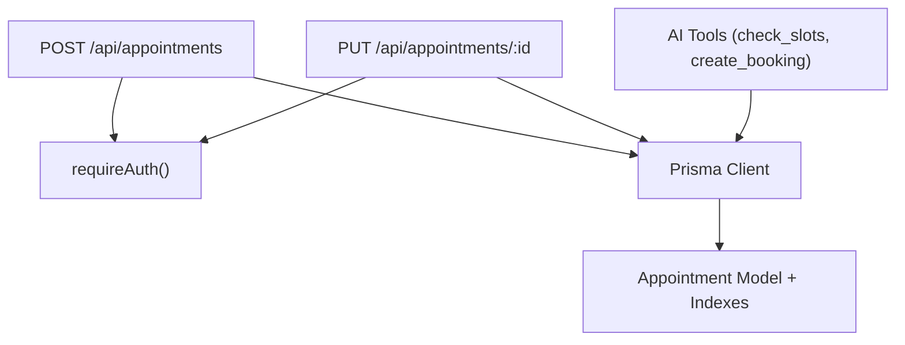

# Double-Booking Prevention & Conflict Detection

<cite>
**Referenced Files in This Document**
- [route.ts](file://app/api/appointments/route.ts)
- [route.ts](file://app/api/appointments/[appointmentId]/route.ts)
- [schema.prisma](file://prisma/schema.prisma)
- [migration.sql](file://prisma/migrations/20260825091722_init/migration.sql)
- [db.ts](file://lib/db.ts)
- [auth.ts](file://lib/auth.ts)
- [ai.ts](file://lib/ai.ts)
- [test_booking.ts](file://test_booking.ts)
</cite>

## Table of Contents
1. [Introduction](#introduction)
2. [Project Structure](#project-structure)
3. [Core Components](#core-components)
4. [Architecture Overview](#architecture-overview)
5. [Detailed Component Analysis](#detailed-component-analysis)
6. [Dependency Analysis](#dependency-analysis)
7. [Performance Considerations](#performance-considerations)
8. [Troubleshooting Guide](#troubleshooting-guide)
9. [Conclusion](#conclusion)

## Introduction
This document explains the double-booking prevention and conflict detection mechanisms for appointment scheduling in the system. It focuses on how concurrent booking requests are handled to prevent duplicate appointments, the database query logic used to detect conflicts, and the transactional approach that ensures data consistency under high concurrency. It also covers timezone handling, edge cases such as daylight saving time transitions, and performance considerations for busy scheduling systems.

## Project Structure
The scheduling logic spans API routes, Prisma schema definitions, database migrations, and utility modules:
- Appointment creation and listing endpoints implement conflict checks and status transitions.
- The Prisma schema defines the Appointment model and indexes that support efficient conflict queries.
- Database migrations create the tables and indexes required for reliable conflict detection.
- A shared database client configures connection pooling and Prisma usage across environments.
- Authentication utilities enforce authorization before any scheduling operation.
- An AI tooling module provides additional scheduling helpers (e.g., slot checking and booking), including timezone-aware validations.

**Diagram sources**
- [route.ts:70-143](file://app/api/appointments/route.ts#L70-L143)
- [route.ts:7-118](file://app/api/appointments/[appointmentId]/route.ts#L7-L118)
- [schema.prisma:164-182](file://prisma/schema.prisma#L164-L182)
- [migration.sql:119-131](file://prisma/migrations/20260825091722_init/migration.sql#L119-L131)
- [migration.sql:305-312](file://prisma/migrations/20260825091722_init/migration.sql#L305-L312)
- [db.ts:1-33](file://lib/db.ts#L1-L33)
- [auth.ts:109-115](file://lib/auth.ts#L109-L115)

**Section sources**
- [route.ts:70-143](file://app/api/appointments/route.ts#L70-L143)
- [route.ts:7-118](file://app/api/appointments/[appointmentId]/route.ts#L7-L118)
- [schema.prisma:164-182](file://prisma/schema.prisma#L164-L182)
- [migration.sql:119-131](file://prisma/migrations/20260825091722_init/migration.sql#L119-L131)
- [migration.sql:305-312](file://prisma/migrations/20260825091722_init/migration.sql#L305-L312)
- [db.ts:1-33](file://lib/db.ts#L1-L33)
- [auth.ts:109-115](file://lib/auth.ts#L109-L115)

## Core Components
- Appointment creation endpoint enforces pet ownership, validates inputs, performs a transactional conflict check for existing REQUESTED or CONFIRMED appointments at the same vet and dateTime, and creates the new appointment only if no conflict exists.
- Appointment update endpoint enforces role-based authorization, performs an additional conflict check when transitioning to CONFIRMED, updates the status, and records an audit log entry.
- Prisma schema defines the Appointment model with fields for pet, owner, vet, clinic, dateTime, reason, and status, plus an index on (vetId, dateTime) to optimize conflict queries.
- Database migration creates the Appointment table and the composite index on (vetId, dateTime).
- Shared database client configures Prisma with a connection pool and environment-specific behavior.
- Authentication middleware ensures only authenticated users can access scheduling endpoints.

**Section sources**
- [route.ts:70-143](file://app/api/appointments/route.ts#L70-L143)
- [route.ts:7-118](file://app/api/appointments/[appointmentId]/route.ts#L7-L118)
- [schema.prisma:164-182](file://prisma/schema.prisma#L164-L182)
- [migration.sql:119-131](file://prisma/migrations/20260825091722_init/migration.sql#L119-L131)
- [migration.sql:305-312](file://prisma/migrations/2026091722_init/migration.sql#L305-L312)
- [db.ts:1-33](file://lib/db.ts#L1-L33)
- [auth.ts:109-115](file://lib/auth.ts#L109-L115)

## Architecture Overview
The scheduling flow uses a transactional read-before-write pattern to avoid race conditions:
- On POST /api/appointments, the system reads within a transaction to detect conflicts for the requested vet and dateTime with statuses REQUESTED or CONFIRMED. If a conflict is found, it returns a 409 CONFLICT. Otherwise, it creates the appointment.
- On PUT /api/appointments/:id, when transitioning to CONFIRMED, the system checks for other CONFIRMED appointments at the same vet and dateTime to prevent double confirmation.

**Diagram sources**
- [route.ts:93-129](file://app/api/appointments/route.ts#L93-L129)
- [schema.prisma:164-182](file://prisma/schema.prisma#L164-L182)
- [migration.sql:305-312](file://prisma/migrations/20260825091722_init/migration.sql#L305-L312)

## Detailed Component Analysis

### Appointment Creation Endpoint
- Authorization: Requires authentication; verifies pet ownership before proceeding.
- Conflict detection: Uses a Prisma transaction to atomically check for existing appointments with the same vetId and dateTime where status is REQUESTED or CONFIRMED.
- Response handling: Returns 409 CONFLICT if a conflict is found; otherwise creates the appointment with status REQUESTED and returns 201 Created.

**Diagram sources**
- [route.ts:70-143](file://app/api/appointments/route.ts#L70-L143)

**Section sources**
- [route.ts:70-143](file://app/api/appointments/route.ts#L70-L143)

### Appointment Update Endpoint (Status Transition)
- Authorization: Role-based checks ensure only authorized users can change appointment status.
- Confirmation conflict check: When setting status to CONFIRMED, the endpoint checks for another CONFIRMED appointment at the same vet and dateTime (excluding the current appointment).
- Audit logging: Records the status transition in an audit log.

**Diagram sources**
- [route.ts:7-118](file://app/api/appointments/[appointmentId]/route.ts#L7-L118)

**Section sources**
- [route.ts:7-118](file://app/api/appointments/[appointmentId]/route.ts#L7-L118)

### Data Model and Indexing
- Appointment model includes fields for pet, owner, vet, clinic, dateTime, reason, and status.
- Composite index on (vetId, dateTime) supports fast conflict detection queries.
- Additional indexes on ownerId and petId improve query performance for common filters.

**Diagram sources**
- [schema.prisma:164-182](file://prisma/schema.prisma#L164-L182)
- [migration.sql:119-131](file://prisma/migrations/20260825091722_init/migration.sql#L119-L131)
- [migration.sql:305-312](file://prisma/migrations/20260825091722_init/migration.sql#L305-L312)

**Section sources**
- [schema.prisma:164-182](file://prisma/schema.prisma#L164-L182)
- [migration.sql:119-131](file://prisma/migrations/20260825091722_init/migration.sql#L119-L131)
- [migration.sql:305-312](file://prisma/migrations/20260825091722_init/migration.sql#L305-L312)

### Timezone Handling and Edge Cases
- Slot checking and working hours validation use timezone-aware formatting to evaluate times relative to a specific timezone (e.g., Asia/Karachi).
- Past date validation prevents bookings in the past based on the target timezone’s date.
- Working hours enforcement restricts bookings outside defined business hours in the specified timezone.

**Diagram sources**
- [ai.ts:331-379](file://lib/ai.ts#L331-L379)
- [ai.ts:381-418](file://lib/ai.ts#L381-L418)

**Section sources**
- [ai.ts:331-379](file://lib/ai.ts#L331-L379)
- [ai.ts:381-418](file://lib/ai.ts#L381-L418)

### Race Condition Handling and Database Locking Strategy
- Transactional read-before-write: The creation endpoint wraps the conflict check and subsequent creation in a Prisma transaction to ensure atomicity and prevent race conditions between concurrent requests.
- Index-backed queries: The composite index on (vetId, dateTime) enables efficient locking and scanning at the database level during conflict checks.
- Note: The update endpoint’s confirmation conflict check is not wrapped in a transaction; consider wrapping it to further strengthen consistency under high concurrency.

**Diagram sources**
- [route.ts:93-129](file://app/api/appointments/route.ts#L93-L129)
- [schema.prisma:164-182](file://prisma/schema.prisma#L164-L182)
- [migration.sql:305-312](file://prisma/migrations/20260825091722_init/migration.sql#L305-L312)

**Section sources**
- [route.ts:93-129](file://app/api/appointments/route.ts#L93-L129)
- [schema.prisma:164-182](file://prisma/schema.prisma#L164-L182)
- [migration.sql:305-312](file://prisma/migrations/20260825091722_init/migration.sql#L305-L312)

## Dependency Analysis
- API routes depend on Prisma client configured via lib/db.ts.
- Authentication middleware (requireAuth) gates access to scheduling endpoints.
- Scheduling logic depends on the Appointment model and its indexes defined in schema.prisma and created by migrations.
- AI tools provide auxiliary scheduling functions (slot checking, working hours, past date validation) that interact with the same Appointment model.

**Diagram sources**
- [route.ts:70-143](file://app/api/appointments/route.ts#L70-L143)
- [route.ts:7-118](file://app/api/appointments/[appointmentId]/route.ts#L7-L118)
- [db.ts:1-33](file://lib/db.ts#L1-L33)
- [auth.ts:109-115](file://lib/auth.ts#L109-L115)
- [schema.prisma:164-182](file://prisma/schema.prisma#L164-L182)
- [ai.ts:331-418](file://lib/ai.ts#L331-L418)

**Section sources**
- [route.ts:70-143](file://app/api/appointments/route.ts#L70-L143)
- [route.ts:7-118](file://app/api/appointments/[appointmentId]/route.ts#L7-L118)
- [db.ts:1-33](file://lib/db.ts#L1-L33)
- [auth.ts:109-115](file://lib/auth.ts#L109-L115)
- [schema.prisma:164-182](file://prisma/schema.prisma#L164-L182)
- [ai.ts:331-418](file://lib/ai.ts#L331-L418)

## Performance Considerations
- Index utilization: The composite index on (vetId, dateTime) accelerates conflict checks by minimizing full table scans.
- Transaction scope: Keep transactions minimal to reduce lock contention; currently, the creation endpoint’s conflict check and creation are within a single transaction.
- Connection pooling: The database client configures a connection pool to handle concurrent requests efficiently.
- Query efficiency: Use precise filters (exact dateTime match for exact-slot conflicts; range queries for day-level slot checks) to leverage indexes effectively.
- Potential improvements: Wrap confirmation updates in a transaction to prevent race conditions during status transitions; consider adding application-level retries for transient database errors.

[No sources needed since this section provides general guidance]

## Troubleshooting Guide
- Conflicts during creation: If a 409 CONFLICT is returned, verify that there is no existing REQUESTED or CONFIRMED appointment for the same vet and dateTime.
- Conflicts during confirmation: If a 409 CONFLICT occurs when confirming, ensure no other CONFIRMED appointment exists for the same vet and dateTime.
- Timezone issues: Ensure input dateTime values are correctly interpreted in the target timezone; use timezone-aware formatting for working hours and past date checks.
- Authorization errors: Verify user roles and ownership checks; unauthorized attempts will return 401 or 403.
- Database connectivity: Confirm Prisma client configuration and connection pool settings in production vs development environments.

**Section sources**
- [route.ts:70-143](file://app/api/appointments/route.ts#L70-L143)
- [route.ts:7-118](file://app/api/appointments/[appointmentId]/route.ts#L7-L118)
- [ai.ts:331-418](file://lib/ai.ts#L331-L418)
- [auth.ts:109-115](file://lib/auth.ts#L109-L115)
- [db.ts:1-33](file://lib/db.ts#L1-L33)

## Conclusion
The system employs a transactional read-before-write strategy to prevent double bookings, leveraging Prisma transactions and database indexes to maintain consistency under concurrent load. Timezone-aware validations ensure correct handling of working hours and past dates. While the creation endpoint robustly handles race conditions, the confirmation update path could benefit from transactional wrapping to further strengthen consistency. Proper indexing and connection pooling contribute to performance, and clear error responses facilitate troubleshooting.

[No sources needed since this section summarizes without analyzing specific files]