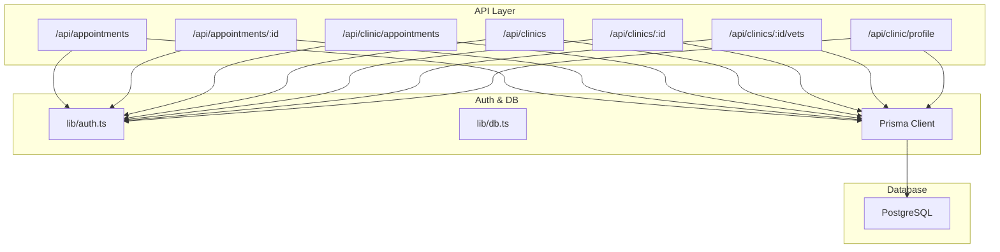
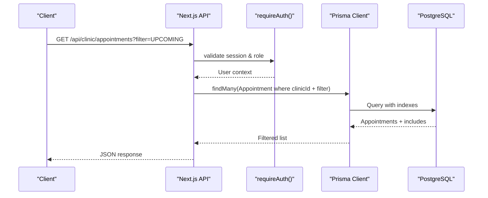
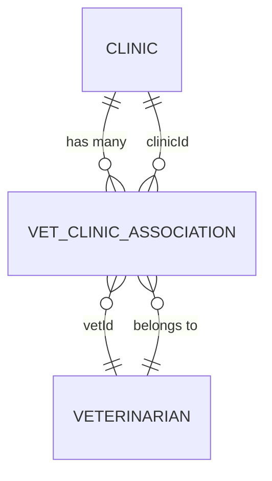
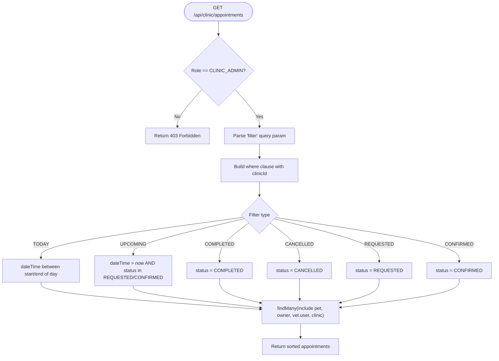
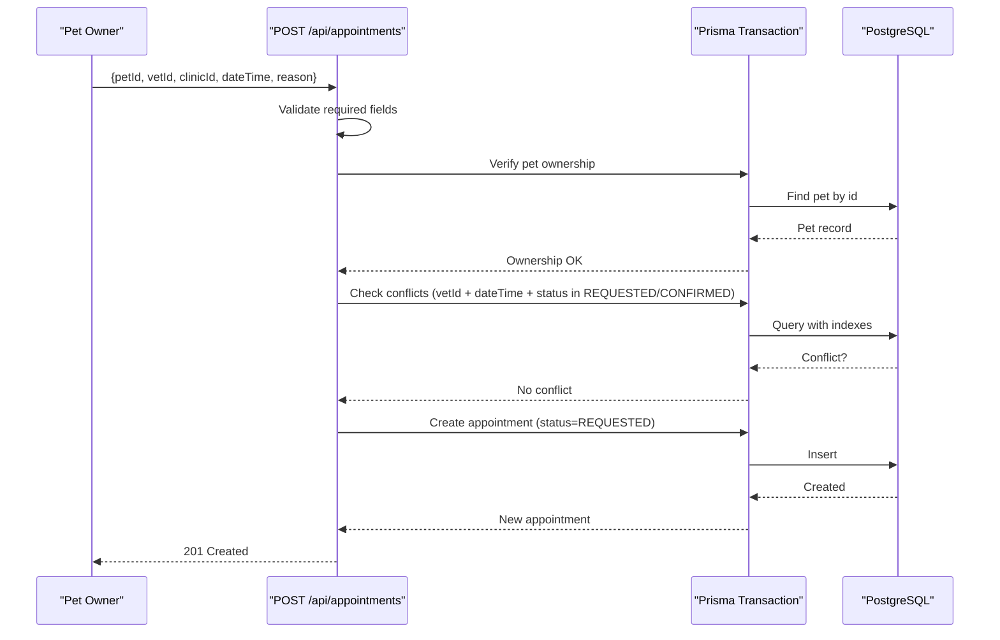
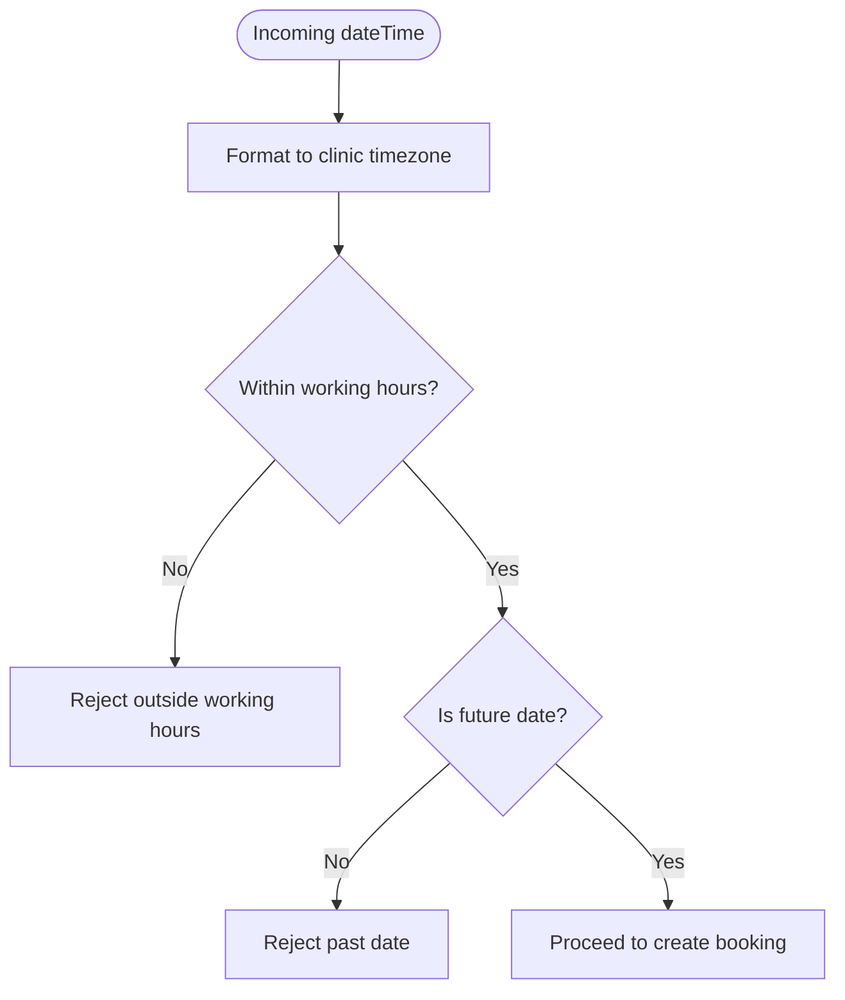
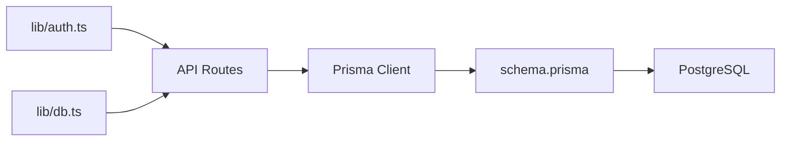

# Veterinarian & Clinic Scheduling Integration

<cite>
**Referenced Files in This Document**
- [schema.prisma](file://prisma/schema.prisma)
- [db.ts](file://lib/db.ts)
- [auth.ts](file://lib/auth.ts)
- [appointments route.ts](file://app/api/appointments/route.ts)
- [appointment update route.ts](file://app/api/appointments/[appointmentId]/route.ts)
- [clinic appointments route.ts](file://app/api/clinic/appointments/route.ts)
- [clinics route.ts](file://app/api/clinics/route.ts)
- [clinic detail route.ts](file://app/api/clinics/[clinicId]/route.ts)
- [clinic vets route.ts](file://app/api/clinics/[clinicId]/vets/route.ts)
- [clinic profile route.ts](file://app/api/clinic/profile/route.ts)
- [clinic dashboard page.tsx](file://app/clinic/dashboard/page.tsx)
- [ai.ts](file://lib/ai.ts)
- [chat route.ts](file://app/api/ai/chat/route.ts)
</cite>

## Table of Contents
1. Introduction
2. Project Structure
3. Core Components
4. Architecture Overview
5. Detailed Component Analysis
6. Dependency Analysis
7. Performance Considerations
8. Troubleshooting Guide
9. Conclusion

## Introduction
This document explains the integrated scheduling system that manages veterinarian availability across multiple clinics. It covers multi-vet clinic support, clinic-level appointment management for administrators, timezone handling and calendar synchronization, example queries and operations, and performance strategies for large datasets and caching of frequently accessed schedule information.

## Project Structure
The scheduling system is implemented as a Next.js API layer backed by Prisma and PostgreSQL. Key areas:
- Data model and relationships define users, pets, veterinarians, clinics, associations, and appointments.
- API routes handle authentication, listing, filtering, creation, and status transitions for appointments.
- Clinic admin endpoints provide filtered views of all appointments for a specific clinic.
- AI tools implement working-hours checks and slot conflict detection using timezone-aware logic.

**Diagram sources**
- [appointments route.ts](file://app/api/appointments/route.ts)
- [appointment update route.ts](file://app/api/appointments/[appointmentId]/route.ts)
- [clinic appointments route.ts](file://app/api/clinic/appointments/route.ts)
- [clinics route.ts](file://app/api/clinics/route.ts)
- [clinic detail route.ts](file://app/api/clinics/[clinicId]/route.ts)
- [clinic vets route.ts](file://app/api/clinics/[clinicId]/vets/route.ts)
- [clinic profile route.ts](file://app/api/clinic/profile/route.ts)
- [auth.ts](file://lib/auth.ts)
- [db.ts](file://lib/db.ts)
- [schema.prisma](file://prisma/schema.prisma)

**Section sources**
- [schema.prisma:107-182](file://prisma/schema.prisma#L107-L182)
- [db.ts:1-33](file://lib/db.ts#L1-L33)
- [auth.ts:109-125](file://lib/auth.ts#L109-L125)

## Core Components
- Multi-vet clinic support: Veterinarians are associated with clinics via an association table, enabling patients to book with different practitioners within the same facility.
- Clinic-level appointment management: Administrators can view and filter appointments for their clinic (today, upcoming, completed, cancelled, requested, confirmed).
- Appointment lifecycle: Creation with ownership validation and double-booking prevention; status updates with role-based authorization and audit logging.
- Timezone handling: Working hours and date comparisons use explicit timezone formatting to ensure accurate scheduling across locations.

**Section sources**
- [schema.prisma:90-131](file://prisma/schema.prisma#L90-L131)
- [schema.prisma:164-182](file://prisma/schema.prisma#L164-L182)
- [appointments route.ts:70-129](file://app/api/appointments/route.ts#L70-L129)
- [appointment update route.ts:6-105](file://app/api/appointments/[appointmentId]/route.ts#L6-L105)
- [clinic appointments route.ts:5-84](file://app/api/clinic/appointments/route.ts#L5-L84)
- [ai.ts:390-467](file://lib/ai.ts#L390-L467)

## Architecture Overview
The system enforces role-based access and data scoping per user role:
- Pet owners see only their own appointments.
- Veterinarians see appointments assigned to them.
- Clinic admins see all appointments for their clinic with filters.
- Platform admins have broad access.

**Diagram sources**
- [clinic appointments route.ts:5-84](file://app/api/clinic/appointments/route.ts#L5-L84)
- [auth.ts:109-125](file://lib/auth.ts#L109-L125)
- [schema.prisma:164-182](file://prisma/schema.prisma#L164-L182)

## Detailed Component Analysis

### Multi-Vet Clinic Support
- Veterinarians are linked to clinics through an association entity with status tracking. This allows multiple vets to be associated with one clinic and enables booking against any vet at that clinic.
- The clinics endpoint returns verified clinics for discovery and associates vets for authenticated veterinarians.

**Diagram sources**
- [schema.prisma:90-131](file://prisma/schema.prisma#L90-L131)

**Section sources**
- [schema.prisma:90-131](file://prisma/schema.prisma#L90-L131)
- [clinics route.ts:5-35](file://app/api/clinics/route.ts#L5-L35)
- [clinic vets route.ts:5-51](file://app/api/clinics/[clinicId]/vets/route.ts#L5-L51)

### Clinic-Level Appointment Management
- The clinic admin endpoint supports filtering by ALL, TODAY, UPCOMING, COMPLETED, CANCELLED, REQUESTED, CONFIRMED.
- Filters apply time ranges or status conditions scoped to the admin’s clinic.
- The clinic dashboard UI fetches and displays these filtered lists and provides quick stats for today and upcoming appointments.

**Diagram sources**
- [clinic appointments route.ts:5-84](file://app/api/clinic/appointments/route.ts#L5-L84)

**Section sources**
- [clinic appointments route.ts:5-84](file://app/api/clinic/appointments/route.ts#L5-L84)
- [clinic dashboard page.tsx:38-99](file://app/clinic/dashboard/page.tsx#L38-L99)
- [clinic dashboard page.tsx:270-285](file://app/clinic/dashboard/page.tsx#L270-L285)

### Appointment Booking and Status Transitions
- Creating an appointment validates pet ownership, prevents double bookings, and sets initial status to REQUESTED.
- Updating an appointment enforces role-based permissions and performs additional conflict checks when confirming.
- Audit logs record status changes for accountability.

**Diagram sources**
- [appointments route.ts:70-129](file://app/api/appointments/route.ts#L70-L129)

**Section sources**
- [appointments route.ts:70-129](file://app/api/appointments/route.ts#L70-L129)
- [appointment update route.ts:6-105](file://app/api/appointments/[appointmentId]/route.ts#L6-L105)

### Timezone Handling and Calendar Synchronization
- Working hours validation uses explicit timezone formatting to interpret requested times relative to clinic location.
- Date comparisons for past/future checks are performed using timezone-aware formatting.
- The chat interface injects current date/time in a specified timezone into system prompts to align relative date reasoning.

**Diagram sources**
- [ai.ts:390-467](file://lib/ai.ts#L390-L467)
- [chat route.ts:145-152](file://app/api/ai/chat/route.ts#L145-L152)

**Section sources**
- [ai.ts:390-467](file://lib/ai.ts#L390-L467)
- [chat route.ts:145-152](file://app/api/ai/chat/route.ts#L145-L152)

### Example Queries and Operations
- Clinic-specific queries:
  - Retrieve all clinic appointments: GET /api/clinic/appointments
  - Filter by today: GET /api/clinic/appointments?filter=TODAY
  - Filter by upcoming: GET /api/clinic/appointments?filter=UPCOMING
  - Filter by status: GET /api/clinic/appointments?filter=CONFIRMED|CANCELLED|REQUESTED|COMPLETED
- Bulk operations:
  - Batch confirm/cancel: Iterate over selected IDs and call PUT /api/appointments/:id with desired status.
  - Note: Implement client-side batching to reduce network overhead.
- Reporting:
  - Use the clinic dashboard to compute counts for today and upcoming from the returned dataset.
  - Extend server-side aggregation if needed for large datasets.

**Section sources**
- [clinic appointments route.ts:23-84](file://app/api/clinic/appointments/route.ts#L23-L84)
- [appointment update route.ts:6-105](file://app/api/appointments/[appointmentId]/route.ts#L6-L105)
- [clinic dashboard page.tsx:270-285](file://app/clinic/dashboard/page.tsx#L270-L285)

## Dependency Analysis
- Authentication dependency: All protected routes call requireAuth to enforce session validity and retrieve user context.
- Database dependency: All routes use Prisma Client configured with a connection pool for production and global reuse in development.
- Model dependencies: Appointments depend on Pet, Owner (User), Veterinarian, and Clinic models; indices exist on key foreign keys and query patterns.

**Diagram sources**
- [auth.ts:109-125](file://lib/auth.ts#L109-L125)
- [db.ts:1-33](file://lib/db.ts#L1-L33)
- [schema.prisma:164-182](file://prisma/schema.prisma#L164-L182)

**Section sources**
- [auth.ts:109-125](file://lib/auth.ts#L109-L125)
- [db.ts:1-33](file://lib/db.ts#L1-L33)
- [schema.prisma:164-182](file://prisma/schema.prisma#L164-L182)

## Performance Considerations
- Index usage:
  - Appointments include composite index on vetId and dateTime, improving conflict checks and daily lookups.
  - Additional indexes on ownerId and petId support common queries.
- Connection pooling:
  - Production uses a dedicated connection pool; development reuses a global pool to avoid hot-reload overhead.
- Query optimization:
  - Select only necessary fields in includes (e.g., vet.user fields) to reduce payload size.
  - Use server-side filters for clinic dashboards rather than client-side filtering over large datasets.
- Caching strategy recommendations:
  - Cache clinic appointment listings per clinic and filter combination for short TTLs (e.g., 30–60 seconds) to reduce repeated queries during high traffic.
  - Cache vet schedules per day to speed up availability checks.
  - Invalidate caches on appointment status changes or new bookings.
- Concurrency control:
  - Use database transactions for critical sections like booking creation and confirmation to prevent race conditions.

[No sources needed since this section provides general guidance]

## Troubleshooting Guide
- Unauthorized access:
  - Ensure valid session cookie and correct role assignment.
  - Protected routes return 401 when unauthenticated.
- Forbidden actions:
  - Role boundary checks prevent unauthorized status transitions or clinic-scoped operations.
- Not found:
  - Invalid appointment IDs or clinic IDs result in 404 responses.
- Conflicts:
  - Double-booking attempts return 409 with descriptive messages.
- Internal errors:
  - Unexpected exceptions return 500 with generic messages; check server logs for stack traces.

**Section sources**
- [appointments route.ts:55-66](file://app/api/appointments/route.ts#L55-L66)
- [appointment update route.ts:16-82](file://app/api/appointments/[appointmentId]/route.ts#L16-L82)
- [clinic appointments route.ts:85-97](file://app/api/clinic/appointments/route.ts#L85-L97)

## Conclusion
The scheduling system provides robust multi-vet clinic support, secure and role-based appointment management, and timezone-aware scheduling logic. With indexed queries, transactional safety, and recommended caching strategies, it scales effectively for large clinic datasets while maintaining accuracy and reliability across geographic locations.