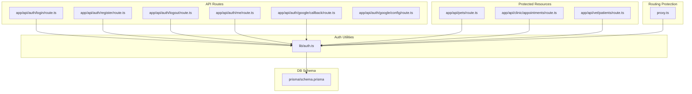
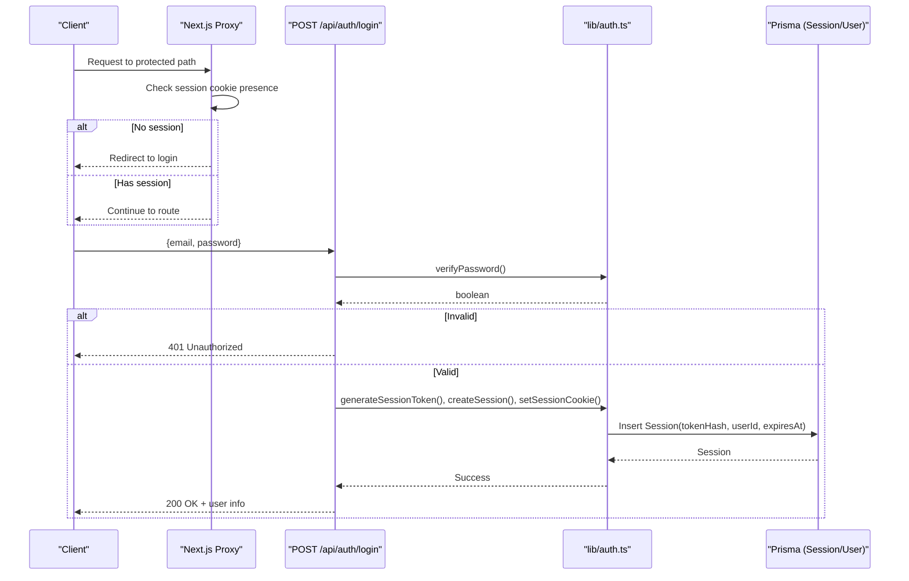
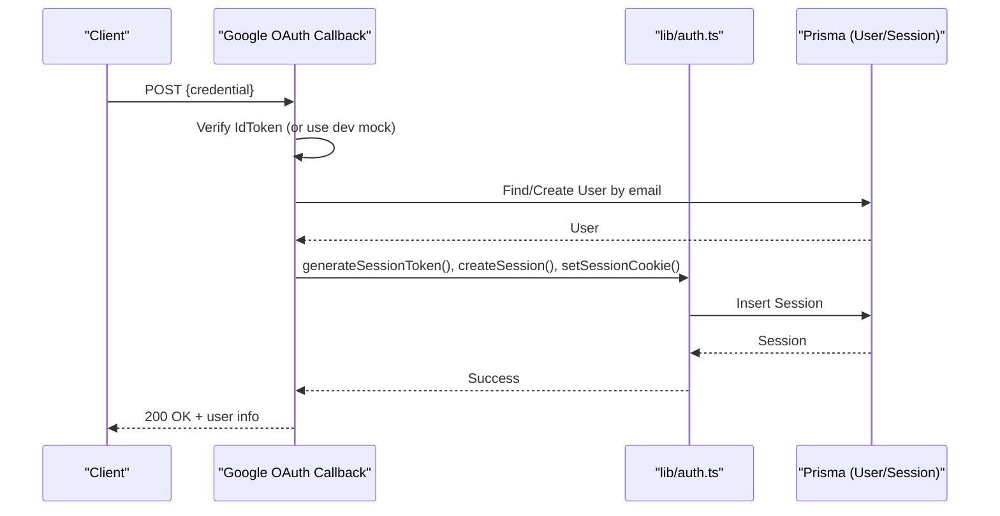
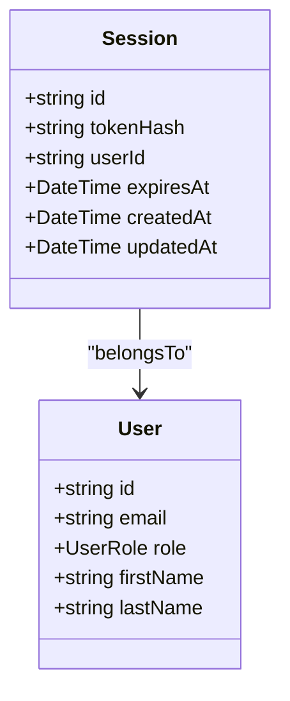
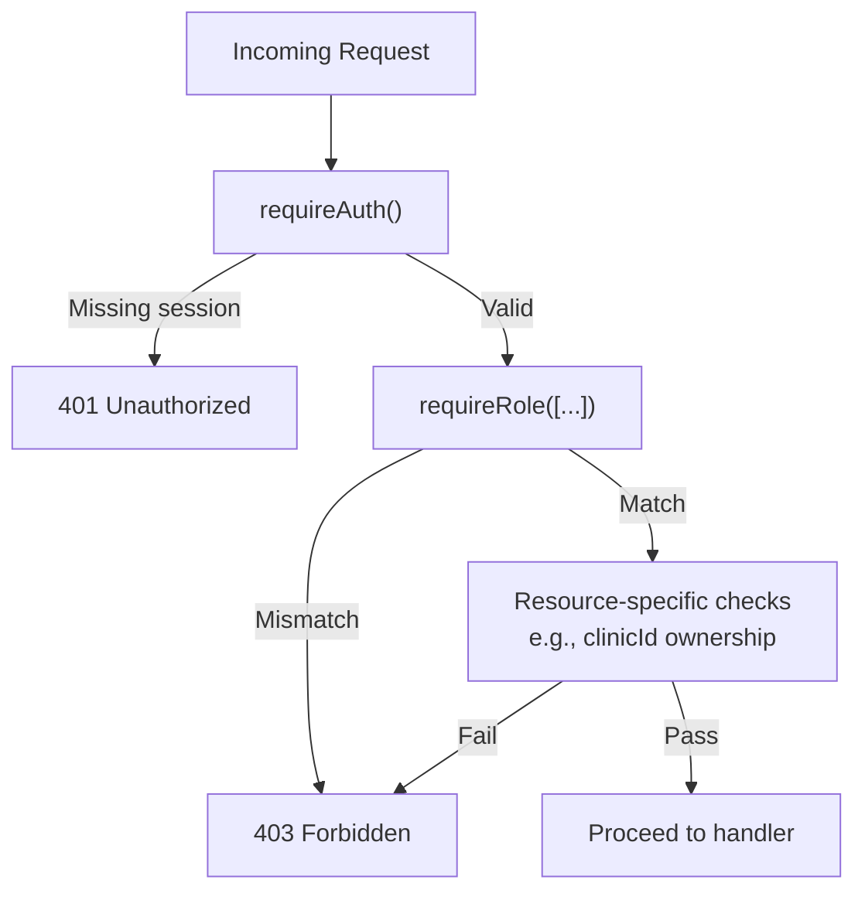
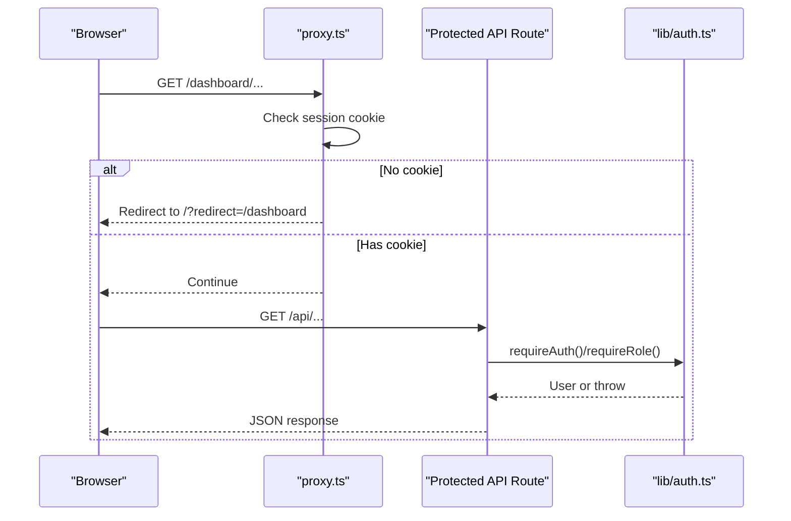
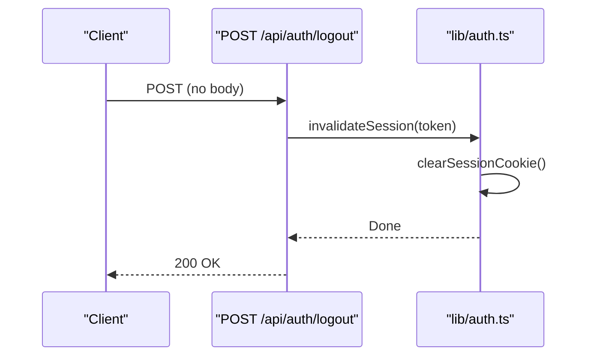
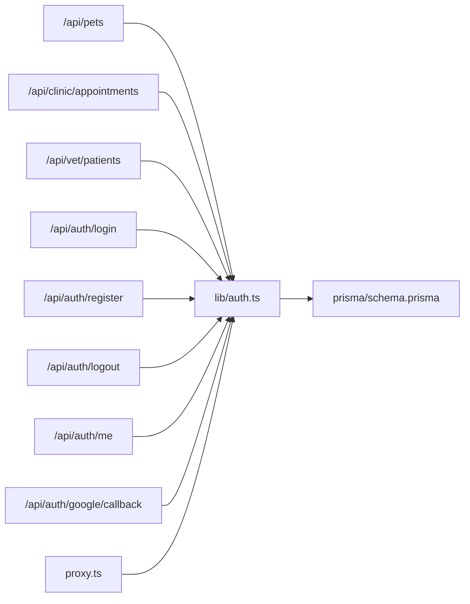

# Authentication & Authorization

<cite>
**Referenced Files in This Document**
- [auth.ts](file://lib/auth.ts)
- [route.ts (login)](file://app/api/auth/login/route.ts)
- [route.ts (register)](file://app/api/auth/register/route.ts)
- [route.ts (logout)](file://app/api/auth/logout/route.ts)
- [route.ts (me)](file://app/api/auth/me/route.ts)
- [route.ts (google callback)](file://app/api/auth/google/callback/route.ts)
- [route.ts (google config)](file://app/api/auth/google/config/route.ts)
- [schema.prisma](file://prisma/schema.prisma)
- [route.ts (pets)](file://app/api/pets/route.ts)
- [route.ts (clinic appointments)](file://app/api/clinic/appointments/route.ts)
- [route.ts (vet patients)](file://app/api/vet/patients/route.ts)
- [proxy.ts](file://proxy.ts)
- [03-authentication-decision.md](file://docs/02-requirements/03-authentication-decision.md)
- [06-security.md](file://docs/03-architecture/06-security.md)
</cite>

## Table of Contents
1. Introduction
2. Project Structure
3. Core Components
4. Architecture Overview
5. Detailed Component Analysis
6. Dependency Analysis
7. Performance Considerations
8. Troubleshooting Guide
9. Conclusion
10. Appendices

## Introduction
This document explains the PETIVA authentication and authorization system. It covers a multi-layered approach that combines email/password with Argon2 hashing and Google OAuth integration, secure session management via HttpOnly cookies, token generation and validation, automatic session expiration handling, and role-based access control (RBAC) for Pet Owner, Veterinarian, Clinic Admin, and Platform Admin roles. It also documents protected route middleware, request interception, authorization checks, end-to-end flows from login to logout, and security measures against common vulnerabilities such as CSRF and XSS.

## Project Structure
The authentication and authorization features are implemented across:
- Shared auth utilities and helpers
- API routes for registration, login, logout, current user, and Google OAuth
- Protected resource routes demonstrating RBAC enforcement
- Database schema defining users, sessions, and related entities
- A Next.js proxy/middleware for path-level protection



**Diagram sources**
- [auth.ts:1-125](file://lib/auth.ts#L1-L125)
- [route.ts (login):1-58](file://app/api/auth/login/route.ts#L1-L58)
- [route.ts (register):1-78](file://app/api/auth/register/route.ts#L1-L78)
- [route.ts (logout):1-25](file://app/api/auth/logout/route.ts#L1-L25)
- [route.ts (me):1-33](file://app/api/auth/me/route.ts#L1-L33)
- [route.ts (google callback):1-98](file://app/api/auth/google/callback/route.ts#L1-L98)
- [route.ts (google config):1-8](file://app/api/auth/google/config/route.ts#L1-L8)
- [route.ts (pets):1-69](file://app/api/pets/route.ts#L1-L69)
- [route.ts (clinic appointments):1-98](file://app/api/clinic/appointments/route.ts#L1-L98)
- [route.ts (vet patients):1-71](file://app/api/vet/patients/route.ts#L1-L71)
- [schema.prisma:9-66](file://prisma/schema.prisma#L9-L66)
- [proxy.ts:1-34](file://proxy.ts#L1-L34)

**Section sources**
- [auth.ts:1-125](file://lib/auth.ts#L1-L125)
- [schema.prisma:9-66](file://prisma/schema.prisma#L9-L66)
- [proxy.ts:1-34](file://proxy.ts#L1-L34)

## Core Components
- Password hashing and verification using Argon2id
- Secure session tokens generated server-side and stored in HttpOnly cookies
- Database-backed sessions with SHA-256 hashed tokens and sliding-window expiration
- Role-based access control helpers for asserting identity and permissions
- Google OAuth flow with client ID verification and session creation
- Path-level protection via Next.js middleware/proxy

Key responsibilities:
- lib/auth.ts: Centralized auth primitives, session lifecycle, cookie helpers, and RBAC guards
- API routes: Implement login, register, logout, current user, and Google OAuth callbacks
- Protected routes: Enforce authentication and role checks per resource
- prisma/schema.prisma: Defines User, Session, and related models/enums

**Section sources**
- [auth.ts:10-124](file://lib/auth.ts#L10-L124)
- [route.ts (login):5-48](file://app/api/auth/login/route.ts#L5-L48)
- [route.ts (register):6-68](file://app/api/auth/register/route.ts#L6-L68)
- [route.ts (logout):5-16](file://app/api/auth/logout/route.ts#L5-L16)
- [route.ts (me):4-23](file://app/api/auth/me/route.ts#L4-L23)
- [route.ts (google callback):6-88](file://app/api/auth/google/callback/route.ts#L6-L88)
- [schema.prisma:9-66](file://prisma/schema.prisma#L9-L66)

## Architecture Overview
The system separates authentication (identity verification) from authorization (access control). Authentication is performed at the boundary (middleware/proxy) and enforced authoritatively in each API route. Sessions are stored server-side with hashed tokens and managed via secure cookies.



**Diagram sources**
- [proxy.ts:6-23](file://proxy.ts#L6-L23)
- [route.ts (login):5-48](file://app/api/auth/login/route.ts#L5-L48)
- [auth.ts:23-92](file://lib/auth.ts#L23-L92)
- [schema.prisma:55-66](file://prisma/schema.prisma#L55-L66)

## Detailed Component Analysis

### Email/Password Authentication
- Registration validates required fields, enforces minimum password length, prevents duplicates, hashes passwords with Argon2id, creates user, issues session, and sets secure cookie.
- Login verifies credentials, creates session, and sets secure cookie.
- Current user endpoint reads the session cookie and returns minimal user profile if authenticated.

```mermaid
flowchart TD
Start(["Register/Login Entry"]) --> Validate["Validate Input"]
Validate --> Exists{"User exists?"}
Exists --> |No (Register)| HashPwd["Hash Password (Argon2id)"]
Exists --> |Yes (Login)| Verify["Verify Password"]
HashPwd --> CreateUser["Create User"]
Verify --> Match{"Match?"}
Match --> |No| Err["Return 401"]
Match --> |Yes| CreateSess["Create Session + Set Cookie"]
CreateUser --> CreateSess
CreateSess --> End(["Success Response"])
Err --> End
```

**Diagram sources**
- [route.ts (register):6-68](file://app/api/auth/register/route.ts#L6-L68)
- [route.ts (login):5-48](file://app/api/auth/login/route.ts#L5-L48)
- [auth.ts:10-44](file://lib/auth.ts#L10-L44)

**Section sources**
- [route.ts (register):6-68](file://app/api/auth/register/route.ts#L6-L68)
- [route.ts (login):5-48](file://app/api/auth/login/route.ts#L5-L48)
- [route.ts (me):4-23](file://app/api/auth/me/route.ts#L4-L23)
- [auth.ts:10-44](file://lib/auth.ts#L10-L44)

### Google OAuth Integration
- The callback endpoint accepts a Google credential, verifies it using the configured client ID (with a development mock mode), extracts user identity, creates or finds the user, issues a session, and sets the cookie.
- A configuration endpoint exposes the Google client ID to the frontend.



**Diagram sources**
- [route.ts (google callback):6-88](file://app/api/auth/google/callback/route.ts#L6-L88)
- [route.ts (google config):3-7](file://app/api/auth/google/config/route.ts#L3-L7)
- [auth.ts:23-92](file://lib/auth.ts#L23-L92)
- [schema.prisma:30-66](file://prisma/schema.prisma#L30-L66)

**Section sources**
- [route.ts (google callback):6-88](file://app/api/auth/google/callback/route.ts#L6-L88)
- [route.ts (google config):3-7](file://app/api/auth/google/config/route.ts#L3-L7)

### Session Management and Expiration
- Tokens are generated securely and hashed before storage; only the hash is persisted.
- Sessions include an expiration timestamp and support sliding-window extension when nearing expiry.
- Cookies are HttpOnly, Secure in production, SameSite=Lax, and scoped to root path.
- Logout invalidates the session and clears the cookie.



**Diagram sources**
- [schema.prisma:30-66](file://prisma/schema.prisma#L30-L66)

**Section sources**
- [auth.ts:23-97](file://lib/auth.ts#L23-L97)
- [route.ts (logout):5-16](file://app/api/auth/logout/route.ts#L5-L16)

### Role-Based Access Control (RBAC)
Roles defined in the schema:
- PET_OWNER
- VETERINARIAN
- CLINIC_ADMIN
- PLATFORM_ADMIN

Authorization patterns:
- requireAuth(): Ensures a valid session exists; throws UNAUTHENTICATED otherwise.
- requireRole(): Asserts the current user’s role matches one of the allowed roles; throws FORBIDDEN otherwise.
- Resource-specific checks: Some endpoints enforce additional conditions beyond role (e.g., clinic association).

Permission matrix (examples derived from implementation):
- Pet Owner: Manage own pets and profile; cannot access vet-only or clinic admin endpoints.
- Veterinarian: Access vet-specific endpoints (e.g., patient lists) after role check; may see clinics associated via VetClinicAssociation.
- Clinic Admin: Access clinic-specific endpoints (e.g., clinic appointments) and must be linked to a clinic.
- Platform Admin: Not explicitly used in shown routes; can be enforced via requireRole('PLATFORM_ADMIN') where needed.



**Diagram sources**
- [auth.ts:109-124](file://lib/auth.ts#L109-L124)
- [route.ts (clinic appointments):5-21](file://app/api/clinic/appointments/route.ts#L5-L21)
- [route.ts (vet patients):5-19](file://app/api/vet/patients/route.ts#L5-L19)

**Section sources**
- [schema.prisma:9-14](file://prisma/schema.prisma#L9-L14)
- [auth.ts:109-124](file://lib/auth.ts#L109-L124)
- [route.ts (clinic appointments):5-21](file://app/api/clinic/appointments/route.ts#L5-L21)
- [route.ts (vet patients):5-19](file://app/api/vet/patients/route.ts#L5-L19)

### Protected Route Middleware and Request Interception
- Path-level protection: A Next.js proxy/middleware intercepts requests to protected paths and redirects unauthenticated users to login, passing a redirect parameter.
- Authoritative checks: Each API route independently validates sessions and roles, ensuring defense-in-depth even if middleware is bypassed.



**Diagram sources**
- [proxy.ts:6-23](file://proxy.ts#L6-L23)
- [auth.ts:100-124](file://lib/auth.ts#L100-L124)
- [route.ts (pets):6-27](file://app/api/pets/route.ts#L6-L27)

**Section sources**
- [proxy.ts:6-23](file://proxy.ts#L6-L23)
- [route.ts (pets):6-27](file://app/api/pets/route.ts#L6-L27)

### Logout Flow
- Retrieves the session token from the cookie, invalidates the session in the database, and clears the cookie.



**Diagram sources**
- [route.ts (logout):5-16](file://app/api/auth/logout/route.ts#L5-L16)
- [auth.ts:77-97](file://lib/auth.ts#L77-L97)

**Section sources**
- [route.ts (logout):5-16](file://app/api/auth/logout/route.ts#L5-L16)
- [auth.ts:77-97](file://lib/auth.ts#L77-L97)

## Dependency Analysis
- API routes depend on lib/auth.ts for session and RBAC logic.
- lib/auth.ts depends on Prisma client and Node crypto/argon2 libraries.
- Database schema defines core entities and relationships used by all components.
- Proxy depends on cookie presence to gate routing.



**Diagram sources**
- [route.ts (pets):1-69](file://app/api/pets/route.ts#L1-L69)
- [route.ts (clinic appointments):1-98](file://app/api/clinic/appointments/route.ts#L1-L98)
- [route.ts (vet patients):1-71](file://app/api/vet/patients/route.ts#L1-L71)
- [route.ts (login):1-58](file://app/api/auth/login/route.ts#L1-L58)
- [route.ts (register):1-78](file://app/api/auth/register/route.ts#L1-L78)
- [route.ts (logout):1-25](file://app/api/auth/logout/route.ts#L1-L25)
- [route.ts (me):1-33](file://app/api/auth/me/route.ts#L1-L33)
- [route.ts (google callback):1-98](file://app/api/auth/google/callback/route.ts#L1-L98)
- [auth.ts:1-125](file://lib/auth.ts#L1-L125)
- [schema.prisma:9-66](file://prisma/schema.prisma#L9-L66)
- [proxy.ts:1-34](file://proxy.ts#L1-L34)

**Section sources**
- [auth.ts:1-125](file://lib/auth.ts#L1-L125)
- [schema.prisma:9-66](file://prisma/schema.prisma#L9-L66)

## Performance Considerations
- Session validation performs a single indexed lookup by tokenHash per request; this is efficient but adds DB load on every protected call.
- Sliding-window expiration updates occur only when less than one hour remains, reducing write frequency.
- Consider periodic cleanup of expired sessions via background jobs to keep the Session table lean.

[No sources needed since this section provides general guidance]

## Troubleshooting Guide
Common errors and handling:
- UNAUTHENTICATED: Thrown when no valid session is present; routes should return 401.
- FORBIDDEN: Thrown when role does not match required roles or resource-specific checks fail; routes should return 403.
- BAD_REQUEST: Missing or invalid input; ensure clients send required fields.
- INTERNAL_SERVER_ERROR: Unexpected server errors; log and return 500.

Examples of error mapping in routes:
- Login/Register/Me: Map UNAUTHENTICATED to 401 and internal errors to 500.
- Clinic Appointments: Map UNAUTHENTICATED to 401 and FORBIDDEN to 403.
- Vet Patients: Map both UNAUTHENTICATED and FORBIDDEN to 403.

**Section sources**
- [route.ts (login):49-57](file://app/api/auth/login/route.ts#L49-L57)
- [route.ts (register):70-77](file://app/api/auth/register/route.ts#L70-L77)
- [route.ts (me):25-32](file://app/api/auth/me/route.ts#L25-L32)
- [route.ts (clinic appointments):85-96](file://app/api/clinic/appointments/route.ts#L85-L96)
- [route.ts (vet patients):58-69](file://app/api/vet/patients/route.ts#L58-L69)

## Conclusion
PETIVA implements a robust, layered authentication and authorization system:
- Multi-factor identity options: email/password with Argon2id and Google OAuth
- Secure session management with hashed tokens, HttpOnly cookies, and sliding-window expiration
- Clear RBAC model with reusable guards and resource-specific checks
- Defense-in-depth via middleware gating and authoritative per-route validation
Adhering to these patterns ensures secure, maintainable access control across the application.

[No sources needed since this section summarizes without analyzing specific files]

## Appendices

### Security Considerations
- Password policies: Minimum length enforced during registration; passwords hashed with Argon2id.
- Session security: HttpOnly, Secure (production), SameSite=Lax cookies; token hashing prevents hijack via DB leaks.
- CSRF/XSS protections: HttpOnly cookies mitigate XSS exposure of tokens; SameSite=Lax mitigates CSRF risks. Ensure frontend avoids storing sensitive data in localStorage and uses proper CSP headers.
- Rate limiting: Recommended for auth endpoints to prevent brute-force attacks.

**Section sources**
- [03-authentication-decision.md:125-130](file://docs/02-requirements/03-authentication-decision.md#L125-L130)
- [06-security.md:7-14](file://docs/03-architecture/06-security.md#L7-L14)

### How to Implement Protected Routes and Checks
- Require authentication: Call requireAuth() at the start of any protected route; handle UNAUTHENTICATED as 401.
- Require role: Call requireRole(['VETERINARIAN', 'CLINIC_ADMIN']) where appropriate; handle FORBIDDEN as 403.
- Resource ownership: For owner-scoped resources, ensure user.id matches the resource ownerId; for clinic-scoped resources, validate user.clinicId.

**Section sources**
- [route.ts (pets):6-27](file://app/api/pets/route.ts#L6-L27)
- [route.ts (clinic appointments):5-21](file://app/api/clinic/appointments/route.ts#L5-L21)
- [route.ts (vet patients):5-19](file://app/api/vet/patients/route.ts#L5-L19)
- [auth.ts:109-124](file://lib/auth.ts#L109-L124)