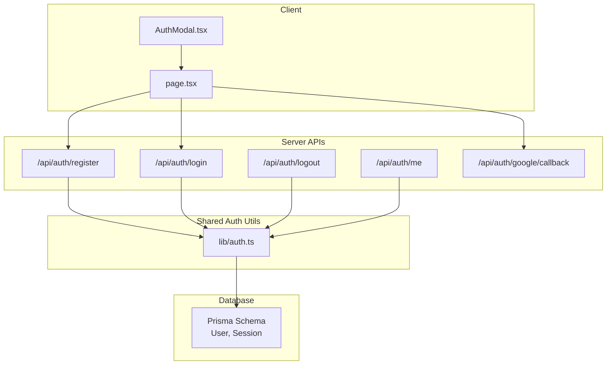
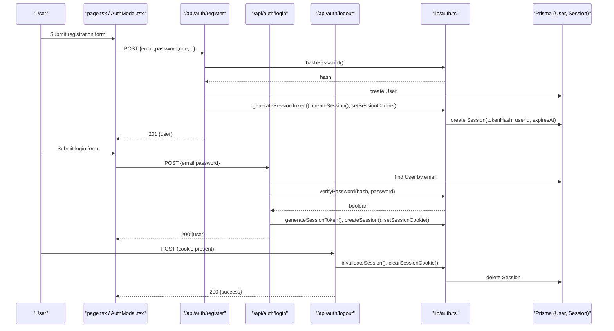
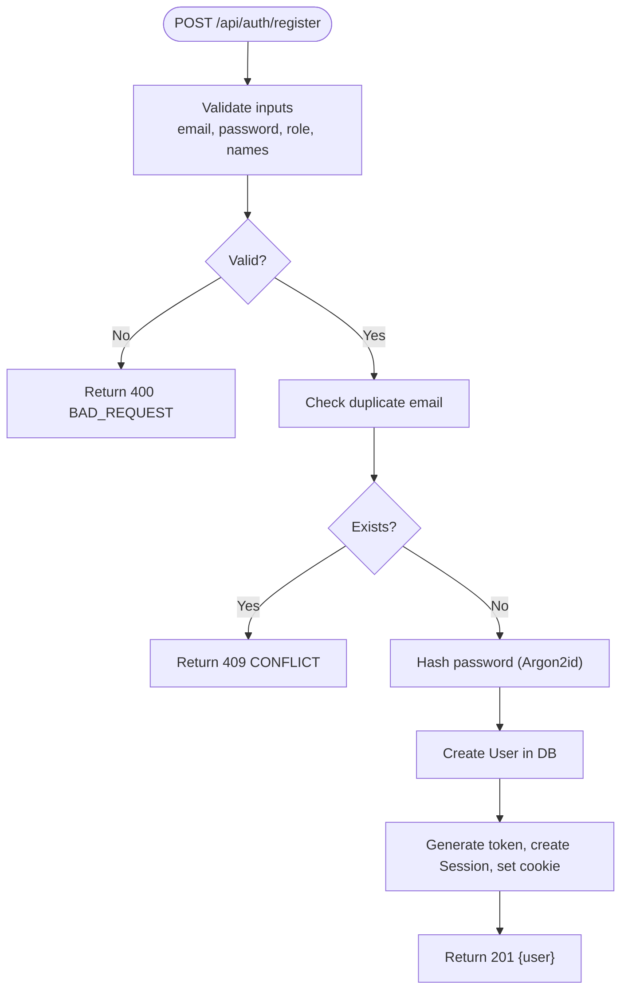
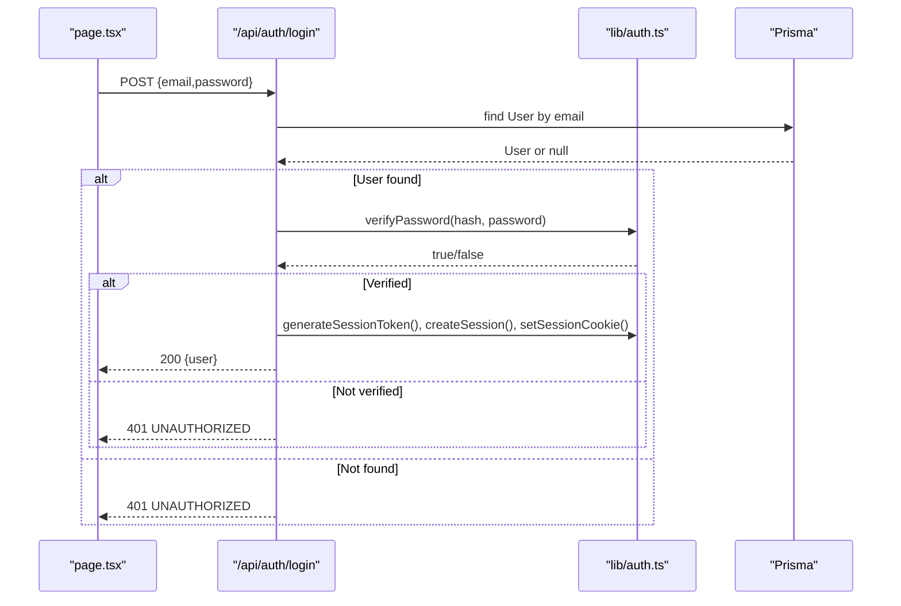
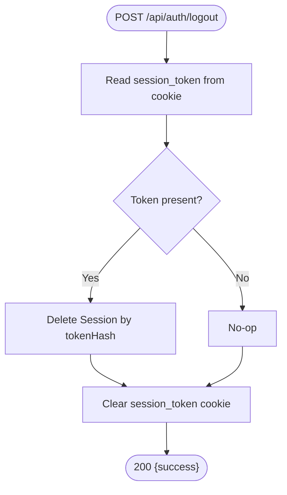
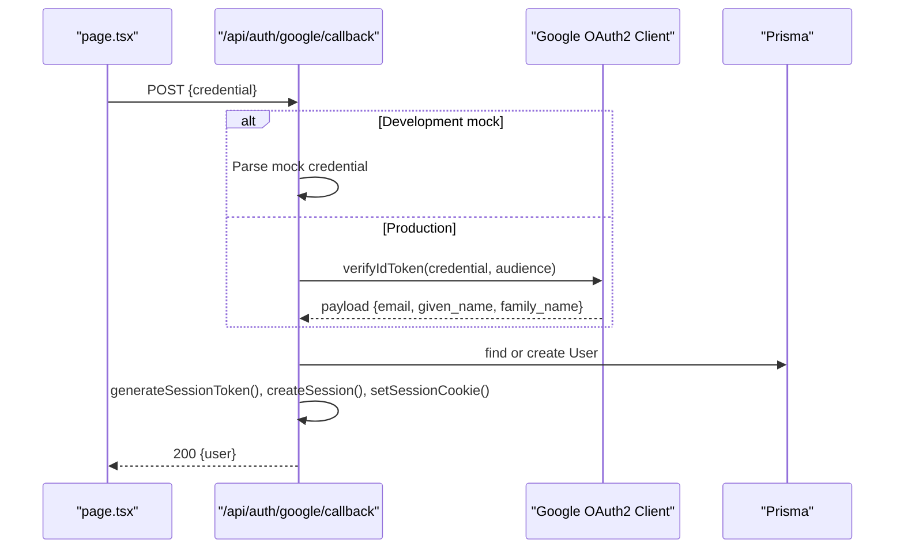
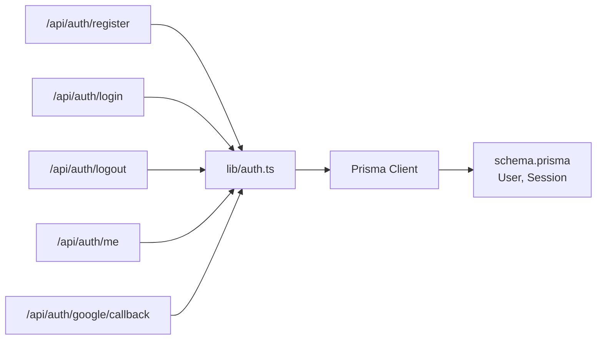
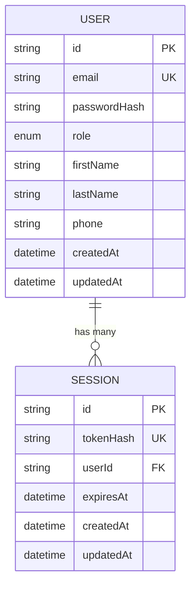

# Authentication Flows

<cite>
**Referenced Files in This Document**
- [route.ts](file://app/api/auth/register/route.ts)
- [route.ts](file://app/api/auth/login/route.ts)
- [route.ts](file://app/api/auth/logout/route.ts)
- [route.ts](file://app/api/auth/me/route.ts)
- [route.ts](file://app/api/auth/google/callback/route.ts)
- [auth.ts](file://lib/auth.ts)
- [schema.prisma](file://prisma/schema.prisma)
- [AuthModal.tsx](file://app/components/AuthModal.tsx)
- [page.tsx](file://app/page.tsx)
</cite>

## Table of Contents
1. [Introduction](#introduction)
2. [Project Structure](#project-structure)
3. [Core Components](#core-components)
4. [Architecture Overview](#architecture-overview)
5. [Detailed Component Analysis](#detailed-component-analysis)
6. [Dependency Analysis](#dependency-analysis)
7. [Performance Considerations](#performance-considerations)
8. [Troubleshooting Guide](#troubleshooting-guide)
9. [Conclusion](#conclusion)
10. [Appendices](#appendices)

## Introduction
This document explains PETIVA’s authentication flows with a focus on email/password registration and login, session management, logout, and Google OAuth integration. It covers the complete user journey from form submission to account creation, password hashing with Argon2, role assignment, session token generation and cookie handling, redirect logic, and error handling for invalid credentials, duplicate emails, and network failures. It also provides guidance on extending the system with custom handlers and additional providers.

## Project Structure
The authentication system is implemented as Next.js API routes under app/api/auth, backed by Prisma models and shared utilities in lib/auth.ts. The client-side UI uses a modal component and the landing page to orchestrate flows.

**Diagram sources**
- [route.ts:6-77](file://app/api/auth/register/route.ts#L6-L77)
- [route.ts:5-57](file://app/api/auth/login/route.ts#L5-L57)
- [route.ts:5-24](file://app/api/auth/logout/route.ts#L5-L24)
- [route.ts:4-32](file://app/api/auth/me/route.ts#L4-L32)
- [route.ts:6-97](file://app/api/auth/google/callback/route.ts#L6-L97)
- [auth.ts:10-124](file://lib/auth.ts#L10-L124)
- [schema.prisma:30-66](file://prisma/schema.prisma#L30-L66)

**Section sources**
- [route.ts:6-77](file://app/api/auth/register/route.ts#L6-L77)
- [route.ts:5-57](file://app/api/auth/login/route.ts#L5-L57)
- [route.ts:5-24](file://app/api/auth/logout/route.ts#L5-L24)
- [route.ts:4-32](file://app/api/auth/me/route.ts#L4-L32)
- [route.ts:6-97](file://app/api/auth/google/callback/route.ts#L6-L97)
- [auth.ts:10-124](file://lib/auth.ts#L10-L124)
- [schema.prisma:30-66](file://prisma/schema.prisma#L30-L66)
- [AuthModal.tsx:1-205](file://app/components/AuthModal.tsx#L1-L205)
- [page.tsx:113-149](file://app/page.tsx#L113-L149)

## Core Components
- Registration handler: validates input, checks duplicates, hashes password with Argon2, creates user, issues session, sets cookie.
- Login handler: validates credentials using Argon2 verification, issues session, sets cookie.
- Logout handler: invalidates session and clears cookie.
- Current user endpoint: resolves authenticated user from cookie via session validation.
- Google OAuth callback: verifies Google ID token (or mock), finds or creates user, issues session, sets cookie.
- Shared auth utilities: password hashing/verification, session token generation/hashing, session CRUD, cookie helpers, and auth guards.

**Section sources**
- [route.ts:6-77](file://app/api/auth/register/route.ts#L6-L77)
- [route.ts:5-57](file://app/api/auth/login/route.ts#L5-L57)
- [route.ts:5-24](file://app/api/auth/logout/route.ts#L5-L24)
- [route.ts:4-32](file://app/api/auth/me/route.ts#L4-L32)
- [route.ts:6-97](file://app/api/auth/google/callback/route.ts#L6-L97)
- [auth.ts:10-124](file://lib/auth.ts#L10-L124)

## Architecture Overview
PETIVA uses database-backed sessions with secure cookies. Passwords are hashed with Argon2id. Sessions are stored as hashed tokens with expiration and sliding-window extension. Role-based access control is enforced via helper functions.

**Diagram sources**
- [route.ts:6-77](file://app/api/auth/register/route.ts#L6-L77)
- [route.ts:5-57](file://app/api/auth/login/route.ts#L5-L57)
- [route.ts:5-24](file://app/api/auth/logout/route.ts#L5-L24)
- [auth.ts:10-124](file://lib/auth.ts#L10-L124)
- [schema.prisma:30-66](file://prisma/schema.prisma#L30-L66)

## Detailed Component Analysis

### Email/Password Registration Flow
- Input validation: required fields checked; role validated against allowed enum values; minimum password length enforced.
- Duplicate check: prevents creating users with existing email.
- Password hashing: Argon2id used to hash passwords before storage.
- User creation: stores email, hashed password, role, name, phone.
- Session issuance: generates opaque token, stores hashed token with expiry, sets HttpOnly cookie.
- Response: returns minimal user profile without sensitive data.

**Diagram sources**
- [route.ts:6-77](file://app/api/auth/register/route.ts#L6-L77)
- [auth.ts:10-124](file://lib/auth.ts#L10-L124)
- [schema.prisma:30-66](file://prisma/schema.prisma#L30-L66)

**Section sources**
- [route.ts:6-77](file://app/api/auth/register/route.ts#L6-L77)
- [auth.ts:10-124](file://lib/auth.ts#L10-L124)
- [schema.prisma:30-66](file://prisma/schema.prisma#L30-L66)

### Email/Password Login Flow
- Validates presence of email and password.
- Looks up user by email; rejects if missing or no password hash.
- Verifies password using Argon2 verification.
- On success, creates session, sets cookie, returns user profile.

**Diagram sources**
- [route.ts:5-57](file://app/api/auth/login/route.ts#L5-L57)
- [auth.ts:10-124](file://lib/auth.ts#L10-L124)
- [schema.prisma:30-66](file://prisma/schema.prisma#L30-L66)

**Section sources**
- [route.ts:5-57](file://app/api/auth/login/route.ts#L5-L57)
- [auth.ts:10-124](file://lib/auth.ts#L10-L124)

### Logout Flow
- Reads session token from cookie.
- Invalidates session by deleting matching Session record.
- Clears session cookie.
- Returns success response.

**Diagram sources**
- [route.ts:5-24](file://app/api/auth/logout/route.ts#L5-L24)
- [auth.ts:10-124](file://lib/auth.ts#L10-L124)

**Section sources**
- [route.ts:5-24](file://app/api/auth/logout/route.ts#L5-L24)
- [auth.ts:10-124](file://lib/auth.ts#L10-L124)

### Google OAuth Callback Flow
- Accepts Google credential (ID token).
- In development, supports a mock credential format for testing.
- Verifies token using Google OAuth2 client (production).
- Extracts email and name; finds or creates user (default role PET_OWNER).
- Issues session and sets cookie.

**Diagram sources**
- [route.ts:6-97](file://app/api/auth/google/callback/route.ts#L6-L97)
- [auth.ts:10-124](file://lib/auth.ts#L10-L124)
- [schema.prisma:30-66](file://prisma/schema.prisma#L30-L66)

**Section sources**
- [route.ts:6-97](file://app/api/auth/google/callback/route.ts#L6-L97)
- [auth.ts:10-124](file://lib/auth.ts#L10-L124)

### Current User Endpoint
- Retrieves current user from cookie via session validation.
- Returns user profile if authenticated; otherwise 401.

**Section sources**
- [route.ts:4-32](file://app/api/auth/me/route.ts#L4-L32)
- [auth.ts:10-124](file://lib/auth.ts#L10-L124)

### Client-Side Orchestration
- The landing page coordinates form submission to register/login endpoints and handles redirects based on user role.
- The AuthModal renders the unified sign-in/sign-up UI and integrates Google Sign-In button rendering.

**Section sources**
- [page.tsx:113-149](file://app/page.tsx#L113-L149)
- [AuthModal.tsx:1-205](file://app/components/AuthModal.tsx#L1-L205)

## Dependency Analysis
- API routes depend on Prisma client for database operations and on lib/auth.ts for cryptographic and session utilities.
- lib/auth.ts depends on Node crypto and argon2 for hashing and token generation, and Prisma for session persistence.
- Database schema defines User and Session models with appropriate indexes and relationships.

**Diagram sources**
- [route.ts:6-77](file://app/api/auth/register/route.ts#L6-L77)
- [route.ts:5-57](file://app/api/auth/login/route.ts#L5-L57)
- [route.ts:5-24](file://app/api/auth/logout/route.ts#L5-L24)
- [route.ts:4-32](file://app/api/auth/me/route.ts#L4-L32)
- [route.ts:6-97](file://app/api/auth/google/callback/route.ts#L6-L97)
- [auth.ts:10-124](file://lib/auth.ts#L10-L124)
- [schema.prisma:30-66](file://prisma/schema.prisma#L30-L66)

**Section sources**
- [auth.ts:10-124](file://lib/auth.ts#L10-L124)
- [schema.prisma:30-66](file://prisma/schema.prisma#L30-L66)

## Performance Considerations
- Session lookups occur on every protected request; ensure proper indexing on tokenHash and expiresAt to maintain low latency.
- Argon2 hashing is CPU-intensive; consider rate limiting registration and login endpoints to mitigate brute-force attempts.
- Sliding window expiration extends sessions near expiry; monitor session table growth and implement periodic cleanup jobs if needed.

[No sources needed since this section provides general guidance]

## Troubleshooting Guide
Common errors and their handling:

- Missing or invalid inputs during registration:
  - Validation returns 400 with descriptive code and message.
  - Ensure all required fields are provided and role is valid.

- Duplicate email during registration:
  - Returns 409 conflict; handle by prompting user to use another email or log in.

- Invalid credentials during login:
  - Returns 401 unauthorized; do not reveal whether email exists vs password wrong for security.

- Network failures:
  - Client catches fetch exceptions and shows connection error; retry logic can be added at the UI layer.

- Google OAuth failures:
  - Missing client ID or invalid token payload results in 401; verify environment configuration and token integrity.

- Logout issues:
  - If session invalidation fails, cookie is still cleared; subsequent requests will be unauthenticated.

Error handling locations:
- Registration route error block
- Login route error block
- Logout route error block
- Current user route error block
- Google callback error block
- Client-side catch blocks in page.tsx

**Section sources**
- [route.ts:6-77](file://app/api/auth/register/route.ts#L6-L77)
- [route.ts:5-57](file://app/api/auth/login/route.ts#L5-L57)
- [route.ts:5-24](file://app/api/auth/logout/route.ts#L5-L24)
- [route.ts:4-32](file://app/api/auth/me/route.ts#L4-L32)
- [route.ts:6-97](file://app/api/auth/google/callback/route.ts#L6-L97)
- [page.tsx:113-149](file://app/page.tsx#L113-L149)

## Conclusion
PETIVA’s authentication system implements secure email/password registration and login with Argon2 hashing, database-backed sessions with secure cookies, and a Google OAuth flow. Roles are assigned at registration or defaulted for OAuth sign-ups. Logout properly invalidates sessions and clears cookies. Error handling is consistent across endpoints, and the client orchestrates flows with role-based redirects. The design supports extensibility for additional providers and custom handlers.

[No sources needed since this section summarizes without analyzing specific files]

## Appendices

### Data Models Relevant to Authentication

**Diagram sources**
- [schema.prisma:30-66](file://prisma/schema.prisma#L30-L66)

### Extending Authentication Providers
To add a new provider:
- Implement a new callback route similar to Google’s, verifying the provider’s token and extracting identity claims.
- Reuse lib/auth.ts functions to generate sessions and set cookies.
- Handle user lookup or creation, assigning roles appropriately.
- Update client-side UI to trigger the new provider flow and handle redirects based on role.

Example reference points:
- Provider callback pattern: see Google callback implementation.
- Session setup: reuse generateSessionToken, createSession, setSessionCookie.

**Section sources**
- [route.ts:6-97](file://app/api/auth/google/callback/route.ts#L6-L97)
- [auth.ts:10-124](file://lib/auth.ts#L10-L124)

### Custom Authentication Handlers
- To enforce authentication on server components or actions, use requireAuth or requireRole helpers from lib/auth.ts.
- For middleware-level protection, integrate getCurrentUser checks in Next.js middleware to redirect unauthenticated users.

**Section sources**
- [auth.ts:10-124](file://lib/auth.ts#L10-L124)